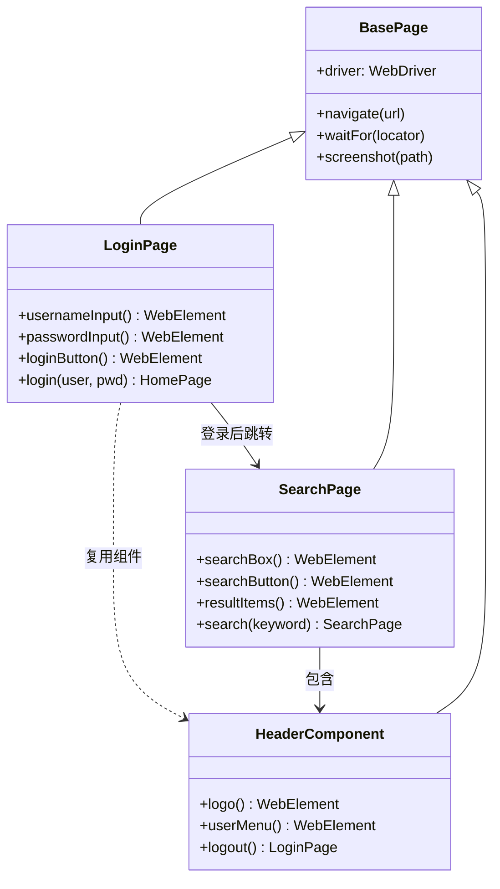
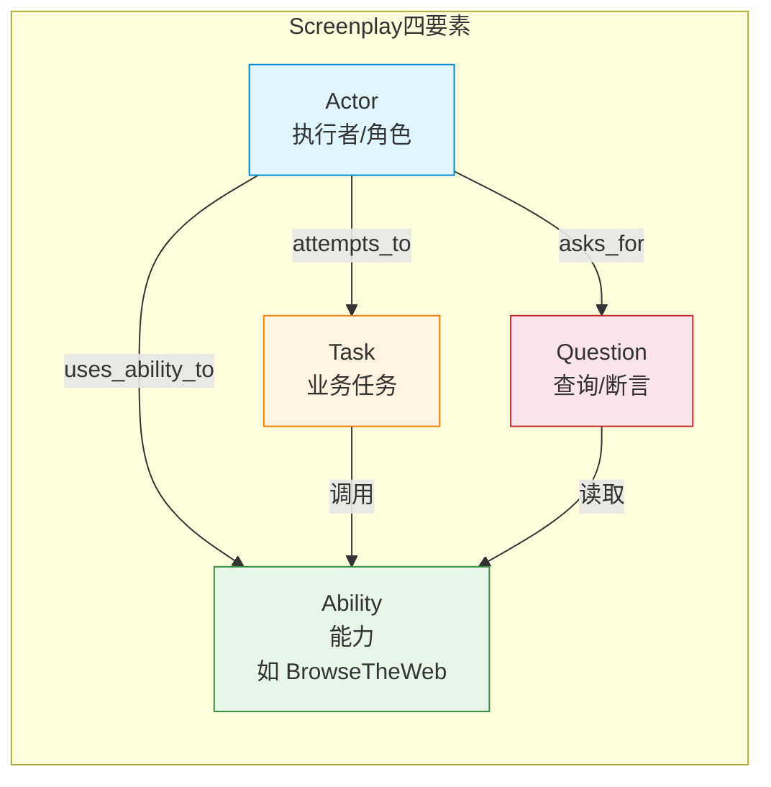

# Page Object 与 Screenplay 模式

GUI 自动化测试在用例数量突破几十条之后，会迅速进入"维护成本爆炸"的困境：定位器散落在脚本里、操作步骤重复堆叠、页面一改全员加班。设计模式的引入正是为了把"流水账脚本"重构为可读、可复用、可演进的工程化代码。本文系统讲解 Page Object、Component Object、Screenplay 三种主流模式，并给出 2024-2026 年在现代框架下的落地实践。

## 一、核心概念：为什么需要设计模式

### 1.1 流水账脚本的四大原罪

早期 GUI 测试脚本通常是"定位-操作-断言"的顺序堆叠：

```java
// 典型的流水账脚本：业务意图被技术细节淹没
driver.findElement(By.name("username")).sendKeys("admin");
driver.findElement(By.name("password")).sendKeys("123456");
driver.findElement(By.id("login-btn")).click();
assert driver.getTitle().contains("Welcome");
driver.findElement(By.linkText("图书")).click();
driver.findElement(By.id("search-box")).sendKeys("软件测试");
driver.findElement(By.id("search-btn")).click();
```

这种写法存在四个突出问题：业务意图被淹没、定位器重复硬编码、跨用例无法复用、页面变更需逐行修改。当用例从十条增长到上百条时，维护成本呈非线性攀升。

### 1.2 脚本与数据解耦

设计模式引入之前，必须先解决"脚本与数据耦合"这一前置问题。**数据驱动测试（DDT）** 将测试数据从脚本中剥离到外部数据源（CSV/JSON/YAML/数据库），脚本通过参数化机制注入数据。JUnit 5 的 `@ParameterizedTest + @CsvSource`、pytest 的 `@pytest.mark.parametrize`、Playwright 的参数化 fixture 都是主流实现。对于随机性数据，可借助 Faker 动态生成用户名、密码、地址等，避免测试数据固化导致的"数据耦合"问题。

数据驱动解决的是"同一流程不同数据"的复用问题，而本文重点讨论的设计模式解决的是"流程本身的复用与演进"问题。两者正交，常常组合使用——一份 Page Object 配合参数化数据源，可同时支撑回归测试、边界测试与异常测试。

### 1.3 模块化封装：PO 的前奏

在引入 PO 之前，通常会先做**模块化封装**：把通用操作（登录、登出、搜索）打包成命名清晰的函数，测试用例通过函数调用编排流程。模块化让用例可读性立即提升，但操作函数内部仍是"定位+操作"混杂，且引入两个新问题：操作函数粒度如何控制、操作函数之间的页面如何衔接。这两个问题正是后续业务流程抽象与 Screenplay 模式要解决的核心。

## 二、Page Object 模式

### 2.1 核心理念

Page Object（PO）以页面为单位，封装页面上的控件定位器与对该控件的操作。测试用例不再直接调用底层 `findElement`，而是通过页面对象暴露的业务方法完成操作，典型调用形态为 `loginPage.login(user, pwd)`。

PO 的核心价值在于**单一职责**：页面结构变化只影响对应的 Page 类，业务流程编排只关心 Page 之间的协作。

### 2.2 类层级结构



### 2.3 Java + Selenium 实现

```java
// BasePage.java —— 基础页面类，封装通用能力
public abstract class BasePage {
    protected final WebDriver driver;
    private final WebDriverWait wait;

    protected BasePage(WebDriver driver) {
        this.driver = driver;
        // Selenium 4 推荐显式等待，最长 10 秒
        this.wait = new WebDriverWait(driver, Duration.ofSeconds(10));
    }

    // 导航到指定 URL
    public void navigate(String url) { driver.get(url); }

    // 显式等待元素可见
    protected WebElement waitFor(By locator) {
        return wait.until(ExpectedConditions.visibilityOfElementLocated(locator));
    }

    // 截图用于失败排查
    public void takeScreenshot(String path) {
        File src = ((TakesScreenshot) driver).getScreenshotAs(OutputType.FILE);
        try { Files.copy(src.toPath(), Paths.get(path)); } catch (IOException ignored) {}
    }
}

// LoginPage.java —— 登录页面对象
public class LoginPage extends BasePage {
    // 定位器集中声明，便于维护
    private final By username = By.id("username");
    private final By password = By.id("password");
    private final By loginBtn = By.id("login-btn");

    public LoginPage(WebDriver driver) { super(driver); }

    // 业务级方法：返回目标页面对象，实现类型安全的页面流
    public HomePage login(String user, String pwd) {
        waitFor(username).sendKeys(user);
        waitFor(password).sendKeys(pwd);
        waitFor(loginBtn).click();
        return new HomePage(driver);
    }
}
```

### 2.4 Page Factory 与注解定位

Selenium 提供 `@FindBy` 注解配合 `PageFactory.initElements` 实现声明式元素注入，减少样板代码。但在 Selenium 4 之后，官方更推荐使用 `PageFactory` 配合 `AjaxElementLocatorFactory` 实现"按需懒加载"，避免页面初始化时全量查找元素导致的性能损耗。

```java
public class LoginPage extends BasePage {
    @FindBy(id = "username")        private WebElement usernameInput;
    @FindBy(id = "password")        private WebElement passwordInput;
    @FindBy(id = "login-btn")       private WebElement loginButton;

    public LoginPage(WebDriver driver) {
        super(driver);
        // 懒加载：仅在首次访问元素时查找，超时 5 秒
        PageFactory.initElements(
            new AjaxElementLocatorFactory(driver, 5), this);
    }
}
```

### 2.5 PO 五大设计原则

Selenium Wiki 与 Playwright 官方文档共同推荐以下原则：

1. **公共方法暴露业务服务**，而非 `click()`、`type()` 等底层操作；
2. **不暴露内部状态**：定位器与 DOM 结构对测试用例不可见；
3. **断言归测试**：Page 不做业务断言，仅做页面加载级别的基本验证；
4. **页面跳转返回目标 Page**：实现类型安全的页面流导航；
5. **组件化封装**：可复用 UI 区块单独抽象为 Component 对象。

## 三、Page Object 进阶：Component Object

### 3.1 为什么需要组件对象

随着微前端与组件化前端（React/Vue 组件库）的普及，同一个 UI 区块（顶部导航、用户菜单、分页器、购物车浮层）会出现在多个页面中。如果每个 Page 都重复声明这些定位器，组件变更时仍需逐页修改。**Component Object** 把可复用 UI 区块封装为独立对象，被多个 Page 组合复用。

### 3.2 适配微前端的实践

微前端架构下，一个页面可能由多个独立子应用组合而成，每个子应用有独立的 DOM 根与发布周期。Component Object 为每个子应用封装独立组件，Page 通过组合多个 Component 形成完整页面，子应用升级时只需修改对应 Component。

```typescript
// components/HeaderComponent.ts —— TypeScript + Playwright 组件对象
import { Page, Locator } from '@playwright/test';

export class HeaderComponent {
  // 组件根节点，由外部传入，便于复用到不同页面
  constructor(private readonly root: Locator) {}

  get userMenu(): Locator {
    return this.root.locator('[data-testid="user-menu"]');
  }

  get logoutButton(): Locator {
    return this.root.locator('[data-testid="logout-btn"]');
  }

  // 业务操作：登出，返回登录页对象
  async logout(): Promise<void> {
    await this.userMenu.click();
    await this.logoutButton.click();
  }
}

// pages/SearchPage.ts —— 页面通过组合复用组件
export class SearchPage {
  constructor(private readonly page: Page) {}

  // 暴露 header 组件供测试用例调用
  get header(): HeaderComponent {
    return new HeaderComponent(this.page.locator('header'));
  }

  async search(keyword: string): Promise<void> {
    await this.page.locator('#search-box').fill(keyword);
    await this.page.locator('#search-btn').click();
  }

  // 供断言使用的查询方法：返回当前结果条数
  async resultCount(): Promise<number> {
    return this.page.locator('.result-item').count();
  }
}
```

## 四、Screenplay 模式

### 4.1 PO 的瓶颈

Page Object 在中大型项目稳定运行多年，但随着业务复杂度上升，逐渐暴露三个结构性问题：

1. **Page 类膨胀**：复杂页面的操作方法动辄上百个，单类数千行；
2. **流程复用困难**：跨多个页面的业务流程（如"登录→搜索→下单→支付"）无处安放，常被复制到测试用例中；
3. **可测试性差**：Page 既是状态容器又是行为集合，难以做单元级别的隔离测试。

Screenplay 模式由 Antony Marcano 等人在 2013 年提出，2016 年后通过 Serenity BDD 框架在 Java 生态成熟，2022 年起逐步向 TypeScript/Python 生态渗透，作为 PO 的演进替代方案被广泛讨论。

### 4.2 四要素：Actor / Task / Ability / Question



- **Actor（执行者）**：代表测试中的角色（如"已登录用户"），持有能力，发起任务与提问；
- **Ability（能力）**：Actor 与外部世界交互的桥梁，如 `BrowseTheWeb`（操作浏览器）、`CallAnApi`（调用 API）、`MoveMouse`；
- **Task（任务）**：业务级动作，由多个 Interaction 组成，描述"做什么"而非"怎么做"；
- **Question（提问）**：查询系统状态供断言使用，如"当前页面标题是什么""购物车中有几件商品"。

### 4.3 TypeScript Screenplay 示例

```typescript
// screenplay/Actor.ts —— 执行者
export class Actor {
  constructor(private readonly name: string, private abilities: Map<string, any> = new Map()) {}

  // 注册能力
  can<T>(ability: T, key: string = 'default'): this {
    this.abilities.set(key, ability);
    return this;
  }

  // 使用能力
  uses<T>(key: string = 'default'): T {
    return this.abilities.get(key);
  }

  // 执行任务
  attemptsTo(...tasks: Task[]): Promise<void> {
    return tasks.reduce(
      (p, task) => p.then(() => task.performAs(this)),
      Promise.resolve()
    );
  }

  // 提问：返回系统状态供断言
  asks<T>(question: Question<T>): Promise<T> {
    return question.answeredBy(this);
  }
}

// tasks/Login.ts —— 业务任务
export class Login implements Task {
  constructor(private user: string, private pwd: string) {}

  static with(user: string, pwd: string) { return new Login(user, pwd); }

  async performAs(actor: Actor): Promise<void> {
    const page = actor.uses<Page>('web');   // 取出浏览页面能力
    await page.locator('#username').fill(this.user);
    await page.locator('#password').fill(this.pwd);
    await page.locator('#login-btn').click();
  }
}

// questions/PageTitle.ts —— 状态提问
export class PageTitle implements Question<string> {
  async answeredBy(actor: Actor): Promise<string> {
    return actor.uses<Page>('web').title();
  }
}

// 测试用例：业务语义清晰，复用性高
const user = new Actor('已登录用户').can(page, 'web');
await user.attemptsTo(Login.with('admin', '123456'));
const title = await user.asks(new PageTitle());
expect(title).toContain('Welcome');
```

### 4.4 Screenplay vs Page Object

| 维度 | Page Object | Screenplay |
|------|-------------|------------|
| 抽象单位 | 页面 | 角色与任务 |
| 流程复用 | 弱（需 Flow 层补充） | 强（Task 天然可组合） |
| 单一职责 | Page 兼状态与行为 | Actor/Task/Question 各司其职 |
| 多角色场景 | 不自然 | 原生支持（多 Actor 实例） |
| 学习曲线 | 平缓 | 较陡 |
| 生态支持 | 全框架通用 | Serenity BDD、screenplay-ts |
| 可测试性 | Page 难以单元隔离 | Task/Question 可独立测试 |
| 并行安全 | 需手动管理状态 | Actor 实例天然隔离 |

选型建议：**小型项目或页面稳定**继续使用 PO；**多角色业务流程复杂**（如电商、金融的多角色协作）优先 Screenplay；**两者并非互斥**——Screenplay 中的 Task 内部仍可调用 Page Object 完成底层交互，形成"PO 描述页面、Screenplay 描述流程"的分层协作。在 2024-2026 年的实践中，越来越多团队采用"PO 为底座、Screenplay 描述跨页流程"的混合模式，既保留了 PO 的低门槛，又获得了 Screenplay 的流程复用能力。

## 五、业务流程抽象

### 5.1 操作函数粒度控制

引入操作函数后立刻面临**粒度问题**：粒度太大失去复用性（如把"登录+搜索+下单"打包成一个函数），粒度太小失去抽象收益（每个 click 一个函数）。控制依据是：**以完成一个业务流程为主线，抽象出高内聚低耦合的操作步骤集合**。例如"信用卡绑定"涉及输入卡号、设置有效期、验证 CVV、确认绑定，逻辑独立，应封装为一个操作函数。

### 5.2 业务流程脚本化

业务流程（Business Flow）是操作函数之上更高层次的抽象。每个 Flow 封装一段完整业务（如 `LoginFlow`、`CheckoutBookFlow`），通过 `withStartPage` / `getEndPage` 实现页面衔接，通过 `getOutput` 实现跨 Flow 参数传递。

```java
// 业务流程组合：登录→搜索→下单→登出
LoginFlow login = new LoginFlow(new LoginFlowParams("admin", "pwd"));
login.execute();

SearchBookFlow search = new SearchBookFlow(new SearchBookFlowParams("软件测试"));
search.withStartPage(login.getEndPage()).execute();

CheckoutBookFlow checkout = new CheckoutBookFlow(
    new CheckoutBookFlowParams(search.getOutput().getBookId()));
checkout.withStartPage(search.getEndPage()).execute();
```

### 5.3 关键字驱动

关键字驱动是业务流程抽象的进一步脱敏：测试用例以"关键字 + 数据"表格化描述，引擎解释执行。其本质是把"操作"也参数化，适合业务测试专家手工编写用例的场景。但关键字库的维护成本随业务规模线性增长，2024 年后逐步被**低代码测试平台**（如 Mabl、Katalon）与**AI 辅助生成**取代，纯代码化的 Flow 抽象仍是复杂场景的首选。

## 六、与现代框架结合

### 6.1 Playwright Fixture + Page Object

Playwright 的 Fixture 机制天然支持依赖注入与生命周期管理，与 PO 结合后可实现"声明式页面流"：Fixture 自动完成前置流程并注入已就绪的 Page 对象。

```typescript
// fixtures.ts —— Playwright 1.61
import { test as base, Page } from '@playwright/test';
import { LoginPage } from './pages/LoginPage';
import { SearchPage } from './pages/SearchPage';

type Fixtures = {
  loggedInPage: Page;       // 已登录页面
  searchPage: SearchPage;   // 搜索页面对象
};

export const test = base.extend<Fixtures>({
  loggedInPage: async ({ page }, use) => {
    const loginPage = new LoginPage(page);
    await loginPage.navigate('https://example.com/login');
    await loginPage.login('admin', '123456');  // 复用 PO
    await use(page);
  },
  searchPage: async ({ loggedInPage }, use) => {
    await use(new SearchPage(loggedInPage));
  },
});

// 测试用例：声明式组合，无前置样板代码
test('搜索书籍', async ({ searchPage }) => {
  await searchPage.search('软件测试');
  expect(await searchPage.resultCount()).toBeGreaterThan(0);
});
```

Fixture 依赖注入使业务流程组合从命令式变为声明式，并行安全（每个测试独立 Fixture 实例），生命周期由框架统一控制。

### 6.2 Cypress Custom Command + Page Object

Cypress 通过 `Cypress.Commands.add` 注册自定义命令，可把 PO 方法挂载到 `cy` 命名空间，形成与 PO 等价的链式调用风格：

```javascript
// cypress/support/commands.js —— Cypress 15.x
import { LoginPage } from '../pages/LoginPage';

Cypress.Commands.add('loginViaPO', (user, pwd) => {
  const loginPage = new LoginPage(cy);
  return loginPage.login(user, pwd);  // 复用 PO 实现
});

// 测试用例
describe('购书流程', () => {
  it('登录后搜索', () => {
    cy.loginViaPO('admin', '123456');
    cy.get('#search-box').type('软件测试');
  });
});
```

Cypress 内置的自动等待机制消除了 PO 中显式 `waitFor` 的样板代码，但需注意 Cypress 不支持 WebKit（Safari），跨浏览器场景仍需 Playwright 或 Selenium。

### 6.3 App Actions：移动端的演进

移动端测试（Appium / Espresso / XCUITest）中，传统 PO 直接操作 View 会受到动画与异步加载的强烈干扰。**App Actions** 模式由 Cypress 创始人 Brian Mann 在 Web 端提出，其在移动端的对应实践是 Espresso 生态的 Robot 模式：通过暴露应用内部的高层动作（如 `onView(...).perform(click())`）替代纯 UI 操作，绕过渲染层的不稳定。2024 年后 Appium 2.x 也支持通过 `mobile: deepLink`、`mobile: performEditorAction` 等 App Action 指令直接驱动应用，与 PO 结合形成"App Action 优先、UI 操作兜底"的移动端分层策略。

App Actions 的本质是把"通过 UI 触发的应用内行为"直接暴露为可调用接口，跳过渲染层的不确定性。例如电商 App 的"加入购物车"操作，传统 PO 需要点击商品→选择规格→点击加购按钮三步，每一步都受动画和列表滚动影响；而 App Action 可直接调用应用内的 `addToCart(productId, spec)` 方法，一步完成且无 UI 抖动。在 CI 回归测试中优先使用 App Actions 可显著提升稳定性与速度，仅在验收测试中保留少量真实 UI 操作路径。

## 七、常见陷阱与最佳实践

### 7.1 五大陷阱

1. **Page 类承载断言**：业务断言混入 Page 导致测试逻辑分散，失败定位困难；
2. **定位器硬编码字符串散落**：未集中声明，元素变更需全局搜索替换；
3. **PO 过度抽象**：小型项目套用完整 PO + Flow + Component 三层，维护成本反超收益；
4. **忽略页面跳转返回类型**：`login()` 返回 `void`，测试用例需手动 new 目标 Page，类型安全丢失；
5. **Fixture 状态污染**：Playwright Fixture 作用域设置不当（如使用 `worker` 作用域承载会话状态），导致并行用例相互影响。

### 7.2 最佳实践清单

- **分层清晰**：Page 描述页面、Component 描述可复用区块、Flow 描述业务流程、Task 描述角色任务，职责不交叉；
- **定位器集中**：每个 Page 类顶部用 `private final By` 或 `data-testid` 字符串集中声明，便于一次性维护；
- **优先使用 `data-testid`**：避免依赖易变的 CSS 类名与 XPath，Playwright/Selenium/Cypress 均原生支持；
- **断言归测试**：Page/Component/Flow 仅返回状态，断言由测试用例承担；
- **页面跳转返回目标 Page**：实现类型安全的页面流，编译期即可发现导航错误；
- **Fixture 作用域最小化**：默认 `function` 作用域，仅会话级 Fixture 用 `worker`；
- **混合 API/UI 策略**：数据准备用 API（快 10 倍），核心验证用 UI，缩短反馈周期；
- **AI 辅助维护**：2025 年起 Playwright、Mabl 等工具内置 AI 自愈定位器能力，可在元素属性漂移时自动重定位，配合 PO 使用可显著降低维护成本。

## 八、总结

Page Object 是 GUI 自动化测试的工程基石，通过"页面即对象"的封装把流水账脚本重构为可维护的工程代码；Component Object 将封装粒度从页面下沉到组件，适配微前端与组件化前端；Screenplay 模式则从"角色-任务-提问"角度重新组织测试代码，解决了 PO 在复杂业务流程下的瓶颈。现代框架（Playwright Fixture、Cypress Custom Command、Appium App Actions）为这些模式提供了更轻量的落地载体，AI 自愈定位器进一步降低了维护成本。模式选型无银弹：小型项目用薄 PO，中大型稳定项目用 PO + Component，复杂多角色业务用 Screenplay，混合场景用 API + UI 分层——根据项目特征组合，而非盲目套用单一模式。
