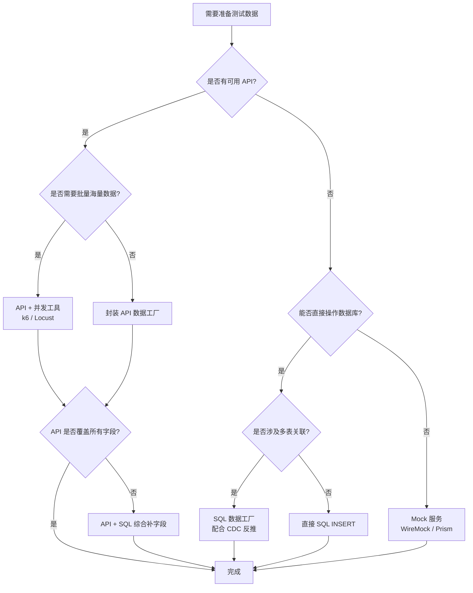
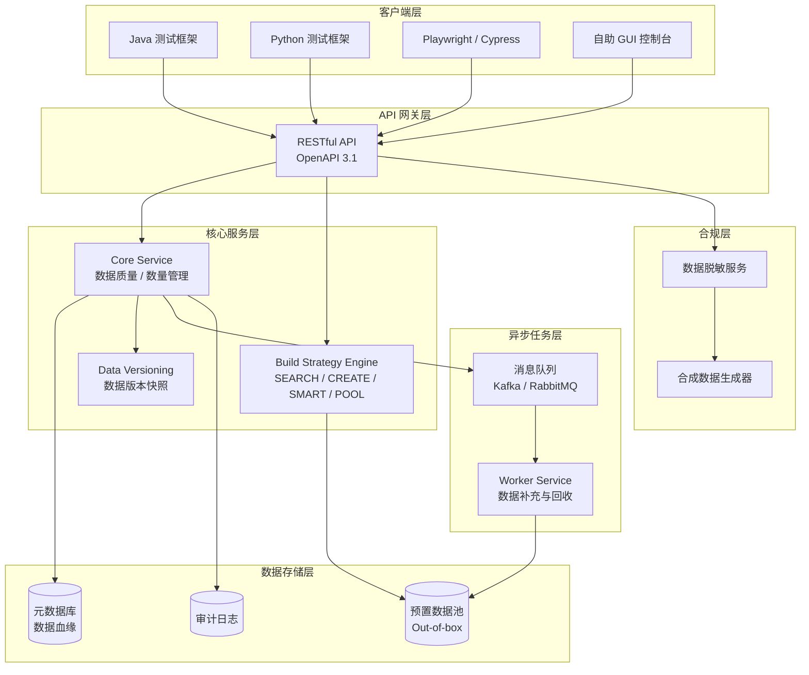

# 数据驱动测试（DDT）与测试数据策略

GUI 自动化测试的稳定性瓶颈往往不在页面操作本身，而在测试数据的准备、隔离与生命周期管理。一条用例从"绿"到"红"，多数情况下并不是因为元素定位漂移，而是因为前置用户已被删除、优惠券已被消费、订单状态被并行用例改写。本文系统梳理数据驱动测试（Data-Driven Testing, DDT）的实现方式、测试数据准备策略、Faker v9 实战、统一测试数据平台（TDP）架构，以及 2024–2026 年 AI 生成数据、合成数据、生产数据脱敏与 Testcontainers 等新趋势，帮助读者建立一套可演进、可治理的测试数据体系。

## 一、核心概念

### 1.1 DDT 的本质

数据驱动测试的本质是**将测试逻辑与测试输入解耦**：同一段测试代码，通过喂入不同的数据集，自动展开为多条测试用例。其价值在于：

- **覆盖效率**：一次编写，N 次执行，避免为每个等价类复制粘贴用例；
- **数据即文档**：测试意图通过数据表清晰表达，比散落在代码中的 `assert` 更易评审；
- **缺陷定位**：失败用例携带具体数据上下文，复现成本接近零。

与之相对的是关键字驱动测试（KDT），后者进一步将操作步骤抽象为关键字，DDT 关注的是"同一流程不同输入"，KDT 关注的是"不同流程的组合"。

### 1.2 测试数据的分类

测试数据可从两个维度划分。**按用途分**：测试输入数据（GUI 输入的用户名/密码）、前置准备数据（已注册的用户账号）、预期结果数据（断言期望值）、环境配置数据（URL、Feature Flag）。**按生命周期分**，则是工程实践中更关键的视角：

- **静态数据（Static / Out-of-box）**：环境搭建时预埋，相对稳定、可复用，如商品类目、品牌、基础账号；
- **动态数据（Dynamic / On-the-fly）**：用例执行时实时创建、用后即弃，如订单、优惠券、会话；
- **混合数据**：上游用静态、目标用动态，如订单 On-the-fly 创建时复用预置的卖家与买家。

一个常见的误区是把"静态"和"动态"绝对化。用户数据在大多数非用户相关用例中是静态的，但在测试"修改密码""注销账号"用例中则是动态的——分类由测试目的决定，而非数据本身。

## 二、DDT 实现方式

### 2.1 参数化机制

DDT 在工程上的落地形态是测试框架的参数化能力。Python 生态的 pytest 与 Java 生态的 JUnit 5 是两套主流范式。

**pytest 参数化**通过 `@pytest.mark.parametrize` 装饰器实现：

```python
# pytest 参数化：登录场景的等价类覆盖
import pytest

@pytest.mark.parametrize(
    "username, password, expected_code",  # 参数名
    [
        ("valid_user",  "Valid@123",  200),  # 正常登录
        ("valid_user",  "wrong_pwd",  401),  # 密码错误
        ("nonexistent", "any_pwd",    404),  # 用户不存在
        ("",            "Valid@123",  400),  # 用户名为空
    ],
    ids=["正常登录", "密码错误", "用户不存在", "用户名为空"]  # 用例标识，便于报告阅读
)
def test_login(username, password, expected_code, login_page):
    code = login_page.login(username, password)
    assert code == expected_code
```

**JUnit 5 参数化**通过 `@ParameterizedTest` 配合 `@CsvSource` / `@MethodSource` / `@ArgumentsSource` 实现：

```java
// JUnit 5 参数化测试：登录场景
import org.junit.jupiter.params.ParameterizedTest;
import org.junit.jupiter.params.provider.CsvSource;
import static org.junit.jupiter.api.Assertions.assertEquals;

class LoginTest {

    @ParameterizedTest(name = "用例{index}: {0} 登录预期 {2}")
    @CsvSource({
        "valid_user,  Valid@123,  200",  // 正常登录
        "valid_user,  wrong_pwd,  401",  // 密码错误
        "nonexistent, any_pwd,    404",  // 用户不存在
        "'',          Valid@123,  400"   // 用户名为空
    })
    void testLogin(String username, String password, int expectedCode) {
        int actual = loginPage.login(username, password);
        assertEquals(expectedCode, actual);
    }
}
```

两者核心差异：pytest 的参数化是装饰器驱动，数据直接写在 Python 列表中，灵活度高；JUnit 5 的 `@CsvSource` 适合简单场景，复杂对象需借助 `@MethodSource` 返回 `Stream<Arguments>`。

### 2.2 外部数据源：CSV / JSON / YAML

当数据规模增长或需跨团队协作时，应将数据外置为文件。三种格式的取舍：

| 格式 | 适用场景 | 优势 | 劣势 |
|------|---------|------|------|
| CSV  | 大量扁平数据、业务方提供 | Excel 可直接编辑 | 不支持嵌套、无类型 |
| JSON | 复杂对象、API 请求体 | 支持嵌套、语言无关 | 手工编辑易错 |
| YAML | 配置类数据、含注释 | 可读性最佳、支持注释 | 缩进敏感 |

pytest 加载 YAML 数据源的典型写法：

```python
# 从 YAML 文件加载测试数据
import pytest
import yaml

def load_test_data(path="tests/data/login_cases.yml"):
    with open(path, encoding="utf-8") as f:
        return yaml.safe_load(f)

@pytest.mark.parametrize("case", load_test_data(), ids=lambda c: c["name"])
def test_login_from_yaml(case, login_page):
    code = login_page.login(case["username"], case["password"])
    assert code == case["expected_code"]
```

配套的 `login_cases.yml`：

```yaml
- name: 正常登录
  username: valid_user
  password: Valid@123
  expected_code: 200
- name: 密码错误
  username: valid_user
  password: wrong_pwd
  expected_code: 401
```

## 三、测试数据准备策略

测试数据的**创建方式**与**创建时机**是两个独立维度。创建方式上，业界主流有 API 调用、数据库直插、Mock 服务、Faker 生成四条路径，下图给出选型决策树。



四种方式的对比如下：

| 方式 | 数据准确性 | 创建效率 | 维护成本 | 适用场景 |
|------|-----------|---------|---------|---------|
| API 调用 | 高（与生产同源） | 中 | 低 | 主流首选，业务逻辑变更自动同步 |
| 数据库直插 | 中（易漏附表） | 高 | 高 | API 不支持的字段、批量造数 |
| Mock 服务 | 低（虚拟响应） | 极高 | 中 | 下游不可用、模拟边界条件 |
| Faker 生成 | 中（格式合法） | 极高 | 低 | 输入数据、UI 演示、压力测试 |

**实践优先级**：API > Faker > 数据库 > Mock。API 保证业务正确性，Faker 解决输入多样性，数据库用于补 API 不支持的字段，Mock 仅用于隔离不可控的外部依赖。

## 四、Faker 数据生成实战

### 4.1 @faker-js/faker v9 概览

`@faker-js/faker` 是 Faker.js 社区维护的现代分支，2026 年最新稳定版为 v9.x。相比 v8.4.1，v9 的关键改进包括：完整的 ESM 支持、TypeScript 类型增强、新增 `finance.iban` / `science` 等模块、移除已废弃的 `faker.name.*`（统一至 `faker.person.*`）、本地化数据扩充至 70+ 区域。

```bash
# 安装最新版
npm install @faker-js/faker -D
```

### 4.2 基础用法与本地化

```typescript
// Faker v9 基础用法：生成中文本地化数据
import { fakerZH_CN as faker } from '@faker-js/faker';

const name = faker.person.fullName();        // 王小明
const phone = faker.phone.number();          // 13812345678
const email = faker.internet.email();        // wangxiaoming@example.com
const city = faker.location.city();          // 上海市
const idCard = faker.string.numeric(18);     // 18 位数字串（演示用）
```

按需引入单语言包可显著减小打包体积（从 5MB 降至约 200KB）：

```typescript
// 仅引入中文 locale，减小 bundle 体积
import { faker } from '@faker-js/faker/locale/zh_CN';
```

### 4.3 自定义数据生成器

Faker 不直接生成业务对象，需封装工厂函数。以下示例生成一个关联字段自洽的用户对象：

```typescript
// 自定义用户生成器：保证字段间逻辑一致
import { faker } from '@faker-js/faker';

interface User {
  id: string;
  username: string;
  email: string;
  sex: 'male' | 'female';
  age: number;
}

function createUser(overrides: Partial<User> = {}): User {
  const sex = overrides.sex ?? faker.person.sexType();
  const firstName = faker.person.firstName(sex);
  const lastName = faker.person.lastName();
  const username = `${firstName}.${lastName}`.toLowerCase();
  // 邮箱基于姓名生成，保证字段间自洽
  const email = faker.internet.email({ firstName, lastName });

  return {
    id: faker.string.uuid(),
    username,
    email,
    sex,
    age: faker.number.int({ min: 18, max: 65 }),
    ...overrides,  // 允许调用方覆盖任意字段
  };
}

// 与 Playwright 结合：注册流程测试
test('用户注册后可登录', async ({ page }) => {
  const user = { ...createUser(), password: 'Test@123456' };
  await page.goto('/register');
  await page.getByLabel('用户名').fill(user.username);
  await page.getByLabel('邮箱').fill(user.email);
  await page.getByLabel('密码').fill(user.password);
  await page.getByRole('button', { name: '注册' }).click();
  await expect(page).toHaveURL(/.*login/);
});
```

### 4.4 可复现的随机数据

测试失败时需用相同数据复现，通过 `seed` 实现：

```typescript
// 设置种子，保证同一套数据可复现
faker.seed(20260812);  // 固定种子
const u1 = createUser();
faker.seed(20260812);  // 重置后再次生成，结果一致
const u2 = createUser();
console.log(u1.email === u2.email);  // true
```

注意：跨 Faker 大版本时，因底层数据表更新，同一种子可能产生不同值。建议在 CI 中固定 Faker 版本，并在升级时回归验证。

## 五、统一测试数据平台（TDP）

### 5.1 演进阶段

测试数据管理经历了四个阶段：1.0 数据准备函数（参数爆炸）→ 2.0 Builder Pattern（链式调用，但跨语言受限）→ 3.0 统一测试数据平台（RESTful API 化、数据池自动补充）→ 4.0 智能化与合规化（AI 生成、合成数据）。中大型团队应至少演进至 3.0。

### 5.2 TDP 架构



### 5.3 三个关键能力

**API 化**：所有数据操作通过 RESTful API 暴露，跨语言、跨框架统一接入。测试用例只需一次 HTTP 调用即可获取数据，无需在本地维护复杂的 Builder 类。

**数据版本化**：TDP 为每批数据打版本标签，记录 schema 版本、创建时间、关联环境。当业务表结构变更导致旧数据失效时，可按版本回滚或重新生成。这与数据库迁移工具（Flyway / Liquibase）协同工作——TDP 监听迁移事件，自动触发受影响数据集的重建。

**自助化**：提供 GUI 控制台，测试人员可自助申请数据、查看数据池水位、回收到期数据。结合 RBAC 权限模型，不同团队拥有独立的数据命名空间，从根本上解决"跨团队脏数据"问题。

### 5.4 Build Strategy

TDP 通过四种构建策略封装创建时机：

- `SEARCH_ONLY`：仅搜索已有数据，找不到则失败；
- `CREATE_ONLY`：强制新建；
- `SMART`：先搜后建（最常用）；
- `POOL`：从预置数据池取用，池空则触发异步补充。

`SMART` 与 `POOL` 配合，可将 On-the-fly 的首次创建转化为后续用例的 Out-of-box 复用，显著降低数据准备耗时占比（从 30–40% 降至 10% 以下）。

## 六、2024–2026 新趋势

### 6.1 AI 生成测试数据

大语言模型（LLM）正在重塑测试数据生成。典型场景：用自然语言描述"需要一个已绑卡但未实名认证的中国用户"，LLM 自动转化为 TDP API 调用序列。优势在于处理复杂业务约束（"订单金额需在 100–500 之间且商品属于已下架类目"），这是传统 Faker 难以覆盖的。需注意 LLM 生成数据的确定性风险——建议将生成结果固化为测试夹具，避免每次运行结果漂移。

### 6.2 合成数据（Synthetic Data）

合成数据从零生成，不包含任何真实个人信息，从根本上解决隐私合规问题。与脱敏不同，合成数据保留统计特征但不含真实记录，方法包括基于统计模型的合成、基于 GAN 的合成（适用于非结构化数据）。Gretel.ai、Mostly AI 等商业方案已在金融、医疗行业落地。对于测试团队，合成数据是替代生产数据导出的合规路径。

### 6.3 生产数据脱敏

直接使用生产数据测试存在双重风险：合规违规（GDPR、《个人信息保护法》）与数据泄露。脱敏流水线的关键步骤：抽取 → 识别 PII（姓名、手机号、身份证号）→ 替换或哈希 → 审计日志。典型脱敏规则：邮箱保留域名替换用户名、手机号中间四位替换为 `****`、姓名替换为 Faker 随机姓名。脱敏应在专用环境中完成，测试环境只接收脱敏后的数据快照。

### 6.4 Testcontainers：容器化测试数据库

Testcontainers 是 2024 年后测试数据准备的标配工具，其核心价值是为每个测试套件启动一次性、隔离的数据库容器，测试结束后容器销毁、数据自然清理，从根本上消除"脏数据"问题。

```java
// Testcontainers + JUnit 5：为每个测试类启动独立 PostgreSQL
import org.testcontainers.containers.PostgreSQLContainer;
import org.testcontainers.junit.jupiter.Container;
import org.testcontainers.junit.jupiter.Testcontainers;

@Testcontainers
class UserRepositoryTest {

    @Container
    // 启动 PostgreSQL 16 容器，自动执行 init 脚本预埋 Out-of-box 数据
    static PostgreSQLContainer<?> postgres = new PostgreSQLContainer<>("postgres:16")
        .withDatabaseName("test_db")
        .withUsername("test")
        .withPassword("test")
        .withInitScript("seed-data/01_init_users.sql");  // 声明式注入种子数据

    @Test
    void should_find_user_by_id() {
        // 容器内数据库已预置 3 条用户数据，测试隔离且无副作用
        var repo = new UserRepository(postgres.getJdbcUrl());
        var user = repo.findById(1001L);
        assertEquals("test_user_01", user.getUsername());
    }
}
```

Testcontainers 的 Python 实现：

```python
# testcontainers-python：集成 pytest fixture
import pytest
from testcontainers.postgres import PostgresContainer

@pytest.fixture(scope="session")
def postgres_container():
    # 启动 PostgreSQL 容器，会话级共享
    with PostgresContainer("postgres:16") as pg:
        yield pg.get_connection_url()

def test_user_query(postgres_container):
    # 容器为会话级共享，用例需自行保证数据隔离
    conn = create_connection(postgres_container)
    assert conn.query("SELECT COUNT(*) FROM users") == 3
```

Testcontainers 的代价是启动耗时（约 2–5 秒/容器），适合集成测试与 E2E 测试，不适合单元测试。

## 七、常见陷阱与最佳实践

### 7.1 常见陷阱

1. **硬编码一次性数据**：用例中直接引用某个订单 ID，第二次执行必失败。应改为 On-the-fly 创建或从数据池取用。
2. **Mock 与真实行为漂移**：Mock 服务返回的数据结构长期未更新，与真实 API 不一致。应结合契约测试（Pact）定期校验。
3. **Faker 种子未固定**：随机生成的邮箱在 CI 中与本地不同，导致断言失败。应在测试套件启动时统一 `faker.seed()`。
4. **跨用例共享状态**：并行执行时多个用例同时修改同一条预置数据。应通过数据命名空间或 Testcontainers 隔离。
5. **数据池水位失守**：Out-of-box 数据被消耗殆尽未及时补充，导致用例批量失败。应监控数据池水位并设置自动告警。
6. **生产数据直连测试**：违反隐私法规且存在泄露风险。应通过脱敏流水线或合成数据替代。

### 7.2 最佳实践

- **分层策略**：基础数据 Out-of-box、业务数据 On-the-fly、敏感数据合成或脱敏；
- **数据即代码**：将数据定义纳入 Git 版本控制，通过 PR 评审变更；
- **工厂模式优先**：用 Builder Pattern 封装数据创建逻辑，对外只暴露关键参数；
- **契约校验**：Mock 数据需与真实 API 签订契约，定期同步；
- **生命周期管理**：创建 → 使用 → 清理 → 回收，四阶段闭环；
- **可观测性**：记录数据创建、使用、销毁全链路日志，便于排查"脏数据"来源。

测试数据治理不是一次性工程，而是随业务演进的持续过程。小型团队可从 Faker + 工厂模式起步，中型团队应建设 TDP，大型团队需引入合成数据与合规流水线。核心原则始终是：**数据与用例解耦、数据与生产隔离、数据可追溯可复现**。
