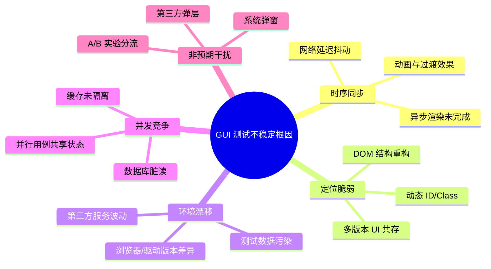
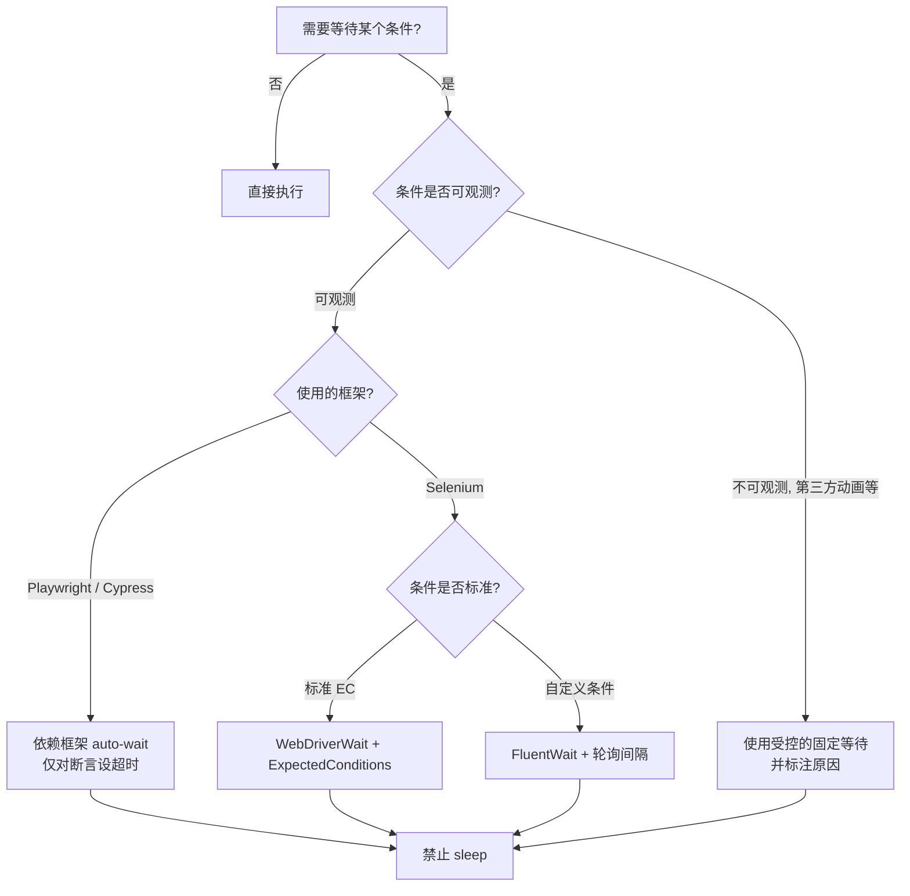
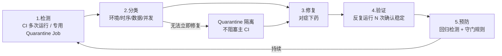

# GUI 测试稳定性：同步等待、自愈机制与 Flaky 治理

GUI 自动化测试的"最后一公里"问题，几乎都集中在稳定性上。同一份脚本、同一套环境，时而通过时而失败的现象——即 **Flaky Test**——是侵蚀测试可信度、拖垮 CI 流水线的头号元凶。本文围绕"同步等待、定位自愈、Flaky 治理"三条主线，梳理 2024-2026 年现代测试栈下的稳定性工程实践。

## 一、核心概念：GUI 测试为什么不稳定

### 1.1 Flaky Test 的定义与危害

**Flaky Test** 指在代码与环境均未变化的前提下，多次执行结果不一致的测试用例。Google 2020 年内部研究数据显示，约 16% 的测试用例存在 Flaky 现象，部分大型项目比例超过 30%；2024 年 GitHub 工程效能报告进一步指出，Flaky Test 是导致 CI 信号失效、开发人员绕过测试的首要原因。

其危害呈级联放大：

- **信任崩塌**：测试结果不可信 → 开发忽视失败 → 自动化体系失效。
- **CI 阻塞**：Flaky 失败阻断主分支合并，团队被迫反复重试或人工跳过。
- **资源浪费**：为绕过 Flaky 而配置的高重试次数，使 CI 运行时间成倍增长。
- **缺陷掩盖**：真正的回归缺陷淹没在 Flaky 噪声里，逃逸到生产环境。

### 1.2 不稳定的五大根因



理论上 GUI 测试可以做到 100% 稳定，但工程实践中 95% 已属优秀水平。下文按"等待 → 定位 → Flaky 治理 → 重试隔离 → 视觉回归"展开。

## 二、同步等待策略

同步等待是稳定性第一道防线。**绝大比例的 Flaky 来自错误的等待方式**——尤其是 `Thread.sleep` / `time.sleep` 这类硬等待。

### 2.1 等待方式分类

| 等待类型 | 机制 | 适用场景 | 风险 |
|---------|------|---------|------|
| **硬等待（sleep）** | 固定时长阻塞 | 调试、不可观测的第三方 | 浪费时间 / 仍可能失败 |
| **隐式等待（Implicit）** | 全局轮询找不到元素时等待 | 简单 Selenium 项目 | 与显式等待混用会叠加超时 |
| **显式等待（Explicit）** | 等待具体条件成立 | 复杂业务条件 | 需手写期望条件 |
| **FluentWait** | 显式等待 + 轮询间隔 + 忽略异常 | 高波动页面 | 配置略复杂 |
| **框架自动等待** | 操作前内置可操作性检查 | Playwright / Cypress 默认 | 需理解其判定边界 |

### 2.2 Selenium 显式等待与 FluentWait

```java
// WebDriver 显式等待示例
import org.openqa.selenium.support.ui.WebDriverWait;
import org.openqa.selenium.support.ui.ExpectedConditions;
import java.time.Duration;

WebDriverWait wait = new WebDriverWait(driver, Duration.ofSeconds(10));
// 等待元素可见且可点击
WebElement button = wait.until(
    ExpectedConditions.elementToBeClickable(By.id("submit"))
);
button.click();

// FluentWait：自定义轮询频率与忽略异常
import org.openqa.selenium.support.ui.FluentWait;
import org.openqa.selenium.NoSuchElementException;

FluentWait<WebDriver> fluent = new FluentWait<>(driver)
    .withTimeout(Duration.ofSeconds(30))      // 总超时 30 秒
    .pollingEvery(Duration.ofMillis(500))     // 每 500ms 轮询一次
    .ignoring(NoSuchElementException.class);  // 元素未出现时忽略，继续轮询

WebElement panel = fluent.until(d ->
    d.findElement(By.cssSelector(".result-panel"))
);
```

> **关键原则**：永远不要混用隐式等待与显式等待。Selenium 官方文档明确指出，二者叠加会导致超时时间不可预测，是 Flaky 的常见来源。

### 2.3 Playwright auto-waiting

Playwright 在执行任何 locator 操作前，会自动等待元素满足**可操作性条件**（attached、visible、stable、enabled、receives events），无需手写 wait：

```javascript
// Playwright 自动等待：以下操作均会等待元素就绪
test('自动等待示例', async ({ page }) => {
  await page.goto('/dashboard');
  // click 前自动等待：已挂载、可见、稳定、可接收事件
  await page.getByRole('button', { name: '提交' }).click();

  // 断言也会自动重试，直到超时
  await expect(page.getByText('操作成功')).toBeVisible({ timeout: 10000 });
});
```

### 2.4 Cypress retryability

Cypress 的命令本身具备重试能力，断言未通过时会持续重试该命令直到超时：

```javascript
// Cypress 自动重试：should 会驱动命令重试
cy.get('.status', { timeout: 15000 }).should('contain', '已完成');
```

### 2.5 等待策略决策树



## 三、定位策略稳定性与自愈机制

### 3.1 定位方式优先级

现代测试框架已形成共识的定位优先级：

1. **语义角色**：`getByRole('button', { name: '登录' })` —— 贴近用户行为，最稳定。
2. **可访问标签**：`getByLabel('用户名')`、`getByText('欢迎')`。
3. **测试钩子**：`getByTestId('submit')` / `data-cy="submit"` —— 与 UI 解耦，重构不破坏。
4. **结构化 CSS**：`.login-form > button` —— 脆弱，仅作兜底。
5. **XPath 绝对路径**：`/html/body/div[3]/...` —— 极度脆弱，禁止使用。

> **CSS vs XPath 的现代结论**：在 Playwright/Cypress 时代，二者差异已不显著。真正的稳定性来自"语义优先 + data-testid 兜底"，而非选择器语法本身。

### 3.2 相对定位（Relative Locators）

Selenium 4 引入的相对定位器，可在元素结构变化但相对关系稳定时使用：

```java
// Selenium 4 相对定位示例
import static org.openqa.selenium.support.locators.RelativeLocator.with;

// 在标签"密码"右侧的输入框
WebElement passwordInput = driver.findElement(
    with(By.tagName("input")).toRightOf(By.cssSelector("label[for='password']"))
);
passwordInput.sendKeys("secret");
```

### 3.3 自愈机制：Healenium 与 Mabl

**自愈（Self-healing）** 是 2024-2026 年定位稳定性的主流趋势。其核心思想：当原始定位器失效时，引擎基于历史快照与语义相似度，自动寻找最匹配的替代元素并继续执行，同时将新定位器回写学习库。

#### Healenium（Selenium 生态，开源）

Healenium 通过包装 `WebDriver`，记录每次成功定位的特征（标签、属性、文本、DOM 路径、邻域节点），失败时按相似度排序候选元素并自动替换。

```xml
<!-- Maven 依赖 -->
<dependency>
  <groupId>com.epam.healenium</groupId>
  <artifactId>healenium-web</artifactId>
  <version>3.5.1</version>
</dependency>
```

```java
// Healenium 自愈驱动初始化
import com.epam.healenium.SelfHealingDriver;

WebDriver delegate = new ChromeDriver();
// 用 SelfHealingDriver 包装原生 Driver
WebDriver driver = SelfHealingDriver.create(delegate);

// 即便原始 id 变了，引擎会从历史快照中自愈到正确元素
driver.findElement(By.id("login-btn-001")).click();
```

#### Mabl（商业 SaaS，AI 自愈）

Mabl 的自愈不依赖显式定位器，而是基于 ML 模型在训练阶段学习元素的"多模态特征"，运行时自动适配 UI 变更，无需脚本维护。其自愈日志会标注"自愈次数"与"匹配置信度"，便于评估脚本健康度。

#### Playwright 的"准自愈"：auto-waiting + 语义选择器

Playwright 本身无显式自愈引擎，但 `getByRole` / `getByText` 等语义选择器天然具备抗 UI 重构能力，配合 auto-waiting，覆盖了 80% 自愈场景。对自愈有更高要求时，可结合 `@playwright/test` 的 trace viewer 人工定位 + 重写选择器。

### 3.4 自愈机制的取舍

| 维度 | 自愈的优势 | 自愈的风险 |
|------|----------|----------|
| 维护成本 | 减少脚本修复工时 | 学习库需要治理 |
| 可信度 | 静默修复，CI 不红 | 可能掩盖真实缺陷 |
| 适用阶段 | 稳定期、维护期 | 新功能期建议关闭 |

**建议**：自愈不替代良好定位，而是兜底网。在 CI 中应输出"自愈次数报表"，自愈频繁的脚本必须重新审视定位策略。

## 四、Flaky Test 治理流程

Flaky 治理不是一次性活动，而是闭环流程。下图为完整的治理生命周期。



### 4.1 检测

- **CI 多次运行**：对同一 PR 跑 N 次（如 5 次），出现部分失败即判 Flaky。
- **专用 Flaky 检测 Job**：定期（如每晚）在 main 分支运行全量套件 10 次，统计 Flaky 率。
- **第三方 Flaky 检测工具**：BuildPulse、Trunk Flaky Tests 等可聚合历史运行结果，按 Flaky 率排序输出报告，并在 PR 评论中自动标注疑似 Flaky 用例。

### 4.2 分类

| 类型 | 典型表现 | 修复方向 |
|------|---------|---------|
| **环境类** | 特定机器/浏览器失败 | 容器化、统一镜像、资源隔离 |
| **时序类** | 偶发找不到元素 / 状态未就绪 | 替换 sleep 为显式/auto-wait |
| **数据类** | 重试后失败、跨用例污染 | 数据隔离、Fixture、独立账号 |
| **并发类** | 仅并行执行时失败 | 拆分共享状态、按用户分区 |

### 4.3 修复

修复必须针对根因，而非加 `sleep` 或提高重试次数——后者只是把 Flaky 推迟到生产。

- 时序类：迁移到 Playwright auto-wait，删除所有 `sleep`。
- 数据类：每个用例自带数据准备与清理（Fixture setup/teardown）。
- 并发类：使用 `test.parallel()` 时确保数据按 worker 隔离。
- 环境类：测试环境容器化（Docker / Playwright 的 `--with-deps`）。

### 4.4 验证

修复后需在隔离环境反复运行确认，建议至少 20 次连续通过才算"已修复"：

```bash
# Playwright 反复运行单测验证稳定性
npx playwright test tests/login.spec.ts --repeat-each=20 --workers=1
```

### 4.5 预防

- **守门规则**：新引入的测试若在 PR 中 Flaky，直接拦截合入。
- **Flaky 预算**：设定套件 Flaky 率上限（如 < 1%），超出则冻结新功能合入。
- **定期评审**：每周 review Quarantine 列表，避免"隔离即遗忘"。

## 五、重试与隔离策略

### 5.1 重试：治标不治本，但必须有

重试是 Flaky 的"急救包"，用于缓解已知 Flaky 对 CI 的阻塞，但不能替代根因修复。

#### Playwright 重试配置

```javascript
// playwright.config.js
module.exports = {
  retries: process.env.CI ? 2 : 0,  // 仅 CI 启用重试
  use: {
    actionTimeout: 10000,
    navigationTimeout: 30000,
  },
};
```

#### pytest-rerunfailures（Python 生态）

```python
# 安装: pip install pytest-rerunfailures
# 命令行使用：失败重试 3 次，两次执行间隔 5 秒
# pytest tests/ --reruns 3 --reruns-delay 5

# 装饰器级别：仅对特定用例重试
import pytest

@pytest.mark.flaky(reruns=3, reruns_delay=2)
def test_checkout_flow(page):
    page.goto("/checkout")
    page.get_by_role("button", name="提交订单").click()
    assert page.get_by_text("下单成功").is_visible()
```

#### JUnit 5 @Retry

```java
// JUnit 5 自定义 @Retry 扩展（或使用 junit-pioneer）
import org.junitpioneer.jupiter.RetryingTest;

class OrderServiceTest {
    @RetryingTest(maxAttempts = 3, minSuccess = 2)
    void testPaymentGatewayIntegration() {
        // 第三方支付网关偶发超时，允许重试
    }
}
```

### 5.2 Quarantine 隔离策略

对于已识别但短期内无法修复的 Flaky，**Quarantine（隔离）** 是关键策略：将其从主 CI 流水线移出，独立运行，不阻塞主分支合并，但保持可见性。

实施要点：

- **打标签隔离**：用 `@flaky` / `@quarantine` 标记，CI 主任务过滤该标签。
- **独立 Job 运行**：单独的 `flaky-suite` Job 仍每日运行，结果仅通知不阻断。
- **治理看板**：Quarantine 列表必须有责任人 + 修复截止日期，避免"隔离即遗忘"。
- **退出机制**：连续 N 次通过后自动申请解除隔离。

```javascript
// Playwright 通过 tag 实现 Quarantine
// playwright.config.js
projects: [
  {
    name: 'main-ci',
    grep: /^(?!.*@quarantine).*$/,  // 排除 @quarantine 标记的用例
  },
  {
    name: 'quarantine-monitor',
    grep: /@quarantine/,
    retries: 5,                     // 给更多重试预算
    // 结果不阻断主 CI
  },
]
```

### 5.3 重试的陷阱

- **数据破坏型用例禁止无脑重试**：如"创建订单"用例失败后重试，可能因数据残留导致二次失败甚至污染。
- **重试次数不能掩盖 Flaky**：若一个用例需要 ≥3 次重试才通过，必须进入治理流程而非依赖重试。
- **重试 ≠ 修复**：重试统计应输出报表，重试率高的用例自动进入 Flaky 待办。

## 六、视觉回归测试（Visual Regression Testing）

视觉回归测试通过对比截图检测 UI 意外变化，是功能性断言的重要补充，也常因"截图差异"产生 Flaky，需专门治理。

### 6.1 主流工具对比

| 工具 | 模式 | 优势 | 适用场景 |
|------|------|------|---------|
| **Playwright toHaveScreenshot** | 内置本地比对 | 零成本、无外部依赖 | 中小项目 |
| **Percy**（BrowserStack） | 云端比对 + 多浏览器 | 团队评审、分支管理 | 中大型团队 |
| **Applitools Eyes** | AI 视觉比对 | 智能 ignore 区域、抗动态内容 | 大规模项目 |
| **Chromatic** | Storybook 集成 | 组件级视觉测试、UI Review | 设计系统 / 组件库 |

### 6.2 基础用法

```javascript
// Playwright 内置视觉回归
test('仪表盘视觉回归', async ({ page }) => {
  await page.goto('/dashboard');
  // 全页面截图对比，首次运行自动生成基线
  await expect(page).toHaveScreenshot('dashboard.png', {
    maxDiffPixelRatio: 0.01,   // 允许 1% 像素差异
    threshold: 0.2,             // 像素相似度阈值
    animations: 'disabled',     // 禁用动画避免抖动
  });

  // 元素级截图
  const chart = page.getByTestId('sales-chart');
  await expect(chart).toHaveScreenshot('chart.png');
});
```

### 6.3 区域忽略与抗 Flaky

视觉测试 Flaky 的主要来源是动态内容（时间戳、广告、随机头像）。治理手段：

- **mask 遮罩**：用 `mask: [page.locator('.timestamp')]` 把动态区域遮罩后比对。
- **ignore 区域**：Applitools 的 `ignoreDisplacements` 与 region 级 ignore。
- **冻结时间**：在测试中固定 `Date.now` 或使用 `page.clock()` 控制时间。
- **基线治理**：基线更新必须走 PR 评审，禁止本地静默更新。

```javascript
// Playwright mask 动态区域
await expect(page).toHaveScreenshot('home.png', {
  mask: [
    page.locator('.ad-banner'),
    page.locator('[data-testid="live-clock"]'),
  ],
  maskColor: '#ff0000',
});
```

## 七、常见陷阱与最佳实践

### 7.1 常见陷阱

1. **滥用 `sleep`**：90% 的 Flaky 来自 `Thread.sleep(3000)`，超时不够则失败，超时过多则拖慢 CI。
2. **混用隐式与显式等待**：Selenium 中二者叠加导致超时不可预测。
3. **依赖动态属性定位**：React/Vue 的 `id="react-aria-123"` 会在重构后变化。
4. **共享状态并行执行**：同一账号被多个 worker 同时操作，导致相互覆盖。
5. **重试代替修复**：把 `retries: 5` 当作万能药，Flaky 永远不修。
6. **Quarantine 即遗忘**：隔离的用例无人认领，长期腐烂。
7. **基线静默更新**：视觉测试失败时一键更新基线，掩盖真实回归。
8. **忽略 trace 日志**：Flaky 失败后只看断言截图，不查 trace，根因永远找不到。

### 7.2 最佳实践清单

- **等待**：默认依赖框架 auto-wait，仅在断言层设超时；彻底禁止 `sleep`（必要时加 lint 规则）。
- **定位**：语义优先（role / label / text）→ `data-testid` 兜底 → CSS 结构定位；禁止 XPath 绝对路径。
- **自愈**：自愈仅作兜底，CI 输出自愈报表，频繁自愈的脚本必须重写定位。
- **数据**：每个用例自带 setup/teardown，按 worker 隔离账号与数据空间。
- **重试**：CI 启用 1-2 次重试，单用例需 ≥3 次重试则进治理流程。
- **隔离**：Quarantine 必须有责任人与截止日期，连续 N 次通过自动解除。
- **视觉**：动态区域必须 mask，基线更新走 PR 评审。
- **可观测性**：失败必留 trace / video / har，附 Flaky 标签与历史趋势。
- **度量**：跟踪 Flaky 率、平均重试次数、Quarantine 数量，纳入工程效能看板。

## 八、总结

GUI 测试稳定性是一条"治理优先于技术"的工程链路：

- **同步等待** 是基础，现代框架的 auto-waiting 已解决 80% 时序问题，关键在于**禁止 sleep、统一等待策略**。
- **定位稳定性** 依赖语义选择器与 data-testid，自愈机制（Healenium / Mabl）作为兜底网而非主力。
- **Flaky 治理** 是闭环流程：检测 → 分类 → 修复 → 验证 → 预防，配合 Quarantine 隔离不阻塞 CI。
- **重试** 是急救包而非解药，必须配套治理报表，避免掩盖根因。
- **视觉回归** 是功能断言的补充，需通过 mask、ignore、基线治理控制自身的 Flaky。

最终，稳定性不是某个工具的属性，而是团队的工程纪律。把 Flaky 率纳入工程效能度量，建立"检测—治理—预防"的长效机制，才能让 GUI 自动化真正成为交付流水线上可信的守门员。
