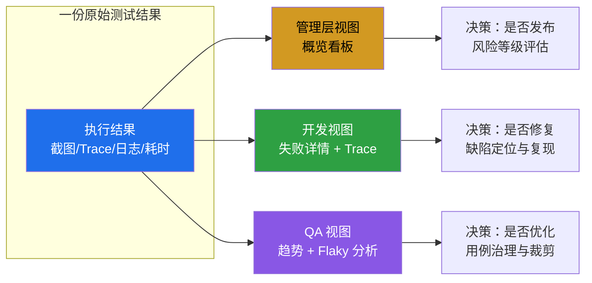
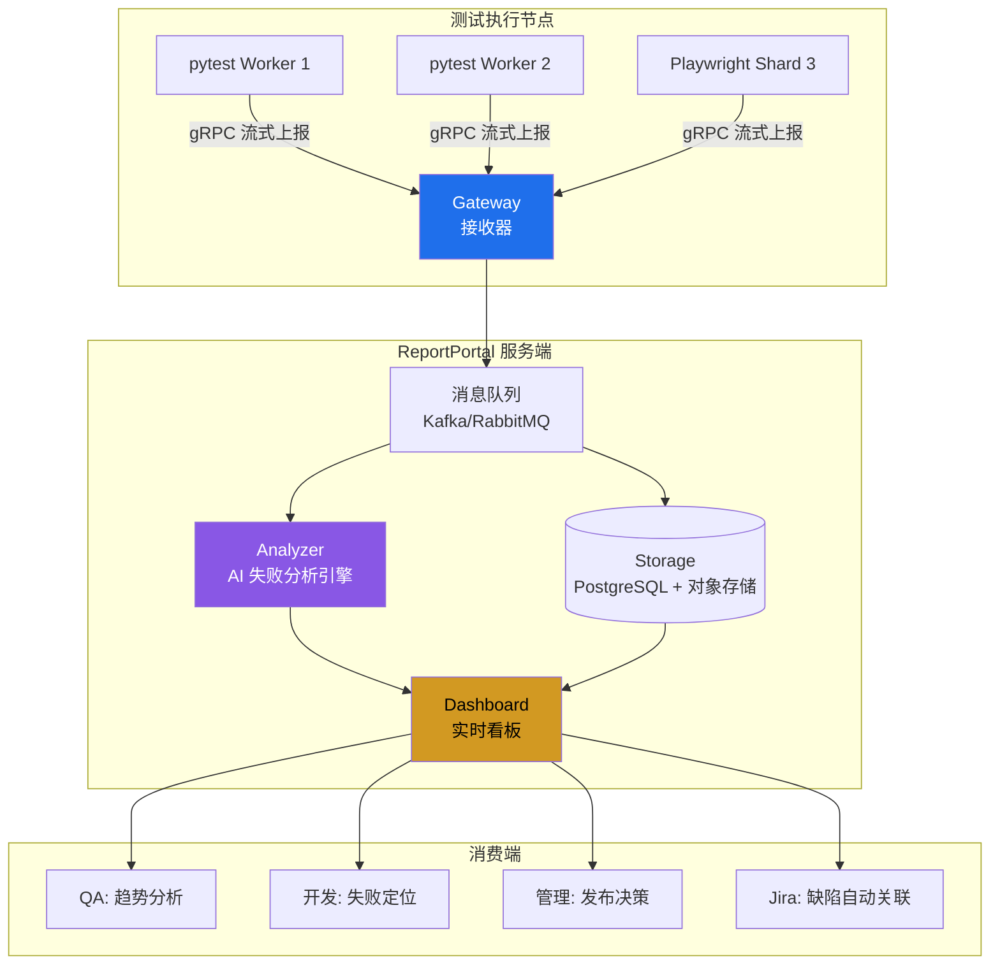

# GUI 测试报告（Allure 与 Trace Viewer 与 ReportPortal）

GUI 自动化测试的最后一公里，是**把执行过程转化为可决策的信息**。一条用例失败后，团队需要在分钟级内回答三个问题：失败在哪一步、当时系统是什么状态、是脚本问题还是真实缺陷。测试报告正是回答这些问题的载体。本文从受众差异化出发，系统讲解 2026 年主流的 GUI 测试报告方案——Allure（含 TestOps 企业版）、Playwright Trace Viewer v1.61、ReportPortal，以及 CI/CD 集成与 AI 报告分析新趋势。

## 一、核心概念：测试报告的价值与受众差异化

### 1.1 测试报告的真正价值

测试报告不是"测试结束后的产物"，而是**质量决策的输入**。一份合格的 GUI 测试报告必须同时具备四种能力：

- **结果可读**：通过/失败/跳过数量、耗时、趋势一目了然；
- **现场可还原**：失败用例附带截图、DOM 快照、网络请求、控制台日志；
- **历史可对比**：跨构建、跨分支、跨版本的趋势曲线；
- **行动可触发**：能一键复现、一键提缺陷、一键关联已知问题。

缺少任何一项，报告都会沦为"看了等于没看"的废纸。

### 1.2 受众差异化：三视角模型

测试报告的受众天然分化为三类角色，他们对信息密度与抽象层级的需求截然不同。**用同一份报告服务所有角色，是测试报告设计中最常见的错误**。

| 受众 | 核心诉求 | 关注维度 | 报告呈现形态 |
|------|----------|----------|--------------|
| **管理层** | 风险与进度 | 通过率、缺陷密度、趋势、ROI | 概览看板：单页仪表盘 + 趋势曲线 |
| **开发工程师** | 定位与复现 | 失败步骤、堆栈、DOM、网络、日志 | 详情视图：Trace + 截图 + 请求/响应 |
| **QA 工程师** | 趋势与治理 | Flaky 率、用例稳定性、缺陷分布 | 趋势视图：历史对比 + 不稳定用例清单 |



选型报告工具时，第一步不是"哪个工具好看"，而是**确认工具能否低成本产出三种视角的视图**。Allure 通过 Categories/Trends/Behaviors 三个默认面板天然契合三视角；ReportPortal 通过 Dashboard 自定义机制实现；Playwright Trace Viewer 则专精于开发视角的失败还原。

## 二、Allure 报告

### 2.1 架构与生成流程

Allure 是当前业界最流行的开源测试报告框架，2026 年最新版为 Allure 2.34（社区版）与 Allure TestOps 4.x（企业版）。其核心架构是**"执行期产出原始结果 → 构建期聚合生成报告"**的两阶段模型，使报告生成与测试框架彻底解耦。

```mermaid
flowchart LR
    subgraph 执行期
        T1[pytest/JUnit/Playwright<br/>测试用例] --> |@Step/@Attachment 注解| F1[Allure 适配器<br/>allure-pytest 等]
        F1 --> |写入 JSON+附件| R[(allure-results<br/>原始结果目录)]
    end

    subgraph 构建期
        R --> B[Allure 命令行<br/>allure generate]
        B --> H[allure-report<br/>静态 HTML 报告]
        H --> S[静态服务器/CI Artifact]
    end

    subgraph 企业期
        R --> |实时上传| T[Allure TestOps<br/>企业版]
        T --> D[历史趋势 + 用例管理<br/>+ 权限 + 缺陷关联]
    end

    style R fill:#d29922,color:#000
    style T fill:#8957e5,color:#fff
```

这种两阶段设计带来三个关键优势：报告生成与测试框架解耦（同一份 allure-results 可由任意框架产出）、原始结果可累积（支持历史趋势）、报告可静态托管（CI Artifact 即可访问，无需后端服务）。

### 2.2 核心注解：@Step / @Attachment / @Story

Allure 的语义化能力来自注解体系。`@Step` 描述操作步骤、`@Attachment` 挂载截图与日志、`@Story/@Feature/@Epic` 组织用例层级、`@Severity` 标注优先级、`@Issue/@TmsLink` 关联缺陷与用例管理系统。

```python
# Python + pytest + allure-pytest 集成示例
import allure
import pytest
from selenium.webdriver.common.by import By

@allure.epic("电商前台")
@allure.feature("购物车")
@allure.story("加购流程")
@allure.severity(allure.severity_level.CRITICAL)
@allure.issue("BUG-2026-001", "已知缺陷：库存不足时按钮未禁用")
@pytest.mark.cart
def test_add_to_cart(login_page, cart_page):
    """验证登录用户将商品加入购物车后数量正确增加"""

    with allure.step("登录站点"):
        login_page.open()
        login_page.login("buyer@example.com", "password123")
        allure.attach(
            login_page.driver.get_screenshot_as_png(),
            name="登录后首页",
            attachment_type=allure.attachment_type.PNG,
        )

    with allure.step("打开商品详情页"):
        cart_page.open_product("SKU-10086")
        assert cart_page.product_title.is_displayed()

    with allure.step("点击加入购物车"):
        cart_page.add_to_cart_button.click()
        allure.attach(
            cart_page.driver.get_log("browser"),
            name="浏览器控制台日志",
            attachment_type=allure.attachment_type.JSON,
        )

    with allure.step("校验购物车数量"):
        count = cart_page.cart_count_text
        assert count == "1", f"加购后数量应为 1，实际为 {count}"
```

注解的真正价值不在于"美化报告"，而在于**强制测试代码自文档化**——`@Step` 把代码块语义化为业务步骤，使非技术人员也能读懂报告；`@Attachment` 把截图、日志、HTTP 响应统一挂载到对应步骤下，失败定位无需翻找日志文件。

### 2.3 与 pytest/JUnit 集成

```ini
# pytest.ini 中启用 allure
[pytest]
addopts = --alluredir=./allure-results --clean-alluredir
# --alluredir 指定原始结果输出目录
# --clean-alluredir 每次执行前清空目录，避免历史数据污染
```

```bash
# 执行测试并生成报告
pytest tests/                              # 产出 allure-results
# 聚合为静态报告
allure generate ./allure-results -o ./allure-report --clean
allure open ./allure-report                # 本地启动报告服务器（默认随机端口）
```

JUnit 5 集成仅需替换依赖为 `io.qameta.allure:allure-junit5` 并在 `junit-platform.properties` 中配置 `junit.jupiter.extensions.autodetection.enabled=true`，注解使用方式与 pytest 完全一致。

### 2.4 Allure TestOps：企业版的能力跃迁

社区版 Allure 解决"单次报告生成"问题，企业版 **Allure TestOps** 解决"团队级测试资产管理"问题。其核心增量能力包括：

- **实时收集**：测试执行过程中流式上传结果，无需等执行结束；
- **历史趋势**：跨构建、跨分支、跨环境的趋势对比，自动计算 Flaky 率；
- **用例管理**：将自动化用例与手动用例统一管理，支持用例评审与版本化；
- **权限与审计**：项目/角色/用户三级权限，满足企业合规要求；
- **缺陷闭环**：自动关联 Jira/Xray 缺陷，失败用例可一键创建或更新缺陷。

TestOps 的定位是"测试领域的 GitLab/Jira"——它不只是报告工具，而是**测试资产的统一管理平台**。对于用例规模超过 5000 条、跨多团队协作的组织，TestOps 的 ROI 显著高于社区版 + 自建看板。

## 三、Playwright Trace Viewer v1.61

### 3.1 从"报告"到"可调试工具"的范式跃迁

Playwright Trace Viewer 是 GUI 测试报告领域近三年最重要的演进。传统报告（包括 Allure）本质是"事后产物"——测试结束后基于静态附件还原现场；Trace Viewer 则是**"交互式调试工具"**——它记录每个操作的完整上下文，支持逐步回放，等同于把 Chrome DevTools 的调试能力固化进测试报告。

Playwright 1.61（2026 年）的 Trace Viewer 在 v1.60 基础上进一步优化：DOM 快照体积压缩 30%、新增"操作差异高亮"（自动标注前后两步的 DOM 变化）、支持网络请求的 HAR 导出。

### 3.2 trace 配置与录制

```typescript
// playwright.config.ts (v1.61)
import { defineConfig } from '@playwright/test';

export default defineConfig({
  use: {
    // trace 录制策略：首次重试时录制，平衡可观测性与资源开销
    trace: {
      mode: 'on-first-retry',     // 仅在重试时录制
      snapshots: true,            // 启用 DOM 快照（默认 true）
      screenshots: true,          // 启用截图（默认 true）
      sources: true,              // 启用源码上下文（v1.61 默认 true）
      attachments: true,          // 启用附件（v1.61 默认 true）
    },
    // 视频仅在失败时保留
    video: 'retain-on-failure',
    // 截图仅在失败时拍摄
    screenshot: 'only-on-failure',
  },

  // HTML 报告 + Blob 报告（用于 CI 分片合并）
  reporter: [
    ['html', { open: 'never' }],
    ['blob'],
  ],
});
```

`trace.mode` 的取值需要根据场景权衡：`'on'` 全量录制（开发期调试）、`'on-first-retry'` 仅重试录制（CI 推荐）、`'retain-on-failure'` 仅失败保留（生产期最小开销）、`'off'` 关闭（性能压测）。**CI 场景默认推荐 `'on-first-retry'`**，既能捕获失败现场，又避免全量录制带来的存储压力。

### 3.3 五大核心能力

Trace Viewer 的交互界面提供五个维度的同步联动：

| 能力 | 说明 | 典型用途 |
|------|------|----------|
| **时间线** | 横向展示每个操作的耗时，红色标记慢操作 | 定位性能瓶颈与超时 |
| **DOM 快照** | 每个操作前后两份 DOM 快照，可逐步对比 | 还原元素当时的状态与可见性 |
| **网络请求** | 按 API 分组展示请求/响应/耗时 | 排查前后端联调问题 |
| **控制台日志** | 同步展示 console.log/error/warning | 捕获前端运行时错误 |
| **源码上下文** | 高亮当前执行到的测试代码行 | 关联操作与代码逻辑 |

打开方式：

```bash
# 本地查看 trace
npx playwright show-trace trace.zip

# CI 场景：HTML 报告中自动内嵌 trace 链接
npx playwright show-report
```

Trace Viewer 的核心价值在于**"开发视角的零成本还原"**——开发工程师无需复现即可在浏览器中逐步回放失败用例，定位效率相比传统"截图 + 日志"模式提升一个数量级。

## 四、ReportPortal：实时报告与 AI 失败分析

### 4.1 实时报告收集架构

ReportPortal 与 Allure 的根本差异在于**架构模型**：Allure 是"执行结束 → 离线聚合 → 静态报告"的批处理模型；ReportPortal 是"执行期流式上传 → 服务端实时聚合 → 动态看板"的流处理模型。这一差异决定了两者在大型 CI 场景下的体验分化。



实时架构带来三个体验跃迁：**用例执行完毕即可在 Dashboard 看到结果**（无需等整个 suite 跑完）、**失败用例即时触发 AI 分析**（开发可在测试还在跑时就开始定位）、**长跑测试集（如 2 小时 E2E）支持中途查看进度**（避免"跑完才知道全失败"的尴尬）。

### 4.2 AI 失败分析

ReportPortal 内置的 AI 引擎（基于聚类 + NLP）对失败用例做三件事：

1. **自动聚类**：将语义相似的失败归为同一簇，避免 100 个失败用例产生 100 个独立工单；
2. **原因建议**：基于历史失败模式匹配，给出"可能原因"建议（如"Element not found → 80% 概率为页面加载超时"）；
3. **已知问题关联**：自动将新失败与历史缺陷关联，标记"Known Issue"避免重复排查。

AI 分析对大型测试集（>1000 用例）的 ROI 极为显著——某团队实测，引入 ReportPortal 后失败用例的平均定位时间从 25 分钟降至 6 分钟，其中 60% 的失败被自动归类为已知问题。

### 4.3 ReportPortal vs Allure 选型

| 维度 | Allure 社区版 | Allure TestOps | ReportPortal |
|------|---------------|----------------|--------------|
| 架构模型 | 离线聚合 | 实时 + 离线 | 实时流式 |
| 部署成本 | 极低（静态文件） | 中（服务端） | 高（微服务 + DB + MQ） |
| AI 分析 | 无 | 基础 | 内置成熟 |
| 历史趋势 | 需自行保留 allure-results | 内置 | 内置 |
| 用例管理 | 无 | 强 | 中 |
| 适用规模 | <2000 用例 | 2000-20000 | >2000 用例 |
| 适用场景 | 中小团队、CI 静态报告 | 企业级测试资产平台 | 大型团队、AI 失败治理 |

选型建议：**500 用例以下选 Allure 社区版**，零部署成本；**500-5000 用例且需趋势治理选 Allure TestOps**；**5000 用例以上且失败频发选 ReportPortal**，AI 分析的 ROI 才能覆盖部署成本。

## 五、HTML 报告与自定义报告

### 5.1 框架内置 HTML 报告

除 Allure 外，主流框架均内置 HTML 报告：Playwright 内置 HTML Reporter（与 Trace Viewer 深度集成）、Cypress 默认 `spec` reporter（可切换 mochawesome）、Maven Surefire Report（配合 JUnit 5）。内置报告的优势是零配置，劣势是跨框架不统一、缺乏趋势视图。

### 5.2 ExtentReports

ExtentReports 是 Java 生态的传统强项，支持分类视图、设备标签、在线/离线两种模式。其优势在于与 TestNG/JUnit5 深度集成、报告样式可高度定制；劣势是社区活跃度低于 Allure，Python/JS 生态支持有限。

```java
// Java + TestNG + ExtentReports 集成示例
public class ReportManager {
    private static ExtentReports extent;
    private static ThreadLocal<ExtentTest> test = new ThreadLocal<>();

    public static void init() {
        ExtentSparkReporter spark = new ExtentSparkReporter("report.html");
        // 配置报告元信息
        spark.config().setDocumentTitle("GUI 自动化测试报告");
        spark.config().setReportName("电商前台回归测试");
        extent = new ExtentReports();
        extent.attachReporter(spark);
    }

    public static void createTest(String name) {
        test.set(extent.createTest(name));
    }

    public static void logPass(String detail) {
        test.get().pass(detail);
    }

    public static void logFail(String detail, String screenshotPath) {
        // 失败时挂载截图
        test.get().fail(detail, MediaEntityBuilder.createScreenCaptureFromPath(screenshotPath).build());
    }
}
```

### 5.3 自研报告平台

当团队有以下任一需求时，自研报告平台才具备 ROI：**深度业务定制**（如 eBay 多国语言对比报告）、**与内部系统深度集成**（自研缺陷系统、自研用例系统）、**特殊数据合规要求**（数据不能出内网）。否则，优先复用 Allure/ReportPortal，避免重复造轮子。

## 六、CI/CD 集成与报告发布

### 6.1 GitHub Actions 报告发布

```yaml
# .github/workflows/e2e.yml — GUI 测试 + Allure 报告发布
name: E2E Tests with Allure Report

on:
  pull_request:
    branches: [main, develop]
  schedule:
    - cron: '0 2 * * *'    # 每日凌晨 2 点定时全量回归

jobs:
  test:
    runs-on: ubuntu-latest
    steps:
      - uses: actions/checkout@v4

      - uses: actions/setup-node@v4
        with:
          node-version: '22'
          cache: 'npm'

      - name: 安装依赖
        run: npm ci

      - name: 执行 Playwright 测试
        run: npx playwright test
        env:
          # 产出 allure-results（需配合 allure-playwright reporter）
          ALLURE_RESULTS_DIR: ./allure-results

      - name: 生成 Allure 报告
        if: always()    # 即使测试失败也生成报告
        run: |
          npx allure generate ./allure-results -o ./allure-report --clean

      - name: 发布报告到 GitHub Pages
        if: always()
        uses: peaceiris/actions-gh-pages@v4
        with:
          github_token: ${{ secrets.GITHUB_TOKEN }}
          publish_dir: ./allure-report
          destination_dir: allure/${{ github.run_id }}

      - name: 在 PR 评论中插入报告链接
        if: github.event_name == 'pull_request'
        uses: actions/github-script@v7
        with:
          script: |
            const reportUrl = `https://${context.repo.owner}.github.io/${context.repo.repo}/allure/${{ github.run_id }}/`
            github.rest.issues.createComment({
              ...context.repo,
              issue_number: context.issue.number,
              body: `📊 [Allure 测试报告](${reportUrl})`
            })
```

### 6.2 GitLab CI 报告发布

GitLab CI 的优势是原生支持 `artifacts:reports:junit`，可在 MR 中直接展示测试结果摘要：

```yaml
# .gitlab-ci.yml
e2e-test:
  stage: test
  image: mcr.microsoft.com/playwright:v1.61-jammy
  script:
    - npm ci
    - npx playwright test --reporter=junit,html
  artifacts:
    when: always
    paths:
      - playwright-report/
      - allure-report/
    reports:
      junit: results.xml
    expire_in: 30 days    # 报告保留 30 天，避免存储膨胀
```

### 6.3 报告保留策略

报告存储是常被忽视的运维成本。建议按以下分级保留：

- **构建期报告**（CI Artifact）：保留 30 天，覆盖一个迭代周期；
- **里程碑报告**（Release/Tag）：永久保留，作为版本质量基线；
- **趋势数据**（allure-results 历史快照）：保留 90 天，用于 Flaky 分析与趋势预测；
- **Trace 文件**：仅保留失败用例的 trace，成功用例的 trace 当日清理。

## 七、2024-2026 新趋势

### 7.1 AI 报告分析：从"展示"到"决策"

2024 年以来，AI 在测试报告领域的应用从"自动分类失败"延伸到"预测质量风险"：

- **失败原因 AI 分类**：ReportPortal、Allure TestOps 已内置，将失败归类为"脚本缺陷/环境问题/真实缺陷/数据问题"四类，自动标记无需人工排查的失败；
- **趋势预测**：基于历史通过率、Flaky 率、代码变更范围，预测本次构建的失败概率，提前预警高风险变更；
- **智能去重**：同一根因的失败自动合并，避免工单爆炸。

### 7.2 Grafana 测试看板：统一质量观测

将测试指标（通过率、耗时、Flaky 率、覆盖率）推送到 Prometheus/Grafana，与部署指标、SLO 指标同屏展示，是 2025 年起的行业新趋势。这种做法的核心价值在于**把测试质量纳入"可观测性体系"**，使质量不再是 QA 团队的孤岛指标，而是与系统健康度联动的工程指标。

```yaml
# 示例：将 pytest 结果推送到 Prometheus
# 使用 pytest-prometheus 插件
pytest tests/ --prometheus-pushgateway=http://pushgateway:9091 \
              --prometheus-metric-prefix=e2e_test
```

### 7.3 实时报告：从"事后看"到"边跑边看"

ReportPortal 的实时收集模式正在成为大型测试集的标准配置。其延伸形态包括：

- **流式失败告警**：用例失败即时推送到 IM（飞书/钉钉/Slack），而非等全量跑完；
- **中途取消决策**：失败率超过阈值时自动中止后续用例，节省 CI 资源；
- **并行进度可视化**：多 Worker/Shard 的执行进度实时聚合，避免"黑盒等待"。

## 八、常见陷阱与最佳实践

### 8.1 陷阱清单

| 陷阱 | 后果 | 规避方式 |
|------|------|----------|
| 全量录制 Trace | CI 存储爆炸 | 使用 `'on-first-retry'` 策略 |
| 报告与代码脱钩 | 注解过期、误导排查 | `@Step` 与代码块严格对应 |
| 单一视图服务所有角色 | 管理看不懂、开发看不够 | 三视角分离，Allure TestOps/ReportPortal |
| 忽视趋势数据 | 无法识别 Flaky 与退化 | 保留 allure-results 历史快照 |
| 报告保留无策略 | 存储成本失控 | 分级保留，Trace 仅留失败用例 |
| 自研报告平台 | 投入产出比失衡 | 优先复用 Allure/ReportPortal |

### 8.2 最佳实践

1. **三视角默认分离**：CI 报告默认展示管理层概览，开发视角通过链接下钻，QA 视角通过独立 Dashboard；
2. **Trace 按需录制**：开发环境 `'on'`，CI 环境 `'on-first-retry'`，压测环境 `'off'`；
3. **趋势数据独立存储**：allure-results 与 allure-report 分离，results 用于趋势，report 用于单次查看；
4. **失败自动关联缺陷系统**：ReportPortal/TestOps 的 AI 关联可减少 60% 的重复工单；
5. **报告即代码**：报告配置（Allure categories、ReportPortal dashboard）纳入版本管理，避免"某个工程师离职后报告就没人维护"。

## 总结

GUI 测试报告的本质，是把**执行过程转化为决策信息**。2026 年的主流方案已分化为三层：**Allure/ExtentReports 解决"如何呈现"**（注解化、可视化）、**Playwright Trace Viewer 解决"如何还原"**（交互式调试、零成本复现）、**ReportPortal/TestOps 解决"如何治理"**（实时收集、AI 分析、趋势预测）。选型的核心不是工具本身的优劣，而是**用例规模、团队结构、CI/CD 成熟度**三者共同决定的 ROI 模型。无论选择哪套方案，记住一条原则：**报告的价值等于它所触发的决策数量，而非它所展示的数据量**。
