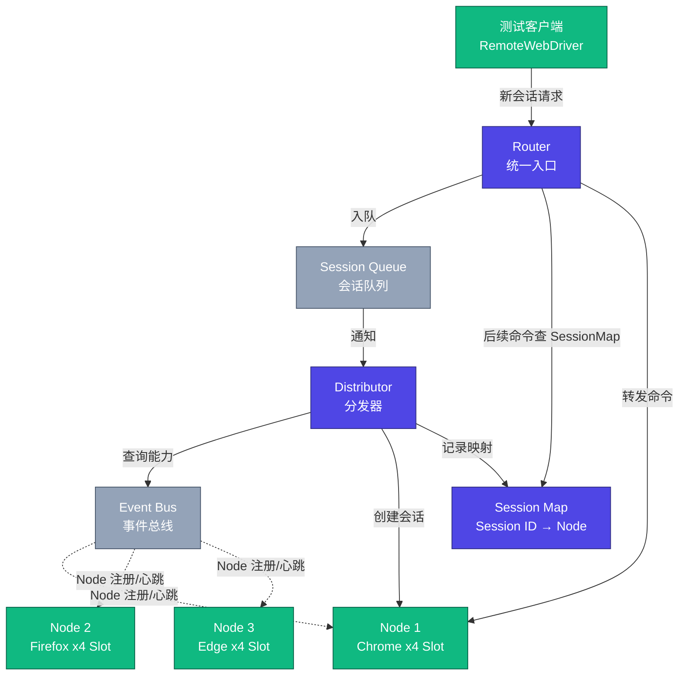
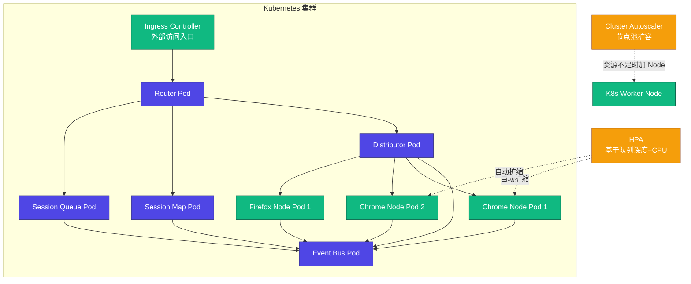

# Selenium Grid 4 与分布式执行

当 GUI 自动化用例从几百条增长到上万条，"一台机器串行跑完"的方案会在某一天突然失效——构建队列开始堆积，回归测试从 30 分钟膨胀到 4 小时，发布窗口被一再压缩。**分布式执行不是性能优化，而是规模化的生存问题**。本文围绕 Selenium Grid 4.41（2026-02 发布）展开，覆盖架构演进、容器化部署、Kubernetes 原生编排、轻量替代方案 Selenoid、云测平台选型，以及 TaaS 测试基础架构在大型电商中的落地实践。

## 一、核心概念：为什么需要分布式执行

### 1.1 单机执行的四大瓶颈

GUI 自动化测试在单机环境下运行时，会随用例规模增长暴露出四类结构性问题：

- **多浏览器兼容性管理困难**：Chrome、Firefox、Edge、Safari 不同版本需要在不同机器上预装，靠人工维护"机器-浏览器"映射表极易出错；
- **同浏览器多版本回溯困难**：线上缺陷往往需要在历史版本浏览器上复现，单机无法同时安装多个 Chrome 主版本；
- **并发执行难以实施**：单机 CPU 与内存上限决定了并行度天花板，串行执行导致反馈周期被拉长；
- **资源利用率失衡**：测试机白天被自动化占用、夜间闲置，但其他业务线无法共享这些资源。

**这四类问题的共同根因是：测试执行机与测试用例的关系不透明**——每个用例都需要人为指定在哪台机器、用哪个浏览器执行。

### 1.2 Selenium Grid 的演进史

Selenium Grid 正是为解决上述透明性问题而生。它的演进分为两个阶段：

| 版本 | 架构模式 | 核心组件 | 主要缺陷 |
|------|----------|----------|----------|
| **Grid 3** | Hub-Node | Hub（单点）、Node | Hub 是单点瓶颈，无法水平扩展，宕机即全局不可用 |
| **Grid 4** | Distributed Mode | Router、Distributor、SessionMap、Node（+Session Queue、Event Bus） | 组件更多，但可独立扩展、容错性强 |

Grid 4 在 2021 年 10 月随 Selenium 4 正式发布，是一次完全重写。截至 2026-02，最新稳定版本为 **4.41.0**。Docker 镜像官方仓库也从 Docker Hub 迁移并同步至 GHCR（`ghcr.io/selenium/...`），缓解了 Docker Hub 拉取限流问题。

## 二、Selenium Grid 4 架构：Distributed Mode 四组件

### 2.1 四核心组件 + 两辅助组件

Grid 4 的核心思想是**职责分离（Separation of Concerns）**：将 Grid 3 中 Hub 承担的所有职责拆解为多个独立可扩展的组件。其中四个核心组件构成了 Distributed Mode 的骨干：

| 组件 | 职责 | 可水平扩展 |
|------|------|------------|
| **Router** | 系统统一入口，接收所有外部请求并路由到对应组件 | 是 |
| **Distributor** | 根据 Node 的能力（capabilities）信息，将新会话请求分配到最合适的 Node | 是 |
| **SessionMap** | 维护 Session ID 与 Node 的映射关系，用于后续命令路由 | 是 |
| **Node** | 实际执行测试的机器，管理浏览器实例与 Slot | 是 |

外加两个辅助组件：**Session Queue**（会话队列，存放等待分配的新会话请求，支持优先级）和 **Event Bus**（基于 Selenium 自研的轻量级消息总线，组件间异步通信的中间件）。这两者更多承担"协调"角色，但同样可集群化部署。

### 2.2 Distributed Mode vs Grid 3 Hub-Node

从 Hub-Node 演进到 Distributed Mode，背后的驱动是三个具体痛点：

1. **单点瓶颈**：Grid 3 的 Hub 承担所有请求、注册、心跳，Node 数量到数百时 Hub 成为性能瓶颈；
2. **无法水平扩展**：Hub 只能纵向加资源，而 Distributed Mode 中每个组件都能独立横向扩展；
3. **容错性差**：Hub 宕机则整个 Grid 不可用；Distributed Mode 中 Event Bus、SessionMap 等都可集群化部署，单点故障不影响全局。



图 1 Selenium Grid 4 Distributed Mode 架构（四核心组件 + 两辅助组件）

### 2.3 三种部署模式

Grid 4 支持三种部署模式，对应不同规模场景：

| 模式 | 适用场景 | 组件部署方式 |
|------|---------|--------------|
| **Standalone** | 本地开发调试 | 所有组件运行在单个进程，单条命令启动 |
| **Standalone Chrome / Firefox** | 单浏览器场景、CI 容器 | Standalone + 预装某浏览器，镜像即用 |
| **Distributed** | 大规模企业级部署 | 每个组件独立部署，可单独扩展 |

## 三、Grid 4 部署：从 Standalone 到 Docker Compose

### 3.1 Standalone 模式：本地调试首选

Standalone 模式下所有组件合并为单进程，一条命令即可启动，适合本地开发与调试：

```bash
# 拉取 Grid 4.41.0 Standalone Chrome 镜像（GHCR 镜像源，避免 Docker Hub 限流）
docker pull ghcr.io/selenium/standalone-chrome:4.41.0

# 启动单容器 Grid（内置 Chrome 浏览器）
docker run -d -p 4444:4444 -p 7900:7900 \
  --shm-size=2g \
  ghcr.io/selenium/standalone-chrome:4.41.0

# 4444：WebDriver 端点；7900：noVNC 网页查看浏览器界面
# 浏览器 http://localhost:4444/ui 查看 Grid 控制台
```

测试代码侧只需将 `RemoteWebDriver` 指向 Grid 入口：

```java
// Selenium 4.41 + Java 示例
ChromeOptions options = new ChromeOptions();  // Selenium 4 已废弃 DesiredCapabilities
WebDriver driver = new RemoteWebDriver(
    new URL("http://localhost:4444/wd/hub"),  // 指向 Grid，而非具体测试机
    options
);
```

### 3.2 Docker Compose：中小团队最佳实践

当 Node 数量增多时，逐条 `docker run` 既繁琐又易错。Docker Compose 通过声明式 YAML 管理整个 Grid 集群，支持一键启停与动态扩容：

```yaml
# docker-compose.yml - Selenium Grid 4 Distributed Mode
# 版本：Selenium 4.41.0，镜像源 GHCR
services:
  # 事件总线 - 组件间通信的基础
  selenium-event-bus:
    image: ghcr.io/selenium/event-bus:4.41.0
    container_name: selenium-event-bus
    ports:
      - "4442:4442"   # 事件发布端口
      - "4443:4443"   # 事件订阅端口
      - "5557:5557"   # Event Bus 服务端口

  # 会话队列 - 管理等待分配的会话请求
  selenium-session-queue:
    image: ghcr.io/selenium/session-queue:4.41.0
    container_name: selenium-session-queue
    depends_on: [selenium-event-bus]
    environment:
      - SE_EVENT_BUS_HOST=selenium-event-bus
      - SE_EVENT_BUS_PUBLISH_PORT=4442
      - SE_EVENT_BUS_SUBSCRIBE_PORT=4443

  # 会话映射 - 维护 Session ID 与 Node 的映射
  selenium-sessions:
    image: ghcr.io/selenium/sessions:4.41.0
    container_name: selenium-sessions
    depends_on: [selenium-event-bus]
    ports: ["5556:5556"]
    environment:
      - SE_EVENT_BUS_HOST=selenium-event-bus
      - SE_EVENT_BUS_PUBLISH_PORT=4442
      - SE_EVENT_BUS_SUBSCRIBE_PORT=4443

  # 分发器 - 将会话请求分配到合适的 Node
  selenium-distributor:
    image: ghcr.io/selenium/distributor:4.41.0
    container_name: selenium-distributor
    depends_on: [selenium-event-bus, selenium-sessions, selenium-session-queue]
    ports: ["5553:5553"]
    environment:
      - SE_EVENT_BUS_HOST=selenium-event-bus
      - SE_EVENT_BUS_PUBLISH_PORT=4442
      - SE_EVENT_BUS_SUBSCRIBE_PORT=4443
      - SE_SESSIONS_MAP_HOST=selenium-sessions
      - SE_SESSIONS_MAP_PORT=5556
      - SE_SESSION_QUEUE_HOST=selenium-session-queue
      - SE_SESSION_QUEUE_PORT=5559

  # 路由器 - 系统入口，路由所有外部请求
  selenium-router:
    image: ghcr.io/selenium/router:4.41.0
    container_name: selenium-router
    depends_on: [selenium-distributor, selenium-sessions, selenium-session-queue]
    ports: ["4444:4444"]
    environment:
      - SE_DISTRIBUTOR_HOST=selenium-distributor
      - SE_DISTRIBUTOR_PORT=5553
      - SE_SESSIONS_MAP_HOST=selenium-sessions
      - SE_SESSIONS_MAP_PORT=5556
      - SE_SESSION_QUEUE_HOST=selenium-session-queue
      - SE_SESSION_QUEUE_PORT=5559

  # Chrome Node - 执行 Chrome 浏览器测试
  chrome-node:
    image: ghcr.io/selenium/node-chrome:4.41.0
    depends_on: [selenium-event-bus]
    environment:
      - SE_EVENT_BUS_HOST=selenium-event-bus
      - SE_EVENT_BUS_PUBLISH_PORT=4442
      - SE_EVENT_BUS_SUBSCRIBE_PORT=4443
      - SE_NODE_MAX_SESSIONS=4   # 单 Node 最大并发会话数
    shm_size: 2gb                 # 共享内存，防止浏览器 OOM
    deploy:
      replicas: 2                  # 启动 2 个 Chrome Node 实例

  # Firefox Node - 执行 Firefox 浏览器测试
  firefox-node:
    image: ghcr.io/selenium/node-firefox:4.41.0
    depends_on: [selenium-event-bus]
    environment:
      - SE_EVENT_BUS_HOST=selenium-event-bus
      - SE_EVENT_BUS_PUBLISH_PORT=4442
      - SE_EVENT_BUS_SUBSCRIBE_PORT=4443
      - SE_NODE_MAX_SESSIONS=4
    shm_size: 2gb
    deploy:
      replicas: 2
```

```bash
# 一键启动整个 Selenium Grid 集群
docker compose up -d

# 动态扩容 Chrome Node 到 4 个实例
docker compose up -d --scale chrome-node=4

# 一键销毁整个集群
docker compose down
```

通过 `http://localhost:4444/ui` 可实时查看各 Node 浏览器类型、可用 Slot、正在执行的会话。Docker Compose 适合中小团队（Node 数 10~50 量级）的测试执行环境。

## 四、Kubernetes 原生部署：Helm Chart 与弹性伸缩

### 4.1 Helm Chart 一键部署

对于需要大规模、高可用、弹性伸缩的生产环境，Kubernetes 是首选。Selenium 官方维护的 Helm Chart 支持一键部署完整的 Distributed Mode Grid：

```bash
# 1. 添加 Selenium 官方 Chart 仓库
helm repo add selenium https://www.selenium.dev/docker-selenium
helm repo update

# 2. 创建专用命名空间（实现多团队资源隔离）
kubectl create namespace selenium-grid

# 3. 自定义 values 部署
helm install selenium-grid selenium/selenium-grid \
  --namespace selenium-grid \
  -f values-overrides.yaml
```

```yaml
# values-overrides.yaml - Selenium Grid K8s 部署自定义配置
# 配置 Chrome Node 副本数与资源
chromeNode:
  replicas: 3                      # 初始 Chrome Node 副本数
  maxSessionsPerNode: 4            # 每 Node 最大会话数
  resources:
    requests:
      memory: "1Gi"
      cpu: "1"
    limits:
      memory: "2Gi"
      cpu: "2"

# 配置 Firefox Node
firefoxNode:
  replicas: 2
  maxSessionsPerNode: 4

# 启用 Ingress 外部访问
ingress:
  enabled: true
  hostname: selenium-grid.example.com
  annotations:
    11-Nginx基础概述.ingress.kubernetes.io/proxy-body-size: 100m

# 启用 HPA 弹性伸缩
autoscaling:
  enabled: true
  minReplicas: 2
  maxReplicas: 20
  targetCPUUtilizationPercentage: 70
```

### 4.2 Namespace 隔离与多租户

K8s 通过 Namespace 实现资源隔离，不同业务线可独立部署 Grid 实例：

```yaml
# selenium-node-deployment.yaml - Chrome Node K8s Deployment
apiVersion: apps/v1
kind: Deployment
metadata:
  name: selenium-chrome-node
  namespace: selenium-grid          # 命名空间隔离
  labels:
    app: selenium-chrome-node
    browser: chrome
spec:
  replicas: 3
  selector:
    matchLabels: { app: selenium-chrome-node }
  template:
    metadata:
      labels: { app: selenium-chrome-node, browser: chrome }
    spec:
      containers:
      - name: selenium-node
        image: ghcr.io/selenium/node-chrome:4.41.0
        env:
        - name: SE_EVENT_BUS_HOST
          value: "selenium-event-bus.selenium-grid.svc.cluster.local"
        - name: SE_EVENT_BUS_PUBLISH_PORT
          value: "4442"
        - name: SE_EVENT_BUS_SUBSCRIBE_PORT
          value: "4443"
        - name: SE_NODE_MAX_SESSIONS
          value: "4"
        resources:
          requests: { memory: "1Gi", cpu: "1" }
          limits:   { memory: "2Gi", cpu: "2" }
        volumeMounts:
        - name: dshm
          mountPath: /dev/shm       # 共享内存，避免浏览器 OOM
      volumes:
      - name: dshm
        emptyDir:
          medium: Memory
          sizeLimit: 2Gi
```

### 4.3 HPA 弹性伸缩

测试负载具有明显的潮汐特征——发布日、回归集中时段负载飙升，其他时段相对空闲。HPA（Horizontal Pod Autoscaler）配合自定义指标可实现按需扩缩容：

```yaml
# hpa-selenium-chrome.yaml - 基于会话队列深度自动扩缩容
apiVersion: autoscaling/v2
kind: HorizontalPodAutoscaler
metadata:
  name: selenium-chrome-node-hpa
  namespace: selenium-grid
spec:
  scaleTargetRef:
    apiVersion: apps/v1
    kind: Deployment
    name: selenium-chrome-node
  minReplicas: 2                   # 最小副本数（保底容量）
  maxReplicas: 50                  # 最大副本数（峰值容量上限）
  metrics:
  - type: Pods
    pods:
      metric:
        name: selenium_session_queue_depth   # 自定义指标：会话队列深度
      target:
        type: AverageValue
        averageValue: "5"          # 平均每 Pod 排队 5 个会话即触发扩容
  - type: Resource
    resource:
      name: cpu
      target:
        type: Utilization
        averageUtilization: 70     # CPU 利用率超 70% 触发扩容
```



图 2 Kubernetes 上 Selenium Grid 4 Distributed Mode 部署拓扑

K8s 部署相比 Docker Compose 带来三方面提升：**自愈能力**（Node Pod 崩溃后自动重启）、**原生弹性伸缩**（HPA + Cluster Autoscaler 无需自研扩容逻辑）、**滚动更新**（镜像升级零停机）。

## 五、Selenoid 替代方案：轻量级 Docker 原生

### 5.1 Selenoid 是什么

Selenoid 是 Selenium Grid 的轻量级替代方案，用 Golang 编写，由 Aerokube 团队维护。它的核心特点是**完全 Docker 原生**：每个浏览器会话对应一个独立 Docker 容器，会话结束即销毁容器，环境天然隔离。

### 5.2 Selenoid vs Grid 4

| 维度 | Selenium Grid 4 | Selenoid |
|------|----------------|----------|
| **实现语言** | Java | Golang（单二进制部署） |
| **架构复杂度** | Distributed Mode 六组件 | 单进程，零依赖 |
| **浏览器管理** | Node 内部管理浏览器进程 | 每会话一个浏览器容器 |
| **资源开销** | 较高（JVM + 多组件） | 极低（单二进制，几十 MB 内存） |
| **环境隔离** | 共享 Node，Slot 级隔离 | 容器级隔离，更强 |
| **日志与录像** | 需额外配置 | 内置 VNC + 视频录制 |
| **生态** | Selenium 官方，社区庞大 | 第三方维护，社区中等 |
| **适用场景** | 大规模企业、跨语言团队 | 中小团队、CI/CD 流水线 |

### 5.3 Selenoid 快速启动

```bash
# 拉取 Selenoid 镜像
docker pull aerokube/selenoid:latest

# 配置浏览器镜像映射（browsers.json）
cat > browsers.json <<'EOF'
{
  "chrome": {
    "default": "latest",
    "versions": { "latest": { "image": "selenoid/chrome:latest", "port": "4444" } }
  },
  "firefox": {
    "default": "latest",
    "versions": { "latest": { "image": "selenoid/firefox:latest", "port": "4444" } }
  }
}
EOF

# 启动 Selenoid（监听 4444 端口，与 Selenium WebDriver 协议兼容）
docker run -d --name selenoid -p 4444:4444 \
  -v /var/run/docker.sock:/var/run/docker.sock \
  -v ./browsers.json:/etc/selenoid/browsers.json \
  aerokube/selenoid:latest
```

测试代码无需任何改动，Selenoid 完全兼容 WebDriver 协议。**对于追求极简部署、强环境隔离的 CI/CD 场景，Selenoid 是值得评估的替代方案**。

## 六、云端测试平台：BrowserStack / Sauce Labs / LambdaTest

不想自建基础设施的团队，可选择商业云测平台。三大主流平台对比如下：

| 维度 | BrowserStack | Sauce Labs | LambdaTest |
|------|--------------|------------|------------|
| **浏览器覆盖** | 3000+ 真机+模拟器 | 800+ 浏览器组合 | 3000+ 浏览器组合 |
| **真实设备** | 强项，真机质量高 | 支持，但溢价较高 | 支持，性价比好 |
| **本地测试** | Local Binary | Sauce Connect | LT Tunnel |
| **并行能力** | 按套餐分配 | 按套餐分配 | 按套餐分配 |
| **集成生态** | CI/CD 全覆盖 | CI/CD 全覆盖 | CI/CD 全覆盖 |
| **定价** | 中高端 | 高端 | 中端，性价比突出 |
| **特色** | App Live 真机调试 | Visual UI Testing 视觉回归 | AI 驱动的失败分析 |

**选型建议**：

- **真机质量优先**：选 BrowserStack，移动端真机资源最丰富；
- **视觉回归需求强**：选 Sauce Labs，内置视觉差异检测；
- **性价比与 AI 分析**：选 LambdaTest，价格友好且 AI 失败归因能力强；
- **自建 + 云测混合**：自建 Grid 跑日常回归，云测跑长尾浏览器兼容性矩阵，是大型团队的常见组合。

## 七、测试基础架构设计：TaaS 与大型电商落地

### 7.1 TaaS 架构理念

**测试即服务（Testing as a Service, TaaS）** 是大型测试基础架构的核心设计思想：测试过程中的每类能力都封装为独立服务，服务可独立开发、独立部署、独立扩展。这与微服务理念一脉相承。

一个理想的 TaaS 架构包含六大核心服务：

| 服务 | 职责 |
|------|------|
| **统一测试执行服务** | RESTful API 发起测试，版本管理与结果追踪 |
| **统一测试数据服务** | 测试数据的创建、隔离、脱敏、版本管理 |
| **全局测试配置服务** | 配置与代码解耦，按国家/环境动态注入 |
| **测试报告服务** | 多框架报告统一采集，元数据存储与可视化 |
| **测试执行环境准备服务** | 动态扩缩容执行集群，本文重点 |
| **被测系统部署服务** | 标准化部署被测软件，与 CI/CD 解耦 |

### 7.2 大型电商落地案例

以某全球化电商为例，其测试基础架构在 K8s 上落地，覆盖日均 20 万次 GUI 测试执行：

- **执行引擎**：自建 Selenium Grid 4（K8s Helm Chart 部署），日均峰值 200 个 Chrome Node Pod，配合 HPA 在 5 分钟内完成扩容；
- **混合策略**：常规回归跑自建 Grid，长尾浏览器兼容性矩阵跑 BrowserStack；
- **环境隔离**：不同业务线通过 K8s Namespace 隔离 Grid 实例，避免相互干扰；
- **可观测性**：Prometheus 采集 Grid 指标（会话队列深度、Node 利用率），Grafana 看板供 SRE 监控；
- **成本控制**：非工作时段自动缩容至最小副本数，月度云成本下降 40%。

## 八、常见陷阱与最佳实践

### 8.1 常见陷阱

- **`/dev/shm` 太小导致浏览器崩溃**：Chrome 默认使用 `/dev/shm`，容器默认仅 64MB。必须挂载 `shm_size: 2g` 或使用 `--disable-dev-shm-usage` 启动参数；
- **Node 注册延迟导致首测失败**：Node 启动到向 Event Bus 注册有时间差，CI 中应在测试前增加 readiness probe 或重试逻辑；
- **HPA 仅基于 CPU 误判**：浏览器测试 CPU 利用率往往不高但内存压力大，建议加入会话队列深度等自定义指标；
- **Session 泄漏**：测试异常退出未调用 `driver.quit()`，Session 在 Node 上残留占用 Slot。建议设置 `SE_NODE_SESSION_TIMEOUT` 自动回收；
- **镜像版本与 WebDriver 不匹配**：Selenium 4.41 镜像已内置对应版本 ChromeDriver，但若自行挂载浏览器版本需确保与 WebDriver 兼容。

### 8.2 最佳实践

- **统一入口**：所有测试请求通过 Router 统一入口，禁止直连 Node，便于故障切换与灰度；
- **GHCR 镜像优先**：拉取 `ghcr.io/selenium/...` 镜像，避免 Docker Hub 限流；
- **声明式配置**：Helm values.yaml 纳入 Git 版本管理，符合 IaC 理念；
- **健康检查**：K8s 中配置 livenessProbe 与 readinessProbe，确保只有就绪的 Node 接收会话；
- **资源配额**：为 Namespace 设置 ResourceQuota，防止单业务线耗尽集群资源；
- **混合执行引擎**：Selenium Grid 跑兼容性矩阵，Playwright Sharding 跑日常回归，按场景选型而非一刀切。

## 总结

分布式执行是 GUI 自动化测试规模化的必经之路。Selenium Grid 4 通过 Distributed Mode 四组件解耦，从根本上解决了 Grid 3 Hub 单点瓶颈；Docker Compose 是中小团队的落地首选，Kubernetes Helm Chart + HPA 则是大规模生产环境的标配。对于追求极简的团队，Selenoid 提供了轻量替代；对于不想自建的团队，BrowserStack/Sauce Labs/LambdaTest 提供了成熟的云测方案。最终，TaaS 架构将这些执行能力封装为服务，与测试数据、配置、报告、部署服务协同，构成了大型电商测试基础架构的完整图景。

**核心要点回顾**：

1. **分布式执行的本质**是让测试执行机与测试用例的关系透明化，由 Grid 自动调度；
2. **Grid 4 Distributed Mode** 通过 Router/Distributor/SessionMap/Node 四组件解耦，支持水平扩展与容错；
3. **部署演进**：Standalone（本地）→ Docker Compose（中小团队）→ K8s Helm Chart（生产环境）；
4. **K8s 原生能力**（HPA、Namespace 隔离、自愈）是大规模 Grid 的标准配置；
5. **Selenoid** 适合追求极简与强隔离的 CI/CD 场景，**云测平台**适合长尾兼容性矩阵；
6. **TaaS 架构**将测试执行能力服务化，是大型电商测试基础架构的设计范式。
