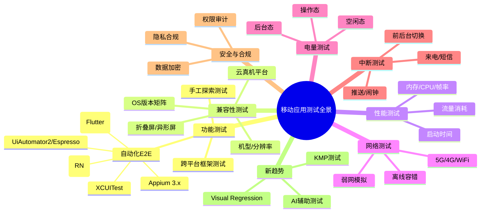
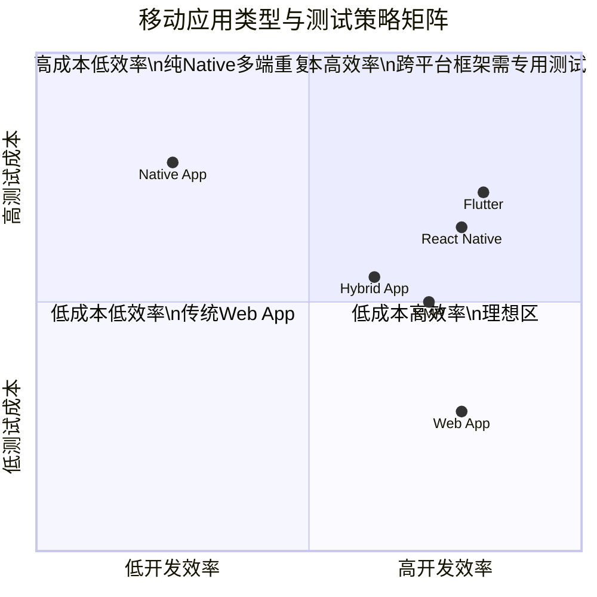

# 移动应用测试方法（Web与Native与Hybrid与跨平台）

移动互联网流量早已超越 PC 端，亚洲地区移动端流量占比超过三分之二。然而移动应用测试并非"PC 端 GUI 测试在手机上的简单翻版"——它面对的是设备碎片化、网络多变性、电量约束、系统中断等截然不同的质量风险。本文按"挑战 → 应用类型 → 测试策略 → 专项测试 → 新趋势"的脉络，系统梳理移动应用测试方法，并补充 2024-2026 年跨平台框架测试、Visual Regression、AI 辅助测试、5G/弱网测试等正在重塑移动测试边界的新实践。

## 1. 核心概念：移动应用测试的挑战与特点

移动应用测试与 PC 端 GUI 测试同属 GUI 测试范畴，**数据驱动、页面对象模型（POM）、业务流程封装**等思想依然通用，但移动端有四项固有挑战使其测试设计必须独立考虑。

### 1.1 设备与系统碎片化

Android 阵营每年新增机型数百款，覆盖全面屏、折叠屏、刘海屏、挖孔屏等异形屏，加上 iOS 与 Android 双平台、同一平台多版本（Android 12-16、iOS 16-19）并存，**碎片化是兼容性测试的根本难点**。相较于 PC 端浏览器三强格局，移动端的硬件差异（CPU 架构、GPU、内存档位）会直接影响渲染、启动时间和稳定性。

### 1.2 网络环境多变性

移动设备的网络状态是动态的——WiFi/5G/4G/3G/弱网/离线之间频繁切换，地铁、隧道、电梯等场景伴随高延迟与丢包。**网络不是"连通或断开"的二元状态，而是一个连续谱**，这使得弱网测试与离线容错测试成为移动端的必备项。

### 1.3 电量与资源约束

移动设备电池容量有限、内存与存储相对紧张。一个后台持续定位的应用可能让用户半天卸载，一次 OOM（Out Of Memory）会让前台应用被系统杀死。**电量、内存、CPU、流量是移动非功能测试的"四大资源维度"**，PC 端通常无需关注。

### 1.4 中断与上下文切换

来电、短信、推送通知、闹钟、系统升级提示、低电量模式、其他 App 抢占音频焦点……中断事件在移动端随时发生。**应用必须能够在中断后正确恢复状态、释放资源、重绘 UI**，这类交叉事件测试在 PC 端几乎不存在。



图1 移动应用测试全景图

## 2. 移动应用类型与测试策略

移动应用按技术架构可分为四类：**Web App、Native App、Hybrid App、跨平台 App（Flutter/React Native/KMP）**。不同类型的可测性边界、定位策略、上下文模型均不同，测试选型必须随之调整。

### 2.1 Web App

运行在移动浏览器中的网页应用，技术栈为 HTML/JS/CSS，可借助 PWA 获得离线与推送能力。**测试本质等同于 PC 端 Web 测试**，Selenium 4 / Playwright 等框架直接适用；若页面遵循响应式设计（RWD），同一套用例可在桌面浏览器与移动浏览器中复用。需要注意的是，iOS Safari 与 Android Chrome 的内核差异（WebKit vs Blink）可能引入渲染差异，应在两端各执行一遍。

### 2.2 Native App

Android（Kotlin 首选，输出 APK/AAB）与 iOS（Swift 首选，输出 IPA）原生应用，体验最佳、本地资源访问完整。**测试框架分平台选型**：

- **iOS**：XCUITest（Apple 官方，Appium 2.0+ 通过 `appium driver install xcuitest` 独立安装）、EarlGrey（Google 开源，适合白盒级 UI 测试）。
- **Android**：UiAutomator2（系统级黑盒）、Espresso（应用级白盒，更贴近业务）。

### 2.3 Hybrid App

原生容器 + WebView 的组合，原生部分用 XCUITest/UiAutomator2 测试，WebView 内网页部分用 WebDriver 协议测试。**关键操作是 Context 切换**：原生容器为 `NATIVE_APP`，WebView 为 `WEBVIEW_<进程名>`。

### 2.4 跨平台 App

跨平台框架已成为新应用的主流选择，但其测试范式与 Native App 显著不同：

- **Flutter**：自绘引擎，UI 控件在语义树上对 Accessibility 不友好，**Appium 难以直接定位**，应优先使用官方 `integration_test` 包；需要混合操作时可通过 Appium Flutter Driver。
- **React Native**：桥接原生组件，可用 **Detox**（Wix 开源，灰盒 E2E，与 RN 同步机制深度集成），也可通过 Appium 以 Native App 方式测试。
- **KMP（Kotlin Multiplatform）**：共享业务逻辑层（无 UI），测试重点是共享模块的单元测试与各端 UI 层的 E2E，常用 Kotlin Test +各平台原生 UI 框架。



图2 移动应用类型与测试策略矩阵

## 3. 功能测试方法

### 3.1 手工测试要点

移动端手工测试不可被自动化完全替代，关键场景包括：探索式测试、首次启动体验、触感反馈（振动/力触觉）、相机/AR 等硬件交互、应用商店上架审核流。**手工测试的核心是"以用户视角"覆盖自动化难以触及的体验维度**。

### 3.2 自动化测试框架选型矩阵

| 应用类型 | 首选框架 | 备选方案 | 适用场景 |
|---------|---------|---------|---------|
| Web App | Playwright / Selenium 4 | Cypress | 响应式页面跨端复用 |
| iOS Native | XCUITest | EarlGrey | 纯 iOS 项目灰盒测试 |
| Android Native | Espresso | UiAutomator2 | 应用内白盒；系统级黑盒 |
| 跨平台 Native（混合） | Appium 3.x | Marathon | 多端统一调度 |
| Flutter | `integration_test` | Appium Flutter Driver | 自绘引擎友好 |
| React Native | Detox | Appium | RN 同步机制优化 |
| KMP | Kotlin Test + 各端原生 UI | — | 共享逻辑单元测试 |

### 3.3 Hybrid App 的 Context 切换

Appium 3.x（当前最新版 3.5.0）的 Hybrid App 测试核心是 Context 切换，示例代码如下：

```python
# Python 示例：Appium 3.x Hybrid App Context 切换
from appium.webdriver.webdriver import WebDriver

# 获取所有可用 Context
contexts = driver.contexts
# 输出：['NATIVE_APP', 'WEBVIEW_com.example.app']

# 切换到 WebView Context，操作网页元素
driver.switch_to.context('WEBVIEW_com.example.app')
element = driver.find_element('id', 'submit-btn')
element.click()

# 切换回 Native Context，操作原生控件
driver.switch_to.context('NATIVE_APP')
```

> Appium 2.0（2023 年 7 月发布）起，所有 Driver 改为外部独立安装，通信协议从 JSON Wire Protocol 全面迁移至 W3C WebDriver 协议。若仍在使用 Appium 1.x，应尽快迁移。

## 4. 兼容性测试

兼容性测试的目标是确保 App 在目标用户群的实际设备矩阵上功能正确、体验一致。**测试矩阵设计是兼容性测试的核心难点**，需基于实际用户设备分布数据（来自应用商店统计或埋点）确定 Top 机型覆盖范围。

### 4.1 兼容性测试维度

- **操作系统版本**：Android 12-16、iOS 16-19，重点覆盖用户占比 5% 以上的版本。
- **屏幕分辨率与尺寸**：全面屏、折叠屏（如华为 Mate X、三星 Z Fold）、刘海屏、平板比例。
- **品牌与机型**：覆盖头部品牌旗舰与中低端机型，重点关注国产 ROM（MIUI/ColorOS/OriginOS/HyperOS）的定制差异。
- **网络环境**：WiFi、5G、4G、弱网、离线。
- **语言与时区**：目标市场的语言资源完整性、RTL（从右到左）布局。
- **第三方应用兼容**：与微信、抖音、淘宝等高频应用共存时的资源竞争。

### 4.2 云真机平台选型

兼容性测试通常需要在大量真机上执行相同用例，**自建设备云成本高、维护重，多数团队选择第三方云真机平台**。

| 平台 | 设备覆盖 | 自动化框架支持 | 适用场景 |
|------|---------|--------------|---------|
| BrowserStack | 全球主流机型 | Appium/Espresso/XCUITest | 出海产品 |
| Sauce Labs | 海外机型为主 | Appium/XCUITest | 跨国团队 |
| Testin | 国内机型最全 | Appium/EarlGrey | 国内项目 |
| 阿里云移动测试 | 国内主流机型 | Appium/Espresso | 阿里生态项目 |
| Firebase Test Lab | Android 为主 | Espresso/Robo | Google 生态项目 |

自建设备云的技术栈为 **Appium + Selenium Grid 4 + Device Farmer**（OpenSTF 的社区 fork，OpenSTF 已于 2022 年停止维护）。

## 5. 非功能测试

非功能测试是移动应用测试区别于 PC 端 GUI 测试的核心，覆盖性能、电量、网络、中断四大维度。

### 5.1 性能测试

性能测试关注启动时间、内存、CPU、帧率、流量五项核心指标。

- **启动时间**：冷启动 < 1.5s、温启动 < 0.8s、热启动 < 0.4s 是常见基线。Android 用 `adb shell am start -W`，iOS 用 Xcode Organizer 的 Launch Time。
- **内存**：Android Profiler 实时监控，iOS 用 Instruments 的 Allocations/Leaks。
- **CPU 与帧率**：Android 用 `adb shell dumpsys gfxinfo` 获取帧率数据，目标 60FPS（折叠屏/高刷设备 90/120FPS）。
- **流量**：Android 用 `adb shell dumpsys netstats detail`（旧方法 `/proc/net/xt_qtaguid/stats` 所依赖的内核模块自 Android 9 起已移除，现代系统上不可用），iOS 用 Instruments Network。

```bash
# Android 启动时间测试：使用 am start -W
adb shell am start -W -n com.example.app/.MainActivity
# 输出 WaitTime / TotalTime 等关键指标

# Android 帧率测试：获取逐帧耗时（输出 ---PROFILEDATA--- 段）
adb shell dumpsys gfxinfo com.example.app framestats
```

### 5.2 电量测试

电量测试从三个状态考量：空闲态（后台无操作）、操作态（密集业务操作）、后台态（后台运行）。**软件方法为主、硬件方法（Monsoon Power Monitor）为辅**。

- **Android**：`adb shell dumpsys batterystats` + Battery Historian（Google 开源，Docker 部署）生成时间线报告；Android Profiler 的 Energy Profiler 可视化分析。
- **iOS**：Xcode Instruments 的 Energy Log（Xcode 14+ 已集成到 Instruments 统一界面）。

```bash
# Android 电量测试：Battery Historian
# 1. 重置电池数据
adb shell dumpsys batterystats --reset
# 2. 执行测试操作...
# 3. 导出 bugreport
adb bugreport > bugreport.zip
# 4. 启动 Battery Historian（需 Docker）
docker run -p 9999:9999 gcr.io/android-battery-historian/stable:3.1 --port 9999
# 浏览器访问 http://localhost:9999 上传 bugreport.zip
```

### 5.3 网络测试：5G 与弱网与离线

5G 时代网络测试从"模拟 4G"升级为"模拟 5G 三档（eMBB/uRLLC/mMTC）+ 弱网 + 离线"的复合矩阵。

主流工具：

- **Charles Proxy**：最广泛使用的网络调试工具，Throttle 功能支持带宽、延迟、丢包率自定义，支持 HTTP/HTTPS 抓包，适合单设备测试。
- **Network Link Conditioner**：随 Xcode Additional Tools 分发的 macOS/iOS 工具，安装后在系统设置中启用，预设 5G/4G/3G/Edge/弱网场景。
- **QNET**（Qualcomm）：Android 端弱网模拟工具，无需 Root，支持 2G/3G/4G/5G/丢包/延迟/抖动，适合真机测试。
- **Clumsy**：Windows 平台开源工具，支持丢包、延迟、乱序、重复。
- **tc + Docker**：自建弱网网关，团队级多人并行测试。

```bash
# Charles Proxy 弱网配置（macOS）
# 1. Proxy > Throttle Settings
# 2. 勾选 Enable Throttling
# 3. 选择预设：3G / 4G / 5G 或自定义
# 4. 自定义参数示例：
#    Bandwidth: 30 KB/s（弱网）
#    Latency: 300 ms
#    Packet Loss: 2%
```

### 5.4 中断测试

中断测试（Interruption Testing）也叫交叉事件测试，验证 App 在中断事件后能正确恢复。**现代实践是"自动化为主、手工为辅"**——能够自动化的场景优先自动化，难以自动化的场景（如真实来电）保留手工测试。

Appium 3.x 支持的中断模拟：

```python
# Python 示例：Appium 3.x 模拟中断事件（Android）
# 模拟来电（action 可选 accept/cancel/hold，仅 Android 模拟器可用）
driver.make_gsm_call('13800138000', 'accept')

# 模拟短信
driver.send_sms('13800138000', 'Test message')

# 模拟网络切换
driver.set_network_connection(6)  # 6 = WiFi + Data

# iOS 端可通过 execute_script 调用原生方法触发系统事件
driver.execute_script('mobile: alert', {'action': 'accept'})
```

中断测试覆盖的核心场景：

- 来电、短信、推送通知打断
- 系统闹钟、低电量告警
- WiFi/5G 网络切换
- 其他 App 切换至前台（音频焦点抢占）
- 系统升级提示、第三方安全软件告警
- 前后台切换、锁屏解锁

### 5.5 安全与隐私合规测试

随着《个人信息保护法》、GDPR、Apple ATT（App Tracking Transparency，iOS 14.5+ 强制）落地，**隐私合规测试已成为上架前的硬性门槛**。核心内容包括：数据采集合规（最小必要原则）、权限使用审计（无过度索权）、敏感信息加密、网络安全（强制 HTTPS、Certificate Pinning）、第三方 SDK 合规审计。

```bash
# Android 权限审计：查看 App 申请的所有权限
aapt dump permissions /path/to/app.apk

# 网络安全检测：检查是否存在 HTTP 明文传输
grep -r "cleartextTrafficPermitted" app/src/main/res/xml/
```

工具推荐：**MobSF**（Mobile Security Framework，开源）可自动化完成 APK/IPA 的静态与动态安全分析；Apple Xcode Organizer 提供隐私数据使用报告；Google Play Console 提供 Android Vitals 监控 ANR 与崩溃。

## 6. 2024-2026 新趋势

### 6.1 跨平台框架测试走向成熟

Flutter `integration_test` 包自 Flutter 3.x 起已稳定，支持在真机与模拟器上运行 golden test（视觉基线对比）+ 功能 E2E，并可直接集成到 CI/CD。React Native 的 Detox 20+ 已支持 New Architecture（Fabric/TurboModules），与 RN 0.74+ 的同步机制深度优化，Flaky 率显著下降。**KMP（Kotlin Multiplatform）** 在 2024 年进入稳定阶段，其测试策略是"共享逻辑层用 Kotlin Test 多平台单元测试，UI 层各端用原生框架"，可与 Compose Multiplatform 配合实现 UI 共享与测试。

### 6.2 移动端 Visual Regression Testing

视觉回归测试（VRT）在移动端的诉求比 PC 端更迫切——异形屏、折叠屏、Dark Mode、动态字体都会引发渲染差异。**Applitools Eyes Mobile** 提供基于 AI 的视觉对比，可忽略抗锯齿、滚动偏移等无关差异，精准识别真实 UI 缺陷；开源方案 Percy、BackstopJS 也可集成到移动测试流水线。Flutter 的 golden test 与 VRT 思路一致，但仅适合纯 Flutter 应用。

### 6.3 AI 辅助移动测试

2024-2026 年 AI 在移动测试的应用进入落地期：

- **Applitools Mobile**：AI 视觉验证 + 自愈定位，UI 微调不影响用例稳定性。
- **Sofy.ai**：低代码移动测试平台，通过 AI 自动生成用例、识别元素、修复 Flaky。
- **Testim Mobile / Mabl Mobile**：AI 驱动的自愈定位器，UI 变更后自动重定位元素。
- **Appium AI 插件**：基于 LLM 的元素自然语言定位（如"登录按钮"），降低脚本维护成本。

AI 辅助测试的核心价值不是"替代测试工程师"，而是**降低脚本维护成本与提升元素定位鲁棒性**，让团队能把更多资源投入到测试设计本身。

### 6.4 5G 与新一代网络测试

5G 不是"4G 的更快版"，而是 eMBB（高带宽）、uRLLC（低延迟高可靠）、mMTC（海量连接）三种场景的复合。**5G 测试需要模拟不同切片下的网络特性**，而非简单的带宽与延迟。Charles 2024+ 已内置 5G 预设，Network Link Conditioner 在 iOS 16+ 提供 5G 场景模板，QNET 支持 5G SA/NSA 模式切换。同时，**卫星通信**（iPhone 14+ 卫星 SOS、华为 Mate 60 卫星通话）的兴起也引入了"卫星-蜂窝"切换的边界测试场景。

## 7. 常见陷阱与最佳实践

### 7.1 常见陷阱

- **过度依赖模拟器**：模拟器无法复现真机的硬件差异、GPU 渲染、传感器行为，**关键场景必须真机验证**。
- **忽略 Context 切换的隐性成本**：Hybrid App 频繁切换 Context 会导致用例变慢、Flaky 上升，应在 Page Object 层封装切换逻辑，避免散落各处。
- **测试矩阵盲目追求覆盖率**：覆盖 1000 款机型的边际收益极低，应基于用户分布数据聚焦 Top 30-50 机型。
- **弱网测试仅模拟带宽**：真实弱网是带宽、延迟、丢包、抖动、乱序的组合，单维度模拟无法暴露真实问题。
- **电量测试只看总量**：总耗电量相同但峰值电流不同的应用，发热与电池老化差异巨大，应关注耗电曲线而非单一数值。
- **AI 测试工具当作银弹**：AI 自愈与视觉对比能降低维护成本，但无法替代测试设计，盲目依赖会掩盖用例质量缺陷。

### 7.2 最佳实践

- **分层测试策略**：单元测试（KMP 共享逻辑层）+ 集成测试（API 与组件协作）+ E2E 测试（核心用户路径），不要用 UI 自动化覆盖一切。
- **测试矩阵动态化**：基于真实用户设备分布每季度调整兼容性测试矩阵，避免"上线三年仍在测 Android 10"。
- **CI/CD 集成**：移动 E2E 因执行时间长，应分"PR 级冒烟"与"夜间全量"两档流水线，PR 级仅跑核心路径 5-10 条。
- **Flaky 治理机制**：建立 Flaky 用例隔离机制，连续 3 次随机失败的用例自动隔离并通知负责人，避免污染主流水线。
- **跨平台框架优先用原生测试工具**：Flutter 用 `integration_test`、RN 用 Detox，比通过 Appium 强行统一框架更稳定。
- **隐私合规左移**：在需求阶段就引入隐私影响评估（PIA），而非上架前才补做合规测试。

## 8. 总结

移动应用测试的本质仍是 GUI 测试，但碎片化、网络、电量、中断四大挑战使其测试设计必须独立于 PC 端考虑。本文核心要点：

1. **四类应用四套策略**：Web App 复用 Web 测试；Native App 分平台选 XCUITest/Espresso/UiAutomator2；Hybrid App 关键在 Context 切换；跨平台 App 优先用框架原生测试工具（Flutter `integration_test`、RN Detox、KMP Kotlin Test）。
2. **非功能测试是移动端的核心区分点**：性能（启动/内存/CPU/帧率/流量）、电量、网络（5G/弱网/离线）、中断（来电/推送/切换）、安全合规共同构成移动专项测试体系。
3. **工具生态持续演进**：OpenSTF → Device Farmer、Emmagee → Android Profiler、Facebook ATC → Charles/QNET、Appium 1.x → 3.x，测试工程师需持续关注工具链迭代。
4. **2024-2026 新趋势**：跨平台框架测试走向成熟、Visual Regression 在移动端落地、AI 辅助测试降低维护成本、5G 与卫星通信引入新测试维度。
5. **最佳实践**：分层测试、动态矩阵、CI/CD 分档、Flaky 治理、跨平台优先原生工具、隐私合规左移。

移动应用测试的终极目标不是"测得多"，而是"在碎片化与中断常态化的环境中，依然交付稳定、流畅、省电、合规的用户体验"。
