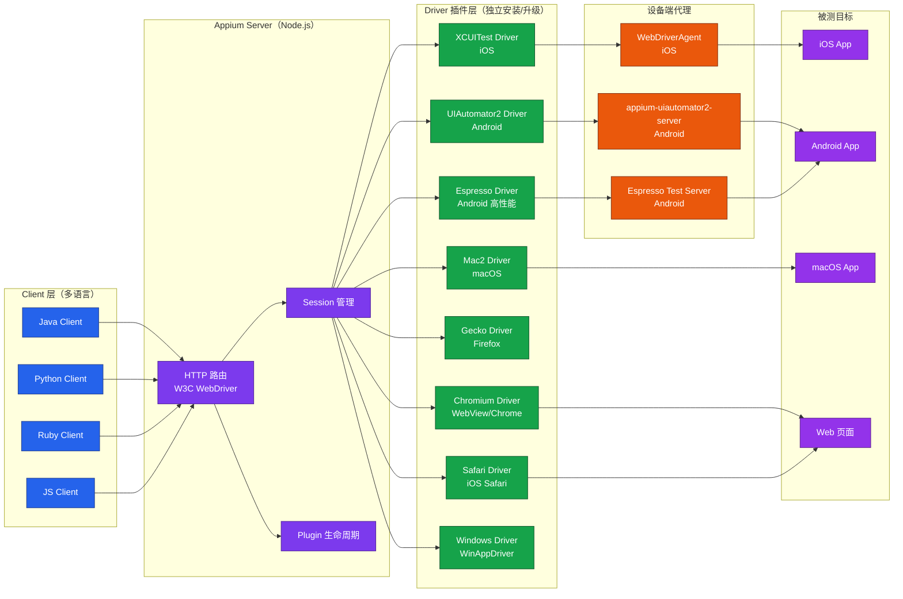
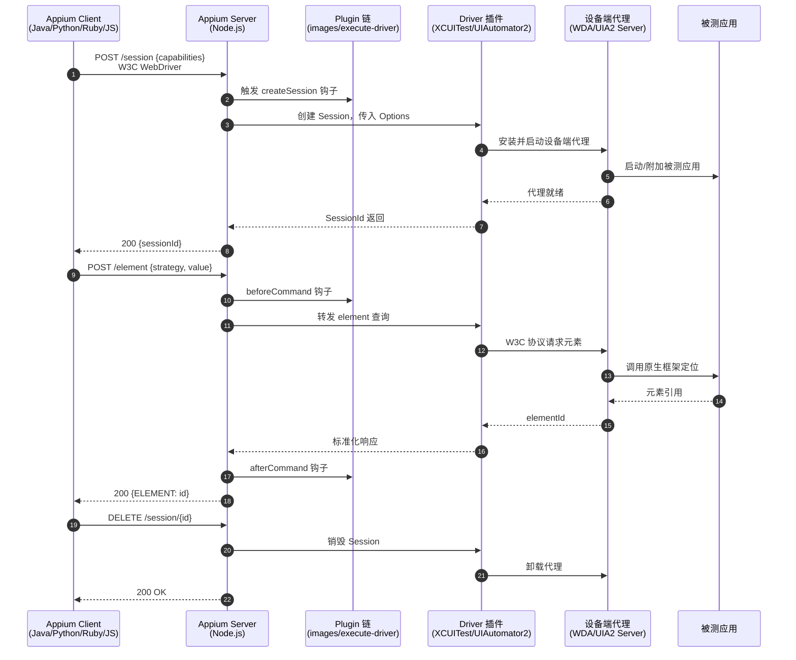

# Appium 3 架构与实战

Appium 是目前移动端自动化测试领域生态最完整、跨平台能力最强的开源框架，原生支持 iOS、Android、Windows、macOS、浏览器与混合应用。本文基于 **Appium 3.5.0（2026-05 发布）**，系统梳理其架构原理、版本演进、环境搭建、核心 API、Desired Capabilities、3.x 新特性、实战示例以及工程化最佳实践。旧文档中关于 Appium Desktop、Xcode 8（2016）、`DesiredCapabilities` 类、JSON Wire Protocol、`find_element_by_id` 等内容均已淘汰，本文不再保留，所有图片引用一并移除。

## 一、核心概念

### 1.1 Appium 是什么

Appium 是一个跨平台、跨语言的移动应用自动化测试框架，核心定位是"用一套 API 测试所有移动平台"。它通过 W3C WebDriver 协议将测试脚本与平台原生自动化框架解耦，使同一份测试代码可以在 iOS、Android、Windows、macOS 等多个平台上运行。Appium 不侵入应用源码、不重新打包，被测应用以原始形态安装到设备或模拟器上，因此可以测试任何发布版本，包括线上的 App Store / Google Play 包。

Appium 支持三类被测对象：

- **Native App**：原生应用，通过 accessibility id、class name、xpath 等策略定位控件；
- **Hybrid App**：原生壳 + WebView 混合应用，通过 `autoWebview` 能力切换上下文进入 H5 层；
- **Mobile Web**：移动端浏览器（Safari / Chrome），通过 `browserName` 能力启动浏览器，与 Selenium Web 测试同构。

### 1.2 架构原理：WebDriver 协议 + Driver 插件

Appium 采用 **Client-Server** 架构，由三大角色组成：Appium Client（语言客户端）、Appium Server（Node.js HTTP 服务）、Driver（平台驱动插件）。测试脚本通过 Client 将操作指令序列化为 W3C WebDriver HTTP 请求发送给 Server，Server 根据当前 Session 选中的 Driver 把请求转发到平台驱动，驱动再调用设备端代理（如 WebDriverAgent、appium-uiautomator2-server）执行真正的 UI 自动化操作。

三大角色的职责边界清晰：**Client** 是语言绑定层，封装 HTTP 调用细节，提供面向对象的 API；**Server** 是协议中枢，接收 W3C 命令、路由到对应 Driver、管理 Session 与插件生命周期，但不包含任何平台逻辑；**Driver** 是平台适配层，把 W3C 抽象命令翻译为平台原生 API 调用，并维护设备端代理的安装、启动、心跳。设备端代理运行在被测设备上，是 Appium 与平台原生测试框架之间的桥梁：iOS 上是 WebDriverAgent（基于 XCUITest），Android 上是 appium-uiautomator2-server（基于 Google UIAutomator V2）。

Appium 的关键设计是 **Driver 插件化**：每个平台的驱动都是独立 npm 包，可以独立版本号、独立升级，互不影响。Server 本身只负责协议路由、Session 管理、插件生命周期，不再内置任何平台逻辑。这一设计使 Appium 既能覆盖广度（任意平台都可写成 Driver 插件），又能保持核心精简。同时，Driver 之间版本解耦也意味着 iOS Driver 的紧急修复不需要等待 Android Driver 联调，大幅缩短了问题响应周期。



### 1.3 与 Selenium 的关系

Appium 在协议层与 Selenium 4 完全兼容，二者都基于 W3C WebDriver 规范。Appium Server 在协议上扩展了移动专属命令（如 `mobile: scroll`、`mobile: deepLink`），通过 `appium:` 前缀的能力字段与标准字段区分。Selenium 的语言客户端可以直接对 Appium Server 发起普通 WebDriver 请求，Appium 自己的客户端则在 Selenium 客户端基础上扩展了移动 API（手势、上下文切换、设备操作等）。

## 二、Appium 演进史

### 2.1 1.x：单体架构时代（2013-2022）

Appium 1.x 时代所有 Driver（XCUITest、UIAutomator2、Espresso、Windows 等）都内置在 `appium` npm 包内，Driver 与 Server 强版本绑定，无法独立升级。主要问题：

- **版本耦合**：升级一个 Driver 必须升级整个 Appium；
- **安装臃肿**：即使只测 iOS 也会下载全部 Driver；
- **协议混乱**：早期 JSON Wire Protocol 与后期 W3C 协议并存，跨平台行为不一致；
- **扩展困难**：新增平台必须改 Appium 核心代码并发布新版本。

### 2.2 2.x：Driver 插件化（2023-07 发布）

Appium 2.0 是一次架构级重写，核心变化：

| 维度 | Appium 1.x | Appium 2.0+ |
|------|-----------|-------------|
| Driver 管理 | 内置，不可分离 | 外部独立安装，`appium driver install <name>` |
| 通信协议 | JSON Wire Protocol 为主 | 全面 W3C WebDriver |
| 扩展机制 | 无 | Plugin 系统，`appium plugin install <name>` |
| 客户端 API | `DesiredCapabilities`、`findElementByXxx` | `Options` 子类、`AppiumBy` |
| 配套工具 | Appium Desktop 一体化 | Desktop 归档，Server + 独立 Inspector |
| 环境诊断 | 外部 `appium-doctor` | 内置 `appium doctor` |

### 2.3 3.x：平滑升级，更少 breaking changes（2024-11 发布）

Appium 3.0 的核心目标是"在不引入破坏性变更的前提下完成现代化"。相比 2.x，3.x 的变化集中在运行时与扩展规范，对上层 API 几乎透明：

- **Node.js 最低版本**：v20.19.0，原生 async/await 替换 bluebird Promise 库；
- **扩展命名规范**：Driver 与 Plugin 必须使用 `appium-<name>-driver`、`appium-<name>-plugin` 标准前缀，避免命名冲突；
- **Inspector 持续独立分发**：Appium Inspector 与 Server 代码库完全解耦，作为独立桌面应用单独安装与升级；
- **IPC 通道**：每个 Session 拥有独立的 Driver-Plugin 通信通道，插件之间互不干扰；
- **`--unsafe` 跨大版本升级**：跨大版本更新 Driver 时显式确认风险，避免静默破坏。

### 2.4 迁移指南

从 2.x 迁移到 3.x 通常只需升级 Node.js 与 Appium 主包即可，但需注意：

1. **检查 Node.js 版本**：`node --version` 必须 ≥ v20.19.0；
2. **重装 Driver**：`appium driver update --unsafe` 一次性升级所有 Driver 跨大版本；
3. **客户端版本对齐**：Java Client ≥ 9.x、Python Client ≥ 4.0、Ruby Client ≥ 13.0；
4. **移除 bluebird 依赖**：自定义插件若使用了 bluebird API 需替换为原生 Promise；
5. **检查扩展命名**：自研 Driver/Plugin 必须改用 `appium-` 前缀命名，否则 3.x 拒绝加载。

从 1.x 迁移到 2.x+ 的成本更高，需要同时完成三件事：把 `DesiredCapabilities` 替换为 `Options` 子类、把 `findElementByXxx` 替换为 `findElement(AppiumBy.xxx)`、把 JSON Wire Protocol 特有能力加上 `appium:` 前缀。建议先在 2.x 上完成 API 迁移与用例稳定化，再升级到 3.x，避免一次性引入过多变量导致问题难以定位。

## 三、环境搭建

### 3.1 前置依赖

```bash
# Node.js：Appium 3.x 要求 v20.19.0+
node --version
# 输出示例：v22.11.0

# Java：Android Driver 要求 JDK 17+
java --version
# 输出示例：openjdk 21.0.2

# Xcode：iOS Driver 要求 Xcode 16+（2026）
xcodebuild -version
# 输出示例：Xcode 16.4
```

### 3.2 安装 Appium Server 与 Driver

Appium Desktop 已于 2022 年归档停止维护，所有安装通过 npm 命令行完成：

```bash
# 全局安装 Appium 3.x
npm install -g appium

# 验证版本
appium --version
# 输出示例：3.5.0

# 安装 iOS Driver
appium driver install xcuitest

# 安装 Android Driver
appium driver install uiautomator2

# 跨大版本升级（3.x 引入 --unsafe 显式确认）
appium driver update --unsafe

# 查看已安装 Driver
appium driver list --installed
# 输出示例：
# xcuitest      9.1.0   [Installed]
# uiautomator2  4.1.0   [Installed]

# 环境诊断（替代旧的 appium-doctor）
appium doctor
```

### 3.3 Appium Inspector

Inspector 是独立于 Server 的桌面应用，不随 Server 一起安装，可从 GitHub Releases 单独下载（Appium Desktop 归档后 Inspector 即是其延续）。启动 Server 后，在 Inspector 中填入 `http://127.0.0.1:4723` 连接地址，或运行独立桌面应用连接到 Server 地址，即可进行元素定位、录制脚本、查看 DOM 树。

Inspector 的核心价值在于"所见即所得"的元素定位体验：左侧渲染设备实时画面，点击任意控件即可在右侧看到其完整属性（accessibility id、resource-id、class、xpath、bounds 等），并支持一键复制定位代码。录制功能可以将操作序列自动转换为多语言脚本片段，是编写测试用例的高效起点。但录制的代码通常缺少等待与断言，必须经过人工改造才能成为可维护的测试用例。

### 3.4 应用入口定位

测试 Android 应用时，`appPackage` 与 `appActivity` 是必填能力。获取应用入口的常用命令：

```bash
# 列出已连接设备
adb devices

# 启动应用后通过 logcat 抓取入口
adb logcat | grep -i displayed
# 输出示例：com.example.demo/.MainActivity

# 验证入口是否正确
adb shell am start -W -S -n com.example.demo/.MainActivity
# Status: ok 表示入口正确
```

iOS 应用则通过 `bundleId` 标识，可从 Xcode 工程或 `Info.plist` 中获取，也可以通过 `ideviceinstaller -l`（libimobiledevice）列出已安装应用及其 Bundle ID。

## 四、核心 API

### 4.1 Session 与 Options

Appium 3.x 已彻底废弃 `DesiredCapabilities` 类，所有 Session 配置通过 `Options` 子类传入。Session 是 Appium 的核心工作单元，每个 Session 对应一台设备上的一个被测目标，Session 之间状态完全隔离。

```python
# Python：通过 UiAutomator2Options 创建 Android Session
from appium import webdriver
from appium.options.android import UiAutomator2Options
from appium.webdriver.appium_service import AppiumService

# 启动 Appium Server（也可独立命令行启动）
service = AppiumService()
service.start(args=["--address", "127.0.0.1", "--port", "4723"])

# 配置 Capabilities（W3C 标准格式，自定义能力加 appium: 前缀）
options = UiAutomator2Options()
options.platform_name = "Android"
options.automation_name = "UiAutomator2"
options.device_name = "Pixel 8 API 34"
options.app_package = "com.example.demo"
options.app_activity = ".MainActivity"
options.set_capability("appium:noReset", True)        # 不重置应用状态
options.set_capability("appium:newCommandTimeout", 120)  # 命令超时 120s

driver = webdriver.Remote("http://127.0.0.1:4723", options)
```

### 4.2 元素定位策略

Appium 支持的定位策略由 W3C 标准与 `appium:` 扩展共同构成：

| 定位策略 | W3C 标准 | 适用场景 | 稳定性 |
|---------|---------|---------|--------|
| `accessibility id` | appium 扩展 | iOS 的 accessibilityIdentifier / Android 的 content-desc | 高（推荐） |
| `id` | W3C 标准 | Android resource-id / iOS name | 高 |
| `class name` | W3C 标准 | 控件类型如 `android.widget.EditText` | 中 |
| `xpath` | W3C 标准 | 复杂层级关系，但性能差 | 低（慎用） |
| `-android uiautomator` | appium 扩展 | Android 原生 UiSelector 表达式 | 中 |
| `-ios predicate string` | appium 扩展 | iOS NSPredicate 表达式 | 中 |

```java
// Java：使用 AppiumBy 替代旧的 findElementByXxx
import io.appium.java_client.AppiumBy;
import org.openqa.selenium.WebElement;

// 推荐：accessibility id，跨平台一致
WebElement username = driver.findElement(AppiumBy.accessibilityId("username_input"));

// Android 专属：UiSelector 表达式
WebElement loginBtn = driver.findElement(
    AppiumBy.androidUIAutomator("new UiSelector().resourceId(\"com.example.demo:id/btn_login\")")
);

// iOS 专属：predicate string
WebElement title = driver.findElement(
    AppiumBy.iOSNsPredicateString("label == '登录' AND type == 'XCUIElementTypeStaticText'")
);
```

### 4.3 手势操作

Appium 3.x 推荐使用 W3C Actions API 构建手势，平台专属手势通过 `mobile:` 命令调用：

```python
# Python：常见手势实现
from selenium.webdriver.common.action_chains import ActionChains
from selenium.webdriver.common.actions.action_builder import ActionBuilder
from selenium.webdriver.common.actions.pointer_input import PointerInput
from selenium.webdriver.common.actions import interaction

# 1. tap：单击（坐标）
def tap(driver, x, y):
    actions = ActionChains(driver)
    actions.w3c_actions = ActionBuilder(driver, mouse=PointerInput(interaction.POINTER_TOUCH, "touch"))
    actions.w3c_actions.pointer_action.move_to_location(x, y).pointer_down().pointer_up()
    actions.perform()

# 2. long_press：长按（按住 2 秒后释放）
def long_press(driver, element):
    ActionChains(driver).click_and_hold(element).pause(2).release().perform()

# 3. swipe：滑动（从 A 点滑到 B 点）
def swipe(driver, x1, y1, x2, y2, duration_ms=800):
    actions = ActionChains(driver)
    actions.w3c_actions = ActionBuilder(driver, mouse=PointerInput(interaction.POINTER_TOUCH, "touch"))
    actions.w3c_actions.pointer_action.move_to_location(x1, y1).pointer_down()
    actions.w3c_actions.pointer_action.pause(duration_ms / 1000.0)
    actions.w3c_actions.pointer_action.move_to_location(x2, y2).pointer_up()
    actions.perform()

# 4. scroll：滚动到指定元素（Android 专属 mobile: 命令）
driver.execute_script("mobile: scroll", {
    "elementId": element.id,
    "toVisible": True
})

# 5. iOS 专属：mobile: dragFromToForDuration
driver.execute_script("mobile: dragFromToForDuration", {
    "fromX": 100, "fromY": 500,
    "toX": 100, "toY": 200,
    "duration": 0.5
})
```

## 五、Desired Capabilities 体系

Capabilities 是描述 Session 的键值对集合，W3C 标准字段不需要前缀，Appium 扩展字段必须加 `appium:` 前缀。3.x 强制校验前缀，缺失前缀的能力会被拒绝而非静默忽略。

### 5.1 通用能力

| 能力 | 说明 | 示例 |
|------|------|------|
| `platformName` | 平台名（必填） | `iOS` / `Android` / `Windows` / `macOS` |
| `appium:automationName` | 自动化引擎 | `XCUITest` / `UiAutomator2` / `Espresso` |
| `appium:platformVersion` | 系统版本 | `17.0` / `14` |
| `appium:deviceName` | 设备名 | `iPhone 15 Pro` / `Pixel 8` |
| `appium:app` | 被测应用路径 | `/path/to/app.app` 或 `.apk` |
| `appium:noReset` | 不重置应用状态 | `true` |
| `appium:newCommandTimeout` | 命令超时（秒） | `120` |

### 5.2 Android 专属能力

| 能力 | 说明 |
|------|------|
| `appium:appPackage` | 应用包名，如 `com.example.demo` |
| `appium:appActivity` | 启动 Activity，如 `.MainActivity` |
| `appium:appWaitActivity` | 等待出现的 Activity |
| `appium:autoGrantPermissions` | 自动授予所有运行时权限 |
| `appium:uiautomator2ServerLaunchTimeout` | UiAutomator2 Server 启动超时 |

### 5.3 iOS 专属能力

| 能力 | 说明 |
|------|------|
| `appium:bundleId` | 应用 Bundle ID |
| `appium:xcodeSigningId` | 签名 ID |
| `appium:updatedWDABundleId` | 自定义 WDA Bundle ID（团队冲突时使用） |
| `appium:wdaLaunchTimeout` | WDA 启动超时 |
| `appium:usePrebuiltWDA` | 使用预编译的 WDA，加速启动 |

## 六、Appium 3 新特性

### 6.1 Driver 体系标准化

3.x 维护官方 Driver 矩阵，每个 Driver 独立版本号、独立 release cadence：

- **uiautomator2**：Android 主流驱动，基于 Google UIAutomator V2，支持跨应用、全面兼容；
- **espresso**：Android 高性能驱动，基于 Google Espresso，运行在应用进程内，速度更快但仅限被测应用；
- **xcuitest**：iOS 唯一驱动，通过 WebDriverAgent 调用 XCUITest 框架；
- **mac2**：macOS 桌面应用驱动，基于 AppleScript 与 XCUITest；
- **gecko**：Firefox 移动浏览器驱动；
- **chromium**：Android WebView / Chrome 驱动，复用 ChromeDriver；
- **safari**：iOS Safari 浏览器驱动；
- **windows**：Windows 桌面应用驱动，基于 WinAppDriver。

### 6.2 W3C WebDriver 标准化

3.x 完全移除 JSON Wire Protocol 兼容代码，所有命令走 W3C 规范，带来三点工程价值：

- **与 Selenium 4 完全互操作**：同一份 Selenium 客户端可同时驱动 Web 与移动，混合 Web 与移动的端到端测试不再需要切换协议栈；
- **错误码统一**：`element not interactable`、`stale element reference`、`no such element` 等错误语义跨平台一致，便于封装统一的异常处理与重试策略；
- **Actions 多输入源**：可同时组合触摸、键盘、鼠标事件，复杂手势不再依赖平台专属 API，例如"长按同时滑动"可以由一个 Action 序列描述。

### 6.3 跨平台能力

3.x 通过统一的 `mobile:` 命令命名空间抽象平台差异，例如 `mobile: scroll` 在 iOS 与 Android 上参数略有差异但命令名一致。配合 `appium:` 扩展能力，同一份测试代码可以通过 `platformName` 切换实现跨平台运行。

### 6.4 请求处理流程



## 七、实战示例：登录测试

### 7.1 Android 登录测试（Python）

```python
# test_android_login.py
import pytest
from appium import webdriver
from appium.options.android import UiAutomator2Options
from appium.webdriver.common.appiumby import AppiumBy

class TestAndroidLogin:
    def setup_method(self):
        # Android Capabilities
        options = UiAutomator2Options()
        options.platform_name = "Android"
        options.automation_name = "UiAutomator2"
        options.device_name = "Pixel 8 API 34"
        options.app_package = "com.example.demo"
        options.app_activity = ".MainActivity"
        options.set_capability("appium:noReset", True)
        options.set_capability("appium:autoGrantPermissions", True)
        options.set_capability("appium:newCommandTimeout", 120)
        self.driver = webdriver.Remote("http://127.0.0.1:4723", options)
        # 隐式等待，移动端建议 ≥ 15 秒
        self.driver.implicitly_wait(15)

    def test_login_success(self):
        # 通过 accessibility id 定位用户名输入框
        username = self.driver.find_element(
            AppiumBy.ACCESSIBILITY_ID, "username_input"
        )
        password = self.driver.find_element(
            AppiumBy.ACCESSIBILITY_ID, "password_input"
        )
        login_btn = self.driver.find_element(
            AppiumBy.ACCESSIBILITY_ID, "login_button"
        )
        # 输入凭据并提交
        username.send_keys("test_user")
        password.send_keys("P@ssw0rd123")
        login_btn.click()
        # 断言登录成功后的欢迎语
        welcome = self.driver.find_element(
            AppiumBy.ACCESSIBILITY_ID, "welcome_label"
        )
        assert welcome.text == "欢迎, test_user"

    def teardown_method(self):
        if self.driver:
            self.driver.quit()
```

### 7.2 iOS 登录测试（Java）

```java
// iOSLoginTest.java
import io.appium.java_client.ios.IOSDriver;
import io.appium.java_client.ios.options.XCUITestOptions;
import io.appium.java_client.AppiumBy;
import org.openqa.selenium.WebElement;
import org.testng.annotations.*;

import java.net.URL;
import java.time.Duration;

public class iOSLoginTest {
    private IOSDriver driver;

    @BeforeTest
    public void setUp() throws Exception {
        // iOS Capabilities：使用 XCUITestOptions 替代 DesiredCapabilities
        XCUITestOptions options = new XCUITestOptions()
            .setPlatformVersion("17.0")
            .setDeviceName("iPhone 15 Pro")
            .setBundleId("com.example.demo")
            .setAutomationName("XCUITest")
            .setNoReset(true)
            .setNewCommandTimeout(Duration.ofSeconds(120))
            // 复用预编译的 WDA，避免每次启动重新编译
            .setUsePrebuiltWDA(true);
        driver = new IOSDriver(new URL("http://127.0.0.1:4723"), options);
        driver.manage().timeouts().implicitlyWait(Duration.ofSeconds(15));
    }

    @Test
    public void testLoginSuccess() {
        // iOS 推荐优先使用 accessibility id，对应 accessibilityIdentifier
        WebElement username = driver.findElement(
            AppiumBy.accessibilityId("username_input")
        );
        WebElement password = driver.findElement(
            AppiumBy.accessibilityId("password_input")
        );
        WebElement loginBtn = driver.findElement(
            AppiumBy.accessibilityId("login_button")
        );
        username.sendKeys("test_user");
        password.sendKeys("P@ssw0rd123");
        loginBtn.click();

        // 等待欢迎语出现并断言
        WebElement welcome = driver.findElement(
            AppiumBy.accessibilityId("welcome_label")
        );
        assert welcome.getText().equals("欢迎, test_user") :
            "登录失败，实际文案: " + welcome.getText();
    }

    @AfterTest
    public void tearDown() {
        if (driver != null) {
            driver.quit();
        }
    }
}
```

## 八、常见陷阱与最佳实践

### 8.1 常见陷阱

- **隐式等待缺失**：移动端应用启动慢、网络延迟高，缺少隐式等待会导致首屏元素查找失败，建议设置为 15~30 秒；
- **xpath 滥用**：xpath 需要遍历整个 DOM 树，性能差且对 UI 变化敏感，应优先使用 accessibility id；
- **`noReset` 误用**：`noReset=true` 会保留上一次登录状态，登录类用例之间需要主动清理，否则容易串数据；
- **WDA 编译慢**：iOS 首次启动会重新编译 WebDriverAgent，CI 场景应使用 `usePrebuiltWDA=true` 配合预编译产物；
- **元素 stale**：列表页滑动后元素引用失效，需要重新查找而非复用旧引用；
- **`appium:` 前缀缺失**：3.x 严格校验，自定义能力缺失前缀会直接报错而非静默忽略；
- **Driver 跨大版本升级**：直接 `appium driver update` 在跨大版本时会被拒绝，必须显式 `--unsafe` 确认。

### 8.2 最佳实践

- **统一元素标识**：研发在控件上设置 `accessibilityIdentifier`（iOS）和 `content-desc`（Android），使测试代码跨平台复用，这是降低维护成本最有效的手段；
- **Page Object 模式**：将每个页面封装为独立类，测试用例只调用页面对象方法，UI 变化时只改一处，用例本身保持稳定；
- **显式等待优先**：对关键元素使用 `WebDriverWait` 显式等待，避免隐式等待的全局副作用，二者混用会导致等待时间不可预测；
- **Capability 分层**：基础 Capability 放在配置文件，环境相关 Capability（设备名、版本）通过环境变量注入，实现"一份代码多环境运行"；
- **Session 复用**：同一测试类内复用 Session，类间清理状态，平衡启动开销与隔离性，移动端 Session 创建通常需要 10-30 秒，频繁创建会显著拖慢用例；
- **CI 中预装 Agent**：将 WDA、UiAutomator2 Server 等设备端代理预装到基础镜像，避免每次 CI 运行重复安装，可以节省 30 秒以上的启动时间；
- **录屏与日志**：录屏用 `startRecordingScreen()` / `stopRecordingScreen()` 实现（Appium 没有通用的录屏 Capability），失败用例自动保留视频与 Server 日志作为证据，便于问题回溯与跨团队协作；
- **版本固定**：Driver 与 Client 版本在项目中固定，避免 `appium driver update` 静默引入不兼容变更，升级时通过专项测试验证。

## 总结

Appium 3.x 在 2.x 插件化架构基础上完成了现代化升级，Driver 体系标准化、W3C 协议全面落地、Inspector 独立分发、IPC 通道隔离等改进，使其在不引入破坏性变更的前提下持续演进。掌握 Appium 的核心在于理解"Client-Server-Driver"三层结构与 W3C WebDriver 协议：测试脚本通过 Client 序列化为 HTTP 请求，Server 路由到对应 Driver，Driver 通过设备端代理调用平台原生框架。从 1.x 的单体到 3.x 的插件化，Appium 的演进路线清晰指向"核心精简、扩展自由"的设计哲学，这也是它能在移动自动化领域长期保持主导地位的根本原因。

工程实践中，Appium 的真正价值不在于"能用一套 API 测所有平台"，而在于把"移动端质量保障"从一次性脚本提升为可持续运行的测试体系。结合 Page Object 模式、显式等待、Capability 分层、CI 预装代理等实践，可以让 Appium 测试在数百台设备上稳定运行数千个用例，真正成为发布流水线上的质量门禁。
