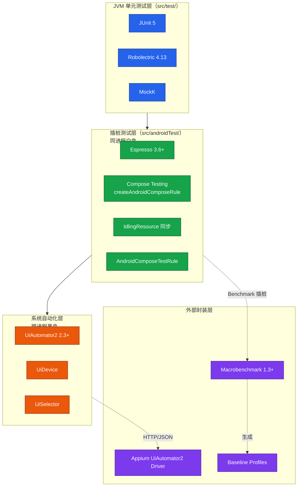
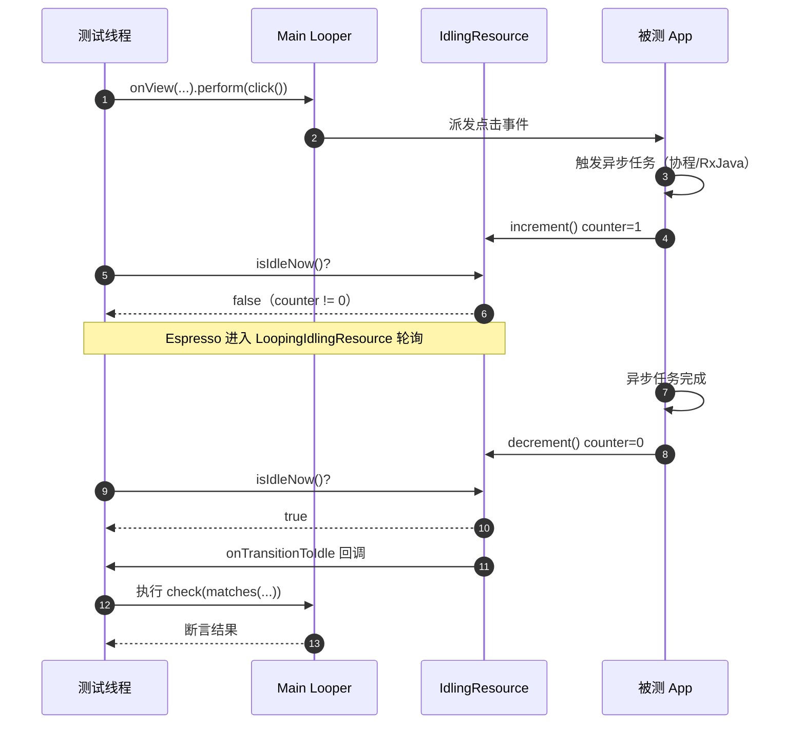

# Android 自动化（UiAutomator2 与 Espresso）

Android 自动化测试在 2026 年已经形成了清晰的分层体系。Google 官方维护的 **Espresso** 与 **UiAutomator2** 构成了 Android 端 UI 测试的双基石：前者面向应用内白盒测试，主攻单 App 内部交互的快速回归；后者面向系统级黑盒测试，主攻跨应用、跨进程、系统设置等场景。在此基础上，**Compose Testing** 成为 Jetpack Compose 应用的官方测试方案，**Macrobenchmark** 与 **Baseline Profiles** 则补齐了性能基准与启动优化的能力闭环。本文基于 **Android Studio 2026.1** 与 **AndroidX Test 1.6.x** 系统梳理这一工具链的核心概念、实战写法与工程化最佳实践，旧文档中关于 Appium Desktop 录制、UIAutomatorViewer 抓取 page source、`uiautomator1` 等内容均已淘汰，本文不再保留。

## 一、核心概念

### 1.1 Android 自动化测试框架全景

Android 测试框架按"测试代码与被测应用的相对位置"分为三层：

- **单元测试层（Local Unit Test）**：运行在 JVM 上，位于 `src/test/`，依赖 JUnit 5 + Robolectric，不依赖真机。
- **插桩测试层（Instrumented Test）**：运行在设备/模拟器的 Android Runtime 上，位于 `src/androidTest/`，通过 Instrumentation Registry 注入到被测进程，Espresso、Compose Testing 均属此层。
- **系统自动化层**：以独立 APK 形式部署，通过 UiAutomator2 框架跨进程操作任意应用，Appium UiAutomator2 driver 即封装此层。



### 1.2 白盒 vs 黑盒：选型决策

理解两个框架的边界，是选型的第一步。Espresso 与 UiAutomator2 并非互相替代，而是互补关系。

| 维度 | Espresso | UiAutomator2 |
|------|----------|--------------|
| 测试类型 | 白盒（同进程） | 黑盒（跨进程） |
| 代码位置 | `src/androidTest/`，与被测 App 同 APK | 独立测试 APK，与被测 App 解耦 |
| 主线程同步 | 内置 LoopingIdlingResource，自动等待 | 无内置同步，需显式 `UiDevice.waitForIdle` |
| 跨应用能力 | 不支持 | 支持（启动外部 App、系统设置、通知栏） |
| 执行速度 | 快（同进程直接调用） | 慢（通过 AccessibilityService 反射） |
| Compose 支持 | 通过 `compose-test` 互操作 | 仅能识别语义树，无法精细操作 |
| 典型场景 | 单 App 内 UI 回归、表单、断言 | 端到端流程、Push 通知、系统权限弹窗、第三方 App 跳转 |

工程实践中通常采用"Espresso 主内、UiAutomator2 主外"的策略：单 App 内的快速回归交给 Espresso 跑在 PR 流水线（< 2 分钟），跨应用端到端流程交给 UiAutomator2 跑在 Nightly 流水线（10–30 分钟）。

## 二、Espresso 实战

### 2.1 三大核心 API：ViewMatchers / ViewActions / ViewAssertions

Espresso 的所有测试代码都遵循 `onView(Matcher).perform(Action).check(Assertion)` 的链式结构，分别对应"找到—操作—断言"三段式。

```kotlin
// build.gradle.kts（模块级）
android {
    defaultConfig {
        testInstrumentationRunner = "androidx.test.runner.AndroidJUnitRunner"
    }
}
dependencies {
    androidTestImplementation("androidx.test.espresso:espresso-core:3.6.1")
    androidTestImplementation("androidx.test.ext:junit:1.2.1")
    androidTestImplementation("androidx.test:runner:1.6.2")
}
```

```kotlin
// 登录场景的 Espresso 用例：完整的三段式结构
@RunWith(AndroidJUnit4::class)
class LoginEspressoTest {

    @get:Rule
    val activityRule = ActivityScenarioRule(LoginActivity::class.java)

    @Test
    fun 输入正确账号密码_登录成功_跳转主页() {
        // 1) ViewMatchers：通过 withId / withText 定位 View
        onView(withId(R.id.et_username))
            // 2) ViewActions：clearText + typeText 链式操作
            .perform(clearText(), typeText("tester@example.com"))
        onView(withId(R.id.et_password))
            .perform(clearText(), typeText("P@ssw0rd!"))
        onView(withId(R.id.btn_login))
            .perform(click()) // 点击登录按钮

        // 3) ViewAssertions：校验主页标题是否出现
        onView(withText("欢迎回来"))
            .check(matches(isDisplayed()))
    }
}
```

需要特别注意的是，Espresso 的 `onView` 在视图层级中查找时，**匹配到多个或零个都会抛异常**。对于 RecyclerView 的子项，应使用 `onView(withId(...))` 配合 `RecyclerViewActions` 而非直接 `onData`——后者只能用于 ListView/Spinner 等 AdapterView，对 RecyclerView 无效。

### 2.2 IdlingResource：异步同步的关键

Espresso 默认会同步主线程的 Looper 与 AsyncTask 队列，但对自定义线程池、RxJava、协程的异步任务无感知。`IdlingResource` 是官方提供的同步扩展点，让 Espresso 知道"何时应用处于空闲状态"。

```kotlin
// 自定义 IdlingResource：监控协程异步任务的执行计数
class CoroutineIdlingResource : IdlingResource {
    private val counter = AtomicInteger(0)
    @Volatile private var callback: IdlingResource.ResourceCallback? = null

    fun increment() = counter.incrementAndGet()
    fun decrement() {
        counter.decrementAndGet()
        if (isIdleNow) callback?.onTransitionToIdle()
    }

    override fun getName(): String = "CoroutineIdlingResource"
    override fun isIdleNow(): Boolean = counter.get() == 0
    override fun registerIdleTransitionCallback(callback: IdlingResource.ResourceCallback) {
        this.callback = callback
    }
}

// 在 Application 中注入并在测试中注册
@RunWith(AndroidJUnit4::class)
class AsyncLoginTest {
    @get:Rule val rule = ActivityScenarioRule(LoginActivity::class.java)
    private val idling = CoroutineIdlingResource()

    @Before fun setUp() {
        // 将 idling 注入到被测 App 的 Repository 中后注册到 Espresso
        IdlingRegistry.getInstance().register(idling)
    }
    @After fun tearDown() {
        IdlingRegistry.getInstance().unregister(idling)
    }

    @Test fun 异步登录完成后_显示用户头像() {
        onView(withId(R.id.btn_login)).perform(click())
        // Espresso 会自动阻塞直到 isIdleNow 返回 true
        onView(withId(R.id.iv_avatar)).check(matches(isDisplayed()))
    }
}
```

### 2.3 Test Rules：测试生命周期编排

Espresso 的 Test Rule 体系决定了 Activity 启动、Intent 注入、权限授予等行为的编排方式。`ActivityScenarioRule` 是 2026 年的默认选择（旧版 `ActivityTestRule` 已弃用）；`GrantPermissionRule` 用于一次性授予运行时权限；`IntentsTestRule` / `IntentsRule` 用于验证对外 Intent。

```kotlin
@RunWith(AndroidJUnit4::class)
class ShareIntentTest {
    @get:Rule
    val permissionRule: GrantPermissionRule =
        GrantPermissionRule.grant(Manifest.permission.CAMERA)

    @get:Rule
    val activityRule = ActivityScenarioRule(MainActivity::class.java)

    @get:Rule
    val intentsRule = IntentsRule()

    @Test
    fun 点击分享_弹出系统分享面板() {
        // 准备：拦截 ACTION_CHOOSER，避免真正打开微信/支付宝
        intending(Intent.createChooser(Intent(), "分享"))
            .respondWith(Instrumentation.ActivityResult(0, null))
        // 执行
        onView(withId(R.id.btn_share)).perform(click())
        // 断言
        intended(allOf(hasAction(Intent.ACTION_CHOOSER), hasExtraWithKey(Intent.EXTRA_INTENT)))
    }
}
```



## 三、UiAutomator2 实战

### 3.1 UiDevice / UiObject / UiSelector 三件套

UiAutomator2 的核心模型是：通过 `UiDevice` 拿到设备的全局句柄，通过 `UiSelector` 描述要查找的控件特征，最终得到 `UiObject2` 进行操作。它运行在被测应用之外，因此**不需要被测 App 的源码**，只要 APK 能装上就能测。

```kotlin
// build.gradle.kts
dependencies {
    androidTestImplementation("androidx.test.uiautomator:uiautomator:2.3.0")
    androidTestImplementation("androidx.test.ext:junit:1.2.1")
}
```

```kotlin
@RunWith(AndroidJUnit4::class)
class CrossAppUiAutomatorTest {

    private lateinit var device: UiDevice

    @Before
    fun setUp() {
        // 获取设备实例，并按 home 键回到桌面保证起始状态一致
        device = UiDevice.getInstance(InstrumentationRegistry.getInstrumentation())
        device.pressHome()
    }

    @Test
    fun 从浏览器复制文本_粘贴到备忘录_验证内容一致() {
        // 1) 启动 Chrome（通过 Intent 启动，不依赖被测 App）
        val chrome = context.packageManager
            .getLaunchIntentForPackage("com.android.chrome")!!
        context.startActivity(chrome)

        // 2) UiSelector：按 resource-id 定位地址栏并输入
        val addressBar = device.wait(
            Until.hasObject(By.res("com.android.chrome", "url_bar")),
            5_000
        )
        device.findObject(By.res("com.android.chrome", "url_bar"))
            .text = "example.com"
        device.pressEnter()

        // 3) 长按选中并复制
        val pageText = device.findObject(By.clazz("android.webkit.WebView"))
            .wait(Until.hasObject(By.clazz("android.widget.TextView")), 5_000)
        device.findObject(By.clazz("android.widget.TextView"))
            .longClick()
        device.findObject(By.text("复制")).click()

        // 4) 切到备忘录 App 并粘贴
        device.pressHome()
        context.startActivity(
            context.packageManager.getLaunchIntentForPackage("com.google.android.keep")!!
        )
        device.findObject(By.res("com.google.android.keep", "note_editor")).click()
        device.findObject(By.res("com.google.android.keep", "note_editor")).longClick()
        device.findObject(By.text("粘贴")).click()

        // 5) 断言：粘贴板内容应出现在编辑区
        val editor = device.findObject(By.res("com.google.android.keep", "note_editor"))
        assertThat(editor.text).contains("example.com")
    }
}
```

### 3.2 系统设置与权限弹窗测试

UiAutomator2 在系统级场景中的价值是 Espresso 无法替代的，典型场景包括：通知权限开关、定位模式切换、系统权限弹窗一键授权、安装外部 APK 等。

```kotlin
@Test
fun 授予定位权限_后端拿到经纬度_上报服务() {
    // 启动被测 App 触发权限弹窗
    val app = context.packageManager.getLaunchIntentForPackage("com.demo.app")!!
    context.startActivity(app)

    // 用 By.text 兜底匹配系统的"仅在使用时允许"按钮（不同 ROM 文案不同）
    val allowBtn = device.wait(
        Until.findObject(By.textStartsWith("仅在使用时允许").or(By.text("While in use"))),
        10_000
    )
    allowBtn?.click()

    // 进入系统设置断言权限已被授予
    device.pressHome()
    val settings = Intent(Settings.ACTION_APPLICATION_DETAILS_SETTINGS)
        .setData(Uri.fromParts("package", "com.demo.app", null))
    context.startActivity(settings)
    device.findObject(By.text("权限")).click()
    device.findObject(By.text("位置")).click()
    val toggle = device.findObject(By.res("android:id/switch_widget"))
    assertThat(toggle.isChecked).isTrue()
}
```

需要注意的是，国内厂商 ROM（MIUI、ColorOS、HarmonyOS）的系统设置页面结构差异巨大，`By.text("权限")` 在不同 ROM 上可能找不到，应优先使用 `By.res("android:id/title")` + 文本兜底，并通过 `device.wait` 增加鲁棒性。

## 四、Compose Testing

Jetpack Compose 已成为 Android 官方推荐的 UI 框架，传统 Espresso 的 `onView(withId(...))` 无法穿透 Compose 的语义树，必须使用 `compose-ui-test` 提供的独立 API。

```kotlin
dependencies {
    androidTestImplementation("androidx.compose.ui:ui-test-junit4:1.7.0")
    debugImplementation("androidx.compose.ui:ui-test-manifest:1.7.0")
}
```

```kotlin
@RunWith(AndroidJUnit4::class)
class LoginComposeTest {

    @get:Rule
    // createAndroidComposeRule 是 Compose 测试的入口，启动 ComponentActivity 注入 Compose 内容
    val composeRule = createAndroidComposeRule<ComponentActivity>()

    @Test
    fun 输入手机号_点击获取验证码_按钮置灰直到倒计时结束() {
        composeRule.setContent {
            LoginScreen(onLoginClick = {})
        }

        // onNodeWithTag：开发者通过 Modifier.testTag("phone_input") 暴露的稳定标识
        composeRule.onNodeWithTag("phone_input")
            .performTextInput("13800138000")
        composeRule.onNodeWithText("获取验证码")
            .performClick()

        // 断言：按钮文案变为"重新获取（60s）"，且不可点击
        composeRule.onNodeWithText("重新获取（60s）")
            .assertIsDisplayed()
            .assertIsNotEnabled()

        // 时间穿梭：使用 mainClock 自动推进 60 秒
        composeRule.mainClock.advanceTimeBy(60_000)
        composeRule.onNodeWithText("获取验证码")
            .assertIsEnabled()
    }
}
```

Compose Testing 的关键差异点：① 测试代码不依赖 View ID，而是依赖 `testTag`，团队需统一约定 tag 命名规范；② 可通过 `mainClock.autoAdvance = false` 冻结动画，避免动画过程导致的 flaky；③ `onNodeWith*` 在匹配到多个节点时直接抛异常，需用 `onAllNodesWith*` + `[0]` 索引。

## 五、Appium + UiAutomator2：能力对比

Appium 3.x（当前最新版 3.5.0，与《Appium 3 架构与实战》一致）已全面插件化，UiAutomator2 driver 是 Android 端唯一主流驱动。其底层架构是：Appium Server 收到 WebDriver 协议的 HTTP 请求 → 通过 ADB 推送 `appium-uiautomator2-server-vX.apk` 与 `appium-uiautomator2-server-debug-androidTest.apk` 到设备 → 启动 UiAutomator2 服务进程 → 通过 HTTP 转发到设备端的 UiAutomator2 调用。

| 能力 | 原生 UiAutomator2 | Appium UiAutomator2 Driver |
|------|------------------|----------------------------|
| 编程语言 | 仅 Kotlin/Java | Python/Java/JS/TS/Ruby/C# |
| 执行位置 | 设备本地（同 APK） | PC 端通过 HTTP 转发 |
| 单次操作延迟 | 毫秒级 | 50–200ms（HTTP 往返） |
| 跨平台复用 | 否 | 与 iOS XCUITest 共用 API |
| 元素定位符 | `By.res` / `By.text` | `id` / `accessibility id` / `-android uiautomator` |
| 集成成本 | 高（需打测试 APK） | 低（标准 WebDriver 客户端） |
| CI 集成 | Gradle + AndroidJUnitRunner | 任意语言 + Selenium Grid |

选型建议：① 如果团队是 Python/JS 技术栈、需要复用 Web 测试基础设施、或需要单套脚本同时跑 Android 与 iOS → 选 Appium；② 如果团队是纯 Android 团队、追求执行速度与稳定性、且希望直接访问 AndroidX Test API → 选原生 UiAutomator2。

## 六、性能测试：Macrobenchmark 与 Baseline Profiles

### 6.1 Macrobenchmark

Macrobenchmark 是 AndroidX 推出的宏基准测试库，可在真机上对 App 启动、滚动、自定义操作做端到端性能测量。它独立于 `app` 模块，需单独建一个 `:macrobenchmark` Gradle 模块。

```kotlin
// :macrobenchmark/build.gradle.kts
plugins {
    id("com.android.test")  // 关键：使用 com.android.test 插件
    kotlin("android")
}
android {
    namespace = "com.demo.macrobenchmark"
    targetProjectPath = ":app"  // 指向被测 App 模块
    experimentalProperties["android.experimental.self-instrumenting"] = true
}
dependencies {
    implementation("androidx.benchmark:benchmark-macro-junit4:1.3.4")
}
```

```kotlin
@RunWith(AndroidJUnit4::class)
class StartupBenchmark {
    @get:Rule
    val benchmarkRule = MacrobenchmarkRule()

    @Test
    fun 冷启动_从编译模式到首帧渲染_应低于800ms() {
        benchmarkRule.measureRepeated(
            packageName = "com.demo.app",
            metrics = listOf(StartupTimingMetric()),  // 采集启动耗时
            iterations = 10,                          // 重复 10 次取中位数
            startupMode = StartupMode.COLD            // 冷启动模式
        ) {
            // 通过 Intent 触发冷启动
            pressHome()
            startActivityAndWait()
        }
    }

    @Test
    fun 列表滚动_95分帧时间应低于16ms() {
        benchmarkRule.measureRepeated(
            packageName = "com.demo.app",
            metrics = listOf(FrameTimingMetric()),
            iterations = 5
        ) {
            startActivityAndWait()
            // 通过 device 找到列表并滚动
            val list = device.findObject(By.res("recycler"))
            list.setGestureMargin(100)
            list.fling(Direction.DOWN)
            device.waitForIdle()
        }
    }
}
```

### 6.2 Baseline Profiles

Baseline Profiles 是 AGP 8.x 起官方力推的性能优化机制：通过 Macrobenchmark 在典型用户路径下采集 AOT 编译热点，生成 `baseline-prof.txt`，随 APK 一起发布。安装时 ART 会预编译这些类与函数到原生代码，**冷启动时间可降低 20%–40%**。

```kotlin
// 1) 在 Macrobenchmark 中生成 profile
@Test
fun 生成BaselineProfile() {
    benchmarkRule.measureRepeated(
        packageName = "com.demo.app",
        metrics = listOf(),
        iterations = 5,
        // 关键：使用 BaselineProfileMode.Require 开启 profile 采集
        compilationMode = CompilationMode.Partial(
            baselineProfileMode = BaselineProfileMode.Require
        )
    ) {
        pressHome()
        startActivityAndWait()
        device.findObject(By.res("recycler")).fling(Direction.DOWN)
    }
}

// 2) 在 app/build.gradle.kts 中启用自动集成
android {
    baselineProfile {
        automaticGenerationDuringBuild = true
        mergeIntoMain = true
    }
}
```

CI 流水线推荐做法：每周 Nightly 跑一次 Baseline Profile 生成任务，将产物提交回主分支，下次发版自动享受最新热点优化。

## 七、常见陷阱与最佳实践

### 7.1 同步陷阱

- **Espresso 不感知协程**：默认只同步主线程 Looper 与 AsyncTask，自定义线程池必须注册 IdlingResource，否则会出现"找不到 View"的 flaky。
- **UiAutomator2 无内置同步**：必须显式调用 `device.wait(Until.hasObject(...), timeout)`，直接 `findObject` 在页面未加载时返回 `null`。
- **Compose 测试动画**：需先 `mainClock.autoAdvance = false` 冻结动画，长动画测试再手动 `mainClock.advanceTimeBy` 推进。

### 7.2 测试稳定性

- **不要 hardcode 设备尺寸**：滑动操作应使用 `device.displayWidth / 2` 而非 `1080`。
- **资源 ID 优先级**：`resource-id` > `content-desc` > `text` > `className`，避免使用 XPath，性能差且易碎。
- **测试独立性**：每个 `@Test` 之间应通过 `@Before`/`@After` 重置状态，禁止依赖执行顺序。

### 7.3 工程化建议

- **分层运行**：单元测试（< 1 分钟）跑 PR；Espresso 用例（5–10 分钟）跑 Merge 前；UiAutomator2 + Macrobenchmark（20+ 分钟）跑 Nightly。
- **Shard 并行**：AndroidX Test 支持 `numShards`/`shardIndex` 插桩参数（`adb shell am instrument -e numShards N -e shardIndex i`），将用例分散到多台设备并行执行，可把 30 分钟的套件压到 5 分钟。
- **测试标签**：用自定义注解（如 `@SmokeTest`）区分烟雾测试与全量回归，CI 中按注解挑选。
- **Flaky 重试**：借助 `androidx.test.rule.RetryRule` 对已知 flaky 用例做最多 2 次重试，但要警惕"重试掩盖真实问题"。

### 7.4 版本对齐

2026 年的关键版本基线：AndroidX Test Core 1.6.1、Espresso 3.6.1、UiAutomator 2.3.0、Compose UI Test 1.7.x、Macrobenchmark 1.3.4、AGP 8.7+。建议在 `gradle/libs.versions.toml` 中统一管理这些版本，避免子模块漂移。

## 总结

Espresso 与 UiAutomator2 构成了 Android 端 UI 测试的双支柱，前者专注应用内白盒快速回归，后者覆盖系统级黑盒端到端场景，两者通过 AndroidX Test 共享同一套插桩基础设施。Compose Testing 顺应了声明式 UI 的演进，Macrobenchmark + Baseline Profiles 则把"测试"从功能正确性扩展到了性能正确性。在实际工程中，框架选型应服从场景需求：单 App 内回归用 Espresso，跨应用流程用 UiAutomator2，Compose 应用必用 Compose Testing，性能基准与启动优化交给 Macrobenchmark。Appium UiAutomator2 Driver 在跨语言、跨平台复用场景下仍有不可替代的价值，但要清醒认知其 HTTP 转发带来的延迟成本，在性能敏感场景优先使用原生方案。
