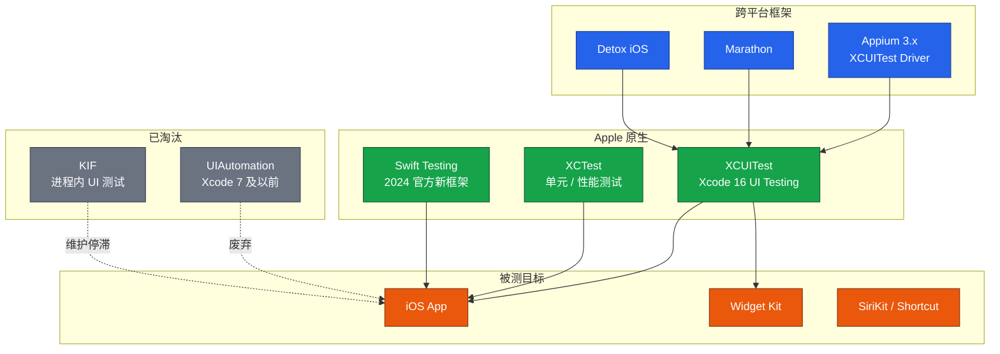
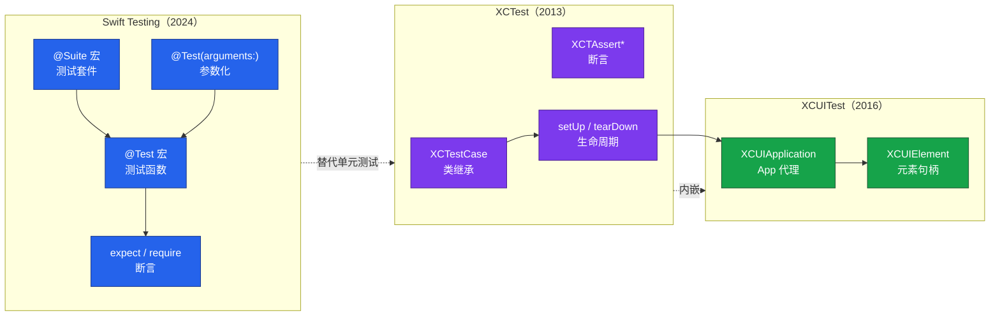
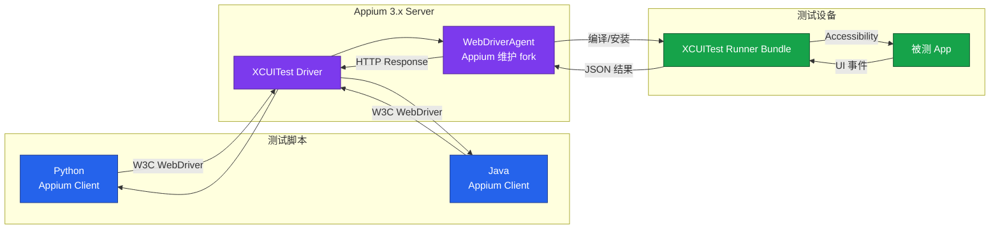

# iOS 自动化（XCUITest）

iOS 自动化测试在 2016 年 Xcode 8 引入 XCUITest 后完成了从 UIAutomation 的彻底切换，至今已成为 Apple 平台 UI 测试的事实标准。本文基于 **Xcode 16 / Swift 6（2026）** 系统梳理 iOS 自动化的核心架构、XCUITest API 体系、手势与异步等待、Swift Testing（2024 官方新测试框架）、Appium 对 XCUITest driver 的封装、Xcode Cloud CI/CD，以及工程化实践中的常见陷阱。旧文档以 Appium + Xcode 8 为背景、依赖 WDA 编译与 Python 2 的内容已不再适用，本文不再保留。

## 一、核心概念

### 1.1 iOS 自动化测试框架全景

iOS 上的自动化测试框架可以按"运行层级"和"是否跨平台"两个维度划分。从底层到上层依次为：XCTest 系（单元/性能测试，运行在进程内）、XCUITest（UI 测试，运行在独立进程，通过 Accessibility 操作目标 App）、Marathon / Detox（基于 XCUITest 的二次封装）、Appium（跨平台，iOS 端封装 XCUITest driver）。KIF 早期通过 Accessibility 在进程内做 UI 测试，自 XCUITest 出现后已逐步退出主流；EarlGrey 由 Google 维护，性能优秀但生态较窄，2024 年后逐步被 Swift Testing + XCUITest 组合取代。

Detox 由 Wix 维护，原本主打 React Native，2024 年起也支持原生 iOS，特点是 Grey Box 模式与同步等待机制，对 RN 工程有较好匹配度。Marathon 则是 Malinskiy 团队（MarathonLabs）推出的多平台并行测试执行器，本身不提供 API，而是作为 XCUITest 测试结果的"分发与汇总层"，将多个 `xcodebuild test` 任务分发到设备池并行执行，再统一聚合到 Allure Report。理解这些框架的分层关系，有助于在不同场景下做正确选型：原生工程优先 XCUITest，跨端统一栈考虑 Appium，大规模并行回归考虑 Marathon。



### 1.2 XCUITest 在测试体系中的定位

XCUITest 是 XCTest 框架的子模块（`import XCTest`），专门用于 UI 层测试。它运行在独立的 UI Test Runner 进程中，通过 iOS 系统的 Accessibility 服务与目标 App 通信，因此具有"跨进程"特性：可以测试系统弹窗、Permission Prompt、Push 通知、跨 App 跳转等进程内框架无法覆盖的场景。同时，由于走的是系统辅助功能通道，XCUITest 无法直接调用 App 内部私有方法，更贴近真实用户视角，但执行速度比 XCTest 单元测试慢一个数量级。

工程实践中通常遵循"金字塔模型"：单元与性能测试用 XCTest/Swift Testing，覆盖 70% 以上；集成测试用 XCTest + testHost 模式；UI 端到端测试用 XCUITest，控制在 10%-20%，避免成为流水线瓶颈。Xcode 16 在并行测试、Test Plan 复用、Test Report 可观测性上做了大量增强，使 XCUITest 的 ROI 进一步提升。

### 1.3 Xcode 8 → Xcode 16 的关键演进

| 维度 | Xcode 8（2016） | Xcode 16（2026） |
|------|----------------|-----------------|
| UI 测试框架 | XCUITest 初版 | XCUITest 成熟期 + Swift Testing 协同 |
| 测试语言 | Swift 3 | Swift 6（严格并发） |
| 测试运行 | 单线程串行 | 多目标并行 + 分布式测试 |
| 录制工具 | UI Test Record 基础版 | 智能录制 + Accessibility Inspector 联动 |
| CI/CD | Xcode Server（已停更） | Xcode Cloud + 自托管 GitHub Actions |
| 测试报告 | 基础日志 | Test Report 含截图/视频/性能指标 |
| Widget 测试 | 不支持 | WidgetKit Testing 支持 |

## 二、XCUITest 实战

### 2.1 工程结构

XCUITest 测试代码必须放在与 App Target 同级的 UI Test Target 中。Xcode 16 创建工程时勾选 "Include Testing Bundle → UI Testing Bundle" 即可生成。结构示例：

```
MyApp/
├── MyApp/                 # App 主 target
├── MyAppTests/            # 单元测试 target（XCTest / Swift Testing）
└── MyAppUITests/          # UI 测试 target（XCUITest）
    └── MyAppUITestsLaunchTests.swift
```

### 2.2 XCUIApplication 启动

`XCUIApplication` 是被测 App 的代理，所有操作都从 `launch()` 开始：

```swift
import XCTest

final class LoginUITests: XCTestCase {
    let app = XCUIApplication()           // 被测 App 代理
    
    override func setUpWithError() throws {
        continueAfterFailure = false      // 失败后不再继续，便于定位
        app.launchArguments = ["-UITestMode", "1"]     // 注入启动参数
        app.launchEnvironment = ["MOCK_API": "true"]   // 注入环境变量
    }
    
    func testLoginSuccess() throws {
        app.launch()                       // 启动 App
        
        // 通过 accessibilityIdentifier 定位元素
        let usernameField = app.textFields["usernameTextField"]
        let passwordField = app.secureTextFields["passwordTextField"]
        let loginButton   = app.buttons["loginButton"]
        
        usernameField.tap()
        usernameField.typeText("tester")   // 输入用户名
        passwordField.tap()
        passwordField.typeText("secret")   // 输入密码
        loginButton.tap()                  // 点击登录
        
        XCTAssertTrue(app.staticTexts["welcomeLabel"].waitForExistence(timeout: 5))
    }
}
```

`launchArguments` 与 `launchEnvironment` 是 XCUITest 控制 App 行为的核心通道，常用于：跳过新手引导、Mock 网络层、强制走测试环境、关闭动画（`-UIPrefersReducedMotion 1`）等。

### 2.3 XCUIElement 与 XCUIElementQuery

`XCUIElement` 是元素句柄，`XCUIElementQuery` 是查询表达式。XCUITest 采用**惰性求值**：查询不会立即触发搜索，而是在属性访问或交互时才解析，这意味着元素可以"先定义、后使用"，且每次访问都重新查询，避免 stale element 问题。`XCUIElementType` 枚举定义了 40 余种元素类型（`button`、`textField`、`cell`、`slider`、`switch`、`webView` 等），通过 `app.buttons`、`app.textFields` 这种类型化属性可一次性过滤出同类型元素集合，再通过下标或 `Predicate` 二次筛选，避免遍历整棵 UI 树。

定位方式优先级推荐如下：

```swift
// 1. accessibilityIdentifier（推荐：稳定、与 UI 解耦）
let btn = app.buttons["loginButton"]

// 2. NSPredicate 组合定位
let cell = app.cells.containing(NSPredicate(format: "label CONTAINS '张三'")).firstMatch

// 3. 下标索引（脆弱，仅作兜底）
let firstTab = app.tabBars.buttons.element(boundBy: 0)

// 4. firstMatch 提前短路，提升性能
let target = app.buttons["favorite"].firstMatch
```

`firstMatch` 在 Xcode 9 后引入，会返回第一个匹配元素并停止搜索，避免遍历整棵 UI 树，是性能优化关键。

### 2.4 Predicate 定位进阶

`NSPredicate` 支持 `label`、`title`、`value`、`placeholderValue`、`isEnabled`、`isSelected`、`frame` 等属性，适合无 `accessibilityIdentifier` 时使用：

```swift
// 同时匹配多个条件
let query = app.buttons.matching(
    NSPredicate(format: "label BEGINSWITH '购买' AND isEnabled == YES")
)
query.allElementsBoundByIndex.forEach { $0.tap() }

// 通过 identifier 模糊匹配
let cells = app.cells.matching(
    NSPredicate(format: "identifier MATCHES %@", "productCell_\\d+")
)
```

## 三、手势与交互

### 3.1 基础手势

XCUITest 通过 `XCUIElement` 的实例方法提供手势，复杂序列则用 `XCUICoordinate`：

```swift
let cell = app.cells["orderCell_42"]

cell.tap()                          // 单击
cell.press(forDuration: 2.0)       // 长按 2 秒
cell.swipeLeft()                    // 左滑
cell.swipeUp()                      // 上滑
cell.pinch(withScale: 2.0, velocity: 1.0)  // 放大
cell.pinch(withScale: 0.5, velocity: -1.0) // 缩小
cell.rotate(3.14)                   // 旋转弧度
cell.twoFingerTap()                 // 双指点击
```

### 3.2 基于坐标的复杂手势

当目标元素没有 Accessibility 标识（如地图、Canvas、视频进度条）时，使用 `XCUICoordinate`：

```swift
// 以屏幕比例定位：第一个坐标是参照点，第二个是相对偏移
let start = app.coordinate(withNormalizedOffset: CGVector(dx: 0.5, dy: 0.8))
let end   = app.coordinate(withNormalizedOffset: CGVector(dx: 0.5, dy: 0.2))
start.press(forDuration: 0.1, thenDragTo: end)   // 模拟下拉刷新/拖动
```

### 3.3 3D Touch / Context Menu / 长按预览

iOS 13+ 的 Context Menu 与 3D Touch 在 XCUITest 中通过 `press(forDuration:)` 触发，长按 0.5s-1.5s 区间会唤起预览，超过 1.5s 进入完整菜单：

```swift
cell.press(forDuration: 1.5)        // 唤起 Context Menu
let menu = app.otherElements["ContextMenu"]
XCTAssertTrue(menu.waitForExistence(timeout: 2))
app.buttons["分享"].tap()
```

iOS 17 起 `press(forDuration:)` 内部已统一适配 Context Menu 与 Long Press 两种交互，不再需要按设备区分。

## 四、异步等待

### 4.1 等待存在的标准范式

XCUITest **没有**类似 Selenium 的隐式等待，所有等待必须显式表达。最常用的是 `waitForExistence(timeout:)`：

```swift
let alert = app.alerts["网络错误"]
XCTAssertTrue(alert.waitForExistence(timeout: 5))   // 等待 Alert 出现
```

XCUITest 的等待机制背后是 XCTest 的轮询机制：默认每 0.5 秒重试一次，超时返回 false 而非抛异常。这意味着即使超时，后续代码仍会执行，因此 `waitForExistence` 通常配合 `XCTAssertTrue` 使用以触发断言失败。需要特别注意的是，`exists` 属性仅表示元素在 UI 树中存在，并不代表可见或可交互，对"可见性"的判断需要走 `isHittable` 属性。

### 4.2 NSPredicate 组合条件等待

对于"出现"以外的状态（可点击、包含文本、特定 frame），用 `NSPredicate.expectation(for:)` + `XCTWaiter`：

```swift
let button = app.buttons["submit"]
let predicate = NSPredicate(format: "isEnabled == YES AND label == '提交'")
let expectation = XCTNSPredicateExpectation(predicate: predicate, object: button)

let result = XCTWaiter().wait(for: [expectation], timeout: 10)
XCTAssertEqual(result, .completed, "提交按钮在 10 秒内未变为可用状态")
```

### 4.3 可交互性与状态断言

XCUITest 在调用 `tap()`、`typeText()` 时会先等待元素 `hittable`，默认超时由 `XCTWaiter` 全局超时控制（约 5s）。若元素加载后仍不可点击（被遮罩、Alpha=0、.isEnabled=false），需主动断言状态而非直接交互：

```swift
// ❌ 错误：直接 tap 可能因遮挡失败
app.buttons["submit"].tap()

// ✅ 正确：先断言可交互
let submit = app.buttons["submit"]
XCTAssertTrue(submit.waitForExistence(timeout: 5))
XCTAssertTrue(submit.isEnabled)
submit.tap()
```

## 五、Swift Testing（2024）

### 5.1 框架定位

Swift Testing 是 Apple 在 WWDC 2024 推出的全新测试框架，随 Swift 6 一同开源，目标是替代 XCTest 中**单元测试与性能测试**部分。它采用宏（Macro）驱动，API 更现代，原生支持参数化测试、并行执行、Trait 组合。XCUITest 的 UI 测试场景由于依赖 `XCUIApplication` 与 `XCTestCase` 生命周期，目前仍以 XCTest 为主，但 Xcode 16 已允许在 UI Test Target 中混用 Swift Testing 编写辅助断言。



### 5.2 @Test 与 @Suite 基础用法

```swift
import Testing
@testable import MyApp

@Suite("订单计算")
struct OrderCalculatorTests {
    let calc = OrderCalculator()
    
    @Test("满减计算", arguments: [
        (100.0, 10.0, 90.0),
        (200.0, 30.0, 170.0),
        (50.0, 0.0, 50.0),
    ])
    func discount(original: Double, off: Double, expected: Double) {
        #expect(calc.apply(original: original, discount: off) == expected)
    }
    
    @Test("负数金额应抛错")
    func rejectsNegative() {
        #expect(throws: OrderError.self) {
            try calc.validate(amount: -1)
        }
    }
}
```

### 5.3 与 XCTest 的对比

| 维度 | XCTest | Swift Testing |
|------|--------|---------------|
| API 风格 | OOP 类继承 | 宏 + 函数式 |
| 参数化 | 手动循环 / XCTestParameterized | 原生 `arguments:` |
| 断言 | `XCTAssertEqual` 等 | `#expect` / `#require` |
| 失败行为 | 抛异常，依赖 continueAfterFailure | `require` 立即停止，`expect` 继续 |
| 并行 | 需配 testTarget 配置 | 默认并行，按 Trait 控制 |
| XCUITest | 完整支持 | 仅断言部分支持，UI 启动仍用 XCTest |
| 最低支持 | 全部 iOS | iOS 13+ / macOS 10.15+（经 Swift Package 向后部署） |

Swift Testing 的 **Trait 体系**是其相比 XCTest 最显著的工程化优势。通过 `.tags(.smoke)`、`.disabled(if: ...)`、`.timeLimit(.seconds(30))`、`.bug("rdar://12345", relationship: .blocks)` 等 Trait，可以以声明式方式给测试用例打标签、控制跳过、限制超时、关联缺陷，而无需在 setUp/tearDown 中写大量分支逻辑。Xcode 16 的 Test Plan 也原生识别这些 Trait，可以基于 Tag 筛选执行子集。

迁移建议：新增单元测试直接用 Swift Testing；现有 XCUITest 保持 XCTest 不动；可在同一 Target 中混用，Xcode 16 会同时收集两套结果到 Test Report。

## 六、Appium + XCUITest Driver

### 6.1 Driver 封装关系

Appium 3.x 的 iOS driver 是 XCUITest 的"远程代理"：Appium Server 在 Mac 端启动一个 XCUITest runner bundle，注入到设备/模拟器，runner 内部跑 XCUITest 测试，Appium 通过自定义的 WDA 协议（已脱离 Facebook 原版 WDA，由 Appium 团队维护 fork，即 appium/WebDriverAgent）转发命令。本质上是"用 XCUITest 做执行引擎，用 WebDriver 协议做控制接口"。



### 6.2 Capabilities 示例

```python
# Appium 3.x + XCUITest Driver，基于 Xcode 16
caps = {
    "platformName": "iOS",
    "appium:automationName": "XCUITest",
    "appium:platformVersion": "18.2",          # iOS 18.2
    "appium:deviceName": "iPhone 16 Pro",       # 模拟器或真机名
    "appium:udid": "00008110-XXXX",             # 真机必填
    "appium:app": "/path/to/MyApp.app",         # .app 或 .ipa
    "appium:bundleId": "com.example.MyApp",
    "appium:xcodeOrgId": "TEAMID1234",          # 真机签名需要
    "appium:xcodeSigningId": "iPhone Developer",
    "appium:updatedWDABundleId": "com.myteam.WebDriverAgentRunner",  # 重签名 WDA
    "appium:usePrebuiltWDA": True,              # 复用预编译 WDA，加速启动
    "appium:wdaPort": 8100,
    "appium:maxTypingFrequency": 30,            # 限制 typeText 频率
    "appium:simpleIsVisibleCheck": True,        # 简化可见性判定
    "appium:includeSafariInWebviews": True,     # WebView 识别增强
    "appium:newCommandTimeout": 300,            # 5 分钟无命令断开
}
```

### 6.3 XCUITest vs Appium+XCUITest 能力对比

| 维度 | 原生 XCUITest | Appium + XCUITest |
|------|--------------|-------------------|
| 编程语言 | 仅 Swift / ObjC | Python / Java / JS / Ruby / C# |
| 跨平台 | 仅 iOS / iPadOS | iOS / Android / Windows / Mac |
| 启动速度 | 快（<2s） | 慢（首次需编译 WDA，30s+） |
| 元素定位 | Accessibility + Predicate | W3C 定位策略 + `-ios predicate string` 等 Appium 扩展 |
| CI 集成 | Xcode Cloud / xcodebuild | 任意 CI（Jenkins / GitHub Actions / GitLab） |
| 适用场景 | Apple 原生工程、深度集成 | 跨平台统一栈、Python 技术栈、外部 QA 团队 |
| 并行能力 | Xcode Cloud 多设备并行 | Appium Grid / 多 Session 并行 |
| 录制工具 | Xcode UI Record | Appium Inspector |

选型建议：纯 iOS 工程、追求性能与稳定性 → XCUITest；混合栈或 QA 团队语言为 Python/Java → Appium；性能敏感回归用 XCUITest，跨端 e2e 用 Appium。实际工程中也可以"双轨并行"：核心业务流程用 XCUITest 在 Xcode Cloud 跑烟雾测试，保障快速反馈；非核心功能与跨端兼容矩阵用 Appium 在自建 Jenkins 上跑回归，避免互相阻塞。这种分层可以让 XCUITest 的速度优势与 Appium 的跨端覆盖优势各得其所。

## 七、Xcode Cloud CI/CD

### 7.1 Xcode Cloud 概述

Xcode Cloud 是 Apple 官方托管的 CI/CD 服务，与 Xcode 工程深度集成，支持 git push 自动触发、Test Plan 自动执行、Test Report 自动汇总。相比传统 `xcodebuild test` 自建 Jenkins，优势在于：免维护 Mac 构建 farm、原生代码签名、与 App Store Connect 联动（TestFlight 自动分发）、并行测试计划。

### 7.2 触发与执行

在 Xcode 16 中通过 **Product → Xcode Cloud → Create Workflow** 创建工作流，关键配置：

- **触发条件**：push 到 main、PR 创建、Tag 发布、定时调度；
- **环境**：Xcode 16.3、iOS 18.4、Mac (Apple Silicon)；
- **Test Plan**：选择多个 Test Plan，可按设备矩阵（iPhone 16 / 16 Pro / iPad Pro）拆分并行；
- **Post-Action**：TestFlight 内测分发、Slack 通知、上传 dSYM。

### 7.3 并行测试与 Test Report

Xcode Cloud 默认对 UI Test Target 按"方法粒度"并行执行，每个方法在独立设备上跑，可显著缩短用例总耗时。Test Report 提供截图、视频、性能指标（启动耗时、内存峰值）、覆盖率、Activity Log 等多维数据，对 flaky 用例会标记 "Failed once, passed on retry"。Test Report 在 Xcode 16 中新增了"Activity Timeline"视图，可以将 UI 操作序列与截图、网络请求、Accessibility 节点变更关联展示，便于排查"为什么这一步点击失败"这类问题。

```bash
# 命令行等价命令（自建 CI 用）
xcodebuild test \
  -project MyApp.xcodeproj \
  -scheme MyAppUITests \
  -destination 'platform=iOS Simulator,name=iPhone 16 Pro,OS=18.4' \
  -parallel-testing-enabled YES \
  -parallel-testing-worker-count 4 \
  -resultBundlePath ./TestResults.xcresult
```

`xcresult` 文件可通过 `xcrun xcresulttool` 解析为 JSON，便于自建 CI 汇报到飞书/钉钉。需要注意并行测试要求用例之间无共享状态：每个 worker 会启动独立的 App 实例，但若用例依赖同一份本地数据库或磁盘文件，仍可能产生竞态。工程实践上推荐每个用例在 setUp 中通过 launchArguments 重置 App 数据，确保并行执行隔离性。

## 八、常见陷阱与最佳实践

### 8.1 元素定位陷阱

- **避免使用 label 定位中文文案**：i18n 翻译后会导致批量失败，应统一使用 `accessibilityIdentifier`；
- **避免 element(boundBy:) 索引依赖**：UI 顺序变更会失效，优先用 identifier；
- **列表项定位用 `cells["id_\(index)"]`**：开发侧为每个 cell 注入稳定的 identifier，避免用 `boundBy:`。

### 8.2 稳定性陷阱

- **关闭动画**：`app.launchArguments += ["-UIPrefersReducedMotion", "1"]`，可消除大量偶发超时；
- **Mock 网络**：通过 `launchEnvironment` 注入 Mock Server 地址，避免外网波动；
- **断言而非 sleep**：永远用 `waitForExistence`，禁用 `sleep(2)`；
- **失败截图**：在 `setUp` 与断言失败回调中通过 `XCTAttachment` 自动截图，Test Report 自动归类。

### 8.3 性能优化

- **firstMatch 短路**：查询大量元素时优先用 `.firstMatch`；
- **预编译 WDA（Appium）**：`usePrebuiltWDA: true` 可将冷启动从 30s 降到 5s；
- **拆分 Test Plan**：按业务模块拆，Xcode Cloud 并行执行；
- **避免 typeText 大文本**：长文本先通过 `UIPasteboard.general` 写入剪贴板再执行粘贴，速度提升 10 倍以上。

### 8.4 Swift 6 并发适配

Swift 6 严格并发模式下，`XCUIApplication` 等 API 标记为 `@MainActor`，测试方法需声明为 `@MainActor`：

```swift
@Test("登录成功", .tags(.smoke))
@MainActor
func loginSuccess() async throws {
    let app = XCUIApplication()
    app.launch()
    // ... UI 操作
}
```

XCUITest 与 Swift Testing 混用时，UI 操作必须在主线程执行；纯计算断言可异步并发。Swift 6 的 `Sendable` 检查也会对测试代码生效，跨 Actor 传递 `XCUIElement` 会编译报错，正确做法是在主 Actor 内完成所有元素操作，仅把断言结果（如 Bool、String）传出。

### 8.5 工程化清单

- accessibilityIdentifier 在 PR Review 阶段强制要求，无 ID 不合入；
- Test Plan 按烟雾/回归/全量分层，CI 分级触发；
- Xcode Cloud 失败率 >5% 的用例必须治理，列入 flaky 看板；
- Test Report 截图与视频归档至少 30 天，便于回溯；
- 真机设备池定期轮换，避免电池老化导致的性能 flaky。

## 小结

iOS 自动化测试在 Xcode 16 + Swift 6 时代已形成"XCTest + Swift Testing 做单元/性能、XCUITest 做 UI、Appium 做跨平台、Xcode Cloud 做 CI"的完整体系。工程实践中应优先用原生 XCUITest 充分发挥性能与稳定性优势，仅在跨平台统一栈或外部 QA 团队语言为 Python/Java 时引入 Appium；Swift Testing 自 2024 起逐步替代 XCTest 单元测试，新工程应直接采用；Xcode Cloud + 并行 Test Plan 是 Apple 推荐的 CI 形态，自建场景下可通过 `xcodebuild test + xcresulttool` 达到相近效果。掌握这些能力后，iOS 端的自动化 ROI 可与 Web 端 Selenium/Playwright 体系完全对齐。
