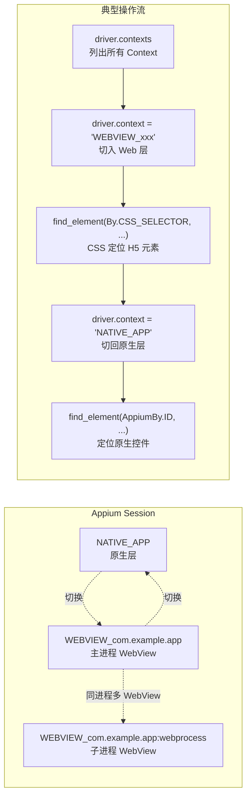
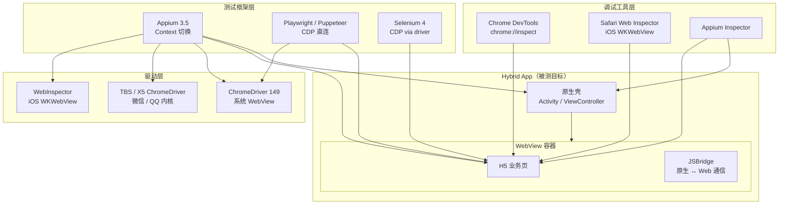

# WebView 与混合应用测试

混合应用（Hybrid App）在原生壳内嵌 WebView 渲染 H5 业务，是电商、金融、内容类 App 的主流形态。WebView 自动化测试的核心难点不在脚本本身，而在**调试通道的建立**与**原生-Web 上下文（Context）的切换**。旧文档基于 Chrome 44.0.2403 + ChromeDriver 2.20（2015 年）的方案在 2026 年早已失效，本文基于 **Chrome 149 + chromedriver 自动下载 + Appium 3.5 + CDP 直连**的现代体系重写，覆盖 Android / iOS 双端、Cordova/Capacitor/React Native/Flutter 等主流混合框架。旧文档中所有 `images/` 图片引用与课程方标识均已移除。

## 一、核心概念：WebView 与混合应用的测试挑战

### 1.1 WebView 是什么

WebView 是移动操作系统内置的浏览器内核组件：Android 上是 System WebView（基于 Chromium，2026 年版本号与 Chrome 同步，约 149.x），iOS 上是 `WKWebView`（基于 WebKit）。App 通过嵌入一个 WebView 控件即可在原生界面中渲染 HTML/CSS/JS，从而实现"一套 H5 代码，双端复用"。雪球、淘宝、美团、京东等 App 的活动页、营销页、开户页几乎都是 H5 + WebView 实现。

### 1.2 三种 App 形态对比

| 形态 | 渲染方式 | 更新方式 | 测试要点 |
|------|---------|---------|---------|
| Native App | 原生控件 | 应用商店发版 | UIAutomator2 / XCUITest |
| Web App | 浏览器渲染 | 服务端即时 | Selenium / Playwright |
| Hybrid App | 原生壳 + WebView | H5 热更新 | **Context 切换 + CDP** |

### 1.3 测试挑战

Hybrid App 测试的核心挑战集中在四个方面：

1. **双上下文切换**：原生层（NATIVE_APP）和 Web 层（WEBVIEW_xxx）属于两套不同的控件体系，定位策略、API、等待机制都不同。原生层走 `AppiumBy.ID` / `accessibility id` 等 UIAutomator2 定位策略，Web 层走 `By.CSS_SELECTOR` / `By.XPATH` 等 Selenium 定位策略，且 WebView 内部还可能开多个 window，需在 Context 切换基础上再做 window 切换。一个完整的混合应用测试用例往往需要在两个上下文之间反复来回切换多次，状态管理复杂。
2. **调试通道受控**：出于安全与性能考虑，Android 7.0+ 默认关闭 WebView 的可调试开关，必须由开发在代码中显式开启 `WebView.setWebContentsDebuggingEnabled(true)`，否则任何工具都看不到 WebView 内部。生产包通常关闭此开关，测试前必须明确使用 Debug 包或专门带调试开关的测试包，否则所有 WebView 测试用例都会因找不到 WEBVIEW Context 而失败。
3. **ChromeDriver 版本匹配**：每个 App 内嵌的 WebView 内核版本可能不同（系统 WebView、微信 TBS、腾讯 X5、阿里 UC 内核），需要对应版本的 ChromeDriver 驱动，Appium 内置的 chromedriver 自动下载机制可按 WebView 版本自动匹配。但 TBS / X5 等非标准内核仍需手动指定专用 ChromeDriver。
4. **加载时序复杂**：WebView 加载 H5 是异步过程，页面 DOM 就绪、JS Bridge 注入、首屏数据请求之间存在多个时间窗口，单纯依赖固定 sleep 会导致用例不稳定，必须配合显式等待与 `document.readyState` 判断。

## 二、WebView 调试基础

### 2.1 开启 WebView 调试开关

Android 端必须在 App 代码中显式开启调试开关：

```java
// Android（Java/Kotlin）：在 Application.onCreate 或 WebView 初始化前调用
if (Build.VERSION.SDK_INT >= Build.VERSION_CODES.KITKAT) {
    WebView.setWebContentsDebuggingEnabled(true);  // 全局开启 WebView 调试
}
```

iOS 端 `WKWebView` 默认可在 Safari Developer 菜单中调试，但 Production 包通常被禁用，Debug 构建可通过 `WebView` 的 `isInspectable` 属性开启（iOS 16.4+）：

```swift
// iOS（Swift）：iOS 16.4+ 需显式设置 isInspectable
webView.isInspectable = true
```

### 2.2 Chrome Remote Debugging

桌面 Chrome 提供 Remote Debugging 能力，可直接调试 Android App 内的 WebView。流程为：USB 连接 Android 设备 → `adb` 转发调试端口 → 桌面 Chrome 访问 `chrome://inspect` → 选择目标 WebView → 启动 DevTools 调试。

```bash
# 1. 确认设备已连接
adb devices

# 2. 查看设备上可调试的 WebView 进程（Android 7+ 需先开调试开关）
adb shell cat /proc/net/unix | grep webview_devtools
# 输出示例：@webview_devtools_remote_12345

# 3. 端口转发：将设备的本地 socket 映射到 PC 端口
adb forward tcp:9222 localabstract:webview_devtools_remote_12345

# 4. 在桌面 Chrome 访问 chrome://inspect#devices
#    或直接访问 http://localhost:9222/json 查看 WebView 中打开的页面
curl http://localhost:9222/json
```

`adb forward` 是 WebView 调试的"命脉"：设备端 Chrome 内核会在 `localabstract:webview_devtools_remote_<pid>` 上监听 CDP 协议，PC 端通过 `adb forward` 把这个抽象 socket 映射到本地 TCP 端口，任何 CDP 客户端（Chrome DevTools、Playwright、Puppeteer、Selenium 4）都可以连接这个端口驱动 WebView。

### 2.3 Chrome DevTools 调试

打开桌面 Chrome → 地址栏输入 `chrome://inspect` → 勾选 "Discover USB devices" → 设备列表会显示所有可调试的 WebView 实例 → 点击 "inspect" 打开 DevTools。DevTools 提供完整的 Elements、Console、Sources、Network、Performance 面板，与调试普通网页无异，是定位元素、抓包、性能分析的首选工具。

需要注意几个细节：第一，桌面 Chrome 与设备 WebView 内核版本差距过大时（如桌面 Chrome 149 调试 WebView 内核 70），DevTools 部分新协议不可用，建议保持桌面 Chrome 为最新稳定版；第二，`chrome://inspect` 页面若长时间未发现设备，可重启 `adb` 服务（`adb kill-server && adb start-server`）并重新插拔 USB；第三，模拟器的 WebView 默认开启调试开关，真机必须由开发显式开启，这是导致真机与模拟器表现不一致的最常见原因。

## 三、Appium WebView 测试

### 3.1 Context 模型

Appium 用 **Context（上下文）** 抽象 WebView 与原生层。一个 Session 中可能存在多个 Context：

- `NATIVE_APP`：原生层，使用 UIAutomator2 / XCUITest 定位策略；
- `WEBVIEW_<package>`：Web 层，使用 CSS / XPath / id 等 Selenium 定位策略，每多开一个 WebView 进程就多一个 WEBVIEW Context。



### 3.2 chromedriver 配置

Appium 通过 ChromeDriver 驱动 WebView（与桌面 Chrome 同源）。2026 年起推荐两种方式：

```python
# Python：Appium 3.x + chromedriver 自动下载（推荐）
from appium import webdriver
from appium.options.android import UiAutomator2Options

options = UiAutomator2Options()
options.platform_name = "Android"
options.automation_name = "UiAutomator2"
options.device_name = "Pixel 8 API 35"
options.app_package = "com.example.app"
options.app_activity = ".MainActivity"
options.set_capability("appium:noReset", True)

# 方式一：依赖 Appium 的 chromedriver 自动下载（推荐）
# 无需任何 chromedriver 配置，Appium 启动时按内置版本映射自动匹配并下载

# 方式二：显式指定 ChromeDriver 路径（适用于内嵌非标准内核如 TBS / X5）
options.set_capability(
    "appium:chromedriverExecutable",
    "/path/to/chromedriver-149"
)

# 方式三：指定 ChromeDriver 目录，Appium 自动匹配版本
options.set_capability(
    "appium:chromedriverExecutableDir",
    "/path/to/chromedrivers"
)

driver = webdriver.Remote("http://127.0.0.1:4723", options)
```

### 3.3 autoWebview 自动切换

若被测 App 启动后直接进入 WebView 页面，可启用 `autoWebview` 让 Appium 在 Session 创建时自动切到 WEBVIEW Context：

```python
options.set_capability("appium:autoWebview", True)
options.set_capability("appium:autoWebviewTimeout", 5000)  # 切换超时 5s
```

`autoWebview` 适合纯 H5 应用（如 Cordova / Capacitor 构建的全 WebView 应用），但混合应用通常需要原生与 Web 交替操作，建议关闭该项，在脚本中显式切换以保持可控。`autoWebview` 启用时如果 WebView 加载较慢，Appium 会在超时时间内反复轮询 Context 列表，超时后报 `No WEBVIEW context found`，此时应优先排查 WebView 调试开关是否开启，而非盲目加大超时时间。

### 3.4 Context 切换实战

```python
# Python：典型 Hybrid App 测试用例
from appium import webdriver
from appium.options.android import UiAutomator2Options
from appium.webdriver.common.appiumby import AppiumBy
from selenium.webdriver.common.by import By
from selenium.webdriver.support.ui import WebDriverWait
from selenium.webdriver.support import expected_conditions as EC

options = UiAutomator2Options()
options.platform_name = "Android"
options.automation_name = "UiAutomator2"
options.device_name = "Pixel 8 API 35"
options.app_package = "com.xueqiu.android"
options.app_activity = ".view.WelcomeActivityAlias"
options.set_capability("appium:noReset", True)
options.set_capability("appium:chromedriverExecutableDir", "/usr/local/share/chromedrivers")

driver = webdriver.Remote("http://127.0.0.1:4723", options)
wait = WebDriverWait(driver, 15)

# 1. 原生层：点击"交易"Tab
wait.until(EC.presence_of_element_located(
    (AppiumBy.XPATH, "//*[@text='交易']")
)).click()

# 2. 等待 WebView 出现并切入
wait.until(lambda d: len(d.contexts) > 1, "WebView 未出现")
print("可用 Context:", driver.contexts)
# 输出: ['NATIVE_APP', 'WEBVIEW_com.xueqiu.android']

# 3. 切换到最后一个 WEBVIEW Context（通常 -1 即目标 WebView）
driver.switch_to.context(driver.contexts[-1])

# 4. Web 层：使用 CSS 定位"A股开户"
wait.until(EC.presence_of_element_located(
    (By.CSS_SELECTOR, ".trade-account-open")
)).click()

# 5. 新窗口切换（WebView 中 target=_blank 会开新 window）
wait.until(lambda d: len(d.window_handles) > 1)
driver.switch_to.window(driver.window_handles[-1])

# 6. Web 层：填表单
wait.until(EC.presence_of_element_located(
    (By.CSS_SELECTOR, "input[name='phone']")
)).send_keys("13800138000")
driver.find_element(By.CSS_SELECTOR, "input[name='code']").send_keys("123456")
driver.find_element(By.CSS_SELECTOR, ".btn-submit").click()

# 7. 切回原生层继续操作
driver.switch_to.context("NATIVE_APP")
driver.find_element(AppiumBy.ID, "com.xueqiu.android:id/back_btn").click()

driver.quit()
```

```java
// Java：Context 切换核心 API
import io.appium.java_client.AppiumBy;
import io.appium.java_client.android.AndroidDriver;
import org.openqa.selenium.By;
import org.openqa.selenium.WebElement;
import org.openqa.selenium.support.ui.WebDriverWait;
import java.time.Duration;
import java.util.Set;

// 列出所有 Context
Set<String> contexts = driver.getContextHandles();
System.out.println("可用 Context: " + contexts);

// 切换到 WEBVIEW
String webviewContext = contexts.stream()
    .filter(c -> c.startsWith("WEBVIEW"))
    .findFirst()
    .orElseThrow(() -> new RuntimeException("未找到 WebView"));
driver.context(webviewContext);

// Web 层 CSS 定位
WebElement openAccountBtn = new WebDriverWait(driver, Duration.ofSeconds(10))
    .until(d -> d.findElement(By.cssSelector(".trade-account-open")));
openAccountBtn.click();

// 切回原生
driver.context("NATIVE_APP");
```

## 四、Selenium/Playwright 测试 WebView：CDP 直连

### 4.1 CDP 直连方案

除了通过 Appium 中转，还可以**直接用 CDP（Chrome DevTools Protocol）连接 WebView**，绕过 Appium 整层。这种方式适合"只测 H5 内容、不管原生壳"的场景，启动更快、调试更直接，但失去了原生层操作能力。

```python
# Python：Playwright 通过 CDP 直连 Android WebView
from playwright.sync_api import sync_playwright

# 1. 先用 adb forward 将 WebView 调试端口映射到 PC
# adb forward tcp:9222 localabstract:webview_devtools_remote_12345

with sync_playwright() as p:
    # 2. Playwright 直接通过 CDP 端口连接 WebView
    browser = p.chromium.connect_over_cdp("http://localhost:9222")

    # 3. 获取 WebView 中已打开的页面（context 对应 WebView 的 window）
    context = browser.contexts[0]
    page = context.pages[0] if context.pages else context.new_page()

    # 4. 之后操作与普通 Playwright 完全一致
    page.click(".trade-account-open")
    page.fill("input[name='phone']", "13800138000")
    page.fill("input[name='code']", "123456")
    page.click(".btn-submit")

    # 5. 断言
    assert page.locator(".success-tip").is_visible()

    browser.close()
```

### 4.2 Appium 与 CDP 直连对比

| 维度 | Appium WebView | CDP 直连（Playwright/Puppeteer） |
|------|---------------|--------------------------------|
| 原生层操作 | 支持 | 不支持 |
| Web 层定位 | CSS/XPath/id | CSS/XPath/id（同源） |
| 启动开销 | 高（需 Appium Server + Driver） | 低（直连） |
| iOS 支持 | 支持 | 不支持（WKWebView 走 WebKit 自有协议，需 Safari Web Inspector 调试） |
| 多 WebView 切换 | Context API | CDP target API |
| 录制工具 | Appium Inspector | Chrome DevTools Recorder |
| 网络抓包 | 依赖 chromedriver 透传 | 原生 CDP Network 域 |
| 适用场景 | 混合应用全链路 | 纯 H5 内容回归 |

实践中常将两者结合使用：Appium 负责"启动 App + 进入 WebView 页面"的原生层操作，CDP 直连负责"H5 业务流程"的快速回归。具体做法是先用 `adb forward` 把 WebView 调试端口映射到 PC，然后让 Playwright 通过该端口直连 WebView，Appium 仅负责原生层操作，两者并行不冲突。这种分工让 H5 回归用例的执行速度从 Appium 模式下的每用例 30 秒级降到 Playwright CDP 模式下的 5 秒级。

## 五、混合框架测试

### 5.1 混合应用测试架构



### 5.2 Cordova / Capacitor / Ionic

Cordova 与 Capacitor（Ionic 团队推出的 Cordova 继任者）都是"用 Web 技术写 App"的混合框架，整个 App 几乎就是一个全屏 WebView。测试这类 App 等价于测 Web + 少量原生桥接：

```javascript
// JavaScript：Capacitor App 的 WebView 测试（通过 Appium + WebdriverIO）
const opts = {
  platformName: 'Android',
  'appium:automationName': 'UiAutomator2',
  'appium:app': './android/app/release/app-release.apk',
  'appium:autoWebview': true,  // Capacitor App 启动即 WebView，可启用 autoWebview
  'appium:autoWebviewTimeout': 8000,
};

const driver = await remote({ hostname: '127.0.0.1', port: 4723, capabilities: opts });

// autoWebview 启用后 driver 已在 WEBVIEW Context
// 直接用 Web 定位策略即可
const loginBtn = await driver.$('#login-button');
await loginBtn.click();

// 测试 Capacitor 原生插件（如 Camera）需切回原生层
await driver.switchContext('NATIVE_APP');
await driver.$('~camera-permission-allow').click();
await driver.switchContext(driver.contexts[1]);
```

### 5.3 React Native WebView

React Native（RN）的 `react-native-webview` 组件在 Android 上使用系统 WebView，在 iOS 上使用 `WKWebView`。RN 自身控件由 Yoga 布局引擎渲染为原生控件，但 `WebView` 组件内部仍是真正的 H5 内容，需要 Context 切换：

```python
# Python：React Native App 的 WebView 测试
# RN 控件走原生定位（accessibility id），WebView 内部走 Context 切换

# 1. NATIVE_APP：点击 RN 渲染的"打开 WebView"按钮
driver.find_element(AppiumBy.ACCESSIBILITY_ID, "open_webview_button").click()

# 2. 等待 WebView Context 出现并切入
WebDriverWait(driver, 10).until(
    lambda d: any(c.startswith("WEBVIEW") for c in d.contexts)
)
webview_ctx = next(c for c in driver.contexts if c.startswith("WEBVIEW"))
driver.switch_to.context(webview_ctx)

# 3. 在 RN WebView 内部用 CSS 定位
driver.find_element(By.CSS_SELECTOR, "#h5-submit").click()
```

### 5.4 Flutter WebView

Flutter 自身使用 Skia 渲染引擎绘制 UI，**Flutter 控件默认无法被 Appium 直接定位**，需要集成 `appium-flutter-finder`，或开启 Flutter 的 Semantics 标注。但 `webview_flutter` 插件内的 H5 内容仍走原生 WebView 渲染，遵循标准 Context 切换流程：

```dart
// Dart：Flutter App 需开启 Semantics 才能被 Appium 定位 Flutter 控件
// 在 main() 中调用，运行时开启语义树
import 'package:flutter/widgets.dart';

void main() {
  WidgetsFlutterBinding.ensureInitialized();
  SemanticsBinding.instance.ensureSemantics();
  runApp(const MyApp());
}
```

```python
# Python：Flutter WebView 测试（Flutter 控件用 Flutter Finder，H5 用 Context 切换）
from appium_flutter_finder import FlutterElement, FlutterFinder

finder = FlutterFinder()

# 1. Flutter 层：用 Flutter Finder 点击"打开 WebView"按钮
# Flutter 控件不走 NATIVE_APP，走专属的 flutter 上下文
flutter_btn = FlutterElement(driver, finder.by_value_key("open_webview_key"))
flutter_btn.click()

# 2. H5 层：标准 Context 切换
WebDriverWait(driver, 10).until(
    lambda d: any(c.startswith("WEBVIEW") for c in d.contexts)
)
driver.switch_to.context(next(c for c in driver.contexts if c.startswith("WEBVIEW")))

# 3. 在 Flutter WebView 内操作 H5
driver.find_element(By.CSS_SELECTOR, ".h5-content").click()
```

### 5.5 微信小程序 / TBS 内核

微信、QQ、京东等 App 使用腾讯 TBS（X5）内核，与系统 WebView 不同：

- 内核版本独立，需从 [TBS 官网](https://x5.tencent.com/) 下载对应版本的 TBS ChromeDriver；
- 调试入口为 `inspectTbs`，需通过 TBS Studio 而非 `chrome://inspect`；
- Appium 配置 `appium:chromedriverExecutable` 指向 TBS 专用 ChromeDriver，并设置 `appium:chromedriverChromeMappingFile` 强制匹配版本。

## 六、调试技巧

### 6.1 Chrome DevTools 元素检查

通过 `chrome://inspect` 进入 DevTools 后：

- **Elements 面板**：与桌面网页一致，可右键元素复制 CSS Selector / XPath，直接用于 Appium 脚本；
- **Console 面板**：执行 `document.querySelector(...)` 验证定位表达式；
- **Network 面板**：抓取 H5 页面的 XHR/Fetch 请求，用于接口断言与 Mock 设计；
- **Application 面板**：查看 LocalStorage / SessionStorage / Cookie，验证登录态传递。

### 6.2 Appium Inspector

Appium Inspector 在 Session 中提供 Context 切换下拉框，可在 NATIVE_APP 与 WEBVIEW 间切换并实时查看 DOM 树。WEBVIEW Context 下显示的是 H5 DOM，NATIVE_APP 下显示的是原生控件树。

### 6.3 网络抓包

WebView 抓包有三种方式：

1. **DevTools Network 面板**：最简单，但仅限 Chrome DevTools 连接的 WebView，无法在脚本中程序化获取；
2. **Charles / mitmproxy + 系统代理**：在 WiFi 设置中配置 HTTP 代理指向 PC，HTTPS 需安装 CA 证书，Android 7+ 需将证书装入系统证书目录（需 root 或使用 Magisk 模块），此方式可同时抓取原生层与 WebView 的所有 HTTPS 流量；
3. **CDP Network 域**：通过 CDP 协议订阅 `Network.requestWillBeSent` 与 `Network.responseReceived` 事件，可在脚本中程序化抓包，仅限 WebView 内的请求。

```python
# 注意：Appium Driver 不提供 execute_cdp_cmd（那是 Selenium Chromium 驱动专属 API），
# WEBVIEW Context 下 Appium 只透传标准 WebDriver 命令，无法在 Appium 会话内订阅 CDP 事件。
# 需要程序化抓包时，请使用下方 Playwright + CDP 直连方案
```

```python
# Python：Playwright + CDP 完整网络抓包
from playwright.sync_api import sync_playwright

captured_requests = []

with sync_playwright() as p:
    browser = p.chromium.connect_over_cdp("http://localhost:9222")
    page = browser.contexts[0].pages[0]

    # 订阅请求与响应事件
    page.on("request", lambda req: captured_requests.append({
        "url": req.url,
        "method": req.method,
        "headers": req.headers,
    }))
    page.on("response", lambda res: print(f"{res.status} {res.url}"))

    page.click(".btn-submit")
    # captured_requests 中已包含点击触发的所有 XHR/Fetch 请求
    browser.close()
```

### 6.4 性能分析

WebView 性能问题常见于首屏加载慢、JS 执行卡顿、内存泄漏。Chrome DevTools Performance 面板可录制 WebView 的完整性能轨迹，包括 JS 执行时间、布局重排、网络瀑布图。Lighthouse 也可对 WebView 跑分，输出 Performance / Accessibility / SEO / Best Practices 四项指标。在 CI 中可固定一个 WebView 性能基线，每次回归对比 Lighthouse 分数，发现性能回退及时告警。

## 七、常见陷阱与最佳实践

### 7.1 常见陷阱

1. **WebView 调试开关未开**：Android 7.0+ 默认关闭，必须由开发在代码中开启，否则 Appium 永远只看到 `NATIVE_APP` 一个 Context。验证方法：`adb shell cat /proc/net/unix | grep webview_devtools`，无输出即未开启。
2. **ChromeDriver 版本不匹配**：系统 WebView 升级到 149 后仍用 2.20 的 ChromeDriver，启动直接报 `session not created: Chrome version must be between 70 and 149`。2026 年推荐让 Appium 自动下载匹配版本，或显式指定 `chromedriverExecutableDir`。
3. **`switch_to.context()` 时机过早**：WebView 加载是异步的，`contexts` 列表中出现 WEBVIEW 不代表内部 DOM 已就绪，切入后必须配合显式等待。
4. **多 WebView 进程混淆**：Android 8+ WebView 可能运行在独立子进程，`WEBVIEW_com.example.app` 与 `WEBVIEW_com.example.app:webprocess` 是不同 Context，需根据页面实际所在进程切换。
5. **iOS WKWebView 调试限制**：iOS 16.4+ 必须显式设置 `webView.isInspectable = true`，且 Production 包默认不可调试，需用 Debug 或 Ad-hoc 包测试。
6. **微信 TBS / X5 内核**：使用系统 ChromeDriver 无法驱动，必须用 TBS 专用 ChromeDriver，并通过 `chrome://inspect` 的 TBS 入口而非 `chrome://inspect#devices`。

### 7.2 最佳实践

1. **统一 Context 切换封装**：在 PO 层封装 `enter_webview(timeout)` 与 `back_to_native()`，内部处理"等待 WEBVIEW 出现 + 切入 + 等待 DOM 就绪"三步，避免散落在用例中的 `switch_to.context` 调用。封装函数应同时记录当前 Context 与切换前 Context，方便异常时回滚。
2. **优先使用 CSS Selector**：WEBVIEW Context 下 CSS 比 XPath 快 3-10 倍，且更稳定，与 Web 测试代码可复用。XPath 在 WebView 中跨 iframe 查询时尤其慢，且容易因 H5 改版而失效。
3. **Capability 显式指定 WebView 版本**：测试 TBS / X5 等非标准内核时，必须通过 `appium:chromedriverExecutable` 显式指定，禁用 Appium 的 chromedriver 自动下载，避免版本错配。系统 WebView 测试则可放心交给 Appium 的 chromedriver 自动下载机制。
4. **CDP 直连用于纯 H5 回归**：将"混合应用全链路"用 Appium 测试，将"H5 业务页"单独抽出用 Playwright + CDP 直连回归，两套用例分工明确、各取所长。CDP 直连用例可复用 Web 测试的 Page Object，大幅降低维护成本。
5. **CI 中固定 WebView 版本**：CI 设备/模拟器的 System WebView 版本必须固定，否则 ChromeDriver 自动匹配可能在不同构建间行为不一致，建议在 Docker 镜像或模拟器快照中锁定版本。可在 CI 启动时打印 `adb shell dumpsys webviewupdate` 确认版本。
6. **页面加载等待用 `readystate`**：WebView 切换后等待 `document.readyState === 'complete'`，比固定 sleep 更可靠。复杂场景可结合 `window.onload` 事件与业务接口的 mock 完成，避免依赖真实网络。
7. **JSBridge 调用单独封装**：Hybrid App 中原生与 Web 通过 JSBridge 通信，测试 JSBridge 调用时应封装统一的 `invoke_bridge(method, params)` 方法，通过 `driver.execute_script()` 在 WebView 中执行 JS 调用桥接，避免直接在用例中拼接 JS 字符串。
8. **生产包与测试包分离**：测试包保留 WebView 调试开关与详细日志，生产包关闭。CI 流水线应明确使用测试包跑自动化用例，避免因生产包关闭调试开关导致用例失败。

## 八、版本演进与参考资料

| 时间 | 里程碑 |
|------|--------|
| 2015 | Chrome 44 + ChromeDriver 2.20（旧文档方案，已淘汰） |
| 2018 | Chrome 70+ 强制 ChromeDriver 版本号同步 |
| 2022 | Appium 2.0 Driver 插件化，ChromeDriver 独立安装 |
| 2022 | Selenium 4.6 引入 Selenium Manager，自动管理 ChromeDriver |
| 2024 | Appium 3.0 全面拥抱 W3C，废弃 `DesiredCapabilities` |
| 2025 | Flutter WebView 测试工具链成熟，CDP 直连成为主流 |
| 2026 | Chrome 149 + chromedriver 自动下载 + Appium 3.5 + CDP 直连 |

**官方资料**：

- Appium WebView 指南：https://appium.io/docs/en/writing-running-appium/web/
- Chrome Remote Debugging：https://developer.chrome.com/docs/devtools/remote-debugging/
- Chrome DevTools Protocol：https://chromedevtools.github.io/devtools-protocol/
- Selenium Manager：https://www.selenium.dev/documentation/selenium_manager/
- Playwright CDP：https://playwright.dev/docs/api/class-browsertype#browser-type-connect-over-cdp
