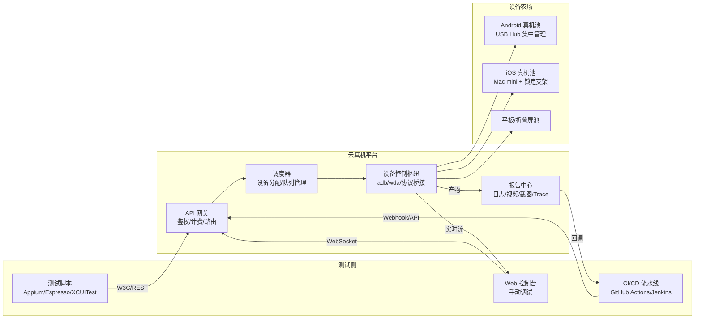
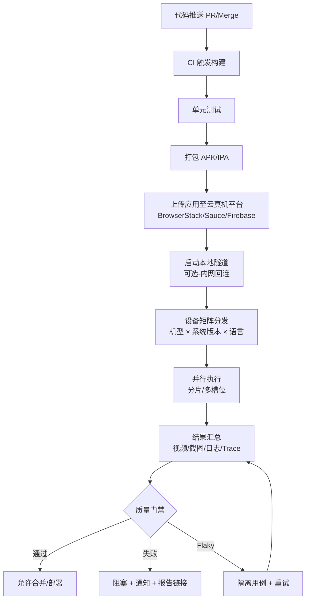

# 移动测试云真机平台（BrowserStack 与 Sauce Labs）

移动端测试的核心矛盾是**设备碎片化**：Android 厂商定制 ROM 数以千计、iOS 机型每年迭代、屏幕尺寸从 4.7 寸覆盖到 12.9 寸折叠屏，本地维护一套覆盖主流机型的真机柜成本高、利用率低、合规风险大。云真机平台通过将真机集中池化、按需租用、远程操控，把"测试设备"从固定资产转化为按调用计费的云服务。本文系统梳理 2026 年主流云真机平台的能力差异、BrowserStack 与 Sauce Labs 的实战配置、Firebase Test Lab 的 Google 生态集成、CI/CD 流水线接入方式，并归纳选型决策框架与常见陷阱。

## 一、核心概念

### 1.1 为什么需要云真机平台

移动测试的三种执行环境各有边界：

- **本地模拟器/仿真器**：启动快、免费、可并行，但无法复现厂商 ROM 差异、硬件传感器（陀螺仪/NFC/蓝牙）、真实 GPU 渲染、低性能机型的卡顿行为，对兼容性测试价值有限；
- **本地真机柜**：覆盖真实设备行为，但采购成本高（一台 iPhone Pro 接近万元）、需配备 STF/Device Farmer 等管理系统、跨地域团队无法共享、设备折旧与系统升级维护负担重；
- **云真机平台**：把分散的真机集中到数据中心，通过浏览器或 API 远程租用，按分钟或按次计费，覆盖全球机型，天然支持并行与 CI 集成。

云真机平台解决的不仅是"买不起设备"，更是**设备利用率与覆盖率的经济学问题**：一台真机本地闲置率往往超过 80%，而云平台通过多租户复用可将单机日均利用率提升到 60% 以上，分摊后的单次测试成本远低于自建。

### 1.2 云真机 vs 本地模拟器/真机

| 维度 | 本地模拟器 | 本地真机柜 | 云真机平台 |
|------|-----------|-----------|-----------|
| 设备真实性 | ROM/GPU/传感器失真 | 真实 | 真实 |
| 机型覆盖 | 仅 Android AVD / iOS Simulator | 受采购预算限制 | 数千台全球机型 |
| 并行能力 | 受本机 CPU 限制 | 受机柜规模限制 | 弹性扩容至百级并发 |
| 维护成本 | 低 | 高（系统升级/电池更换） | 平台承担 |
| CI 集成 | 原生支持 | 需自建桥接 | 原生 API + SDK |
| 网络延迟 | 本地无延迟 | 本地无延迟 | 跨地域 50-300ms |
| 单次成本 | 免费 | 折旧摊销 | 按分钟计费（$0.05-0.5/min）|
| 适用场景 | 冒烟测试/单元测试 | 日常调试/深度复现 | 兼容性/回归/发布前全量 |

**结论**：三者并非替代关系，而是分层互补——日常开发用模拟器，深度调试用本地真机，兼容性与发布前回归用云真机。

## 二、主流平台对比（2026）

### 2.1 平台矩阵

| 平台 | 设备规模 | 平台覆盖 | 自动化框架 | CI 集成 | 定价模型 | 适用场景 |
|------|---------|---------|-----------|--------|---------|---------|
| **BrowserStack** | 4000+ 真机 | iOS/Android/Win/macOS/Web | Appium/Espresso/XCUITest/Detox | 原生插件全覆盖 | 按席位/并行槽位 | 出海产品、跨国团队 |
| **Sauce Labs** | 2500+ 真机 | iOS/Android/Web | Appium/Espresso/XCUITest/Robotium | Sauce Connect/Ops | 按分钟/并行槽位 | 美国市场、合规要求高 |
| **LambdaTest** | 3000+ 真机 | iOS/Android/Web | Appium/Espresso/XCUITest | HyperExecute | 按分钟 | 中小团队、性价比 |
| **Firebase Test Lab** | Android 优先 | Android/iOS 有限 | Espresso/UI Automator/Robo | gcloud/Gradle 插件 | 免费额度+按次 | Google 生态、Android 优先 |
| **AWS Device Farm** | 350+ 真机 | iOS/Android | Appium/Espresso/XCUITest/Calabash | CodePipeline | 按设备分钟 | AWS 生态、按需付费 |
| **阿里云 MQC** | 1000+ 真机 | Android/iOS | Appium/Espresso/脚本录制 | 云效/FunctionCompute | 按次/包年 | 国内项目、阿里生态 |
| **腾讯 WeTest** | 1500+ 真机 | Android/iOS/Web | Appium/脚本录制/PerfDog | 代码仓库/CI | 按次/包年 | 国内项目、性能专项 |
| **百度 MTC** | 800+ 真机 | Android/iOS | Appium/脚本录制 | 百度云函数 | 按次 | 国内项目、百度生态 |

### 2.2 平台架构共性



所有平台的核心架构都是 **API 网关 → 调度器 → 设备控制枢纽 → 真机池** 四层结构，差异在于设备规模、调度策略（独占 vs 共享）、协议桥接实现（adb 直连 vs WebDriverAgent 中转）以及报告深度（视频/Trace/网络抓包是否齐全）。

## 三、BrowserStack 实战

### 3.1 App Automate 与 App Live

BrowserStack 提供两条主线产品：**App Live** 用于手动远程调试（上传 IPA/APK 后在 Web 端操控真机），**App Automate** 用于自动化测试执行（基于 Appium/Espresso/XCUITest，提供并行槽位与 CI 集成）。2026 年 App Automate 已支持 4000+ 真机、最高 50 并行槽位，并新增 Biometric/Network Simulation/Geolocation 等能力插件。

### 3.2 Appium Capabilities 配置

```python
# BrowserStack App Automate - Appium Python Client 配置示例
from appium import webdriver
from appium.options.common.base import AppiumOptions

capabilities = {
    # ---- BrowserStack 平台配置 ----
    "bstack:options": {
        "userName": "your_username",            # BrowserStack 账户名
        "accessKey": "your_access_key",         # 访问密钥（建议从环境变量读取）
        "projectName": "订单回归测试",          # 项目名（用于报告聚合）
        "buildName": "build-2026-08-12-001",    # 构建名（与 CI build 号对齐）
        "sessionName": "下单-支付宝-正常流程",  # 单次用例名
        "deviceLogs": True,                     # 收集设备日志（logcat/syslog）
        "networkLogs": True,                    # 抓取网络请求（HAR 格式）
        "video": True,                          # 录制执行视频
        "screenshot": True,                     # 自动截图
        "geoLocation": "CN",                    # 模拟地理位置（中国）
        "networkProfile": "4g-lte-good",        # 模拟 4G 网络环境
        "app": "bs://<hashed_app_id>",          # 已上传应用的 hash id
    },
    # ---- Appium 通用配置（Appium 3.x 强制校验 appium: 前缀）----
    "platformName": "Android",                  # 平台名（W3C 标准能力，无需前缀）
    "appium:platformVersion": "14.0",           # 系统版本
    "appium:deviceName": "Google Pixel 8 Pro",  # 指定机型
    "appium:automationName": "UiAutomator2",    # 自动化引擎
    "appium:appPackage": "com.example.shop",    # 被测包名
    "appium:appActivity": ".MainActivity",      # 启动 Activity
    "appium:noReset": True,                     # 保留应用数据（兼容性场景设为 False）
    "appium:newCommandTimeout": 300,            # 单条命令超时（秒）
}

# 平台地址指向 BrowserStack 云端（Appium Python Client 4.x 起已移除 desired_capabilities 参数）
driver = webdriver.Remote(
    command_executor="https://hub-cloud.browserstack.com/wd/hub",
    options=AppiumOptions().load_capabilities(capabilities),
)

# 执行业务操作
driver.find_element("id", "com.example.shop:id/checkout").click()
driver.quit()
```

`bstack:options` 是 BrowserStack 在 W3C 标准能力之上的扩展命名空间，所有平台特性（视频/网络日志/地理位置/网络模拟）都通过该前缀传入，避免与 Appium 标准能力冲突。应用需先通过 REST API 上传到 BrowserStack，返回 `bs://` hash id 后再在 `app` 字段引用，避免每次构建重复上传。

### 3.3 CI/CD 集成

```yaml
# .github/workflows/mobile-regression.yml - GitHub Actions 集成示例
name: 移动端回归测试

on:
  pull_request:
    branches: [ main, release/* ]
  workflow_dispatch:        # 支持手动触发

jobs:
  browserstack-test:
    runs-on: ubuntu-latest
    timeout-minutes: 30
    steps:
      - uses: actions/checkout@v4

      - name: 安装 Python 与依赖
        uses: actions/setup-python@v5
        with:
          python-version: '3.12'
      - run: |
          pip install Appium-Python-Client==4.0.1 pytest==8.3.2 pytest-xdist
          pip install browserstack-local==1.4.8   # 本地测试隧道

      - name: 上传应用到 BrowserStack
        id: upload
        run: |
          # 通过 REST API 上传 APK，返回 app_url
          APP_URL=$(curl -s -u "$BROWSERSTACK_USER:$BROWSERSTACK_KEY" \
            -X POST "https://api-cloud.browserstack.com/app-automate/upload" \
            -F "file=@app/build/outputs/apk/release/app-release.apk" \
            | jq -r '.app_url')
          echo "app_url=$APP_URL" >> $GITHUB_OUTPUT
        env:
          BROWSERSTACK_USER: ${{ secrets.BROWSERSTACK_USER }}
          BROWSERSTACK_KEY: ${{ secrets.BROWSERSTACK_KEY }}

      - name: 启动 BrowserStack Local 隧道（访问内网接口）
        run: |
          # 当被测应用需要回连公司内网 API 时，启动本地隧道
          BrowserStackLocal --key $BROWSERSTACK_KEY \
            --local-identifier ${{ github.run_id }} \
            --daemon start
        env:
          BROWSERSTACK_KEY: ${{ secrets.BROWSERSTACK_KEY }}

      - name: 执行并行测试
        run: |
          pytest tests/mobile/ -n 5 \
            --browserstack-app ${{ steps.upload.outputs.app_url }} \
            --local-identifier ${{ github.run_id }}
        env:
          BROWSERSTACK_USER: ${{ secrets.BROWSERSTACK_USER }}
          BROWSERSTACK_KEY: ${{ secrets.BROWSERSTACK_KEY }}

      - name: 上传测试报告
        if: always()
        uses: actions/upload-artifact@v4
        with:
          name: browserstack-report
          path: reports/
```

`browserstack-local` 隧道是解决"被测应用需访问公司内网 API"的关键组件——云真机无法直连企业内网，需在 CI Runner 上启动隧道客户端，由 BrowserStack 云端通过该隧道转发请求。`local-identifier` 用于多并行任务隔离隧道，避免串流。

## 四、Sauce Labs 实战

### 4.1 Real Device Cloud 与 Virtual USB

Sauce Labs 的真机云（Real Device Cloud，RDC）独立于其模拟器云（Virtual Cloud），提供 2500+ 真机。**Virtual USB** 是其特色能力：把云端的真机通过 USB-over-IP 协议映射到本地机器，开发者用本地 IDE/adb/xcodebuild 直接调试云端设备，体验与本地真机几乎一致，适合深度复现问题。

### 4.2 TestRunner 与配置

```python
# Sauce Labs Real Device Cloud - Appium 配置示例
from appium import webdriver
from appium.options.common.base import AppiumOptions

capabilities = {
    # ---- Sauce Labs 平台配置（sauce:options 命名空间）----
    "sauce:options": {
        "username": "your_username",
        "accessKey": "your_access_key",
        "build": "release/2.8.0",                # 构建标识
        "name": "支付回退-银联通道",              # 用例名
        "tags": ["regression", "payment"],       # 标签（用于报告过滤）
        "custom-data": {"release": "2.8.0"},     # 自定义元数据
        "tunnelIdentifier": "ci-tunnel-001",     # Sauce Connect 隧道标识
        "recordVideo": True,                     # 录制视频
        "recordScreenshots": True,               # 自动截图
        "recordLogs": True,                      # 收集日志
        "networkCapture": True,                  # 抓包（HAR）
        "proxyHost": "proxy.corp.com",           # 走公司代理
    },
    # ---- 设备配置 ----
    "platformName": "iOS",
    "appium:platformVersion": "17.5",
    "appium:deviceName": "iPhone 15 Pro Max",
    "appium:automationName": "XCUITest",
    "appium:app": "storage:filename=Shop-iOS-2.8.0.ipa",  # 已上传应用名
    "appium:noReset": True,
    "appium:xcodeOrgId": "TEAM_ID",              # iOS 签名团队
    "appium:xcodeSigningId": "iPhone Developer",
    "appium:updatedWDABundleId": "com.shop.wda", # 自定义 WDA 包名
}

driver = webdriver.Remote(
    command_executor="https://ondemand.us-west-1.saucelabs.com/wd/hub",
    options=AppiumOptions().load_capabilities(capabilities),
)
```

`storage:filename=` 引用的是已通过 Sauce Labs UI 或 REST API 上传到 Application Storage 的应用，避免每次构建重复上传。`ondemand.us-west-1` 是美西数据中心，国内团队访问延迟约 200-300ms，需评估是否接受。Sauce Labs 在 2026 年还提供 `eu-central-1`（法兰克福）区域，欧洲用户优先选择。

### 4.3 Sauce Connect 隧道

Sauce Connect 是 Sauce Labs 的本地隧道组件，原理与 BrowserStack Local 类似，但支持更细粒度的代理规则（域名/DNS/Headers 重写）。在 CI 中启动：

```bash
# 启动 Sauce Connect 隧道（后台运行，--pid 保存进程 ID）
sc -u $SAUCE_USERNAME -k $SAUCE_ACCESS_KEY \
  -i ci-tunnel-001 \                # 隧道标识（与 capabilities 中的 tunnelIdentifier 对应）
  --region us-west \                # 区域
  --pidfile /tmp/sc.pid \
  --daemon start
```

## 五、Firebase Test Lab 实战

### 5.1 Android 优先策略

Firebase Test Lab 是 Google 官方提供的移动测试基础设施，**Android 设备覆盖最全**（包括 Pixel 系列与 Samsung Galaxy 全系），iOS 支持有限（仅部分 iPhone 机型，且不支持 Robo 测试）。其核心优势是与 Google 生态深度集成：Android Studio 一键提交、Gradle 插件原生支持、Crashlytics 报告互通、免费额度（Spark 计划每天 5 次物理设备测试 / 10 次虚拟设备测试，按测试次数而非设备分钟计）适合中小团队。

### 5.2 Robo 测试与 Instrumentation 测试

**Robo 测试**是 Firebase Test Lab 的特色：无需编写测试代码，Google 的智能爬虫自动分析应用界面并遍历 UI 元素，适合快速发现崩溃与 ANR。**Instrumentation 测试**则是运行 Espresso/UI Automator 编写的真实测试用例。

```bash
# Firebase Test Lab - 通过 gcloud 命令执行测试

# 1. 上传应用到 Firebase（自动生成 result id）
gcloud firebase test android run \
  --type robo \                              # 测试类型：robo（智能爬虫）
  --app app/build/outputs/apk/release/app-release.apk \
  --device model=Pixel8,version=34,locale=zh_CN,orientation=portrait \  # 设备矩阵
  --device model=galaxy-s24-ultra,version=34,locale=zh_CN,orientation=portrait \
  --timeout 300s \                           # 单设备超时
  --results-bucket=gs://my-test-results \    # GCS 存储桶（保存截图/视频/日志）
  --results-dir=build-2026-08-12             # 结果目录

# 2. 运行 Instrumentation 测试（Espresso）
gcloud firebase test android run \
  --type instrumentation \
  --app app/build/outputs/apk/release/app-release.apk \
  --test app/build/outputs/apk/androidTest/release/app-release-androidTest.apk \
  --device model=Pixel8,version=34 \
  --device model=galaxy-s24-ultra,version=34 \
  --num-uniform-shards 4 \                   # 分片并行（4 个设备各跑 1/4 用例）
  --test-targets "class com.shop.CheckoutTest" \  # 指定测试类
  --use-orchestrator                          # 使用 Android Test Orchestrator（用例隔离）

# 3. 在 CI 中获取结果（gcloud 返回 result id 后查询）
gcloud firebase test android describe <RESULT_ID> \
  --format="value(testState)"                 # 输出测试状态
```

`--num-uniform-shards` 是 Firebase Test Lab 的并行能力：将测试套件按用例数均匀切分到 N 个设备并行执行，4 分片可将 30 分钟的套件压缩到 8 分钟。`--use-orchestrator` 让每个用例在独立 Instrumentation 进程中运行，避免用例间状态污染。

### 5.3 GitHub Actions 集成

```yaml
- name: 设置 Google Cloud 凭据
  uses: google-github-actions/auth@v2
  with:
    credentials_json: ${{ secrets.GCP_SERVICE_ACCOUNT }}

- name: 配置 gcloud
  uses: google-github-actions/setup-gcloud@v2

- name: 运行 Firebase Test Lab
  run: |
    gcloud firebase test android run \
      --type robo \
      --app app/build/outputs/apk/release/app-release.apk \
      --device model=Pixel8,version=34 \
      --timeout 300s
```

## 六、CI/CD 集成流程



CI/CD 集成的关键设计有四点：**应用上传与版本绑定**（每次构建上传新包并记录 hash）、**设备矩阵声明式定义**（在代码仓库中维护机型清单，随业务变化）、**质量门禁自动化**（失败即阻塞合并，Flaky 用例隔离重试而非直接失败）、**报告链接回写**（云平台报告 URL 写入 PR 评论，开发者一键直达）。

## 七、选型决策

### 7.1 决策维度

| 维度 | 关键问题 | 评估方法 |
|------|---------|---------|
| **设备覆盖** | 是否覆盖目标市场的 Top 50 机型？ | 列出目标用户机型分布，对照平台设备清单 |
| **价格模型** | 按席位/分钟/并行槽位？是否适合用例规模？ | 测算月度执行分钟数与峰值并发 |
| **CI 集成** | 是否提供官方插件/CLI？是否支持当前 CI 工具？ | 在沙箱中跑通一次流水线 |
| **并行能力** | 最大并行槽位？是否支持分片？ | 评估回归套件目标时长 |
| **地域延迟** | 数据中心是否覆盖团队所在区域？ | 实测 API 延迟与视频流卡顿 |
| **报告深度** | 是否提供视频/Trace/网络抓包/性能指标？ | 对照专项测试需求 |
| **合规** | 是否支持数据驻留/SOC 2/ISO 27001？ | 法务审核 |
| **生态绑定** | 是否深度集成现有工具链？ | 评估迁移成本 |

### 7.2 选型建议

- **出海产品（北美/欧洲为主）**：BrowserStack 主选，设备覆盖与 CI 集成最完整；Sauce Labs 作为合规备份；
- **国内市场为主**：阿里 MQC / 腾讯 WeTest 主选（机型覆盖最全、延迟低），BrowserStack 作为海外发布前验证；
- **Google 生态/Android 优先**：Firebase Test Lab 主选（免费额度 + Gradle 原生集成），AWS Device Farm 作为补充；
- **AWS 重度用户**：AWS Device Farm 与 CodePipeline 无缝集成，按需付费模型适合不规律发布；
- **跨平台框架（Flutter/RN）**：优先 BrowserStack 与 Sauce Labs（Detox/Flutter Driver 支持更成熟）；
- **预算敏感的小团队**：Firebase Test Lab 免费额度 + LambdaTest 按分钟计费组合。

## 八、常见陷阱与最佳实践

### 8.1 常见陷阱

1. **设备型号写死**：将 `deviceName` 硬编码到用例中，平台设备下架后用例直接失败。**应通过 API 查询可用设备列表，动态选取匹配机型**；
2. **应用未上传就启动测试**：每次 CI 都重新上传应用，浪费 30-60 秒。**应缓存 app hash，仅版本号变化时重新上传**；
3. **并行度超限**：购买的并行槽位是 5，却在 CI 中配置了 10 并发，导致 5 个任务排队超时。**CI 并发数需与平台槽位对齐**；
4. **未启动本地隧道**：被测应用回连公司内网 API 直接超时。**任何依赖内网接口的用例必须先启动 Local/Connect 隧道**；
5. **Flaky 用例阻塞流水线**：云真机网络抖动比本地更频繁，单次失败即阻塞会导致流水线瘫痪。**应配置 retry 机制（建议 2 次重试），并对 Flaky 用例隔离到独立 job**；
6. **忽略视频报告**：失败用例仅看断言日志，不查看视频回放。**云平台视频是定位问题的核心证据，应在 PR 评论中固定嵌入视频链接**；
7. **跨地域延迟误判**：国内团队直接连美西节点，单条 Appium 命令 300ms 延迟，跑 500 条用例多花 2.5 分钟。**国内团队优先选国内平台或地域就近节点**。

### 8.2 最佳实践

1. **设备矩阵声明式管理**：在代码仓库维护 `device-matrix.yaml`，按"机型 × 系统版本 × 语言"组合，随业务发布节奏调整覆盖范围；
2. **分层执行策略**：PR 触发冒烟测试（5 机型 × 5 分钟）、 nightly 触发回归测试（20 机型 × 30 分钟）、发布前触发全量测试（50+ 机型 × 60 分钟）；
3. **应用上传缓存**：用应用 hash 作为缓存键，未变化时复用，CI 平均可节省 40 秒；
4. **报告链接回写**：通过 CI 插件将云平台报告 URL 写回 PR 评论，让代码审查者一键查看；
5. **Flaky 治理闭环**：连续 3 次出现 Flaky 的用例自动移入 `quarantine` 目录，由测试工程师人工分析后修复或永久隔离；
6. **成本监控**：按项目/团队维度统计月度执行分钟数，设置预算告警阈值，避免失控；
7. **混合策略**：核心机型本地真机柜（利用率高、响应快），长尾机型用云真机（覆盖广、无需维护），综合成本最优。

## 九、总结

云真机平台是移动测试基础设施的"水电煤"——它不解决测试设计问题，但决定了测试覆盖的天花板与执行效率的下限。选型时不应迷信"最贵最好"，而应基于目标市场机型分布、CI 工具链、预算模型做组合决策。BrowserStack 与 Sauce Labs 适合出海与跨国团队，Firebase Test Lab 是 Google 生态与预算敏感团队的默认选择，国内平台（MQC/WeTest/MTC）在机型覆盖与延迟上对国内项目有压倒性优势。**真正的最佳实践不是选最全的平台，而是用分层执行策略把每个平台的优势用在最合适的场景**。
