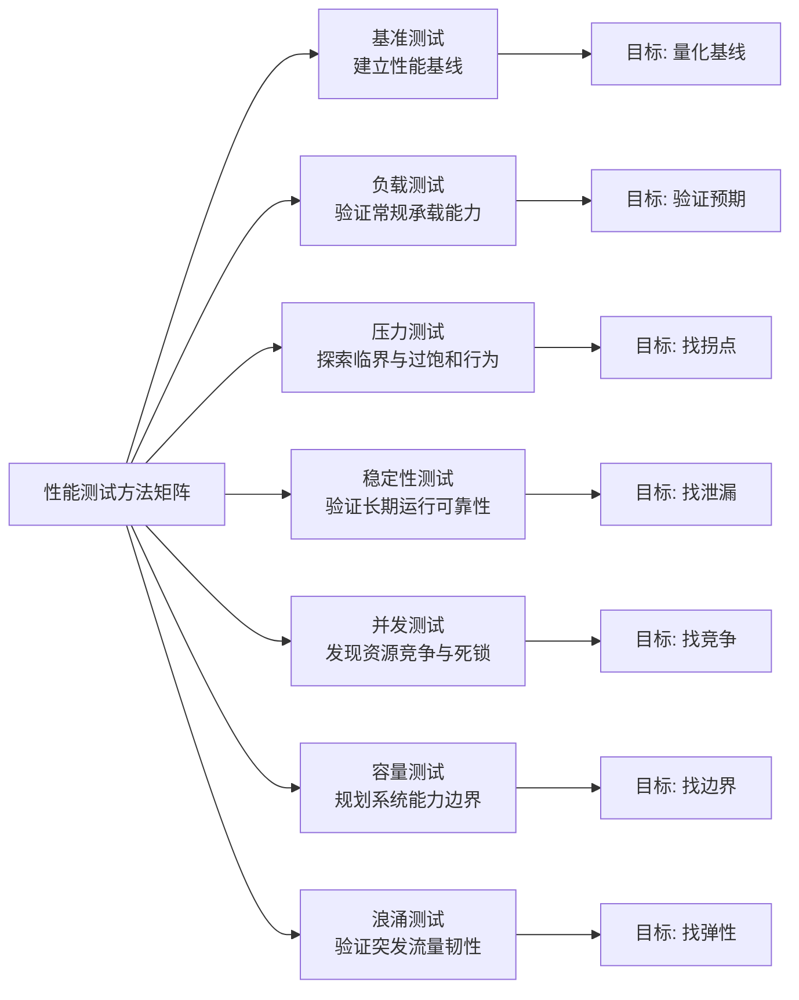
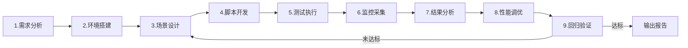

# 性能测试指标与方法论

性能测试是软件质量保障体系中工程性最强、技术深度最高的领域之一。随着云原生、微服务、Serverless 架构的全面普及，以及 SRE（Site Reliability Engineering）方法论的落地，性能测试已从"上线前一次性验证"演化为贯穿研发全生命周期的"持续性能工程"。本文系统梳理性能测试的核心概念、指标体系、七种测试方法、全流程实践，以及与 SRE/DevOps 的融合方式，为构建工程化的性能保障体系提供方法论支撑。

## 一、核心概念

### 1.1 什么是性能测试

性能测试（Performance Testing）是指通过自动化的工具与流程，模拟真实或预期的用户负载，对系统的响应时间、吞吐量、资源利用率、稳定性等指标进行量化评估的过程。其本质是在受控条件下，回答"系统在 A 条件下能否具备 B 能力"或"系统的能力边界在哪里"这两个核心问题。

与功能测试关注"对不对"不同，性能测试关注的是"快不快""稳不稳""扛不扛得住"。它不是单点验证，而是一种系统级的工程活动，涉及需求建模、环境搭建、场景设计、数据构造、执行控制、监控采集、瓶颈定位与调优验证等多个环节。

### 1.2 为什么需要性能测试

性能问题往往具有"隐蔽性"和"突发性"：在低负载下表现正常的系统，可能在峰值流量下出现雪崩；在测试环境通过的接口，可能在生产环境的长尾请求中暴露严重延迟。性能测试的核心价值体现在四个层面：

- **用户体验保障**：响应时间直接影响转化率与留存率，研究表明页面加载时间每增加 1 秒，转化率可能下降 7%；
- **容量与成本平衡**：通过容量测试确定合理的资源配比，避免"过度扩容"造成的成本浪费；
- **风险前置发现**：在上线前暴露内存泄漏、连接池耗尽、线程死锁等潜在缺陷；
- **SLO/SLA 兑现**：为线上服务的可用性与延迟目标提供数据支撑，是 SRE 错误预算管理的基础。

## 二、性能指标体系

性能指标是性能测试的"度量衡"，没有清晰的指标体系，性能测试将沦为"压一压看看"的盲目行为。一套完整的指标体系应包含响应时间、吞吐量、并发数、错误率与资源利用率五个维度。

### 2.1 响应时间分布：从平均值到分位数

响应时间（Response Time，RT）是用户视角最直观的性能体现，定义为"从请求发出到接收到最后一个字节所消耗的时间"。但仅用平均值（Average）描述响应时间会掩盖关键信息——平均值会被大量快速请求拉低，从而隐藏少数极慢请求对用户体验的破坏。

业界普遍采用分位数（Percentile）来刻画响应时间分布：

| 指标 | 含义 | 工程意义 |
|------|------|----------|
| **P50**（中位数） | 50% 的请求快于此值 | 反映典型用户体验 |
| **P90** | 90% 的请求快于此值 | 反映大多数用户体验 |
| **P95** | 95% 的请求快于此值 | 性能回归的常用告警阈值 |
| **P99** | 99% 的请求快于此值 | 反映长尾用户体验 |
| **P99.9** | 99.9% 的请求快于此值 | 大规模互联网服务的严格 SLO 标准 |

**P99 与长尾效应（Tail Latency）** 是云原生时代性能分析的核心议题。Google 在《The Tail at Scale》中提出：在一个由 1000 个节点组成的分布式系统中，即使单节点 P99 延迟为 1ms，整体请求的 P99 也可能高达 10ms 以上。这是因为一次用户请求往往需要并行或串行调用多个后端服务，任何一个慢请求都会拖累整体。因此，对分布式系统而言，优化 P99 远比优化平均值更有价值。

### 2.2 吞吐量：TPS、QPS 与 RPS

吞吐量（Throughput）反映系统在单位时间内处理业务的能力，必须以"单位时间"为前提。常见的表达方式包括：

- **TPS（Transactions Per Second）**：每秒事务数，一个事务可能包含多个请求，适用于端到端业务流程；
- **QPS（Queries Per Second）**：每秒查询数，常用于数据库与搜索引擎；
- **RPS（Requests Per Second）**：每秒请求数，适用于接口级压测。

三者容易混淆，选型原则：接口性能压测选 RPS，数据库压测选 QPS，业务流程压测选 TPS。在 HTTP/2、HTTP/3 多路复用场景下，还需关注并发流（Concurrent Streams）和并发连接数（Concurrent Connections）等更细粒度的指标。

### 2.3 并发数：业务并发与服务器并发

并发用户数（Concurrent Users）具有两层含义：业务层面的并发用户数指实际使用系统的用户总数；服务器层面的并发数指"同时向服务器发送请求的数量"，直接反映系统实际承载的压力。两者之间的关系取决于用户行为模型——同一时刻，浏览页面、填写表单、提交请求的用户比例决定了真实的服务器并发压力。因此，构建准确的用户行为模型是性能测试场景设计的关键前置工作。

### 2.4 错误率

错误率（Error Rate）指单位时间内失败请求占总请求的比例，包括 HTTP 状态码错误（5xx）、业务逻辑错误（如库存不足）、超时与连接拒绝等。错误率是判断系统是否进入"过饱和区间"的敏感指标，通常在 SLO 体系中以"可用性"的形式表达，例如 99.9% 的成功率对应 0.1% 的错误率上限。

### 2.5 资源利用率

资源利用率（Resource Utilization）反映系统各层次资源的使用情况，是定位性能瓶颈的直接依据：

- **系统级**：CPU 使用率、内存使用率、磁盘 I/O（IOPS、吞吐量）、网络 I/O（带宽、包量）；
- **应用级**：JVM GC 频率与耗时、线程池活跃度、连接池占用率、锁竞争情况；
- **容器级**（云原生新增）：Kubernetes Pod 的 CPU/Memory requests 与 limits 命中情况、HPA 扩缩容事件、节点资源碎片率；
- **可观测性指标**：分布式追踪的 Span 耗时分布、服务网格 Sidecar 延迟开销、饱和度（Saturation，USE 方法论核心指标）。

Google SRE 提出的"四个黄金信号"（Four Golden Signals）——延迟、流量、错误、饱和度——是云原生时代资源与性能监控的最佳实践框架。

## 三、七种性能测试方法

不同的测试目标对应不同的测试方法。本文将性能测试方法归纳为七类，覆盖从基准建立到极限验证的完整光谱。



### 3.1 基准测试（Benchmark Testing）

**定义**：在确定的软硬件环境与标准负载下，测量系统的关键性能指标，建立可复现的性能基线（Baseline）。

**目标**：为后续的配置测试、回归测试、容量规划提供对照基准。

**适用场景**：版本迭代中的性能回归验证、不同技术方案的横向对比（如不同 GC 算法、不同缓存策略）、第三方组件选型评估。

```java
// JMH 基准测试示例：测量字符串拼接性能
@BenchmarkMode(Mode.Throughput)              // 吞吐量模式
@OutputTimeUnit(TimeUnit.MILLISECONDS)       // 时间单位:毫秒
@Warmup(iterations = 3, time = 1)            // 预热 3 轮,每轮 1 秒
@Measurement(iterations = 5, time = 2)       // 正式测量 5 轮,每轮 2 秒
@Fork(1)                                     // 单进程
public class StringConcatBenchmark {
    @Benchmark
    public String concatBuilder() {
        // 使用 StringBuilder 拼接
        StringBuilder sb = new StringBuilder();
        for (int i = 0; i < 100; i++) {
            sb.append("item").append(i);
        }
        return sb.toString();
    }
}
```

### 3.2 负载测试（Load Testing）

**定义**：在预期的生产负载水平下运行系统，验证系统能否满足既定的性能指标。

**目标**：回答"系统能否在 A 条件下具备 B 能力"。

**适用场景**：上线前的能力验证、SLO 达标验证、日常回归压测。负载测试是最常用的性能测试方法，测试负载通常设计在系统的"线性增长区间"。

### 3.3 压力测试（Stress Testing）

**定义**：不断对系统施加超出预期负载的压力，直至系统达到临界饱和甚至崩溃，观察系统在极限状态下的行为与自愈能力。

**目标**：找到系统的性能拐点、定位临界状态下的主要瓶颈、验证系统的失败恢复能力。

**适用场景**：容量规划、大促前压测、容灾演练。压力测试通常会将负载设计在"拐点"上下，甚至突破到"过饱和区间"，观察吞吐量归零与系统崩溃的行为。

### 3.4 稳定性测试（Stability Testing / Soak Testing）

**定义**：在常规负载水平下长时间运行系统（通常 3-7 天），发现内存泄漏、连接池回收失败、资源未释放等长期运行才会暴露的问题。

**目标**：验证系统的长期可靠性。

**适用场景**：上线前的最终验证、长期运行服务的可靠性保障。为模拟真实的流量波动，稳定性测试通常采用"波浪形"负载模式——每 12 小时模拟一个高峰负载，两个高峰之间模拟低峰负载，循环往复。

### 3.5 并发测试（Concurrency Testing）

**定义**：在同一时刻集中发起对后端服务的并发调用，观察服务在并发情况下的行为，重点发现资源竞争、线程死锁、数据不一致等问题。

**目标**：发现并发条件下的资源竞争与同步缺陷。

**适用场景**：核心交易链路、库存扣减、账户转账等高一致性场景。并发测试常借助"集合点"（Rendezvous）机制实现精准的并发控制——前 N-1 个到达的用户等待，直到第 N 个用户到达后集中发起请求。JMeter 的 Synchronizing Timer 可直接实现该机制；k6 无内置集合点，需在脚本中自行实现屏障逻辑。

### 3.6 容量测试（Capacity Testing）

**定义**：通过系统化的负载递增，确定系统在满足既定性能指标（如 P99 ≤ 200ms）前提下所能承载的最大负载，并验证扩容后的能力提升是否符合预期。

**目标**：回答"系统最多能扛多少"以及"扩容后能多扛多少"。

**适用场景**：容量规划、弹性伸缩策略验证、成本优化。在云原生架构下，容量测试需特别关注 Serverless 冷启动、K8s HPA 触发延迟、按量计费模型下的性能-成本权衡。

### 3.7 浪涌测试（Spike Testing / Surge Testing）

**定义**：在极短时间内将负载从正常水平骤增至数倍峰值，再迅速回落，观察系统对突发流量的承载与恢复能力。

**目标**：验证系统在突发流量（如热点事件、推送通知、秒杀开抢）下的韧性与弹性。

**适用场景**：秒杀活动、推送触达、突发热点新闻等流量突增场景。浪涌测试是云原生弹性伸缩能力的重要验证手段——若 HPA 扩容速度跟不上流量浪涌，系统将出现请求堆积与雪崩。

## 四、性能测试全流程

工程化的性能测试不是"打开工具发起请求"，而是一套结构化的流程。下图展示了性能测试从需求到验证的完整闭环。



### 4.1 需求分析

明确"测什么、为何测、测到什么程度"。关键产出包括：性能目标（如 P99 ≤ 200ms、TPS ≥ 5000）、关键业务场景、用户行为模型、数据量级估算。需求来源包括历史访问日志、APM 数据、业务预测、竞品参考。在云原生场景下，还需明确 SLO/SLA 约束与错误预算。

### 4.2 环境搭建

性能环境应与生产环境尽可能一致——包括硬件规格、网络拓扑、中间件版本、数据量级。对于无法完全对等的环境，需建立"环境差异系数"用于结果折算。云原生场景下推荐使用 Kubernetes 命名空间隔离的独立性能环境，配合影子库/影子表实现压测数据隔离。

### 4.3 场景设计

基于用户行为模型设计测试场景，包括：单接口基准场景、业务链路混合场景、峰值场景、稳定性场景、浪涌场景。每个场景需明确并发用户数、加压策略（阶梯/瞬时/恒定）、持续时间、思考时间（Think Time）、集合点等参数。

### 4.4 脚本开发

将场景设计转化为可执行的测试脚本。现代性能测试强调"脚本即代码"（Script as Code），推荐使用 k6（JavaScript）、Gatling（Kotlin/Scala）、Locust（Python）等代码化工具，便于版本管理、Code Review 与 CI/CD 集成。脚本开发需注意参数化数据、关联提取、断言设置、事务划分等关键点。

### 4.5 测试执行

按场景顺序执行，遵循"先基准后负载、先单接口后混合、先常载后压力"的原则。每次执行需记录环境状态、并发配置、运行时长，确保结果可复现。云原生场景下建议采用分布式压测引擎（如 k6 Operator、Gatling Enterprise）突破单机并发瓶颈。

### 4.6 监控采集

监控是性能分析的"眼睛"，应覆盖全栈四层：客户端（压测机输出）、基础设施（CPU/内存/磁盘/网络）、应用（JVM/线程池/连接池）、链路（分布式追踪）。推荐技术栈：Prometheus 3.0 + Grafana 进行指标采集与可视化，OpenTelemetry 统一链路追踪标准，Jaeger 或 SkyWalking 进行分布式追踪分析。

### 4.7 结果分析

基于监控数据进行多维度交叉分析：响应时间分布是否合理、吞吐量是否达到预期、错误率是否在可接受范围、资源利用率是否均衡、是否存在明显的资源瓶颈。常用分析方法包括 USE 方法论（Utilization-Saturation-Errors，用于资源分析）与 RED 方法论（Rate-Errors-Duration，用于服务分析）。

### 4.8 性能调优

针对定位到的瓶颈进行调优，常见方向：JVM GC 调优（ZGC/Shenandoah）、数据库索引与 SQL 优化、缓存策略优化（多级缓存、防穿透/击穿/雪崩）、连接池与线程池参数调整、K8s 资源配额与 HPA 策略调优、代码算法重构。调优应遵循"单变量变更"原则，每次只调整一项配置并验证效果。

### 4.9 回归验证

调优后需重新执行测试场景，验证调优效果并确保未引入新的性能回归。回归通过后输出性能测试报告，报告应包含测试目标、环境配置、场景设计、结果数据、瓶颈分析、调优建议与风险评估。

## 五、性能测试与 SRE/DevOps 的融合

### 5.1 从"项目型压测"到"持续性能验证"

传统性能测试是项目制的一次性活动，往往在大促前或上线前开展。随着 DevOps 与 SRE 的普及，性能测试正在向"持续性能验证"（Continuous Performance Testing）演进——将性能测试集成到 CI/CD 流水线中，在每次代码提交或定期（如每日）自动执行，并通过性能回归门禁拦截劣化版本。

```yaml
# GitHub Actions 中集成 k6 持续性能测试示例
name: 性能回归测试
on:
  pull_request:
    branches: [ main ]
jobs:
  k6-load-test:
    runs-on: ubuntu-latest
    steps:
      - uses: actions/checkout@v4
      - name: 运行 k6 压测
        uses: grafana/k6-action@v0.3.1
        with:
          filename: tests/perf/load-test.js
          flags: --env THRESHOLDS_P99=200  # P99 阈值 200ms
```

> 注：示例中的 `grafana/k6-action` 已于 2026-06 归档停更，官方现推荐改用 `grafana/setup-k6-action` + `grafana/run-k6-action` 组合；本例写法在归档版本上仍有效。

### 5.2 SRE 方法论对性能测试的塑造

Google SRE 方法论对性能测试实践产生了深远影响：

- **SLO/SLA 驱动**：性能测试目标不再凭经验设定，而是直接来源于线上服务的 SLO（如 99.9% 的请求 P99 ≤ 200ms）；
- **错误预算（Error Budget）**：性能测试需评估版本发布对错误预算的消耗，避免因性能劣化突破 SLO 边界；
- **Toil 消除**：通过自动化性能测试平台减少重复性人工操作；
- **事故复盘驱动改进**：线上性能事故的复盘结论反哺到性能测试场景设计，形成闭环。

### 5.3 全链路压测标准化

全链路压测已成为互联网公司的标配实践，2024-2026 年间进一步走向标准化：

- **流量录制回放**：基于生产真实流量构造压测脚本，提升场景保真度；
- **影子库/影子表**：实现压测数据与生产数据的物理隔离；
- **压测标透传**：通过 HTTP Header 或 RPC Context 标记压测流量，全链路识别与隔离；
- **常态化压测**：从"大促前一次性"转变为周期性持续性能验证；
- **与混沌工程结合**：在压测过程中主动注入故障（节点宕机、网络延迟），验证系统在异常条件下的性能韧性。

## 六、常见陷阱与最佳实践

### 6.1 常见陷阱

- **只看平均值，忽略分位数**：平均值会掩盖长尾问题，必须关注 P95/P99；
- **测试环境与生产环境脱节**：环境差异导致测试结果失真，需建立环境差异系数或采用生产环境压测；
- **忽视预热环节**：JIT 编译、缓存填充、连接池初始化等预热阶段的数据应排除在统计之外；
- **单维度加压，缺少组合场景**：单接口压测通过不代表混合场景可用，必须设计贴近真实的业务链路混合场景；
- **压测数据污染生产**：未做流量隔离的全链路压测可能写入脏数据，必须通过压测标与影子库严格隔离；
- **只测不调，调而不验**：性能测试的价值在于"测-调-验"闭环，缺失任何一环都会使测试流于形式。

### 6.2 最佳实践

- **指标先行**：测试开始前明确 SLO 与验收阈值，避免"压完再看"；
- **脚本即代码**：采用代码化工具，纳入版本管理与 Code Review；
- **全栈监控**：压测即监控，监控覆盖客户端、基础设施、应用、链路四层；
- **环境对等**：尽可能缩小测试环境与生产环境的差异，关键场景在生产环境开展影子压测；
- **持续集成**：将性能测试纳入 CI/CD 流水线，建立性能回归门禁；
- **数据驱动**：沉淀历史压测数据，建立性能基线与趋势分析，量化长期演进。

## 总结

性能测试已从"上线前的一次性验证"演化为贯穿研发全生命周期的"持续性能工程"。在云原生与 SRE 范式下，性能测试工程师不仅要掌握传统的压测工具与指标体系，还需理解 SLO/SLA、错误预算、全链路压测、混沌工程等新方法论，并具备与 DevOps 流水线深度集成的工程化能力。

本文梳理的性能指标体系（响应时间分位数、吞吐量、并发数、错误率、资源利用率）与七种测试方法（基准、负载、压力、稳定性、并发、容量、浪涌）构成了性能测试方法论的基石；全流程实践与 SRE/DevOps 融合部分则提供了工程落地的路径。掌握这些内容，并将其与具体的业务场景、技术栈结合，才能真正构建起可靠、可演进、可持续的性能保障体系。
