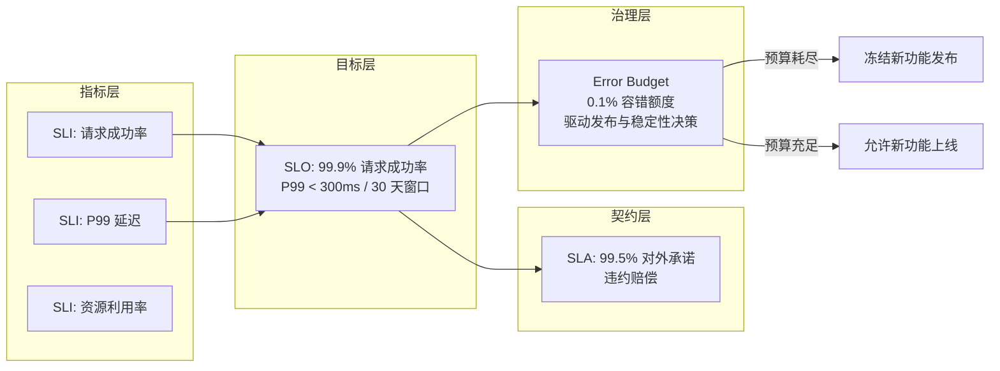
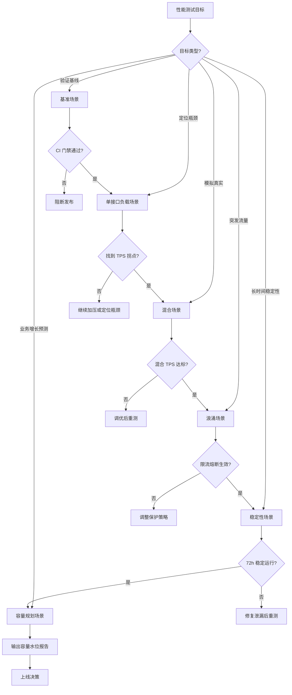

# 性能测试目标制定与场景分类

性能测试最常被诟病的不是"没做"，而是"做了没用"。测出来的 TPS 看上去很漂亮，上线后系统却在第一波真实流量下宕机——根因往往不在工具，而在**目标制定**与**场景设计**两个环节。本文以 Google SRE 的 SLO/SLI/SLA 体系为骨架，结合云原生环境的特殊性，重新梳理性能测试的目标量化方法、场景分类体系与方案要素。

## 一、核心概念：性能测试目标为什么重要

性能测试目标并不是"写一个 TPS 数字"那么简单，它本质上是回答三个问题：

- **测什么**：被测系统的边界、接口、链路范围。
- **测到什么程度**：在什么负载下、达到什么指标才算通过。
- **测出问题怎么办**：触发停止条件后，是继续加压、降级，还是直接定位。

没有目标的性能测试几乎一定会陷入两类典型失败：一是**范围偏差**，某次大促前所有主链路接口都被反复压测，但一个平时访问量极低的接口因携带大 Key 触发了中间件流量阈值，最终导致全站不可用；二是**指标虚假**，测试环境用 1/10 的数据量跑出 1 万 TPS，上线后真实数据量下连 2000 TPS 都撑不住，索引缺失、冷数据回源等问题被掩盖。

目标制定的本质，是把业务侧的"用户体验预期"和运维侧的"容量约束"翻译成可度量、可执行、可校验的技术指标，并在测试过程中始终用它来约束决策（停止条件、调优目标、上线基线）。

## 二、SLO/SLI/SLA 与 Error Budget：Google SRE 方法论在性能测试中的应用

传统性能测试目标制定依赖"二八原则""2-5-8 原则"等经验法则，缺乏与生产真实表现的强约束关系。Google SRE 提出的 SLO/SLI/SLA/Error Budget 体系，把"用户感知的可用性"作为第一性原理，是当下制定性能目标的主流方法论。

### 2.1 概念定义

- **SLI（Service Level Indicator，服务等级指标）**：对服务某一方面表现的具体量化度量。例如"过去 5 分钟内 HTTP 请求中返回状态码 < 500 的比例"或"P99 响应延迟"。
- **SLO（Service Level Objective，服务等级目标）**：对 SLI 设定的目标值或目标区间。例如"过去 30 天内 99.9% 的请求 P99 延迟 < 300ms"。
- **SLA（Service Level Agreement，服务等级协议）**：对外承诺的、违反后会产生赔偿或法律后果的契约性 SLO，通常比内部 SLO 更宽松。
- **Error Budget（错误预算）**：1 − SLO 所对应的"允许失败额度"。例如 SLO 为 99.9%，则每月错误预算为 0.1% × 总请求数。预算未耗尽时优先推进新功能；预算耗尽时冻结发布、优先稳定性建设。

### 2.2 四者关系



### 2.3 在性能测试中的落地

SLO 体系对性能测试的影响是结构性的：

1. **测试目标来源于 SLO，而非拍脑袋**：每个被测接口的 TPS、P99、错误率目标，都从该服务的 SLO 推导而来。SLO 是 99.9% 成功率 + P99 < 300ms，性能测试就必须验证"在容量峰值负载下，该 SLO 是否仍能达成"。
2. **测试通过条件 = Error Budget 未透支**：单次性能测试中观测到的错误率，不能消耗超出该窗口剩余预算的合理比例。例如某月剩余预算对应 100 万次错误，单次压测 1 小时内产生的错误数不应超过约 1400 次（按 1 小时占 30 天窗口的比例折算）。
3. **回归门禁自动化**：把 SLO 校验集成到 CI/CD 性能回归流水线，每次发布前跑基准场景，比对当前版本与基线版本在 SLI 上的偏差，超过阈值即阻断发布。

下面是一段以 Prometheus + Sloth（SLO 生成器）描述的 SLO 配置，可直接作为性能测试通过条件的引用来源：

```yaml
# SLO 配置：订单创建接口（30 天滚动窗口）
version: "prometheus/v1"
service: "order-service"
slos:
  - name: "order-create-availability"
    objective: 99.9                  # 目标可用性 99.9%
    sli:
      events:
        total_query: |
          sum(rate(http_requests_total{job="order-service",code!~"5.."}[{{.window}}]))
        # 错误事件：5xx + 业务码非 0
        error_query: |
          sum(rate(http_requests_total{job="order-service",code=~"5.."}[{{.window}}]))
          +
          sum(rate(order_business_errors_total{job="order-service"}[{{.window}}]))
    alerting:
      name: order-create-slo-alert
      page_alert: { labels: { severity: page } }
      ticket_alert: { labels: { severity: ticket } }
```

对应的 SLI 实时查询（用于性能测试过程中持续校验）：

```promql
# 过去 5 分钟订单创建接口的成功率（SLI）
1 -
(
  sum(rate(http_requests_total{job="order-service",code=~"5.."}[5m]))
  +
  sum(rate(order_business_errors_total{job="order-service"}[5m]))
)
/
sum(rate(http_requests_total{job="order-service"}[5m]))

# 过去 5 分钟订单创建接口 P99 延迟（SLI）
histogram_quantile(0.99,
  sum by (le) (rate(http_request_duration_seconds_bucket{job="order-service"}[5m]))
)
```

## 三、性能指标目标制定：TPS、响应时间（P99）、错误率、资源利用率

### 3.1 TPS（吞吐量）

TPS（Transactions Per Second）依然是性能测试中最核心的吞吐量指标，因为它同时具备**可度量性**（生产监控可直接产出）和**通用性**（运维、研发、测试三方语义一致）。TPS 目标制定的关键是把"业务量"换算为"接口量"：

- 从业务侧获取大促当天总 PV / 总订单数；
- 按时间维度拆解：取高峰与次高峰的每小时访问占比；
- 按服务维度拆解：网关 → 业务服务 → 接口，得到各接口在高峰期的调用比例；
- 用"高峰小时 PV × 接口占比 × 峰值系数（一般 1.5～3）"换算为该接口的目标 TPS。

峰值系数是关键。生产监控里的"峰值"通常是 1 分钟或 5 分钟聚合值，而真正的秒级尖峰可能比这高 2～3 倍。性能测试必须按秒级峰值设计目标，否则会出现"监控看着没问题，但用户已经在 5 秒内感受到明显卡顿"的现象。

### 3.2 响应时间（重点看 P99，不是平均值）

平均值会掩盖长尾问题，必须用分位数（P95、P99、P99.9）来约束。Google SRE 的经验法则是：P99 ≈ 3 × 平均值，P99.9 ≈ 4 × P99。制定 P99 目标的依据：

- **用户体验约束**：电商核心链路 P99 < 500ms，搜索类 P99 < 200ms，详情页 P99 < 800ms 是较常见的阈值。
- **SLO 反推**：若 SLO 要求"99.9% 请求 < 300ms"，则 P99.9 必须 < 300ms，而 P99 应留出 30%~50% 的安全冗余。
- **链路累加**：微服务架构下，端到端 P99 ≈ 各跳 P99 之和 + 网关开销。给下游服务的 P99 目标要扣除上游已消耗的预算。

### 3.3 错误率

错误率 = 不符合返回期望的请求数 / 总请求数。性能测试中的"错误"应做三层校验：

- **状态码层**：5xx 直接计错，4xx 需区分（业务拒绝 vs 系统异常）。
- **业务码层**：返回 200 但业务码非 0，应通过断言识别。
- **数据一致性层**：压测结束后抽样校验落库数据，识别"看似成功实则丢失"的隐患（如消息积压、最终一致性未达成）。

错误率目标应与 SLO 的可用性目标对齐。SLO 是 99.9%，单次压测的错误率不应高于 0.1%；考虑到 Error Budget 的滚动消耗，长期回归测试的错误率门禁通常设为 SLO 的 50%（即 0.05%），给生产侧留出余量。

### 3.4 资源利用率

资源利用率指标（CPU、内存、磁盘 IO、网络）是 SLO 体系之外的"过程指标"，但它们决定了系统在当前负载下是否还有余量。常用门禁：

- CPU 利用率（含 iowait）持续 5 分钟 > 70%，视为容量预警；
- 内存利用率 > 80% 或持续单调上升（疑似泄漏），视为风险；
- 磁盘 IO util > 80% 或网络带宽 > 70%，需评估是否扩容。

在云原生环境下，单节点 CPU 70% 已接近 HPA（Horizontal Pod Autoscaler）默认扩容阈值（通常 80%），需结合自动伸缩策略一起设计目标，详见第六节。

## 四、性能测试场景分类：基准 / 单接口负载 / 混合场景 / 浪涌 / 稳定性 / 容量规划

### 4.1 基准场景

单线程或 ≤5 线程对单接口发起请求，获取无负载下的基线指标。作用：

- 验证脚本、参数化数据、断言逻辑的正确性；
- 产出基线 TPS / P99，作为后续负载场景的对比锚点；
- 在 CI 流水线中作为发布门禁，每次构建自动比对，偏差 > 10% 即告警。

### 4.2 单接口负载场景

对单接口按线程梯度（如 50、100、200、400、800）阶梯式加压，每档稳定运行 10～15 分钟，记录 TPS / P99 / 错误率 / 资源指标，定位 TPS 拐点。注意点：

- 每个线程梯度用**独立场景**而非"单场景多梯度"，避免聚合报告把不同量级数据平均化；
- 初学者应从低线程起步，否则容易跳过拐点；
- 明确停止条件：CPU > 70%、P99 > 500ms、错误率 > 0.1%，触发任一即停止加压。

### 4.3 混合场景

按生产真实调用比例混合多接口，阶梯加压找混合 TPS 峰值。比例来源于第二节"时间维度 + 服务维度"的数据统计。JMeter 中可用**吞吐量控制器**（Throughput Controller）按百分比精确控制各接口调用比例，避免靠线程数硬调。

### 4.4 浪涌场景

模拟突发流量尖峰（如大促开闸、推送触达、热点事件），在短时间内将负载从基线值瞬时拉升至峰值的 2～5 倍，持续 30～60 秒后回落。重点验证：

- 限流、熔断、降级策略是否按预期触发；
- 自动伸缩是否能在尖峰期内完成扩容；
- 队列堆积与回放能力，例如 Kafka 消费滞后是否在尖峰后能恢复。

### 4.5 稳定性场景

采用典型混合场景，以"峰值处理能力"或"日常峰值 × 1.2"为目标负载，连续运行 24～72 小时，验证：

- **正确率**：长时间运行的业务正确率 ≥ 99.9999%；
- **处理能力平稳性**：TPS 不出现持续下滑；
- **资源泄漏**：内存、连接数、文件描述符无单调增长；
- **比例漂移**：各接口实际调用比例不偏离预期 ±5%。

稳定性场景对监控与预案的要求极高，任何一项意外（数据耗尽、压测机宕机、网络抖动）都会导致 72 小时归零。建议设置分钟级告警 + 值班机制。

### 4.6 容量规划场景

容量规划场景的目标不是"找拐点"，而是"回答能不能撑住下一季度业务增长"。执行方式：

- 以当前峰值 TPS 为基准，按业务预测的增长率（如 +50%）反推目标 TPS；
- 持续以目标 TPS 运行，观察资源利用率与 SLO 达成情况；
- 输出**容量水位报告**：当前配置可承载峰值、扩容节点数建议、成本预估。



## 五、性能测试方案要素：范围 / 策略 / 环境 / 数据 / 监控 / 风险 / 排期

一份能落地的性能测试方案至少包含以下七要素：

1. **测试范围**：被测服务清单、接口清单、链路边界，以及明确**不在范围内**的部分（如第三方依赖用 Mock 替代）。
2. **测试策略**：选定哪些场景（参考第四节）、加压模型（阶梯 / 恒压 / 浪涌）、停止条件、通过条件（基于 SLO 与 Error Budget）。
3. **环境配置**：被测部署架构图（含节点数、网段、规格）、操作系统与中间件版本。当前推荐基线为 **CentOS Stream 9 / Ubuntu 22.04**，JDK 17/21，容器运行时 containerd 1.7+，K8s 1.28+。环境与生产的差异点需逐项列出并评估影响。
4. **数据准备**：
   - **基础数据量**：与生产对齐，避免索引缺失问题被掩盖；
   - **增量数据**：预估一轮压测产生的数据量，准备兜底清理脚本；
   - **参数化数据**：读写接口分离，订单号等关键参数按业务规则构造；
   - **冷热数据分布**：明确哪些数据会被缓存、缓存时长，避免热数据效应虚高 TPS。
5. **监控体系**：覆盖所有服务器、所有中间件、所有链路；分层呈现（基础设施 → 容器 → 应用 → 业务）；设置阈值告警（钉钉 / 电话 / 短信），避免人工盯盘。
6. **风险与预案**：
   - **容量规划风险**：环境规格低于生产时的换算方法；
   - **数据风险**：压测数据污染生产（如未隔离环境），需准备回滚脚本；
   - **第三方依赖风险**：下游限流导致压测失败，需提前申请白名单或使用影子库；
   - **回归测试策略**：每个版本回归哪些场景、用什么基线对比、对比指标阈值（如 P99 退化 > 10% 即不通过）。
7. **排期与人员**：阶段化排期（环境搭建 / 数据准备 / 脚本开发 / 执行 / 分析 / 报告），标注主负责人与协调人，关键节点面对面 check。

## 六、云原生环境下的场景设计挑战

K8s + 微服务 + 服务网格的普及，让性能测试场景设计出现了几个新挑战。

### 6.1 自动伸缩对场景稳定性的干扰

HPA / VPA 会在压测过程中动态调整 Pod 数量，导致：

- 单接口负载场景的"拐点"难以复现——加压到一半 HPA 扩容，TPS 又上去了；
- 稳定性场景的"处理能力"看似平稳，实则是不断扩容在兜底，掩盖了单 Pod 的真实瓶颈。

应对策略：

- **基准与单接口负载场景**：固定副本数（`kubectl scale --replicas=N`），关闭 HPA，测单 Pod 真实容量；
- **混合与容量规划场景**：开启 HPA，验证扩容策略是否能在目标负载下及时生效，并记录扩容时序；
- **浪涌场景**：必须开启 HPA，重点观察冷启动延迟（Pod 调度 + 镜像拉取 + 应用就绪）对尖峰流量的影响。

### 6.2 服务网格（Istio / Linkerd） Sidecar 开销

Sidecar 代理会引入额外延迟（通常 P99 增加 5～20ms）与资源消耗（每 Pod 增加 100～500m CPU）。性能测试必须：

- 在场景设计阶段区分"网格内调用"与"网格外调用"，分别设定 P99 目标；
- 监控 Sidecar（Envoy）自身指标：P99 延迟、连接数、熔断次数；
- 评估是否对核心链路启用"mTLS 直连"或 Sidecar-less 方案（如 Cilium Service Mesh）。

### 6.3 链路追踪与全链路压测

微服务架构下，一个端到端请求可能跨越 10+ 服务。性能测试必须配套全链路追踪（SkyWalking / Jaeger / Tempo），在分析阶段定位"哪一跳是瓶颈"。全链路压测还需解决：

- **流量染色**：压测流量打标（如 HTTP Header `x-pressure-test: true`），让下游识别并走影子库 / 影子队列；
- **数据隔离**：压测数据不污染生产表，通常用影子库或行级标记；
- **链路透传**：确保 TraceID 在跨线程、跨消息队列、跨线程池时仍能透传，否则追踪会断链。

## 七、常见陷阱与最佳实践

### 7.1 常见陷阱

- **拍脑袋定目标**：用"二八原则""2-5-8"代替真实数据分析，目标与生产脱节。
- **只看平均值**：用平均响应时间掩盖长尾，P99 才是用户体验的真实反映。
- **测试环境数据量远小于生产**：索引缺失、慢 SQL、连接池配置问题无法暴露。
- **冷数据效应虚高 TPS**：参数化数据量太少，压测中冷数据变热数据，TPS 持续上升，看似漂亮实则失真。
- **单场景多梯度合并**：JMeter 聚合报告会把不同量级数据平均化，掩盖拐点。
- **压测即终局**：压测通过就认为系统安全，忽略 SLO 持续监控与 Error Budget 治理。
- **云原生下忽略 HPA 影响**：基准 / 单接口负载场景不固定副本数，拐点不可复现。

### 7.2 最佳实践

- **目标来源于 SLO**：所有 TPS / P99 / 错误率目标从 SLO 反推，并接入 Error Budget 治理。
- **数据驱动**：时间维度 + 服务维度 + 接口维度的三维数据统计，颗粒度越细越好。
- **场景分层**：基准 → 单接口负载 → 混合 → 浪涌 → 稳定性 → 容量规划，按顺序执行，前一阶段不通过不进入下一阶段。
- **回归门禁自动化**：基准场景接入 CI/CD，每次发布前自动比对基线，P99 退化 > 10% 或错误率 > SLO 50% 即阻断发布。
- **全链路追踪**：性能测试与可观测性建设同步推进，没有追踪的压测只能发现问题，不能定位问题。
- **环境与生产对齐**：数据量、配置、依赖版本逐项核对，差异点显式记录并评估影响。
- **预案先行**：稳定性与容量规划场景前，必须有监控告警 + 数据清理脚本 + 回滚预案。

## 总结

性能测试目标的制定不是孤立的数字游戏，而是把业务预期、用户体验、容量约束、SLO 治理串联起来的系统工程。SLO/SLI/SLA/Error Budget 提供了从"经验法则"到"工程方法论"的跃迁路径，而云原生环境的特殊性要求我们在场景设计中正视自动伸缩、服务网格、全链路追踪带来的新变量。把这些都纳入性能测试方案，目标才有的放矢，场景才能复现真实，结果才经得起生产的检验。
