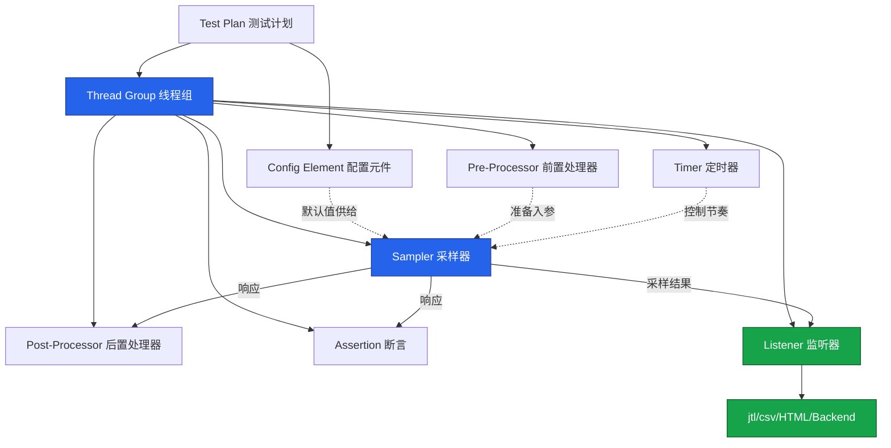
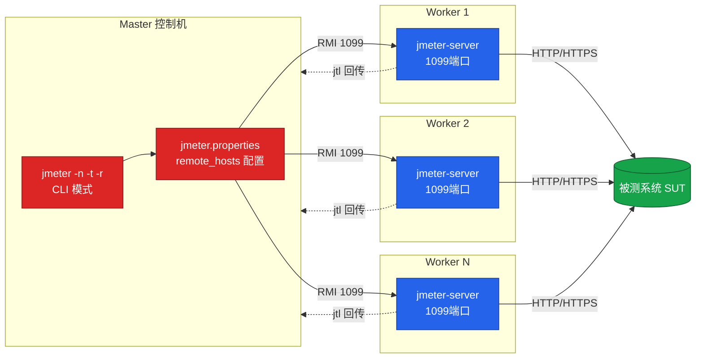

# JMeter 5.6.3 核心概念与脚本构建

Apache JMeter 是当前业界使用最广泛的开源性能测试工具之一。本文面向已经具备一定编程与测试基础的工程师，系统梳理 JMeter 5.6.3 的核心概念、组件体系、脚本构建规范与分布式压测要点，并指出常见误区与最佳实践，帮助读者建立工程化的性能测试认知。

## 一、核心概念

### 1.1 JMeter 是什么

JMeter 是 Apache 软件基金会基于纯 Java 开发的开源性能测试工具，最初用于 Web 应用压力测试，现已扩展至 HTTP/HTTPS、FTP、JDBC、JMS、SMTP、TCP、LDAP、SOAP/REST 等多种协议。它支持负载测试、压力测试、并发测试，也可用于接口功能验证与回归测试。

JMeter 解决的核心问题包括：

- **协议级负载生成**：在受控条件下向目标系统发起可量化的并发请求；
- **可重复的测试脚本**：通过 `.jmx`（XML 格式）保存测试计划，纳入版本管理；
- **结果可观测**：以 jtl/csv 文件、HTML 报告、Backend Listener 等多种方式输出指标；
- **水平扩展**：通过 Master-Worker 分布式架构突破单机压力上限。

### 1.2 核心架构

JMeter 的执行模型基于"线程组驱动 + 组件编排"。测试计划（Test Plan）是最外层容器，内部以线程组为调度单元，每个线程模拟一个虚拟用户；线程在循环中依次执行同级组件下的采样器，并由配置元件、定时器、前后置处理器、断言、监听器协作完成一次完整的请求-响应处理。同一作用域下的组件按照固定顺序执行，监听器位于链路末端负责收集结果。

组件执行顺序遵循固定规则：配置元件 → 前置处理器 → 定时器 → 采样器 → 后置处理器 → 断言 → 监听器。理解这一顺序是排错的基础，例如把提取响应数据的逻辑放到前置处理器中将无法获取到所需字段（提取应交给采样器之后的后置处理器完成）；断言则固定运行在后置处理器之后——无论其在测试树中的位置如何——因此后置处理器提取的变量在断言中总是可用。JMeter 的元件作用域遵循父子关系：作为采样器子节点的元件只对该采样器生效，挂在测试计划或线程组下的元件则对作用域内所有采样器生效。善用作用域可以显著降低脚本复杂度。

## 二、5.6.3 最新版本现状

### 2.1 版本演进

JMeter 5.x 系列自 5.0（2018）逐步引入 JSR223 + Groovy 作为推荐的脚本引擎，并在 5.4 之后默认使用 Darklaf 主题。截至审校时点（2026-09），JMeter 6.0 已于 2026 年初发布 GA（要求 Java 17+，并升级至 Groovy 5），但插件生态仍处迁移早期；生产环境广泛使用的稳定版本仍是 **5.6.3**，本文即以 5.6.3 为准展开。

5.6.3 仍要求 Java 8+（推荐 Java 11 或 17），在升级时应优先确认 JDK 版本与第三方插件的兼容性。

### 2.2 与 6.0.0 的关系

JMeter 6.0 已于 2026 年初发布 GA，最低要求 Java 17 并升级至 Groovy 5。二进制与插件生态仍处于迁移期，生产环境可保持 5.6.3，待第三方插件完成兼容性验证后再评估升级。在过渡阶段，建议团队将脚本中所有 BeanShell 迁移到 JSR223+Groovy，并将第三方插件（如 JMeter Plugins 标准集）升级到与 5.6.x 兼容的版本，为未来平滑升级到 6.0 做准备。

### 2.3 5.6.3 关键变更

相比旧文档中使用的 5.2.1（2019）/ 5.5（2022），5.6.3 值得关注的改进包括：

- **Constant Throughput Timer NullPointerException 修复**：在 Target Throughput 字段中使用变量（`vars.get`）不再触发 NPE；
- **InfluxDB 2.x Backend Listener 稳定**：可直接写入 InfluxDB v2 token 鉴权的 bucket；
- **二进制 API 兼容性恢复**：5.6.2 引入的插件破坏已修复，第三方插件生态（如 jmeter-plugins）可平滑迁移；
- **HTTP Sampler 改进**：307/308 重定向保留原始 HTTP 方法；`multipart/form-data` 不再自动追加 charset，符合 RFC 7578；
- **JSR223 + Groovy 全面替代 BeanShell**：BeanShell 仍保留但不再推荐，性能与维护性均弱于 Groovy。

## 三、核心组件体系

### 3.1 组件架构总览

JMeter 的组件分为七大类：测试计划是最外层容器，线程组隶属于测试计划；前置处理器、定时器、采样器、后置处理器、断言与监听器依次编排在线程组之内，配置元件既可挂在线程组层级、也可作为采样器的子节点。



### 3.2 线程组

线程组是压力发起的最小调度单位。经典 Thread Group（Closed Workflow，闭环模型）通过"线程数 + Ramp-Up + 循环次数"配置，线程一旦启动将持续运行至循环结束，**实际吞吐量随被测系统响应时间变化**——系统变慢则 QPS 自动下降。

核心线程组之外，社区插件 **Open Model Thread Group**（jmeter-plugins.org 的 Custom Thread Groups 插件集，需通过 Plugins Manager 安装）提供了开放式工作流模型，其特点是按"到达率"调度，例如设定 100 req/s 恒定到达率，即使系统响应时间从 100ms 恶化到 500ms，仍会维持每秒 100 个新请求进入，更接近真实用户访问模型。Open Model 不再显式配置线程数，而是由插件根据到达率与响应时间动态增减并发。

### 3.3 采样器

采样器承担发起请求的核心职责。常用采样器包括 HTTP Request、JDBC Request、FTP Request、TCP Sampler、JMS Publisher 等。HTTP Request 在 5.6.3 中支持 HTTP/2（实验性）、HTTP Client 4 与 HTTP Client 5 双实现，并对 307/308 重定向处理做了修正。

### 3.4 监听器

监听器负责收集与展示采样结果。日常工程中真正需要关注的只有三类：

- **View Results Tree（查看结果树）**：仅用于脚本调试，禁止在正式压测中开启；
- **Aggregate Report / Summary Report**：聚合指标统计，可作为压测时的最小监听器集合；
- **Backend Listener**：将指标实时推送到 InfluxDB/Prometheus，是分布式压测与可视化的事实标准。

### 3.5 配置元件、断言、定时器、前后置处理器

| 组件类型 | 作用 | 典型元件 |
|---------|------|----------|
| 配置元件 | 初始化默认值与变量 | HTTP Request Defaults、CSV Data Set Config、User Defined Variables |
| 断言 | 校验响应是否符合预期 | Response Assertion、JSON Assertion、Duration Assertion |
| 定时器 | 控制请求间隔与吞吐 | Constant Timer、Constant Throughput Timer、Synchronizing Timer |
| 前置处理器 | 请求前生成入参 | JSR223 PreProcessor、User Parameters |
| 后置处理器 | 请求后提取关联数据 | Regular Expression Extractor、JSON Extractor、Boundary Extractor |

## 四、脚本构建规范

### 4.1 GUI 构建、CLI 执行

JMeter 官方明确说明：**GUI 仅用于脚本构建与调试，正式压测必须使用 CLI（非 GUI）模式**。GUI 模式下 Swing 渲染、结果树刷新会大量消耗客户端 CPU 与内存，并发量稍高即会引发 OOM 或线程调度抖动，使压测结果失真。

规范的工作流是：在 GUI 中拖拽组件、配置参数、用 View Results Tree 调试通过 → 保存 `.jmx` → 在压测机上以 CLI 执行。

### 4.2 CLI 执行命令

```bash
# 基础执行：仅输出 jtl 结果文件
jmeter -n -t test.jmx -l result.jtl

# 推荐：同时生成 HTML 报告
jmeter -n -t test.jmx -l result.jtl -e -o ./report

# 参数说明：
# -n  非 GUI 模式运行
# -t  指定测试脚本（.jmx）
# -l  指定结果文件（.jtl 或 .csv）
# -e  测试结束后生成 HTML 报告
# -o  HTML 报告输出目录（必须为空目录）

# 大规模压测建议同时指定 JVM 堆内存
HEAP="-Xms2g -Xmx4g" jmeter -n -t test.jmx -l result.jtl -e -o ./report
```

CLI 执行过程中若需查看实时报错内容，应在脚本中通过 JSR223 监听器把错误响应写入 `jmeter.log`，而非依赖 GUI 结果树。

### 4.3 JSR223 + Groovy 替代 BeanShell

旧文档中的 BeanShell 示例存在性能差、语法陈旧的问题。5.6.3 推荐使用 JSR223 Sampler/PreProcessor/PostProcessor + Groovy，并启用缓存编译以获得接近原生 Java 的执行性能。相比 BeanShell，Groovy 在以下方面具有明显优势：

- **执行性能**：Groovy 在勾选 `Cache compiled script` 后会将脚本编译为字节码并缓存，重复执行时性能与 Java 接近，BeanShell 每次都解释执行；
- **语法现代化**：支持闭包、字符串模板、类型推断、安全导航操作符 `?.`；
- **生态兼容**：可直接调用 Java 标准库与项目 jar 包，便于复用业务工具类；
- **官方推荐**：JMeter 文档明确建议所有新脚本使用 JSR223+Groovy，BeanShell 仅作向后兼容保留。

```groovy
// JSR223 PostProcessor (Groovy) - 打印错误响应到 jmeter.log
// 在 GUI: 添加 -> 后置处理器 -> JSR223 PostProcessor
// 语言选择 groovy，勾选 "Cache compiled script"

import org.apache.jmeter.samplers.SampleResult

String response = prev.getResponseDataAsString()    // prev 是当前 SampleResult
String code     = prev.getResponseCode()

if (code == "200") {
    log.info("Response OK, length={}", response.length())
} else {
    // 把出错请求的 URL、状态码、响应体一并落盘，便于回溯
    log.error("Error code={} url={} body={}",
              code,
              prev.getURL()?.toString(),
              response)
}
```

> 注意：`log`、`prev`、`vars`、`ctx` 是 JMeter 注入的内置对象，无需声明；Groovy 4 的安全类加载要求脚本避免使用反射与 `System.exit`。

### 4.4 Open Model Thread Group 配置示例

Open Model Thread Group 通过 Plugins Manager 安装 Custom Thread Groups 插件集后即可在 GUI 中使用，这里给出其 JMX 关键片段以便理解结构：

```xml
<!-- Open Model Thread Group: 恒定到达率 100 req/s，持续 60s -->
<ThreadGroup guiclass="openmodel.ThreadGroupGui" testclass="ThreadGroup">
  <stringProp name="ThreadGroup.on_sample_error">continue</stringProp>
  <elementProp name="ThreadGroup.main_controller" elementType="OpenModelController">
    <stringProp name="ThreadGroup.scheduler">true</stringProp>
    <stringProp name="ThreadGroup.duration">60</stringProp>
    <stringProp name="arrival_rate">100</stringProp>
    <stringProp name="arrival_rate_unit">SECOND</stringProp>
    <stringProp name="ramp_up">5</stringProp>
    <stringProp name="steps">1</stringProp>
  </elementProp>
</ThreadGroup>
```

关键参数含义：`arrival_rate` 为目标到达率；`ramp_up` 为到达率爬升时间；`duration` 为持续时间；`steps` 为分阶段数。Open Model 适合容量评估与 SLA 验证，闭环 Thread Group 适合稳定性测试与回归压测。

## 五、分布式压测

### 5.1 Master-Worker 架构

单机 JMeter 受 JVM 线程调度与网络栈限制，工程实践中建议单机线程数不超过 1000~2000。更大规模压测应使用分布式架构：一台 Master 作为控制机，多台 Worker（旧称 Slave）作为负载机，共同对目标系统施加压力。



### 5.2 配置要点

在 Master 的 `bin/jmeter.properties` 中配置 Worker 列表：

```properties
# 多个 Worker 以逗号分隔，端口默认 1099
remote_hosts=10.0.0.11:1099,10.0.0.12:1099,10.0.0.13:1099
# 关闭 RMI 服务端随机端口，便于防火墙放行
server_port=1099
server.rmi.localport=1099
# 是否禁用 RMI SSL：false 表示启用 SSL，生产环境建议保持开启
server.rmi.ssl.disable=false
```

Worker 端启动 `jmeter-server`（Windows 为 `jmeter-server.bat`）。Master 通过以下命令发起分布式压测：

```bash
# -r 启动所有 remote_hosts，-R 指定子集
jmeter -n -t test.jmx -l result.jtl -r -e -o ./report
# 指定部分 Worker
jmeter -n -t test.jmx -l result.jtl -R 10.0.0.11,10.0.0.12
```

### 5.3 注意事项

- **数据文件分发**：CSV 参数化文件需手工同步到所有 Worker 的相同路径，否则节点会因找不到文件而报错；推荐使用 NFS 或在 CI 流水线中通过 `scp` 分发；
- **结果聚合**：每个 Worker 单独回传 jtl，Master 自动合并；规模大时建议直接走 Backend Listener，避免 RMI 回传成为瓶颈；
- **时钟同步**：所有 Worker 与 Master 必须通过 NTP 对齐时钟，否则 HTML 报告时序错乱；
- **网络隔离**：Worker 与 SUT 应处于同一可用区，跨机房压测需要排除带宽限制；
- **Worker 规模上限**：单 Master 管理的 Worker 一般不超过 50 台，否则 RMI 通信成本过高，建议引入 JMeter Cluster 管理平台；
- **脚本版本一致**：所有 Worker 必须使用相同版本的 JMeter 与相同目录结构，避免插件缺失导致的 `ClassNotFoundException`；
- **防火墙策略**：除 1099 端口外，RMI 还会动态分配随机端口用于数据回传，建议在 Worker 上配置 `server.rmi.localport` 固定端口，或在 Master 与 Worker 之间打通全部端口段。

## 六、常见陷阱与最佳实践

### 6.1 CLI vs GUI

最高频的错误就是在 GUI 中点"运行"按钮做正式压测。GUI 启动时 JMeter 会弹出提示：`Don't use GUI mode for load testing! Only for Test creation and Test debugging. For load testing, use NON GUI Mode.` 任何团队都应将 CLI 执行写入 CI/CD 流水线，禁止本地 GUI 压测结果作为性能结论。

### 6.2 监听器选择

| 场景 | 推荐监听器 | 禁用项 |
|------|-----------|--------|
| 脚本调试 | View Results Tree（仅 1 个） | Aggregate Graph |
| 单机小规模压测 | Summary Report + Backend Listener | View Results Tree |
| 分布式大规模压测 | 仅 Backend Listener（InfluxDB 2.x） | 所有图形化监听器 |
| 报告生成 | HTML Dashboard（`-e -o`） | Backend Listener 之外的所有监听器 |

### 6.3 Open vs Closed Workflow

闭环 Thread Group 在系统变慢时吞吐量自动下降，会掩盖真实容量上限；Open Model Thread Group 维持恒定到达率，能更直接暴露系统在目标负载下的退化情况。建议在容量评估、SLA 验证场景使用 Open Model；在稳定性测试、回归压测场景使用闭环 Thread Group。

### 6.4 其他工程实践

- **公共配置抽离**：使用 HTTP Request Defaults 统一 host/port/protocol，避免百接口脚本"牵一发而动全身"；
- **避免复杂逻辑**：尽量不使用 If Controller、While Controller 嵌套，能通过脚本结构表达就不要靠控制器分流；
- **参数化外置**：超过 1000 行的测试数据使用 CSV Data Set Config 而非 User Defined Variables；
- **JVM 调优**：压测机堆内存建议 4G 起，并启用 G1GC：`HEAP="-Xms4g -Xmx4g -XX:+UseG1GC"`。

## 七、与相关工具对比

| 维度 | JMeter 5.6.3 | k6 | Locust | Gatling |
|------|--------------|-----|--------|---------|
| 实现语言 | Java | Go | Python | Scala |
| 脚本方式 | GUI + XML / JSR223 | JavaScript ES6 | Python | Scala DSL |
| 协议覆盖 | 广（HTTP/JDBC/JMS/TCP/...） | HTTP/gRPC/WebSocket | HTTP 为主 | HTTP/WebSocket/JMS |
| 分布式 | Master-Worker（RMI） | k6 Cloud / Execution Segments | Master-Worker（Python） | Enterprise 集群 |
| 单机并发能力 | 千级（JVM 限制） | 万级 | 千级 | 万级（基于 Netty） |
| 实时可视化 | Backend Listener + Grafana | Grafana / Cloud | Web UI | Enterprise 仪表盘 |
| 学习曲线 | 中（GUI 易上手） | 低（代码即脚本） | 低（Python） | 高（Scala） |
| 适用场景 | 协议覆盖广、企业既有 JDK 生态 | 云原生、CI 友好 | Python 团队定制 | 高并发、长周期压测 |

选型建议：协议复杂度高、团队 Java 背景强，选 JMeter；云原生接口、追求 CI/CD 友好，选 k6；需要 Python 灵活编排业务逻辑，选 Locust；超大规模、长周期稳定性压测，可评估 Gatling。

## 八、总结

JMeter 5.6.3 在保持向后兼容的同时，与 Open Model Thread Group（插件生态）、InfluxDB 2.x Backend Listener、JSR223+Groovy 一起持续强化现代性能测试场景的支撑能力。掌握 JMeter 的关键不在 GUI 操作熟练度，而在理解组件执行顺序、Open 与 Closed 两种工作流模型的差异、CLI 执行的工程化范式，以及分布式压测的边界条件。建议在生产实践中将脚本纳入 Git 管理、压测纳入 CI 流水线，并通过 Backend Listener + 时序数据库构建可观测的压测平台，让性能测试从"一次性活动"演进为"持续可度量的工程能力"。
