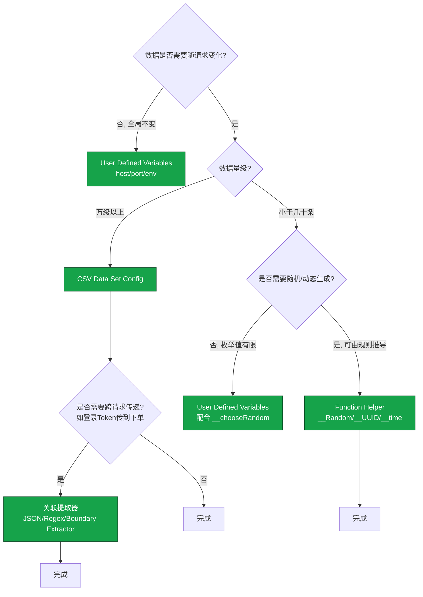
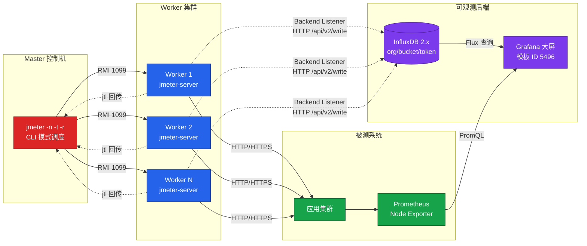

# JMeter 参数化与分布式压测

在《03-JMeter 5.6.3 核心概念与脚本构建》中我们已经梳理了组件体系、CLI 执行范式与 Master-Worker 的基础架构。本文继续向下展开，聚焦工程实践中决定压测结果可信度的两个支柱：**参数化策略**与**分布式压测**。前者保证进入被测系统的数据真实多样，后者保证能够施加足够规模的负载；同时本文会系统讲解插件体系与 Backend Listener + InfluxDB 2.x + Grafana 的实时监控链路，覆盖从单机调试到 K8s 集群压测的完整路径。

## 一、核心概念：参数化与分布式压测的定位

性能测试的可信度由两条独立链路决定：**数据真实性**与**压力规模**。

- **数据真实性**：如果 1000 个虚拟用户反复请求同一条商品、同一个用户 ID，被测系统会命中缓存、命中幂等校验、命中限购判断，导致测试结果与线上真实流量分布完全脱节。参数化的本质是用受控的数据集合驱动脚本，使每次请求的入参服从预设分布。
- **压力规模**：单机 JMeter 受 JVM 线程调度与网络栈约束，工程上建议单机线程数不超过 1000~2000。当目标 QPS 超过单机能力时，必须通过分布式架构横向扩展负载机，否则压测瓶颈会落在压测机而非被测系统。

参数化解决"压得真不真"，分布式解决"压得够不够"。两者与监控链路共同构成可观测、可复现的压测工程闭环：参数化驱动 Worker 发起真实请求 → Backend Listener 将指标推送到 InfluxDB 2.x → Grafana 实时渲染大屏 → 工程师根据曲线定位瓶颈。

## 二、参数化策略

### 2.1 为什么必须参数化

不参数化会引发两类典型问题：

- **缓存命中导致结果失真**：大促场景下 10 万用户访问不同商品，若压测脚本只用一个固定商品 ID 反复请求，几乎全部命中 Redis/本地缓存，接口响应时间被严重低估，得到"虚假的好成绩"。
- **业务约束导致大量报错**：限购、防重、Token 鉴权等场景下，同一用户 ID 重复下单会被业务侧拦截，错误率飙升但并非系统性能问题，干扰判断。

参数化的目标是让测试数据在分布上贴近线上真实流量：用户等级、商品热度、地区分布都应尽量复现。

### 2.2 三种参数化方式对比

JMeter 提供三种主流参数化手段，各自适用场景差异明显：

| 方式 | 数据来源 | 适用数据量 | 动态性 | 典型场景 |
|------|---------|-----------|--------|---------|
| CSV Data Set Config | 外部文件 | 大（万级以上） | 低（静态数据） | 用户账号、商品 ID 列表 |
| User Defined Variables | 测试计划内联 | 小（几十个） | 低 | 域名、端口、环境标识 |
| Function Helper | 函数动态生成 | 无限 | 高 | 随机数、UUID、时间戳、线程号 |

### 2.3 CSV Data Set Config

CSV Data Set Config 是参数化最常用的元件，将参数化数据放在外部文件中，按行读取并赋值给变量。其核心配置项如下：

```properties
# CSV Data Set Config 关键配置（jmx 中的字段含义）
Filename          = data/user.csv       # 相对路径基于 jmx 所在目录，避免迁移改路径
File encoding     = UTF-8                # 与文件实际编码一致
Variable Names    = username,password    # 列名，逗号分隔，后续用 ${username} 引用
Ignore first line = true                 # 文件首行是表头时设为 true
Delimiter         = ,                    # 分隔符，与文件保持一致
Allow quoted data = false                # 字段是否允许引号包裹
Recycle on EOF    = true                 # 读到文件末尾是否循环读取
Stop thread on EOF = false               # 读到末尾是否停止线程（Recycle=true 时无效）
Sharing mode      = All threads          # 共享模式：All threads / Current thread group / Current thread
```

参数文件示例 `user.csv`：

```csv
username,password
user001,Pass@2026
user002,Pass@2026
user003,Pass@2026
```

在 HTTP Request 中以 `${username}` 与 `${password}` 引用即可。**工程建议**：始终使用相对路径，便于在 Windows/Mac 调试后无缝迁移到 Linux 压测机；分布式压测时需将 CSV 文件分发到所有 Worker 的相同相对路径下。

`Sharing mode` 是容易被忽视的选项：`All threads` 让所有线程组共享同一份数据并按行轮转，是最常用的模式；`Current thread group` 适用于多个线程组各自持有独立数据集的场景；`Current thread` 则每个线程独占一份文件迭代，仅在需要严格数据隔离时使用。

### 2.4 User Defined Variables

User Defined Variables 用于配置脚本中不变的公共参数，例如环境信息：

```properties
# User Defined Variables 示例
HOST     = perf.example.com
PORT     = 443
PROTOCOL = https
ENV_TAG  = staging
```

配合 HTTP Request Defaults 使用，可以让脚本在不同环境间切换时只改一处。需要**注意**：User Defined Variables 在测试计划启动时初始化一次，运行过程中不会重新求值，因此不能用来存放需要随请求变化的值。

### 2.5 Function Helper 函数

JMeter 内置函数可以在请求发起时动态生成参数，常用函数包括：

| 函数 | 作用 | 示例 |
|------|------|------|
| `${__CSVRead(data/user.csv,0)}` | 读取 CSV 文件第 0 列，按行迭代 | 适合简单场景，功能弱于 CSV Data Set Config |
| `${__Random(1000,9999)}` | 生成指定范围内的随机整数 | 生成随机商品 ID |
| `${__RandomString(8,abcdef0123456789,myVar)}` | 生成随机字符串并存入变量 | 生成随机 traceId |
| `${__threadNum}` | 返回当前线程号（1 起） | 按线程分发不同用户 |
| `${__time(yyyyMMddHHmmss)}` | 返回当前时间戳 | 生成唯一订单号 |
| `${__UUID}` | 生成 UUID | 生成唯一请求 ID |
| `${__P(threadCount,100)}` | 读取命令行 `-J` 传入的属性 | CI 流水线参数化注入 |

函数方式的优势是无需外部文件、动态性强；劣势是无法保证数据唯一性与业务分布。实际工程中常与 CSV 配合：CSV 提供用户池，函数补充随机性字段。

### 2.6 参数化策略决策树

不同参数化需求应选择不同方式，下图给出决策路径：



### 2.7 关联：特殊的参数化

关联（Correlation）是参数化的一种特殊形态——上一个请求的响应作为下一个请求的入参。典型场景是登录接口返回 Token，后续业务接口携带该 Token 鉴权。JMeter 通过后置处理器实现关联：JSON Extractor（推荐，针对 JSON 响应）、Regular Expression Extractor（通用，正则匹配）、Boundary Extractor（性能最佳，左右边界匹配）。

关联与 CSV 的关键区别在于：CSV 数据是预先准备的静态池，关联数据是运行时动态产生。复杂业务流通常是"CSV 提供用户名密码 → 登录接口 → 关联提取 Token → 业务接口携带 Token"的混合模式。

## 三、插件体系

### 3.1 JMeter Plugins Manager

JMeter 原生功能在图表可视化、吞吐量整形、服务器资源监控等方面能力有限，插件生态是重要补充。安装插件的标准入口是 **JMeter Plugins Manager**：

1. 从 `https://jmeter-plugins.org/` 下载 `JMeterPlugins-manager-x.x.x.jar`；
2. 将 jar 放入 `$JMETER_HOME/lib/ext/` 目录；
3. 重启 JMeter，通过菜单 `Options → Plugins Manager` 打开管理界面。

Plugins Manager 提供 `Installed Plugins`、`Available Plugins`、`Upgrades` 三个标签页，支持在线搜索、勾选、一键安装并重启。离线环境可手动下载插件 jar 放入 `lib/ext/`，效果等同。

### 3.2 常用插件

| 插件 | 功能 | 推荐度 |
|------|------|--------|
| 3 Basic Graphs | TPS、响应时间趋势、响应时间分布 | 必装 |
| Custom Thread Groups | 阶梯加压、波浪式加压线程组 | 必装 |
| Throughput Shaping Timer | 精确控制 RPS（每秒请求数） | 必装 |
| PerfMon Plugin | 采集服务器 CPU/内存/磁盘/网络 | 推荐 |
| Parallel Requests Sampler | 单线程内并行发起多个请求 | 可选 |
| Synthesis Report | 综合报告，比 Aggregate Report 更详细 | 可选 |

**Throughput Shaping Timer** 是容量评估场景的利器，可以精确指定"前 60s 维持 100 RPS，后 60s 爬升到 500 RPS"，弥补闭环 Thread Group 吞吐量随响应时间波动的缺陷。注意它与 Open Model Thread Group（第三方插件）的差异：前者通过延迟控制在闭环节点逼近目标 RPS，后者是按到达率调度的开环线程组。

### 3.3 PerfMon 服务器资源监控

PerfMon 插件由服务端 `ServerAgent` 与 JMeter 端 `PerfMon Metrics Collector` 监听器组成。`ServerAgent` 部署在被测服务器上，默认监听 4444 端口，JMeter 通过 TCP 拉取 CPU、内存、磁盘 IO、网络吞吐等指标。

```bash
# 在被测服务器（CentOS Stream 9）启动 ServerAgent
cd /opt/ServerAgent
./startAgent.sh  # 默认监听 4444，可加参数 --interval 1 调整采集频率
```

PerfMon 的优点是部署简单、与 JMeter 脚本同源；缺点是采集精度与扩展性弱于 Prometheus + Node Exporter。对长周期或大规模压测，建议优先使用独立的监控系统（如《09-后端性能监控》中的 Prometheus + Grafana 方案），PerfMon 仅作为小规模快速验证的补充。

### 3.4 自定义插件

当内置元件与第三方插件都无法满足需求时，JMeter 提供两类扩展点：

- **自定义函数**：实现 `org.apache.jmeter.functions.AbstractFunction`，且类所在包名需包含 `.functions.`（由 `classfinder.functions.contain` 扫描规则决定），可在 `${__myFunc(arg)}` 中调用，适合封装签名生成、加密、数据脱敏等工具函数；
- **自定义 Sampler/Listener**：继承 `AbstractSampler` 或 `AbstractBackendListenerClient`，适合对接私有协议或自研监控后端。

自定义插件打包为 jar 放入 `lib/ext/`，JMeter 启动时通过 SPI 机制加载。开发时建议基于 JMeter 5.6.3 的 API（`ApacheJMeter_core`、`ApacheJMeter_components`）编译，避免与运行时版本不匹配导致 `ClassNotFoundException`。

## 四、分布式压测

### 4.1 Master-Worker 架构回顾

JMeter 分布式压测基于 RMI 通信：Master 节点通过 `jmeter.properties` 中的 `remote_hosts` 列表向 Worker 发起 RMI 调用，Worker 节点运行 `jmeter-server` 监听 1099 端口接收指令并回传 jtl 结果。架构细节与配置要点已在《03-JMeter 5.6.3 核心概念与脚本构建》中说明，此处聚焦容器化与编排层面的部署实践。

### 4.2 物理机部署（CentOS Stream 9 + JDK 17）

旧文档基于 CentOS 7.0 + JDK 1.8，当前生产环境应升级到 **CentOS Stream 9 + JDK 17+**：

```bash
# CentOS Stream 9 安装 JDK 17 与 JMeter 5.6.3
dnf install -y java-17-openjdk-devel wget unzip
wget https://archive.apache.org/dist/jmeter/binaries/apache-jmeter-5.6.3.zip
unzip apache-jmeter-5.6.3.zip -d /opt/
ln -s /opt/apache-jmeter-5.6.3 /opt/jmeter

# 配置环境变量
echo 'export JMETER_HOME=/opt/jmeter' >> /etc/profile.d/jmeter.sh
echo 'export PATH=$JMETER_HOME/bin:$PATH' >> /etc/profile.d/jmeter.sh
source /etc/profile.d/jmeter.sh

# Worker 节点启动 jmeter-server（绑定本机 IP，避免 RMI 解析到 127.0.0.1）
cd /opt/jmeter/bin
./jmeter-server -Djava.rmi.server.hostname=10.0.0.11

# Master 节点发起分布式压测
jmeter -n -t test.jmx -l result.jtl -r -e -o ./report
```

JDK 17 相比 JDK 8 在 G1GC、ZGC、JIT 上有显著提升，4G 堆内存下压测机 GC 停顿从百毫秒级降至十毫秒级，对压测结果稳定性至关重要。注意 JDK 17 默认强封装模块系统，部分旧插件若依赖反射访问 JDK 内部 API（如 `sun.misc.*`）需要在 `jmeter.bat`/`jmeter.sh` 中追加 `--add-opens` 参数。

### 4.3 Docker 部署

容器化部署可以解决 Worker 环境一致性问题。下面给出 `docker-compose.yml` 示例，编排 1 个 Master、3 个 Worker、1 个 InfluxDB 2.x、1 个 Grafana：

```yaml
# docker-compose.yml: JMeter 分布式压测 + 监控一体化栈
version: "3.9"
services:
  master:
    image: alpine/jmeter:5.6.3
    container_name: jmeter-master
    hostname: master
    networks: [jmeter-net]
    volumes:
      - ./scripts:/scripts          # 挂载 jmx 脚本与 CSV 参数文件
      - ./results:/results          # 挂载结果输出目录
      - ./config/master.properties:/jmeter/bin/user.properties
    command: -n -t /scripts/test.jmx -l /results/result.jtl -r -e -o /results/report
    depends_on: [worker1, worker2, worker3, influxdb]

  worker1:
    image: alpine/jmeter:5.6.3
    container_name: jmeter-worker-1
    hostname: worker1
    networks: [jmeter-net]
    volumes:
      - ./scripts:/scripts          # CSV 文件必须与 Master 路径一致
    command: -s                      # -s 启动 jmeter-server 模式

  worker2:
    image: alpine/jmeter:5.6.3
    container_name: jmeter-worker-2
    hostname: worker2
    networks: [jmeter-net]
    volumes: ["./scripts:/scripts"]
    command: -s

  worker3:
    image: alpine/jmeter:5.6.3
    container_name: jmeter-worker-3
    hostname: worker3
    networks: [jmeter-net]
    volumes: ["./scripts:/scripts"]
    command: -s

  influxdb:
    image: influxdb:2.7              # InfluxDB 2.x，旧版 1.x 不再推荐
    container_name: influxdb
    ports: ["8086:8086"]
    networks: [jmeter-net]
    environment:
      DOCKER_INFLUXDB_INIT_MODE: setup
      DOCKER_INFLUXDB_INIT_USERNAME: admin
      DOCKER_INFLUXDB_INIT_PASSWORD: Influx@2026
      DOCKER_INFLUXDB_INIT_ORG: jmeter
      DOCKER_INFLUXDB_INIT_BUCKET: jmeter
      DOCKER_INFLUXDB_INIT_ADMIN_TOKEN: jmeter-token-very-long-string
    volumes: ["influxdb-data:/var/lib/influxdb2"]

  grafana:
    image: grafana/grafana:11.0.0
    container_name: grafana
    ports: ["3000:3000"]
    networks: [jmeter-net]
    environment:
      GF_SECURITY_ADMIN_PASSWORD: admin
    depends_on: [influxdb]

networks:
  jmeter-net:
    driver: bridge
volumes:
  influxdb-data:
```

Master 的 `user.properties` 需要配置 Worker 列表：

```properties
# config/master.properties
remote_hosts=worker1:1099,worker2:1099,worker3:1099
server.rmi.localport=1099
server.rmi.ssl.disable=true           # 容器内通信可关闭 SSL，跨网络必须开启
```

启动：`docker compose up -d`，Master 会自动向 3 个 Worker 发起压测并将结果汇总到 `/results`。

### 4.4 K8s 部署

更大规模或需要弹性扩缩容的场景应使用 K8s 编排。典型方案是 Worker 用 `StatefulSet`（保证稳定 hostname 便于 Master 配置 `remote_hosts`），Master 用 `Job` 执行一次性压测任务：

```yaml
# k8s/jmeter-worker-statefulset.yaml
apiVersion: apps/v1
kind: StatefulSet
metadata:
  name: jmeter-worker
spec:
  serviceName: jmeter-worker
  replicas: 5                         # 5 个 Worker
  selector:
    matchLabels: {app: jmeter-worker}
  template:
    metadata:
      labels: {app: jmeter-worker}
    spec:
      containers:
      - name: jmeter
        image: alpine/jmeter:5.6.3
        command: ["jmeter", "-s"]
        ports: [{containerPort: 1099}]
        volumeMounts:
        - name: scripts
          mountPath: /scripts
      volumes:
      - name: scripts
        configMap:
          name: jmeter-scripts         # jmx 与 CSV 通过 ConfigMap 分发
---
apiVersion: v1
kind: Service
metadata:
  name: jmeter-worker
spec:
  clusterIP: None                      # Headless Service，便于 StatefulSet DNS 解析
  selector: {app: jmeter-worker}
  ports: [{port: 1099, name: rmi}]
```

Worker 启动后，通过 `jmeter-worker-0.jmeter-worker.default.svc.cluster.local` 这样的 DNS 名称解析各节点。Master 的 `remote_hosts` 写入完整 FQDN 即可。需要注意 K8s 中 RMI 数据回传端口问题：建议固定 `server.rmi.localport=1099`，或在 Pod 中开放端口段并在 Master 侧配置 `client.rmi.localport=7000`（自该端口起依次分配 RMI 端口）。

CI/CD 场景下，可使用 Argo Workflows 或 Tekton 编排：`部署 Worker → 等待就绪 → 触发 Master Job → 收集 jtl 与 HTML 报告 → 销毁 Worker`，实现按需压测集群。

## 五、监控集成

### 5.1 InfluxDB 2.x 升级要点

旧文档使用 InfluxDB 1.x，通过 `http://host:8086/write?db=jmeter` 写入，鉴权靠用户名密码。**InfluxDB 2.x 完全废弃了该模型**，改为 `org/bucket/token` 三要素：

| 维度 | InfluxDB 1.x | InfluxDB 2.x |
|------|--------------|--------------|
| 写入 URL | `host:8086/write?db=jmeter` | `host:8086/api/v2/write?org=jmeter&bucket=jmeter` |
| 鉴权 | 用户名/密码 | Token（Authorization Header） |
| 数据组织 | database + retention policy | bucket（含 retention） |
| 查询语言 | InfluxQL（类 SQL） | Flux |
| JMeter 适配 | `InfluxdbBackendListenerClient` 旧版 | `InfluxdbBackendListenerClient` 5.6.3（已支持 2.x） |

JMeter 5.6.3 的 Backend Listener 已原生支持 InfluxDB 2.x，无需切换 sender 类，只需正确填写 token/org/bucket。

### 5.2 Backend Listener 配置

在测试计划中添加 `Backend Listener`，实现类选择 `org.apache.jmeter.visualizers.backend.influxdb.InfluxdbBackendListenerClient`，关键参数：

```properties
# Backend Listener - InfluxDB 2.x 配置（jmx 中的 Arguments）
influxdbMetricsSender  = org.apache.jmeter.visualizers.backend.influxdb.HttpMetricsSender
influxdbUrl            = http://influxdb:8086
influxdbToken          = jmeter-token-very-long-string    # 2.x 鉴权 token，1.x 此处留空
influxdbOrg            = jmeter                            # 2.x 组织名，1.x 此处留空
influxdbBucket         = jmeter                            # 2.x bucket，1.x 写入 db 名
measurement            = jmeter                            # measurement 名称
application            = order-api                         # 区分不同接口/业务
samplersRegex          = .*                                # 采样器过滤正则
percentiles            = 90;95;99                          # 上报分位数
```

关键变更：`influxdbUrl` 不再带 `/write?db=` 后缀，只需填到根路径；`influxdbToken` 必须是 InfluxDB 2.x 初始化时生成或后续创建的 **all-access token** 或对 `jmeter` bucket 有写权限的 token；`application` 字段用于在 Grafana 中区分不同接口，混合场景下应为每个接口单独配置一个 Backend Listener 并设置不同 `application`。

### 5.3 Grafana 大屏

Grafana 数据源配置：选择 InfluxDB，URL 指向 `http://influxdb:8086`，鉴权方式选 `Token`，填入与 Backend Listener 相同的 token；查询语言选 `Flux`（2.x 推荐）或 `InfluxQL`（兼容模式）。

JMeter 社区最常用的 Grafana Dashboard 模板 ID 为 **5496**（Apache JMeter Dashboard using Core InfluxdbBackendListenerClient，基于 InfluxQL）；如需 Flux 查询的模板，可在 Grafana Dashboards 站点检索 "JMeter InfluxDB 2" 或基于 5496 自行迁移查询语句。导入方式：`Dashboards → New → Import → 输入 ID → Load → 选择数据源`。模板内置 RPS、响应时间分位、错误率、活跃线程数等核心面板。

混合场景下区分接口的关键 Flux 查询示例：

```flux
from(bucket: "jmeter")
  |> range(start: v.timeRangeStart, stop: v.timeRangeStop)
  |> filter(fn: (r) => r._measurement == "jmeter" and r.application == "order-api")
  |> filter(fn: (r) => r._field == "rt")
  |> aggregateWindow(every: v.windowPeriod, fn: mean)
```

通过修改 `r.application` 过滤条件即可在同一 Dashboard 中切换不同接口视图。

### 5.4 监控架构总览

完整的分布式压测 + 监控链路如下图，覆盖从负载生成到可视化展示的全链路：



图中存在两条指标链路：**JMeter 指标**（RPS、响应时间、错误率）从 Worker 经 Backend Listener 写入 InfluxDB 2.x；**系统指标**（CPU、内存、GC）从被测系统经 Prometheus 采集。两条链路在 Grafana 大屏上对齐时间轴，是定位"是应用慢还是资源瓶颈"的关键依据。大规模压测时建议优先走 Backend Listener 直写 InfluxDB，避免 RMI jtl 回传成为 Master 的瓶颈。

## 六、常见陷阱与最佳实践

### 6.1 参数化陷阱

- **CSV 数据量不足导致循环**：1000 线程跑 10 万次请求，但 CSV 只有 1000 行，`Recycle on EOF=true` 会让数据被复用 100 次，削弱参数化效果。建议数据量至少与单 Worker 总请求量持平。
- **CSV 文件未同步到 Worker**：分布式压测时只在 Master 放了 CSV，Worker 找不到文件直接报错或使用空数据。必须通过 Docker volume 或 K8s ConfigMap 分发到所有 Worker 的相同相对路径。
- **共享模式错配**：多线程组场景下误用 `Current thread` 模式，导致每个线程从第 1 行开始读取，所有线程拿到相同数据。多线程组应使用 `All threads` 或 `Current thread group`。
- **将动态数据放入 User Defined Variables**：UDV 启动时初始化一次，`${__Random()}` 写在 UDV 里只会生成一次随机值，后续所有请求使用同一个值。动态值必须放在请求参数中或用 JSR223 前置处理器生成。

### 6.2 分布式压测陷阱

- **RMI 端口未固定**：默认 RMI 数据端口随机分配，防火墙难以放行。生产环境必须设置 `server.rmi.localport=1099` 并打通 Master↔Worker 的双向端口。
- **时钟未同步**：Worker 与 Master 时钟偏差超过 1s 会导致 HTML 报告时序错乱、Backend Listener 指标时间戳漂移。所有节点必须开启 chronyd 或 NTP。
- **Worker 与 SUT 跨机房**：跨机房压测时 Worker→SUT 的网络延迟会污染响应时间指标。Worker 与 SUT 应位于同一可用区，跨地域压测需在网络层独立测量并扣除 RTT。
- **Master 单点回传瓶颈**：超 20 个 Worker 时，jtl 经 RMI 回传 Master 会成为瓶颈。建议大规模场景直接走 Backend Listener，Master 仅负责调度与生成 HTML 报告。

### 6.3 监控链路陷阱

- **InfluxDB 2.x 仍用 1.x 配置**：最常见的升级失误——`influxdbUrl` 仍带 `/write?db=jmeter`、token 留空，导致写入 401/404。必须切换为 `org/bucket/token` 模式。
- **Backend Listener 与 HTML 报告冲突**：同时启用大量图形化监听器与 Backend Listener 会加重 Worker 负担。分布式压测时 Worker 端应仅保留 Backend Listener，禁用所有其他监听器。
- **Grafana 数据源选错查询语言**：InfluxDB 2.x 数据源若选 InfluxQL 模式，部分模板变量语法不兼容，建议优先使用 Flux 模板。
- **PerfMon 与 Prometheus 数据并存**：PerfMon 数据进 jtl，Prometheus 数据独立存储，两者时间戳基准可能不一致。建议统一以 Prometheus 作为系统指标源，PerfMon 仅用于快速验证。

### 6.4 工程化最佳实践

- **脚本与数据入 Git**：`.jmx`、CSV 参数文件、`user.properties` 全部纳入版本管理，CI 流水线触发压测；
- **环境隔离**：通过 `${__P(env,staging)}` 在命令行注入环境标识，同一份脚本跑通 dev/staging/prod；
- **Worker 镜像固化**：基于 `alpine/jmeter:5.6.3` 构建团队自定义镜像，预装 Plugins Manager 与常用插件，避免每次启动在线下载；
- **压测前预跑**：先以 10% 目标负载跑 2 分钟，验证脚本、数据、监控链路全通后再发起全量压测，避免无效长跑；
- **结果归档**：HTML 报告与 InfluxDB 数据保留至少 3 个版本，便于性能回归对比。

## 七、总结

参数化与分布式压测是 JMeter 工程化能力的两条主线：参数化决定数据真实性，分布式决定压力规模，插件体系扩展工具边界，Backend Listener + InfluxDB 2.x + Grafana 构建可观测闭环。本文相对旧文档的核心升级在于：InfluxDB 1.x → 2.x 的鉴权与查询语言迁移、CentOS 7.0 → Stream 9 与 JDK 1.8 → 17 的环境升级、以及 Docker/K8s 容器化部署的完整实践。掌握这些内容后，建议结合《09-后端性能监控（Prometheus 与 Grafana 与 SkyWalking 10）》进一步把 JMeter 指标链路接入全栈可观测体系，让性能测试从工具操作演进为平台能力。
