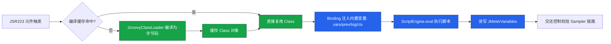
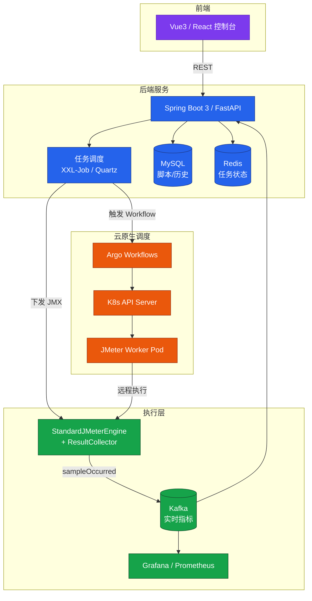

# JMeter 二次开发与 API 平台

JMeter 的开箱即用能力能够覆盖大部分通用协议压测场景，但当团队面对私有协议、复杂签名算法、企业级压测平台建设等需求时，仅靠 GUI 拖拽与原生组件已显不足。本文基于 **JMeter 5.6.3 + JDK 17 + Maven 3.9**，系统讲解 JSR223 + Groovy 脚本开发、自定义组件、JMeter Engine API 编程化压测，以及面向云原生的现代测试平台架构设计，帮助读者将 JMeter 从"工具"沉淀为"平台能力"。

## 一、为什么需要 JMeter 二次开发

JMeter 二次开发并非"为了开发而开发"，它解决的是工程化场景下的三类典型问题：

- **协议扩展**：JMeter 原生不支持 RPC 框架（如 Dubbo、gRPC-Web 私有变体）、物联网 MQTT 自定义 payload、二进制协议等，需要通过 Java Sampler 或自定义 Sampler 实现；
- **脚本可维护性**：BeanShell 解释执行性能差，复杂逻辑会让压测客户端先于被测系统达到瓶颈；JSR223 + Groovy 通过编译缓存将脚本执行性能提升 10-100 倍；
- **平台化能力沉淀**：把 JMeter 的执行能力封装为服务，结合任务调度、实时监控、K8s 弹性伸缩，构建团队共享的压测平台，避免脚本通过即时通讯工具传来传去。

从工程实践看，是否需要二次开发可以从三个维度判断：第一，**协议是否原生支持**——若 JMeter 自带 Sampler 无法覆盖，必须走 Java Sampler 路线；第二，**脚本复杂度**——若同一逻辑在多个脚本中重复出现且维护成本高，应抽象为函数助手或后置处理器；第三，**团队规模与压测频次**——单人偶尔压测无需平台化，多人协作、高频回归、需要历史报告对比时，平台化收益显著。

JMeter 二次开发的入口主要有三个层次：脚本层（JSR223）、组件层（Java Sampler / Function / PostProcessor）、引擎层（Engine API）。三者由浅入深，可根据需求复杂度选择合适层次。脚本层成本最低，适合逻辑动态化；组件层适合复用与可视化配置；引擎层则面向平台化集成，是把 JMeter 嵌入业务系统的唯一正道。

## 二、JSR223 + Groovy 脚本开发

### 2.1 BeanShell 为何退出舞台

BeanShell 是一个轻量级 Java 源码解释器，JMeter 早期版本中是编写动态逻辑的唯一选择。它的核心缺陷在于**每次执行都重新解释源码**，无法利用 JIT 优化，高并发下 CPU 占用极高。JMeter 官方自 5.x 起在所有文档中明确推荐使用 JSR223 + Groovy 替代 BeanShell，6.0 计划彻底移除 BeanShell 元件。

Groovy 通过 `GroovyClassLoader` 将脚本编译为 JVM 字节码，并缓存 `Class` 对象，第二次执行时直接走编译产物，性能接近原生 Java。官方基准测试显示，循环执行 100 万次简单逻辑，BeanShell 耗时约 12 秒，Groovy 启用缓存后仅需 0.15 秒。

### 2.2 JSR223 元件与缓存机制

JSR223 是 Java Scripting API（`javax.script`）的标准，JMeter 通过它接入 Groovy、JavaScript（Nashorn/GraalJS）、JEXL 等多种脚本引擎。使用 JSR223 时必须勾选 **Cache compiled script** 选项，否则每次执行都会重新编译，性能与 BeanShell 相当。对于循环次数极多的压测脚本，这一选项的开关差异可达数十倍，是 JSR223 元件配置中最重要的一个勾选项。

JSR223 元件覆盖了 JMeter 中所有需要写脚本的位置：PreProcessor、PostProcessor、Sampler、Assertion、Listener、Timer。建议统一使用 Groovy 作为脚本语言，并在文件开头通过 `language` 字段或脚本第一行 `// language=groovy` 显式声明。

### 2.3 内置变量速查

JSR223 脚本中可直接访问 JMeter 注入的内置变量，熟练掌握这些变量是高效编写脚本的前提。

| 变量 | 类型 | 说明 |
|------|------|------|
| `ctx` | `JMeterContext` | 当前线程上下文，可获取变量、采样结果、线程信息 |
| `vars` | `JMeterVariables` | 用户变量读写，`vars.put("k","v")` / `vars.get("k")` |
| `props` | `JMeterProperties` | JMeter 全局属性，跨线程共享 |
| `prev` | `SampleResult` | 上一次采样结果，含响应码、响应数据、耗时 |
| `log` | `Logger` | SLF4J 日志，`log.info()` / `log.error()` |
| `Label` | `String` | 当前 Sampler 名称 |
| `sampler` | `Sampler` | 当前 Sampler 对象 |
| `OUT` | `PrintStream` | 标准输出，`OUT.println("x")` |

### 2.4 Groovy 脚本示例：动态签名

以下示例演示在 JSR223 PreProcessor 中使用 Groovy 生成 HMAC-SHA256 签名，并将签名写入变量供后续 HTTP Sampler 使用。

```groovy
// JSR223 PreProcessor - 生成 HMAC-SHA256 签名
// 注意：勾选 Cache compiled script 以启用编译缓存

import javax.crypto.Mac
import javax.crypto.spec.SecretKeySpec
import java.nio.charset.StandardCharsets

// 从用户变量中读取 appId 与 secret
def appId  = vars.get('appId')
def secret = vars.get('secret')
def ts     = System.currentTimeMillis().toString()
def nonce  = UUID.randomUUID().toString().replace('-', '')

// 拼接待签名串
def payload = "${appId}|${ts}|${nonce}"

// 计算 HMAC-SHA256
def mac = Mac.getInstance('HmacSHA256')
mac.init(new SecretKeySpec(secret.getBytes(StandardCharsets.UTF_8), 'HmacSHA256'))
def sign = mac.doFinal(payload.getBytes(StandardCharsets.UTF_8)).encodeHex() as String

// 写回变量供 HTTP Sampler 使用
vars.put('ts',    ts)
vars.put('nonce', nonce)
vars.put('sign',  sign)

log.debug("签名生成完成: appId=${appId}, ts=${ts}")
```



## 三、自定义组件开发

当 JSR223 脚本无法满足需求（如需要可视化参数配置界面、复用复杂逻辑、对接私有协议 SDK）时，应通过开发 JAR 插件的方式扩展组件。所有自定义组件都以 JAR 形式部署到 `$JMETER_HOME/lib/ext/`，重启 JMeter 后即可被加载。

### 3.1 Maven 依赖

```xml
<!-- pom.xml：JMeter 5.6.3 二次开发依赖 -->
<project>
    <modelVersion>4.0.0</modelVersion>
    <groupId>com.example</groupId>
    <artifactId>jmeter-plugins</artifactId>
    <version>1.0.0</version>
    <packaging>jar</packaging>

    <properties>
        <jmeter.version>5.6.3</jmeter.version>
        <maven.compiler.source>17</maven.compiler.source>
        <maven.compiler.target>17</maven.compiler.target>
    </properties>

    <dependencies>
        <!-- 核心 API：TestElement、SampleResult 等 -->
        <dependency>
            <groupId>org.apache.jmeter</groupId>
            <artifactId>ApacheJMeter_core</artifactId>
            <version>${jmeter.version}</version>
            <scope>provided</scope>
        </dependency>
        <!-- Java Sampler 抽象类 -->
        <dependency>
            <groupId>org.apache.jmeter</groupId>
            <artifactId>ApacheJMeter_java</artifactId>
            <version>${jmeter.version}</version>
            <scope>provided</scope>
        </dependency>
        <!-- 函数助手开发依赖 -->
        <dependency>
            <groupId>org.apache.jmeter</groupId>
            <artifactId>ApacheJMeter_functions</artifactId>
            <version>${jmeter.version}</version>
            <scope>provided</scope>
        </dependency>
    </dependencies>
</project>
```

`scope` 设为 `provided` 可避免将 JMeter 自身类库打进 JAR 导致类冲突。打包后仅需将业务 JAR 与第三方依赖放入 `lib/ext`，JMeter 启动时会自动加入 classpath。

### 3.2 自定义 Java Sampler

Java Sampler 用于在 JMeter 中执行任意 Java 代码逻辑，常见于私有协议压测。实现方式有两种：继承 `AbstractJavaSamplerClient` 抽象类（推荐，仅需重写需要的方法）或实现 `JavaSamplerClient` 接口。以下示例实现一个简化版的 gRPC 调用 Sampler。

```java
package com.example.sampler;

import org.apache.jmeter.config.Arguments;
import org.apache.jmeter.protocol.java.sampler.AbstractJavaSamplerClient;
import org.apache.jmeter.protocol.java.sampler.JavaSamplerContext;
import org.apache.jmeter.samplers.SampleResult;

/**
 * 自定义 Java Sampler：调用 gRPC 接口
 * 4 个核心方法对应生命周期：参数声明 → 初始化 → 循环执行 → 收尾
 */
public class GrpcSampler extends AbstractJavaSamplerClient {

    private GrpcClient client;  // 假设的 gRPC 客户端封装

    /** GUI 中显示的默认参数 */
    @Override
    public Arguments getDefaultParameters() {
        Arguments args = new Arguments();
        args.addArgument("host", "127.0.0.1");
        args.addArgument("port", "9090");
        args.addArgument("method", "/helloworld.Greeter/SayHello");
        args.addArgument("payload", "{\"name\":\"perf-test\"}");
        return args;
    }

    /** 每个线程启动前执行一次，建立长连接 */
    @Override
    public void setupTest(JavaSamplerContext ctx) {
        String host = ctx.getParameter("host");
        int    port = Integer.parseInt(ctx.getParameter("port"));
        client = new GrpcClient(host, port);  // 复用 Channel，避免每次握手
    }

    /** 每次循环调用的核心方法 */
    @Override
    public SampleResult runTest(JavaSamplerContext ctx) {
        SampleResult result = new SampleResult();
        result.setSampleLabel(ctx.getParameter("method"));
        result.sampleStart();  // 计时开始
        try {
            String resp = client.call(ctx.getParameter("method"),
                                      ctx.getParameter("payload"));
            result.setResponseData(resp, "UTF-8");
            result.setResponseCodeOK();
            result.setSuccessful(true);
        } catch (Exception e) {
            result.setSuccessful(false);
            result.setResponseCode("500");
            result.setResponseMessage(e.getMessage());
        } finally {
            result.sampleEnd();  // 计时结束
        }
        return result;
    }

    /** 线程结束时关闭连接 */
    @Override
    public void teardownTest(JavaSamplerContext ctx) {
        if (client != null) client.close();
    }
}
```

注意 `sampleStart()` 与 `sampleEnd()` 必须成对出现，JMeter 据此计算响应时间；`setSuccessful()` 必须显式设置，否则会被记为失败。

### 3.3 自定义函数助手

函数助手用于在脚本中通过 `${__funcName(arg)}` 调用，常用于生成测试数据（手机号、身份证号、UUID 等）。开发时需特别注意：**类所在包名必须以 `functions` 结尾**，否则 JMeter 的函数扫描器无法识别。

```java
package com.example.functions;  // 包名必须以 functions 结尾

import org.apache.jmeter.engine.util.CompoundVariable;
import org.apache.jmeter.functions.AbstractFunction;
import org.apache.jmeter.functions.InvalidVariableException;
import org.apache.jmeter.samplers.SampleResult;
import org.apache.jmeter.samplers.Sampler;

import java.util.Collection;
import java.util.LinkedList;
import java.util.List;

/** 自定义函数：${__PhoneNo()} 随机生成 11 位手机号 */
public class PhoneNoFunction extends AbstractFunction {

    private static final String KEY = "__PhoneNo";
    private static final List<String> DESC = new LinkedList<>();
    static {
        DESC.add("前缀（可选），如 138");
    }

    @Override
    public String execute(SampleResult prev, Sampler sampler) {
        String prefix = "1" + (3 + (int)(Math.random() * 6));  // 第二位 3~8，即 13~18 号段
        StringBuilder sb = new StringBuilder(prefix);
        for (int i = 0; i < 9; i++) sb.append((int)(Math.random() * 10));
        return sb.toString();
    }

    @Override
    public void setParameters(Collection<CompoundVariable> args) throws InvalidVariableException {
        // 入参校验，本例无强制参数
    }

    @Override
    public String getReferenceKey() { return KEY; }

    @Override
    public List<String> getArgumentDesc() { return DESC; }
}
```

### 3.4 自定义后置处理器

后置处理器用于在响应后做提取或加工。实现 `PostProcessor` 接口（通常继承 `AbstractTestElement` 以获得属性与线程上下文支持）并实现 `process()` 方法即可。以下示例从 XML 响应中提取指定 XPath 节点（兼容 JMeter 自带 XPath Extractor 不支持的命名空间场景）。

```java
package com.example.postprocessor;

import org.apache.jmeter.processor.PostProcessor;
import org.apache.jmeter.samplers.SampleResult;
import org.apache.jmeter.testelement.AbstractTestElement;
import org.apache.jmeter.threads.JMeterContext;

import javax.xml.xpath.XPath;
import javax.xml.xpath.XPathFactory;

public class NamespaceAwareXPathExtractor extends AbstractTestElement implements PostProcessor {

    private static final org.slf4j.Logger log =
            org.slf4j.LoggerFactory.getLogger(NamespaceAwareXPathExtractor.class);

    @Override
    public void process() {
        JMeterContext ctx = getThreadContext();
        SampleResult prev = ctx.getPreviousResult();
        if (prev == null) return;

        String xpathExpr = getPropertyAsString("xpath");
        String varName   = getPropertyAsString("varName");
        try {
            XPath xpath = XPathFactory.newInstance().newXPath();
            // 省略：解析响应字节流为 DOM，设置命名空间感知
            String value = xpath.evaluate(xpathExpr, /* doc */ null);
            ctx.getVariables().put(varName, value);
        } catch (Exception e) {
            log.warn("XPath 提取失败: {}", e.getMessage());
        }
    }
}
```

## 四、基于 JMeter Engine API 开发压测平台

JMeter 不仅是一款 GUI 工具，其底层 `StandardJMeterEngine` 本身就是一组纯 Java API，可以被任意 Java 应用嵌入调用。基于 Engine API 构建压测平台的核心流程包含：环境初始化 → 脚本加载 → 测试执行 → 结果采集。

### 4.1 环境初始化

```java
import org.apache.jmeter.util.JMeterUtils;

// 1. 加载 JMeter 主配置文件（jmeter.properties）
JMeterUtils.loadJMeterProperties("/opt/jmeter/bin/jmeter.properties");
// 2. 设置 JMeter 安装目录，加载 saveservice.properties 等
JMeterUtils.setJMeterHome("/opt/jmeter");
// 3. 初始化语言环境与日志
JMeterUtils.initLocale();
JMeterUtils.initLogging();
```

### 4.2 动态加载 JMX 与脚本构建

平台场景下推荐"用户在前端拖拽生成 JMX → 平台加载执行"的方式，避免在 Java 代码中手工拼装 HashTree。

```java
import org.apache.jmeter.save.SaveService;
import org.apache.jorphan.collections.HashTree;
import java.io.FileInputStream;

// 加载本地 JMX 文件为 HashTree
try (FileInputStream fis = new FileInputStream("/data/scripts/test.jmx")) {
    HashTree tree = SaveService.loadTree(fis);
    // 后续交给 Engine 执行
    runEngine(tree);
} catch (Exception e) {
    log.error("脚本加载失败", e);
}
```

若需要程序化构建测试计划，可使用 `TestPlan`、`ThreadGroup`、`HTTPSamplerProxy`、`LoopController`、`ResultCollector` 等类拼装 HashTree，再通过 `SaveService.saveTree()` 序列化为 JMX 文件。该方式适合"零代码生成压测脚本"的平台功能。

### 4.3 结果监听

压测平台的关键能力是**实时**采集指标而非等测试结束才出报告。继承 `ResultCollector` 重写 `sampleOccurred` 方法，每产生一个 SampleEvent 都会回调一次，即可拿到 RT、状态码、吞吐等实时数据。

```java
import org.apache.jmeter.reporters.ResultCollector;
import org.apache.jmeter.samplers.SampleEvent;
import org.apache.jmeter.samplers.SampleResult;

/** 自定义结果收集器：将实时指标推送到 Kafka */
public class KafkaResultCollector extends ResultCollector {

    @Override
    public void sampleOccurred(SampleEvent event) {
        super.sampleOccurred(event);  // 保留默认行为（写 jtl 等）
        SampleResult res = event.getResult();
        // 组装监控数据点
        MetricPoint point = MetricPoint.builder()
            .timestamp(System.currentTimeMillis())
            .label(res.getSampleLabel())
            .rt(res.getTime())
            .success(res.isSuccessful())
            .bytes(res.getBytesAsLong())
            .build();
        // 异步发送到 Kafka，后端聚合计算 QPS/RT/P99
        KafkaProducerHolder.send("jmeter-metrics", point.toJson());
    }
}
```

需要将自定义 Collector 添加到 HashTree 顶层才会被回调：`tree.add(tree.getArray()[0], new KafkaResultCollector())`。

### 4.4 引擎执行

```java
import org.apache.jmeter.engine.StandardJMeterEngine;

StandardJMeterEngine engine = new StandardJMeterEngine();
engine.configure(tree);   // 注入 HashTree
engine.run();             // 阻塞执行，直到测试计划结束
```

`run()` 是阻塞调用，平台中应放入独立线程池异步执行，并通过 `engine.stopTest(true)` 提供中止能力。`StandardJMeterEngine` 本身是线程安全的单次使用对象，每次压测任务需新建实例。



## 五、现代测试平台架构设计

### 5.1 整体分层

现代压测平台普遍采用"前后端分离 + 任务调度 + 弹性执行层 + 实时监控"的四层架构（见上图）。相比旧文档中"Java 后端 + Vue 前端 + JMeter Engine 单机调用"的简单形态，当前主流架构在执行层引入了 K8s 弹性调度，在监控层引入了时序数据库与流计算，使平台具备多租户、高并发、长时压测的能力。技术选型上：

- **前端**：Vue3 + TypeScript + ECharts，或 React + AntV，提供脚本编辑（Monaco Editor）、压测配置、实时大盘；
- **后端**：Spring Boot 3（JDK 17，Jakarta EE 9+）或 Python FastAPI，对外提供 REST/gRPC 接口；
- **任务调度**：XXL-Job、Quartz 或 Airflow，负责压测任务定时触发与重试；
- **执行层**：JMeter Engine 嵌入式调用或独立 JMeter Worker 容器；
- **实时监控**：Backend Listener → Kafka → Flink/Stream 聚合 → InfluxDB/Prometheus → Grafana；
- **持久化**：MySQL 存脚本与历史报告，Redis 存任务状态，MinIO/OSS 存 JMX 与 jtl 文件。

### 5.2 实时监控链路

传统的"压测结束生成 HTML 报告"已无法满足大流量长时压测的实时性要求。推荐链路：JMeter Backend Listener（InfluxDB v2 或 Prometheus）→ 时序数据库 → Grafana 大盘；自定义指标则通过前述 `KafkaResultCollector` 走 Kafka → 流计算聚合 → 前端 WebSocket 推送。Backend Listener 以聚合批量方式周期上报数据（而非逐请求），对 JMeter 自身性能影响极小，应作为生产链路的首选。

### 5.3 K8s 弹性伸缩与 Argo Workflows

单机 JMeter 通常在 1000-2000 线程后达到上限，分布式压测是必然选择。传统的固定 Master-Slave 部署方式存在资源利用率低、扩容慢、环境漂移等问题：Slave 长期占用固定机器，闲时浪费；压测高峰临时加机器又涉及环境配置与插件同步，往往耗时数小时。云原生场景下推荐基于 K8s 调度 JMeter Worker，将压测执行单元容器化、声明式化，按需拉起、用完即毁：

- **Worker 镜像**：以 `jmeter:5.6.3-jdk17` 为基础镜像，内置业务 JAR 与第三方插件；
- **Job 调度**：平台下发任务后，通过 K8s Job 或 Argo Workflows 启动 N 个 Worker Pod，Pod 内 `jmeter -n -t script.jmx -Jserver.rmi.ssl.disable=true`；
- **弹性伸缩**：基于压测目标 QPS 与历史 Pod 单机容量，HPA 或自定义 Controller 动态调整 Pod 数量，压测结束后自动回收；
- **结果汇总**：各 Pod 通过 Backend Listener 写入同一 InfluxDB bucket，或在 Pod 退出时上传 jtl 到对象存储由 Master 聚合。

Argo Workflows 的优势在于用 YAML 声明压测流水线（拉脚本 → 启动 Worker → 等待完成 → 聚合报告 → 通知），可纳入 GitOps 与 CI/CD。以下是一个最小化的 Worker 启动 Workflow 片段：

```yaml
apiVersion: argoproj.io/v1alpha1
kind: Workflow
metadata:
  generateName: jmeter-perf-
spec:
  entrypoint: perf-test
  templates:
    - name: perf-test
      steps:
        - - name: distribute-script
            template: jmeter-worker
            arguments:
              parameters:
                - name: script-url
                  value: "https://oss.example.com/scripts/test.jmx"
                - name: threads
                  value: "500"
            withItems: [1, 2, 3, 4]   # 启动 4 个 Worker
    - name: jmeter-worker
      inputs:
        parameters:
          - name: script-url
          - name: threads
      container:
        image: jmeter:5.6.3-jdk17
        command: [sh, -c]
        args:
          - |
            curl -sL {{inputs.parameters.script-url}} -o /tmp/test.jmx
            jmeter -n -t /tmp/test.jmx \
              -Jthreads={{inputs.parameters.threads}} \
              -Jbackend.influxdb.url=http://influxdb:8086 \
              -l /tmp/result.jtl
            curl -X PUT --data-binary @/tmp/result.jtl \
              http://report-collector/api/jtl/upload
```

## 六、常见陷阱与最佳实践

JMeter 二次开发与平台建设过程中，陷阱往往不在 API 用法本身，而在于对 JMeter 内部线程模型、类加载机制、JVM 内存边界的理解偏差。以下问题在团队落地中反复出现，值得单独列示。

### 6.1 JSR223 相关陷阱

- **未勾选 Cache compiled script**：性能与 BeanShell 相当，失去 Groovy 的核心优势；
- **在脚本中 `import` 重量级类库**：每次首次加载会触发类初始化，建议在 `setupTest` 中预加载或封装为 JAR；
- **使用 `def` 滥用动态类型**：Groovy 静态类型检查（`@CompileStatic`）可显著提升性能，对性能敏感的脚本应加上注解；
- **`vars.put` 写入的值必须是 String**：非 String 类型会抛 `ClassCastException`，数字需 `String.valueOf()` 转换。

### 6.2 自定义组件陷阱

- **函数助手包名不以 `functions` 结尾**：JMeter 启动时不会扫描到该类，函数下拉框中不显示，且无任何错误日志；
- **Java Sampler 中创建连接未在 `teardownTest` 关闭**：高并发下会迅速耗尽目标系统连接池；
- **`sampleStart/sampleEnd` 不成对**：极端情况下 `try` 中提前 `return` 会导致 RT 统计异常；
- **JAR 与 JMeter 自带依赖版本冲突**：如 `httpclient`、`slf4j`，建议统一使用 `provided` scope。

### 6.3 Engine API 与平台陷阱

- **`StandardJMeterEngine.run()` 在请求线程同步执行**：会阻塞 HTTP 线程导致前端超时，必须异步化；
- **多任务复用同一 `JMeterUtils` 配置**：`JMeterUtils` 是全局静态，多租户场景需通过类加载器隔离或进程隔离；
- **`ResultCollector.sampleOccurred` 中执行重逻辑**：该方法在 JMeter 采样线程中执行，耗时操作会拖慢压测节奏，应只做投递到队列；
- **K8s Worker Pod 未配置资源 limit**：单 Pod 抢占节点 CPU 会导致其他 Worker RT 失真，建议固定 `requests=limits`。

### 6.4 推荐实践清单

1. **脚本统一用 JSR223 + Groovy**，禁用 BeanShell，为 6.0 升级做准备；
2. **JDK 17 + Maven 3.9 + JMeter 5.6.3** 作为基线，依赖统一在 BOM 中管理；
3. **GUI 仅用于调试，平台执行一律 CLI 或 Engine API**；
4. **结果采集走 Backend Listener + 时序数据库**，自定义 Collector 仅作补充；
5. **Worker 镜像版本化**，与脚本绑定，避免运行时下载插件导致结果不可复现；
6. **压测脚本纳入 Git**，平台只存储脚本版本号与执行历史，避免数据库膨胀。

## 小结

JMeter 二次开发的本质是把 JMeter 视为可编程的性能测试运行时，而非一个 GUI 工具。从 JSR223 + Groovy 的脚本性能优化，到 Java Sampler / Function / PostProcessor 的组件扩展，再到 Engine API 嵌入式调用与 K8s + Argo Workflows 的云原生调度，每一层都对应不同规模的工程化需求。

需要强调的是，二次开发的投入应与实际收益匹配。对于偶尔压测的小团队，掌握 JSR223 + Groovy 已能解决绝大多数痛点；对于需要支撑多业务线、高频回归的大型团队，平台化与云原生化才是值得长期投入的方向。盲目追求平台化而忽视 JMeter 基础原理，往往会导致平台能力受限、问题排查困难。建议团队按"脚本规范 → 组件复用 → 平台化 → 云原生化"的路径渐进演进，每一步都建立在前一步稳固的基础上。

掌握这些能力后，团队就能把"压测"从一次性活动沉淀为持续可用的平台服务，让性能测试真正融入研发流水线。
