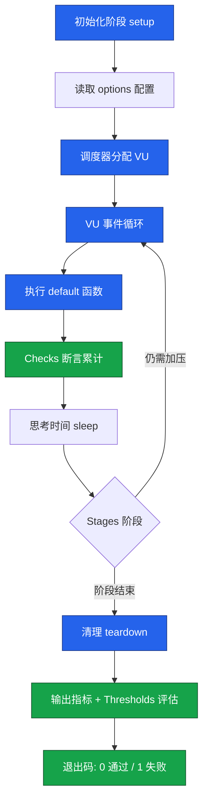
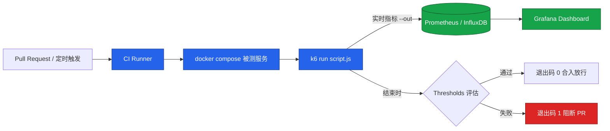
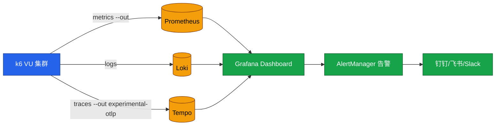

# k6 云原生压测实战

k6 是 Grafana Labs 主导开发的现代化负载测试工具，用 Go 实现执行引擎、以 ES6 JavaScript 编写测试脚本，原生面向"脚本即代码、CI/CD 友好、云原生分布式"的工程范式。本文基于 k6 v0.57.x，系统讲解核心概念、脚本编写、进阶实战、CI/CD 集成、Kubernetes 分布式执行与 Grafana 实时监控，并指出常见陷阱与最佳实践，帮助读者在生产级压测场景中替代或补足 JMeter 工作流。

## 一、核心概念

### 1.1 k6 是什么

k6 是一款开源的负载测试工具，其执行引擎使用 Go 编写，单机即可发起数万级并发请求；测试脚本采用 ES6 JavaScript 语法，并通过内置的 `k6/http` 模块提供 HTTP/1.1、HTTP/2、HTTP/3（实验性）协议支持。k6 由 Grafana Labs 在 2021 年收购后，与 Grafana、Prometheus、Loki、Tempo 等可观测性栈深度融合，形成了"压测 + 指标 + 日志 + 追踪"的完整链路。

k6 解决的核心问题包括：

- **脚本即代码**：测试用 JavaScript 编写，可纳入 Git 版本管理，避免 JMeter `.jmx` 二进制 XML 难以 diff、难 review 的痛点；
- **CLI 驱动与 CI 友好**：单二进制无 GUI 依赖，天然适配 GitHub Actions、GitLab CI、ArgoCD Pipeline；
- **高性能引擎**：Go 实现的调度器单机可压至 10w+ VU 级别，远超基于 Java 的 JMeter；
- **结果可观测**：原生支持输出至 Prometheus、InfluxDB、Grafana Cloud、Datadog 等；
- **云原生分布式**：通过 K8s Operator 与 k6 Cloud 实现水平扩展。

### 1.2 为什么选择 k6（vs JMeter）

JMeter 在长期演进中沉淀了大量协议支持与企业级插件生态，但其基于 Java 的线程模型、GUI 主导的工作流与 `.jmx` XML 脚本，在云原生与 DevOps 场景下显出明显短板。k6 与 JMeter 的关键差异如下：

| 维度 | JMeter | k6 |
|------|--------|-----|
| 引擎语言 | Java（JVM 线程模型） | Go（协程调度） |
| 脚本格式 | `.jmx` XML，GUI 维护 | `.js` ES6，纯代码 |
| 单机并发上限 | 千级，受 JVM 堆与线程切换限制 | 万级至十万级 |
| 工作流 | GUI 调试 + CLI 执行 | CLI 驱动，无 GUI |
| 版本可控 | XML 难 diff、难 review | JS 友好 diff，PR 可审 |
| CI/CD 集成 | 需插件或自定义镜像 | 官方 Docker 与 GitHub Action |
| 协议支持 | 极广（HTTP/JDBC/JMS/TCP/LDAP…） | 聚焦 HTTP/gRPC/WebSocket，扩展走 xk6 |
| 可观测性 | Backend Listener | 原生 Prometheus/Grafana/Cloud |
| 扩展机制 | JMeter Plugins | xk6 自定义构建 |

选型结论：**协议丰富性、企业既有资产与图形化调试体验**仍偏向 JMeter；**云原生、脚本即代码、大规模并发、Grafana 可观测一体化**则明显偏向 k6。两者并非互斥，新业务线或微服务压测首选 k6，老系统兼容性测试可保留 JMeter。

### 1.3 核心概念术语表

| 概念 | 含义 |
|------|------|
| **VU（Virtual User）** | 虚拟用户，k6 的最小并发单元，每个 VU 在循环中执行 `default` 函数 |
| **Iterations** | 一次完整 `default` 函数执行，是 k6 统计 P95/P99 的基本单位 |
| **Stages** | 阶段化加压，按时间段调整活跃 VU 数 |
| **Thresholds** | 阈值断言，对指标设定阈值并在结束时返回成功/失败退出码 |
| **Scenarios** | 多场景编排，可在同一脚本中独立调度不同负载模型 |
| **Checks** | 单次断言，类似断言但不会让脚本失败，仅累计成功率 |
| **Tags / Groups** | 标签与分组，用于结果过滤与聚合 |

## 二、安装与快速入门

### 2.1 安装方式

k6 提供多种安装途径，按团队基础设施选其一即可。

```bash
# macOS
brew install k6

# Linux (Debian/Ubuntu)
sudo gpg -k && sudo gpg --no-default-keyring --keyring /usr/share/keyrings/k6-archive-keyring.gpg --keyserver hkp://keyserver.ubuntu.com:80 --recv-keys C5AD17C947E7D64D6909E4369163BB6F056943A4
echo "deb [signed-by=/usr/share/keyrings/k6-archive-keyring.gpg] https://dl.k6.io/deb stable main" | sudo tee /etc/apt/sources.list.d/k6.list
sudo apt update && sudo apt install k6

# Docker（推荐用于 CI）
docker pull grafana/k6:latest

# Windows (Chocolatey)
choco install k6
```

### 2.2 第一个脚本

新建 `script.js`，写入以下内容：

```javascript
import http from 'k6/http';
import { check, sleep } from 'k6';

// 1. 配置加压阶段：20s 内线性升至 50 VU，保持 1 分钟，再 10s 降至 0
export const options = {
  stages: [
    { duration: '20s', target: 50 },
    { duration: '1m', target: 50 },
    { duration: '10s', target: 0 },
  ],
  // 2. 阈值断言：P95 < 500ms，错误率 < 1%，否则 k6 退出码非 0
  thresholds: {
    http_req_duration: ['p(95)<500'],
    http_req_failed:   ['rate<0.01'],
  },
};

// 3. 每个 VU 在循环中执行的 default 函数
export default function () {
  const res = http.get('https://test-api.example.com/users');
  check(res, {
    '状态码为 200': (r) => r.status === 200,
    '响应体包含用户列表': (r) => r.json('data').length > 0,
  });
  sleep(1); // 模拟用户思考时间
}
```

### 2.3 执行脚本

```bash
# 本地直接执行
k6 run script.js

# 通过 Docker 执行（注意挂载脚本）
docker run --rm -i grafana/k6 run - < script.js

# 输出指标到 InfluxDB
k6 run --out influxdb=http://localhost:8086/k6 script.js

# 输出到 Prometheus Remote Write
k6 run --out experimental-prometheus-rw=http://localhost:9090/api/v1/write script.js
```

k6 默认输出汇总指标（`http_reqs`、`http_req_duration`、`iterations`、`vus` 等）到终端，配合 `--out` 参数可实时同步到时序数据库以便可视化。

### 2.4 k6 脚本执行流程

k6 的执行模型基于"事件循环 + VU 调度"，与 JMeter 的线程模型差异显著。其完整生命周期为：初始化 → 读取 `options` 配置 → 调度器按 `stages`/`scenarios` 分配 VU → VU 事件循环（反复执行 `default` 函数、累计 checks、等待思考时间）→ 阶段结束 → `teardown` 清理 → 输出指标并评估 Thresholds → 以退出码 0（通过）/ 1（失败）退出。



值得注意：`setup` 与 `teardown` 在整个测试开始前/结束后各只执行一次（而非每个 VU 一次），适合做登录拿 token、清理测试数据等操作；`default` 是 VU 循环的主体，k6 会按 `iterations` 或 `duration/stages` 反复调用。

## 三、脚本编写

### 3.1 options 全景

`options` 是 k6 脚本的中枢配置，与 JMeter 中 ThreadGroup + Timer + Assertion 的组合等价：

```javascript
export const options = {
  vus: 50,                    // 恒定 50 VU
  duration: '3m',             // 持续 3 分钟
  iterations: 1000,           // 或指定总迭代次数（与 duration 二选一）
  batch: 20,                  // 单次迭代内最大并发请求数
  batchPerHost: 10,           // 同一主机最大并发
  userAgent: 'k6-loadtest/1.0',
  noConnectionReuse: false,   // 是否禁用连接复用
  insecureSkipTLSVerify: true,// 测试环境跳过证书校验
  thresholds: {
    'http_req_duration': ['p(95)<500', 'p(99)<1000'],
    'http_req_failed':   ['rate<0.01'],
    'checks':            ['rate>0.95'],
  },
};
```

### 3.2 Stages 阶段化加压

Stages 是 k6 表达"爬坡—稳定—降温"负载模型的最常用方式：

```javascript
export const options = {
  stages: [
    { duration: '30s', target: 100 },  // 30s 内升至 100 VU
    { duration: '2m',  target: 100 },  // 维持 100 VU 持续 2 分钟
    { duration: '1m',  target: 300 },  // 1 分钟内爬升至 300 VU
    { duration: '30s', target: 0   },  // 30s 内降至 0，平滑退出
  ],
};
```

对于恒定到达率（每秒发起 N 个新请求，不受响应时间影响）的场景，应使用 `executor: 'constant-arrival-rate'`：

```javascript
export const options = {
  scenarios: {
    constant_load: {
      executor: 'constant-arrival-rate',
      rate: 200,                 // 200 req/s 恒定到达率
      timeUnit: '1s',
      duration: '5m',
      preAllocatedVUs: 100,      // 预分配 VU
      maxVUs: 500,               // 上限，应对响应时间恶化
    },
  },
};
```

### 3.3 Thresholds 阈值断言

Thresholds 是 k6 的"硬断言"：执行结束后逐项评估，任一未满足则退出码为非 0，是 CI/CD 中阻断流水线的关键依据。

```javascript
export const options = {
  thresholds: {
    // 单指标多阈值，全部满足才算通过
    'http_req_duration': ['p(95)<500', 'p(99)<1000'],
    // 错误率 < 1%
    'http_req_failed':   ['rate<0.01'],
    // 自定义 metric：成功率 > 95%
    'checks':            ['rate>0.95'],
    // 按标签过滤后单独评估
    'http_req_duration{group:登录}': ['p(95)<300'],
    'http_req_duration{group:下单}': ['p(95)<800'],
  },
};
```

### 3.4 Scenarios 多场景编排

Scenarios 允许在一个脚本中并行或串行多个独立负载模型，常用于混合场景压测：

```javascript
export const options = {
  scenarios: {
    // 场景一：浏览接口，恒定 50 VU 跑 5 分钟
    browse: {
      executor: 'constant-vus',
      vus: 50,
      duration: '5m',
      exec: 'browseFlow',  // 指定执行的导出函数
    },
    // 场景二：下单接口，每秒 10 个请求持续 5 分钟
    checkout: {
      executor: 'constant-arrival-rate',
      rate: 10,
      timeUnit: '1s',
      duration: '5m',
      preAllocatedVUs: 20,
      maxVUs: 100,
      exec: 'checkoutFlow',
    },
  },
};

export function browseFlow() {
  http.get('https://test-api.example.com/products');
  sleep(2);
}

export function checkoutFlow() {
  http.post('https://test-api.example.com/orders', JSON.stringify({ sku: 'A001' }));
  sleep(1);
}
```

### 3.5 Checks 与 Groups

- **Checks**：单次断言，类似 JMeter Assertion，但**不会**让脚本失败，仅累计 `checks` 指标；
- **Groups**：将请求归类，便于在结果中按业务模块查看。

```javascript
import http from 'k6/http';
import { check, group, sleep } from 'k6';

export default function () {
  group('登录', function () {
    const res = http.post('https://test-api.example.com/login', JSON.stringify({ user: 'test' }), {
      headers: { 'Content-Type': 'application/json' },
    });
    check(res, {
      '登录返回 200': (r) => r.status === 200,
      '返回 token':   (r) => r.json('token') !== undefined,
    });
  });

  group('查询订单', function () {
    const res = http.get('https://test-api.example.com/orders');
    check(res, { '订单列表非空': (r) => r.json('orders').length > 0 });
  });

  sleep(1);
}
```

## 四、进阶实战

### 4.1 参数化（Data Driven）

k6 通过 `SharedArray` 在所有 VU 间共享只读数据，避免每个 VU 各自加载 CSV：

```javascript
import http from 'k6/http';
import { SharedArray } from 'k6/data';

// 1. 启动时一次性加载，所有 VU 共享只读副本
const users = new SharedArray('users', function () {
  // 实际场景从 CSV 读取
  return [
    { username: 'user01', password: 'pwd01' },
    { username: 'user02', password: 'pwd02' },
    { username: 'user03', password: 'pwd03' },
  ];
});

export default function () {
  // 2. 按 VU 编号与迭代次数取用户，保证不同 VU 不重复
  const user = users[(__VU - 1) % users.length];
  const res = http.post('https://test-api.example.com/login', JSON.stringify(user), {
    headers: { 'Content-Type': 'application/json' },
  });
  console.log(`VU=${__VU} ITER=${__ITER} user=${user.username}`);
}
```

`__VU` 与 `__ITER` 是 k6 注入的内置变量，分别表示当前 VU 编号与该 VU 的迭代序号，是参数化分片的核心依据。

### 4.2 关联（Correlation）

关联即从上一请求响应中提取参数供下一请求使用，对应 JMeter 的后置处理器。k6 通过 JavaScript 原生操作 JSON 即可完成：

```javascript
import http from 'k6/http';
import { check } from 'k6';

export default function () {
  // 1. 登录获取 token
  const loginRes = http.post('https://test-api.example.com/login', JSON.stringify({
    username: 'test', password: '123456',
  }), { headers: { 'Content-Type': 'application/json' } });

  const token = loginRes.json('token');   // 直接 JSONPath 提取

  // 2. 带 token 访问下一接口
  const orderRes = http.get('https://test-api.example.com/orders', {
    headers: { Authorization: `Bearer ${token}` },
  });

  check(orderRes, { '订单接口返回 200': (r) => r.status === 200 });
}
```

### 4.3 Cookie 与 Session

k6 默认开启 `CookieJar`，自动管理会话 Cookie，无需手动维护。如需共享跨 VU 的会话或显式注入：

```javascript
import http from 'k6/http';
import { check } from 'k6';

export default function () {
  // 显式设置 Cookie
  http.cookieJar().set('https://test-api.example.com', 'session_id', 'abc123xyz');

  const res = http.get('https://test-api.example.com/profile');
  check(res, { '已登录': (r) => r.json('user') !== null });
}
```

### 4.4 WebSocket 与 gRPC

k6 内置 WebSocket 与 gRPC 模块，覆盖长连接与 RPC 场景：

```javascript
import ws from 'k6/ws';
import { check } from 'k6';

export default function () {
  const url = 'wss://test-api.example.com/ws';
  const res = ws.connect(url, {}, function (socket) {
    socket.on('open', () => socket.send(JSON.stringify({ type: 'subscribe', channel: 'price' })));
    socket.on('message', (data) => {
      console.log(`收到: ${data}`);
    });
    socket.setTimeout(() => socket.close(), 5000);
  });

  check(res, { 'WebSocket 连接成功': (r) => r && r.status === 101 });
}
```

## 五、CI/CD 集成

### 5.1 GitHub Actions

k6 官方提供 `grafana/k6-action`，可在流水线中直接执行脚本并以 Thresholds 结果决定流水线状态（注：该 Action 已于 2026-06 归档停更，官方现推荐 `grafana/setup-k6-action` + `grafana/run-k6-action` 组合，本节写法在归档版本上仍有效）：

```yaml
# .github/workflows/load-test.yml
name: 性能回归测试
on:
  pull_request:
    branches: [main]
  schedule:
    - cron: '0 2 * * *'   # 每日凌晨 2 点例行回归

jobs:
  k6:
    runs-on: ubuntu-latest
    steps:
      - uses: actions/checkout@v4

      - name: 启动被测服务
        run: docker compose up -d

      - name: 等待服务就绪
        run: ./scripts/wait-for.sh http://localhost:8080/health 30

      - name: 运行 k6 压测
        uses: grafana/k6-action@v0.3.1
        with:
          filename: tests/load/script.js
          flags: --out json=results.json
        env:
          K6_CLOUD_TOKEN: ${{ secrets.K6_CLOUD_TOKEN }}   # 可选：推送到 k6 Cloud

      - name: 上传结果
        if: always()
        uses: actions/upload-artifact@v4
        with:
          name: k6-results
          path: results.json
```

关键点：Thresholds 失败会让 action 退出码非 0，从而自动阻断 PR 合入；通过 `--out json` 留存明细数据，便于复盘。

### 5.2 GitLab CI

```yaml
# .gitlab-ci.yml
stages:
  - test

k6:load:
  stage: test
  image: grafana/k6:latest
  script:
    - k6 run --out json=results.json tests/load/script.js
  artifacts:
    when: always
    paths:
      - results.json
  rules:
    - if: $CI_PIPELINE_SOURCE == "merge_request_event"
```

### 5.3 CI/CD 集成架构

CI/CD 中运行 k6 的典型链路：流水线触发 → 启动被测服务 → 运行 k6 → 指标实时回传 → Thresholds 评估 → 失败则阻断合入。整体架构如下：



## 六、云原生部署

### 6.1 K8s Operator

[k6 Operator](https://github.com/grafana/k6-operator) 是 Grafana 官方维护的 Kubernetes CRD，可在集群中以分布式 Job 形式运行大规模压测：

```yaml
# k6-test.yaml
apiVersion: k6.io/v1alpha1
kind: K6
metadata:
  name: example-k6
spec:
  parallelism: 4                  # 4 个 Pod 分布式执行
  script:
    configMap:
      name: k6-script
      file: script.js
  runner:
    image: grafana/k6:latest
    env:
      - name: TARGET_HOST
        value: https://test-api.example.com
    resources:
      limits:
        cpu: '2'
        memory: 2Gi
  arguments: --out experimental-prometheus-rw=http://prometheus:9090/api/v1/write
  starter:
    env:
      - name: K6_PROMETHEUS_RW_SERVER_URL
        value: http://prometheus:9090/api/v1/write
```

```bash
# 应用并查看
kubectl apply -f k6-test.yaml
kubectl get k6
kubectl logs -f job/example-k6-1
```

Operator 会按 `parallelism` 启动 N 个 Pod，每个 Pod 独立运行 k6 实例，由 starter Pod 负责协调整体进度；测试脚本通过 ConfigMap 挂载，避免镜像重新构建。

### 6.2 分布式执行要点

- **流量分布**：k6 不会自动按比例切分 `vus`，需在脚本中以 `__VU` 与 `__ITER` 自行分片；
- **结果聚合**：各 Pod 的指标通过 `--out` 统一上报至 Prometheus/InfluxDB，由 Grafana 聚合呈现；
- **网络拓扑**：压测 Pod 应尽量靠近被测服务（同 namespace 或同集群），避免网络抖动污染结果；
- **资源隔离**：压测 Pod 与被测 Pod 应反亲和调度，防止 CPU 抢占影响被测系统本身；
- **熔断**：通过 `--execution-timeout` 与 `--vus` 上限防止异常情况拖垮集群。

### 6.3 k6 Cloud

k6 Cloud 是 Grafana 提供的托管服务，可在云端发起大规模地理分布压测，无需自维护压测机。通过 `k6 cloud login` 与 `k6 cloud run script.js` 即可将脚本提交至云端执行，结果自动回传至 Grafana Cloud Dashboard。

## 七、与 Grafana 集成

### 7.1 输出到 Prometheus

k6 通过 `--out experimental-prometheus-rw` 将指标实时写入 Prometheus Remote Write 端点：

```bash
k6 run \
  --out experimental-prometheus-rw=http://localhost:9090/api/v1/write \
  --tag testid=login-$(date +%s) \
  script.js
```

关键实践：每次执行都打上唯一 `testid` 标签，便于在 Grafana 中按运行实例过滤，避免历史数据互相覆盖。

### 7.2 Grafana Dashboard

社区提供官方 [k6 Grafana Dashboard 模板](https://grafana.com/grafana/dashboards/2587-k6-load-testing-results/)，导入即可获得包含以下面板的可视化大屏：

- **请求总量与吞吐量**（`http_reqs`）；
- **响应时间分布**（P50/P90/P95/P99）；
- **错误率与失败请求**（`http_req_failed`）；
- **VU 数量变化曲线**（`vus`）；
- **Checks 成功率**（`checks`）；
- **按 Group / Tag 维度下钻**。

### 7.3 集成架构总览

k6 → 时序数据库 → Grafana 的完整可观测链路如下，配合 Loki 与 Tempo 还可实现日志与追踪关联：



## 八、常见陷阱与最佳实践

### 8.1 陷阱清单

| 陷阱 | 现象 | 解决方案 |
|------|------|----------|
| **在 VU 代码块中初始化外部依赖** | 每个 VU 都重新连接数据库 | 在脚本顶层（init 上下文）为每个 VU 建立一次连接，或用 `setup()` 统一准备配置，避免每次迭代重建 |
| **未设置思考时间** | VU 全速打满被测系统，QPS 虚高 | 用 `sleep()` 模拟用户间隔，贴近真实流量 |
| **阈值只在结束时评估** | 长时间压测中途恶化无感知 | 配合 `abortOnFail` 让脚本在中途越界即停止 |
| **`http.batch` 滥用** | 单次迭代并发数过高，瞬时 QPS 失真 | 仅在真实业务有并行请求时使用 |
| **TLS 证书校验失败** | 测试环境自签名证书报错 | `insecureSkipTLSVerify: true` 仅限测试环境 |
| **结果与历史数据混淆** | 多次运行指标互相覆盖 | 每次运行打 `testid` Tag 区分 |
| **CI 中跑生产规模** | 共享 Runner 资源被吃满 | 大规模压测使用 k6 Operator 或 k6 Cloud |
| **DNS 解析抖动** | P99 偶发尖刺 | 使用 `--dns ttl=60s` 缓存或本地 hosts |

### 8.2 最佳实践

- **脚本纳入版本管理**：所有 k6 脚本与 fixtures 同业务代码同仓，PR 触发回归；
- **环境变量驱动**：用 `__ENV.TARGET_HOST` 注入不同环境地址，避免硬编码；
- **分层脚本**：公共封装放 `lib/`，场景化脚本放 `scenarios/`，便于复用；
- **数据隔离**：每个测试用例使用独立数据集，避免并发互踩；
- **监控被测系统**：在压测脚本旁同时采集被测系统的 Prometheus 指标，做根因分析；
- **阶梯式回归**：CI 中跑冒烟（1m/50VU），nightly 跑全量（30m/500VU），发布前跑极限；
- **代码评审**：k6 脚本走与业务代码一致的 PR 评审流程，确保加压策略经过评审。

## 九、延伸阅读

- [k6 官方文档](https://k6.io/docs/)
- [k6 GitHub 仓库](https://github.com/grafana/k6)
- [k6 Operator](https://github.com/grafana/k6-operator)
- [xk6 扩展生态](https://k6.io/docs/extensions/)
- [Grafana k6 Dashboard 模板](https://grafana.com/grafana/dashboards/2587-k6-load-testing-results/)
- [k6 Examples 示例库](https://github.com/grafana/k6/tree/master/examples)

---
