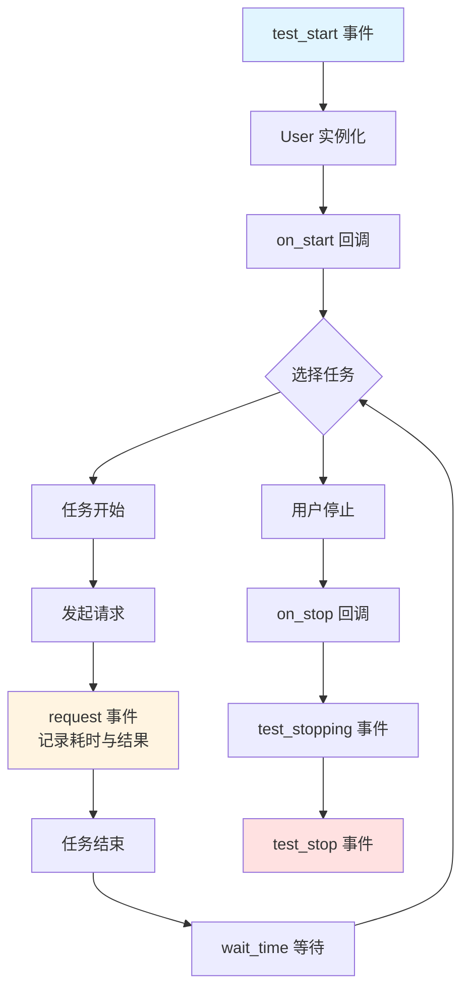
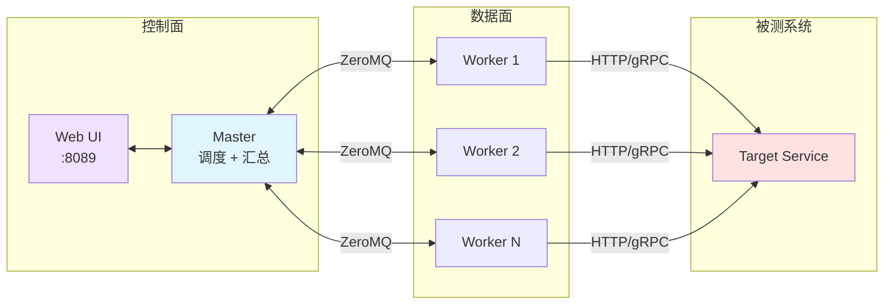

# Locust Python 压测实战

Locust 是 Python 生态最主流的开源分布式压测工具，由 Jonatan Heyman 发起，本文以 2.44.x（2026 年）为基准。它以"代码即脚本"为核心设计理念，使用 Python 描述用户行为，依托 `gevent` 协程库在单机内模拟数万级并发用户，并通过内置 Web UI 实时呈现 RPS、响应时间分位数、失败率等关键指标。本文系统讲解 Locust 的核心概念、脚本编写、进阶实战、分布式部署、Headless 与 CI/CD 集成，并梳理常见陷阱与最佳实践，帮助读者在生产级压测场景中构建可维护、可扩展的 Python 压测工作流。

## 一、核心概念

### 1.1 Locust 是什么

Locust 是一款用 Python 编写的负载测试工具，其执行引擎基于 `gevent` 的轻量级协程（greenlet），每个虚拟用户对应一个 greenlet 而非 OS 线程，因此单机即可发起数万级并发请求，远高于基于线程模型的 JMeter。测试脚本本身就是普通的 Python 文件（默认命名为 `locustfile.py`），可纳入 Git 版本管理、走 Code Review 流程，并直接复用业务侧的 Python 工具链（如 `requests`、`pydantic`、`sqlalchemy`、业务 SDK 等）。

Locust 解决的核心问题包括：

- **代码即脚本**：用 Python 描述用户行为，避免 JMeter `.jmx` XML 难以 diff、难 review 的痛点；
- **协程驱动**：`gevent` 协程让单机轻松模拟数万并发，资源占用远低于线程模型；
- **Web UI 实时监控**：内置 Flask Web UI，可在浏览器中动态调整并发数、加压速率，实时查看图表；
- **分布式原生支持**：通过 Master-Worker 架构水平扩展，单 Master 可挂载数十个 Worker；
- **Python 生态融合**：可直接 `import` 业务库进行数据构造、签名计算、数据库校验，无需额外插件机制；
- **协议无关扩展**：通过自定义 `User` 类可压测 gRPC、WebSocket、MQTT、数据库甚至自定义二进制协议。

### 1.2 适用场景

| 场景 | 适用性 | 说明 |
|------|--------|------|
| HTTP/REST API 压测 | 极佳 | 内置 `HttpUser`，开箱即用 |
| 复杂业务链路压测 | 极佳 | Python 脚本可串联多接口、做关联与参数化 |
| gRPC / WebSocket 压测 | 良好 | 自定义 `User` 子类即可 |
| 数据库直接压测 | 良好 | 通过 `User` + `sqlalchemy` 等驱动 |
| 极高并发基准测试 | 一般 | 单机性能不及 Go 系工具（如 k6、wrk） |
| GUI 录制脚本 | 不适用 | Locust 不提供录制功能，脚本需手写 |
| 协议覆盖广度 | 一般 | 不如 JMeter 的数十种协议采样器 |

### 1.3 vs JMeter vs k6

三者代表了三种截然不同的工程哲学：JMeter 是 GUI 主导的"配置即脚本"，k6 是 Go 引擎 + JS 脚本的"高性能 CLI 优先"，Locust 则是"Python 代码即脚本"。下表从工程视角对比关键维度：

| 维度 | JMeter | k6 | Locust |
|------|--------|-----|--------|
| 引擎语言 | Java（JVM 线程） | Go（goroutine） | Python（gevent 协程） |
| 脚本格式 | `.jmx` XML | `.js` ES6 | `.py` Python |
| 单机并发上限 | 千级 | 万级至十万级 | 万级（受 GIL 与 gevent 调度限制） |
| 工作流 | GUI 调试为主 | 纯 CLI | Web UI + CLI |
| 协议扩展 | 采样器插件 | xk6 自定义构建 | 自定义 `User` 子类 |
| 业务库复用 | 难（需 JSR223 脚本） | 一般（JS 生态） | 极佳（Python 生态直引） |
| 分布式 | Master-Slave（JDK RMI） | K8s Operator / Cloud | Master-Worker（ZeroMQ） |
| 学习成本 | 中（GUI 上手快，进阶难） | 低 | 低（会 Python 即可） |
| CI/CD 集成 | 需插件或镜像 | 原生友好 | Headless 模式友好 |

选型建议：**协议丰富性与企业资产沉淀**偏 JMeter；**极致单机性能与云原生可观测**偏 k6；**业务逻辑复杂、需复用 Python 业务库、团队 Python 栈熟练**则首选 Locust。三者并非互斥，实际工程中常见 Locust 编写业务链路压测、k6 做大规模基准对比的组合。

### 1.4 核心概念术语表

| 概念 | 含义 |
|------|------|
| **User** | 虚拟用户基类，`HttpUser` 是其最常见的 HTTP 子类 |
| **TaskSet** | 任务集合，将一组相关任务封装为可复用的行为单元 |
| **@task** | 任务装饰器，可指定权重，决定任务被调用的相对频率 |
| **wait_time** | 用户在两次任务之间的思考时间，如 `between(1, 3)` |
| **self.client** | `HttpUser` 内置的 `requests` 风格 HTTP 客户端，自动记录指标 |
| **events** | 事件钩子，可在请求前后、测试起止注入自定义逻辑 |
| **Shape** | 负载形状类，可编程控制并发数与加压曲线 |
| **Master / Worker** | 分布式角色，Master 负责调度与汇总，Worker 实际产生负载 |

## 二、安装与快速入门

### 2.1 安装

Locust 是标准 Python 包，推荐在独立虚拟环境中安装以避免依赖冲突。Locust 2.44.x 要求 Python 3.10+。

```bash
# 创建虚拟环境
python -m venv .venv
source .venv/bin/activate  # Windows: .venv\Scripts\activate

# 安装 Locust（含 Web UI 与分布式支持）
pip install locust==2.44.1

# 验证版本
locust --version
# locust 2.44.1
```

### 2.2 第一个压测脚本

新建 `locustfile.py`，描述一个对课程列表接口与登录接口施加负载的虚拟用户：

```python
# locustfile.py
from locust import HttpUser, task, between

class WebsiteUser(HttpUser):
    """模拟一个访问网站的用户"""

    # 两次请求之间的思考时间：1~3 秒随机
    wait_time = between(1, 3)

    # host 指定被测系统的根地址，也可通过 --host 命令行参数覆盖
    host = "http://localhost:8080"

    @task(2)  # 权重为 2，被调用的频率更高
    def list_courses(self):
        # self.client 是 requests 风格的客户端，自动记录响应时间与状态
        self.client.get("/api/courses")

    @task(1)  # 权重为 1
    def login(self):
        self.client.post("/api/login", json={
            "username": "tester",
            "password": "pass1234",
        })
```

启动 Web UI 模式：

```bash
locust -f locustfile.py
# 默认监听 http://localhost:8089
```

打开浏览器访问 `http://localhost:8089`，在表单中填入：

- **Number of users**：模拟用户总数（如 100）
- **Ramp up**：每秒启动的用户数（如 10）
- **Host**：被测系统地址（已在脚本中指定则可留空）

点击 **Start swarming** 即可开始压测，页面实时展示 RPS、响应时间分位数（P50/P95/P99）、失败率与图表。

## 三、脚本编写

### 3.1 HttpUser 与 task 装饰器

`HttpUser` 是 Locust 内置的 HTTP 协议用户，每个用户实例持有一个 `self.client`，其 API 与 `requests.Session` 几乎一致：

```python
from locust import HttpUser, task, between

class ApiUser(HttpUser):
    wait_time = between(1, 2)

    @task
    def get_profile(self):
        # GET 请求，自动记录响应时间
        self.client.get("/api/profile")

    @task
    def create_order(self):
        # POST 请求，json 参数会自动设置 Content-Type
        self.client.post("/api/orders", json={"sku_id": 1001, "qty": 2})

    @task
    def upload_file(self):
        # 上传文件：与 requests 用法一致
        with open("avatar.png", "rb") as f:
            self.client.post("/api/upload", files={"file": f})
```

`@task` 装饰器可指定权重，权重决定任务被随机选中调用的相对概率。例如 `@task(3)` 与 `@task(1)` 表示前者被调用的频率是后者的 3 倍。

### 3.2 TaskSet 与任务编排

当多个任务之间存在业务上下文关联时，可将它们封装为 `TaskSet`，使一个用户的流量更接近真实业务链路：

```python
from random import randint

from locust import HttpUser, TaskSet, task, between

class OrderFlow(TaskSet):
    """下单完整链路：登录 → 浏览商品 → 加购 → 下单"""

    def on_start(self):
        # 进入 TaskSet 时先登录，提取 token 供后续接口使用（关联）
        resp = self.client.post("/api/login", json={
            "username": "buyer",
            "password": "pass1234",
        })
        self.token = resp.json()["token"]

    @task(3)
    def browse_product(self):
        self.client.get("/api/products/1001",
                        headers={"Authorization": f"Bearer {self.token}"})

    @task(2)
    def add_to_cart(self):
        self.client.post("/api/cart", json={"sku_id": 1001, "qty": 1},
                         headers={"Authorization": f"Bearer {self.token}"})

    @task(1)
    def place_order(self):
        self.client.post("/api/orders",
                         headers={"Authorization": f"Bearer {self.token}"})
        # 5% 概率退出当前 TaskSet，回到父级
        if randint(0, 99) < 5:
            self.interrupt()

class WebsiteUser(HttpUser):
    tasks = [OrderFlow]
    wait_time = between(1, 3)
```

`TaskSet` 内部任务的权重独立计算；`self.interrupt()` 用于退出当前 TaskSet 回到父级，避免永久停留在子流程中。

### 3.3 wait_time 思考时间

`wait_time` 决定用户在两次任务之间的间隔，常见的几种策略：

```python
from locust import HttpUser, between, constant, constant_pacing

class UserA(HttpUser):
    wait_time = between(1, 5)        # 每次任务后随机等待 1~5 秒

class UserB(HttpUser):
    wait_time = constant(2)          # 每次任务后固定等待 2 秒

class UserC(HttpUser):
    wait_time = constant_pacing(3)   # 任务总间隔（含执行时间）保持 3 秒
```

`constant_pacing` 适合需要稳定 RPS 的场景——若任务执行耗时 1 秒，则实际等待 2 秒，确保每 3 秒产生一次请求。

## 四、进阶实战

### 4.1 参数化

参数化的核心是让每个虚拟用户使用不同的测试数据。Locust 提供 `@task` 内联数据、`on_start` 初始化数据、以及通过 `events.test_start` 预加载 CSV 数据等方式。

```python
import csv
import itertools
from locust import HttpUser, task, between, events

# 全局数据池，所有用户共享
user_credentials = []

@events.test_start.add_listener
def on_test_start(environment, **kwargs):
    """测试开始前加载测试数据到内存"""
    global user_credentials
    with open("users.csv", encoding="utf-8") as f:
        reader = csv.DictReader(f)
        user_credentials = list(reader)

class ApiUser(HttpUser):
    wait_time = between(1, 2)
    credentials_iter = None  # 类变量，作为共享迭代器

    def on_start(self):
        """每个用户启动时分配一组凭据"""
        # 通过类级别的迭代器实现"每个用户不同数据"
        if ApiUser.credentials_iter is None:
            ApiUser.credentials_iter = itertools.cycle(user_credentials)
        self.cred = next(ApiUser.credentials_iter)

    @task
    def login(self):
        self.client.post("/api/login", json={
            "username": self.cred["username"],
            "password": self.cred["password"],
        })
```

### 4.2 关联（响应提取）

关联是指从上一个接口的响应中提取参数，传递给下一个接口。Locust 不提供内置提取器，但 Python 的字典/正则操作天然支持：

```python
import re
from locust import HttpUser, task, between

class OrderUser(HttpUser):
    wait_time = between(1, 2)

    def on_start(self):
        # 登录获取 token
        resp = self.client.post("/api/login", json={
            "username": "tester", "password": "pass1234"})
        self.token = resp.json()["data"]["token"]

    @task
    def create_and_pay(self):
        # 创建订单，提取 order_id
        resp = self.client.post("/api/orders",
                                json={"sku_id": 1001},
                                headers={"Authorization": f"Bearer {self.token}"})
        order_id = resp.json()["data"]["order_id"]

        # 使用 order_id 调用支付接口
        self.client.post(f"/api/orders/{order_id}/pay",
                         headers={"Authorization": f"Bearer {self.token}"})

    @task
    def search_with_regex(self):
        # 正则提取示例：从 HTML 响应中提取 csrf_token
        resp = self.client.get("/form")
        match = re.search(r'name="csrf_token" value="([^"]+)"', resp.text)
        if match:
            csrf = match.group(1)
            self.client.post("/submit", data={"csrf_token": csrf})
```

### 4.3 自定义客户端（gRPC 示例）

当被测协议非 HTTP 时，可继承 `User` 基类并自定义 `client`，使其行为与 `HttpUser` 一致——即自动记录请求耗时与成功/失败状态：

```python
import time
import grpc
from locust import User, task, between, events

class GrpcClient:
    """封装 grpc.Channel，使其在调用时触发 Locust 事件"""

    def __init__(self, environment, stub_cls):
        self.env = environment
        self.channel = grpc.insecure_channel("localhost:50051")
        self.stub = stub_cls(self.channel)

    def send(self, name, request, timeout=5):
        """统一发送方法，记录请求耗时与结果"""
        start = time.time()
        try:
            response = self.stub.GetFeature(request, timeout=timeout)
            elapsed = int((time.time() - start) * 1000)
            # 触发请求成功事件，被 Locust 统计系统捕获
            events.request.fire(
                request_type="gRPC", name=name,
                response_time=elapsed, response_length=len(response.SerializeToString()),
                exception=None, context=self.env,
            )
            return response
        except grpc.RpcError as e:
            elapsed = int((time.time() - start) * 1000)
            events.request.fire(
                request_type="gRPC", name=name,
                response_time=elapsed, response_length=0,
                exception=e, context=self.env,
            )
            raise

# 假设已通过 grpcio-tools 生成 route_guide_pb2 / route_guide_pb2_grpc
import route_guide_pb2_grpc
import route_guide_pb2

class GrpcUser(User):
    abstract = True  # 抽象基类，不会被实例化为虚拟用户
    stub_cls = None

    def __init__(self, environment):
        super().__init__(environment)
        self.client = GrpcClient(environment, self.stub_cls)

class RouteGuideUser(GrpcUser):
    wait_time = between(1, 2)
    stub_cls = route_guide_pb2_grpc.RouteGuideStub

    @task
    def get_feature(self):
        point = route_guide_pb2.Point(latitude=409146138, longitude=-746188906)
        self.client.send("GetFeature", point)
```

### 4.4 事件钩子

Locust 提供完整的事件钩子体系，覆盖请求级、用户级、测试级三个粒度。常见用途包括：自定义日志、指标上报到 Prometheus、失败请求落库、测试前后初始化与清理等。

```python
import logging
from locust import events

# 请求级：每个请求完成后触发
@events.request.add_listener
def on_request(request_type, name, response_time, response_length, exception, **kwargs):
    if exception:
        logging.warning("请求失败 %s %s: %s", request_type, name, exception)
    elif response_time > 2000:
        logging.info("慢请求 %s %s: %dms", request_type, name, response_time)

# 测试级：压测开始前触发（每个 Worker 各执行一次）
@events.test_start.add_listener
def on_test_start(environment, **kwargs):
    logging.info("压测启动，目标用户数: %d", environment.parsed_options.num_users)

# 测试级：压测结束后触发
@events.test_stop.add_listener
def on_test_stop(environment, **kwargs):
    logging.info("压测结束")

# 全局：所有虚拟用户启动完成时触发
@events.spawning_complete.add_listener
def on_spawning_complete(**kwargs):
    logging.info("全部虚拟用户已启动")
```

下图展示 Locust 中一个虚拟用户从启动到结束的完整请求生命周期，以及各事件钩子的触发时机：



## 五、分布式压测

### 5.1 Master-Worker 架构

当单机并发无法满足需求时，Locust 通过 Master-Worker 架构水平扩展。Master 负责调度、汇总指标与提供 Web UI，Worker 实际产生负载。Master 与 Worker 之间通过 ZeroMQ 进行通信，单个 Master 通常可挂载数十个 Worker 节点。



启动 Master 节点（不产生负载，仅调度）：

```bash
locust -f locustfile.py --master --expect-workers 3
# Master 的 Web UI 监听 8089，Worker 默认经 5557 端口连接
```

启动 Worker 节点（在多台机器上分别执行）：

```bash
locust -f locustfile.py --worker --master-host=192.168.1.10
# Worker 连接到 Master 后等待任务分发
```

关键注意点：

- **`locustfile.py` 必须在所有节点上一致**：Master 不下发脚本，Worker 需自行加载本地脚本；
- **`--expect-workers`**：Master 等待指定数量的 Worker 全部连接后才开始压测，避免漏算负载；
- **指标汇总**：Worker 周期性将本地统计上报 Master，Master 聚合后展示在 Web UI；
- **数据隔离**：若脚本中使用了 `on_start` 加载测试数据，需注意每个 Worker 独立加载数据，避免重复消费同一份数据导致冲突。

### 5.2 Docker Compose 部署

生产级压测推荐用 Docker Compose 一键拉起 Master 与多个 Worker，便于在压测集群中复用：

```yaml
# docker-compose.yml
version: "3.8"

services:
  master:
    image: locustio/locust:2.44.1
    ports:
      - "8089:8089"
    volumes:
      - ./locustfile.py:/mnt/locust/locustfile.py
    command: >
      -f /mnt/locust/locustfile.py
      --master
      --expect-workers 3
      --host http://target-service:8080

  worker:
    image: locustio/locust:2.44.1
    volumes:
      - ./locustfile.py:/mnt/locust/locustfile.py
    deploy:
      replicas: 3
    command: >
      -f /mnt/locust/locustfile.py
      --worker
      --master-host master
    depends_on:
      - master
```

启动集群：

```bash
docker compose up -d
# 浏览器访问 http://localhost:8089 开始压测
```

## 六、Headless 模式与 CI/CD 集成

### 6.1 Headless 模式

CI 环境无 GUI，需通过 `--headless` 启动纯命令行模式，并通过 `--only-summary`、`--csv`、`--html` 等参数控制输出。典型参数组合如下：

```bash
# --users 总用户数；--spawn-rate 每秒启动用户数；--run-time 持续时间
# --html 输出 HTML 报告；--csv 输出 CSV（result_stats.csv 等）
locust -f locustfile.py \
  --headless \
  --users 500 \
  --spawn-rate 50 \
  --run-time 5m \
  --host http://staging.example.com \
  --html report.html \
  --csv result
```

退出码语义：默认情况下，测试结果中存在失败请求时，Locust 会以 `--exit-code-on-error`（默认 1）指定的退出码结束，可直接作为 CI 门禁；也可通过 `events.quitting` 钩子自定义判定逻辑。

### 6.2 GitHub Actions 集成

将压测脚本纳入版本库后，可在 CI 流水线中执行回归压测。下例在每次主分支合并后对预发环境执行 5 分钟压测，并在失败率超阈值时让流水线失败：

```yaml
# .github/workflows/load-test.yml
name: Load Test

on:
  push:
    branches: [ main ]
  workflow_dispatch:

jobs:
  locust:
    runs-on: ubuntu-latest
    steps:
      - uses: actions/checkout@v4

      - name: Setup Python
        uses: actions/setup-python@v5
        with:
          python-version: "3.11"

      - name: Install Locust
        run: pip install locust==2.44.1

      - name: Run Load Test
        run: |
          locust -f tests/load/locustfile.py \
            --headless \
            --users 200 \
            --spawn-rate 20 \
            --run-time 3m \
            --host https://staging.example.com \
            --csv report \
            --html report.html

      - name: Upload Report
        if: always()
        uses: actions/upload-artifact@v4
        with:
          name: locust-report
          path: |
            report.html
            report_stats.csv
```

### 6.3 自定义负载形状（LoadTestShape）

当需要复杂加压曲线（如阶梯加压、浪涌、长尾保持）时，可继承 `LoadTestShape` 类，按时间动态返回 `(用户数, 加压速率)`：

```python
from locust import LoadTestShape

class StepLoadShape(LoadTestShape):
    """阶梯加压：每 60 秒增加 100 用户，达到 500 后保持 5 分钟"""

    stages = [
        {"duration": 60,  "users": 100, "spawn_rate": 10},
        {"duration": 120, "users": 200, "spawn_rate": 10},
        {"duration": 180, "users": 300, "spawn_rate": 10},
        {"duration": 240, "users": 400, "spawn_rate": 10},
        {"duration": 540, "users": 500, "spawn_rate": 10},  # 持续 5 分钟
    ]

    def tick(self):
        run_time = self.get_run_time()
        for stage in self.stages:
            if run_time < stage["duration"]:
                return (stage["users"], stage["spawn_rate"])
        return None  # 返回 None 表示压测结束
```

将 `StepLoadShape` 类定义放入 `locustfile.py`，Locust 会自动识别并使用该形状；启动时无需指定 `--users` 与 `--spawn-rate`。

## 七、常见陷阱与最佳实践

### 7.1 常见陷阱

| 陷阱 | 现象 | 根因与解决 |
|------|------|-----------|
| **测试数据被并发消费** | 用户登录失败、数据冲突 | `on_start` 中读取的共享数据需用 `itertools.cycle` 或分片；分布式下每个 Worker 独立加载，需通过环境变量等节点标识分片 |
| **忘记设置 wait_time** | RPS 异常高、服务被打爆 | 默认 `wait_time=0` 会让用户全速请求；务必显式设置 `between` 或 `constant_pacing` |
| **业务逻辑写在 task 外** | 数据未初始化、报 KeyError | 依赖 `on_start` 初始化的状态必须在 `on_start` 中完成；类变量在分布式下每个 Worker 独立 |
| **GIL 与 gevent 不兼容库** | 协程阻塞、并发骤降 | 避免使用阻塞型库（如 `psycopg2` 同步驱动），改用 `psycopg2-binary` 配合 `gevent.monkey.patch_all()` 或 `asyncpg` |
| **DNS 解析阻塞** | 大量用户启动时延迟突增 | 启动前预热 DNS（`on_start` 中先请求一次），或使用 IP 直连 + Host 头 |
| **Master 单点性能瓶颈** | Worker 多时 Web UI 卡顿 | Master 仅做调度，不要在 Master 上产生负载；指标聚合压力大时精简实时统计输出（如 `--only-summary`） |
| **CSV 数据量不足** | 部分用户拿到空数据 | 数据量应不少于 `users × 重复次数`；或使用随机生成策略 |
| **HTTPS 证书校验失败** | 自签证书环境报错 | `self.client.verify = False` 或在 `HttpUser` 类级别设置 |

### 7.2 最佳实践

**脚本组织**：将不同业务链路拆分到独立的 `locustfile_xxx.py`，通过 `-f` 切换；公共逻辑（鉴权、签名、数据生成）抽取为 `utils.py` 模块复用。

**数据隔离**：分布式压测时，每个 Worker 应使用不同的数据分片，避免重复登录同一账号触发风控。可在 `on_start` 中根据节点标识（如注入的环境变量、主机名）计算数据偏移。

**指标外发**：除 Web UI 与 CSV 外，建议通过 `events.request` 钩子将指标实时推送到 Prometheus Pushgateway 或 InfluxDB，与 Grafana 联动形成长期趋势看板。

**资源监控**：压测本身也是一次资源消耗。监控 Worker 节点的 CPU、内存、网络 IO，确保瓶颈在被测系统而非压测机——否则所有数据都不可信。一个经验法则：Worker CPU 占用超过 80% 时即应横向扩容而非继续加压。

**渐进加压**：不要一开始就拉满目标用户数。先用 `LoadTestShape` 阶梯加压，观察系统在哪个量级出现拐点（响应时间骤增、错误率上升），再针对性地做长时间稳态压测。

**结果可复现**：每次压测保留 `locustfile.py` 的 Git commit、被测系统的镜像 tag、压测参数与结果 CSV/HTML，形成可追溯的压测档案。这是性能回归测试的基础。

**对比基准**：单独看一次压测数据意义有限。建议固定一组"基准场景"作为回归基线，每次重大变更后执行同场景压测，对比 P95、P99、吞吐量与资源占用，判断是否出现性能回退。

---

综上，Locust 凭借 Python 代码即脚本的工程友好性、gevent 协程驱动的并发能力、以及成熟的 Master-Worker 分布式架构，在复杂业务链路压测、需要复用 Python 业务库的场景中具备不可替代的优势。掌握其事件钩子、自定义客户端与分布式部署后，即可构建从开发联调到 CI/CD 回归的完整 Python 压测工作流。
