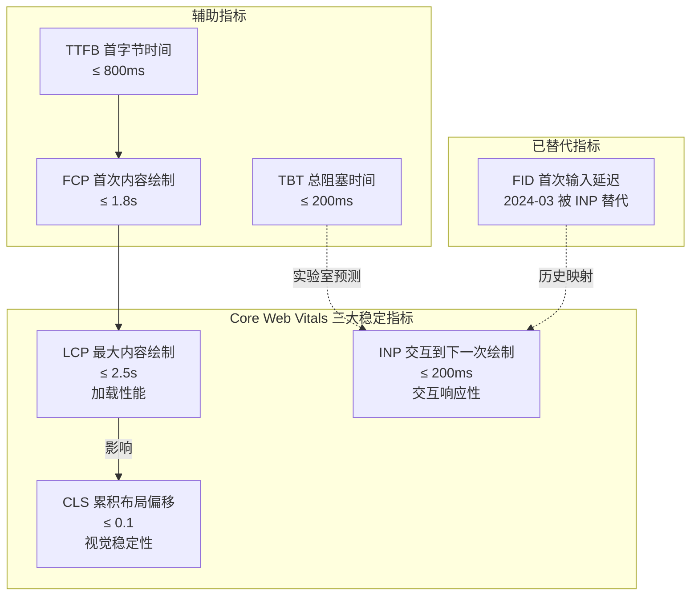
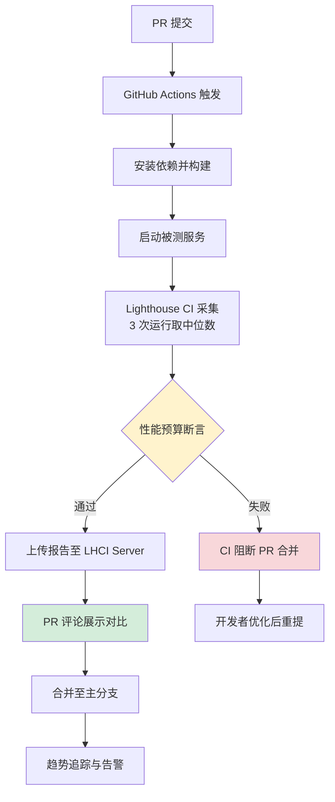

# 前端性能测试（Lighthouse 与 Core Web Vitals）

前端性能测试关注浏览器端的页面渲染、资源加载与交互响应，其核心目标是优化终端用户的感知体验。与后端性能测试聚焦服务器吞吐量、并发承载与链路耗时不同，前端性能测试回答的是"用户看到什么、感受到什么、点击后多久有响应"。本文基于 Lighthouse v13.3（2026）、Core Web Vitals 2024 年变更（INP 替代 FID）以及 2024–2026 前端性能新趋势，系统讲解指标体系、工具链、CI/CD 集成与优化策略，取代旧文档中基于传统 6 项指标的内容。

## 一、核心概念

### 1.1 前端性能测试为什么重要

Google 在 2024 年发布的 CrUX 报告显示：LCP 每增加 100ms，电商页面跳出率上升约 1%；INP 超过 200ms 的页面，用户停留时间下降 8% 以上。前端性能已直接影响三项关键业务指标：

- **转化率**：电商与 SaaS 页面 LCP 优化 0.5s 通常带来 5%–10% 的转化提升；
- **SEO 排名**：Google 自 2021 年起将 Core Web Vitals 纳入搜索排名信号，2024 年 INP 替代 FID 后影响范围进一步扩大；
- **用户留存**：移动端 CLS > 0.1 的页面，30 天回访率下降约 6%。

### 1.2 与后端性能测试的本质区别

| 维度 | 前端性能测试 | 后端性能测试 |
|------|--------------|--------------|
| 关注对象 | 浏览器渲染、资源加载、用户交互响应 | 服务端吞吐量、并发承载、链路耗时 |
| 测试视角 | 终端用户感知视角 | 服务端资源视角 |
| 负载模型 | 单用户页面加载、真实用户行为 | 千万级并发请求、阶梯加压 |
| 关键指标 | LCP / INP / CLS / FCP / TTFB | TPS / P99 延迟 / 错误率 / 资源利用率 |
| 数据来源 | 浏览器 Performance API + CrUX | APM + 压测工具 + 系统监控 |
| 工具链 | Lighthouse / WebPageTest / RUM | JMeter / k6 / Prometheus / SkyWalking |

两者并非对立而是互补：后端性能测试验证"系统能否扛住流量"，前端性能测试验证"用户能否获得流畅体验"。一次完整的性能治理应同时覆盖两侧。

## 二、Core Web Vitals 指标体系

### 2.1 三大核心指标

Core Web Vitals 是 Google 于 2020 年推出、2024 年完成重大更新的前端性能度量标准，由三个稳定指标构成：

| 指标 | 全称 | 含义 | 优秀 | 需改善 | 数据来源 |
|------|------|------|------|--------|----------|
| **LCP** | Largest Contentful Paint | 视口内最大内容元素的渲染时间 | ≤ 2.5s | > 4.0s | Lab + Field |
| **INP** | Interaction to Next Paint | 页面生命周期内所有交互的响应延迟（P98 取值） | ≤ 200ms | > 500ms | Field（CrUX） |
| **CLS** | Cumulative Layout Shift | 页面生命周期内意外布局偏移的累计分数 | ≤ 0.1 | > 0.25 | Lab + Field |



### 2.2 2024 年 INP 替代 FID 详解

2024 年 3 月 12 日，Google 正式将 INP（Interaction to Next Paint）作为 Core Web Vitals 的交互响应性指标，替代自 2020 年起使用的 FID（First Input Delay）。这次变更的核心动因：

- **FID 仅测量首次输入的输入延迟**，不包含事件处理执行时间与下一帧绘制时间，无法反映交互的真实响应性；
- **INP 测量页面生命周期内所有交互的端到端延迟**（input delay + processing time + presentation delay），并取 P98 分位值；
- **真实数据揭示 FID 盲区**：CrUX 2023 年报告显示，约 90% 的页面 FID 达标，但 INP 达标率仅 65%，FID 严重高估了交互体验。

| 维度 | FID（已废弃） | INP（当前标准） |
|------|---------------|------------------|
| 测量范围 | 仅首次输入 | 页面所有交互 |
| 测量阶段 | 仅 input delay | input delay + processing + presentation |
| 取值方式 | 单次值 | P98 分位 |
| 阈值 | ≤ 100ms | ≤ 200ms |
| 数据来源 | Lab + Field | 主要依赖 Field（CrUX） |

INP 难以在实验室环境中稳定复现，因此 Lighthouse 使用 TBT（Total Blocking Time）作为 INP 的实验室代理指标，但两者并非线性相关。

### 2.3 辅助指标

- **FCP（First Contentful Paint）**：首次内容绘制，浏览器首次渲染任何 DOM 内容的时间，≤ 1.8s 为优秀；
- **TTFB（Time to First Byte）**：首字节时间，反映服务器响应与网络传输，2024 年被纳入 Core Web Vitals 补充指标，≤ 800ms 为优秀；
- **TBT（Total Blocking Time）**：FCP 到 TTI 之间所有长任务（> 50ms）阻塞部分的总和，是 INP 的实验室代理指标，≤ 200ms 为优秀；
- **Speed Index**：基于 Filmstrip 截图序列计算的视觉呈现速度，越低越好。

## 三、Lighthouse 深入

### 3.1 Lighthouse v13.3 概览

Google Lighthouse v13.3（2026）是前端性能审计的事实标准工具，核心特性包括：

- **基于 Chrome CDP 协议**采集 Performance API、网络层与视觉层数据；
- **四大审计类别**：Performance、Accessibility、Best Practices、SEO（移动端与桌面端分别评分）；
- **Lantern 模拟节流**：默认通过依赖图模拟（Lantern）估算节流后的指标，无需真实降速；
- **Treemap 与 Flamechart**：内置 JavaScript 体积与主线程火焰图分析；
- **完全 CLI 与 CI 友好**：无 GUI 依赖，原生支持 Docker。

### 3.2 评分算法

Lighthouse Performance 评分采用加权对数曲线，将原始指标值映射到 0–100 分。v13.3 的权重分配如下：

| 指标 | 权重 | 说明 |
|------|------|------|
| LCP | 25% | 加载性能核心 |
| TBT | 30% | 交互响应性实验室代理 |
| CLS | 25% | 视觉稳定性 |
| FCP | 10% | 首次内容绘制 |
| Speed Index | 10% | 视觉呈现速度 |
| TTI | 0% | 可交互时间（不参与评分，仅记录） |

权重之和为 100%，其中 TBT 占比最高，反映 INP 时代对交互响应性的重视。值得注意的是：**评分仅基于实验室数据**，无法反映真实用户在低端设备与弱网环境下的体验，必须与 CrUX 现场数据结合分析。

### 3.3 Lighthouse CLI 命令

```bash
# 基本用法：生成 HTML 报告
npx lighthouse https://example.com \
  --output=html \
  --output-path=./report.html \
  --chrome-flags="--headless=new" \
  --only-categories=performance

# 模拟移动端设备与节流网络
# （--form-factor=mobile 移动端形态；--throttling-method=simulate 模拟节流、更快；
#   --throttling.cpuSlowdownMultiplier=4 模拟低端 CPU）
npx lighthouse https://example.com \
  --form-factor=mobile \
  --throttling-method=simulate \
  --throttling.cpuSlowdownMultiplier=4

# 输出 JSON 报告（lighthouse CLI 每次只跑一轮；多次运行取中位数需用 Lighthouse CI 的 numberOfRuns，见 7.1）
npx lighthouse https://example.com \
  --output=json \
  --output-path=./report.json

# 仅输出关键指标（--quiet 静默模式）
npx lighthouse https://example.com \
  --only-categories=performance \
  --quiet \
  --output=json | jq '.audits | {lcp: ."largest-contentful-paint".numericValue, cls: ."cumulative-layout-shift".numericValue, tbt: ."total-blocking-time".numericValue}'
```

## 四、WebPageTest 与合成测试

### 4.1 合成测试 vs RUM

前端性能测试的数据来源分为两大类，必须配合使用：

| 维度 | 合成测试（Synthetic） | RUM（Real User Monitoring） |
|------|----------------------|------------------------------|
| 数据来源 | 受控环境（实验室）模拟加载 | 真实用户浏览器上报 |
| 环境一致性 | 一致、可复现 | 受设备、网络、地理位置影响 |
| 适用场景 | 性能回归检测、CI 门禁、深度分析 | 评估真实体验、追踪长期趋势 |
| 代表工具 | Lighthouse、WebPageTest | CrUX、SpeedCurve RUM、自建 RUM |
| 优势 | 条件可控，便于定位瓶颈 | 反映真实用户感知 |
| 劣势 | 无法覆盖真实用户异构性 | 数据噪声大，难以复现 |

### 4.2 WebPageTest 核心能力

WebPageTest 在多地域测试与深度网络层分析方面仍有独特价值，核心能力包括：

- **瀑布图（Waterfall）**：每个请求的 DNS、连接、SSL、TTFB、下载耗时分层显示，便于定位慢请求与阻塞；
- **Filmstrip（胶片视图）**：每 100ms 截图一次，可视化页面渲染过程，与 Speed Index 计算直接对应；
- **连接视图（Connection View）**：展示 HTTP/2、HTTP/3 连接复用情况；
- **多地域多浏览器**：覆盖北美、欧洲、亚太等地区，支持 Chrome、Firefox、Edge 与 Android/iOS 真机；
- **首屏视图与重复视图**：分别测试无缓存首屏与有缓存二次访问，验证缓存策略效果。

> **注意**：WebPageTest 公有云（webpagetest.org）在 2023–2024 年间因 Catchpoint 收购后迁移经历过不稳定，企业级场景建议自建私有实例或与 Lighthouse CI 互为备份。

### 4.3 Lighthouse 与 WebPageTest 互补使用

```bash
# Lighthouse CI：用于 CI/CD 流水线性能门禁
npx @lhci/cli autorun --config=lighthouserc.js

# WebPageTest API：用于发布前的多地域深度验证
curl "https://www.webpagetest.org/runtest.php?url=https://example.com&location=SanJose:Chrome&f=json&k=YOUR_API_KEY"
# 异步轮询 testId 获取结果
```

## 五、RUM 与 CrUX

### 5.1 Chrome UX Report（CrUX）

CrUX 是 Google 公开的真实用户体验数据集，从选择"同步使用统计"的 Chrome 用户中采集 Core Web Vitals 指标，按月发布。CrUX 的核心价值：

- **官方数据源**：PageSpeed Insights、Search Console 的现场数据均来自 CrUX；
- **按起源（origin）与 URL 聚合**：可查询整个站点或具体页面的 P75 指标；
- **BigQuery 公开数据集**：`chrome-ux-report.all.202607` 表可 SQL 查询历史趋势；
- **API 访问**：CrUX API（v1）与 CrUX History API 支持 JSON 按月历史查询。

```bash
# 通过 CrUX API 查询 origin 级 P75 指标
curl "https://chromeuxreport.googleapis.com/v1/records:queryRecord?key=YOUR_API_KEY" \
  -H "Content-Type: application/json" \
  -d '{"origin":"https://example.com"}'
# 返回 LCP / INP / CLS 的 P75 值及其直方图分布
```

### 5.2 自建 RUM 方案

CrUX 仅覆盖 Chrome 用户且数据延迟 28 天，企业级监控通常自建 RUM：

```javascript
// 使用 web-vitals 库采集真实用户指标
import { onLCP, onINP, onCLS, onFCP, onTTFB } from 'web-vitals';

function sendToAnalytics(metric) {
  // 上报至自建 RUM 后端（如 Prometheus + Grafana）
  fetch('/api/rum', {
    method: 'POST',
    body: JSON.stringify({
      name: metric.name,           // 指标名，如 LCP
      value: metric.value,         // 数值
      rating: metric.rating,       // good / needs-improvement / poor
      id: metric.id,               // 会话唯一 ID
      delta: metric.delta,         // 增量
      page: location.pathname,     // 页面路径
      sessionId: getSessionId(),   // 会话 ID
    }),
    keepalive: true,               // 即使页面卸载也能完成上报
  });
}

// 注册所有 Core Web Vitals 指标监听
onLCP(sendToAnalytics);
onINP(sendToAnalytics);
onCLS(sendToAnalytics);
onFCP(sendToAnalytics);
onTTFB(sendToAnalytics);
```

## 六、前端性能优化策略

### 6.1 资源优化

| 优化方向 | 具体手段 | 影响指标 |
|----------|----------|----------|
| 图片优化 | WebP/AVIF 替代 JPEG，`loading="lazy"`，`srcset` 响应式图片 | LCP、FCP |
| JavaScript 体积 | Tree Shaking、Code Splitting、动态 import、Module Federation | FCP、TBT、INP |
| 字体优化 | `font-display: swap`，`preload` 关键字体，子集化 | LCP、FCP |
| 文本压缩 | Brotli 优先于 Gzip，HTTP/2 HPACK / HTTP/3 QPACK | TTFB、LCP |
| CDN 部署 | 边缘缓存、HTTP/3、边缘计算（Cloudflare Workers） | TTFB、LCP |

### 6.2 渲染优化

- **关键渲染路径优化**：内联首屏关键 CSS，异步加载非关键 CSS（`media="print" onload="this.media='all'"`）；
- **避免布局抖动**：图片与广告位预留 `aspect-ratio` 或固定尺寸，避免 CLS；
- **减少长任务**：将 > 50ms 的任务拆分为 `requestIdleCallback` 或 `scheduler.yield()` 块；
- **Web Worker**：将非 UI 计算移出主线程，降低 INP；
- **Service Worker 缓存**：Cache First / Stale While Revalidate 策略加速二次访问。

### 6.3 Core Web Vitals 针对性优化

**LCP 优化路径**：
1. 识别 LCP 元素（DevTools Performance 面板或 Lighthouse 报告）；
2. 优化 LCP 资源加载（`preload`、`fetchpriority="high"`、移除阻塞渲染的 CSS/JS）；
3. 优化 TTFB（CDN、HTTP/3、Server 缓存）；
4. 优化首屏 HTML 大小（避免 SSR 过度渲染、流式 HTML）。

**INP 优化路径**：
1. 识别慢交互（CrUX INP P75 + web-vitals `onINP` 上报）；
2. 拆分事件处理函数中的长任务；
3. 优化第三方脚本（懒加载、`requestIdleCallback` 调度）；
4. React/Vue 项目使用 `startTransition`、`useDeferredValue` 标记非紧急更新；
5. 考虑 React Server Components（RSC）减少客户端 hydration 负担。

**CLS 优化路径**：
1. 所有图片/视频/iframe 指定 `width` 与 `height` 或 `aspect-ratio`；
2. 动态注入内容（广告、弹窗）使用占位符；
3. 字体加载使用 `size-adjust` 或 `font-display: optional` 避免 FOIT/FOUT；
4. 避免在已渲染内容上方插入 DOM。

## 七、CI/CD 集成

### 7.1 lighthouserc.js 配置

```javascript
// lighthouserc.js — Lighthouse CI 配置文件（CommonJS 模块）
module.exports = {
  ci: {
    collect: {
      // 测试 URL 列表（可覆盖多个核心页面）
      url: [
        'http://localhost:3000/',
        'http://localhost:3000/products',
        'http://localhost:3000/checkout',
      ],
      numberOfRuns: 3,                // 每个页面运行 3 次取中位数
      startServerCommand: 'npm run start',  // 启动被测服务
      startServerReadyPattern: 'ready on',  // 服务就绪日志特征
      settings: {
        preset: 'desktop',            // 桌面端预设（生产环境主要流量）
        chromeFlags: '--headless=new --no-sandbox',
      },
    },
    assert: {
      // 性能预算断言：未达标则 CI 失败
      assertions: {
        'categories:performance': ['error', { minScore: 0.9 }],     // 性能评分 ≥ 90
        'categories:accessibility': ['warn', { minScore: 0.95 }],
        'largest-contentful-paint': ['error', { maxNumericValue: 2500 }],  // LCP ≤ 2.5s
        'cumulative-layout-shift': ['error', { maxNumericValue: 0.1 }],    // CLS ≤ 0.1
        'total-blocking-time': ['error', { maxNumericValue: 200 }],        // TBT ≤ 200ms
        'first-contentful-paint': ['warn', { maxNumericValue: 1800 }],     // FCP ≤ 1.8s
      },
    },
    upload: {
      target: 'lhci',                 // 上传至 Lighthouse CI Server
      serverBaseUrl: 'https://lhci.internal.company.com',
      basicAuth: { username: process.env.LHCI_USER, password: process.env.LHCI_PASS },
    },
  },
};
```

### 7.2 GitHub Actions 性能门禁

```yaml
# .github/workflows/lighthouse-ci.yml — 性能门禁工作流
name: Lighthouse CI Performance Gate
on:
  pull_request:
    branches: [main, release/*]
  push:
    branches: [main]

jobs:
  lighthouse:
    runs-on: ubuntu-latest
    steps:
      - uses: actions/checkout@v4
      - uses: actions/setup-node@v4
        with:
          node-version: '22'
          cache: 'npm'
      - name: 安装依赖
        run: npm ci
      - name: 构建生产包
        run: npm run build
      - name: 运行 Lighthouse CI
        run: npx @lhci/cli autorun --config=lighthouserc.js
        env:
          LHCI_USER: ${{ secrets.LHCI_USER }}
          LHCI_PASS: ${{ secrets.LHCI_PASS }}
      - name: 上传报告 artifact
        if: always()
        uses: actions/upload-artifact@v4
        with:
          name: lighthouse-report
          path: .lighthouseci/
```



### 7.3 性能预算与趋势追踪

Lighthouse CI Server 提供长期趋势追踪，配合性能预算可形成完整闭环：

- **基线对比**：每次 PR 与 main 分支基线对比，回归超 5% 自动告警；
- **历史趋势**：按周/月展示 LCP/INP/CLS 趋势曲线，识别长期劣化；
- **预算告警**：与 Slack/飞书 Webhook 集成，性能回归即时通知。

## 八、常见陷阱与最佳实践

### 8.1 常见陷阱

1. **只看 Lab 数据，忽略 Field 数据**：Lighthouse 评分 100 但 CrUX P75 INP 仍可能 > 500ms，因为实验室环境无法模拟低端设备与真实用户行为；
2. **过度优化评分而非用户感知**：追求 Lighthouse 100 分而引入复杂优化（如激进 Code Splitting），反而增加 INP 风险；
3. **INP 难以在 CI 中复现**：TBT 与 INP 仅弱相关，CI 中通过 Lighthouse 检测 INP 回归不可靠，应结合 RUM；
4. **第三方脚本失控**：广告、统计、A/B 测试脚本是 INP 杀手，必须延迟加载或使用 Partytown 隔离至 Web Worker；
5. **缓存策略不当**：HTML 文件设置长期缓存导致用户拿到旧版本，应使用 `no-cache` 配合内容哈希资源；
6. **忽视 HTTP/2/3 优化差异**：HTTP/1.1 时代的域名分片、文件合并等优化在 HTTP/2/3 中反而有害。

### 8.2 最佳实践

1. **双重验证方法论**：Lab（Lighthouse CI）+ Field（CrUX + 自建 RUM）双数据源，CI 门禁依赖 Lab，业务决策依赖 Field；
2. **建立性能预算**：将 Core Web Vitals 阈值写入 `lighthouserc.js`，CI 阻断回归而非人工 review；
3. **优先优化 P75 而非 P50**：Google 排名信号基于 P75，业务体验也应以长尾用户为先；
4. **关注 2024–2026 新趋势**：
   - **View Transitions API**：原生支持页面间过渡动画，但若使用不当会引入 CLS；
   - **Speculation Rules API**：通过 `<script type="speculationrules">` 预渲染下一页，可将 LCP 降至接近 0；
   - **React Server Components（RSC）**：减少客户端 JS 体积，但 Streaming SSR 的 chunked HTML 可能影响 LCP 计算，需配合 `pending` 占位符；
   - **scheduler.yield()**：2024 年起在 Chrome 中稳定，是拆分长任务、优化 INP 的现代方案；
5. **定期审计第三方脚本**：每季度使用 Lighthouse Third-Party 报告清理低价值脚本；
6. **将性能指标纳入业务 OKR**：而非仅作为工程内部指标，确保资源投入与业务价值对齐。

## 总结

前端性能测试已从"工具使用"演进为"指标驱动的工程体系"。Core Web Vitals（LCP/INP/CLS）替代传统 6 项指标成为行业标准，2024 年 INP 替代 FID 是十年来最重要的指标变更，标志着交互响应性正式成为前端性能的一等公民。Lighthouse v13.3 与 Lighthouse CI 构成了实验室测试与 CI/CD 集成的事实标准，CrUX 与自建 RUM 提供真实用户视角，WebPageTest 在深度网络分析场景仍有不可替代的价值。工程实践的核心是 **Lab + Field 双重验证、性能预算门禁、长期趋势追踪** 三位一体的方法论，配合 View Transitions、Speculation Rules、RSC 等 2024–2026 新特性，方能在 AI 与 Web 复杂度持续上升的时代守住用户体验底线。
