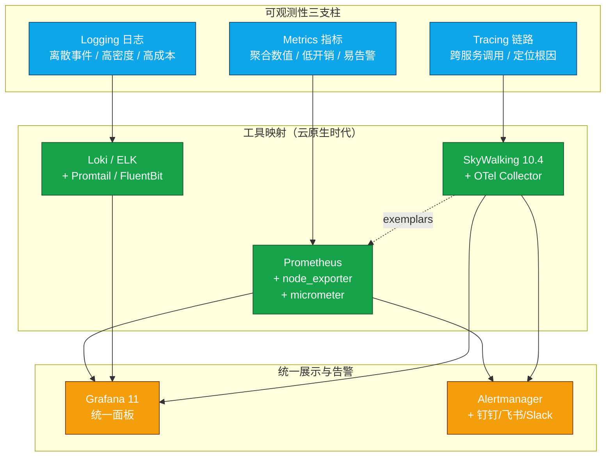
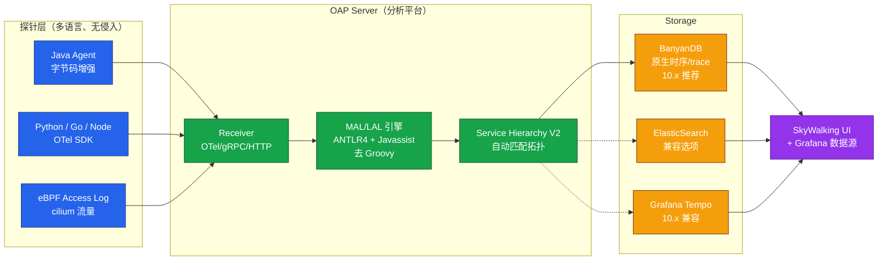

# 后端性能监控（Prometheus 与 Grafana 与 SkyWalking 10）

后端性能测试不仅要回答"系统能撑多少并发"，更要回答"瓶颈在哪一层、哪一个服务、哪一段调用"。在微服务、容器化、云原生已经成为主流的今天，单靠 `top`、`iostat` 这类命令行工具已经无法覆盖一次跨服务请求所经过的全部链路。本文基于 Prometheus 2.x、Grafana 11、SkyWalking 10.4.0（2026-04-01 发布）、OpenTelemetry 1.x 等当前主流工具链，系统梳理后端性能监控的体系与方法论，取代旧文档中基于 SkyWalking 8.0.1 + CentOS 7.0 的内容。

需要特别说明的是：SkyWalking 已于 2019 年 4 月从 Apache 孵化器毕业成为顶级项目，至今已 7 年。旧文档中"项目已经提交到 Apache 孵化组织"的表述已经过时，本文统一按当前状态描述。

## 一、核心概念

### 1.1 后端性能监控的目标

后端性能监控的核心目标是建立**从硬件表象到代码根因的可观测链路**，回答四个层次的问题：

- **资源层**：CPU、内存、磁盘 IO、网络是否异常，TPS 量级与资源消耗的对应关系；
- **系统层**：连接数、超时、丢包、拒绝请求等系统瓶颈信号；
- **链路层**：跨服务调用耗时分布、调用拓扑、慢调用与错误调用所在节点；
- **业务层**：在高并发下业务逻辑是否仍正常（如库存是否被异常扣减、是否触发限流）。

只有贯通这四层，才能避免"看到一个高 CPU 就重启服务"的运维式短路。

### 1.2 可观测性三支柱

现代可观测性（Observability）以三支柱为骨架，三者通过统一的 TraceID 串联：

- **Metrics（指标）**：聚合数值，回答"发生了什么、量级多大"，例如 QPS、P99 延迟、CPU 使用率。优势是开销低、易于告警，劣势是缺乏上下文；
- **Logging（日志）**：离散事件，回答"具体发生了什么"，包含完整上下文字段。优势是信息密度高，劣势是开销与存储成本；
- **Tracing（链路）**：跨进程调用链，回答"问题出在哪一段"。优势是能定位到具体服务与方法，劣势是实现成本高。

下图展示了三支柱与典型工具的映射关系，是本文后续章节的总览。



三支柱不是孤立的：SkyWalking 10.x 的 Trace Exemplar 可以将慢调用样本回填到 Prometheus 指标上，Grafana 11 支持从指标点直接下钻到 Trace 与 Log，形成"指标发现异常 → 链路定位服务 → 日志确认根因"的闭环。

## 二、监控工具的演进

理解工具演进有助于选型。后端监控大致经历三个阶段：

**第一阶段：命令行与系统工具（top / vmstat / iostat / sar）**

优势是零依赖、即时反馈、对单机定位极快；劣势是无法横向扩展到上百台机器、无法持久化、无法关联跨服务调用。它至今仍是排障的第一手工具，但已不是主力监控方案。

**第二阶段：APM 时代（CAT / SkyWalking / Pinpoint）**

随着微服务兴起，APM 工具解决了"一次请求跨多个服务"的追踪问题。三者各有定位：

- **CAT**：由大众点评开源，**侵入式埋点**，强项是日志聚合与业务监控，适合需要业务指标的场景。当前社区活跃度已显著下降，新项目多不采用；
- **SkyWalking**：Apache 顶级项目（2019-04 毕业），**Java Agent 字节码增强无侵入**，社区活跃、生态最完整，是国内主流选择；
- **Pinpoint**：韩国 Naver 开源，无侵入、UI 详尽到方法级，但探针开销显著高于 SkyWalking，且社区更新节奏较慢，近年采用率下降。

**第三阶段：云原生时代（Prometheus + Grafana + OpenTelemetry）**

CNCF 体系将 Metrics 与 Tracing 拆为两条主线：Prometheus 主导 Metrics，OpenTelemetry 主导 Tracing 与 Logging 的统一采集。SkyWalking 10.x 已全面兼容 OTel 协议，可作为 OTel Collector 的后端。

## 三、命令行监控要点（精简版）

命令行工具的开销几乎为零，是性能测试现场第一时间排查的利器。下表只保留最高频的指标与判断阈值。

| 维度 | 命令 | 关键指标 | 经验阈值 |
|------|------|----------|----------|
| CPU | `top` | `load average`、`%us`、`%sy`、`%wa`、`%id` | load / 核数 ≤ 0.7；`%wa` 长期 > 0.5% 须关注磁盘 |
| CPU 队列 | `vmstat 1` | `r` 列（运行队列）、`cs`（上下文切换） | `r` > 核数 × 2 持续告警 |
| 内存 | `free -m` | `available` | `available` < 总内存 15% 须关注 |
| 磁盘 IO | `iostat -x 1` | `%util`、`await`、`aqu-sz` | `%util` > 80% 且 `await` > 10ms 视为瓶颈 |
| 网络 | `iftop` / `sar -n DEV 1` | 收发带宽、丢包 | 接近网卡带宽 80% 须关注 |
| 连接 | `ss -s` / `netstat -an` | `TIME_WAIT` 数量、`Recv-Q`/`Send-Q` | `Recv-Q`/`Send-Q` 长期非 0 表示拥塞 |

典型命令组合示例：

```bash
# top：观察整体负载与 CPU 各状态（us/sy/wa/id）
# load average 三个值分别代表 1/5/15 分钟队列长度，
# 多核场景下需除以核数后再判断
# top - 18:17:47 up 158 days,  2 users,  load average: 0.07, 0.15, 0.21
# %Cpu(s):  3.9 us,  1.3 sy,  0.0 ni, 94.6 id,  0.2 wa,  0.0 hi,  0.0 si,  0.0 st


# vmstat：每秒采样，关注 r（运行队列）与 cs（上下文切换）
# r 持续大于 CPU 核数说明 CPU 已饱和
vmstat 1
# procs -----------memory---------- ---swap-- -----io---- -system-- ------cpu-----
#  r  b   swpd   free   buff  cache   si   so    bi    bo   in   cs us sy id wa st

# iostat：磁盘扩展视图，%util 接近 100% 即满载
# 注意：旧指标 svctm 已被 sysstat 12.x 移除，重点关注 await 与 aqu-sz
iostat -x 1
# Device  rrqm/s  wrqm/s  r/s  w/s  await  aqu-sz  %util
# vda     0.00    0.29    0.57 5.30 11.53  0.07    0.69
```

> **注意**：旧文档提到的 CentOS 7.0 已于 2024-06 EOL，当前推荐使用 CentOS Stream 9 或 Ubuntu 22.04 LTS 作为监控目标与运行环境。

## 四、Prometheus + Grafana 监控体系

### 4.1 架构与组件

Prometheus 是 CNCF 第二个毕业项目（仅次于 Kubernetes），其拉模型（Pull）与多维度标签数据模型已成为云原生监控的事实标准。核心组件：

- **Prometheus Server**：时序数据库 + 抓取引擎，按 `scrape_interval` 主动拉取 Exporter 暴露的 `/metrics`；
- **Exporter**：被监控目标的指标暴露器，`node_exporter` 监控主机、`mysqld_exporter` 监控 MySQL、`micrometer` 通过 JVM 暴露应用指标；
- **Alertmanager**：告警路由、抑制、分组、静默，对接钉钉/飞书/Slack；
- **Grafana**：可视化层，支持 Prometheus、Loki、Tempo、SkyWalking 等多数据源。

### 4.2 抓取配置示例

`prometheus.yml` 的核心是 `scrape_configs`，下面示例同时抓取主机、MySQL 与一个 Spring Boot 应用：

```yaml
# prometheus.yml —— Prometheus 抓取配置
global:
  scrape_interval: 15s          # 默认每 15 秒抓取一次
  evaluation_interval: 15s      # 告警规则每 15 秒评估一次

# 告警规则文件
rule_files:
  - "rules/*.yml"

# Alertmanager 地址
alerting:
  alertmanagers:
    - static_configs:
        - targets: ['alertmanager:9093']

# 抓取目标
scrape_configs:
  # 主机资源监控
  - job_name: 'node'
    static_configs:
      - targets: ['node-exporter:9100']
        labels:
          env: 'prod'

  # MySQL 监控
  - job_name: 'mysql'
    static_configs:
      - targets: ['mysql-exporter:9104']

  # Spring Boot 应用（通过 micrometer 暴露 /actuator/prometheus）
  - job_name: 'order-service'
    metrics_path: '/actuator/prometheus'
    static_configs:
      - targets: ['order-service:8080']
```

### 4.3 PromQL 查询示例

PromQL 是 Prometheus 的查询语言，掌握下面几个常用模式即可覆盖 80% 场景：

```promql
# 1. CPU 使用率：100 减去空闲率（按 5 分钟平均）
# ignore(mode) 表示在相减时忽略 mode 标签
100 - (avg by (instance) (rate(node_cpu_seconds_total{mode="idle"}[5m])) * 100)

# 2. HTTP 接口 P99 延迟（直方图分位数）
histogram_quantile(0.99, sum by (le) (rate(http_request_duration_seconds_bucket[5m])))

# 3. 接口错误率：5xx 请求 / 总请求
sum(rate(http_requests_total{status=~"5.."}[5m]))
  / sum(rate(http_requests_total[5m]))

# 4. JVM 堆内存使用率
jvm_memory_used_bytes{area="heap"}
  / jvm_memory_max_bytes{area="heap"}
```

### 4.4 Grafana 大屏

Grafana 的优势是数据源无关与面板可复用：同一张大盘可以同时叠加 Prometheus（指标）、Loki（日志）、SkyWalking（链路）三个数据源。官方模板库（grafana.com/dashboards）提供了 `Node Exporter Full`（ID 1860）、`Spring Boot Statistics`（ID 11378）等成熟模板，导入即可使用，无需从零搭建。

## 五、SkyWalking 10.4.0 分布式链路追踪

### 5.1 架构总览

SkyWalking 10 的架构仍保持 `Agent → OAP Server → Storage → UI` 的四段式，但每一层在 10.x 都有显著升级。下图展示了完整架构：



### 5.2 与 Pinpoint、CAT 的对比（2026 年现状）

| 维度 | SkyWalking 10.4 | Pinpoint 2.5 | CAT 3.x |
|------|-----------------|--------------|---------|
| 侵入性 | 字节码增强，无侵入 | 字节码增强，无侵入 | 需代码埋点 |
| 协议 | OTel 原生兼容 | 私有协议 | 私有协议 |
| 存储 | BanyanDB（原生）/ ES / Tempo | HBase | MySQL |
| 社区活跃度 | 高（Apache 顶级，月度发布） | 低（年更） | 低（基本停滞） |
| 云原生 | K8s 集成、eBPF、Service Mesh | 弱 | 弱 |
| GenAI 可观测 | 10.x 原生支持 | 不支持 | 不支持 |

结论：SkyWalking 10 是当前中文社区最值得投入的 APM。Pinpoint 仍可作为方法级追踪的可选项，但生态与更新节奏已落后；CAT 适合需要业务监控的存量系统，新项目不建议采用。

### 5.3 10.x 关键新特性

**1. GenAI Observability（AI 应用可观测性）**

随着 LLM 应用爆发，SkyWalking 10 原生支持 AgentScope、A2A（Agent-to-Agent）、MCP（Model Context Protocol）、Spring AI Alibaba 等 AI 框架的可观测，可以追踪一次 LLM 调用的 prompt 长度、token 消耗、模型耗时、工具调用链，是旧版本完全没有的能力。

**2. 去除 Groovy 依赖**

MAL（Metric Analysis Language）、LAL（Log Analysis Language）、Hierarchy V2 引擎从 Groovy 改用 ANTLR4 + Javassist，避免运行时编译开销。官方基准显示部分场景性能提升 2.6–39 倍，同时消除了 Groovy 安全漏洞面。

**3. BanyanDB 作为原生存储**

旧版本默认使用 H2 或 ElasticSearch，BanyanDB 是 SkyWalking 自研的时序与 trace 原生存储，针对可观测数据特征优化，10.x 起成为官方推荐选项。ES 仍作为兼容选项保留。

**4. eBPF Access Log**

通过 cilium 的 eBPF 能力，无需 Agent 即可采集网络层访问日志，适合无法注入 Agent 的基础设施组件（如 Service Mesh sidecar、网关）。

**5. Grafana Tempo 兼容**

10.x 提供与 Grafana Tempo 兼容的查询 API（支持 TraceQL），Grafana 可直接查询 SkyWalking 的 trace 数据，便于与 Prometheus 指标通过 exemplar 联动。

**6. Service Hierarchy 自动匹配**

Hierarchy V2 自动识别跨注册中心、跨命名空间的服务依赖关系，无需手动配置拓扑。

**7. Java 21 runtime**

OAP Server 支持在 Java 21 上运行，可享受 ZGC、虚拟线程等收益。

### 5.4 Agent 启动示例

SkyWalking Agent 仍以 `-javaagent` 形式挂载，10.x 的参数与 8.x 基本兼容：

```bash
# 启动微服务并挂载 SkyWalking Agent
# -javaagent: 指向 agent 全路径
# agent.service_name: 在 OAP 中注册的服务名
# agent.collector.backend_service: OAP gRPC 地址（默认 11800）
# agent.sample: 采样率，精度为 1/10000（10000 即全量采样，1000 即 10%）
nohup java -server \
  -Xms512m -Xmx512m \
  -javaagent:/opt/skywalking-agent/skywalking-agent.jar \
  -Dskywalking.agent.service_name=order-service \
  -Dskywalking.collector.backend_service=oap:11800 \
  -Dskywalking.agent.sample=1000 \
  -jar order-service.jar > order-service.log 2>&1 &
```

## 六、OpenTelemetry 统一可观测

OpenTelemetry（OTel）是 CNCF 主导的可观测数据采集标准，目标是统一 Metrics、Logging、Tracing 三类数据的采集与上报协议，避免被厂商锁定。

### 6.1 OTel 与 SkyWalking / Prometheus 的关系

三者不是竞争而是分工：

- **OTel SDK / Collector**：负责数据采集与转发，本身不提供存储与展示；
- **Prometheus**：Metrics 的存储与查询后端，可直接抓取 OTel Collector 暴露的指标；
- **SkyWalking 10**：Tracing 与 Logging 的存储分析后端，原生支持 OTLP 协议接入。

典型部署是 `应用 → OTel SDK → OTel Collector → (Prometheus / SkyWalking / Loki)`， Collector 做协议转换、采样、重试、脱敏。这种架构下，更换后端只需改 Collector 配置，应用代码零改动。

### 6.2 何时该引入 OTel

满足以下任一条件时，引入 OTel 的收益明显大于成本：

- 多语言微服务（Java + Go + Python + Node），希望用同一套探针协议；
- 需要同时接入多个后端（如 SkyWalking 看链路、Prometheus 看指标、Loki 看日志）；
- 希望避免厂商锁定，保留未来替换 APM 的灵活性；
- 跨 Kubernetes 多集群，需要在边缘统一采集与采样后再回传中心。

纯 Java 单体或小规模微服务，直接用 SkyWalking Java Agent 更简单，无需引入 OTel，否则会增加一层 Collector 的运维成本而无对应收益。

### 6.3 OTel Collector 部署要点

OTel Collector 推荐以 Agent 模式（DaemonSet）部署在每个节点，负责本节点应用的指标、日志、链路采集与转发。关键配置原则有三：一是 `memory_limiter` 必须开启，否则在高负载下 Collector 自身会 OOM；二是 `batch` processor 不可省略，单条上报会拖垮后端；三是 `tail_sampling` processor 应放在 Collector 层而非 SDK 层，这样可以基于完整链路做采样决策（如只保留包含错误状态的 trace），而 SDK 层采样只能基于单条 span 决策，容易漏掉关键链路。

## 七、告警体系

### 7.1 Prometheus Alertmanager

Alertmanager 与 Prometheus 解耦，负责告警的去重、分组、抑制与路由。典型告警规则：

```yaml
# rules/service.yml —— Prometheus 告警规则
groups:
  - name: service-alerts
    rules:
      # 接口 P99 延迟超过 500ms 持续 3 分钟
      - alert: HighP99Latency
        expr: |
          histogram_quantile(0.99, sum by (le) (
            rate(http_request_duration_seconds_bucket[5m])
          )) > 0.5
        for: 3m
        labels:
          severity: warning
        annotations:
          summary: "{{ $labels.job }} P99 延迟超过 500ms"
          description: "当前值: {{ $value }}s"

      # 服务可用性低于 99% 持续 1 分钟
      - alert: LowAvailability
        expr: |
          sum(rate(http_requests_total{status!~"5.."}[5m]))
            / sum(rate(http_requests_total[5m])) < 0.99
        for: 1m
        labels:
          severity: critical
```

Alertmanager 路由到飞书/钉钉通常通过 webhook 转发，社区有 `prometheus-webhook-dingtalk`、`catalert` 等成熟组件。

### 7.2 SkyWalking 告警

SkyWalking 内置告警规则在 `config/alarm-settings.yml`，10.x 同样支持 webhook 推送。相比 Prometheus，SkyWalking 告警更聚焦链路维度，如"某服务 P99 持续超阈值"、"某端点错误率突增"。两者可以并存：Prometheus 负责资源与指标告警，SkyWalking 负责链路与端点告警。

```yaml
# config/alarm-settings.yml —— SkyWalking 10 告警规则片段
rules:
  # 服务响应 P99 超过 1s 持续 3 分钟
  service_resp_time_rule:
    metrics-name: service_resp_time
    threshold: 1000
    op: ">"
    period: 10
    count: 3
    silence-period: 5
    message: "服务 {name} 响应时间 P99 超过 1s"

webhooks:
  - http://alarm-bridge:8080/skywalking-alarm
```

## 八、常见陷阱与最佳实践

**陷阱一：只监控硬件，不监控链路。** CPU 高只是表象，必须能下钻到具体服务与方法。建议 Prometheus 与 SkyWalking 同时部署，前者看资源、后者看链路。

**陷阱二：采样率设置过高或过低。** SkyWalking 采样率过高会让 OAP 与存储压力陡增，过低会漏掉关键慢调用。生产建议 `agent.sample=1000`（万分比精度，即 10% 采样），异常链路通过 `status_code` 强制采样。

**陷阱三：告警风暴。** 没有分组与抑制的告警会让值班人员麻木。Alertmanager 必须配置 `group_by`、`group_wait`、`inhibit_rules`，避免同一根因触发几十条告警。

**陷阱四：监控覆盖不全。** 性能测试前必须画部署架构图，逐节点确认 Exporter 已部署。常见漏点是负载均衡、F5、防火墙等基础设施组件。

**陷阱五：Grafana 大屏堆砌指标。** 一张大盘超过 30 个面板会让人失焦。建议按"概览 → 服务详情 → 单实例"三层组织，概览只放 SLO 级指标（可用性、P99、错误率）。

**陷阱六：忽略 OpenTelemetry 的迁移成本。** OTel SDK 在多语言场景才显价值，纯 Java 项目强行替换 SkyWalking Agent 反而增加复杂度。

**最佳实践总结**：以 Prometheus + Grafana 为 Metrics 基座，以 SkyWalking 10 为 Tracing 主力，以 OTel Collector 作为统一采集层，以 Alertmanager + 飞书/钉钉为告警出口，命令行工具作为现场排障的兜底。这套组合在云原生时代既能覆盖三支柱，又保留了向后兼容与厂商中立。
