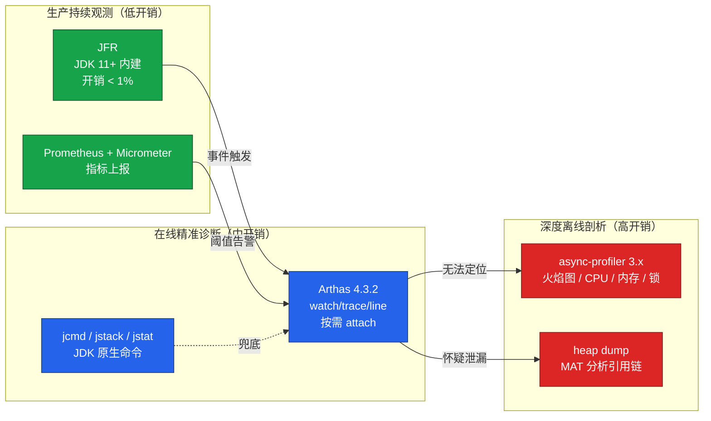
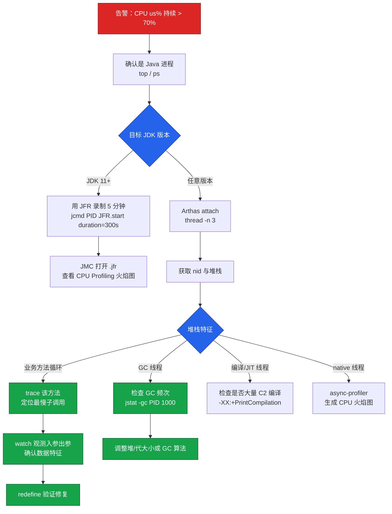

# JVM 性能分析（JFR 与 Arthas 4.3 与 async-profiler）

性能测试不仅要回答"系统能撑多少并发"，更要回答"瓶颈在哪里"。当吞吐量上不去、响应时间抖动、CPU 或内存异常时，瓶颈往往隐藏在 JVM 内部——某条热点调用链、某段失控的循环、某类未释放的对象。本文基于 JDK 17/21 LTS、Arthas 4.3.2、async-profiler 3.x、JFR 等当前主流工具链，系统梳理 JVM 性能分析的方法论与实战路径，取代旧文档中基于 JDK 1.8 + Arthas 3.3.3 的内容。

## 一、核心概念

### 1.1 JVM 性能分析的目标

JVM 性能分析并非"找一个慢方法"这么简单，它的核心目标是建立**从表象到根因的可追溯链路**：

- **资源层**：CPU、内存、GC、网络、磁盘 IO 是否异常；
- **线程层**：哪些线程在消耗 CPU，哪些线程在等待锁，哪些线程长期阻塞；
- **方法层**：哪段代码在执行、调用链路是什么、入参出参是什么；
- **对象层**：堆里哪些对象占用最多、谁持有引用、是否存在泄漏；
- **运行时层**：JVM 参数、类加载、JIT 编译是否合理。

只有贯通这五层，才能避免"看到一个高 CPU 就重启"的运维式短路。

### 1.2 方法论

性能分析遵循"先观测、再下钻、后验证"的三段式：

1. **观测**：用低开销工具持续采样（JFR、Arthas dashboard、Prometheus + Micrometer），形成基线；
2. **下钻**：在异常时刻用更精准的工具切入（Arthas watch/trace、async-profiler 火焰图、heap dump）；
3. **验证**：通过 `redefine` 热替换或重新压测复现，确认根因。

关键原则是**开销匹配场景**：生产环境优先选择 JFR 这类开销低于 1% 的工具；预发/压测环境可以放开 Arthas 的 watch/trace；线下排查才允许做 full heap dump。

## 二、工具链全景

不同工具定位不同，互为补充而非替代。下图展示了主流工具的适用场景与开销分布。



各工具的定位简述如下：

- **JFR（Java Flight Recorder）**：JDK 11 起开源、JDK 17/21 持续增强，是生产持续采样的首选。事件驱动模型，典型开销 1% 左右，可录制 30 分钟以上的飞行记录，再用 JDK Mission Control（JMC）离线分析。
- **Arthas 4.3.2**：阿里开源的在线诊断利器，按需 attach 到目标进程，适合"看到异常立刻下钻"的临时排查，支持方法级 watch/trace、热更新 redefine，4.x 新增 MCP 协议与 AI Agent。
- **async-profiler 3.x**：基于 AsyncGetCallTrace 的低开销采样器，可生成 SVG/HTML 火焰图，是 CPU/内存/锁分析的金标准，比 JFR 在 CPU 火焰图维度更直观。
- **JDK 原生命令**（jstack/jmap/jstat/jcmd）：兜底方案，几乎无依赖，但功能割裂、信息密度低，建议作为最后兜底而非首选。

## 三、Arthas 4.3.2 实战

### 3.1 安装与启动

旧文档使用的 `alibaba.github.io` 域名已迁至 `arthas.aliyun.com`，下载命令需更新为：

```bash
# 下载最新版 arthas-boot.jar（4.3.2，2026-07-19 发布）
curl -O https://arthas.aliyun.com/arthas-boot.jar

# 启动并选择目标 Java 进程
java -jar arthas-boot.jar
```

启动后会出现进程选择列表，输入序号回车即可 attach。若需直接指定 PID 可使用 `java -jar arthas-boot.jar <pid>`；通过 `--tunnel-server` 参数可接入 Arthas Tunnel Server，实现 Web 控制台远程操作。

### 3.2 核心命令速查

| 命令 | 用途 | 备注 |
|---|---|---|
| `dashboard` | JVM 全局大盘 | 线程、内存、GC、运行时信息一屏概览 |
| `thread -n 3` | 列出 CPU 占用最高的 3 个线程 | 自动换算 16 进制 nid |
| `thread -b` | 查找阻塞其他线程的线程 | 死锁排查利器 |
| `jad 类全名` | 反编译指定类 | 确认线上运行的就是期望版本 |
| `sc -d 类全名` | 查看类加载信息 | 包含 ClassLoader hash |
| `watch 类 方法 '{params,returnObj}'` | 观测方法入参出参 | 4.x 支持 `-x N` 控制展开层级 |
| `trace 类 方法` | 追踪方法内部调用链耗时 | `--skipJDKMethod` 过滤 JDK 调用；`options object-size-limit` 限制输出大小 |
| `vmtool --action getInstances` | 直接获取类实例 | 用于引用链分析 |
| `redefine 类.class` | 热替换字节码 | 无需重启验证修复 |
| `line --class 类 --method 方法 --line 行号` | 在源码行插入探针 | **4.x 新增**，下文详述 |

### 3.3 4.x 新特性

**（1）line 命令**

`line` 是 Arthas 4.x 最重要的新增能力之一。它允许在指定源码行插入探针，观察该行的局部变量、方法参数、表达式值与调用栈，而无需修改业务代码。传统 watch 只能观测方法边界，line 把观测点下沉到方法内部任意一行。

```bash
# 在 StressSceneController.timeCost 方法的第 42 行插入探针
# 输出该行的局部变量 cost 与当前对象，命中时打印调用栈
line --class com.cctest.controller.StressSceneController --method timeCost \
  --line 42 --express '{localVarMap["cost"], target}' --stack
```

**（2）MCP 协议与 AI Agent**

4.x 内置 MCP（Model Context Protocol）支持，Arthas 可作为 MCP Server 被大模型调用（需在 `arthas.properties` 中配置 `arthas.mcpEndpoint` 启用）。配合 Arthas Agent，可以直接用自然语言下指令，例如输入"帮我看下哪个线程 CPU 最高"，Agent 会自动转换为 `thread -n 3` 并返回结构化结果。在 AI 辅助排障场景下，建议改用非交互的批处理/命令模式减少交互噪音：

```bash
# 非交互执行命令（-c 传多条命令，dashboard 务必用 -n 限定次数）
java -jar arthas-boot.jar -c 'thread -n 3; dashboard -n 1'
```

**（3）classloader-metaspace 命令**

旧文档只能用 `sc -d` 看单个类的 ClassLoader，4.x 新增 `classloader-metaspace` 按实例维度统计 metaspace 占用，便于排查动态类加载导致的 metaspace 泄漏（如 Groovy 脚本、反射 Proxy）。

**（4）watch/trace 增强**

支持按 ClassLoader hash 过滤（`-c <hash>`），避免同名的多实例类混淆；返回数据大小由全局选项 `options object-size-limit`（默认 10MB）兜底限制，防止观测大对象时把 Arthas 自身打爆。

## 四、CPU 飙升定位流程

CPU 飙升是性能测试中最常见的现象。下图给出从告警到根因的完整决策树。



### 4.1 快速定位步骤

```bash
# 1. 在目标服务器找出 Java 进程 PID
top -c    # 记录 CPU 飙升的 java 进程 PID，例如 6937

# 2. 查看该进程内 CPU 最高的线程
top -Hp 6937    # 记录 TID，例如 25695

# 3. 转换为 16 进制（jstack 使用）
printf "%x\n" 25695    # 输出 645f

# 4. jstack 抓取该线程堆栈
jstack 6937 | grep 645f -A 30
```

但上面的"top + jstack"四步法在 JDK 17+ 已经被 Arthas 简化为一行：

```bash
# Arthas 直接列出 CPU 最高的 3 个线程及其堆栈
[arthas@6937]$ thread -n 3
```

`thread -n 3` 输出会自动换算 nid、展示线程名称、CPU 占比与完整堆栈，业务代码行直接高亮定位。

### 4.2 从堆栈到方法

拿到堆栈后按特征分类处理：

- **业务方法循环**：堆栈长时间停留在某个业务方法 → 用 `trace` 拆解内部调用链耗时：

```bash
# 追踪 StressSceneController.timeCost 的内部调用链
# 过滤掉 JDK 内部调用，只看耗时 > 10ms 的子调用
[arthas@6937]$ trace com.cctest.controller.StressSceneController timeCost \
    --skipJDKMethod true '#cost > 10'
```

输出会展示 `timeCost` → `cost1/cost2/cost3` 每一层的耗时占比，直接定位到 `cost3` 的 200 万次循环。

- **GC 线程**：堆栈频繁出现在 `GC Thread` → 用 `jstat` 看频次：

```bash
# 每秒采样一次，共 10 次，观察 YGC/FGC 增量
jstat -gc 6937 1000 10
```

若 FGC 在 10 秒内增加多次，基本可判断是老年代膨胀，需要进一步做内存分析。

- **JIT 编译线程**：堆栈在 `C2 CompilerThread` → 通常是大量热方法集中编译，等预热结束会缓解；若长期不缓解，需检查是否关闭了分层编译或方法过大。

- **Native 线程**：堆栈在 `lib*.so` → 用 async-profiler 生成 CPU 火焰图（见第六节）。

### 4.3 watch 精准观测

定位到方法后，用 `watch` 看真实入参出参，确认是数据特征触发的热点：

```bash
# 观察 login 方法的入参与返回值
# -x 2 表示展开 2 层对象属性
# -n 5 表示观察 5 次后自动停止
[arthas@6937]$ watch com.cctest.controller.StressSceneController login \
    '{params[0], params[1], returnObj}' -x 2 -n 5
```

## 五、内存分析流程

### 5.1 观测 GC 频次

`dashboard` 的 GC 区域可以一屏看到 YGC/FGC 次数与耗时；更细粒度的分析用 `jstat -gc <pid> <间隔> <次数>`，关注 FGC 是否持续增长、FGCT 是否线性上升。JDK 17/21 上推荐直接用 JFR：

```bash
# 启动 5 分钟 JFR 录制，包含 GC 事件
jcmd 6937 JFR.start name=mem-profile duration=300s \
    settings=profile filename=/tmp/mem.jfr
```

JMC 打开后可在"GC 配置""GC 暂停""GC 堆"三个视图交叉对比，比 jstat 的数字表格直观得多。

### 5.2 内存对象定位

Arthas 4.3.2 的 `dashboard` 直接展示 Eden/Survivor/Old/Metaspace 实时使用量，比 `jmap -heap` 更易读。如果要看对象维度分布：

```bash
# 按对象占用大小排序，top 20
[arthas@6937]$ vmtool --action getInstances \
    --className com.cctest.entity.User --limit 20

# 或使用原生命令
jmap -histo 6937 | head -n 20
```

`jmap -histo` 输出中 `[C`/`[B`/`[I` 分别表示 char[]、byte[]、int[]，业务类（如 `com.cctest.entity.User`）才是排查重点。如果某业务类实例数随压测时长线性增长且不回落，基本可判断为泄漏。

### 5.3 引用链分析

确认泄漏对象后，需要找到"谁持有它的引用"。最稳妥的方式是 dump 后用 MAT（Memory Analyzer Tool）分析：

```bash
# 触发 full GC 后 dump 堆，避免无效对象干扰
jcmd 6937 GC.run
jcmd 6937 GC.heap_dump /tmp/heap.hprof
```

Arthas 4.3.2 也可用 `vmtool` 直接在线查引用链，免去 dump 大文件：

```bash
# 查找持有 User 实例的所有对象
[arthas@6937]$ vmtool --action getInstances \
    --className com.cctest.entity.User \
    --express 'instances.size()'
```

### 5.4 classloader-metaspace 排查

对于动态生成类的场景（Groovy、CGLib、反射 Proxy），堆没涨但 metaspace 涨，需要用 4.x 新命令：

```bash
# 按 ClassLoader 实例统计 metaspace 占用
[arthas@6937]$ classloader-metaspace
```

输出会列出每个 ClassLoader 实例加载的类数与 metaspace 占用，定位到具体的脚本引擎或框架。

## 六、火焰图分析

### 6.1 什么是火焰图

火焰图（Flame Graph）由 Brendan Gregg 提出，把采样得到的所有调用栈画成一堆"火苗"：

- **横轴**：方法在采样中出现的次数（不代表时间顺序）；
- **纵轴**：调用栈深度，底部是入口，顶部是叶子；
- **宽度**：该方法在采样中的占比，越宽越"热"。

读图口诀是"找最宽的平顶"。火焰图把"top -Hp + jstack + 脑内拼接堆栈"的过程一次性可视化，是 CPU/锁/内存分析的金标准。

### 6.2 async-profiler 3.x 实战

async-profiler 3.x 支持 CPU、Alloc（内存分配）、Lock、Wall-clock、Cache Misses 等多种事件，输出格式包括 SVG、HTML、JFR。下面演示最常用的 CPU 火焰图：

```bash
# 1. 下载并解压 async-profiler 3.x
curl -L https://github.com/async-profiler/async-profiler/releases/download/v3.0/async-profiler-3.0-linux-x64.tar.gz | tar xz

# 2. 采样 60 秒 CPU，输出 HTML 火焰图
./profiler.sh -d 60 -f /tmp/cpu.html 6937

# 3. 采样内存分配热点（单位：字节）
./profiler.sh -e alloc -d 60 -f /tmp/alloc.html 6937

# 4. 采样锁竞争
./profiler.sh -e lock -d 60 -f /tmp/lock.html 6937
```

3.x 相对旧版的关键改进包括：原生支持 Apple Silicon（arm64 macOS）、内置 JFR 输出可与 JFR/JMC 互补、HTML 报告交互更友好（支持搜索、缩放、子树聚焦）、`--reverse` 反向火焰图便于从叶子节点回溯调用方。

### 6.3 JFR 的火焰图

JFR 在 JDK 17/21 上也能生成火焰图，且开销更低，适合生产持续采样：

```bash
# 启动 5 分钟 CPU profile 录制
jcmd 6937 JFR.start name=cpu duration=300s \
    settings=profile filename=/tmp/cpu.jfr

# JMC 打开后 View → Flame Graph，或用 jfr2flame 工具转 SVG
java -jar jfr2flame.jar /tmp/cpu.jfr /tmp/cpu.svg
```

JFR 与 async-profiler 的取舍：生产持续观测优先 JFR（开销低、事件全），异常时刻的精准剖析用 async-profiler（采样精度更高、火焰图更直观）。

## 七、常见陷阱与最佳实践

### 7.1 常见陷阱

- **生产环境直接 `jmap -dump`**：full dump 会触发 STW，几 GB 的堆可能停顿数十秒。生产环境务必使用 `jcmd PID GC.heap_dump` 或 JFR 的对象分配采样。
- **Arthas watch 大对象未限制大小**：4.x 之前 `watch` 观测大 List 会把 Arthas 自身的 console 线程打爆，必须用 `-x` 限制展开层级（输出大小另由全局选项 `options object-size-limit` 兜底）。
- **JFR 默认 settings=profile 仍偏重**：在低延迟（P99 < 10ms）场景下，profile 配置可能引入 2-3% 开销，应切到 `settings=default`。
- **未关闭 Arthas attach**：Arthas attach 会持续占用一个端口（默认 3658），生产排查后应及时 `stop` 退出，避免端口与字节码增强残留。
- **火焰图采样时长过短**：低于 30 秒的火焰图统计意义不大，建议至少采样 60 秒以上，让热方法充分显现。
- **top -Hp 看到的 nid 与 jstack 不一致**：容器化场景下 PID namespace 隔离会导致宿主机 PID 与容器内 nid 不对应，需用 `jstack` 自带的 nid 列对齐。

### 7.2 最佳实践

- **生产常驻 JFR**：用 `jcmd PID JFR.start name=continuous settings=default maxage=24h maxsize=100m disk=true filename=/var/log/jfr/app.jfr` 常驻录制，遇到问题随时 `JFR.dump` 取最近 24 小时。
- **建立性能基线**：每次发版后跑一次标准压测，用 async-profiler 生成基线火焰图存档，发现性能回退时与基线 diff。
- **Arthas 命令脚本化**：把常用排查命令写成 `.arthas` 脚本，用 `java -jar arthas-boot.jar -f diag.arthas` 批量执行，避免手工输入错误。
- **JDK 17/21 优先使用 ZGC/Shenandoah**：低延迟场景下，G1 的 STW 仍是热点；ZGC 在 JDK 21 上已支持分代，亚毫秒级停顿，配合 JFR 的 GC 事件可以做到无感切换。
- **告警与工具联动**：Prometheus 告警触发后自动调用 Arthas Agent（4.x MCP 协议）执行 `thread -n 3` 与 `dashboard` 快照，把"先抓现场"自动化，避免错过偶发问题的第一现场。

## 小结

JVM 性能分析不是单一工具的胜利，而是工具链的协作：JFR 负责持续观测、Arthas 4.3.2 负责在线精准下钻、async-profiler 负责深度剖析、JDK 原生命令作为兜底。掌握这套工具链，配合"观测 → 下钻 → 验证"的方法论，就能把过去靠经验、靠重启、靠瞎猜的排障过程，转化为可复现、可追溯、可验证的工程化流程。
