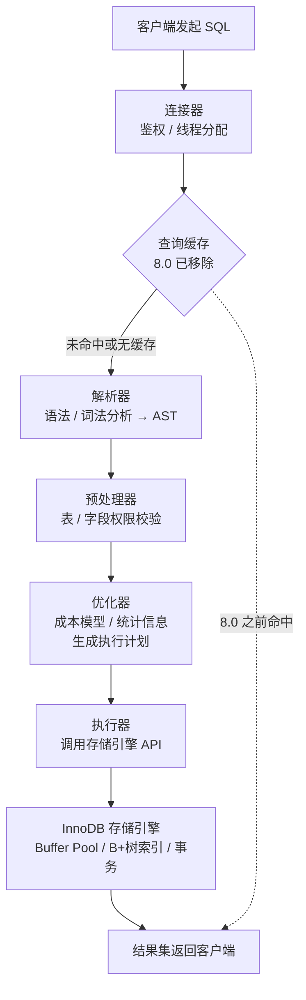
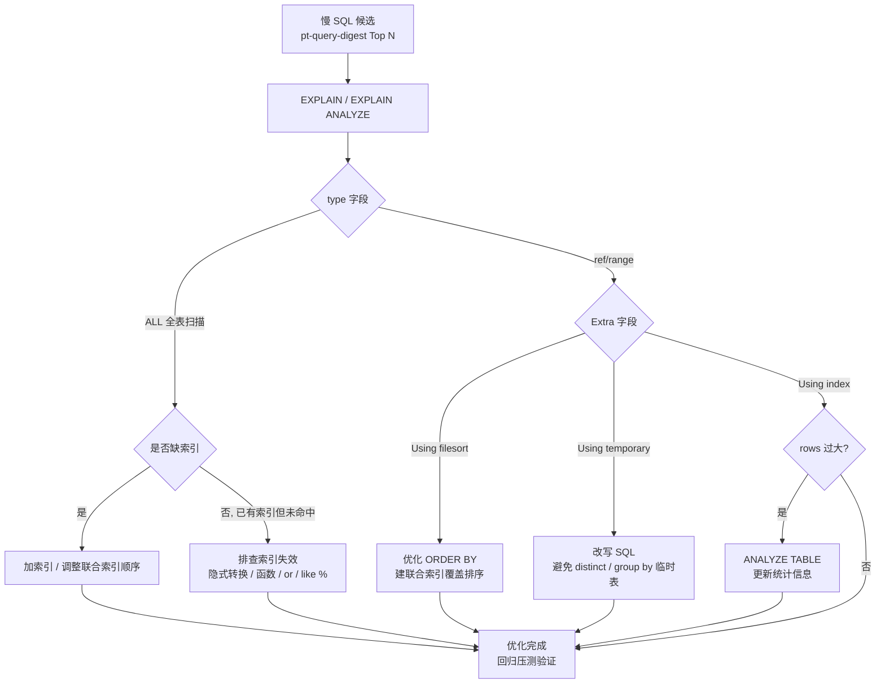

# MySQL 性能优化与慢 SQL 治理

数据库往往是企业应用链路中"最难横向扩展"的一环，也是性能测试中最容易暴露瓶颈的环节。本文基于 **MySQL 8.4 LTS（2024 发布）** 与创新版 **9.x**，系统梳理性能优化的方法论、索引设计、执行计划分析、慢 SQL 治理全流程，以及架构层优化方案。旧文档基于 MySQL 5.0/5.7，而 5.7 已于 **2023 年 10 月 EOL**，本文完全替换为 8.x 体系下的实践。

## 一、核心概念：性能优化的方法论与层次

### 1.1 五层优化模型

MySQL 性能优化遵循"**由近及远、由软及硬**"的漏斗原则，从上到下投入产出比依次递减：

1. **SQL 与索引**：每天迭代，单条改写收益可达数十倍；
2. **Schema 与表结构**：字段类型、反范式化、表分区；
3. **配置参数**：Buffer Pool、连接数、并行度；
4. **架构层**：读写分离、分库分表、缓存前置；
5. **硬件层**：CPU、内存、NVMe SSD、网络。

绝大多数线上问题集中在第一层，也是测试工程师与开发同学最常介入的层面。**永远不要先动硬件**——这是性能调优的铁律。

### 1.2 MySQL 查询执行流程

理解 SQL 在服务端如何被解析、优化、执行，是判断"为什么会慢"的前提。下图展示了从客户端发起到结果返回的关键阶段：



**关键变化**：MySQL 8.0 已彻底移除查询缓存（Query Cache），原因是其在高并发与高更新场景下反而成为锁竞争热点，命中率极低。对应策略是将缓存前置到 Redis 层。

## 二、索引优化

### 2.1 B+树与 InnoDB 索引结构

InnoDB 的索引基于 B+树，核心特征为：

- **非叶子节点只存键值与指针**，单页可容纳上千个键，树高通常 3~4 层即可覆盖亿级数据；
- **叶子节点用双向链表连接**，范围扫描只需顺序遍历，无需回溯上层；
- **聚簇索引**：主键索引的叶子节点存储完整行数据，一张表只有一个；
- **二级索引**：叶子节点存储主键值，查询需要的列不在索引内时需**回表**。

### 2.2 最左前缀与联合索引

联合索引 `(c1, c2, c3)` 等价于同时为 `(c1)`、`(c1,c2)`、`(c1,c2,c3)` 三种前缀建立索引。**最左前缀**指的是索引匹配从最左列开始，但优化器会自动调整 AND 条件的顺序，所以 `WHERE c2='2' AND c1='1'` 仍可命中。

```sql
-- 建立联合索引：先过滤后排序的经典场景
ALTER TABLE cctester ADD INDEX idx_subject_score_name(subject, score, name);

-- 以下查询既能走索引过滤，又省去了 filesort
-- 因索引中 subject 相同的数据已按 score 有序
SELECT name, subject, score FROM cctester
WHERE subject = 'english' ORDER BY score;
-- Extra 显示 Using index，覆盖索引 + 避免排序
```

### 2.3 覆盖索引与回表

若 SELECT 的列全部包含在索引中，称为**覆盖索引**，可在 Extra 中看到 `Using index`，避免回表 IO。设计索引时应优先让高频查询的 SELECT 列落入联合索引覆盖范围。

### 2.4 索引下推（ICP）

MySQL 5.6 引入的 Index Condition Pushdown，在 8.x 中已成为默认行为。它在**存储引擎层**对联合索引的多列条件进行过滤，减少回表次数。

```sql
-- 联合索引 (a, b)
SELECT * FROM t WHERE a = '1' AND b LIKE '%xyz%';
-- 无 ICP：通过 a 定位后所有行回表再过滤 b
-- 有 ICP：在索引层即对 b 进行 like 过滤，只对满足的行回表
```

### 2.5 不可见索引（Invisible Index）

MySQL 8.0 引入，可用于"**软下线**"索引而不实际删除，便于回滚：

```sql
-- 将索引置为不可见，优化器不再选择它
ALTER TABLE t ALTER INDEX idx_old INVISIBLE;

-- 观察一段时间确认无影响后，再正式删除
ALTER TABLE t DROP INDEX idx_old;

-- 如发现问题，秒级恢复
ALTER TABLE t ALTER INDEX idx_old VISIBLE;
```

### 2.6 降序索引

MySQL 8.0 真正支持降序索引（5.7 仅语法支持但实际仍按升序存储），对 `ORDER BY ... DESC` 场景可避免反向扫描与 filesort：

```sql
CREATE INDEX idx_create_time_desc ON orders(create_time DESC, user_id ASC);
```

## 三、执行计划分析

### 3.1 EXPLAIN 字段详解

```sql
EXPLAIN SELECT * FROM orders WHERE user_id = 10086 ORDER BY create_time DESC;
```

| 字段 | 关键含义 | 性能关注点 |
| --- | --- | --- |
| `type` | 访问类型 | `ALL`（全表扫描）最差；`ref`/`range` 较好；`const`/`system` 最佳 |
| `key` | 实际使用的索引 | NULL 表示未走索引，需重点排查 |
| `key_len` | 索引使用的字节数 | 判断联合索引用到了几列 |
| `rows` | 预估扫描行数 | 越接近 1 越好，大值需警惕 |
| `filtered` | 过滤后剩余比例 | 100 最佳，过低说明扫描浪费 |
| `Extra` | 附加信息 | `Using filesort`/`Using temporary` 需立即优化 |

### 3.2 EXPLAIN ANALYZE（8.0.18+）

`EXPLAIN ANALYZE` 会**真正执行** SQL 并输出实际耗时，是判断"优化器预估是否准确"的利器：

```text
-> Index lookup on orders using idx_user (user_id=10086) (cost=12.3 rows=10) (actual time=0.18..0.42 rows=8 loops=1)
    -> Sort: orders.create_time DESC, limit input: 8 rows served by endpoint (actual time=0.5..0.5 rows=8 loops=1)
```

`cost=... rows=10` 是预估，`actual time=... rows=8` 是实测。两者差距过大说明统计信息过期，应执行 `ANALYZE TABLE`。

### 3.3 SET_VAR Hint（8.4 增强）

8.4 LTS 增强了 `SET_VAR` 优化器 hint，可针对单条 SQL 临时调整参数，不影响全局：

```sql
-- 单条 SQL 临时调大 sort_buffer_size
SELECT /*+ SET_VAR(sort_buffer_size = 8M) */
       * FROM big_table WHERE category = 'A' ORDER BY create_time;
```

## 四、慢 SQL 治理全流程

### 4.1 慢查询日志采集

```ini
# my.cnf 关键配置
slow_query_log = 1
slow_query_log_file = /data/mysql/mysql-slow.log
long_query_time = 1          # 超过 1s 即记录，互联网业务建议 ≤0.5
log_queries_not_using_indexes = 1   # 未走索引的 SQL 也记录
min_examined_row_limit = 100        # 扫描少于 100 行不记录，减少噪音
```

实时排查则用 `SHOW FULL PROCESSLIST`，重点关注 `State` 列：长时间停留在 `Sending data`、`Copying to tmp table`、`Sorting result` 都是危险信号。

### 4.2 pt-query-digest 聚合分析

`mysqldumpslow` 功能较弱，Percona Toolkit 的 `pt-query-digest` 是事实标准：

```bash
# 按指纹聚合慢日志，输出 Top SQL 及其统计
pt-query-digest /data/mysql/mysql-slow.log > slow_report.txt

# 仅分析最近 1 小时
pt-query-digest --since 1h /data/mysql/mysql-slow.log

# 直接从 processlist 实时采样
pt-query-digest --processlist h=127.0.0.1,u=root,p=xxx --interval 1
```

输出重点关注：**总耗时占比、平均执行时长、扫描行数与返回行数的比值**。`Rows examined / Rows returned` 大于 100 通常意味着索引设计有问题。

### 4.3 慢 SQL 治理决策树



### 4.4 典型改写案例

```sql
-- ① 隐式类型转换：score 为 varchar，忘加引号导致全表扫描
-- 错误：SELECT * FROM t WHERE score = 99;
-- 正确：
SELECT * FROM t WHERE score = '99';

-- ② OR 改 UNION ALL，让两段都能走各自的索引
SELECT * FROM t WHERE name = 'allen'
UNION ALL
SELECT * FROM t WHERE score = '456';

-- ③ 深分页优化：LIMIT 1000000, 20 改为延迟关联
SELECT t.* FROM t
INNER JOIN (
    SELECT id FROM t ORDER BY create_time DESC LIMIT 1000000, 20
) tmp ON t.id = tmp.id;

-- ④ 利用覆盖索引避免 count(*) 全表
-- 错误：SELECT COUNT(*) FROM orders WHERE status = 'paid';
-- 若 (status) 已有索引，Extra 应为 Using index，无需回表
```

## 五、MySQL 8.x 性能特性

### 5.1 Hash Join（8.0.18+）

之前 MySQL 只支持 Nested Loop Join，无索引的等值关联极其缓慢。8.0.18 引入 Hash Join 作为兜底，9.x 进一步优化。对于无法走索引的 `JOIN ... ON a.col = b.col`，性能可提升数倍到数十倍。但仍应优先补索引，Hash Join 只是"无索引时的安全网"。

### 5.2 Skip Scan（8.0.13+）

联合索引 `(a, b)` 在 `a` 缺失的情况下，若 `a` 的基数较低，优化器可对 `a` 的每个取值分别扫描 `b`，从而利用索引。避免了"必须把 a 放进 WHERE"的硬性约束。

### 5.3 并行查询（InnoDB Parallel Read）

InnoDB 并行读自 **8.0.14** 起引入（`innodb_parallel_read_threads`），8.4/9.x 持续增强，针对大表全表扫描、COUNT(*) 聚合等场景：

```sql
-- 通过参数开启
SET innodb_parallel_read_threads = 8;
SELECT COUNT(*) FROM big_table WHERE create_time BETWEEN '2024-01-01' AND '2024-12-31';
```

注意：并行查询对**短查询和 OLTP 场景几乎无效**，甚至因线程调度开销变慢，它面向的是分析型大查询。

### 5.4 统计信息持久化

8.x 默认将统计信息持久化到 `mysql.innodb_table_stats` 与 `innodb_index_stats`，避免每次重启后计划抖动。可手动触发：

```sql
ANALYZE TABLE orders UPDATE HISTOGRAM ON user_id WITH 100 BUCKETS;
ANALYZE TABLE orders DROP HISTOGRAM ON user_id;
```

直方图（Histogram）让优化器对数据分布有更准确的认知，尤其适合"列上无索引但分布极不均匀"的场景。

## 六、架构层优化

### 6.1 读写分离

主库承担写，从库承担读。常见中间件：

- **ProxySQL**：轻量、SQL 路由能力强；
- **MySQL Router 8.4**：官方出品，配合 Group Replication / InnoDB Cluster；
- **ShardingSphere-Proxy**：兼顾分库分表与读写分离。

注意从库延迟问题：强一致读必须走主库，可通过事务内强制主库或会话变量 `session_track_gtids` 控制。

### 6.2 分库分表

单表数据超过 1000 万或单库超过 100GB 时应考虑分片。主流方案：

| 方案 | 定位 | 特点 |
| --- | --- | --- |
| **ShardingSphere-JDBC** | 客户端分片 | 无中间层，性能高，Java 生态原生 |
| **ShardingSphere-Proxy** | 代理分片 | 多语言友好，运维集中 |
| **Vitess / PlanetScale** | 云原生分片 | 源自 YouTube，MySQL 协议兼容，支持在线 Schema 变更 |
| **MyCAT** | 代理分片 | 老牌方案，社区活跃度下降 |

分片键选择是**一次性决策**，常见陷阱：按自增 ID 取模导致热点、按时间分片导致写入热点。建议按业务维度（如 user_id）哈希分片，并预留扩容倍数。

### 6.3 缓存层

热点数据前置到 Redis，能将 QPS 从 MySQL 的数千提升到 Redis 的数十万。设计要点：

- **缓存穿透**：布隆过滤器拦截不存在的 Key；
- **缓存击穿**：热 Key 加互斥锁或逻辑过期；
- **缓存雪崩**：过期时间随机化，多级缓存兜底；
- **一致性**：先更新 DB 再删缓存（Cache Aside），结合 binlog 订阅做最终一致。

### 6.4 MySQL HeatWave（云端 OLAP 加速）

HeatWave 是 MySQL 8.0.25 起在 OCI（Oracle Cloud）推出的内存列存加速引擎，2024 后逐步支持 AWS / Azure。它将 OLAP 查询下推到分布式内存节点，对 AP 查询加速可达数百倍，且无需 ETL。适合"既要 OLTP 又要轻量 OLAP"的场景，是 2024-2026 年云原生 MySQL 的标志性能力。

## 七、监控与持续治理

### 7.1 监控三件套

- **mysqld_exporter + Prometheus + Grafana**：采集 `mysql_global_status_*`、`mysql_innodb_*` 等指标，关注 QPS、TPS、Slow Queries、Buffer Pool 命中率、连接数；
- **MySQL Enterprise Monitor**：Oracle 官方商业产品，提供查询分析与配置告警；
- **Percona PMM**：开源一体化平台，集成 QAN（Query Analytics）。

### 7.2 持续治理机制

1. **慢 SQL 日报**：每日定时跑 `pt-query-digest`，按总耗时 Top 10 自动派单；
2. **索引巡检**：每周扫描冗余索引（`sys.schema_unused_indexes`、`sys.schema_redundant_indexes`）；
3. **变更卡点**：DDL 上线前用 `pt-online-schema-change` 或 GitHub 的 `gh-ost` 在线变更；
4. **容量评估**：结合压测数据建立"单表行数 / 单库容量"红线。

## 八、常见陷阱与最佳实践

| 陷阱 | 表现 | 对策 |
| --- | --- | --- |
| 隐式类型转换 | 索引列被函数包裹或类型不匹配，索引失效 | 严格类型对齐，避免对索引列套函数 |
| `SELECT *` | 无法走覆盖索引，回表放大 | 明确列名，配合联合索引 |
| 深分页 | `LIMIT 1000000, 20` 扫描前 100 万行 | 延迟关联或基于游标分页 |
| 大事务 | 长事务持锁，引发锁等待与主从延迟 | 拆分小事务，避免跨 RPC 调用 |
| 索引冗余 | 联合索引 `(a,b)` 又单独建 `(a)` | 定期清理，用不可见索引验证 |
| `COUNT(*)` 误用 | InnoDB `COUNT(*)` 需要扫描 | 业务允许误差时用估算表或 Redis 计数 |
| 5.7 EOL 风险 | 2023.10 后无安全补丁 | 必须升级至 8.4 LTS，9.x 仅创新版用于尝鲜 |

### 最佳实践清单

1. **主键必为整型自增或有序**（如雪花 ID），避免 UUID 作主键导致 B+树页分裂；
2. **`TEXT`/`BLOB` 单独拆表**，避免主表行膨胀；
3. **`DATETIME(6)` 存储微秒级时间**，便于链路追踪对齐；
4. **业务 SQL 上线必过 EXPLAIN**，CI 集成 `explain-diff` 工具；
5. **慢查询阈值统一 ≤500ms**，并接入告警；
6. **DDL 走在线变更工具**，避开 metadata lock 阻塞；
7. **新索引先用不可见索引验证**，确认命中后再可见化；
8. **生产参数灰度发布**，`SET_VAR` 单 SQL 级验证后再 `SET GLOBAL`。

## 总结

MySQL 性能优化本质是"**把该走的索引走对、把不该扫的行不扫、把该分布的数据分布出去**"。从 SQL 到索引、到 Schema、到配置、再到架构，每一层都有对应的工具与方法论。MySQL 8.4 LTS 相较旧版 5.7，在 Hash Join、Skip Scan、并行查询、不可见索引、降序索引、SET_VAR Hint、EXPLAIN ANALYZE 等能力上有质的飞跃，再配合 pt-query-digest、Prometheus、ShardingSphere、Vitess、HeatWave 等生态工具，足以支撑从 OLTP 到轻量 OLAP 的全场景需求。

性能测试工程师的核心价值在于：**在压测中发现慢 SQL 候选，用 EXPLAIN/EXPLAIN ANALYZE 量化诊断，推动开发改写与索引调整，并通过监控建立持续治理闭环**——这正是"测试驱动性能优化"的真正落地。
