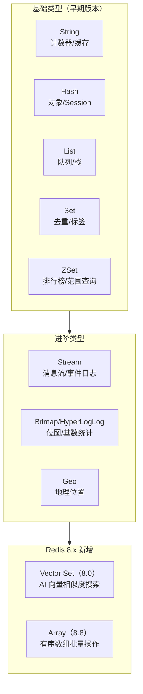
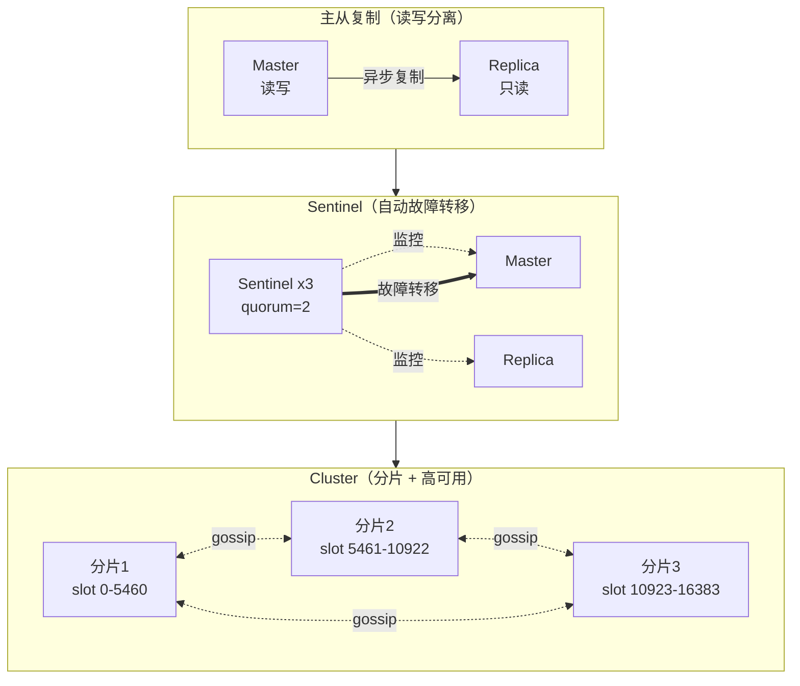

# Redis 8 性能调优（含 Vector Set）

Redis 已从单纯的"内存缓存"演进为多模数据存储平台。Redis 8.0 引入 Vector Set 数据结构、新 Hash 命令（HGETEX/HSETEX/HGETDEL）与增强 ACL，命令延迟较 Redis 7 降低 87%、副本节点内存节省 35%；Redis 8.8（2026 GA）进一步加入 Array 数据结构、Subkey Notification、INCREX 窗口限流、XNACK、ZUNION/ZINTER COUNT 聚合器等特性。本文基于 Redis 8.8 GA，系统讲解其在性能测试场景下的架构、调优、新特性实战与压测方法，取代旧文档中无版本号、`docker pull redis` 无标签的过时内容。

## 一、核心概念

### 1.1 Redis 在性能测试中的角色

性能测试中 Redis 通常扮演三种角色，调优方向各不相同：

- **被测系统（SUT）**：Redis 本身作为核心服务（如排行榜、计数器、向量检索、消息流），需要直接压测其 QPS、P99 延迟、内存占用与故障切换耗时。此时压测脚本直接对 Redis 发压，关注单线程模型下命令的处理瓶颈、数据结构编码切换带来的延迟抖动，以及持久化刷盘对吞吐的影响；
- **缓存层**：挡在 MySQL 等数据库前缓解热点读压力，压测目标是命中率、击穿防护与穿透防护。需要监控 `expired_keys`、`evicted_keys`、`keyspace_misses` 三类指标，并在压测中模拟缓存预热、热点倾斜、批量失效等真实场景；
- **限流器/分布式协调**：基于 INCR、Lua、Stream 实现令牌桶、漏桶、消息队列，压测关注原子性、延迟稳定性与主从一致性。限流场景下，主从延迟会导致 Replica 上的计数偏小从而放过超额流量，是压测必须验证的边界条件。

不同角色下，调优重心差异显著：被测系统关注命令吞吐与数据结构效率；缓存层关注淘汰策略与过期精度；限流器关注 Lua 执行延迟与主从一致性。明确角色是制定压测方案与选择监控指标的前提。

### 1.2 Redis 8 的关键变化

相比 Redis 7，Redis 8 的核心改进集中在三方面：

| 维度 | Redis 7 | Redis 8 |
|------|---------|---------|
| 数据结构 | String/Hash/List/Set/ZSet/Stream | 新增 Vector Set（8.0）、Array（8.8）|
| Hash 命令 | HSET/HGET/HDEL | 新增 HGETEX/HSETEX/HGETDEL |
| ACL | 基础用户/密码 | 增强 ACL，细粒度命令与通道权限 |
| 性能 | 基线 | 命令延迟降低 87%、副本内存节省 35% |
| AI 能力 | 依赖 RediSearch 模块 | 原生 Vector Set 内置 |

## 二、Redis 8.x 架构与数据结构

### 2.1 数据结构体系

Redis 8 的数据结构覆盖从基础 KV 到 AI 向量检索的完整链路，整体体系如下图：



### 2.2 部署 Redis 8.8

旧文档中 `docker pull redis` 未指定标签，在生产环境会导致版本漂移。Redis 8.8 应明确指定版本：

```bash
# 拉取 Redis 8.8 GA 镜像（明确版本，避免 latest 漂移）
docker pull redis:8.8

# 启动单机实例，开启 AOF 持久化与外网保护
docker run --name redis-8.8 \
  -p 6379:6379 \
  -v /data/redis:/data \
  -d redis:8.8 \
  redis-server --appendonly yes --requirepass "YourStrongPwd_2026"

# 客户端连接
docker exec -it redis-8.8 redis-cli -a "YourStrongPwd_2026"
```

### 2.3 新 Hash 命令

Redis 8.0 新增的 HGETEX/HSETEX/HGETDEL 把"带 TTL 的 Hash 字段"原子化，非常适合 Session 管理：

```
# 为字段设置过期时间（毫秒），无需拆分为 String + TTL
HSETEX session:u1001 PX 3600000 FIELDS 2 last_login 1735000000 device "iOS"

# 读取字段并删除，常用于一次性令牌
HGETDEL auth:token:abc FIELDS 1 valid
```

相比旧方案（把每个字段拆成独立 String 并单独 SETEX），新命令把对象语义保留在 Hash 内，减少 key 数量、降低内存碎片，同时字段过期由 Redis 内部统一调度，避免客户端轮询清理。

### 2.4 Array 数据结构（8.8 新增）

Redis 8.8 引入 Array 类型，提供有序数组的批量 PUSH/POP/INSERT/RANGE 操作，定位介于 List 与 ZSet 之间：相比 List 增加了按索引随机访问能力，相比 ZSet 去掉了分数排序开销。适合固定顺序的批次数据（如近期 N 条埋点、设备上报序列）。压测时需注意 Array 在百万级元素下的 RANGE 性能优于 List，但随机 INSERT 仍是 O(N)，不应在大数组上频繁中段插入。

## 三、性能调优

### 3.1 内存优化

- **编码选择**：Hash/List/ZSet 在元素较少时自动使用 listpack（7.0 起替代 ziplist），超过 `*-max-listpack-entries` 切换为 hashtable/skiplist。调大阈值可降低内存但增加单命令复杂度；
- **共享对象池**：小整数（0-9999）默认共享，避免重复分配；
- **主动碎片整理**：开启 `activedefrag yes`，对长生命周期实例尤其重要；
- **淘汰策略**：缓存场景优先 `allkeys-lru`，限流/Session 场景用 `volatile-ttl`，AI 向量场景务必关闭淘汰或用 `noeviction`，避免向量数据被误删。

### 3.2 持久化策略（RDB/AOF 混合）

生产推荐 RDB + AOF 混合：RDB 作为基线快照，AOF 追加增量。Redis 8 默认开启多 RDB part：

```conf
# redis.conf 关键配置
appendonly yes
appendfsync everysec           # 每秒刷盘，平衡性能与可靠性
auto-aof-rewrite-percentage 100
auto-aof-rewrite-min-size 64mb
save 3600 1 300 100 60 10000   # RDB 触发条件
aof-timestamp-enabled yes       # 7.0 起提供，AOF 文件带时间戳便于回放
```

### 3.3 Pipeline 与 Lua 脚本

批量场景下 Pipeline 是首选，将多次 RTT 合并为一次；原子多步操作使用 Lua：

```lua
-- Lua 限流脚本：固定窗口计数器（基于 INCR + EXPIRE）
-- KEYS[1]=限流key, ARGV[1]=窗口大小(秒), ARGV[2]=阈值
local count = redis.call('INCR', KEYS[1])
if count == 1 then
  redis.call('EXPIRE', KEYS[1], ARGV[1])
end
if count > tonumber(ARGV[2]) then
  return 0   -- 限流命中
end
return 1     -- 放行
```

```python
# Python 客户端使用 Pipeline 批量写入
import redis
r = redis.Redis(host='127.0.0.1', port=6379, password='YourStrongPwd_2026')
pipe = r.pipeline(transaction=False)  # 非事务模式，纯打包
for i in range(10000):
    pipe.set(f"k:{i}", f"v:{i}")
pipe.execute()  # 一次 RTT 完成 1w 条 SET
```

Pipeline 与 Lua 的选择边界：纯批量无依赖用 Pipeline，需要"读后写"或"多步原子"用 Lua。两者叠加使用时要注意 Pipeline 内嵌 Lua 会丧失原子性优势，通常应分开调用。压测中常见误区是把 Pipeline 大小调到几百以追求峰值 QPS，但过大的 Pipeline 会占用主线程整块时间，导致其他客户端 P99 抖动，生产环境建议 Pipeline 大小控制在 16-64。

### 3.4 连接与线程模型

Redis 主线程单线程处理命令，但 6.0 后网络 IO 已多线程化（`io-threads`）。8.x 进一步优化多线程 IO 的连接复用：

```conf
io-threads 4                # 通常设为 CPU 核数的一半
io-threads-do-reads yes     # 开启读多线程
```

注意：多线程 IO 仅加速网络读写，命令执行仍在主线程。因此 CPU 占用高时，先排查是否有慢命令（`SLOWLOG GET`）阻塞主线程，而非盲目增加 `io-threads`。压测时建议同时采集主线程 CPU 与 IO 线程 CPU，若主线程接近 100% 而 IO 线程空闲，说明瓶颈在命令本身而非网络。

## 四、高可用架构

### 4.1 三种部署形态



- **主从复制**：单 Master 写、多 Replica 读，适合读多写少且无自动故障转移需求的场景；
- **Sentinel**：在主从基础上增加哨兵集群，Master 宕机时自动选举 Replica 提升为 Master，客户端通过 Sentinel 感知拓扑变更；
- **Cluster**：16384 个 slot 分布在多个分片，每个分片自带主从。Redis 8 副本内存节省 35%，意味着同等数据量可部署更多分片。

### 4.2 Cluster 调优要点

- **slot 分布**：使用 `redis-cli --cluster rebalance` 定期平衡 slot，避免热点；
- **跨 slot 操作**：多 key 命令（MGET/MSET）必须使用 hash tag `{}` 保证同 slot；
- **读写分离**：Cluster 默认 Replica 拒绝读，需 `READONLY` 命令显式开启；
- **故障感知**：`cluster-node-timeout` 调整需平衡误判与故障恢复速度，默认 15s 在生产偏长，建议 5-10s。

## 五、Redis 8 新特性实战

### 5.1 Vector Set（AI 向量搜索）

Vector Set 是 Redis 8.0 引入的内置向量数据结构（beta），支持 HNSW 索引与余弦/内积/L2 距离，无需额外加载 RediSearch 模块。典型场景：推荐系统、语义检索、图片去重。

```
# 创建 Vector Set 并写入 128 维向量，HNSW（M=16、EF=200），默认余弦距离
# 向量以 VALUES <维度> <v1> <v2> ... 形式给出，元素名跟在向量之后
VADD recs:items VALUES 128 0.12 0.45 ... 0.88 item_1001 M 16 EF 200

# 查询 Top-K 最近邻（K=10），也可用 ELE <元素名> 复用已有向量
VSIM recs:items VALUES 128 0.11 0.44 ... 0.87 COUNT 10 WITHSCORES

# 获取向量集合的元信息
VINFO recs:items
```

```python
# Python 向量写入与检索示例
import redis, numpy as np
r = redis.Redis(host='127.0.0.1', port=6379, password='YourStrongPwd_2026')
vec = np.random.rand(128).astype(np.float32)
# 写入向量：VADD key VALUES <dim> <v1> ... <vn> <element>
r.execute_command('VADD', 'recs:items', 'VALUES', '128',
                  *map(str, vec), 'item_1001')
# 检索 Top-10 最近邻
res = r.execute_command('VSIM', 'recs:items', 'VALUES', '128',
                        *map(str, vec), 'COUNT', '10')
```

压测要点：Vector Set 的 QPS 高度依赖 `EF` 参数（搜索时的邻居队列大小），EF 越大召回越高但延迟上升。建议用 redis-benchmark 自定义命令扫描 EF=50/100/200 三档，绘制延迟-召回曲线。

### 5.2 INCREX 窗口计数限流

Redis 8.8 新增 INCREX 命令，内置窗口计数语义，相比纯 Lua 实现减少一次网络往返：

```
# 窗口 1 秒、阈值 100 的限流计数
# INCREX key BYINT <增量> UBOUND <阈值> EX <窗口秒数> ENX
INCREX ratelimit:uid_1001 BYINT 1 UBOUND 100 EX 1000 ENX
# 返回 [当前计数值, 本次实际增量] 二元数组；实际增量为 0 表示已达上限被限流
```

### 5.3 Subkey Notification（Hash 字段级通知）

Redis 8.8 引入 Subkey Notification，可对 Hash 单字段的过期/修改推送通知，比旧版 keyspace notification 精细：

```conf
# 启用 Hash 子键（字段）过期通知（T：Subkeyevent 通道；x：过期事件）
notify-keyspace-events Tx
```

```
# 监听 Hash 字段过期事件（hexpired，消息负载为过期的字段名）
SUBSCRIBE __subkeyevent@0__:hexpired
```

适用于 Session 字段过期即时清理、购物车单项过期下架等场景，避免轮询 HGETALL 全量字段。压测时需关注通知开关对 CPU 的额外开销：在高写入 QPS 下，子键通知会显著增加主线程负担，建议仅在必要的 key 上启用，并在压测中对比开/关两种基线。

### 5.4 其他 8.8 特性速览

除上述三项主要特性外，Redis 8.8 还提供若干面向特定场景的增强，性能测试中按需验证：

- **XNACK**：Streams 显式释放待处理消息，替代过去靠 `XPENDING` + `XCLAIM` 的两步组合，降低消费者故障转移时的延迟；
- **ZUNION/ZINTER COUNT 聚合器**：在聚合后直接取 Top-N，避免再发起一轮 ZREVRANGE，减少一次网络往返；
- **JSON.SET FPHA 参数**：RedisJSON 的快速路径写入，对大 JSON 文档的局部更新有 2-3 倍延迟优化；
- **TS.RANGE 多聚合器**：TimeSeries 范围查询支持一次请求多聚合（avg/max/min/sum），减少监控场景下的查询次数；
- **FT.HYBRID KNN 改进**：RediSearch 混合检索优化，结合 Vector Set 可在稀疏过滤条件下显著降低召回延迟。

## 六、性能测试场景

### 6.1 redis-benchmark

Redis 自带的 redis-benchmark 适合快速基线测试：

```bash
# 基础 SET/GET 压测，100 并发、10w 请求、key 长度 64 字节
redis-benchmark -h 127.0.0.1 -p 6379 -a YourStrongPwd_2026 \
  -t set,get -c 100 -n 100000 -d 64 --cluster

# Pipeline 压测，每批 16 条命令
redis-benchmark -t set -c 200 -n 1000000 -P 16

# Lua 脚本压测
redis-benchmark -n 100000 -c 50 eval "return redis.call('set',KEYS[1],'x')" 1 k

# 8.x Vector Set 压测（-t 仅支持内置测试名，Vector Set 需用自定义命令形式）
redis-benchmark -n 10000 -c 20 vadd recs:items VALUES 128 0.12 0.45 ... 0.88 item_1001
```

### 6.2 memtier_benchmark

Redis Labs 出品的 memtier_benchmark 更贴近真实负载，支持读写比例、Pipeline、数据分布等精细控制：

```bash
# 1:10 读写比、Pipeline 16、随机 key、变长 value
memtier_benchmark -s 127.0.0.1 -p 6379 -a YourStrongPwd_2026 \
  --ratio 1:10 -c 50 -t 4 -n 1000000 \
  --pipeline 16 --key-pattern R:R \
  --data-size-pattern S --data-size-range 100-1000 \
  --hdr-file-prefix ./hdr_output
```

memtier_benchmark 输出的 HDR 直方图能直接反映 P99/P999 尾部延迟分布，是评估限流器稳定性的关键。

### 6.3 压测方法论

无论用哪种工具，Redis 压测都应遵循"基线—加压—长稳—异常"四阶段：

1. **基线测试**：固定数据量与并发，测出单命令的 P50/P99/吞吐基线，作为后续对比参照；
2. **阶梯加压**：并发从 50 递增到 500、1000，观察吞吐拐点与延迟突增点，拐点即为该实例的承载上限；
3. **长稳测试**：在拐点并发下持续 1-4 小时，观察内存是否持续上涨（潜在泄漏）、AOF 重写是否导致延迟毛刺、主从延迟是否累积；
4. **异常注入**：在压测过程中触发 AOF 重写、RDB 快照、Master 故障切换，观察业务侧 P99 与错误率的波动，这是评估生产可用性的关键环节。

### 6.4 测试场景矩阵

| 场景 | 工具 | 关键指标 | 调优点 |
|------|------|----------|--------|
| 纯缓存读 | redis-benchmark | GET QPS、P99 | 连接数、TCP backlog |
| 限流器 | memtier_benchmark | Lua P99、超时率 | Lua 脚本复杂度 |
| 向量检索 | redis-benchmark（vadd/vsim 自定义命令） | VSIM P99、召回率 | EF 参数、HNSW M |
| 主从延迟 | 自定义脚本 | Replica lag | 网络带宽、repl-backlog |
| 故障切换 | chaos + 监控 | 切换耗时、丢请求 | quorum、timeout |

## 七、常见陷阱与最佳实践

### 7.1 常见陷阱

1. **KEYS 命令在线上执行**：`KEYS *` 是 O(N) 阻塞命令，会卡死整个实例。线上务必用 `SCAN`；
2. **大 key 与热 key**：单个 Hash 超过 10MB 会拖慢复制与持久化。用 `MEMORY USAGE` 巡检，热 key 用 `redis-cli --hotkeys` 或代理层分片；
3. **缓存穿透/击穿/雪崩**：穿透用布隆过滤器，击穿用互斥锁或逻辑过期，雪崩用随机过期时间；
4. **Lua 脚本过长**：Lua 在主线程执行，单脚本超过 50ms 会阻塞所有客户端。复杂逻辑应拆分或下沉到服务层；
5. **Cluster 跨 slot 操作**：未使用 hash tag 的多 key 命令会返回 `CROSSSLOT` 错误，从单机迁移到集群时容易遗漏；
6. **Vector Set 内存膨胀**：HNSW 索引内存约为原始向量的 1.5-2 倍，规划容量时需预留 50% 余量。

### 7.2 最佳实践

- **版本固定**：镜像、客户端库都锁定版本（如 `redis:8.8`、`redis-py 5.x`），禁止 `latest`；
- **监控覆盖**：Prometheus + redis_exporter 采集 QPS、内存、复制延迟、慢日志；
- **慢日志阈值**：`slowlog-log-slower-than 10000`（10ms）起步，逐步收紧到 5ms；
- **客户端连接池**：单实例连接数控制在 100-200，过多会触发 Redis 单线程瓶颈；
- **数据预热**：缓存场景压测前先预热热点 key，避免冷启动击穿数据库；
- **演练故障切换**：定期用 chaos-mesh 注入 Master 故障，验证 Sentinel/Cluster 切换耗时与业务超时配置的匹配性。

Redis 8.8 在保持单线程模型简洁性的同时，通过新数据结构与命令持续扩展场景边界。性能测试工程师需要理解：每一项新特性（Vector Set、INCREX、Subkey Notification）都带来新的调优维度与压测场景，仅靠旧文档中"set/get 两行命令"的认知已经无法覆盖现代 Redis 工程实践。
