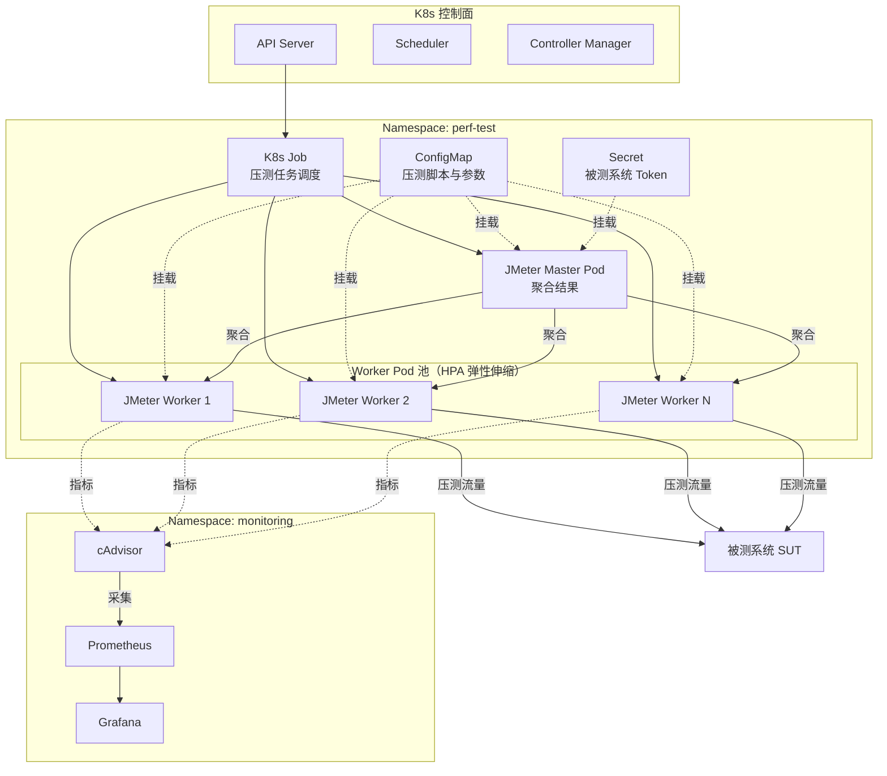
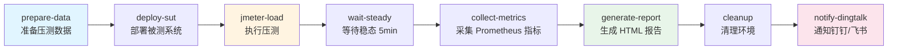

# Docker 与 K8s 在性能测试中的应用

容器化与云原生技术已经成为性能测试的基础设施标准。从单机 Docker 镜像分发，到 Docker Compose 多工具编排，再到 Kubernetes 弹性调度压测 Worker，最终演进到 Argo Workflows 与 Operator 编排的云原生压测流水线——容器化让压测环境的一致性、可重复性与横向扩展能力都得到了数量级提升。本文基于 JMeter 5.6.3、JDK 17+、CentOS Stream 9 / Ubuntu 22.04 的实战版本，系统讲解 Docker 与 K8s 在性能测试中的应用。

## 一、核心概念：容器化对性能测试的影响与价值

性能测试长期受困于三个核心痛点：**环境一致性差**（开发、测试、生产环境差异导致压测结果失真）、**压力机扩缩容慢**（高峰期临时申请物理机往往以小时计）、**多工具协同复杂**（JMeter Master/Slave、k6、Locust、InfluxDB、Grafana 需要联动）。容器化与云原生技术恰好对症下药。

容器化带来的核心价值：

- **环境一致性**：Docker 镜像将 JMeter、JDK、依赖插件打包成不可变制品，确保本地、CI、预发环境的执行结果可复现。镜像一旦构建完成，其行为就被"冻结"，从而彻底消除"在我机器上跑得通"这一长期困扰测试团队的痛点。
- **秒级扩容**：K8s 调度压测 Worker 从分钟级压缩到秒级，支撑瞬时大流量压测场景。电商大促前 10 分钟启动数百个 Worker、压测结束后立即回收，是 K8s 时代压测的典型节奏。
- **资源隔离**：通过 cgroups / CPU Share / Memory Limit 实现容器间资源隔离，避免 Worker 互相干扰，让压测结果的方差显著收敛。
- **可观测性内建**：cAdvisor、Prometheus、Grafana 与 eBPF 形成开箱即用的监控链路，无需再为每个压测任务单独搭建监控。
- **版本与依赖治理**：不同压测任务可以并行使用不同版本的 JMeter、JDK 甚至不同 JVM 厂商（HotSpot / OpenJ9 / GraalVM），互不干扰。

需要特别注意的是：**容器并非零开销**。容器网络 NAT、存储 overlay、CPU CFS 调度都会引入额外延迟，对极限吞吐场景需要谨慎评估。在压测中需要区分两种场景：**功能性压测**（验证系统能否承受目标 QPS）可以无脑容器化；**基线对比压测**（测量绝对性能数值）则应记录容器开销作为变量，必要时使用裸金属对照。这一点会在后文"常见陷阱"中详细展开。

## 二、Docker 在性能测试中的应用

### 2.1 镜像制作：JMeter / k6 / Locust

性能测试工具的镜像化是容器化压测的第一步。下面以 JMeter 5.6.3 + JDK 17 为例，给出一份生产可用的 Dockerfile。

```dockerfile
# 基础镜像：Eclipse Temurin JDK 17（LTS，性能优于 JDK 8）
FROM eclipse-temurin:17-jre-jammy

# 维护者与元数据
LABEL maintainer="perf-team" \
      org.opencontainers.image.title="jmeter-worker"

# 关闭代理，避免拉取插件时被拦截
ENV http_proxy="" https_proxy="" HTTP_PROXY="" HTTPS_PROXY=""

# JMeter 版本与路径变量
ENV JMETER_VERSION=5.6.3 \
    JMETER_HOME=/opt/apache-jmeter-5.6.3 \
    TZ=Asia/Shanghai
ENV PATH=${JMETER_HOME}/bin:${PATH}

# 安装必要的系统包并设置时区
RUN apt-get update && apt-get install -y --no-install-recommends \
        curl ca-certificates tzdata && \
    ln -snf /usr/share/zoneinfo/$TZ /etc/localtime && \
    echo $TZ > /etc/timezone && \
    rm -rf /var/lib/apt/lists/*

# 下载并解压 JMeter
RUN curl -fsSL \
    https://archive.apache.org/dist/jmeter/binaries/apache-jmeter-${JMETER_VERSION}.tgz \
    -o /tmp/jmeter.tgz && \
    tar -xzf /tmp/jmeter.tgz -C /opt && \
    rm /tmp/jmeter.tgz

# 安装常用插件：JMeter Plugins Manager + 自定义插件
RUN curl -fsSL \
    https://repo1.maven.org/maven2/kg/apc/jmeter-plugins-manager/1.10/jmeter-plugins-manager-1.10.jar \
    -o ${JMETER_HOME}/lib/ext/jmeter-plugins-manager.jar

# 压测脚本目录
VOLUME ["/scripts", "/results"]
WORKDIR ${JMETER_HOME}

# 非 root 用户运行（VOLUME 声明不会创建目录，需先 mkdir 否则 chown 会失败）
RUN mkdir -p /scripts /results && useradd -m jmeter && chown -R jmeter:jmeter /opt /scripts /results
USER jmeter

# 入口：以 non-GUI 方式执行脚本
ENTRYPOINT ["jmeter", "-n", "-t", "/scripts/test.jmx", \
            "-l", "/results/result.jtl", \
            "-e", "-o", "/results/report"]
```

k6 与 Locust 的镜像更为简洁，直接使用官方镜像即可，按需挂载脚本：

```bash
# k6：Grafana Labs 出品，原生支持云原生与 K8s
docker run --rm -i grafana/k6 run - <script.js

# Locust：基于 Python，分布式时通过 Master/Worker 模式编排
docker run --rm -p 8089:8089 -v $PWD:/mnt locustio/locust \
    -f /mnt/locustfile.py --headless -u 1000 -r 50
```

### 2.2 Docker Compose 多工具编排

单容器只能解决工具分发问题，真正的价值在于多工具协同。下面这份 `docker-compose.yml` 同时拉起 JMeter Master、3 个 JMeter Worker、InfluxDB 与 Grafana，形成完整的分布式压测栈：

```yaml
services:
  # JMeter Master：负责脚本分发与结果聚合，不实际产生压力
  jmeter-master:
    image: perf/jmeter:5.6.3
    container_name: jmeter-master
    volumes:
      - ./scripts:/scripts
      - ./results:/results
    command: >
      jmeter -n -t /scripts/test.jmx
      -R jmeter-worker-1,jmeter-worker-2,jmeter-worker-3
      -l /results/result.jtl -e -o /results/report
    depends_on: [influxdb]

  # JMeter Worker：实际产生压力，通过 -R 参数被 Master 调度
  jmeter-worker:
    image: perf/jmeter:5.6.3
    deploy:
      replicas: 3            # 横向扩展 3 个 Worker
      resources:
        limits:
          cpus: "2.0"        # CPU 上限，避免单 Worker 抢占宿主机
          memory: 2G
    volumes:
      - ./scripts:/scripts

  # InfluxDB v2：存储 JMeter Backend Listener 上报的指标
  influxdb:
    image: influxdb:2.7
    ports: ["8086:8086"]
    environment:
      DOCKER_INFLUXDB_INIT_MODE: setup
      DOCKER_INFLUXDB_INIT_USERNAME: admin
      DOCKER_INFLUXDB_INIT_PASSWORD: ${INFLUX_PWD:-perfPwd123}
      DOCKER_INFLUXDB_INIT_BUCKET: jmeter
      DOCKER_INFLUXDB_INIT_ORG: perf
    volumes:
      - influxdb-data:/var/lib/influxdb2

  # Grafana：可视化压测实时指标
  grafana:
    image: grafana/grafana:10.4
    ports: ["3000:3000"]
    environment:
      GF_SECURITY_ADMIN_PASSWORD: ${GRAFANA_PWD:-admin}
    depends_on: [influxdb]

volumes:
  influxdb-data:
```

通过 `docker compose up -d` 一键启动，`docker compose up -d --scale jmeter-worker=10` 可以临时将 Worker 扩展到 10 个，配合 `replicas` 实现 Worker 的动态扩容。

### 2.3 容器监控：从 docker stats 到 cAdvisor

最基础的容器监控是 `docker stats`，可以实时查看每个容器的 CPU、内存、网络、Block I/O：

```bash
docker stats --format "table {{.Name}}\t{{.CPUPerc}}\t{{.MemUsage}}\t{{.NetIO}}"
```

`docker stats` 适合快速排查，但无法持久化与聚合，且只覆盖本机容器。压测过程中常见的排查场景——比如"第 15 分钟时 Worker 3 为什么吞吐掉了一半"——`docker stats` 无法回放。生产场景推荐使用 cAdvisor 自动采集容器指标，详见第五节"容器化性能监控"。

需要注意 `docker stats` 显示的 CPU% 是相对于宿主机总核数的比例，而非相对于 `limits.cpu`。一个被限制为 1 核的容器在 `docker stats` 中显示 100% 时，实际上已达到 limit 上限，但宿主机视角下可能只占 1/8。这一显示差异是排查压测 Worker 性能瓶颈时常见的认知陷阱。

## 三、K8s 在性能测试中的应用

Docker Compose 解决了单机多容器编排，但在大规模压测场景下，**Worker 数量超过单机容量、跨节点调度、压测任务生命周期管理**等需求会推动压测基础设施向 K8s 演进。K8s 的 Job、Deployment、HPA、Namespace、ConfigMap 等原生能力恰好与压测场景天然契合。

相较于 Docker Compose，K8s 带来了三个量级的能力跃升：第一，**跨节点调度**让 Worker 池可以横跨数十台物理机，单次压测可发起数十万乃至百万级并发；第二，**声明式 API**让压测环境本身可被版本化、可被 GitOps 管理，整个压测集群的定义就是一个 YAML 仓库；第三，**Operator 模式**让压测工具的运维知识被编码进控制器，普通测试同学无需理解 K8s 细节即可发起分布式压测。

### 3.1 K8s 压测整体架构



### 3.2 K8s Job 调度压测任务

压测任务天然是"运行到完成"的工作负载，与 K8s Job 的语义完全匹配。下面是 JMeter Master 以 Job 方式运行的 YAML：

```yaml
apiVersion: batch/v1
kind: Job
metadata:
  name: jmeter-load-test
  namespace: perf-test
spec:
  # 并行运行的 Worker Pod 数量（HPA 不作用于 Job，弹性伸缩见 3.3 节）
  parallelism: 5
  completions: 5
  backoffLimit: 2                # 失败重试次数
  activeDeadlineSeconds: 3600    # 任务最大执行时长，防止失控
  template:
    spec:
      restartPolicy: Never
      containers:
        - name: jmeter-worker
          image: perf/jmeter:5.6.3
          resources:
            requests: { cpu: "1", memory: "1Gi" }
            limits:   { cpu: "2", memory: "2Gi" }
          volumeMounts:
            - name: scripts
              mountPath: /scripts
              readOnly: true
            - name: results
              mountPath: /results
          env:
            - name: JMETER_WORKER
              valueFrom:
                fieldRef:
                  fieldPath: metadata.name
      volumes:
        - name: scripts
          configMap:
            name: jmeter-scripts      # 见 3.4 节
        - name: results
          emptyDir: {}
```

### 3.3 HPA 弹性伸缩 Worker

压测流量往往呈脉冲式（如秒杀场景预热期低、抢购瞬间峰值），固定 Worker 数量既浪费资源又难以应对峰值。HPA（Horizontal Pod Autoscaler）可以根据 CPU 或自定义指标动态调整 Worker 副本数：

```yaml
apiVersion: autoscaling/v2
kind: HorizontalPodAutoscaler
metadata:
  name: jmeter-worker-hpa
  namespace: perf-test
spec:
  scaleTargetRef:
    apiVersion: apps/v1
    kind: Deployment
    name: jmeter-worker
  minReplicas: 2                    # 保底 2 个 Worker
  maxReplicas: 50                   # 上限 50 个，防止打爆集群
  metrics:
    - type: Resource
      resource:
        name: cpu
        target:
          type: Utilization
          averageUtilization: 70    # CPU 利用率超 70% 自动扩容
    - type: Pods
      pods:
        metric:
          name: jmeter_active_threads    # 自定义指标：活跃线程数
        target:
          type: AverageValue
          averageValue: 500
```

配合 Prometheus Adapter，HPA 可以基于 `jmeter_active_threads`、`http_req_rate` 等自定义指标进行扩容，比纯 CPU 阈值更贴合压测语义。

### 3.4 ConfigMap 管理压测脚本

压测脚本与参数化文件（CSV）应与镜像解耦，通过 ConfigMap 挂载，便于版本管理与热更新：

```yaml
apiVersion: v1
kind: ConfigMap
metadata:
  name: jmeter-scripts
  namespace: perf-test
data:
  test.jmx: |
    <?xml version="1.0" encoding="UTF-8"?>
    <jmeterTestPlan version="1.2" properties="5.0">
      <!-- JMeter 脚本内容，由 CI 从仓库渲染 -->
    </jmeterTestPlan>
  users.csv: |
    user1,pass1
    user2,pass2
```

敏感数据（如被测系统的 API Token）应使用 Secret 而非 ConfigMap。

### 3.5 Namespace 隔离

不同团队、不同压测任务应通过 Namespace 进行资源与网络隔离，避免互相干扰：

```yaml
apiVersion: v1
kind: Namespace
metadata:
  name: perf-test
  labels:
    purpose: performance-testing
---
apiVersion: v1
kind: ResourceQuota
metadata:
  name: perf-test-quota
  namespace: perf-test
spec:
  hard:
    requests.cpu: "100"
    requests.memory: 200Gi
    pods: "100"
    # 限制压测任务最多占用 100 核 / 200G，防止吃满集群
```

配合 NetworkPolicy 可以进一步限制 Worker 只能访问被测系统，无法触达生产数据库等敏感资源。Namespace 隔离在多团队共享压测集群时尤其重要——A 团队的压测流量意外打到 B 团队的被测环境，是共享集群中最常见的事故类型。通过 Namespace + ResourceQuota + NetworkPolicy 三层隔离，可以将事故半径控制在单个 Namespace 内。

## 四、云原生压测流水线：Argo Workflows 与 Operator

K8s Job 解决了"一次性压测"，但实际工程中的压测是一个**多阶段流水线**：准备数据 → 启动压测 → 等待稳态 → 采集指标 → 生成报告 → 清理环境。用 K8s Job 手写这些阶段会陷入 bash 脚本编排的泥潭——错误处理、重试、并行、产物传递都需要自己实现。Argo Workflows 与 Operator 分别从"声明式 DAG"与"CRD 控制器"两个方向解决这一问题。

Argo Workflows 的核心优势在于**声明式 DAG**：每个步骤是一个容器，步骤间的依赖关系用 YAML 描述，引擎自动调度执行顺序、处理重试、传递产物。压测团队只需关注"做什么"，不需要关注"怎么调度"。对于 2024-2026 年逐渐成熟的云原生压测生态，Argo Workflows 已经成为事实上的流水线编排标准，Tekton 与 Argo 之间的争论基本以 Argo 在数据分析与批处理场景的胜出而告终。

### 4.1 Argo Workflows 编排压测流水线



对应的 Argo Workflow YAML：

```yaml
apiVersion: argoproj.io/v1alpha1
kind: Workflow
metadata:
  name: perf-pipeline
  namespace: perf-test
spec:
  entrypoint: main
  arguments:
    parameters:
      - name: script
        value: "test.jmx"
      - name: duration
        value: "600"
  templates:
    - name: main
      steps:
        - - name: prepare-data
            template: prepare
        - - name: run-load
            template: jmeter-load
            arguments:
              parameters:
                - name: script
                  value: "{{workflow.parameters.script}}"
        - - name: report
            template: gen-report
            when: "{{steps.run-load.status}} == Succeeded"

    - name: prepare
      container:
        image: perf/data-prep:latest
        command: [sh, -c]
        args: ["python /app/prepare.py --output /tmp/users.csv"]

    - name: jmeter-load
      inputs:
        parameters:
          - name: script
      container:
        image: perf/jmeter:5.6.3
        resources:
          requests: { cpu: "4", memory: "4Gi" }
        command: [jmeter, -n, -t, "/scripts/{{inputs.parameters.script}}",
                  -l, /results/result.jtl, -e, -o, /results/report]

    - name: gen-report
      container:
        image: perf/reporter:latest
        command: [python, /app/report.py, --jtl, /results/result.jtl]
```

### 4.2 k6 Operator 与 JMeter Operator

如果不想自己编排 DAG，可以使用专用压测 Operator。以 k6 Operator 为例，只需声明一个 `K6` CRD 即可自动调度分布式压测：

```yaml
apiVersion: k6.io/v1alpha1
kind: K6
metadata:
  name: k6-sample
  namespace: perf-test
spec:
  runner:
    image: grafana/k6:0.51.0
    env:
      - name: K6_STATSD_ENABLE_TAGS
        value: "true"
  parallelism: 10                  # 10 个 runner Pod 并发
  script:
    configMap:
      name: k6-script
      file: test.js
  arguments: --out statsd --vus 1000 --duration 10m
```

Operator 会自动创建 10 个 runner Pod、分发脚本、聚合结果、回收资源，比手写 Job 简洁得多。JMeter Operator（如 `jmeter-k8s-operator`）提供类似的 CRD，适合以 JMeter 为核心的团队。

Operator 与 Argo Workflows 并非二选一，而是互补关系：Argo 擅长编排跨工具的多阶段流水线（数据准备→压测→报告→通知），Operator 擅长把单一压测工具的分布式协调封装成"一键"操作。成熟的云原生压测平台通常以 Argo Workflows 为顶层编排，在压测阶段调用 k6 Operator 或 JMeter Operator 的 CRD，由 Operator 完成 Worker 的细节调度。

## 五、容器化性能监控：cAdvisor + Prometheus + Grafana + eBPF

### 5.1 cAdvisor + Prometheus + Grafana

cAdvisor 由 Google 开源，原生集成 Docker / containerd，自动采集每个容器的 CPU、内存、文件系统、网络指标并暴露为 Prometheus 格式。典型部署：

```yaml
# Prometheus 抓取 cAdvisor 的关键配置
scrape_configs:
  - job_name: cadvisor
    static_configs:
      - targets: ['cadvisor:8080']
    metric_relabel_configs:
      # 只保留 jmeter 容器指标，减少存储压力
      - source_labels: [container]
        regex: 'jmeter-.*'
        action: keep
```

Grafana 中可以直接使用官方的 cAdvisor Dashboard（ID 14282），按容器维度查看 CPU Throttle、Memory Working Set、Network RX/TX。

### 5.2 eBPF 监控：Hubble / Cilium

传统监控只能看到容器层指标，无法解释"为什么容器间延迟突然升高"。eBPF（Extended Berkeley Packet Filter）通过在内核态注入探针，可以无侵入地观测容器网络流量、TCP 重传、函数调用栈。

**Hubble**（基于 Cilium）是容器场景下最流行的 eBPF 可观测性工具：

```bash
# 实时观测压测 Worker 到被测系统的网络流
hubble observe --from-namespace perf-test --to-namespace prod \
    --protocol tcp --type flow

# 查看 TCP 重传，定位网络抖动
hubble observe --type trace --verdict DROPPED
```

eBPF 在压测中的典型应用场景：

- **容器网络开销评估**：对比 Host Network 与 Bridge Network 的 P99 延迟差异。这在评估 Service Mesh 引入的开销时尤为关键，传统监控只能看到端到端延迟，无法区分是应用慢还是 Sidecar 慢。
- **DNS 解析瓶颈定位**：观测 CoreDNS 响应时间，识别压测中 DNS 雪崩。大规模压测中 Worker 短时间内发起大量 DNS 查询，CoreDNS 容易成为隐藏瓶颈。
- **Sidecar 注入延迟**：Istio 等 Sidecar 在压测链路中引入的额外开销。线上常被忽视的 Sidecar 在 10 万 QPS 下可能贡献 20% 以上的延迟，eBPF 可以精确度量。
- **内核态函数追踪**：通过 bpftrace 追踪 `tcp_sendmsg`、`sock_recvmsg` 等内核函数，定位容器网络栈的具体瓶颈点。

## 六、常见陷阱与最佳实践

### 6.1 容器网络开销

容器默认走 bridge 网络，每次跨容器通信都要经过 iptables NAT，对 P99 敏感的场景可能引入 0.1～1ms 的额外延迟。**最佳实践**：压测 Worker 使用 `hostNetwork: true`，或使用 Calico/Cilium 的 BGP 直连模式绕过 iptables。

### 6.2 CPU Share 与 CFS 调度

K8s 默认通过 CFS（Completely Fair Scheduler）进行 CPU 限流，`limits.cpu` 设置过低会导致 Worker 被频繁限流，吞吐量上不去；设置过高则可能挤占其他 Pod。**最佳实践**：压测 Worker 的 `requests.cpu` 与 `limits.cpu` 保持一致，避免 Burst 行为引入抖动；对延迟敏感的 Master 节点使用 `cpuManagerPolicy=static` 绑定核。

### 6.3 Memory Limit 与 OOMKill

`limits.memory` 触发的 OOMKill 会让 Worker 突然死亡，导致压测结果不可信。JVM 容器化场景需要特别关注：JDK 17 默认识别 cgroup 限制，但 `-Xmx` 设置不应超过 `limits.memory` 的 75%，预留空间给 Metaspace、Direct Buffer 与堆外内存。

### 6.4 资源 Limit 设置参考

| 工作负载 | requests.cpu | limits.cpu | requests.memory | limits.memory |
|----------|--------------|------------|-----------------|---------------|
| JMeter Master | 1 | 2 | 1Gi | 2Gi |
| JMeter Worker | 1 | 2 | 1Gi | 2Gi |
| k6 Runner | 0.5 | 1 | 512Mi | 1Gi |
| InfluxDB | 2 | 4 | 4Gi | 8Gi |
| Grafana | 0.5 | 1 | 256Mi | 512Mi |

### 6.5 镜像分层与构建缓存

JMeter 镜像如果每次都从源码编译，构建时间动辄 10 分钟。**最佳实践**：将不常变化的层（基础镜像、JDK、JMeter）放在前面，脚本与参数化文件放在后面，配合 BuildKit 缓存可将构建时间压缩到 1 分钟内。

### 6.6 镜像安全

压测镜像常常携带被测系统 Token，必须避免推送到公共仓库。**最佳实践**：使用私有镜像仓库（Harbor）+ 镜像签名（Cosign）+ 运行时扫描（Trivy），并通过 K8s `imagePullSecrets` 管理凭据。

## 总结

容器化与云原生技术已从"可选项"变为性能测试基础设施的"必选项"。Docker 解决了工具分发与环境一致性问题，Docker Compose 解决了单机多工具编排，K8s Job/HPA/Namespace 解决了分布式压测的调度与隔离，Argo Workflows 与 Operator 进一步将压测流水线化，而 cAdvisor + Prometheus + Grafana + eBPF 构成了完整的容器可观测性闭环。理解这些技术背后的权衡——容器网络开销、CFS 限流、Memory OOM——才能在压测中真正发挥云原生的优势，而不是被其副作用反噬。
