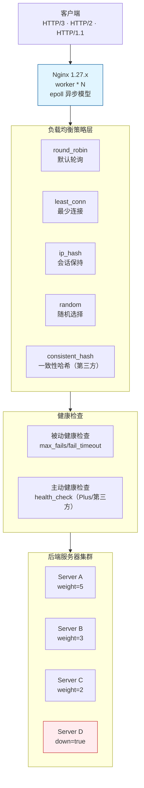

# Nginx 性能调优与负载均衡

Nginx 已从早期的"反向代理 + 静态资源服务器"演进为现代云原生架构中的核心流量入口：HTTP/3（QUIC）在 1.25.0 进入主线、1.27.x 已稳定支持；动态模块机制让第三方扩展无需重编译主体；OpenResty 与 Lua 生态让 Nginx 具备了 API 网关所需的复杂逻辑处理能力。本文基于 Nginx 1.27.x 稳定分支（截至 2026-09，官方稳定分支已演进至 1.30.x），系统讲解其在性能测试与系统架构中的角色定位、调优手段、负载均衡策略、HTTP/3 支持、API 网关能力以及 OpenResty 扩展实践，取代旧文档中无版本号、仅介绍基础轮询策略的过时内容。

## 一、核心概念：Nginx 在系统架构与性能测试中的角色

### 1.1 反向代理与流量入口

Nginx 在现代架构中通常作为**统一流量入口**，对外暴露少量端口（80/443/443-UDP），对内将请求分发到应用服务器集群。这种部署方式带来三个核心价值：

- **安全隔离**：内网应用服务器不直接暴露公网，Nginx 承担 TLS 卸载、WAF 前置、IP 黑白名单等职责，应用层只需关注业务逻辑；
- **协议转换**：Nginx 可将外部的 HTTP/3、HTTP/2 请求转换为后端友好的 HTTP/1.1，让后端无需关心协议演进；
- **流量治理**：限流、熔断、灰度发布、A/B 测试等横切关注点统一在 Nginx 层实现，避免侵入业务代码。

### 1.2 在性能测试中的双重角色

性能测试中 Nginx 通常扮演两种角色，调优方向截然不同：

- **被测系统（SUT）**：Nginx 作为静态资源 CDN 节点或 API 网关被直接压测，关注 QPS、P99 延迟、连接数与 TLS 握手耗时。此时需要调优 worker 进程数、连接复用、IO 模型，并通过 `stub_status` 与 `http_stub_status_module` 暴露指标；
- **被测链路组件**：Nginx 挡在压测工具与后端之间，作为反向代理参与完整链路。此时需关注 upstream 连接复用、keepalive 配置、缓冲区设置，避免 Nginx 自身成为瓶颈或引入额外延迟噪声。

明确角色是制定压测方案的前提：被测系统场景下应关闭无关模块、调优内核参数、使用裸 TCP 压测；链路组件场景下应保留生产配置，重点观察 `upstream_response_time` 与 `request_time` 的差值。

## 二、Nginx 性能调优

### 2.1 进程模型与 worker 配置

Nginx 采用**多进程 + 异步非阻塞**模型：master 进程负责管理 worker、加载配置、绑定端口；worker 进程处理实际请求，每个 worker 可承载数万并发连接。

```11-Nginx基础概述
# 11-Nginx基础概述.conf 全局段
# worker 进程数：建议等于 CPU 物理核心数（不含超线程）
# 可通过 nproc 查看，或 auto 自动匹配
worker_processes auto;

# CPU 亲和性：将 worker 绑定到固定 CPU 核心，减少缓存失效
# 假设 8 核，对应 8 个 worker
worker_cpu_affinity 00000001 00000010 00000100 00001000 \
                    00010000 00100000 01000000 10000000;

# worker_rlimit_nofile：每个 worker 可打开的最大文件描述符
# 需与系统 ulimit -n 配合，建议 ≥ worker_connections 的 2 倍
worker_rlimit_nofile 65535;
```

`worker_processes` 不是越大越好：过多的 worker 会增加进程切换开销，且 epoll 实例也会随之增加。在 8 核机器上配置 8 个 worker、每个 worker 10240 连接，理论并发上限为 81920，足以覆盖大多数场景。

### 2.2 连接优化与 IO 模型

```11-Nginx基础概述
events {
    # Linux 必选 epoll，FreeBSD 选 kqueue，兼容默认 select 性能极差
    use epoll;
    
    # 每个 worker 的最大连接数
    # 反向代理场景下，每个连接会占用 2 个 FD（客户端 + upstream）
    # 因此实际并发 = worker_connections * worker_processes / 2
    worker_connections 10240;
    
    # 允许一个 worker 同时接收多个连接（仅 Linux 支持）
    # 在高并发突增场景下显著提升 accept 吞吐
    multi_accept on;
}
```

### 2.3 sendfile / tcp_nopush / tcp_nodelay

这三个指令对静态资源吞吐与延迟有显著影响：

```11-Nginx基础概述
http {
    # 启用 sendfile：内核态直接拷贝文件到 socket，跳过用户态缓冲
    # 对静态资源服务提升明显，动态代理场景下意义不大
    sendfile on;
    
    # 与 sendfile 配合：将响应头与文件内容合并为一次发送
    # 适用于大文件下载、静态资源分发
    tcp_nopush on;
    
    # 禁用 Nagle 算法：小包立即发送，降低交互式请求延迟
    # 对 API 网关、WebSocket 等小包场景友好
    tcp_nodelay on;
    
    # keepalive 超时：65s 是常见值，长连接场景可调到 120s
    keepalive_timeout 65s;
    # 单个 keepalive 连接上的最大请求数，达到后强制关闭
    keepalive_requests 10000;
}
```

### 2.4 upstream keepalive 与缓冲区

反向代理场景下，**upstream keepalive** 是降低后端连接开销的关键：

```11-Nginx基础概述
http {
    upstream backend {
        server 10.0.0.1:8080 max_fails=3 fail_timeout=30s;
        server 10.0.0.2:8080 max_fails=3 fail_timeout=30s;
        
        # 保持到后端的长连接池大小
        # 每个 worker 独立维护，总连接数 = keepalive * worker_processes
        keepalive 64;
        
        # 控制单次请求的连接复用策略
        keepalive_requests 1000;
        keepalive_timeout 60s;
    }
    
    server {
        location /api/ {
            proxy_pass http://backend;
            
            # 必须设置 HTTP/1.1 才能复用长连接，默认是 HTTP/1.0
            proxy_http_version 1.1;
            # 清除 Connection: close，让长连接生效
            proxy_set_header Connection "";
            
            # 请求体缓冲：小于 buffer 则内存暂存，大于则写临时文件
            proxy_request_buffering on;
            client_body_buffer_size 16k;
            client_max_body_size 10m;
            
            # 响应缓冲：避免 Nginx 边收边转发给客户端导致后端连接被占用
            proxy_buffering on;
            proxy_buffer_size 4k;
            proxy_buffers 8 4k;
            proxy_busy_buffers_size 8k;
        }
    }
}
```

### 2.5 压缩：gzip 与 brotli

```11-Nginx基础概述
http {
    # gzip：兼容性最好，CPU 开销低
    gzip on;
    gzip_min_length 1k;              # 小于 1KB 不压缩
    gzip_comp_level 6;               # 压缩级别 1-9，6 是性价比平衡点
    gzip_types text/plain application/json application/javascript
               text/css application/xml image/svg+xml;
    gzip_vary on;                    # 在响应头加 Vary: Accept-Encoding
    gzip_proxied any;                # 反向代理场景下也启用压缩
    
    # brotli：需 ngx_brotli 模块（1.27.x 已可通过动态模块加载）
    # 压缩率比 gzip 高 15-25%，但 CPU 开销略大
    # 对 API 网关返回的 JSON、前端静态资源收益明显
    # brotli on;
    # brotli_comp_level 4;
    # brotli_types text/plain application/json application/javascript text/css;
}
```

需要注意：压缩对 CPU 敏感，在高 QPS 场景下应分级使用——静态资源在构建时预压缩（`.gz`/`.br` 文件，Nginx 直接发送），动态响应在 Nginx 层实时压缩。

## 三、负载均衡策略

### 3.1 整体架构

Nginx 负载均衡的整体链路如下：客户端请求进入 Nginx worker（epoll 异步模型），由策略层（轮询/最少连接/IP 哈希/随机/一致性哈希）结合健康检查（被动 max_fails/fail_timeout，主动 health_check）选出后端服务器集群中的目标节点。



### 3.2 六种策略对比

| 策略 | 命令 | 适用场景 | 优点 | 缺点 |
|------|------|----------|------|------|
| 轮询（默认） | 无需指定 | 服务器配置一致 | 简单、均匀 | 不考虑负载差异 |
| 加权轮询 | `weight=N` | 服务器配置不一致 | 按能力分配 | 静态权重，无法动态调整 |
| 最少连接 | `least_conn` | 请求处理时长差异大 | 动态均衡，避免慢请求堆积 | 计算开销略大 |
| IP 哈希 | `ip_hash` | 需要会话保持 | 同 IP 固定后端 | 后端扩容时哈希重分布 |
| 随机 | `random` | 极简场景 | 选择开销最小 | 短期可能不均匀 |
| 一致性哈希 | `hash $key consistent` | 缓存代理、避免雪崩 | 后端变更影响小 | 需第三方或 `hash` 指令 |

### 3.3 配置示例

```11-Nginx基础概述
http {
    # 1. 加权轮询：按服务器能力分配
    upstream weighted_backend {
        server 10.0.0.1:8080 weight=5;   # 高配机器
        server 10.0.0.2:8080 weight=3;   # 中配机器
        server 10.0.0.3:8080 weight=2;   # 低配机器
        keepalive 64;
    }
    
    # 2. 最少连接 + 权重：动态负载均衡
    upstream least_conn_backend {
        least_conn;
        server 10.0.0.1:8080 weight=5 max_fails=3 fail_timeout=30s;
        server 10.0.0.2:8080 weight=3 max_fails=3 fail_timeout=30s;
        server 10.0.0.3:8080 weight=2 max_fails=3 fail_timeout=30s;
        keepalive 64;
    }
    
    # 3. IP 哈希：会话保持
    upstream session_backend {
        ip_hash;
        server 10.0.0.1:8080;
        server 10.0.0.2:8080;
        # 注意：ip_hash 与 keepalive 不冲突，但后端需支持会话
    }
    
    # 4. 一致性哈希：基于请求 URI 哈希，缓存友好
    upstream cache_backend {
        hash $request_uri consistent;
        server 10.0.0.1:8080;
        server 10.0.0.2:8080;
        server 10.0.0.3:8080;
    }
    
    # 5. 随机 + two_choice：随机选两个，挑连接数少的（减少羊群效应）
    upstream random_backend {
        random two;
        server 10.0.0.1:8080;
        server 10.0.0.2:8080;
        server 10.0.0.3:8080;
    }
}
```

### 3.4 健康检查

Nginx 开源版默认提供**被动健康检查**：当请求失败达到 `max_fails` 次后，将该后端标记为不可用，持续 `fail_timeout` 时间。**主动健康检查**需 Nginx Plus 或第三方模块（`11-Nginx基础概述_upstream_check_module`）：

```11-Nginx基础概述
# 被动健康检查（开源版内置）
upstream backend {
    server 10.0.0.1:8080 max_fails=3 fail_timeout=30s;
    server 10.0.0.2:8080 max_fails=3 fail_timeout=30s;
    # max_fails=3：30s 内失败 3 次则标记为不可用
    # fail_timeout=30s：不可用持续 30s 后再次尝试
}

# 主动健康检查（Nginx Plus 或第三方模块）
# location /health {
#     health_check interval=5s fails=3 passes=2 uri=/healthz;
#     proxy_pass http://backend;
# }
```

被动健康检查的局限在于：只有真实流量触达失败后才会剔除节点，可能在节点已异常但流量未到时无法提前发现。生产环境推荐主动 + 被动结合。

## 四、HTTP/3 与 QUIC

### 4.1 Nginx 对 HTTP/3 的支持

Nginx 从 1.25.0 开始在主线支持 HTTP/3 与 QUIC，到 1.27.x 已进入稳定可用阶段。HTTP/3 基于 UDP 的 QUIC 协议，相比 HTTP/2 解决了 TCP 队头阻塞、连接迁移、TLS 握手延迟等核心问题。

```11-Nginx基础概述
server {
    # 同时监听 TCP（HTTP/2 兼容）与 UDP（HTTP/3）
    listen 443 ssl;
    listen 443 quic reuseport;          # reuseport 让多 worker 共享 UDP socket
    http2 on;
    http3 on;
    
    server_name api.example.com;
    
    ssl_certificate     /etc/11-Nginx基础概述/ssl/fullchain.pem;
    ssl_certificate_key /etc/11-Nginx基础概述/ssl/privkey.pem;
    ssl_protocols       TLSv1.3;        # HTTP/3 强制要求 TLS 1.3
    
    # 通告客户端可升级到 HTTP/3
    add_header Alt-Svc 'h3=":443"; ma=86400';
    
    location / {
        proxy_pass http://backend;
    }
}
```

### 4.2 HTTP/3 的性能影响

HTTP/3 对性能测试的影响需要重点关注：

- **握手延迟**：首请求 RTT 等于 1-RTT（TLS 1.3），后续连接 0-RTT，相比 HTTP/2 + TCP + TLS 的 2-RTT 显著降低，对移动端、跨境请求收益明显；
- **队头阻塞消除**：QUIC 流独立，单个流丢包不影响其他流，在弱网（丢包率 > 1%）下吞吐稳定性优于 HTTP/2；
- **连接迁移**：客户端 IP 切换（如 4G 切 Wi-Fi）时 QUIC 连接不中断，对长连接、WebSocket 场景友好；
- **UDP 优化必要性**：HTTP/3 性能高度依赖内核 UDP 栈与 NIC offload，压测前需确认 `net.core.rmem_max`、`udp_rmem_min` 等参数调优到位，否则 UDP 接收缓冲不足会导致丢包与性能回退。

压测 HTTP/3 需使用支持 QUIC 的工具：k6 自 0.50 起支持 HTTP/3，curl 8.x 通过 `--http3` 选项支持，JMeter 暂不原生支持，需通过插件或外部代理转换。

## 五、Nginx 作为 API 网关

### 5.1 限流：limit_req 与 limit_conn

```11-Nginx基础概述
http {
    # 限流区域定义：基于客户端 IP，每秒 100 请求，突发 50
    # zone=api_rl:10m 表示用 10MB 内存存 IP 状态，约可记录 16 万个 IP
    limit_req_zone $binary_remote_addr zone=api_rl:10m rate=100r/s;
    
    # 并发连接数限流：单 IP 同时最多 50 个连接
    limit_conn_zone $binary_remote_addr zone=conn_rl:10m;
    
    server {
        location /api/ {
            # 限流：burst=50 突发请求排队，nodelay 不延迟突发请求
            limit_req zone=api_rl burst=50 nodelay;
            limit_conn conn_rl 50;
            
            # 限流响应码：默认 503，建议改为 429 让客户端识别
            limit_req_status 429;
            limit_conn_status 429;
            
            proxy_pass http://backend;
        }
        
        # 分级限流：不同接口不同速率
        location /api/login {
            # 登录接口：每秒 10 请求，防止暴力破解
            limit_req zone=api_rl burst=5 nodelay;
            proxy_pass http://backend;
        }
        
        location /api/search {
            # 搜索接口：每秒 200 请求
            limit_req zone=api_rl burst=100 nodelay;
            proxy_pass http://backend;
        }
    }
}
```

### 5.2 熔断与降级

开源版 Nginx 可通过 `proxy_next_upstream` + `max_fails` 实现简单熔断，复杂场景需配合 Lua：

```11-Nginx基础概述
upstream backend {
    server 10.0.0.1:8080 max_fails=5 fail_timeout=30s;
    server 10.0.0.2:8080 max_fails=5 fail_timeout=30s;
    # 备用后端：主集群全部失败后启用
    server 10.0.0.10:8080 backup;
}

server {
    location /api/ {
        proxy_pass http://backend;
        
        # 触发切换到下一台的错误条件
        proxy_next_upstream error timeout http_502 http_503 http_504;
        # 重试次数与时间限制，避免雪崩
        proxy_next_upstream_tries 3;
        proxy_next_upstream_timeout 5s;
        
        # 后端全部失败时的兜底页面
        error_page 502 503 504 /fallback.html;
        location = /fallback.html {
            root /usr/share/11-Nginx基础概述/html;
            internal;
        }
    }
}
```

### 5.3 灰度发布

基于请求头、Cookie、URI 参数的灰度分流是 Nginx 网关场景的常见需求：

```11-Nginx基础概述
# 通过 split_clients 按比例分流
split_clients "${remote_addr}${http_user_agent}" $upstream_pool {
    10%  canary;          # 10% 流量到灰度集群
    *    stable;          # 90% 流量到稳定集群
}

upstream stable {
    server 10.0.0.1:8080;
    server 10.0.0.2:8080;
}

upstream canary {
    server 10.0.0.10:8080;   # 灰度版本实例
}

# 指定用户强制走灰度（通过 Cookie 或 Header）
# 配合 map 实现精细化路由；map 指令只能位于 http 层，不能写在 server/location 内
map $cookie_gray_release $target_pool {
    "true"  canary;
    default $upstream_pool;
}

server {
    location /api/ {
        proxy_pass http://$target_pool;
    }
}
```

## 六、OpenResty 与 Lua 扩展

OpenResty 是基于 Nginx 的扩展发行版，内置 LuaJIT，允许在 Nginx 内部执行 Lua 代码，常用于动态路由、复杂鉴权、协议转换等场景。Nginx 1.27.x 与 OpenResty 1.27.x 保持版本同步，可无缝替换。

### 6.1 请求处理流程

Nginx + OpenResty 的请求处理流程涉及多个阶段（phase），Lua 代码可挂载到不同阶段执行：


### 6.2 动态路由与限流增强

```11-Nginx基础概述
# 通过 Lua 访问 Redis 实现动态路由
location /api/ {
    access_by_lua_block {
        local redis = require "resty.redis"
        local red = redis:new()
        red:set_timeout(100)  -- 100ms 超时
        
        local ok, err = red:connect("10.0.0.5", 6379)
        if not ok then
            ngx.log(ngx.WARN, "redis connect failed: ", err)
            return  -- 连接失败时走默认路由
        end
        
        -- 根据请求路径查询路由表
        local route = red:get("route:" .. ngx.var.uri)
        if route and route ~= ngx.null then
            ngx.var.upstream = route  -- 动态修改 upstream
        end
        
        red:set_keepalive(10000, 100)  -- 连接池复用
    }
    
    set $upstream "default_backend";
    proxy_pass http://$upstream;
}
```

### 6.3 11-Nginx基础概述-plus vs 开源版

Nginx Plus 是商业版本，在以下场景有显著优势：

| 能力 | 开源版 | Nginx Plus |
|------|--------|------------|
| 主动健康检查 | 需第三方模块 | 内置，支持主动探测 |
| 动态 upstream | 需 reload | API 动态增删节点 |
| 会话持久性 | ip_hash（粗糙） | sticky cookie / learn |
| 监控仪表盘 | 需自建 | 内置 live activity monitoring |
| JWT 验证 | 需 Lua | 原生 `auth_jwt` 指令 |
| 商业支持 | 无 | 7x24 商业支持 |

中小团队可通过 OpenResty + Lua 补齐大部分缺失能力；大型企业或对 SLA 有强要求的场景，Nginx Plus 的开箱即用与商业支持更具性价比。

## 七、常见陷阱与最佳实践

### 7.1 性能调优陷阱

- **worker_processes 过多**：超过物理核心数后，进程切换开销激增，P99 延迟反而上升。压测时建议先固定 `worker_processes=auto`，再逐步调整观察；
- **未启用 upstream keepalive**：默认 `proxy_http_version 1.0`，每个请求都新建 TCP 连接到后端，导致后端 TIME_WAIT 堆积、握手开销放大。生产环境务必配置 `proxy_http_version 1.1` + `Connection ""` + `keepalive N`；
- **gzip 压缩级别过高**：`gzip_comp_level 9` 的 CPU 开销是 6 的 2 倍以上，但压缩率提升不足 3%。高 QPS 场景下 CPU 反而成为瓶颈；
- **buffer 设置过小**：`proxy_buffers` 过小会导致响应回源，增加后端压力；过大则内存占用增加。建议根据后端响应大小实测调整。

### 7.2 负载均衡陷阱

- **ip_hash 后端扩容雪崩**：ip_hash 是模 N 哈希，后端从 N 扩到 N+1 时，约 N/(N+1) 的请求会被重新分配，导致缓存失效。推荐使用 `hash $key consistent` 一致性哈希；
- **被动健康检查误判**：`max_fails` 默认统计的是 Nginx 与后端之间的错误，后端返回 500 也算失败。若业务层 500 是预期的（如校验失败），需通过 `proxy_next_upstream` 精确控制；
- **weight 未与实际能力对齐**：手动配置 weight 容易随机器老化失效，建议配合监控数据动态调整，或直接使用 `least_conn` 让 Nginx 自适应。

### 7.3 HTTP/3 陷阱

- **UDP 未调优**：默认内核 UDP 接收缓冲仅 200KB+，HTTP/3 高并发下会大量丢包。需调大 `net.core.rmem_max=16777216`；
- **防火墙未放行 UDP 443**：HTTP/3 走 UDP，许多云厂商默认安全组仅放行 TCP 443，导致 HTTP/3 永远回退到 HTTP/2；
- **Alt-Svc 头缺失**：未通告 `Alt-Svc: h3=":443"`，浏览器不会主动尝试 HTTP/3，部署等于未生效。

### 7.4 最佳实践清单

1. **版本锁定**：生产环境使用 1.27.x 稳定分支，避免使用 mainline 主线版本（注：截至 2026-09，1.27 分支已从官网下架停止维护，当前 stable 为 1.30.x，新部署建议评估升级）；
2. **配置即代码**：11-Nginx基础概述.conf 纳入 Git 管理，CI 自动校验 `11-Nginx基础概述 -t`，变更通过 CI/CD 滚动 reload；
3. **监控指标**：`active connections`、`accepts/handled/requests`、`reading/writing/waiting`、`upstream_response_time` 等指标接入 Prometheus，配合 `11-Nginx基础概述_exporter`；
4. **日志结构化**：使用 `log_format` 输出 JSON，便于 ELK/Loki 解析，关键字段：`$request_time`、`$upstream_response_time`、`$upstream_addr`、`$status`；
5. **压测前预热**：worker 进程冷启动时 epoll 尚未填充连接池，首秒 QPS 会偏低，压测前用低强度流量预热 30s；
6. **TLS 优化**：启用 `ssl_session_cache`、`ssl_early_data on`（0-RTT）、`ssl_stapling on`（OCSP 装订），可降低 TLS 握手开销 30% 以上；
7. **避免在 Nginx 层做复杂业务**：Lua 脚本应保持轻量（< 10ms），重逻辑下推到后端服务，避免 Nginx worker 被阻塞。

## 总结

Nginx 1.27.x 在 2026 年依然是云原生架构下不可替代的流量入口：进程模型与 epoll 异步 IO 让单机可支撑十万级并发；六种负载均衡策略覆盖从简单轮询到一致性哈希的完整场景；HTTP/3 主线支持让弱网体验显著提升；通过 OpenResty/Lua 扩展可补齐 API 网关所需的动态路由与复杂逻辑能力。性能测试中，明确 Nginx 的角色（被测系统 or 链路组件）、针对 worker 配置、upstream keepalive、缓冲区、压缩等关键参数进行调优，并配合 Prometheus 指标与结构化日志持续观测，才能让 Nginx 在压测中真实反映其承载能力，而非成为被忽视的瓶颈或被误判的噪声源。
