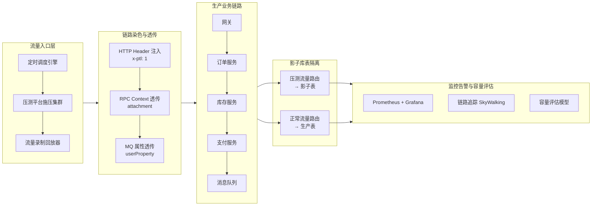
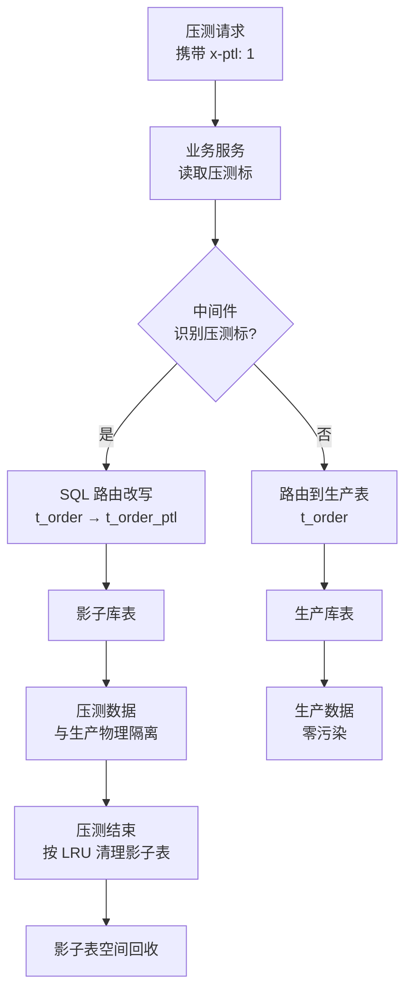

# 全链路压测与影子库表设计

全链路压测是性能测试在分布式架构下演进到一定阶段的产物。从 2012 年阿里双 11 因单块网卡被打满导致线上成功率仅 50% 的血泪史，到 2020-2026 年间阿里 PTS、美团 Quake、字节 Hurricane 等平台将全链路压测常态化、平台化、智能化，背后是互联网系统从"单机性能验证"到"全链路容量经营"的范式迁移。本文围绕全链路压测架构、影子库表设计、压测标透传、流量录制回放、容量规划与 Service Mesh 挑战展开，沉淀可落地的工程方法。

## 一、核心概念：全链路压测与传统单接口压测的差异

全链路压测（Full-Link Load Testing）指在真实的生产环境（或与生产同构的预发环境）中，基于真实业务链路与真实流量模型，对从接入层、应用层、中间件层到数据层的整条链路施加压力，以验证系统在目标峰值下的容量、稳定性与部署结构合理性的测试活动。它与单接口压测存在三处差异：

- **覆盖范围**：单接口压测只关注某一服务的吞吐与延迟，全链路压测强调跨服务的端到端链路，覆盖网关、RPC、消息队列、缓存、数据库、搜索引擎、第三方依赖等所有节点。
- **环境保真度**：单接口压测通常在性能测试环境（缩容环境）进行，硬件规格与生产存在数量级差异；全链路压测要求与生产 1:1 同构，能暴露网卡打满、连接池上限、跨机房延迟等线下无法复现的问题。
- **数据隔离要求**：单接口压测的数据可由测试同学随意造与删；全链路压测在真实环境中产生海量压测数据，必须通过压测标透传与影子库表实现物理隔离，避免污染生产数据与线上报表。

需要强调的是，全链路压测并非替代线下压测，而是与线下压测互补：线下负责发现基础性能问题与异常场景，线上负责容量验收与部署结构验证。

## 二、全链路压测架构

现代全链路压测平台的典型架构由"流量入口 → 压测平台 → 链路透传 → 影子库表 → 监控告警"五层构成，下方架构图展示了各层的职责与协作关系。



各层职责说明：

- **流量入口层**：由施压集群（JMeter 分布式、k6 Cloud 或自研引擎）按预设的流量模型发起请求，可由定时调度引擎（如 Argo Workflows、XXL-Job）触发；同时支持从线上录制真实流量回放，避免人工造数偏差。
- **链路染色与透传层**：压测流量在入口处被注入压测标（如 HTTP Header `x-ptl: 1`），并在 RPC、MQ、异步线程池等边界完成透传，确保压测标在整条链路不丢失，是数据隔离与监控分流的前提。
- **生产业务链路**：压测流量与真实流量混跑在同一套生产服务中，验证真实部署结构下的容量与稳定性。
- **影子库表隔离层**：中间件（数据库代理、缓存代理、ES 代理）识别压测标后，将压测数据路由到影子库表，与生产数据物理隔离。
- **监控告警与容量评估**：基于压测标对监控指标进行分流统计，识别压测流量带来的 QPS、RT、错误率；同时将压测数据喂给容量评估模型，反推集群规模。

主流全链路压测平台对比：

| 平台 | 来源 | 核心特性 |
| --- | --- | --- |
| 阿里 PTS | 阿里巴巴 | 压测即服务，与阿里云 ECS/SLB 深度集成，支持千万级并发 |
| 美团 Quake | 美团 | 自研压测引擎，支撑外卖、到店大促，影子库表方案成熟 |
| 字节 Hurricane | 字节跳动 | 与 Service Mesh 深度协同，流量染色能力突出 |
| 京东 ForceBot | 京东 | 双 11 常态化压测平台，支持流量录制回放 |

## 三、影子库表设计

### 3.1 数据隔离方案对比

数据隔离有三种典型方案，各有适用场景：

| 方案 | 实现方式 | 优点 | 缺点 |
| --- | --- | --- | --- |
| 标记清理 | 压测数据打标，压测后按标识清理 | 改造成本低，无需中间件改造 | 清理脚本风险高，依赖关系易遗漏，ES/日志/HBase 等存储难以彻底清理 |
| 影子库表 | 中间件识别压测标，路由到独立库表 | 隔离彻底，无需清理，可常态化压测 | 前期改造成本高，需中间件支持 |
| 影子集群 | 独立部署一套与生产同构的影子集群 | 隔离最彻底，对生产零侵入 | 成本高，仅超大厂适用 |

工业界主流方案是**影子库表**：对核心业务库建立影子库（如 `order_db_ptl`），对非核心库建立影子表（如 `t_order_ptl`），由数据库代理（ShardingSphere、MyCat、自研 Proxy）在 SQL 路由阶段根据压测标改写表名或库名。

### 3.2 影子表命名规范

影子表命名需要满足三个原则：**可识别**（一眼能看出是影子表）、**可路由**（中间件能基于规则自动改写）、**可清理**（生命周期可控）。推荐命名规范：

```
生产表名 + _ptl 后缀
例如：
  t_order          → t_order_ptl
  t_order_detail   → t_order_detail_ptl
  t_inventory      → t_inventory_ptl
```

对于影子库，使用独立 schema：

```
order_db      → order_db_ptl
inventory_db  → inventory_db_ptl
```

下方流程图展示了影子库表数据隔离的完整流程：



### 3.3 数据准备与清理

影子表并非空表，需要预置基础数据才能保证压测链路完整：

- **基础数据初始化**：从生产库抽样脱敏后导入影子表，保证商品、用户、库存等基础数据规模与生产同量级；动态数据在压测过程中由压测流量产生。
- **数据增量同步**：对于频繁变更的字典数据（如商品上下架），通过 Binlog 同步工具将生产变更实时同步到影子表，保持数据新鲜度。
- **数据清理策略**：影子表采用 LRU + TTL 双策略——超过 7 天未访问的压测数据自动归档，影子表容量超阈值时按创建时间淘汰最旧批次；每次常态化压测后只清理本次产生的订单类数据，保留基础数据。
- **存储成本控制**：影子表使用独立磁盘，可用更便宜的存储介质，并通过分库分表冷热分离。

## 四、压测标透传机制

压测标透传是全链路压测的"神经系统"，一旦在某条链路丢失，压测数据就会污染生产表。透传需要在 HTTP、RPC、MQ、异步线程池、定时任务等多个边界做处理。

### 4.1 HTTP Header 透传

```java
// 网关拦截器：在入口处为压测流量注入压测标
public class PressureHeaderFilter implements GlobalFilter, Ordered {
    @Override
    public Mono<Void> filter(ServerWebExchange exchange, GatewayFilterChain chain) {
        // 从压测平台请求中识别压测来源（如特定 User-Agent 或压测平台签发的 token）
        String source = exchange.getRequest().getHeaders().getFirst("x-ptl-source");
        if ("pts-platform".equals(source)) {
            // 注入压测标，后续全链路透传
            ServerHttpRequest mutated = exchange.getRequest().mutate()
                    .header("x-ptl", "1")
                    .header("x-ptl-trace-id", UUID.randomUUID().toString())
                    .build();
            return chain.filter(exchange.mutate().request(mutated).build());
        }
        return chain.filter(exchange);
    }

    @Override
    public int getOrder() { return -100; }  // 最高优先级，确保压测标最先注入
}
```

### 4.2 RPC Context 透传（以 Dubbo 为例）

```java
// Dubbo Filter：在 RPC 调用前后透传压测标
@Activate(group = {CommonConstants.PROVIDER, CommonConstants.CONSUMER})
public class PressureLabelFilter implements Filter {
    public static final String PTL_KEY = "x-ptl";

    @Override
    public Result invoke(Invoker<?> invoker, Invocation invocation) throws RpcException {
        // Consumer 端：发起调用前将压测标写入 attachment
        if (PressureContext.isPressureRequest()) {
            RpcContext.getServiceContext().setAttachment(PTL_KEY, "1");
        }
        // Provider 端：从 attachment 读取压测标，写入线程上下文
        String ptl = invocation.getAttachment(PTL_KEY);
        if ("1".equals(ptl)) {
            PressureContext.markAsPressure();
        }
        try {
            return invoker.invoke(invocation);
        } finally {
            PressureContext.clear();  // 防止线程池复用导致压测标泄漏
        }
    }
}
```

### 4.3 MQ 属性透传

```java
// Kafka Producer：发送消息时携带压测标
public class PressureAwareProducer {
    public Future<RecordMetadata> send(String topic, String key, String payload) {
        ProducerRecord<String, String> record = new ProducerRecord<>(topic, key, payload);
        if (PressureContext.isPressureRequest()) {
            // 通过 Kafka Header 携带压测标，Consumer 端读取后透传
            record.headers().add("x-ptl", "1".getBytes(StandardCharsets.UTF_8));
        }
        return kafkaProducer.send(record);
    }
}

// Kafka Consumer：消费时还原压测标
public class PressureAwareConsumer {
    public void onMessage(ConsumerRecord<String, String> record) {
        Header ptlHeader = record.headers().lastHeader("x-ptl");
        if (ptlHeader != null && "1".equals(new String(ptlHeader.value()))) {
            PressureContext.markAsPressure();  // 还原压测上下文，后续业务逻辑才能路由到影子表
        }
        try {
            businessLogic(record.value());
        } finally {
            PressureContext.clear();
        }
    }
}
```

### 4.4 全链路染色的常见漏点

- **线程池异步任务**：`@Async`、`CompletableFuture`、自定义线程池默认不传递 ThreadLocal，需通过 `TransmittableThreadLocal`（阿里 TTL）或装饰器模式传递压测上下文。
- **定时任务触发**：XXL-Job 等定时任务触发的逻辑若调用业务接口，需显式判断是否在压测窗口期内，决定是否注入压测标。
- **跨机房调用**：跨机房 RPC 的网关可能剥离自定义 Header，需在跨机房链路上显式白名单压测标。
- **第三方依赖调用**：调用外部第三方接口时压测标必须剥离，避免压测流量打到第三方生产环境。

## 五、流量录制回放

流量录制回放（Traffic Replay）是 2020 年后全链路压测的核心能力之一，相比人工造数据，它能更真实地反映线上流量模型。

### 5.1 线上流量录制

主流录制方式有两种：

- **Nginx / 网关层录制**：在 Nginx access_log 或 API 网关中开启流量录制插件，按比例采样（如 1%）写入 Kafka，由离线任务清洗去敏后落入对象存储。
- **eBPF / Sidecar 录制**：在 Service Mesh 环境下，通过 Envoy 或 eBPF 探针在 Sidecar 层捕获入站请求，无需侵入业务代码，对生产链路零影响。

录制时需脱敏：手机号、身份证、银行卡、密码等敏感字段必须脱敏或替换为压测账号；用户 ID 替换为压测账号池中的 ID，避免回放时调用真实用户下游数据。

### 5.2 回放放大与差分比对

```yaml
# 流量录制回放配置示例（基于 jcute / diffy 思路）
replay:
  source: "s3://traffic-record/2026-08-11/peak-hour.jsonl"  # 录制流量源
  target: "https://gateway-pre.example.com"                  # 回放目标环境（预发/影子集群）
  amplification: 10                                          # 放大倍数：1 倍录制流量 × 10 = 目标 QPS
  speed: 1.0                                                 # 回放速度，1.0 为原速，2.0 为 2 倍速
  filter:
    path_prefix: ["/api/order", "/api/inventory"]            # 只回放核心链路
    exclude: ["/api/admin"]                                  # 排除后台接口

diff:
  baseline: "https://gateway-prod.example.com"               # 基线流量（生产）
  candidate: "https://gateway-pre.example.com"               # 待测流量（预发）
  ignore_fields: ["timestamp", "traceId", "nonce"]           # 忽略动态字段
  noise_threshold: 0.5                                       # 噪声阈值 0.5%，低于此差异判定为相同
```

差分比对的核心价值在于：在回放相同流量时，对比生产与预发（或当前版本与待发版本）的响应差异，发现回归问题，这是流量录制回放在功能回归场景下的延伸应用。

## 六、常态化压测与容量规划

### 6.1 常态化压测

早期全链路压测是"大促前一次性活动"，2020 年后头部公司普遍转向**常态化压测**：每日凌晨固定时间对核心链路执行目标峰值 50%-80% 的压测，每周执行一次峰值压测，持续跟踪容量趋势。核心收益包括：早发现容量衰减（如代码变更引入慢 SQL，常态化压测一周内即可发现，而非等到大促当晚）；持续校准容量评估模型；持续验证 HPA / KEDA 弹性伸缩策略。

### 6.2 容量评估模型

基于压测数据的容量评估遵循以下模型：

```
集群目标容量 = 预估峰值 QPS × 安全系数 (1.3-1.5)
单机容量 = 压测单机 QPS × 折损系数 (0.7-0.8，考虑线上抖动)
所需机器数 = ceil(集群目标容量 / 单机容量)
```

其中折损系数是关键经验值：线下压测环境数据量小、网络稳定，单机 QPS 偏高；线上实际运行时受跨机房调用、慢查询、GC 抖动影响，实际单机容量通常为压测值的 70%-80%。

### 6.3 弹性伸缩验证

弹性伸缩策略必须经过全链路压测验证：

- **扩容时效**：从 HPA 触发到 Pod Ready 并接流的时间，是否在 2 分钟以内（大促峰值窗口很短）。
- **扩容阈值合理性**：CPU 70% 触发扩容是否会因抖动导致频繁扩缩容？是否需要增加 QPS、消息积压等业务指标作为扩容依据？
- **缩容保守性**：缩容应避免流量回升导致雪崩，建议冷却时间 ≥ 10 分钟、分批缩容（每次不超过当前实例数的 20%）。

## 七、Service Mesh 环境下的挑战与应对

Service Mesh（以 Istio、Linkerd 为代表）将流量管理能力下沉到 Sidecar，给全链路压测带来了新的挑战与机遇。

### 7.1 Sidecar 开销

Sidecar（如 Envoy）在数据面引入了额外跳数，每个请求需经过"业务进程 → Sidecar → 网络 → 对端 Sidecar → 业务进程"四次进程内跳转。基准测试显示，Sidecar 通常引入 1-3ms 延迟与 10%-20% 的吞吐损失，压测时需记录该开销作为基线。同时 Sidecar 自身消耗 CPU/内存，在 K8s 中需为其设置独立的 resources limit，避免与业务进程抢资源导致压测结果失真。

### 7.2 流量染色

Service Mesh 提供了原生流量染色能力，无需业务代码改造即可实现压测标透传：

```yaml
# Istio VirtualService：基于 HTTP Header 进行流量染色与路由
apiVersion: networking.istio.io/v1beta1
kind: VirtualService
metadata:
  name: order-service-vs
spec:
  hosts: ["order-service"]
  http:
    - match:
        - headers:
            x-ptl:
              exact: "1"
      route:
        - destination:
            host: order-service-ptl      # 压测流量路由到影子版本
            subset: pressure
      headers:
        request:
          set:
            x-ptl-trace: "pressure-mesh"  # Sidecar 层自动注入追踪标识
    - route:
        - destination:
            host: order-service
            subset: production
```

### 7.3 链路追踪

Sidecar 自动生成 Span，与业务代码的 Span 拼接形成完整链路。压测时需通过压测标对追踪数据标记，避免污染生产追踪系统（Jaeger、SkyWalking）。建议为压测流量单独分配 trace sampling rate，必要时将压测 trace 写入独立存储后端。

## 八、常见陷阱与最佳实践

### 8.1 常见陷阱

- **压测标丢失导致数据污染**：异步线程池、定时任务、跨语言调用边界容易丢失压测标，建议建立压测标巡检机制，压测前先发起带标探针请求验证透传。
- **影子表数据量不足导致压测失真**：空影子表的 SQL 走索引方式与生产完全不同，压测 QPS 严重偏高，影子表数据量应至少达到生产表的 30%。
- **忽略 ES / Redis / 日志隔离**：只隔离 MySQL 不够，所有存储中间件都需配套影子库/影子索引/影子日志。
- **压测窗口期风险失控**：凌晨压测虽对用户影响小，但值班精力差、上下游配合度低，建议压测前 dry-run 验证脚本、监控、应急预案。
- **过度依赖影子集群**：影子集群硬件与生产存在差异，结果不能直接外推到生产，常态化压测应以生产链路为主。

### 8.2 最佳实践

- **压测平台化**：施压引擎、调度、监控、报表、容量评估整合为统一平台，避免各团队重复造轮子。
- **压测脚本版本化**：脚本纳入 Git 管理，每次压测关联 commit，确保可复现。
- **压测前的预案与熔断**：明确熔断阈值（错误率 > 1%、核心接口 P99 > 2s），配置自动熔断开关。
- **跨团队协作机制**：明确"项目经理"角色协调业务、中间件、DBA、SRE。
- **从线下到线上渐进推进**：先线下单接口与单链路压测，再预发环境全链路，最后才上生产。

## 总结

全链路压测从 2012 年阿里双 11 的应急方案，演进到 2026 年的常态化、平台化、智能化基础设施，核心可归纳为：**压测标是全链路的神经系统**（丢失则数据污染）、**影子库表是隔离的物理基础**（缺失则压测不可常态化）、**容量规划是最终目的**（无容量评估的压测只是性能验证）。Service Mesh 与云原生既带来 Sidecar 开销的新挑战，也提供了流量染色与统一可观测性的新机遇。
