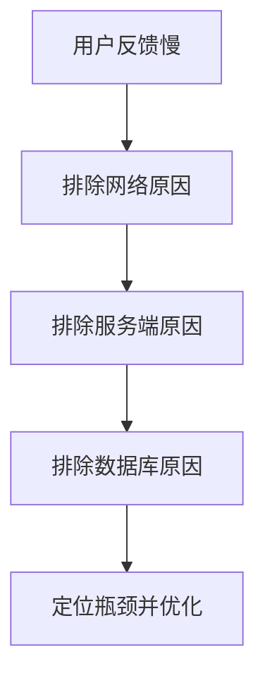
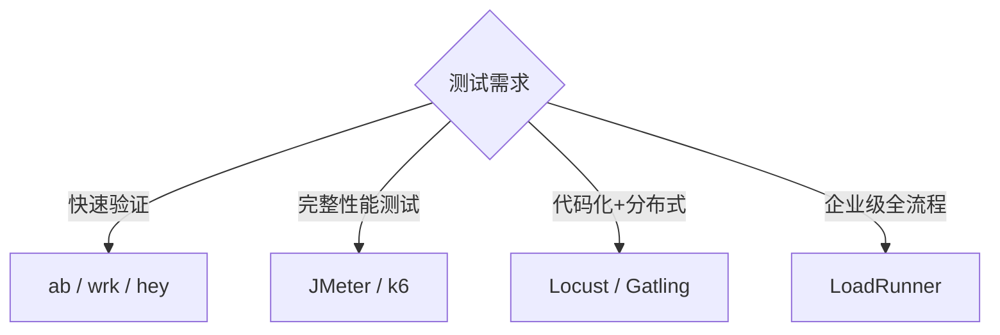

# 接口性能测试流程与工具详解

## 概述

接口功能正确只是质量底线，性能表现直接决定用户体验和系统可用性。本文系统梳理接口性能测试的核心指标、六大环节流程、主流工具对比及 Linux 性能监控命令，为后续 JMeter 实战和 Benchmark 工具学习建立方法论基础。

## 前置知识

- [REST Client 插件实战](../../04-前端/11-调试/05-mock与接口测试/05-REST%20Client插件实战.md)
- HTTP 协议与网络基础
- 操作系统基础（进程、内存、I/O）

## 学习目标

- 理解性能测试的核心指标体系
- 掌握接口测试六大环节的完整流程
- 能够根据场景选择合适的性能测试工具
- 了解 Linux 下常用的性能监控命令

---

## 一、性能测试的意义

### 1.1 生产环境的典型问题

| 问题 | 表现 | 业务影响 |
|------|------|----------|
| 响应慢 | 接口响应超过 3 秒 | 用户体验差、转化率下降 |
| 高延迟 | 页面加载缓慢 | 用户流失 |
| 不稳定 | 偶发性超时 | 业务中断、数据不一致 |
| 高并发崩溃 | 流量峰值服务不可用 | 直接经济损失 |

### 1.2 性能问题排查顺序



反向排查（从最可能的瓶颈开始）：

1. **数据库层**：慢查询日志、索引缺失、N+1 问题
2. **服务器层**：CPU/内存/磁盘 IO 瓶颈
3. **网络层**：带宽限制、DNS 解析、CDN 配置

---

## 二、核心性能指标

| 指标 | 定义 | 目标参考值 |
|------|------|-----------|
| 响应时间（RT） | 请求发出到收到完整响应的时间 | < 1 秒 |
| 吞吐量（TPS/QPS） | 单位时间处理的请求数 | 越高越好 |
| 并发数 | 同时处理的请求/用户数 | 根据业务定 |
| 错误率 | 失败请求占总请求的比例 | < 0.1% |
| 资源利用率 | CPU、内存、磁盘 IO、网络带宽 | 合理范围（< 80%） |

### 指标间的关系


- 低并发时：吞吐量随并发线性增长，RT 稳定
- 拐点后：RT 急剧上升，吞吐量下降，错误率攀升
- 性能测试的核心目标：**找到拐点，确保业务峰值在安全区间内**

---

## 三、接口测试六大环节


### 3.1 需求分析

**目标**：明确测试范围和性能指标。

- 识别关键接口（登录、下单、列表查询）
- 确定性能目标（如：100 并发下 RT < 1s）
- 制定测试策略（功能测试 + 性能测试 + 压力测试）

**产出物**：需求分析文档、测试范围清单

### 3.2 测试用例设计

**测试用例结构**：

```markdown
## 用例编号：TC-API-001
## 测试目标：验证登录接口在 100 并发下的响应时间
## 前置条件：数据库已准备测试数据、服务器正常运行
## 测试步骤：
1. 使用 JMeter 模拟 100 个并发用户
2. 连续发送登录请求 10 分钟
3. 记录响应时间、错误率
## 预期结果：平均 RT < 1s，错误率 < 0.1%
```

**注意**：
- 中小团队至少设计冒烟测试用例
- 给客户的项目必须有完整用例文档

### 3.3 测试环境搭建

**环境隔离原则**：

| 环境 | 用途 | 性能测试 |
|------|------|----------|
| DEV | 开发调试 | 不在此进行 |
| TEST | 功能/性能测试 | 在此进行 |
| STAGING | 预发布验证 | 可辅助验证 |
| PROD | 生产运行 | 禁止压测 |

### 3.4 执行测试

- 功能测试 → 性能测试 → 压力测试，逐步升级
- 推荐自动化执行（JMeter CLI / k6 / Newman）
- 记录每轮测试的完整数据

### 3.5 结果分析与报告

**测试报告核心结构**：

| 章节 | 内容 |
|------|------|
| 测试概述 | 时间、环境、工具 |
| 测试范围 | 覆盖的接口列表 |
| 测试结果 | 各接口的 RT、TPS、错误率 |
| 瓶颈分析 | 问题原因定位 |
| 优化建议 | 具体改进方案 |
| 结论 | 是否达标、后续计划 |

### 3.6 缺陷跟踪与回归


常用工具：禅道、JIRA、Trello

---

## 四、性能测试工具对比

### 4.1 免费工具

| 工具 | 语言 | 特点 | 适用场景 | 学习成本 |
|------|------|------|----------|----------|
| JMeter | Java | 功能全面、GUI + CLI、插件丰富 | 性能/压力/功能测试 | 中 |
| Locust | Python | 代码化、分布式、Web UI | 性能/负载测试 | 低 |
| Gatling | Scala | 高性能、报告美观 | 性能/压力测试 | 中 |
| k6 | Go | 现代化、JS 脚本、CI 友好 | 性能/负载测试 | 低 |
| Apache Bench | C | 极简命令行 | 快速基准测试 | 极低 |
| wrk | C | 高性能、Lua 脚本 | 快速基准测试 | 低 |

### 4.2 收费工具

| 工具 | 定位 | 适用 |
|------|------|------|
| LoadRunner | 企业级全功能 | 大型企业 |
| NeoLoad | 专业性能测试 | 企业应用 |
| Silk Performer | 企业级 | 企业应用 |

### 4.3 选型建议



---

## 五、Linux 性能监控命令

性能测试期间需同步监控服务器资源：

| 命令 | 监控对象 | 关键指标 |
|------|----------|----------|
| `top` / `htop` | CPU + 内存 | 使用率、负载、进程排名 |
| `vmstat 1` | 系统整体 | CPU 上下文切换、IO 等待 |
| `iostat -x 1` | 磁盘 IO | 读写速率、IO 利用率 |
| `netstat -s` | 网络 | 连接数、丢包率 |
| `sar -n DEV 1` | 网络流量 | 收发速率 |
| `free -h` | 内存 | 总量、已用、缓存 |
| `df -h` | 磁盘空间 | 各分区使用率 |

### 快速排查组合

```bash
# 1. 查看系统负载
uptime

# 2. 查看 CPU 和内存
top -bn1 | head -20

# 3. 查看磁盘 IO
iostat -x 1 3

# 4. 查看网络连接
ss -s

# 5. 查看慢查询（MySQL）
mysql -e "SHOW PROCESSLIST;"
```

---

## 六、实际工作中的流程差异

### 中小团队（精简流程）

```
环境搭建 → 执行测试（开发自测） → 缺陷跟踪 → 回归 → 上线
```

常缺失：需求分析、用例设计、测试报告

### 客户项目（完整流程）

```
需求分析 → 用例设计 → 环境搭建 → 执行测试 → 报告输出 → 缺陷跟踪 → 客户验收
```

必须环节：测试用例文档、测试报告、验收签字

---

## 常见问题

| 问题 | 解答 |
|------|------|
| 性能测试和功能测试能否同时进行？ | 不建议。性能测试需要独占环境资源，避免干扰 |
| 测试环境配置必须和生产一致吗？ | 尽量一致（CPU/内存/数据库），至少保持比例关系 |
| 需要多大的并发量？ | 参考生产峰值的 1.5~2 倍作为目标 |
| 测试结果波动大怎么办？ | 每场景执行 3~5 次取平均值，排除冷启动影响 |

## 最佳实践

1. **先功能后性能**：确保接口逻辑正确后再进行性能测试
2. **环境隔离**：性能测试在独立环境执行，避免开发活动干扰
3. **梯度加压**：从低并发逐步提升，观察拐点而非直接打满
4. **全链路监控**：测试期间同步监控应用、数据库、服务器三层指标
5. **报告必出**：无论项目规模，性能测试结果必须形成文档记录

## 延伸阅读

- 上一篇：[REST Client 插件实战](../../04-前端/11-调试/05-mock与接口测试/05-REST%20Client插件实战.md)
- 下一篇：[Benchmark 工具与框架性能对比](17-Benchmark工具与框架性能对比.md)
