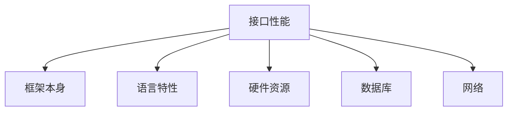

# Benchmark 工具与框架性能对比

## 概述

Benchmark（基准测试）通过标准化流程对系统性能进行评分和横向对比，是技术选型和性能优化的数据基础。本文以 Node.js Web 框架性能对比为切入点，解析性能影响因素、选型决策矩阵，并详解 autocannon、wrk、hey 三款轻量级 Benchmark 工具的使用方法。

## 前置知识

- [接口性能测试流程与工具详解](16-接口性能测试流程与工具详解.md)
- Node.js 基础与 Web 框架（Express / Koa / Fastify）
- 命令行工具使用

## 学习目标

- 理解 Benchmark 的核心价值与正确解读方式
- 掌握性能影响因素的多维分析框架
- 能够使用 autocannon / wrk / hey 执行基准测试
- 建立技术选型的综合决策能力（性能只是因素之一）

---

## 一、Benchmark 的意义

### 1.1 核心作用

| 作用 | 说明 |
|------|------|
| 性能对比 | 横向对比不同框架/工具的处理能力 |
| 瓶颈识别 | 定位性能短板，指导优化方向 |
| 技术选型 | 为方案选择提供量化数据支撑 |
| 版本验证 | 验证升级/重构后性能是否提升 |

### 1.2 典型案例：Fastify 官方 Benchmark

Fastify 官网（fastify.dev/benchmarks）由 GitHub Actions 定时驱动，每日自动更新与主流框架的对比数据：

| 框架 | 请求/秒 | 平均延迟 | 测试工具 |
|------|---------|----------|----------|
| Fastify | 40,000+ | ~2.5ms | autocannon |
| Koa | 30,000+ | ~3.3ms | autocannon |
| Express | 15,000+ | ~6.6ms | autocannon |

---

## 二、性能影响因素

### 2.1 多维影响模型



### 2.2 框架层面

| 框架 | 设计特点 | 性能 | 生态 |
|------|----------|------|------|
| Fastify | Schema 验证、序列化优化 | 最高 | 中等 |
| Koa | 轻量、async 中间件 | 高 | 丰富 |
| Express | 成熟、中间件海量 | 中 | 最丰富 |

### 2.3 语言层面

| 语言 | 并发模型 | 特点 |
|------|----------|------|
| Node.js | 异步非阻塞 I/O | 天生高并发、单线程 |
| Go | Goroutine 协程 | 轻量并发、编译型 |
| Java | 多线程 + 线程池 | 成熟稳定、生态完善 |
| Python | 多进程 / asyncio | 开发效率高、性能偏低 |

### 2.4 硬件层面

| 资源 | 瓶颈表现 | 优化方向 |
|------|----------|----------|
| CPU | 计算密集任务慢 | 增加核心、优化算法 |
| 内存 | 频繁 GC、OOM | 增加内存、减少分配 |
| 磁盘 IO | 数据库读写慢 | SSD、读写分离 |
| 网络 | 带宽打满 | 升级带宽、CDN |

### 2.5 数据库（最常见瓶颈）


常见问题：
- SQL 未加索引导致全表扫描
- N+1 查询（循环中逐条查询）
- 大表关联无分页
- 缺少缓存层（Redis）

---

## 三、技术选型决策矩阵

### 3.1 综合评估

| 因素 | 权重 | Express | Fastify | Koa |
|------|------|---------|---------|-----|
| 性能 | 30% | 中 | 最高 | 高 |
| 生态 | 30% | 最丰富 | 中等 | 丰富 |
| 文档 | 20% | 最完善 | 良好 | 良好 |
| 学习曲线 | 10% | 低 | 低 | 低 |
| 团队熟悉度 | 10% | 最高 | 低 | 中 |

### 3.2 场景推荐

| 场景 | 推荐 | 理由 |
|------|------|------|
| 快速原型 / MVP | Express | 生态丰富、上手快 |
| 高性能 API 服务 | Fastify | 性能最优、Schema 验证 |
| 轻量级中间件项目 | Koa | async 中间件优雅 |
| NestJS 项目 | Express（默认）/ Fastify | NestJS 支持适配器切换 |

### 3.3 NestJS 切换 Fastify

```typescript
// main.ts
import { NestFactory } from '@nestjs/core'
import { FastifyAdapter } from '@nestjs/platform-fastify'
import { AppModule } from './app.module'

async function bootstrap() {
  const app = await NestFactory.create(AppModule, new FastifyAdapter())
  await app.listen(3000)
}
bootstrap()
```

### 3.4 正确认知

> 框架性能只是影响因素之一。瓶颈通常在数据库和业务逻辑，选择框架要综合考虑性能 + 生态 + 文档 + 团队熟悉度。

**全链路优化优先级**：

1. 数据库优化（影响最大）：索引、SQL 优化、缓存
2. 业务逻辑优化：减少计算、异步处理
3. 框架优化：切换高性能框架、精简中间件
4. 网络优化：CDN、压缩、HTTP/2

---

## 四、Benchmark 工具详解

### 4.1 autocannon

Node.js 编写的高性能 HTTP/1.1 基准测试工具，Fastify 官方使用。

**安装**：

```bash
npm install -g autocannon
```

**基本用法**：

```bash
# 10 连接，持续 10 秒
autocannon -c 10 -d 10 http://localhost:3000/api/users

# 100 连接，30 秒，输出延迟分布
autocannon -c 100 -d 30 -l http://localhost:3000/api/users

# POST 请求
autocannon -c 50 -d 20 -m POST \
  -H "Content-Type=application/json" \
  -b '{"username":"test","password":"123456"}' \
  http://localhost:3000/api/login
```

**参数说明**：

| 参数 | 说明 | 默认值 |
|------|------|--------|
| `-c` | 并发连接数 | 10 |
| `-d` | 持续时间（秒） | 10 |
| `-p` | 管道数 | 1 |
| `-m` | 请求方法 | GET |
| `-H` | 请求头 | - |
| `-b` | 请求体 | - |
| `-l` | 输出延迟分布 | false |

**脚本化测试**：

```javascript
const autocannon = require('autocannon')

async function run() {
  const result = await autocannon({
    url: 'http://localhost:3000',
    connections: 100,
    duration: 30,
    requests: [
      { method: 'GET', path: '/api/users' },
      {
        method: 'POST',
        path: '/api/login',
        headers: { 'Content-Type': 'application/json' },
        body: JSON.stringify({ username: 'test', password: '123456' })
      }
    ]
  })
  console.log(result)
}

run()
```

**输出解读**：

| 指标 | 含义 |
|------|------|
| Latency (Avg) | 平均延迟 |
| Latency (97.5%) | P97.5 延迟 |
| Req/Sec (Avg) | 平均每秒请求数 |
| Bytes/Sec | 每秒传输数据量 |

### 4.2 wrk

C 语言编写的高性能 HTTP 基准测试工具，支持 Lua 脚本。

**安装**：

```bash
# macOS
brew install wrk

# Ubuntu
sudo apt-get install wrk
```

**基本用法**：

```bash
# 12 线程，400 连接，30 秒
wrk -t12 -c400 -d30s http://localhost:3000/api/users

# 带 Lua 脚本（自定义请求）
wrk -t4 -c100 -d10s -s post.lua http://localhost:3000/api/login
```

**Lua 脚本示例**（post.lua）：

```lua
wrk.method = "POST"
wrk.headers["Content-Type"] = "application/json"
wrk.body = '{"username":"test","password":"123456"}'
```

**输出解读**：

```
Running 30s test @ http://localhost:3000/api/users
  12 threads and 400 connections
  Thread Stats   Avg      Stdev     Max   +/- Stdev
    Latency     5.2ms    2.1ms   45.3ms   72.1%
    Req/Sec     6.5k     1.2k    12.3k    68.5%
  2340567 requests in 30.0s, 445.2MB read
Requests/sec:  78018.9
Transfer/sec:     14.8MB
```

### 4.3 hey

Go 编写的现代化 HTTP 负载测试工具，ab 的替代品。

**安装**：

```bash
# macOS
brew install hey

# Go install
go install github.com/rakyll/hey@latest
```

**基本用法**：

```bash
# 200 并发，持续 30 秒
hey -c 200 -z 30s http://localhost:3000/api/users

# 指定总请求数和并发
hey -n 10000 -c 100 http://localhost:3000/api/users

# POST 请求
hey -c 50 -z 10s -m POST \
  -H "Content-Type: application/json" \
  -d '{"username":"test"}' \
  http://localhost:3000/api/login
```

**输出特色**：自动生成延迟分布直方图和百分位统计。

### 4.4 工具对比

| 维度 | autocannon | wrk | hey |
|------|-----------|-----|-----|
| 语言 | Node.js | C | Go |
| 安装 | npm | brew/apt | brew/go |
| 脚本化 | JS API | Lua | 有限 |
| 输出格式 | 表格 + JSON | 纯文本 | 直方图 + 百分位 |
| 适用场景 | Node.js 项目 | 极致性能测试 | 快速验证 |
| CI 集成 | 容易（npm） | 需编译 | 容易（单二进制） |

---

## 五、实战：Express vs Koa vs Fastify

### 5.1 测试准备

```javascript
// server-express.js
const express = require('express')
const app = express()
app.get('/api/hello', (req, res) => res.json({ message: 'hello' }))
app.listen(3001)

// server-koa.js
const Koa = require('koa')
const app = new Koa()
app.use((ctx) => { ctx.body = { message: 'hello' } })
app.listen(3002)

// server-fastify.js
const fastify = require('fastify')()
fastify.get('/api/hello', async () => ({ message: 'hello' }))
fastify.listen({ port: 3003 })
```

### 5.2 执行测试

```bash
# 统一条件：100 连接，30 秒
autocannon -c 100 -d 30 http://localhost:3001/api/hello
autocannon -c 100 -d 30 http://localhost:3002/api/hello
autocannon -c 100 -d 30 http://localhost:3003/api/hello
```

### 5.3 结果分析要点

- 对比 Req/Sec 和 Latency 的 Avg / P99
- 观察 Stdev（标准差）判断稳定性
- 多次执行取平均，排除冷启动影响

---

## 常见问题

| 问题 | 解答 |
|------|------|
| Benchmark 结果能否代表生产表现？ | 不能。Benchmark 测试的是纯框架开销，生产环境瓶颈通常在数据库和业务逻辑 |
| 为什么每次测试结果不同？ | 系统后台进程、GC、网络波动均会影响，需多次取平均 |
| Express 性能最差是否不该用？ | 不是。15000 req/s 对绝大多数业务足够，生态和团队熟悉度更重要 |
| 测试时应该开几个连接？ | 从 10 → 50 → 100 → 500 梯度测试，观察拐点 |

## 最佳实践

1. **控制变量**：同一硬件、同一时间、相同参数下对比
2. **多次执行**：每组测试至少 3 次，取中位数
3. **关注 P99 而非平均值**：长尾延迟才是用户体验的真实反映
4. **结合业务场景**：纯 Hello World 对比意义有限，应加入数据库查询等真实逻辑
5. **记录测试环境**：CPU 型号、内存、Node.js 版本、操作系统均需记录在报告

## 延伸阅读

- 上一篇：[接口性能测试流程与工具详解](16-接口性能测试流程与工具详解.md)
- 下一篇：[JMeter 安装配置与基础入门](18-JMeter安装配置与基础入门.md)
