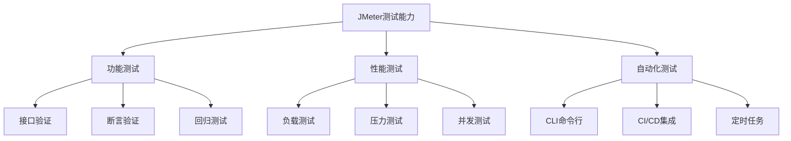
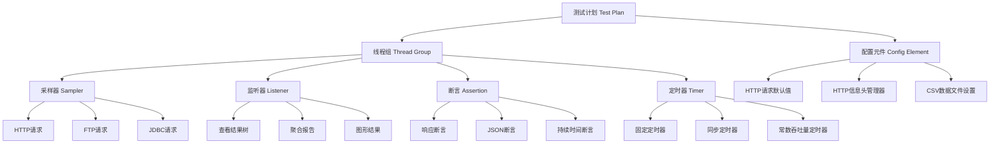

# JMeter 安装配置与基础入门

## 概述

Apache JMeter 是 Apache 基金会开发的开源性能测试工具，100% 纯 Java 实现，支持 HTTP、FTP、JDBC 等多协议，覆盖功能测试、性能测试、压力测试和自动化测试。本文完成从 Java 环境准备到 JMeter 安装启动的全流程，并系统介绍其组件化架构。

## 前置知识

- [Benchmark 工具与框架性能对比](17-Benchmark工具与框架性能对比.md)
- Java 运行环境基本概念
- 命令行基础操作

## 学习目标

- 完成 JDK 安装与环境变量配置
- 掌握 JMeter 的安装与双模式启动（GUI / CLI）
- 理解 JMeter 测试计划的组件体系
- 能够进行界面配置优化（高分屏适配）

---

## 一、JMeter 核心特性

| 特性 | 说明 |
|------|------|
| 开源免费 | Apache 协议 |
| 跨平台 | Windows / macOS / Linux |
| 多协议 | HTTP/HTTPS、FTP、JDBC、JMS、SMTP、TCP |
| 多测试类型 | 功能、性能、压力、回归 |
| 双模式 | GUI 开发 + CLI 自动化 |
| 分布式 | 支持 Master-Slave 多线程测试 |
| 可扩展 | 插件机制丰富 |

### 支持的测试类型



---

## 二、Java 环境准备

JMeter 是 Java 应用，需要 JDK 8 或更高版本。

### 2.1 macOS 安装

```bash
# Homebrew 安装（推荐）
brew install openjdk@8

# 验证
java -version
```

### 2.2 Linux 安装

```bash
# Ubuntu/Debian
sudo apt-get install openjdk-8-jdk

# CentOS/RHEL
sudo yum install java-1.8.0-openjdk
```

### 2.3 Windows 安装

1. 下载 JDK 安装包并运行
2. 配置环境变量：

```
JAVA_HOME = C:\Program Files\Java\jdk1.8.0_202
CLASSPATH = .;%JAVA_HOME%\lib\dt.jar;%JAVA_HOME%\lib\tools.jar
Path 追加 %JAVA_HOME%\bin
```

3. 验证：`java -version`

### 2.4 多版本管理

| 平台 | 工具 | 安装 |
|------|------|------|
| macOS | jenv | `brew install jenv` |
| Windows | JVMs | github.com/ystyle/jvms |

```bash
# jenv 常用命令
jenv add /Library/Java/JavaVirtualMachines/jdk1.8.0_202.jdk/Contents/Home
jenv global 1.8
jenv local 11
java -version
```

---

## 三、JMeter 安装

### 3.1 下载

官方地址：https://jmeter.apache.org/download_jmeter.cgi

| 文件 | 适用平台 |
|------|----------|
| apache-jmeter-5.x.zip | Windows |
| apache-jmeter-5.x.tgz | macOS / Linux |

### 3.2 安装

```bash
# macOS / Linux
tar -xzf apache-jmeter-5.5.tgz
sudo mv apache-jmeter-5.5 /usr/local/

# Windows：解压到指定目录即可
```

### 3.3 目录结构

```
apache-jmeter-5.5/
├── bin/                  # 启动脚本与配置
│   ├── jmeter.sh        # macOS/Linux 启动
│   ├── jmeter.bat       # Windows 启动
│   └── jmeter.properties # 配置文件
├── lib/
│   └── ext/             # 插件目录
├── docs/                # 文档
├── extras/              # 扩展功能
└── licenses/            # 许可证
```

---

## 四、启动模式

### 4.1 GUI 模式（测试开发）

```bash
# macOS / Linux
cd /usr/local/apache-jmeter-5.5/bin
sh jmeter.sh

# Windows
双击 bin/jmeter.bat
```

适用于：测试计划设计、调试、结果可视化分析。

### 4.2 CLI 模式（自动化测试）

```bash
jmeter.sh -n -t test_plan.jmx -l result.jtl

# 参数说明
# -n: 无界面模式
# -t: 测试计划文件（.jmx）
# -l: 结果输出文件（.jtl）
```

适用于：Docker 容器、Linux 服务器、CI/CD 流水线。

---

## 五、界面配置优化

高分屏下 JMeter 默认字体和图标偏小，需调整 `bin/jmeter.properties`：

```properties
# HiDPI 适配
jmeter.hidpi.mode=true
jmeter.hidpi.scale.factor=1.5

# 编辑器字体
jsyntaxtextarea.font.family=Consolas
jsyntaxtextarea.font.size=20

# 界面字体
jmeter.dialog.font.size=20

# 工具栏图标
jmeter.toolbar.icons.size=48x48

# 树形图标
jmeter.tree.icons.size=24x24
```

修改后重启 JMeter 生效。

---

## 六、组件体系

### 6.1 测试计划结构



### 6.2 核心组件说明

| 组件 | 作用 | 关键配置 |
|------|------|----------|
| 线程组 | 模拟并发用户 | 线程数、Ramp-Up、循环次数 |
| 采样器 | 发送请求 | 协议、路径、方法、参数 |
| 监听器 | 查看/分析结果 | 结果树、聚合报告、图表 |
| 断言 | 验证响应正确性 | 状态码、文本匹配、JSON 校验 |
| 定时器 | 控制请求节奏 | 延迟时间、并发数、QPS |
| 配置元件 | 公共参数复用 | 默认 URL、请求头、CSV 数据 |
| 前置处理器 | 请求前执行 | 参数生成、签名计算 |
| 后置处理器 | 请求后执行 | 提取响应数据（JSON/正则） |

### 6.3 组件执行顺序

```
配置元件 → 前置处理器 → 定时器 → 采样器 → 后置处理器 → 断言 → 监听器
```

### 6.4 添加组件操作

```
右键测试计划 → 添加 → 线程(用户) → 线程组
右键线程组 → 添加 → 取样器 → HTTP请求
右键线程组 → 添加 → 监听器 → 查看结果树
右键线程组 → 添加 → 监听器 → 聚合报告
```

---

## 七、线程组核心参数

| 参数 | 说明 | 示例 |
|------|------|------|
| 线程数 | 模拟的并发用户数 | 100 |
| Ramp-Up 时间 | 启动所有线程的总时间（秒） | 10 |
| 循环次数 | 每个线程执行次数（或"永远"） | 10 |
| 持续时间 | 调度器：测试运行总时长 | 60 秒 |
| 启动延迟 | 调度器：延迟多久开始 | 0 秒 |

**Ramp-Up 计算**：

```
每个线程启动间隔 = Ramp-Up / 线程数
示例：100 线程 / 10 秒 = 每 0.1 秒启动一个线程
```

---

## 常见问题

| 问题 | 原因 | 解决方案 |
|------|------|----------|
| 无法启动 JMeter | Java 未安装或版本不对 | 安装 JDK 8+ 并配置 JAVA_HOME |
| 界面字体太小 | 高分屏未适配 | 修改 jmeter.properties 中 hidpi 配置 |
| 中文乱码 | 编码设置问题 | HTTP 请求中设置 Content-Encoding 为 UTF-8 |
| 内存溢出 | 测试数据量过大 | 增加 JVM 内存：`JVM_ARGS="-Xmx2048m"` |
| 多版本 Java 冲突 | 系统存在多个 JDK | 使用 jenv / JVMs 管理版本 |

## 最佳实践

1. **GUI 开发、CLI 执行**：测试计划用 GUI 设计调试，正式压测用 CLI 模式避免 GUI 资源消耗
2. **高分屏先调配置**：安装后第一时间调整字体和图标大小
3. **组件按需添加**：监听器消耗内存，调试完成后移除不必要的监听器
4. **测试计划版本管理**：.jmx 文件是 XML 格式，可纳入 Git 管理

## 延伸阅读

- 上一篇：[Benchmark 工具与框架性能对比](17-Benchmark工具与框架性能对比.md)
- 下一篇：[JMeter 插件安装与图形化监控](19-JMeter插件安装与图形化监控.md)
