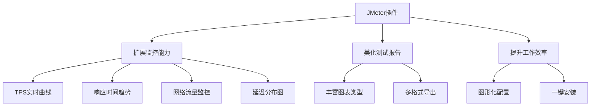
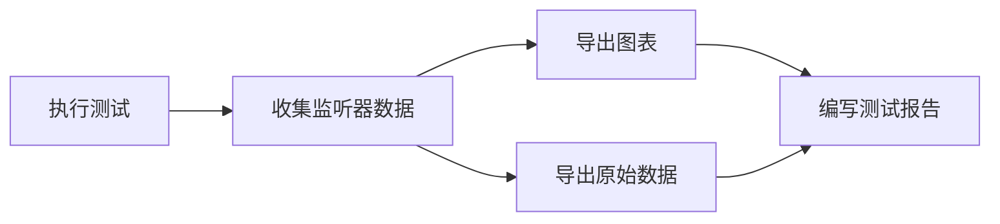

# JMeter 插件安装与图形化监控

## 概述

JMeter 原生监听器在图形化展示方面能力有限，通过插件可扩展 TPS 实时曲线、响应时间趋势、延迟分布等丰富图表。本文介绍插件管理器的安装流程、常用插件推荐、图形化监控的使用方法以及性能分析技巧。

## 前置知识

- [JMeter 安装配置与基础入门](18-JMeter安装配置与基础入门.md)
- JMeter 测试计划基本结构
- 性能指标概念（TPS、响应时间、错误率）

## 学习目标

- 掌握 JMeter 插件管理器的安装与使用
- 了解常用插件的功能定位与安装方式
- 能够添加 TPS / 响应时间图表监听器并解读数据
- 掌握图表分析技巧与报告生成流程

---

## 一、为什么需要插件

| 能力 | 原生 JMeter | 插件扩展 |
|------|------------|----------|
| 图形化监控 | 基础图表 | 丰富图表类型 |
| 实时监控 | 不支持 | TPS/RT 实时曲线 |
| 报告美观度 | 一般 | 专业级可视化 |
| 自定义指标 | 受限 | 灵活配置 |
| 服务器监控 | 不支持 | CPU/内存/磁盘（PerfMon） |

### 插件核心价值



---

## 二、插件管理器安装

### 2.1 下载

官方地址：https://jmeter-plugins.org/

下载 `JMeterPlugins-manager.jar`。

### 2.2 安装步骤

```bash
# 将 jar 包复制到 JMeter 插件目录
cp JMeterPlugins-manager.jar /path/to/jmeter/lib/ext/

# 重启 JMeter
```

### 2.3 验证安装

```
顶部菜单 → 选项 → Plugins Manager
```

能看到 Plugins Manager 对话框即安装成功。

### 2.4 目录结构

```
jmeter/
├── bin/
│   ├── jmeter.sh
│   └── jmeter.properties
├── lib/
│   └── ext/                    # 插件目录
│       ├── JMeterPlugins-manager.jar
│       └── ...（其他插件 jar）
└── docs/
```

---

## 三、常用插件推荐

### 3.1 必装插件

| 插件 | 功能 | 推荐度 |
|------|------|--------|
| Standard Set | 标准插件集（含基础图表） | 必装 |
| Extras Set | 扩展插件集 | 必装 |
| 3 Basic Graphs | TPS / 响应时间 / 响应分布 | 必装 |

### 3.2 可选插件

| 插件 | 功能 | 适用场景 |
|------|------|----------|
| Throughput Shaping Timer | 吞吐量整形（阶梯加压） | 精确控制 QPS |
| Custom Thread Groups | 自定义线程组 | 复杂并发模型 |
| PerfMon Plugin | 服务器资源监控 | CPU/内存/磁盘 |
| Synthesis Report | 综合报告 | 报告输出 |
| Parallel Controller & Sampler | 并行请求 | 并发安全测试 |

### 3.3 3 Basic Graphs 包含的图表

| 图表 | 英文名 | 监控内容 |
|------|--------|----------|
| TPS 图表 | Transactions per Second | 每秒事务数 |
| 响应时间趋势 | Response Times Over Time | RT 随时间变化 |
| 响应时间分布 | Response Time Distribution | RT 分布直方图 |

---

## 四、插件安装实战

### 4.1 在线安装（推荐）

1. 打开 Plugins Manager：`选项 → Plugins Manager`
2. 切换到 **Available Plugins** 标签
3. 搜索 "3 Basic Graphs" 或 "Standard Set"
4. 勾选目标插件
5. 点击 "Apply Changes and Restart JMeter"
6. 等待下载完成，JMeter 自动重启

### 4.2 离线安装（网络受限）

```bash
# 方法1：手动下载 jar 包
# 下载地址：https://jmeter-plugins.org/downloads/old/
cp JMeterPlugins-Standard.jar /path/to/jmeter/lib/ext/

# 方法2：批量复制插件包
cp jmeter-plugins-pack/*.jar /path/to/jmeter/lib/ext/

# 重启 JMeter
```

---

## 五、图形化监控使用

### 5.1 添加 TPS 图表

```
线程组右键 → 添加 → 监听器 → jp@gc - Transactions per Second
```

**界面标签页**：

| 标签 | 功能 |
|------|------|
| Chart | 查看 TPS 折线图 |
| Rows | 查看原始数据 |
| Settings | 配置采样粒度、聚合方式 |

### 5.2 添加响应时间图表

```
线程组右键 → 添加 → 监听器 → jp@gc - Response Times Over Time
```

### 5.3 完整监控测试计划

```
测试计划
├── 线程组（100 线程，Ramp-Up 10s，循环 10 次）
│   ├── HTTP请求（/api/users）
│   ├── 查看结果树（调试用）
│   ├── 聚合报告（统计用）
│   ├── jp@gc - Transactions per Second
│   ├── jp@gc - Response Times Over Time
│   └── jp@gc - Response Time Distribution
└── 响应断言（验证状态码 200）
```

---

## 六、性能指标解读

### 6.1 TPS 评估标准

| TPS 范围 | 性能评价 |
|----------|----------|
| < 50 | 较差 |
| 50 - 100 | 一般 |
| 100 - 500 | 良好 |
| > 500 | 优秀 |

**计算公式**：`TPS = 总请求数 / 总时间`

### 6.2 响应时间评估标准

| 响应时间 | 评价 |
|----------|------|
| < 1 秒 | 优秀 |
| 1 - 3 秒 | 良好 |
| 3 - 5 秒 | 一般 |
| > 5 秒 | 较差 |

### 6.3 图表分析技巧

**TPS 正常模式**：启动期上升 → 稳定期平台 → 结束期下降

**TPS 异常模式**：急剧下降后无法恢复 → 可能存在资源瓶颈（连接池耗尽、线程阻塞）

**响应时间正常模式**：稳定在较低水平，波动小

**响应时间异常模式**：持续上升趋势 → 内存泄漏、连接未释放、GC 压力

---

## 七、报告生成流程



### 导出操作

| 操作 | 方法 | 格式 |
|------|------|------|
| 导出图表 | 右键图表 → Save Image | PNG / JPG |
| 导出数据 | 右键监听器 → Save Table Data | CSV |

### 二次分析工具

| 工具 | 适用场景 |
|------|----------|
| Excel / Google Sheets | 基础图表 |
| Python + Pandas | 高级统计分析 |
| Grafana | 实时监控仪表盘 |

### 图表命名规范

```
[项目名]_[接口名]_[指标]_[日期].png

示例：
user_api_tps_20260308.png
user_api_response_time_20260308.png
```

---

## 八、Settings 配置详解

| 配置项 | 说明 | 默认值 |
|--------|------|--------|
| Granularity | 数据采样间隔 | 1000ms（以 TPS 图为例，各图默认不一） |
| Aggregate | 是否聚合多线程数据 | Yes |
| Scale | Y 轴缩放（线性/对数） | Linear |
| Legend | 是否显示图例 | Yes |

**调优建议**：
- 短时间测试（< 60s）：Granularity 设为 1000ms
- 长时间测试（> 10min）：Granularity 设为 60000ms
- 数据量极大时：使用对数缩放观察分布

---

## 常见问题

| 问题 | 原因 | 解决方案 |
|------|------|----------|
| 插件安装超时 | 网络不通 | 使用离线安装或配置代理 |
| ClassNotFoundException | 依赖冲突 | 清理 lib/ext 后重新安装 |
| 图表无数据 | 未执行测试或采样器配置错误 | 检查线程数 > 0、请求路径正确 |
| 图表只显示部分数据 | Granularity 过大 | 减小采样间隔 |
| GUI 卡顿 | 监听器过多 | 正式测试时移除非必要监听器 |

## 最佳实践

1. **新项目标配**：Standard Set + 3 Basic Graphs 一次安装到位
2. **GUI 调试、CLI 压测**：调试时用图表观察，正式压测用 CLI 模式减少资源消耗
3. **核心指标组合**：TPS + 响应时间 + 错误率三者同时监控
4. **及时导出**：测试完成后立即导出图表和 CSV，避免 JMeter 关闭后数据丢失
5. **JVM 内存调优**：大规模测试前设置 `JVM_ARGS="-Xms512m -Xmx2048m"`

## 延伸阅读

- 上一篇：[JMeter 安装配置与基础入门](18-JMeter安装配置与基础入门.md)
- 下一篇：[JMeter 性能测试实战指南](20-JMeter性能测试实战指南.md)
