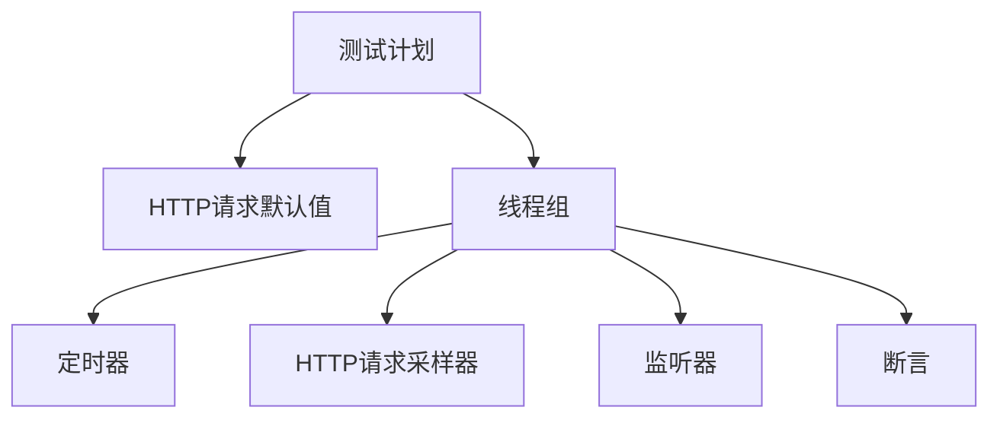
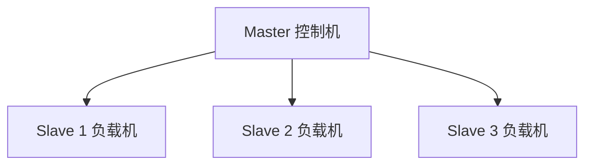

# JMeter 性能测试实战指南

## 概述

本文通过完整的实战案例，演示 JMeter 测试计划的设计与执行全流程：从 HTTP 请求默认值配置、线程组参数调优、定时器并发控制，到监听器结果分析和性能报告输出。重点讲解同步定时器和常数吞吐量定时器两种核心并发控制机制。

## 前置知识

- [JMeter 安装配置与基础入门](18-JMeter安装配置与基础入门.md)
- [JMeter 插件安装与图形化监控](19-JMeter插件安装与图形化监控.md)
- 性能指标概念（TPS、RT、并发数）

## 学习目标

- 掌握完整测试计划的搭建流程
- 理解同步定时器与常数吞吐量定时器的工作原理
- 能够设计"指定并发 + 指定 QPS + 指定时长"的压测方案
- 掌握聚合报告解读与性能评估标准

---

## 一、测试计划搭建

### 1.1 完整结构



### 1.2 组件执行顺序

```
配置元件 → 前置处理器 → 定时器 → 采样器 → 后置处理器 → 断言 → 监听器
```

### 1.3 线程组执行顺序

```
setUp 线程组（前置准备）→ 线程组（主测试）→ tearDown 线程组（清理）
```

类比测试框架：setUp ≈ `beforeAll`，tearDown ≈ `afterAll`

---

## 二、配置步骤详解

### 2.1 HTTP 请求默认值

```
测试计划右键 → 添加 → 配置元件 → HTTP请求默认值
```

| 参数 | 值 | 说明 |
|------|-----|------|
| 协议 | http | 或 https |
| 服务器 | localhost | 目标地址 |
| 端口 | 3000 | 服务端口 |
| 编码 | UTF-8 | 字符编码 |

**作用**：后续 HTTP 请求自动继承，无需重复填写；切换环境只需修改此处。

### 2.2 线程组配置

```
测试计划右键 → 添加 → 线程(用户) → 线程组
```

**核心参数**：

| 参数 | 含义 | 配置示例 |
|------|------|----------|
| 线程数 | 模拟并发用户数 | 100 |
| Ramp-Up | 启动所有线程的时间 | 10 秒 |
| 循环次数 | 每线程执行次数（或"永远"） | 永远 |
| 持续时间 | 调度器：总运行时长 | 20 秒 |

**Ramp-Up 计算**：

```
启动间隔 = Ramp-Up / 线程数 = 10s / 100 = 0.1s
→ 每 0.1 秒启动一个新线程
```

### 2.3 HTTP 请求采样器

```
线程组右键 → 添加 → 取样器 → HTTP请求
```

| 参数 | 值 |
|------|-----|
| 名称 | 获取用户列表 |
| 方法 | GET |
| 路径 | /api/users |

协议/服务器/端口已由 HTTP 请求默认值提供，无需重复填写。

### 2.4 监听器

| 监听器 | 用途 | 阶段 |
|--------|------|------|
| 查看结果树 | 查看每个请求详情 | 调试 |
| 聚合报告 | 统计 RT、吞吐量、错误率 | 分析 |
| TPS 图表 | 实时 TPS 曲线 | 监控 |
| 响应时间图表 | 实时 RT 曲线 | 监控 |

---

## 三、定时器详解

### 3.1 同步定时器（Synchronizing Timer）

**作用**：控制瞬时并发数量——等待指定数量的线程就绪后同时发送请求。

```
线程组/HTTP请求右键 → 添加 → 定时器 → Synchronizing Timer
```

**参数**：

| 参数 | 说明 | 示例 |
|------|------|------|
| 模拟用户组数量 | 同时并发的线程数 | 20 |
| 超时时间 | 等待线程就绪的最大时间 | 10000ms |

**关键规则**：

```
线程组线程数 ≥ 同步定时器模拟用户组数量
```

**错误配置示例**：

```
线程数：5，模拟用户组：20，超时：0
→ 永远凑不齐 20 个线程，测试卡死
```

**正确配置示例**：

```
线程数：100，模拟用户组：20，超时：10000ms
→ 每凑齐 20 个线程并发执行一次，5 批完成一轮
```

### 3.2 常数吞吐量定时器（Constant Throughput Timer）

**作用**：控制请求频率（QPS），将吞吐量限制在目标值。

```
线程组/HTTP请求右键 → 添加 → 定时器 → Constant Throughput Timer
```

**参数**：

| 参数 | 说明 | 示例 |
|------|------|------|
| 目标吞吐量 | 每分钟样本数 | 3000 |
| 计算基于 | 作用范围 | 此线程组 |

**QPS 转换公式**：

```
目标吞吐量 = QPS × 60

示例：
  QPS = 50 → 目标吞吐量 = 50 × 60 = 3000
  QPS = 100 → 目标吞吐量 = 100 × 60 = 6000
```

**作用范围由位置决定**：
- 放在线程组顶层 → 控制整个线程组
- 放在某个 HTTP 请求上 → 仅控制该请求

### 3.3 两种定时器对比

| 维度 | 同步定时器 | 常数吞吐量定时器 |
|------|-----------|-----------------|
| 控制目标 | 并发数量 | QPS |
| 单位 | 用户数 | 请求数/分钟 |
| 作用 | 模拟瞬时并发 | 控制请求频率 |
| 场景 | 压力测试 | 流量控制 |
| 可组合 | 是 | 是 |

---

## 四、实战案例

### 4.1 需求

```
场景：模拟 100 个用户，50 QPS，持续 20 秒
目标接口：GET /api/users、GET /api/posts
```

### 4.2 完整配置

```
测试计划
├── HTTP请求默认值
│   ├── 协议：http
│   ├── 服务器：localhost
│   └── 端口：3000
│
├── 线程组
│   ├── 线程数：100
│   ├── Ramp-Up：10 秒
│   ├── 循环次数：永远
│   └── 调度器持续时间：20 秒
│
├── 常数吞吐量定时器
│   ├── 目标吞吐量：3000（= 50 QPS × 60）
│   └── 计算基于：此线程组
│
├── HTTP请求1：GET /api/users
├── HTTP请求2：GET /api/posts
│
└── 监听器
    ├── 查看结果树
    ├── 聚合报告
    ├── TPS 图表
    └── 响应时间图表
```

### 4.3 执行流程

1. 清空先前结果（扫把图标）
2. 点击运行（绿色三角 / Ctrl+R）
3. 等待 20 秒调度器结束
4. 查看聚合报告和图表

### 4.4 聚合报告解读

| 指标 | 英文 | 说明 |
|------|------|------|
| 样本 | Samples | 总请求数 |
| 平均值 | Average | 平均 RT (ms) |
| 中位数 | Median | P50 RT |
| 90% Line | 90th pct | P90 RT |
| 95% Line | 95th pct | P95 RT |
| 99% Line | 99th pct | P99 RT |
| 最小值 | Min | 最小 RT |
| 最大值 | Max | 最大 RT |
| 错误率 | Error % | 失败占比 |
| 吞吐量 | Throughput | 每秒请求数 |
| 接收速率 | Received KB/s | 下行带宽 |
| 发送速率 | Sent KB/s | 上行带宽 |

---

## 五、性能评估标准

### 5.1 响应时间

| RT | 评价 | 用户体验 |
|----|------|----------|
| < 100ms | 优秀 | 极快 |
| 100 - 300ms | 良好 | 快速 |
| 300ms - 1s | 一般 | 可接受 |
| 1 - 3s | 较差 | 明显慢 |
| > 3s | 很差 | 难以接受 |

### 5.2 吞吐量

| QPS | 评价 | 适用规模 |
|-----|------|----------|
| < 50 | 较差 | 小型项目 |
| 50 - 100 | 一般 | 中小项目 |
| 100 - 500 | 良好 | 中型项目 |
| 500 - 1000 | 优秀 | 大型项目 |
| > 1000 | 卓越 | 超大型项目 |

### 5.3 错误率

| 错误率 | 评价 | 处理 |
|--------|------|------|
| 0% | 优秀 | 正常 |
| 0 - 1% | 良好 | 关注 |
| 1 - 5% | 一般 | 需优化 |
| > 5% | 较差 | 必须修复 |

---

## 六、进阶技巧

### 6.1 参数化测试（CSV 数据驱动）

```
1. 创建 users.csv：
   username,password
   user1,pass1
   user2,pass2
   user3,pass3

2. 添加 CSV Data Set Config：
   文件名：users.csv
   变量名：username,password
   循环：True

3. HTTP 请求中引用：
   Body: {"username": "${username}", "password": "${password}"}
```

### 6.2 断言验证

```
HTTP请求右键 → 添加 → 断言 → 响应断言
  字段：响应文本
  规则：包括
  模式：success
```

### 6.3 分布式测试



适用于单机无法产生足够压力的场景，多台负载机同时向目标服务器施压。

### 6.4 顺序 vs 并发执行

| 模式 | 配置 | 适用场景 |
|------|------|----------|
| 顺序 | 勾选 "Run Thread Groups consecutively" | 业务流程、接口依赖 |
| 并发 | 不勾选（默认） | 性能压测、负载测试 |

---

## 七、性能测试报告模板

```markdown
# 性能测试报告

## 1. 测试背景
- 目的 / 范围 / 时间

## 2. 测试环境
- 服务器配置 / 网络 / 数据库

## 3. 测试场景
- 场景描述 / 参数 / 预期目标

## 4. 测试结果
| 指标 | 目标值 | 实际值 | 达标 |
|------|--------|--------|------|
| 响应时间 | < 1s | 15ms | 达标 |
| 吞吐量 | 50 QPS | 50 QPS | 达标 |
| 错误率 | < 1% | 0% | 达标 |

## 5. 性能分析
- 瓶颈识别 / 优化建议 / 风险提示

## 6. 结论
- 是否达标 / 后续计划
```

---

## 常见问题

| 问题 | 原因 | 解决方案 |
|------|------|----------|
| 测试卡死不执行 | 同步定时器线程数不足 + 超时为 0 | 线程数 ≥ 模拟用户组数量，或设置超时 > 0 |
| TPS 达不到预期 | 定时器配置错误 / 服务器瓶颈 | 检查 QPS×60 计算；排查服务器资源 |
| 响应时间过长 | 数据库慢查询 / 代码性能差 | 慢查询日志 + 代码 Profiling |
| 错误率突增 | 连接池耗尽 / 线程竞争 | 检查连接池配置、锁机制 |

## 最佳实践

1. **从小到大**：先 10 线程验证脚本正确，再逐步加压到目标值
2. **单一变量**：每次只调整一个参数，明确因果关系
3. **多次验证**：每场景 3~5 次取平均，排除偶发波动
4. **全链路监控**：压测期间同步监控应用日志、数据库慢查询、服务器 top/iostat
5. **测试计划设计原则**：
   - 并发测试 → 同步定时器
   - 流量控制 → 常数吞吐量定时器
   - 混合场景 → 两者组合

## 延伸阅读

- 上一篇：[JMeter 插件安装与图形化监控](19-JMeter插件安装与图形化监控.md)
- 系列入口：[Mock 数据方案与工具选型](../../04-前端/11-调试/05-mock与接口测试/06-Mock数据方案与工具选型.md)
