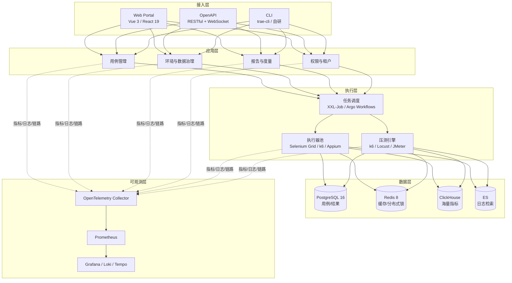
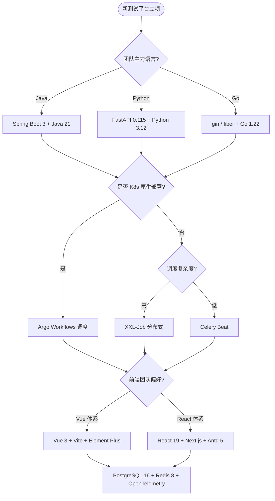

# 测试开发技术栈选型

测试开发（Test Engineering / SDET）本质上是把测试能力工程化、平台化、产品化。当开源工具（Selenium、Appium、JMeter、Jenkins）与商业 SaaS 已无法满足企业内部的多业务线、多环境、多角色协作诉求时，自建测试平台成为必然选择。本文基于 2024-2026 年主流技术栈（Spring Boot 3.x、FastAPI 0.115+、Vue 3、React 19、Ant Design 5、Element Plus、PostgreSQL 16、Redis 8、Kubernetes、OpenTelemetry），系统讲解测试平台的技术栈选型原则、分层架构与决策路径，并指出常见陷阱与最佳实践。

## 一、核心概念

### 1.1 测试平台的价值

测试平台不是把 Jenkins 加个壳，而是把"用例管理 → 数据准备 → 任务调度 → 执行编排 → 结果采集 → 报表分析 → 缺陷联动"的完整链路沉淀为可复用资产。其核心价值在于：

- **能力下沉**：把环境治理、数据构造、Mock 服务、断言库等能力下沉为平台服务，避免每个业务线重复造轮子；
- **流程闭环**：与需求管理（Jira/Lark）、代码托管（GitLab）、CI/CD（ArgoCD/Jenkins）、缺陷系统双向联动，实现"需求 → 用例 → 执行 → 缺陷"可追溯；
- **数据资产化**：测试结果、性能指标、覆盖率数据长期沉淀，支撑质量度量、漏测分析、回归策略优化；
- **角色协同**：测试工程师、开发、产品、运维通过统一门户协作，降低跨系统切换成本。

### 1.2 技术栈选型原则

- **不重复造轮子**：能用开源平台（Jenkins、SonarQube、Allure TestOps、ReportPortal）解决的，不自己造；只在开源无法覆盖的环节自研。
- **前后端分离**：除非单人维护的小工具，否则一律采用 SPA + RESTful/gRPC API 模式，便于多人协作与多端复用。
- **云原生优先**：从立项起按容器化、声明式部署设计，避免后期"上 K8s"的二次重构。
- **可观测性内建**：日志、指标、链路三件套（OpenTelemetry + Prometheus + Grafana）从第一天就接入，而非上线后补齐。
- **版本锁定**：技术栈必须明确主版本（Spring Boot 3.x、Vue 3、React 19 等），避免"无版本号"导致后续维护失控。

## 二、测试平台分层架构

测试平台典型分为接入层、应用层、执行层、数据层与可观测层五层。下图给出推荐分层与组件映射：



## 三、后端技术栈选型

后端是测试平台的"骨架"，决定并发能力、扩展性与团队维护成本。下表对三种主流方案做横向对比：

| 维度 | Spring Boot 3（Java 17+） | FastAPI 0.115+（Python 3.11+） | Go（gin/fiber） |
|------|---------------------------|--------------------------------|-----------------|
| 语言生态 | 企业级最成熟，工具链完备 | AI/数据处理生态最强 | 并发性能最佳，二进制部署 |
| 异步模型 | 虚拟线程（Loom）+ WebFlux | async/await 原生 | goroutine 原生 |
| 典型场景 | 大型团队、复杂业务、金融/政企 | 测试平台 + AI 用例生成、数据处理 | 高并发执行调度入口、网关 |
| 学习成本 | 中（Java 17 + Spring 全家桶） | 低（Python + 类型注解） | 中（goroutine 心智模型） |
| 与测试工具集成 | JUnit/REST Assured 同源 | pytest/requests 同源 | 较弱，需 CGO 或子进程 |
| 推荐版本 | Spring Boot 3.3 / Java 21 LTS | FastAPI 0.115+ / Python 3.12 | Go 1.22+ / gin 1.10 |

**选型建议**：大型企业平台、需复用既有 Java 中台资产 → Spring Boot 3；中小团队、与 AI 用例生成/数据分析深度结合 → FastAPI；执行入口网关、压测调度器 → Go。多语言共存是常态，不必强求统一。

### Spring Boot 3 最小示例

```java
// Spring Boot 3 + Java 21：测试用例查询接口
@RestController
@RequestMapping("/api/v1/cases")
public class TestCaseController {

    private final TestCaseService service;

    public TestCaseController(TestCaseService service) {
        this.service = service;  // 构造器注入，推荐方式
    }

    @GetMapping("/{id}")
    public ResponseEntity<TestCase> getById(@PathVariable Long id) {
        return ResponseEntity.ok(service.findById(id));
    }

    @PostMapping
    public ResponseEntity<TestCase> create(@Valid @RequestBody TestCaseDto dto) {
        return ResponseEntity.status(HttpStatus.CREATED)
                             .body(service.create(dto));
    }
}
```

### FastAPI 最小示例

```python
# FastAPI 0.115+ + Python 3.12：测试用例查询接口
from fastapi import FastAPI, HTTPException
from pydantic import BaseModel

app = FastAPI(title="测试平台 API", version="1.0.0")

class TestCaseIn(BaseModel):  # 入参模型，自动生成 OpenAPI 文档
    name: str
    priority: int = 2

@app.get("/api/v1/cases/{case_id}")
async def get_case(case_id: int):
    case = await find_case(case_id)  # 异步查询，规避 I/O 阻塞
    if not case:
        raise HTTPException(404, "用例不存在")
    return case

@app.post("/api/v1/cases", status_code=201)
async def create_case(payload: TestCaseIn):
    return await save_case(payload)
```

## 四、前端技术栈选型

前端决定平台的交互体验与开发效率。2024-2026 的主流组合是 **Vue 3 + Vite + TypeScript** 与 **React 19 + Next.js + TypeScript**，组件库分别对应 Element Plus / Ant Design Vue 与 Ant Design 5。

| 维度 | Vue 3 + Vite | React 19 + Next.js |
|------|--------------|---------------------|
| 心智模型 | 模板 + Composition API | JSX + Hooks |
| 构建工具 | Vite（esbuild/Rollup） | Next.js 内置（Turbopack） |
| SSR | Nuxt 3 可选 | 原生支持 RSC |
| 组件库 | Element Plus、Ant Design Vue 4 | Ant Design 5、Arco Design |
| 适用场景 | 中后台、表单密集、上手快 | 大型门户、SSR/SEO、复杂交互 |

**组件库选型**：企业内部已有 Antd 体系 → React 19 + Antd 5；以表单/表格为主的中后台 → Vue 3 + Element Plus；追求设计一致性可叠加 Design Token（如 Ant Design Tokens、Element Plus Theme Variables）。报表层用 ECharts 5 或 AntV G2 5；图表密度高、需实时刷新时优先 AntV G2 Plot。

## 五、任务调度与执行编排

测试平台的"心脏"是任务调度。三类调度器各有定位：

- **Celery**：Python 生态异步任务队列，适合 FastAPI/Django 后端做用例异步触发、结果回写。搭配 Redis/RabbitMQ 作为 Broker，Celery Beat 做定时调度。
- **XXL-Job**：Java 生态分布式任务调度，自带可视化后台，适合 Spring Boot 3 后端的定时回归、nightly 构建调度。
- **Argo Workflows**：K8s 原生工作流引擎，以 DAG/Steps 编排 Pod，适合压测、批处理、多环境并行执行，天然契合云原生。

**压测任务调度**：k6/Locust 的分布式执行推荐用 Argo Workflows 编排 Pod，每个 Pod 跑一个 k6 Runner，结果汇总到 Prometheus + Grafana。传统 nightly 回归可用 XXL-Job 或 Celery Beat。下图给出技术栈选型决策树：



## 六、数据库与缓存

- **PostgreSQL 16**：默认主库，JSONB、分区表、逻辑复制成熟，适合用例结构、测试结果、审计日志。MySQL 8.4 仅在团队既有 DBA 体系下选用。
- **Redis 8**：分布式锁（避免压测任务重复触发）、热点用例缓存、WebSocket 会话路由、限流（令牌桶）。8.0 引入 Vector Set，可在 AI 用例检索场景做向量近邻查询。
- **ClickHouse**：海量指标存储（每秒万级 P95/P99 采样），Grafana 直连可视化。
- **ElasticSearch**：日志与长文本检索（堆栈、断言失败详情），仅在日志量 > 100GB/日 时启用，否则 PostgreSQL JSONB 足够。

**测试数据存储**：用例主体存 PostgreSQL；执行原始结果（含每个断言）写 ClickHouse；热点查询走 Redis；图片/视频/Trace 存对象存储（MinIO/S3），数据库只存引用 URL。

## 七、消息队列与实时通信

| 组件 | 定位 | 典型场景 |
|------|------|----------|
| Kafka | 高吞吐、可重放 | 压测指标流、执行事件溯源 |
| RabbitMQ | 灵活路由、低延迟 | 用例任务派发、结果回写 |
| NATS | 轻量、JetStream 持久化 | 边缘执行器上报、多租户隔离 |
| WebSocket | 双向实时 | 执行日志推送、压测实时曲线 |

**实时推送方案**：执行器把日志/指标发到 Kafka，后端消费后写入 ClickHouse，同时通过 WebSocket 推送到前端仪表盘。前端用 `useWebSocket` Hook 订阅，断线重连 + 心跳保活。压测场景下，k6 直接输出 Prometheus 远程写协议，Grafana 面板 1s 刷新即可，无需走业务 WebSocket。

## 八、部署与可观测

### Docker Compose 最小化部署

```yaml
# docker-compose.yml：测试平台最小化本地部署
services:
  api:                      # FastAPI 后端
    image: test-platform-api:1.0.0
    environment:
      DATABASE_URL: postgresql://test:test@db:5432/test_platform
      REDIS_URL: redis://cache:6379/0
    depends_on: [db, cache]
    ports: ["8000:8000"]
  web:                      # Vue 3 前端
    image: test-platform-web:1.0.0
    ports: ["5173:80"]
  db:                       # PostgreSQL 16
    image: postgres:16-alpine
    environment:
      POSTGRES_PASSWORD: test
    volumes: ["pgdata:/var/lib/postgresql/data"]
  cache:                    # Redis 8
    image: redis:8-alpine
volumes:
  pgdata:
```

### Kubernetes + Helm 部署

生产环境推荐 Helm Chart + ArgoCD GitOps：API/Web/Worker/Beat 分别独立 Deployment，HPA 按 CPU/QPS 自动扩缩容；PostgreSQL 与 Redis 走云厂商托管或 Operator（CloudNativePG、Redis Operator）；Ingress 用 Nginx Ingress 或 APISIX，TLS 证书由 cert-manager 自动签发。

### 可观测性三件套

- **OpenTelemetry**：应用代码埋点 SDK（Java/Python/Go），统一采集 Traces/Metrics/Logs，发送到 OTel Collector。
- **Prometheus**：指标存储与告警，PromQL 配合 Alertmanager 实现执行失败率、压测 QPS 跌落等告警。
- **Grafana + Loki + Tempo**：Grafana 统一面板，Loki 聚合日志，Tempo 展示分布式链路，三者在 Grafana 中通过 trace_id/logs 联动，定位"哪条用例失败、为什么失败"。

## 九、常见陷阱与最佳实践

### 陷阱

1. **盲目自研全栈平台**：未评估 Allure TestOps、ReportPortal、MeterSphere 即从零造平台，6 个月后功能被开源反超。
2. **前后端耦合**：用 Django 模板渲染一切，后期想做 OpenAPI/CLI/小程序时只能整体重写。
3. **调度器选错**：压测任务用 Celery 跑，导致 Broker 被打爆；应改用 Argo Workflows 把执行器放进独立 Pod。
4. **数据库过度设计**：用例量 < 10 万就用 ClickHouse + ES + Neo4j 三库，运维成本远超收益。
5. **可观测性后置**：上线后才补 Prometheus，前期故障全靠 `print` 排查，定位一次压测异常耗半天。
6. **版本不锁定**：技术栈文档只写"Spring Boot"，不写 3.3，半年后升级冲突。

### 最佳实践

1. **MVP 先跑通一条链路**：用例管理 → 单次执行 → 报告查看，再逐步补压测、性能、覆盖率模块。
2. **执行器无状态化**：执行器只读任务、回写结果，状态全在数据库/Redis，便于横向扩容与故障恢复。
3. **配置即代码**：用例、环境、数据集全部 Git 化，平台只做编排与展示，避免数据库即真相。
4. **多租户隔离**：通过命名空间 + RBAC + 数据行级隔离，避免不同业务线互相污染压测数据。
5. **失败用例自愈**：对 Flaky 用例引入重试 + 标记机制，结合 Allure History 区分真缺陷与环境抖动。
6. **技术栈治理委员会**：每季度评审一次依赖版本、CVE 与升级路径，避免技术债滚雪球。

## 结语

测试平台技术栈没有银弹，Spring Boot 3、FastAPI、Go 各有定位；Vue 3 与 React 19 各有生态；Celery、XXL-Job、Argo Workflows 各有场景。选型的核心不是追新，而是在"团队语言、部署环境、业务规模、维护成本"四维约束下做出可演进的决策，并通过 OpenTelemetry + Prometheus + Grafana 把可观测性内建到平台基因中。下一篇文章将进入测试平台的具体模块设计，从用例管理模型开始落地。
