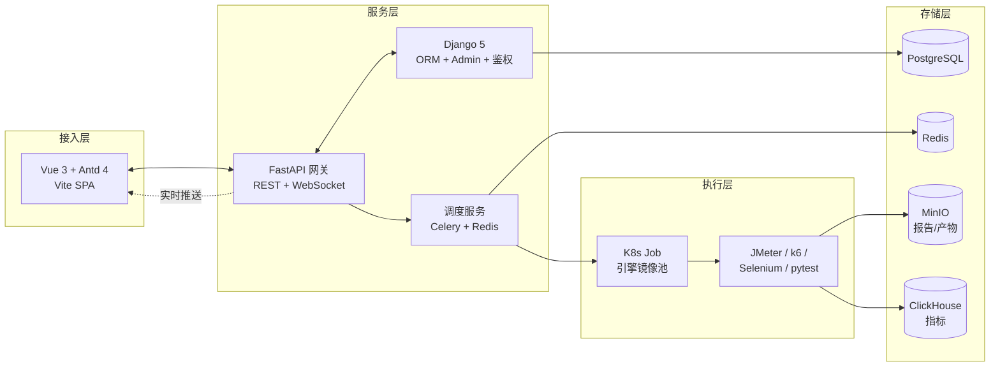
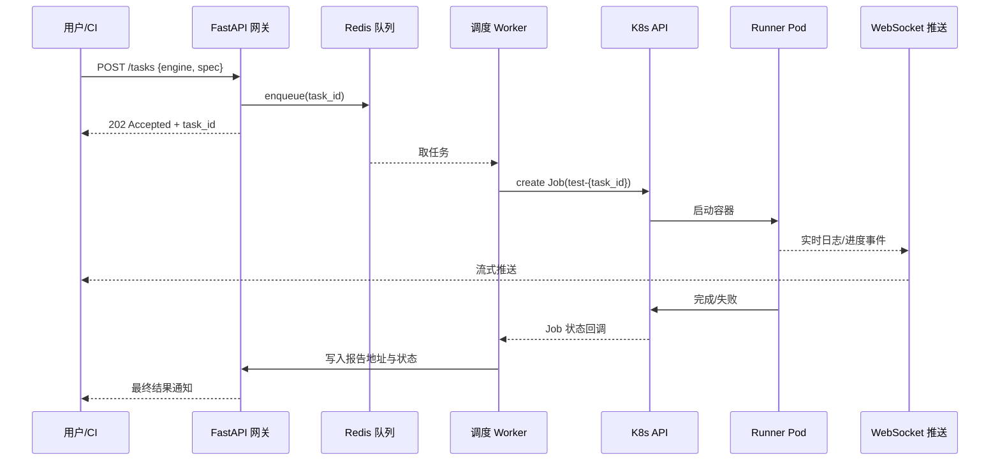

# 测试平台开发（Django 与 FastAPI 与 Vue）

> 技术基线：Django 5.x LTS（2026）、FastAPI 0.115+、Vue 3.4+、Vite 5、Ant Design Vue 4.x、Kubernetes 1.30+、Allure 2.30+。

## 一、核心概念

### 1.1 测试平台是什么

测试平台（Test Platform）是一套将"用例管理、任务调度、执行引擎、报告展示、数据治理、环境管理"统一收口的中枢系统。它不是某个测试框架的 Web 壳，而是一组**面向测试生命周期**的服务集合：上游对接需求与代码仓库，下游对接 CI/CD 与可观测性体系，把零散的脚本、工具、人工流程沉淀为可复用、可度量、可审计的工程能力。

### 1.2 自建 vs SaaS：先评估再动手

业内常见两条路径：

- **SaaS 路线**：直接采购 MeterPlus、Apifox、Postman Enterprise、Datadog Synthetics 等。优势是开箱即用、免运维；劣势是数据合规受限、与内部 IDP/CMDB/权限系统对接成本高。
- **自建路线**：基于开源（MeterSphere、HttpRunner、AutoMeter-api、Hitchhiker）二次开发或完全自研。优势是流程契合度高、可深度集成；劣势是研发与运维投入大。

判断清单（满足 3 项以上再考虑自建）：

1. 已有平台无法满足多环境隔离、环境快照、数据工厂等核心诉求；
2. 公司有强合规要求，测试数据不能出内网；
3. 测试流程需与内部 IDP、缺陷系统、发布平台深度耦合；
4. 团队规模 ≥ 50 人且测试资产需统一治理；
5. 已有持续投入（≥ 2 名测试开发）的预算。

> 切忌"为了平台而平台"。重复造轮子是测试平台领域最大的坑。

### 1.3 核心功能模块

| 模块 | 核心能力 |
| --- | --- |
| 用例管理 | CRUD、标签、版本、用例评审、与需求双向追溯 |
| 任务调度 | 手动触发、Cron 定时、CI Webhook 触发、并发与依赖编排 |
| 执行引擎 | JMeter/k6/Selenium/pytest/Playwright 适配器，统一执行协议 |
| 测试报告 | Allure/HTML/PDF、实时日志推送、历史趋势对比 |
| 数据管理 | 数据池、数据工厂（Factory Boy/Faker）、数据隔离与回收 |
| 环境管理 | 多环境配置、环境隔离、Mock 服务、环境快照 |
| 权限与审计 | RBAC、操作审计、SSO 集成、数据脱敏 |

## 二、平台架构设计

### 2.1 架构总览

现代测试平台普遍采用"**前后端分离 + 执行层独立 + 调度层下沉**"的三段式架构：

- **接入层**：Vue 3 SPA + Nginx 反向代理，对外提供统一入口；
- **服务层**：FastAPI 承担高性能 API 网关与实时推送，Django 承担后台管理、ORM 与 Admin；
- **执行层**：测试任务以 K8s Job 形式调度，引擎镜像化、按需拉起、执行完即销毁；
- **存储层**：PostgreSQL 存业务数据、Redis 存任务队列与缓存、MinIO 存报告与产物、ClickHouse 存指标。



### 2.2 微服务化拆分原则

不要一开始就拆成 20 个微服务。推荐按 **能力域** 拆分三服务起步：`platform-api`（FastAPI，业务 API）、`platform-admin`（Django，后台与权限）、`platform-scheduler`（Celery worker，调度执行）。当某服务出现独立扩缩容诉求时再进一步拆分，避免过早分布式化带来的运维负担。

### 2.3 K8s 部署要点

- 服务 Pod 使用 HPA 按 QPS/任务积压自动扩缩；
- 测试执行 Pod 单独命名空间 `test-runner`，**资源配额隔离**防止压测打挂平台自身；
- 引擎镜像统一基础镜像（`alpine + python3.12 + jdk17`），按工具分层缓存；
- 用 PVC 持久化 Allure 历史，避免 Pod 销毁丢失趋势数据。

## 三、后端开发：FastAPI 与 Django

### 3.1 分工策略

| 框架 | 承担职责 | 选型理由 |
| --- | --- | --- |
| FastAPI 0.115+ | 对外 REST、WebSocket、依赖注入、Pydantic 校验 | 异步高性能、OpenAPI 自动生成、与 async ORM 契合 |
| Django 5.x | Admin、ORM 模型、RBAC、SSO、定时任务 | Admin 开箱即用、ORM 成熟、生态稳定 |

两者通过共享 PostgreSQL 与 Redis 协作，FastAPI 不直接写库业务对象，复杂查询走 Django 暴露的内部 HTTP/RPC 接口。

### 3.2 FastAPI 路由与依赖注入

```python
# app/api/cases.py —— 测试用例路由
from fastapi import APIRouter, Depends, HTTPException
from sqlalchemy.ext.asyncio import AsyncSession
from app.deps import get_db, require_roles
from app.schemas import CaseCreate, CaseOut

router = APIRouter(prefix="/api/v1/cases", tags=["用例管理"])

@router.post("", response_model=CaseOut, summary="创建测试用例")
async def create_case(
    payload: CaseCreate,
    db: AsyncSession = Depends(get_db),
    _user = Depends(require_roles("qa", "admin")),  # 角色鉴权依赖注入
):
    """新建用例并写入版本快照，tags 自动去重。"""
    case = await CaseService(db).create(payload, creator=_user.id)
    if not case:
        raise HTTPException(409, "同项目下用例编号已存在")
    return case
```

依赖链 `get_db → require_roles` 让鉴权与事务边界清晰可测，Pydantic v2 的 `CaseCreate` 自动生成 OpenAPI 文档，前端可零成本对齐。

### 3.3 Django ORM 与 Admin

```python
# platform_admin/cases/models.py —— Django 模型，与 FastAPI 共享同一库
from django.db import models
from django.contrib.auth.models import User

class TestCase(models.Model):
    """测试用例：与 FastAPI 侧 CaseOut 字段一一对应。"""
    title = models.CharField("用例标题", max_length=200, db_index=True)
    project = models.ForeignKey("Project", on_delete=models.CASCADE, related_name="cases")
    tags = models.JSONField("标签", default=list)              # 5.x JSONField 原生支持
    version = models.PositiveIntegerField("版本号", default=1)
    creator = models.ForeignKey(User, on_delete=models.SET_NULL, null=True)
    created_at = models.DateTimeField(auto_now_add=True)

    class Meta:
        indexes = [models.Index(fields=["project", "version"])]
        verbose_name = "测试用例"

# admin.py —— 一行注册即可获得完整 CRUD + 过滤 + 搜索 + 导出
from django.contrib import admin
@admin.register(TestCase)
class TestCaseAdmin(admin.ModelAdmin):
    list_display = ("id", "title", "project", "version", "creator", "created_at")
    list_filter = ("project", "tags", "created_at")
    search_fields = ("title",)
```

Django 5.x 的 `JSONField` 默认走 `jsonb`，标签查询性能远优于旧版字符串拼接；Admin 配合 `django-import-export` 可直接对用例做批量 Excel 导入导出。

## 四、前端开发：Vue 3 + Ant Design Vue 4

### 4.1 组合式 API 与用例管理页面

```vue
<!-- src/views/cases/CaseList.vue —— 用例管理列表页 -->
<script setup lang="ts">
import { ref, onMounted } from 'vue'
import { message } from 'ant-design-vue'
import type { TableColumnsType } from 'ant-design-vue'
import { api } from '@/api'              // Axios 实例，自动携带 JWT

interface CaseItem { id: number; title: string; tags: string[]; version: number }

const columns: TableColumnsType<CaseItem> = [
  { title: 'ID', dataIndex: 'id', width: 80 },
  { title: '用例标题', dataIndex: 'title', ellipsis: true },
  { title: '标签', dataIndex: 'tags', key: 'tags' },
  { title: '版本', dataIndex: 'version', width: 80 },
]
const data = ref<CaseItem[]>([])
const loading = ref(false)

async function fetchData() {             // 拉取用例列表
  loading.value = true
  try {
    const res = await api.get('/api/v1/cases')
    data.value = res.data.items
  } catch (e) {
    message.error('用例加载失败，请检查网络或权限')
  } finally {
    loading.value = false
  }
}
onMounted(fetchData)
</script>

<template>
  <a-table :columns="columns" :data-source="data" :loading="loading" row-key="id">
    <template #bodyCell="{ column, record }">
      <template v-if="column.key === 'tags'">
        <a-tag v-for="t in record.tags" :key="t" color="blue">{{ t }}</a-tag>
      </template>
    </template>
  </a-table>
</template>
```

要点：组合式 API 把数据获取与 UI 解耦，Antd 4 的 `bodyCell` 插槽替代旧版 `customRender`，配合 Vite 5 的按需引入，首屏包体积可控制在 220KB（gzip）以内。

## 五、执行引擎集成

### 5.1 统一执行协议

不同引擎的输入输出差异巨大，平台需定义**统一执行协议**（Execution Spec）屏蔽差异：

| 字段 | 含义 |
| --- | --- |
| `engine` | `jmeter` / `k6` / `selenium` / `pytest` |
| `entry` | 脚本路径或 JMX 文件 |
| `env` | 目标环境标识，注入到容器 ENV |
| `params` | 参数化变量（数据驱动） |
| `report` | 报告格式：`allure` / `junit-xml` / `html` |
| `resource` | CPU/内存/副本数 |

### 5.2 K8s Job 调度

```python
# app/scheduler/k8s_job.py —— 通过 K8s API 调度测试任务为 Job
from kubernetes import client
from kubernetes.client import V1Job, V1JobSpec, V1ObjectMeta, V1PodTemplateSpec, V1Container

def build_test_job(task_id: str, spec: dict) -> V1Job:
    """构造 K8s Job：执行完即销毁，资源配额来自 spec.resource。"""
    container = V1Container(
        name="runner",
        image=f"registry.internal/test-engines/{spec['engine']}:2026.08",  # 镜像按引擎区分
        command=["sh", "-c", spec["entry"]],                                # 入口命令
        env=[{"name": k, "value": v} for k, v in spec["env"].items()],     # 环境变量注入
        resources={"requests": {"cpu": spec["resource"]["cpu"],
                                 "memory": spec["resource"]["memory"]}},
    )
    return V1Job(
        api_version="batch/v1", kind="Job",
        metadata=V1ObjectMeta(name=f"test-{task_id}", labels={"task-id": task_id}),
        spec=V1JobSpec(
            backoff_limit=0,           # 失败不重试，由平台决策
            ttl_seconds_after_finished=3600,  # 1 小时后自动清理 Pod
            template=V1PodTemplateSpec(restart_policy="Never", containers=[container]),
        ),
    )
```

K8s Job 模式带来三个关键收益：**资源隔离**（压测不会挤占平台 Pod）、**弹性扩缩**（HPA 按队列深度横向扩 runner）、**审计可追溯**（每个任务对应独立 Pod，日志归档到 Loki）。



## 六、实时报告推送

### 6.1 WebSocket 通道

```python
# app/api/ws.py —— FastAPI WebSocket 实时推送
from fastapi import APIRouter, WebSocket
from redis.asyncio import Redis

router = APIRouter()

@router.websocket("/ws/tasks/{task_id}")
async def task_ws(ws: WebSocket, task_id: str):
    """订阅 Redis Pub/Sub，把 runner 的事件流推给前端。"""
    await ws.accept()
    redis = Redis.from_url("redis://redis:6379/1")
    pubsub = redis.pubsub()
    await pubsub.subscribe(f"task:{task_id}:events")
    try:
        async for msg in pubsub.listen():
            if msg["type"] == "message":
                await ws.send_text(msg["data"].decode())  # 透传日志/进度
    finally:
        await pubsub.unsubscribe(f"task:{task_id}:events")
        await ws.close()
```

Runner Pod 内通过 `redis-cli publish task:{id}:events '<event json>'` 上报事件，WebSocket 端只做透传，避免业务逻辑阻塞推送链路。

### 6.2 Allure 实时展示

Allure 历史报告需持久化。推荐方案：runner 把 `allure-results` 写入挂载的 PVC，独立 `allure-server`（基于 `allure-framework/allure-server`）扫描目录并生成趋势报告，前端通过 iframe 嵌入（注意：该开源项目已于 2025 年归档停止维护，选用前需评估替代方案）。**注意**：`history` 目录必须跨任务保留，否则趋势图失效。

## 七、2024-2026 新趋势

### 7.1 低代码 / 无代码测试平台

代表产品：MeterPlus、Mabl、Testim。核心思路：用录制 + 可视化编排替代脚本编写，让业务测试与产品经理也能产出可执行用例。自建平台可借鉴"低代码编排层"——把 pytest/JMeter 用例抽象为节点，前端拖拽生成 DAG，后端编译为执行 spec。关键是**保留代码逃生通道**：低代码生成的 spec 可一键导出为 pytest 脚本，避免低代码平台成为新的供应商锁定。

### 7.2 AI 测试平台

2024-2026 最显著的变量是 LLM 介入测试平台。三个成熟落地场景：

1. **AI 生成用例**：基于 PR diff 或 OpenAPI 文档生成接口测试用例，准确率 60-70%，人工 review 后入库；
2. **AI 分析报告**：把失败堆栈、截图、Har 包喂给 LLM，输出根因定位与修复建议；
3. **自愈脚本**：UI 自动化中元素定位漂移时，LLM 基于页面 DOM 重定位，减少脚本维护成本。

注意：AI 生成结果必须有**人工 review 闸门**，未经确认的用例不能进入生产回归集。

### 7.3 测试平台 SaaS 化

MeterPlus、Apifox、Datadog Synthetics 等持续吞噬中小团队的自建预算。SaaS 化的反面是数据合规与定制化受限，2025 年后出现"**混合模式**"：核心测试资产在内网自建平台，边缘场景（如真机云、海外拨测节点）走 SaaS，通过统一 API 网关聚合。

### 7.4 与 IDP（内部开发者平台）集成

测试平台不再独立存在，而是作为 IDP 的一个**插件/能力**接入 Backstage、Port、Cortex 等。典型集成点：

- Backstage 的 `test-plugin` 面板直接展示服务健康度、回归通过率；
- 平台通过 IDP 的 Scorecard 度量测试覆盖率与缺陷逃逸率；
- 发布门禁由 IDP 统一编排，测试平台只暴露"触发 + 查询"API。

## 八、常见陷阱与最佳实践

### 8.1 陷阱

1. **过早微服务化**：3 人团队拆 8 个服务，运维成本远超收益。起步用 FastAPI + Django 双服务即可。
2. **执行器与平台同部署**：压测任务直接跑在平台 Pod 上，把平台自己压挂。务必用 K8s Job + 独立命名空间隔离。
3. **报告历史丢失**：Allure results 存在临时容器，趋势图永远只有一条。必须 PVC 或对象存储持久化。
4. **权限粒度过粗**：只有"管理员/普通用户"两档，无法满足多项目隔离。建议从一开始就做 RBAC + 项目维度授权。
5. **同步执行长任务**：HTTP 同步等待 JMeter 跑完，连接超时。必须异步化：API 立即返回 task_id，结果走 WebSocket 或轮询。
6. **AI 生成直入库**：LLM 生成的用例未经 review 直接进入回归集，导致误报爆炸。必须有 review 状态机。

### 8.2 最佳实践

- **统一执行协议**屏蔽引擎差异，新引擎适配只需实现一个 Runner；
- **资源配额 + 优先级队列**防止 CI 触发的压测挤占手动回归；
- **测试数据快照**：每个任务记录所用数据集 hash，方便复盘；
- **报告版本化**：报告与用例版本绑定，历史报告永不丢失；
- **可观测性自举**：平台自身接入 OpenTelemetry，平台挂了能第一时间发现；
- **开源优先**：HttpRunner、MeterSphere、AutoMeter-api 等开源平台已覆盖 80% 场景，自研前先评估能否二次开发。

---

**版本说明**：本文技术基线为 2026-08，Django 5.x LTS、FastAPI 0.115+、Vue 3.4+、Vite 5、Ant Design Vue 4、Kubernetes 1.30+、Allure 2.30+。
