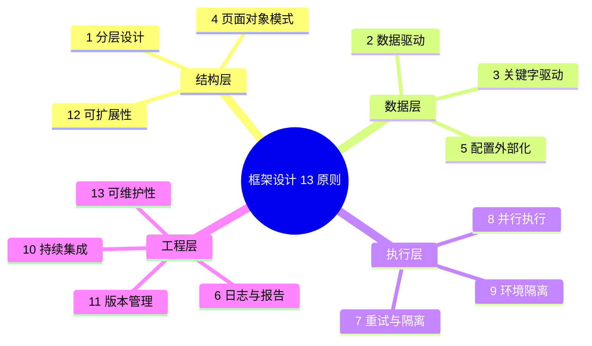
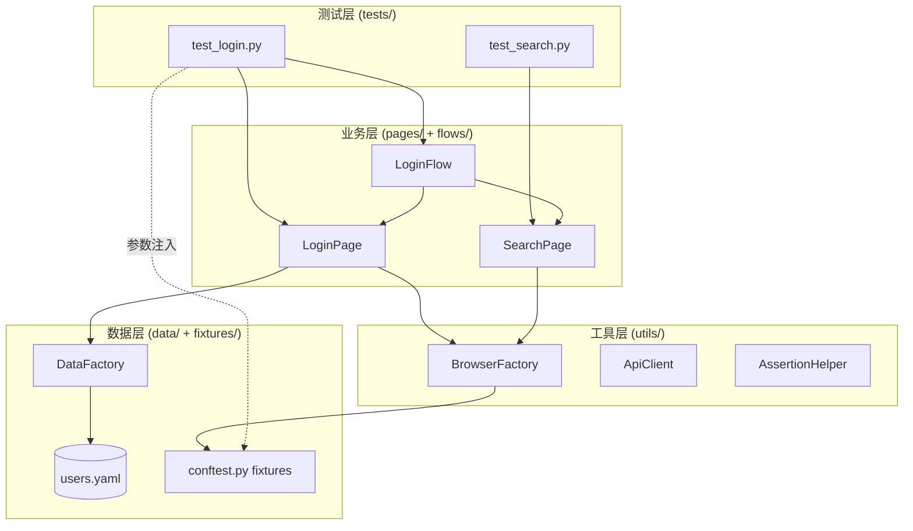

# 自动化测试框架设计 13 原则

自动化测试框架不是"会写脚本"的自然延伸，而是工程能力的分水岭。一个团队从十几条用例增长到几千条用例时，未做框架化设计的代码会以"修改一个定位器要动几十个文件"的方式反噬团队。本文基于 pytest 9 + Playwright/Selenium 4 + Allure 的现代技术栈，系统梳理 13 条框架设计原则，并补充 2024-2026 年的 Fixture 依赖注入、Screenplay、AI 辅助维护、云原生调度等新趋势。这些原则不是彼此独立的清单，而是相互制约的权衡网络——追求可维护性可能牺牲执行速度，追求并行可能侵蚀隔离性，框架设计的本质是在这些张力之间寻找适合当前团队的平衡点。

## 一、核心概念：为什么需要框架设计原则

### 1.1 框架的边界

测试框架（Test Framework）指支撑测试用例编写、执行、报告与维护的代码与工具集合。它包含三类资产：基础设施（运行器、并行调度、报告器）、领域抽象（页面对象、业务流程、数据工厂）、治理约束（命名规范、目录约定、CI 钩子）。三者的比例决定框架的成熟度——早期框架往往只有基础设施，成熟框架的重心会迁移到领域抽象与治理约束上。

### 1.2 好框架的五条评判标准

- **可读性**：测试用例读起来像业务描述，技术细节被封装在底层；
- **可维护性**：被测系统一处变化，框架只在一处改动；
- **可扩展性**：新增端（Web/移动/API）或新增能力（截图、视频、Trace）不需重写基础设施；
- **可执行性**：单机、CI、分布式集群三种环境下行为一致；
- **可观测性**：失败时能在 30 秒内定位根因，而非"再跑一次看看"。

### 1.3 13 原则全景



13 条原则按关注点划分为四个层次：结构层定义"代码如何组织"，数据层定义"数据如何流动"，执行层定义"用例如何跑起来"，工程层定义"框架如何演进"。下文按此顺序展开。

## 二、13 条设计原则

### 原则 1：分层设计

将框架拆为四层——**测试层**（用例编排与断言）、**业务层**（页面对象、API 客户端、业务流程）、**工具层**（浏览器/HTTP 客户端封装、断言工具）、**数据层**（数据工厂、Fixture、外部数据源）。每层只依赖其下层，禁止反向引用。分层是其他原则的基石——POM、DDT、可维护性都建立在分层之上。

### 原则 2：数据驱动（DDT）

将"流程相同、数据不同"的用例剥离为参数化用例。pytest 的 `@pytest.mark.parametrize` 配合外部 YAML/CSV 实现数据驱动，Playwright 则通过参数化 fixture 注入。数据驱动要避免"数据爆炸"——一组参数若不能产生有差异的覆盖价值，就应合并而非保留。

```python
# pytest 数据驱动：同一登录流程，多组账号
@pytest.mark.parametrize("username,password,expect_success", [
    ("admin", "correct_pwd", True),
    ("guest", "wrong_pwd", False),
    ("", "any_pwd", False),                # 边界：空用户名
], ids=["valid_admin", "invalid_pwd", "empty_user"])
def test_login(page, username, password, expect_success):
    login_page = LoginPage(page)
    login_page.login(username, password)
    assert login_page.is_logged_in() is expect_success
```

### 原则 3：关键字驱动（KDT）

KDT 将操作抽象为"关键字 + 参数"的二元组，测试用例退化为关键字的有序序列，业务人员可读懂。KDT 的优势是"用例与代码彻底解耦"，劣势是关键字粒度难以拿捏——粒度过细退化回脚本，粒度过粗丧失灵活性。现代实践中，KDT 多用于业务流程编排层，与 POM 配合而非取代它。

### 原则 4：页面对象模式（POM）

以页面为边界封装定位器与操作，测试用例通过页面对象暴露的业务方法完成操作。POM 的本质是"单一职责"——页面结构变化只影响对应 Page 类。在 Playwright 1.61 中，Page Object 借助 locator 的自动等待，可省去大量显式 `wait` 代码。

```python
# Playwright POM：LoginPage 封装定位器与业务方法
class LoginPage:
    def __init__(self, page: Page):
        self.page = page
        # locator 自带自动等待，无需显式 wait
        self.username_input = page.get_by_label("用户名")
        self.password_input = page.get_by_label("密码")
        self.login_button = page.get_by_role("button", name="登录")

    def login(self, username: str, password: str) -> None:
        self.username_input.fill(username)
        self.password_input.fill(password)
        self.login_button.click()

    def is_logged_in(self) -> bool:
        return self.page.get_by_text("欢迎").is_visible()
```

### 原则 5：配置外部化

URL、浏览器类型、超时、环境变量、账号凭据等可变项必须从代码中剥离到外部配置（YAML/ENV/`.env`）。pytest 推荐使用 `pyproject.toml` + `pytest.ini` + `.env` 三层配置，敏感信息走环境变量或密钥管理（Vault/AWS Secrets Manager）。配置外部化的反面是"硬编码"——一旦凭据写进代码，迁移环境与轮换密钥都将成为灾难。

### 原则 6：日志与报告

日志分两层：运行时日志（loguru/logging）记录执行轨迹，结果报告（Allure/Trace Viewer）面向人类阅读。Allure 支持 step、attachment、label 三级语义，能将"测试步骤-截图-HTTP 请求"三件套关联展示。Playwright 的 Trace Viewer 提供"时间轴+DOM 快照+网络"的回放能力，是定位 Flaky 用例的利器。

### 原则 7：重试与隔离

Flaky 用例是框架的"慢性病"。重试机制（pytest-rerunfailures、Playwright `retries` 配置）能掩盖症状但治标不治本，应配合"重试即告警"的策略避免重试被滥用。隔离比重试更重要——每个用例独立 fixture、独立数据、独立浏览器上下文，禁止用例间共享状态。pytest 的 fixture 作用域（function/module/session）是控制隔离粒度的核心机制。

### 原则 8：并行执行

用例数量超过 100 条后，串行执行的时间成本难以接受。pytest-xdist 提供 `pytest -n auto` 的进程级并行，Playwright 内置 `--workers` 与 `--shard` 实现浏览器级并行。并行的最大障碍不是技术，而是"用例间隐性依赖"——一旦存在共享可变状态，并行就会暴露隐藏的串行假设。

### 原则 9：环境隔离

测试环境、预发环境、生产环境必须严格隔离，框架通过配置切换而非代码分支切换。隔离包含三层：数据隔离（每个用例独立数据集）、状态隔离（每个用例独立会话）、环境隔离（不同被测环境互不污染）。Docker 与 K8s 让"每次执行用全新环境"成为可能，是隔离的终极形态。

### 原则 10：持续集成

框架必须能在 CI 环境无人值守运行。CI 集成的关键不是"跑通"，而是"失败可定位"——失败时自动保留截图、视频、Trace、日志，并关联到用例 ID 与代码 commit。GitHub Actions、GitLab CI、Jenkins 的 pipeline 配置应纳入版本管理，与测试代码同仓库演进。

### 原则 11：版本管理

测试代码与被测代码同等纳入 Git 管理，且应与被测代码同步演进。版本管理的隐性要求是"分支策略"——测试代码跟随被测代码的 release 分支，hotfix 也要 hotfix 测试用例。框架自身（基础设施层）应有独立的版本号与 CHANGELOG，避免"框架一升级所有用例都崩"。

### 原则 12：可扩展性

框架要预留扩展点：新增端（移动/Appium）、新增协议（gRPC/GraphQL）、新增报告器都应通过插件或 Mixin 实现，而非修改核心代码。pytest 的插件机制（conftest.py + entry point）是可扩展性的典范——`pytest-playwright`、`pytest-html`、`allure-pytest` 都以插件形式接入。

### 原则 13：可维护性

可维护性是前 12 条原则的"汇总指标"。它要求：定位器集中管理、命名规范统一、公共逻辑下沉、测试用例独立可读。可维护性的反面是"过度抽象"——为了复用而引入的间接层一旦超过三层，框架会变得比被测系统还难懂。可维护性的检验标准是：新成员能否在一周内独立新增一条用例。

## 三、分层架构实战：pytest + Playwright 四层框架

### 3.1 四层架构图



### 3.2 pytest fixture 分层实现

四层框架的核心是 fixture 的分层注入——session 级建浏览器、function 级建上下文、用例只关心业务对象。

```python
# conftest.py —— 分层 fixture：session/function 两级隔离
import pytest
from playwright.sync_api import sync_playwright
from pages.login_page import LoginPage
from data.data_factory import DataFactory

# session 级：整个测试会话共享一个 Playwright 进程
@pytest.fixture(scope="session")
def playwright_ctx():
    with sync_playwright() as pw:
        # 启动 Chromium，CI 环境用无头模式
        browser = pw.chromium.launch(headless=__import__("os").environ.get("CI", "0") == "1")
        yield browser
        browser.close()

# function 级：每个用例独立上下文，互不污染
@pytest.fixture(scope="function")
def page(playwright_ctx):
    context = playwright_ctx.new_context(
        viewport={"width": 1280, "height": 720},
        record_video_dir="videos/"   # 自动录制视频用于失败排查
    )
    page = context.new_page()
    yield page
    context.close()

# 业务对象 fixture：用例只声明依赖，不关心构造细节
@pytest.fixture
def login_page(page):
    return LoginPage(page)

@pytest.fixture
def user_data():
    # 数据工厂按需生成，避免数据固化
    return DataFactory.create_user()
```

测试用例因此变得极简，只描述业务意图：

```python
# test_login.py —— 测试层只关心业务编排与断言
def test_login_success(login_page, user_data):
    login_page.navigate("/login")
    login_page.login(user_data.username, user_data.password)
    assert login_page.is_logged_in(), "登录后应跳转到首页"
```

## 四、数据驱动与关键字驱动：DDT/KDT 实现对比

DDT 与 KDT 不是替代关系，而是抽象层次不同的两种驱动方式。DDT 解决"同流程不同数据"的复用，KDT 解决"流程本身的可读与可编排"。下表对比两者在 pytest 下的实现差异：

| 维度 | DDT（数据驱动） | KDT（关键字驱动） |
|------|----------------|------------------|
| 抽象单位 | 数据行 | 关键字 + 参数 |
| 用例形态 | 参数化函数 | YAML/JSON 步骤序列 |
| 适合场景 | 表单校验、边界值 | 业务流程编排、跨端流程 |
| 学习成本 | 低 | 中（需定义关键字库） |
| 维护成本 | 数据维护 | 关键字库维护 |

KDT 在 pytest 下的典型实现是用 YAML 描述步骤，conftest.py 解析并调度：

```yaml
# flows/login_flow.yaml —— 关键字驱动用例：业务人员可读
steps:
  - keyword: navigate
    args: { url: "/login" }
  - keyword: input_text
    args: { locator: "用户名", text: "${username}" }
  - keyword: input_text
    args: { locator: "密码", text: "${password}" }
  - keyword: click
    args: { locator: "登录" }
  - keyword: assert_visible
    args: { locator: "欢迎" }
```

```python
# keyword_runner.py —— KDT 执行器：关键字分发
import json
import yaml

def _assert_visible(ctx, args):
    assert ctx.page.get_by_text(args["locator"]).is_visible(), f"元素 {args['locator']} 不可见"

KEYWORDS = {
    "navigate":      lambda ctx, args: ctx.page.goto(args["url"]),
    "input_text":    lambda ctx, args: ctx.page.get_by_label(args["locator"]).fill(args["text"]),
    "click":         lambda ctx, args: ctx.page.get_by_role("button", name=args["locator"]).click(),
    "assert_visible":_assert_visible,
}

def run_keyword_flow(ctx, flow_file: str, **variables):
    flow = yaml.safe_load(open(flow_file, encoding="utf-8"))
    for step in flow["steps"]:
        # 变量替换：${username}/${password} → 实际值
        serialized = json.dumps(step["args"])
        for key, value in variables.items():
            serialized = serialized.replace(f"${{{key}}}", str(value))
        resolved = json.loads(serialized)
        KEYWORDS[step["keyword"]](ctx,%20resolved)
```

## 五、并行执行与隔离

### 5.1 pytest-xdist 进程级并行

```bash
# 按CPU核数自动并行，失败重试2次，失败用例优先重跑
pytest -n auto --dist=loadfile \
       --reruns=2 --reruns-delay=1 \
       --alluredir=allure-results
```

`--dist=loadfile` 让同一文件的用例落在同一 worker，避免文件内隐性依赖被并行打破。对于必须串行的用例，使用 `@pytest.mark.xdist_group` 分组标记并配合 `--dist=loadgroup`，让同组用例调度到同一 worker 串行执行。

### 5.2 Playwright 并行与分片

Playwright 内置 `--workers` 控制并行度，`--shard` 实现 CI 多机分片。在 GitHub Actions 上将测试分到 4 台机器并行执行：

```yaml
# .github/workflows/e2e.yml —— K8s/CI 分片：4 个 shard 并行
strategy:
  matrix:
    shard: [1/4, 2/4, 3/4, 4/4]
steps:
  - run: npx playwright test --shard=${{ matrix.shard }} --workers=2
```

### 5.3 K8s 调度执行

大规模执行（数千用例）应上 K8s：每个 Pod 跑一个 worker，Job 控制器管理生命周期，结果统一写入对象存储。这种"用完即弃"的执行单元是云原生框架的核心——环境彻底隔离、资源按需扩缩、失败 Pod 自动重启。

## 六、2024-2026 新趋势

### 6.1 Fixture 依赖注入

pytest 的 fixture 机制已演化为完整的依赖注入容器。2024 年后，Playwright、Allure、Faker 等工具均以 fixture 形式接入，用例只需声明依赖即可获得能力。fixture 的 `params` 参数让"同一用例多环境跑"成为标配——一份用例在 Chromium/Firefox/WebKit 上自动跑三遍。

### 6.2 Screenplay 模式

Screenplay 是对 POM 的反思——POM 以"页面"为中心，但业务流程往往跨多个页面。Screenplay 以"演员-能力-任务"三元组重构：Actor 拥有 Ability（如 BrowseTheWeb），执行 Task（如 Login），Task 内部调用 Question 断言。Screenplay 解决了 POM 在复杂业务流上的"页面割裂"问题，是 2025 年 GUI 框架设计的主流方向之一。

### 6.3 AI 辅助维护

LLM 的成熟让"AI 维护测试"落地为两类工具：**AI 自愈**（定位器失效时，LLM 根据页面 DOM 推断新定位器并提交 PR）与 **AI 用例生成**（从需求文档或用户行为日志生成用例草稿）。GitHub Copilot for Tests、Testim Predictive Self-Healing 是代表产品。AI 维护的关键不是"完全替代人"，而是把人工维护成本从"逐条修复"降到"PR 评审"。

### 6.4 云原生框架

K8s + 容器化让测试框架进入"云原生"阶段：执行器打包为镜像，Job 控制器按需起 Pod，结果落对象存储，Allure 报告托管在静态站点。代表项目是 BrowserStack 的 Kubernetes Runner，以及基于 Playwright 官方 Docker 镜像在 K8s 上自建执行集群的通用实践。云原生框架让"万级用例 10 分钟跑完"从奢望变为常规能力。

## 七、常见陷阱与最佳实践

### 7.1 五大陷阱

- **过度抽象**：为复用而引入的间接层超过三层，框架变得比被测系统还难懂；
- **隐性依赖**：用例 A 修改了用例 B 依赖的数据，并行执行时爆炸；
- **重试滥用**：用重试掩盖 Flaky，问题永远不被根治；
- **截图缺失**：失败时只有堆栈，无法定位 UI 状态，调试回到"再跑一次"；
- **配置硬编码**：URL/账号写死在代码里，环境迁移需改代码而非改配置。

### 7.2 最佳实践清单

1. 定位器集中管理，按页面分文件，禁止散落在用例中；
2. fixture 作用域最小化，默认 function 级，确需共享才升级；
3. 失败必留三件套：截图、视频、Trace，关联到用例 ID；
4. CI 默认开启 `--reruns=2`，但重试用例必须打 `flaky` 标签并告警；
5. 框架核心代码与业务用例分仓库或分包，核心代码版本化发布；
6. 定期做"用例体检"：清理长期跳过用例，删除无差异参数化行；
7. 新成员一周内能独立新增用例——这是可维护性的最终检验。

## 八、总结

13 条原则不是清单，而是相互制约的权衡网络。分层设计是基石，POM/DDT/配置外部化建立在分层之上，并行/隔离/CI 让框架能跑得起来，可维护性是前 12 条的汇总指标。2024-2026 年的趋势——Fixture 依赖注入、Screenplay、AI 维护、云原生——都在强化"可维护性"与"可执行性"两条主轴。框架设计的终极目标不是炫技，而是让团队在被测系统演进时，能用最小代价维持测试的有效性。
