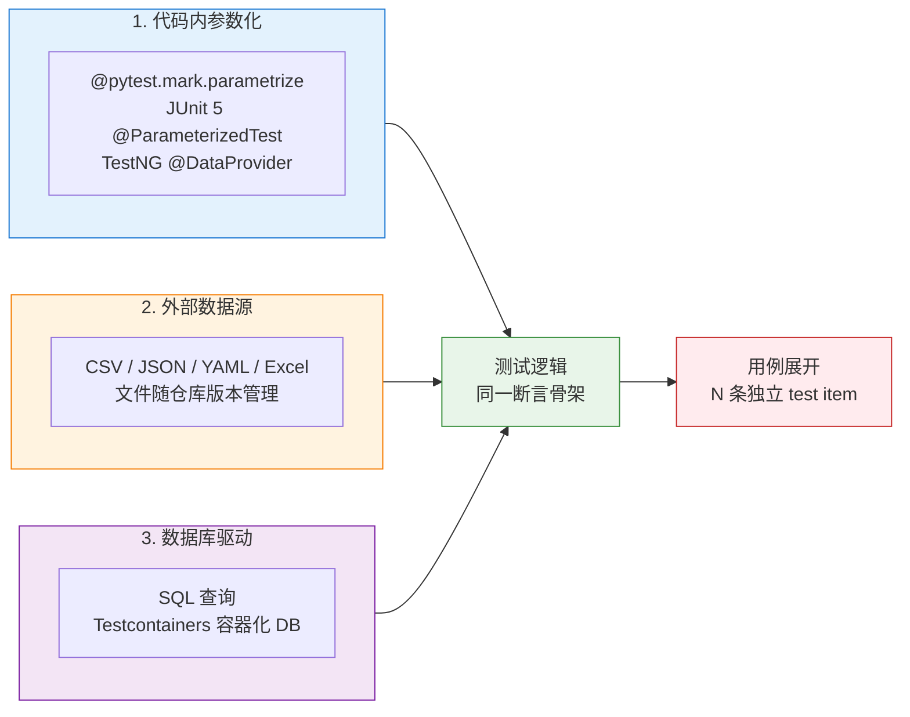
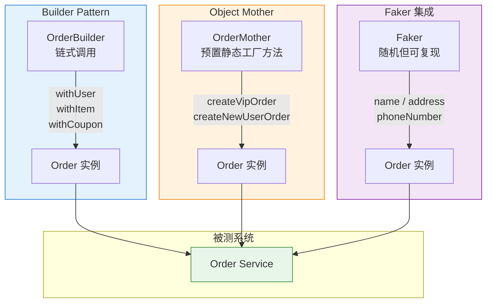

# 数据驱动与参数化框架

数据驱动测试（Data-Driven Testing，DDT）是测试开发领域最古老也最常被误用的设计模式之一。它的核心承诺是"一段测试逻辑 + N 份数据 = N 条用例"，但在工程实践中，团队往往陷入三重困境：参数化粒度过细导致用例爆炸、外部数据源与代码版本错配、测试数据准备成本远超测试本身。本文基于 pytest 9、JUnit 5.12、TestNG 7.10 与 Faker、Testcontainers 1.21 等稳定版本，系统梳理 DDT 在框架层面的三种实现形态、数据工厂模式的工程化落地，以及 2024–2026 年 LLM 生成测试数据、合成数据等新趋势。与同系列《06-数据驱动测试（DDT）与测试数据策略》相比，本文聚焦**框架层面的参数化机制与数据工厂设计**，前者则聚焦 GUI 场景下的测试数据治理策略。

## 一、核心概念

### 1.1 DDT 的本质

数据驱动测试的本质是**将测试逻辑与测试输入解耦**：同一段测试代码，通过喂入不同的数据集，自动展开为多条测试用例。其价值在于：

- **覆盖效率**：一次编写，N 次执行，避免为每个等价类复制粘贴用例；
- **数据即文档**：测试意图通过数据表清晰表达，比散落在代码中的 `assert` 更易评审；
- **缺陷定位**：失败用例携带具体数据上下文，复现成本接近零。

### 1.2 DDT vs 关键字驱动

DDT 与关键字驱动测试（Keyword-Driven Testing，KDT）常被混为一谈，但二者关注点不同：

| 维度 | DDT（数据驱动） | KDT（关键字驱动） |
|------|-----------------|-------------------|
| 抽象对象 | 同一流程的不同输入 | 不同流程的组合 |
| 复用单位 | 数据行 | 关键字（Click / Type / Assert） |
| 典型工具 | pytest parametrize、JUnit 5 @ParameterizedTest | Robot Framework、Keyword Done |
| 适用场景 | 等价类、边界值、组合覆盖 | 业务流程编排、非技术人员参与 |
| 维护成本 | 数据膨胀可控 | 关键字表与脚本双向维护 |

简言之，**DDT 解决的是"同一流程的输入空间覆盖"，KDT 解决的是"流程本身的复用与编排"**。本文聚焦前者。

### 1.3 三种实现形态

DDT 在工程上落地为三种实现形态，各有适用边界：



- **代码内参数化**：数据与逻辑同处一个文件，适合**少量、稳定、强类型**的等价类；
- **外部数据源**：数据独立成文件，适合**非开发人员维护、跨用例复用**的数据集；
- **数据库驱动**：从 DB 查询测试数据，适合**与生产数据形态对齐**的集成 / 端到端测试。

## 二、代码内参数化

### 2.1 pytest @parametrize

pytest 9 的参数化通过 `@pytest.mark.parametrize` 装饰器实现，签名 `parametrize(argnames, argvalues, *, indirect=False, ids=None, scope=None)`，单条数据的 mark 需通过 `pytest.param(marks=...)` 附加：

```python
# pytest 参数化：登录场景的等价类覆盖
import pytest

@pytest.mark.parametrize(
    "username, password, expected_code",
    [
        ("valid_user",  "Valid@123", 200),  # 正常登录
        ("valid_user",  "wrong_pwd", 401),  # 密码错误
        ("nonexistent", "any_pwd",   404),  # 用户不存在
        ("",            "Valid@123", 400),  # 用户名为空
    ],
    ids=["正常登录", "密码错误", "用户不存在", "用户名为空"],
)
def test_login(username, password, expected_code):
    # 同一段测试逻辑，喂入不同数据
    resp = login(username, password)
    assert resp.status_code == expected_code
```

**进阶用法**：`pytest.param` 可为单条数据附加 mark 与 id，实现"部分用例跳过 / 失败重试"：

```python
# 为部分用例附加 mark：仅 flaky 用例重试
@pytest.mark.parametrize(
    "payload, expected",
    [
        pytest.param({"q": "iphone"}, 200, id="正常搜索"),
        pytest.param({"q": ""},       400, id="空关键词"),
        pytest.param({"q": "x" * 999}, 414, id="超长关键词",
                     marks=pytest.mark.flaky(reruns=3)),  # 该用例允许重试 3 次
    ],
)
def test_search(payload, expected):
    assert search(payload).status_code == expected
```

### 2.2 JUnit 5 @ParameterizedTest

JUnit 5.12 的参数化由 `junit-jupiter-params` 模块提供，需配合 `@ParameterizedTest` 与数据源注解：

```java
// JUnit 5 参数化：@ValueSource / @CsvSource / @MethodSource 三种数据源
import org.junit.jupiter.params.ParameterizedTest;
import org.junit.jupiter.params.provider.Arguments;
import org.junit.jupiter.params.provider.CsvSource;
import org.junit.jupiter.params.provider.MethodSource;
import java.util.stream.Stream;
import static org.junit.jupiter.api.Assertions.assertEquals;

class LoginTest {

    // 简单 CSV 内联数据
    @ParameterizedTest(name = "登录用户={0} 应返回 {2}")
    @CsvSource({
        "valid_user, Valid@123, 200",
        "valid_user, wrong_pwd, 401",
        "nonexistent, any_pwd,   404"
    })
    void testLogin(String username, String password, int expectedCode) {
        Response resp = login(username, password);
        assertEquals(expectedCode, resp.getStatusCode());
    }

    // 复杂对象通过 MethodSource 提供
    static Stream<Arguments> orderScenarios() {
        return Stream.of(
            Arguments.of(new Order("VIP", 1000), 0.8),   // VIP 八折
            Arguments.of(new Order("NEW", 1000), 0.95),  // 新客九五折
            Arguments.of(new Order("NORMAL", 1000), 1.0)  // 普通用户无折扣
        );
    }

    @ParameterizedTest
    @MethodSource("orderScenarios")
    void testDiscount(Order order, double expectedDiscount) {
        assertEquals(expectedDiscount, order.calculateDiscount(), 0.001);
    }
}
```

### 2.3 TestNG @DataProvider

TestNG 7.10 的 `@DataProvider` 是 Java 生态最早成熟的参数化方案，支持**并行数据驱动**：

```java
// TestNG 数据驱动：@DataProvider 并行执行
import org.testng.annotations.DataProvider;
import org.testng.annotations.Test;

import static org.testng.Assert.assertEquals;

public class CheckoutTest {

    // name 标识数据源，parallel = true 开启数据级并行
    @DataProvider(name = "checkoutData", parallel = true)
    public Object[][] provideCheckoutData() {
        return new Object[][] {
            {"VIP",     1000, true,  200},   // VIP 用户满 1000 可用券
            {"NEW",     1000, false, 403},   // 新客不可用券
            {"NORMAL",  500,  true,  400},   // 普通用户不满 1000
        };
    }

    @Test(dataProvider = "checkoutData")
    public void testCheckout(String userType, int amount,
                             boolean useCoupon, int expectedCode) {
        Response resp = checkout(userType, amount, useCoupon);
        assertEquals(resp.getStatusCode(), expectedCode);
    }
}
```

三者对比：

| 能力 | pytest parametrize | JUnit 5 @ParameterizedTest | TestNG @DataProvider |
|------|--------------------|-----------------------------|----------------------|
| 数据源 | Python 列表 / 外部文件 | @ValueSource / @CsvSource / @MethodSource | Object[][] |
| 数据级并行 | `pytest-xdist` | `junit.jupiter.execution.parallel.enabled` | `parallel=true` 原生 |
| 单条 mark | `pytest.param(marks=...)` | `@Execution(CONCURRENT)` 类粒度 | `invocationCount` |
| 复杂对象 | 直接传 Python 对象 | `@MethodSource` + `Arguments` | `Object[][]` 强转 |

## 三、外部数据源

当测试数据需要**非开发人员维护**（如产品经理评审等价类）、或**跨多个测试类复用**时，应将数据从代码中抽离为外部文件。

### 3.1 数据格式选型

| 格式 | 可读性 | 类型支持 | 注释 | 适用场景 |
|------|--------|----------|------|----------|
| CSV | 中 | 弱（全字符串） | 不支持 | 简单表格、Excel 导出 |
| JSON | 中 | 强 | 不支持 | 嵌套结构、API 报文 |
| YAML | 高 | 强 | 支持 | 配置化用例、人工维护首选 |
| Excel | 高（GUI） | 中 | 不支持 | 业务方维护、需可视化 |

### 3.2 YAML 数据驱动（推荐）

YAML 凭借**注释友好、类型丰富、层级清晰**，是人工维护数据的首选：

```yaml
# tests/data/login_scenarios.yaml
- name: 正常登录
  username: valid_user
  password: Valid@123
  expected_code: 200
  tags: [smoke, regression]

- name: 密码错误
  username: valid_user
  password: wrong_pwd
  expected_code: 401
  tags: [regression]

- name: 用户不存在
  username: nonexistent
  password: any_pwd
  expected_code: 404
  tags: [regression]
```

pytest 侧通过 fixture 加载 YAML 并展开为参数：

```python
# tests/conftest.py
import yaml
import pytest
from pathlib import Path

def load_scenarios(yaml_path: str) -> list:
    """加载 YAML 数据文件，返回场景列表"""
    with open(yaml_path, encoding="utf-8") as f:
        return yaml.safe_load(f)

# tests/test_login_ddt.py
SCENARIOS = load_scenarios("tests/data/login_scenarios.yaml")

@pytest.mark.parametrize(
    "scenario",
    SCENARIOS,
    ids=[s["name"] for s in SCENARIOS],  # 用例名取自 YAML 的 name 字段
)
def test_login(scenario):
    resp = login(scenario["username"], scenario["password"])
    assert resp.status_code == scenario["expected_code"]
```

### 3.3 JSON 数据驱动

JSON 适合与 API 报文直接对齐的场景：

```python
import json
import pytest

def load_json(path: str):
    with open(path, encoding="utf-8") as f:
        return json.load(f)

# JSON 数据嵌套结构天然适配 API 用例
API_CASES = load_json("tests/data/api_cases.json")

@pytest.mark.parametrize("case", API_CASES, ids=lambda c: c["case_id"])
def test_api(case):
    resp = requests.request(
        method=case["method"],
        url=BASE_URL + case["path"],
        json=case["payload"],
        headers=case.get("headers", {}),
    )
    for assertion in case["assertions"]:
        assert eval(assertion["expression"], {"resp": resp}) == assertion["expected"]
```

### 3.4 Excel 数据驱动

Excel 适合业务方直接维护，但需注意**类型推断陷阱**（数字被读成浮点、日期被读成 serial）：

```python
import pandas as pd
import pytest

# 用 pandas 读取 Excel，明确指定 dtype 避免类型漂移
df = pd.read_excel("tests/data/login.xlsx", sheet_name="scenarios", dtype=str)

@pytest.mark.parametrize(
    "row",
    df.to_dict("records"),
    ids=df["用例名称"].tolist(),
)
def test_login_from_excel(row):
    resp = login(row["用户名"], row["密码"])
    assert resp.status_code == int(row["期望状态码"])
```

## 四、数据库驱动

当测试数据需要**与生产数据形态对齐**（如千万级商品的搜索回归、复杂订单链路），从 DB 查询测试数据是最贴近真实的方式。

### 4.1 直接查询方式

```python
import pytest
import psycopg2
from psycopg2.extras import RealDictCursor

@pytest.fixture(scope="session")
def db_conn():
    """会话级 DB 连接，所有用例复用"""
    conn = psycopg2.connect(
        host="localhost", dbname="test_db",
        user="postgres", password="postgres",
    )
    yield conn
    conn.close()

def fetch_active_users(db_conn, limit=100):
    """查询活跃用户作为测试数据源"""
    with db_conn.cursor(cursor_factory=RealDictCursor) as cur:
        cur.execute(
            "SELECT user_id, username, status FROM users "
            "WHERE status = 'active' AND deleted_at IS NULL "
            "ORDER BY user_id LIMIT %s",
            (limit,),
        )
        return cur.fetchall()

# 数据库驱动参数化：pytest 收集期无法使用 fixture，需在模块导入期直接建连取数
_conn = psycopg2.connect(
    host="localhost", dbname="test_db",
    user="postgres", password="postgres",
)
ACTIVE_USERS = fetch_active_users(_conn)
_conn.close()

@pytest.mark.parametrize("user", ACTIVE_USERS, ids=lambda u: u["username"])
def test_user_profile(user, db_conn):
    resp = get_profile(user["user_id"])
    assert resp.status_code == 200
    assert resp.json()["username"] == user["username"]
```

### 4.2 Testcontainers 容器化测试数据库

直接查询共享 DB 存在**数据漂移、用例间污染、并发冲突**等问题。Testcontainers 1.21 通过为每次测试启动一次性容器化数据库，实现**真正的数据隔离**：

```python
# pip install testcontainers[postgresql]
import pytest
from testcontainers.postgres import PostgresContainer
import psycopg2

@pytest.fixture(scope="session")
def pg_container():
    """会话级启动 PostgreSQL 容器，会话结束自动销毁"""
    with PostgresContainer("postgres:16-alpine") as pg:
        yield pg

@pytest.fixture(scope="session")
def db_conn(pg_container):
    conn = psycopg2.connect(
        host=pg_container.get_container_host_ip(),
        port=pg_container.get_exposed_port(5432),
        user=pg_container.username,
        password=pg_container.password,
        dbname=pg_container.dbname,
    )
    # 预埋测试数据
    with conn.cursor() as cur:
        cur.execute("""
            CREATE TABLE users (
                user_id SERIAL PRIMARY KEY,
                username VARCHAR(64) UNIQUE,
                status VARCHAR(16)
            );
        """)
        cur.executemany(
            "INSERT INTO users (username, status) VALUES (%s, %s)",
            [("alice", "active"), ("bob", "inactive"), ("carol", "active")],
        )
    conn.commit()
    yield conn
    conn.close()

def test_active_users_only(db_conn):
    with db_conn.cursor() as cur:
        cur.execute("SELECT username FROM users WHERE status = 'active'")
        usernames = [r[0] for r in cur.fetchall()]
    assert set(usernames) == {"alice", "carol"}
```

Java 侧同等能力：

```java
// JUnit 5 + Testcontainers
import org.junit.jupiter.api.Test;
import org.testcontainers.containers.PostgreSQLContainer;
import org.testcontainers.junit.jupiter.Container;
import org.testcontainers.junit.jupiter.Testcontainers;

import java.sql.Connection;
import java.sql.DriverManager;
import java.sql.ResultSet;
import java.sql.SQLException;
import java.sql.Statement;
import java.util.ArrayList;
import java.util.List;

import static org.junit.jupiter.api.Assertions.assertTrue;

@Testcontainers
class UserRepositoryIT {

    @Container
    static PostgreSQLContainer<?> pg = new PostgreSQLContainer<>("postgres:16-alpine")
        .withDatabaseName("test")
        .withUsername("test")
        .withPassword("test")
        .withInitScript("schema.sql");  // 类路径下初始化脚本

    @Test
    void shouldQueryActiveUsers() throws SQLException {
        try (Connection conn = DriverManager.getConnection(pg.getJdbcUrl(),
                pg.getUsername(), pg.getPassword());
             Statement stmt = conn.createStatement()) {
            ResultSet rs = stmt.executeQuery(
                "SELECT username FROM users WHERE status = 'active'");
            List<String> names = new ArrayList<>();
            while (rs.next()) names.add(rs.getString("username"));
            assertTrue(names.contains("alice"));
        }
    }
}
```

Testcontainers 的核心价值是**数据隔离的工程化保证**：每条 CI 流水线都从一个干净的 DB 启动，避免"用例在开发机通过、在 CI 失败"的环境漂移。

## 五、数据工厂模式

当测试数据需要**复杂对象组装**（如订单 = 用户 + 商品 + 优惠券 + 地址），简单参数化会演变为"参数列表爆炸"。此时应引入数据工厂模式。

### 5.1 三种工厂模式对比



### 5.2 Builder Pattern

Builder 模式通过链式调用灵活组装对象，适合**测试数据组合空间大**的场景：

```python
# 订单 Builder：链式组装，默认值兜底
from dataclasses import dataclass, field
from typing import Optional

@dataclass
class Order:
    user_id: str
    items: list = field(default_factory=list)
    coupon: Optional[str] = None
    address: Optional[str] = None
    payment: str = "ALIPAY"

class OrderBuilder:
    """订单构建器：链式调用，每个 with 方法返回 self"""
    def __init__(self):
        self._order = Order(user_id="default_user")

    def with_user(self, user_id: str) -> "OrderBuilder":
        self._order.user_id = user_id
        return self

    def with_item(self, sku: str, qty: int = 1) -> "OrderBuilder":
        self._order.items.append({"sku": sku, "qty": qty})
        return self

    def with_coupon(self, coupon: str) -> "OrderBuilder":
        self._order.coupon = coupon
        return self

    def with_address(self, addr: str) -> "OrderBuilder":
        self._order.address = addr
        return self

    def build(self) -> Order:
        return self._order

# 用例侧：意图清晰，只关注差异点
def test_vip_order_with_coupon():
    order = (OrderBuilder()
             .with_user("vip_001")
             .with_item("SKU-IPHONE-15", qty=1)
             .with_coupon("VIP_8折券")
             .build())
    assert checkout(order).status_code == 200

def test_empty_cart_rejected():
    order = OrderBuilder().with_user("new_user").build()
    assert checkout(order).status_code == 400
```

### 5.3 Object Mother

Object Mother 提供一组**命名的预置工厂方法**，适合**业务场景固定、组合可枚举**的场景：

```python
class OrderMother:
    """订单对象工厂：命名方法封装典型业务场景"""
    @staticmethod
    def vip_order_with_coupon() -> Order:
        return (OrderBuilder()
                .with_user("vip_001")
                .with_item("SKU-IPHONE-15")
                .with_coupon("VIP_8折券")
                .build())

    @staticmethod
    def new_user_first_order() -> Order:
        return (OrderBuilder()
                .with_user("new_user_001")
                .with_item("SKU-CASE")
                .build())

    @staticmethod
    def empty_cart_order() -> Order:
        return OrderBuilder().with_user("any_user").build()

# 用例侧极简
def test_vip_discount():
    order = OrderMother.vip_order_with_coupon()
    assert checkout(order).json()["discount"] == 0.8
```

### 5.4 Faker 集成

Faker 支持**多 locale、可复现随机、Provider 扩展**，适合生成大量**形态真实但不与生产数据冲突**的测试数据：

```python
from faker import Faker

# 固定 seed 保证用例可复现
Faker.seed(42)
fake = Faker("zh_CN")  # 中文 locale

class UserBuilder:
    def __init__(self):
        self._user = {
            "username": fake.user_name(),
            "phone": fake.phone_number(),
            "email": fake.email(),
            "address": fake.address(),
            "id_card": fake.ssn(),  # 中文身份证格式
        }

    def with_invalid_phone(self) -> "UserBuilder":
        self._user["phone"] = "00000000000"  # 故意构造非法值
        return self

    def build(self) -> dict:
        return self._user

# 生成 100 个真实形态的用户做压力回归
@pytest.mark.parametrize("user", [UserBuilder().build() for _ in range(100)])
def test_user_register(user):
    resp = register(user)
    assert resp.status_code in (200, 409)  # 409 表示偶发重复，可接受
```

**Faker 内建能力**：`Faker.seed(42)` 全局生效；`fake.unique.xxx()` 在单次运行内去重；自定义 Provider 可注入业务术语词典（如自家商品 SKU 池）。

## 六、AI 生成测试数据

### 6.1 LLM 基于业务规则生成

2024–2026 年的新趋势是用 LLM 基于自然语言业务规则生成测试数据集。典型流程：

1. **规则描述**：产品经理用自然语言描述等价类（"VIP 用户单笔满 1000 可叠加优惠券，但不超过 3 张"）；
2. **LLM 生成**：调用 GPT-4o / Claude / GLM-4.6 生成结构化数据集（JSON / YAML）；
3. **Schema 校验**：用 JSON Schema / Pydantic 校验生成结果，过滤非法项；
4. **人工评审**：资深 QA 抽样评审，确认边界覆盖度。

```python
# LLM 生成测试数据的工程化封装
from openai import OpenAI
from pydantic import BaseModel, Field, ValidationError

class OrderCase(BaseModel):
    """订单用例数据 schema"""
    case_id: str = Field(description="用例唯一标识")
    user_type: str = Field(pattern="^(VIP|NEW|NORMAL)$")
    amount: float = Field(gt=0)
    coupon_count: int = Field(ge=0, le=3)
    expected_code: int

client = OpenAI()

def generate_cases_via_llm(rule: str, n: int = 20) -> list[OrderCase]:
    """调用 LLM 生成测试用例数据，并做 schema 校验"""
    prompt = f"""
    你是测试数据生成专家。根据以下业务规则生成 {n} 条测试用例数据：
    规则：{rule}
    要求：覆盖等价类、边界值、异常场景。输出 JSON 对象，包含 cases 数组字段。
    """
    resp = client.chat.completions.create(
        model="gpt-4o",
        messages=[{"role": "user", "content": prompt}],
        response_format={"type": "json_object"},
    )
    raw = resp.choices[0].message.content
    import json
    data = json.loads(raw)["cases"]
    # Schema 校验：非法数据直接丢弃，避免污染用例集
    valid = []
    for item in data:
        try:
            valid.append(OrderCase(**item))
        except ValidationError as e:
            print(f"丢弃非法用例 {item.get('case_id')}: {e}")
    return valid

cases = generate_cases_via_llm("VIP 用户单笔满 1000 可叠加优惠券，但不超过 3 张")

@pytest.mark.parametrize("case", cases, ids=lambda c: c.case_id)
def test_checkout_llm_generated(case):
    resp = checkout(case.user_type, case.amount, case.coupon_count)
    assert resp.status_code == case.expected_code
```

### 6.2 合成数据（Synthetic Data）

合成数据指**保留生产数据统计特征但不包含真实 PII**的数据集，常用于模型训练测试与隐私合规场景。核心方法：

- **统计建模**：对生产数据做分布拟合（如订单金额服从对数正态分布），按分布生成；
- **GAN / Diffusion**：用生成模型学习生产数据分布，产出合成样本；
- **隐私脱敏**：保留字段间关联（如邮编 ↔ 城市），但替换 PII。

测试场景下，合成数据的典型价值是**性能压测数据准备**：用 1000 万条合成订单压测搜索接口，既覆盖真实分布，又不触犯 GDPR / 个人信息保护法。

### 6.3 三种生成方式对比

| 方式 | 成本 | 真实度 | 可控性 | 适用阶段 |
|------|------|--------|--------|----------|
| Faker 随机 | 低 | 中（形态真实） | 高 | 单元 / 接口测试 |
| LLM 生成 | 中 | 高（语义对齐） | 中（需 schema 校验） | 业务规则密集场景 |
| 合成数据 | 高 | 极高（分布对齐） | 低 | 压测 / 模型测试 |

## 七、常见陷阱与最佳实践

### 7.1 陷阱清单

1. **用例爆炸**：参数笛卡尔积导致 100×100 = 10000 条用例。应通过**正交表（Orthogonal Array）**或**pairwise 工具（如 allpairspy）**缩减组合；
2. **隐式数据依赖**：用例 A 创建的数据被用例 B 依赖，导致 B 偶发失败。应坚持**On-the-fly 创建**，用后即删；
3. **外部数据漂移**：YAML/CSV 与代码版本错配。应将数据文件纳入 Git，并在 CI 中校验 schema；
4. **Faker 不可复现**：未固定 seed 导致偶发失败无法复现。应在 conftest.py 顶部 `Faker.seed(0)`；
5. **DB 直查污染**：直接查共享 DB 导致用例间状态串扰。应优先用 Testcontainers 隔离；
6. **LLM 幻觉**：LLM 生成不存在的 SKU / 用户类型。必须用 Pydantic / JSON Schema 做强校验；
7. **参数化粒度过细**：把每个 assert 都参数化。应保持"一个测试函数一个意图"，参数化只用于**输入空间覆盖**。

### 7.2 最佳实践

1. **分层参数化**：等价类用代码内 `@parametrize`、复杂场景用外部 YAML、海量数据用 DB，按场景选型；
2. **数据与逻辑同仓库**：外部数据文件必须与测试代码同仓库、同 PR、同 review，避免"数据文件无人维护"；
3. **ids 显式化**：始终为参数化提供 `ids`，否则失败报告只有 `[case0]`，定位成本高；
4. **工厂模式优先**：对象组装超过 3 个字段时，引入 Builder Pattern，避免参数列表膨胀；
5. **Testcontainers 默认化**：集成测试默认用容器化 DB，杜绝共享 DB 的环境漂移；
6. **LLM 生成 + 人工评审**：LLM 生成数据后必须经 QA 抽样评审，避免幻觉用例污染回归集；
7. **合成数据合规优先**：涉及 PII 的数据必须走合成数据流程，避免直接使用生产数据快照。

## 八、版本演进时间线

| 时间 | 里程碑 | 影响 |
|------|--------|------|
| 2004 | TestNG 发布 `@DataProvider` | Java 生态首个成熟参数化方案 |
| 2013 | JUnit 4 + JUnitParams | 参数化从注解走向方法级 |
| 2017 | JUnit 5 Jupiter `@ParameterizedTest` | 数据源注解化，类型安全 |
| 2018 | pytest 4 稳定 `@pytest.mark.parametrize` | Python 生态 DDT 标准化 |
| 2022 | Testcontainers 1.17 GA | 容器化测试 DB 成主流 |
| 2021 | Faker v9 发布，`Faker.seed` 固定随机成常规实践 | 测试数据生成可复现化 |
| 2025 | LLM 生成测试数据工程化 | 业务规则到测试数据的自动转换 |
| 2026 | 合成数据进入测试主流 | 隐私合规 + 分布对齐双重要求 |

## 九、小结

数据驱动测试的工程化核心是**选对实现形态 + 用好数据工厂**。代码内参数化适合稳定的等价类覆盖；外部数据源适合非开发人员维护的数据集；数据库驱动适合与生产形态对齐的集成测试。在数据准备层面，Builder Pattern 解决对象组装复杂度，Object Mother 解决场景复用，Faker 解决随机数据生成，Testcontainers 解决数据隔离，LLM 与合成数据则代表了 2024–2026 年的新趋势。无论选择哪种方式，**可复现、可隔离、可治理**始终是评判一套 DDT 框架是否成熟的三个核心维度——任何"在开发机通过、在 CI 失败"的用例，本质上都违背了这三条原则中的至少一条。
