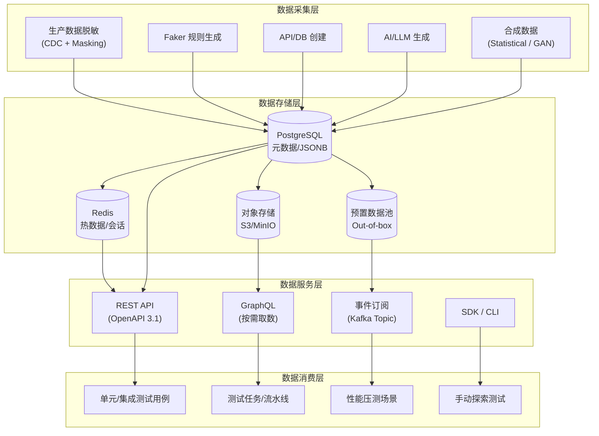
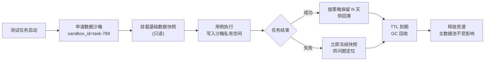

# 测试数据持久化与统一数据平台

测试数据是测试工程的"弹药库"：用例稳定性、回归精度、性能基准、合规审计最终都要落到数据上。早期团队常把测试数据散落在 YAML、Excel、SQL 脚本与硬编码字符串中，随着业务规模与团队人数扩张，数据过期、并发冲突、环境隔离失效、隐私合规缺失等问题会集中爆发。本文系统梳理测试数据持久化的存储方案、统一测试数据平台（Test Data Platform，TDP）的四层架构与 1.0→4.0 演进路径，并补充 2024–2026 年在 AI 辅助生成、合成数据、Git-based 版本化、数据沙箱与自助化方向上的工程实践，帮助读者建立一套可演进、可治理的测试数据体系。

## 一、核心概念

### 1.1 测试数据的范畴

测试数据并非"测试输入"的同义词，它至少覆盖四类：

- **测试请求数据**：测试用例执行的输入，包括强制数据（必填字段）与非强制数据（可选字段）；
- **测试期望数据**：与断言配合使用，用于判定业务行为是否符合预期；
- **测试结果数据**：单纯结果数据（单条用例输出）与聚合结果数据（测试报告、质量趋势曲线）；
- **元数据**：用例与数据的关联关系、数据创建时间、关联环境、使用次数、版本号等。

数据持久化不只是把上述数据"存下来"，而是要让它们**可追溯、可复用、可治理**。

### 1.2 测试数据持久化的核心挑战

工程实践中，测试数据持久化面临的挑战可归纳为五类：

| 挑战 | 典型表现 | 根因 |
|------|----------|------|
| 数据过期 | 优惠券测试数据在活动结束后失效 | 静态数据缺乏生命周期管理 |
| 重复运行失败 | 第二次注册同名用户导致唯一约束冲突 | 缺少 teardown 与数据回收 |
| 环境切换不可用 | DEV 数据套用到 STG 报错 | 环境与数据未绑定 |
| 并发冲突 | 多用例并行消费同一预置账号 | 数据池缺乏租户/会话隔离 |
| 隐私合规 | 真实手机号、身份证号流入测试库 | 未做脱敏或合成 |

### 1.3 为什么需要统一数据平台

在缺乏统一平台时，每个团队各自维护数据准备函数与数据文件，会出现三类系统性问题：**数据碎片化**（同一业务实体在不同团队重复造数）、**能力重复建设**（脱敏、池化、版本化每个团队都重写一遍）、**合规风险敞口**（没有统一审计入口，PII 数据散落各处）。统一测试数据平台（TDP）的核心理念是"**集中管理、按需供给、版本化与环境隔离**"，让测试工程师从"数据搬运工"演进为"数据架构师"。

## 二、测试数据持久化方案

### 2.1 四类存储介质选型

| 介质 | 适用场景 | 优势 | 局限 |
|------|----------|------|------|
| 文件（JSON/YAML/CSV/Excel） | 静态参数化数据、配置驱动数据 | 人类可读、Git 友好、可评审 | 不支持事务、并发写冲突 |
| 关系型数据库（PostgreSQL/MySQL） | 元数据、业务实体、强一致性数据 | ACID 事务、丰富查询 | 横向扩展受限 |
| 缓存（Redis） | 高频读取的会话数据、临时 token | 毫秒级延迟、TTL 自动过期 | 数据易失、不适合持久存储 |
| 对象存储（S3/MinIO/OSS） | 大文件、附件、截图、视频报告 | 海量、低成本、跨区域 | 非结构化、需配合元数据索引 |

### 2.2 分层存储策略

工程实践推荐"**热-温-冷分层**"：

- **热数据**（当前测试任务正在使用）：Redis 缓存 + PostgreSQL 元数据，要求毫秒级响应；
- **温数据**（一个迭代周期内的数据快照）：PostgreSQL + 本地对象存储，支持快速回溯；
- **冷数据**（历史测试报告、归档数据集）：对象存储 + 元数据索引，按需检索。

### 2.3 PostgreSQL 与 Redis 协同示例

```python
# TDP 存储层：PostgreSQL 持久化元数据，Redis 缓存热数据
import json, redis, psycopg
from psycopg.rows import dict_row

class DataStore:
    def __init__(self, pg_dsn: str, redis_url: str):
        # PostgreSQL 用于持久化测试数据元信息
        self.pg = psycopg.connect(pg_dsn, row_factory=dict_row)
        # Redis 用于缓存高频读取的数据集（如预置账号池）
        self.cache = redis.from_url(redis_url, decode_responses=True)

    def save_dataset(self, name: str, payload: dict, ttl: int = 3600):
        # 1. 落库：元数据 + JSONB payload，保证可追溯
        with self.pg.cursor() as cur:
            cur.execute(
                "INSERT INTO tdp_datasets(name, payload, created_at) "
                "VALUES (%s, %s, now()) RETURNING id",
                (name, json.dumps(payload, ensure_ascii=False)),
            )
            dataset_id = cur.fetchone()["id"]
        # 2. 提交事务：psycopg3 默认非 autocommit，不提交则落库不生效
        self.pg.commit()
        # 3. 写缓存：热数据按 ttl 自动过期，避免脏数据长期驻留
        self.cache.setex(f"ds:{name}", ttl, json.dumps(payload))
        return dataset_id
```

## 三、统一测试数据平台（TDP）架构

### 3.1 四层架构

TDP 的核心是"**采集 → 存储 → 服务 → 消费**"四层架构，每一层职责清晰、可独立演进。



### 3.2 1.0→4.0 演进路径

TDP 的演进本质是不断解决前一代的痛点：

| 阶段 | 核心形态 | 解决的问题 | 残留的痛点 |
|------|----------|------------|------------|
| 1.0 数据准备函数 | `createUser(A,B,C,D,E)` | 基本复用 | 参数爆炸、维护成本高 |
| 2.0 Builder Pattern | `UserBuilder.withCountry("US").build()` | 灵活性与便利性统一 | 跨语言调用不便 |
| 3.0 统一数据平台 | RESTful API + 数据池自动补充 | 跨平台、On-the-fly 转 Out-of-box | 合规与智能化缺失 |
| 4.0 智能化平台 | AI 辅助 + 合成数据 + DataOps | 隐私合规、数据即代码 | 工程化门槛仍较高 |

演进路径应匹配团队现状：小型团队可从 Builder Pattern 起步；中型团队建设统一数据平台；大型团队必须考虑合规、弹性伸缩与智能化能力。

### 3.3 数据池自动补充机制

3.0 时代最关键的工程能力是**将 On-the-fly 自动转化为 Out-of-box**：当测试用例请求数据时，平台优先返回预置数据池中的数据，同时异步补充池容量。推荐采用消息队列（Kafka/RabbitMQ）+ Worker Service 替代早期的 Jenkins Job，以获得水平扩展、失败重试与 Kubernetes 集成能力。阈值应采用动态策略（基于历史使用量预测），而非硬编码"低于 20 条补到 100 条"。

## 四、数据采集与生成

### 4.1 生产数据脱敏

生产数据是测试数据的"富矿"，但直接导入会触碰 GDPR、《个人信息保护法》等红线。脱敏方案需覆盖三个层次：**静态脱敏**（导出时一次性处理）、**动态脱敏**（查询时按角色返回掩码值）、**可逆脱敏**（保留映射表用于回溯）。下面是一段基于 Python 的字段级脱敏脚本，使用确定性哈希保证同一手机号在不同数据集间可关联但不可逆推：

```python
# 生产数据脱敏脚本：对 PII 字段做确定性脱敏，保留统计特征
import hashlib, re
from faker import Faker

faker = Faker("zh_CN")
Faker.seed(42)

def mask_phone(phone: str) -> str:
    # 保留前 3 位 + 后 4 位，中间用 * 替换，便于排障但无法还原
    return re.sub(r"(\d{3})\d{4}(\d{4})", r"\1****\2", phone)

def mask_id_card(id_card: str) -> str:
    # 身份证号做 SHA-256 确定性哈希，取前 18 位作为脱敏值
    return "MASK_" + hashlib.sha256(id_card.encode()).hexdigest()[:18]

def mask_name(name: str) -> str:
    # 姓名用 Faker 生成等长中文姓名，保留长度分布特征
    return faker.name()[:len(name)]

def mask_row(row: dict) -> dict:
    # 字段级脱敏映射表，可配置化
    field_rules = {
        "phone": mask_phone,
        "id_card": mask_id_card,
        "real_name": mask_name,
        "email": lambda v: faker.email(),
    }
    return {k: field_rules.get(k, lambda v: v)(v) for k, v in row.items()}
```

### 4.2 Faker 集成

Faker 已是事实标准（Python `faker`、Java `DataFaker`、JS `@faker-js/faker`）。关键实践有三：**固定种子**保证用例可复现；**Locale 本地化**生成中文姓名、地址、手机号；**Provider 扩展**封装业务专属字段（如订单号、SKU 编码规则）。

```python
# Faker 集成：业务专属 Provider + 固定种子
from faker import Faker
from faker.providers import BaseProvider

class OrderProvider(BaseProvider):
    def order_no(self) -> str:
        # 业务订单号规则：日期 + 6 位流水
        from datetime import date
        return f"ORD{date.today():%Y%m%d}{self.numerify('######')}"

faker = Faker("zh_CN")
faker.add_provider(OrderProvider)
Faker.seed(2026)  # 固定种子，保证 CI 与本地结果一致

# 生成 5 条订单测试数据
orders = [
    {"order_no": faker.order_no(), "buyer": faker.name(), "amount": faker.pydecimal(2, 2, positive=True)}
    for _ in range(5)
]
```

### 4.3 API 创建与 On-the-fly

对于"查询型数据"（数据必须已存在于系统数据库），Faker 无能为力，必须通过被测系统的 API 实时创建。Build Strategy 是 2.0 时代遗留的工程化封装：`SEARCH_ONLY` 仅搜索、`CREATE_ONLY` 仅创建、`SMART` 先搜后建、`OUT_OF_BOX` 从预置池取。生产推荐 `SMART` + `OUT_OF_BOX` 组合：常规请求走预置池，未命中时回退到实时创建，并异步补池。

### 4.4 AI 辅助数据生成

2024–2026 年最重要的变化是 LLM 介入数据生成。典型场景有三：**自然语言转数据集**（"给我 100 条覆盖等价类的注册用例"）、**约束满足生成**（基于 JSON Schema 与业务规则生成合规数据）、**边缘用例发现**（让 LLM 生成反直觉但合法的边界数据）。需要注意：LLM 生成的 PII 数据可能"看起来像真实数据"但实际可能偶发命中真实人物，因此 LLM 生成结果仍应过一遍脱敏管道。

## 五、数据服务化

### 5.1 REST API 设计

TDP 的服务层应以 OpenAPI 3.1 规范对外暴露 RESTful API，关键设计原则：**资源化路径**（`/datasets/{name}/records`）、**统一错误模型**（RFC 7807 Problem Details）、**幂等创建**（客户端提供 `Idempotency-Key`）。下面是一个 FastAPI 实现示例：

```python
# TDP REST API：基于 FastAPI + OpenAPI 3.1
from fastapi import FastAPI, HTTPException, Header
from pydantic import BaseModel, Field

app = FastAPI(title="TDP API", version="1.0")

class UserSpec(BaseModel):
    country: str = "CN"
    payment_method: str = "Alipay"
    build_strategy: str = Field(default="SMART", pattern="^(SEARCH_ONLY|CREATE_ONLY|SMART|OUT_OF_BOX)$")

@app.post("/api/v1/users", status_code=201, tags=["users"])
def create_user(spec: UserSpec, idempotency_key: str = Header(...)):
    """按 Build Strategy 创建/获取测试用户，支持幂等"""
    # 1. 幂等检查：同一 Idempotency-Key 直接返回上次结果
    cached = cache.get(f"idem:{idempotency_key}")
    if cached:
        return {"user": cached, "source": "idempotent_cache"}
    # 2. 按 Build Strategy 路由
    if spec.build_strategy == "OUT_OF_BOX":
        user = pool.fetch("users", country=spec.country)
        if not user:
            raise HTTPException(409, "预置数据池已耗尽")
    else:
        user = core_service.build_user(spec)
    cache.setex(f"idem:{idempotency_key}", 600, user)
    return {"user": user, "source": spec.build_strategy}
```

### 5.2 GraphQL 按需取数

当测试用例只需要"用户 + 其最近 3 条订单 + 收货地址"这种关联数据时，REST 需要多次往返，GraphQL 的优势凸显。TDP 可在 REST 之上叠加一层 GraphQL 网关（Apollo Server / Strawberry），数据消费方按需选取字段，减少冗余传输。需要注意的是，GraphQL 网关必须做查询深度限制与复杂度分析，避免恶意查询拖垮存储层。

### 5.3 事件订阅

对于性能压测、混沌测试这类需要持续数据流的场景，TDP 应支持 Kafka Topic 订阅模式：消费方订阅 `tdp.users.created` 等 Topic，平台在数据创建时同步发布事件。这种模式天然解耦生产者与消费者，也便于做"数据回放"（重放历史事件流复现问题）。

## 六、数据版本化与沙箱

### 6.1 Git-based 数据版本管理

DataOps 的核心思想是"**数据即代码**"：将测试数据集的定义（而非数据本身）存储在 Git 仓库中，通过 PR 评审变更，通过 CI 验证数据质量。实践中需区分两类对象：

- **数据集 Schema 与生成规则**：版本化、可评审，存入 Git；
- **数据集实例**：通过规则生成或脱敏产生，存入对象存储，元数据索引到 PostgreSQL。

```yaml
# datasets/users/staging.yaml —— Git 中的数据集定义
apiVersion: tdp/v1
kind: Dataset
metadata:
  name: staging-users
  version: 1.3.0          # 语义化版本
  owner: qa-platform-team
spec:
  source: faker           # 来源：faker / production_masked / synthetic
  locale: zh_CN
  count: 1000
  schema:
    - field: user_id
      type: uuid
    - field: phone
      provider: phone_number
      mask: partial       # 静态脱敏策略
    - field: register_time
      provider: date_time_between
      args: ["-30d", "now"]
  quality_gates:          # 数据质量门禁
    - rule: "phone 唯一性"
      check: distinct_count(phone) == count
```

### 6.2 数据沙箱与隔离回收

数据沙箱（Data Sandbox）解决的是"多用例并发使用同一数据集时的相互污染"。核心机制是**临时数据快照 + 写时复制（Copy-on-Write）+ 用后即焚**：

- 测试任务启动时，TDP 为其创建一个沙箱 ID，关联一组基础数据快照；
- 测试用例的写操作落到沙箱私有空间，不影响主数据池；
- 任务结束后，TDP 根据 `retention_policy` 决定立即回收或保留 N 天供回溯。



环境与数据的绑定同样关键：每个测试环境（DEV/STG/PRE）只能看到绑定到自己环境的数据集，环境销毁时自动级联清理关联数据，避免"DEV 数据流到 STG 导致脏数据"的经典问题。

## 七、2024–2026 新趋势

### 7.1 AI 辅助数据生成

LLM 不只是"另一种 Faker"。其差异化价值在于：能根据被测系统的 OpenAPI 文档自动推断字段语义与约束、能生成符合业务上下文的关联数据（订单与商品类目匹配）、能基于历史缺陷分布生成更可能触发 bug 的数据组合。工程化落地建议：将 LLM 生成结果落库前必须经过 Schema 校验、PII 二次脱敏、唯一性检查三道关卡，避免"看起来合理实则非法"的数据污染环境。

### 7.2 合成数据平台

合成数据（Synthetic Data）从零生成，不包含任何真实个人信息，从根本上解决合规问题。主流方法：基于统计模型的合成（保留真实数据的分布特征但不包含真实记录）、基于 GAN/Diffusion 的合成（适用于非结构化数据如图像与文本）。商业方案如 Gretel.ai、Mostly AI、Tonic.ai 已提供企业级服务，开源方案如 SDV（Synthetic Data Vault）可自部署。合成数据的关键评估指标是"**保真度-隐私-效用三角**"：保真度越高越像真实数据，但隐私风险越大；隐私越好越安全，但效用可能下降。

### 7.3 自助化与数据目录

成熟的 TDP 会提供自助化门户：测试工程师在 Web 界面搜索数据集、查看血缘（某条数据由哪个生产快照脱敏而来、被哪些用例引用过）、一键申请权限、自助触发数据生成任务。背后是一套完整的**数据目录**（Data Catalog）能力，类似 DataHub/Apache Atlas 的测试领域适配版。自助化的核心收益是把"数据准备"从 Ticket 驱动变为 Self-Service 驱动，将 QA 从等待中解放出来。

### 7.4 DataOps 与数据质量门禁

DataOps 将 DevOps 实践引入数据管理：数据定义在 Git 中版本化、数据流水线由 CI/CD 驱动、数据质量门禁在数据进入测试环境前自动校验完整性/一致性/合规性。一个典型的数据 PR 流程是：开发者提交数据集 Schema 变更 → CI 触发数据生成与质量检查 → 门禁通过后合并 → CD 部署到对应环境 → 通知订阅了该数据集的用例重跑。

## 八、常见陷阱与最佳实践

### 8.1 五个高频陷阱

1. **静态数据未设 TTL**：优惠券、活动类数据过期后用例集体飘红，应建立数据生命周期看板与到期前告警；
2. **预置池容量硬编码**：阈值应基于历史使用量动态调整，否则峰值期会因池耗尽导致用例批量失败；
3. **脱敏不彻底**：只脱敏了手机号却忘了邮箱、地址、设备指纹，PII 仍可被关联还原；
4. **环境数据未隔离**：DEV 与 STG 共用数据池，导致一处变更影响多个环境；
5. **LLM 生成数据未校验**：直接将 LLM 输出灌入测试库，可能引入格式非法或唯一性冲突的数据。

### 8.2 最佳实践清单

- **数据定义与数据实例分离**：Schema 进 Git，实例进对象存储；
- **Build Strategy 显式声明**：用例中明确使用 `SMART` 还是 `OUT_OF_BOX`，便于失败时定位；
- **幂等创建**：所有写操作支持 `Idempotency-Key`，重试不会产生脏数据；
- **数据血缘可追溯**：每条测试数据都能回溯到来源（生产快照版本/生成规则/创建人）；
- **质量门禁前置**：数据进入环境前完成 schema、唯一性、PII 三项校验；
- **沙箱优先**：并发任务默认使用沙箱，避免主数据池被污染；
- **审计日志完整**：所有数据访问与操作记录到不可篡改的审计日志，满足合规审查。

### 8.3 演进建议

中小团队不必一步到位。建议三步走：第一步，引入 Faker + Build Strategy 替代硬编码数据；第二步，将 Builder 包装为 RESTful API 并建设预置数据池；第三步，叠加 Git 版本化、数据沙箱、合成数据与 AI 辅助生成能力。每一步都应回到一个朴素的衡量标准——**用例稳定性是否提升、数据准备耗时是否下降、合规审计是否可通过**。

测试数据平台的建设没有终点，它随业务规模、合规要求与技术栈演进而持续迭代。从"散落的 YAML 文件"到"AI 驱动的统一数据平台"，每一次演进都是对前一代痛点的系统性回应，也是测试工程化成熟度的直观体现。
