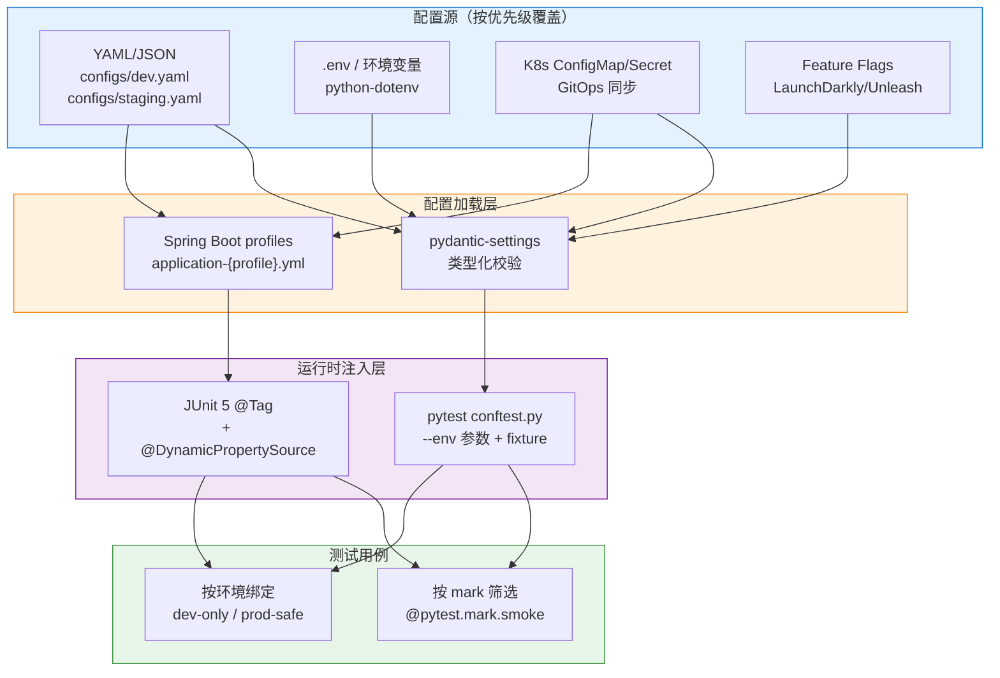
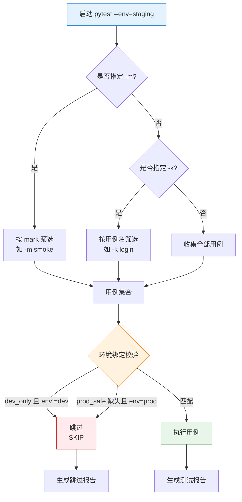

# 测试框架动态切换环境与用例

测试用例与运行环境是一对孪生变量：同一段登录脚本在 DEV 上通过、在 STG 上 401，根因往往不是用例本身而是环境配置漂移。早期测试框架把环境信息硬编码在脚本里（`BASE_URL = "http://dev"`），导致每次环境切换都要改代码、提 PR、等评审，团队疲于奔命。现代测试工程的核心思路是**把环境作为一等公民抽象出来**：配置外部化、参数化注入、用例与环境绑定、运行时按需筛选。本文基于 pytest 9 + conftest.py + fixtures、Spring Boot 3 profiles、JUnit 5.12 `@Tag`、Testcontainers 1.21 等当前稳定版本，系统梳理多环境配置管理、动态切换、用例筛选与环境隔离的工程化方案，并补充 2024–2026 年 GitOps、K8s ConfigMap/Secret、Feature Flags 等新趋势。

## 一、核心概念

### 1.1 为什么需要多环境

生产级系统通常至少存在 DEV / STG / PRE / PROD 四套环境，每套环境承担不同职责：

| 环境 | 主要职责 | 数据来源 | 典型测试类型 |
|------|----------|----------|--------------|
| DEV | 开发自测、快速反馈 | Mock / 内存 DB | 单元、接口 |
| STG | 集成回归、业务联调 | 脱敏快照 | 集成、回归 |
| PRE | 预发布、灰度验证 | 生产同步（脱敏） | 端到端、契约 |
| PROD | 线上监控、灾难演练 | 真实流量（只读） | 探测、监控 |

不同环境对**配置（域名、账号、第三方凭据）、数据（预置数据集、数据库实例）、行为（是否启用风控、是否走真实支付通道）**的要求差异极大。如果用例无法动态切换环境，团队只能在代码里塞满 `if env == "dev"` 分支，最终演化为"用例比业务代码更难维护"的反模式。更严重的是，这种耦合会让 CI 流水线失去弹性——一个 PR 想在 STG 上做完整回归，必须改代码、提 PR、等评审，反馈链路被拉长到小时级，远超现代测试工程对"分钟级反馈"的预期。

### 1.2 环境切换的四大挑战

- **配置漂移**：DEV 上 mock 了第三方，STG 上接真实网关，相同用例行为差异巨大；
- **密钥管理**：数据库密码、API Token 等敏感信息既不能进 Git，又必须在 CI 中被注入；
- **用例与环境错配**：破坏性用例（如删除订单）误跑到 PROD，造成生产事故；
- **数据隔离失效**：DEV 与 STG 共用同一数据池，导致一处变更污染多环境。

这四类挑战有一个共性：它们都源于**环境信息与测试代码的耦合**。配置漂移是因为耦合点散落各处；密钥管理难是因为没有统一的注入入口；用例错配是因为用例没有声明自己的环境约束；数据隔离失效是因为没有为每套环境划出独立的数据边界。因此工程上必须用一套**外部化配置 + 运行时注入 + 用例筛选 + 环境隔离**的闭环机制来回应这四类挑战，任何只解决其中一环的方案都会在另一环反噬。

### 1.3 多环境配置架构总览



架构核心是**配置源 → 加载层 → 注入层 → 用例**四段式：配置源负责外部化与版本化，加载层负责类型校验与默认值兜底，注入层负责按命令行参数路由，用例侧通过 mark/Tag 与环境绑定。

## 二、多环境配置管理

### 2.1 YAML 多环境配置

将每个环境的配置独立成 YAML 文件，是工程上最直观的方案：

```yaml
# configs/dev.yaml —— 开发环境配置
env: dev
base_url: http://localhost:8080
db:
  host: localhost
  port: 5432
  name: shop_dev
third_party:
  payment: mock         # DEV 走 mock，不发真实请求
  sms: mock
features:
  risk_control: false    # 关闭风控，便于调试
```

```yaml
# configs/staging.yaml —— 预发环境配置
env: staging
base_url: https://api.stg.example.com
db:
  host: pg-stg.internal
  port: 5432
  name: shop_stg
third_party:
  payment: sandbox       # 沙箱网关
  sms: real
features:
  risk_control: true
```

### 2.2 .env 与 python-dotenv

`.env` 文件用于存放**敏感或本地差异**配置，配合 `python-dotenv` 在进程启动时加载到 `os.environ`：

```bash
# .env.staging —— 不进 Git，通过 Secret 注入
DB_PASSWORD=stg_s3cret
API_TOKEN=eyJhbGciOiJIUzI1NiJ9...
```

```python
# 加载 .env 文件，按环境变量覆盖
from dotenv import load_dotenv
load_dotenv(".env.staging")  # 显式指定文件
```

### 2.3 pydantic-settings 类型化校验

`pydantic-settings`（Pydantic v2 时代的 `BaseSettings`）的核心价值是**类型校验 + 默认值 + 多源合并**：从环境变量、`.env`、YAML 读取后统一为强类型对象，避免到处 `os.getenv("DB_HOST") or "localhost"` 的散弹式兜底。

```python
# config.py —— 使用 pydantic-settings 加载多环境配置
from pydantic_settings import BaseSettings, SettingsConfigDict
from pydantic import Field, PostgresDsn
import yaml

class DBConfig(BaseSettings):
    host: str
    port: int = 5432
    name: str
    password: str = ""  # 从环境变量注入，不进 YAML

class AppConfig(BaseSettings):
    env: str = Field(default="dev", pattern="^(dev|staging|prod)$")
    base_url: str
    db: DBConfig
    payment_provider: str = "mock"

    model_config = SettingsConfigDict(
        env_file=".env",
        env_nested_delimiter="__",  # DB__HOST 形式支持嵌套
        extra="ignore",
    )

def load_config(env: str) -> AppConfig:
    """根据 env 名加载对应 YAML，再合并环境变量"""
    with open(f"configs/{env}.yaml", encoding="utf-8") as f:
        yaml_data = yaml.safe_load(f)
    # 环境变量优先级最高，会覆盖 YAML 中同名字段
    return AppConfig(**yaml_data)
```

### 2.4 配置覆盖优先级

多源配置必然存在覆盖关系，建议遵循"**环境变量 > .env > YAML > 代码默认值**"的优先级，这与 12-Factor App 的"配置外部化"原则一致。优先级设计的关键考量是：**代码默认值保证零配置可启动，YAML 承载环境差异，环境变量承载敏感信息与 CI 注入**。这样开发者克隆仓库后无需任何配置即可跑通 DEV 用例，CI 通过环境变量注入 STG 凭据，PROD 通过 K8s Secret 注入生产密钥——同一份代码、同一套测试逻辑，在不同环境下展现出截然不同的运行形态。

### 2.5 Spring Boot profiles

Java 生态的事实标准是 Spring Boot profiles：通过 `application-{profile}.yml` 文件分离环境配置，运行时通过 `--spring.profiles.active=staging` 激活：

```yaml
# src/main/resources/application-staging.yml —— Spring Boot profile
spring:
  datasource:
    url: jdbc:postgresql://pg-stg.internal:5432/shop_stg
    username: stg_app
    password: ${DB_PASSWORD}   # 引用环境变量
  jpa:
    hibernate:
      ddl-auto: validate       # STG 不允许自动改表
payment:
  provider: sandbox
  api-key: ${PAYMENT_API_KEY}
```

```java
// Spring Boot 测试中通过 @ActiveProfiles 激活 profile
import org.springframework.boot.test.context.SpringBootTest;
import org.springframework.test.context.ActiveProfiles;

@SpringBootTest
@ActiveProfiles("staging")  // 加载 application-staging.yml
class OrderServiceStagingIT {
    // 测试方法...
}
```

Spring Boot 3.x 还支持 `@DynamicPropertySource`，可在测试运行时动态注入配置（如 Testcontainers 启动的随机端口）：

```java
import org.springframework.test.context.DynamicPropertySource;
import org.springframework.test.context.DynamicPropertyRegistry;

@SpringBootTest
class OrderServiceDynamicIT {

    static PostgreSQLContainer<?> pg = new PostgreSQLContainer<>("postgres:16-alpine");

    static {
        pg.start();
    }

    // 运行时把容器随机端口注入到 Spring 配置
    @DynamicPropertySource
    static void props(DynamicPropertyRegistry registry) {
        registry.add("spring.datasource.url",      pg::getJdbcUrl);
        registry.add("spring.datasource.username",  pg::getUsername);
        registry.add("spring.datasource.password",  pg::getPassword);
    }
}
```

## 三、pytest 动态切换

### 3.1 conftest.py 自定义 --env 参数

pytest 通过 `conftest.py` 提供 `pytest_addoption` 钩子注册命令行参数，配合 fixture 实现运行时切换：

```python
# tests/conftest.py —— 注册 --env 参数并加载对应配置
import pytest
from config import load_config

def pytest_addoption(parser):
    """注册 --env 命令行参数，默认 dev"""
    parser.addoption(
        "--env", action="store", default="dev",
        choices=["dev", "staging", "prod"],
        help="目标测试环境：dev / staging / prod",
    )

@pytest.fixture(scope="session")
def app_config(request):
    """会话级配置 fixture，整个测试会话复用同一配置"""
    env = request.config.getoption("--env")
    return load_config(env)

@pytest.fixture(scope="session")
def base_url(app_config):
    return app_config.base_url
```

使用方式极简：

```bash
# 跑 DEV 环境用例
pytest --env=dev tests/

# 跑 STG 环境冒烟用例
pytest --env=staging -m smoke tests/
```

### 3.2 fixture 注入环境配置

用例侧通过依赖注入获取配置，避免全局变量与隐式状态：

```python
# tests/test_login.py —— 通过 fixture 注入环境配置
import pytest

@pytest.mark.smoke
def test_login_success(app_config, base_url):
    # app_config 是会话级 fixture，按 --env 自动路由
    user = app_config.test_users["default"]
    resp = requests.post(f"{base_url}/login", json=user)
    assert resp.status_code == 200
```

### 3.3 用例与环境的强绑定

某些用例只能在特定环境跑（如"删除用户"不能在 PROD），需通过自定义 marker 显式声明：

```python
# tests/conftest.py —— 注册自定义 marker 并做环境一致性校验
import pytest

def pytest_configure(config):
    config.addinivalue_line("markers", "dev_only: 仅在 DEV 环境运行")
    config.addinivalue_line("markers", "staging_only: 仅在 STG 环境运行")
    config.addinivalue_line("markers", "prod_safe: 在 PROD 环境安全运行")

def pytest_collection_modifyitems(config, items):
    """收集阶段过滤：根据 --env 剔除不匹配的用例"""
    env = config.getoption("--env")
    skip = pytest.mark.skip(reason=f"当前环境 {env} 不匹配 marker 要求")
    for item in items:
        if "dev_only" in item.keywords and env != "dev":
            item.add_marker(skip)
        if "staging_only" in item.keywords and env != "staging":
            item.add_marker(skip)
        if "prod_safe" not in item.keywords and env == "prod":
            item.add_marker(skip)  # PROD 默认只跑 prod_safe 用例
```

```python
# tests/test_user.py —— 用例侧显式声明环境绑定
import pytest

@pytest.mark.dev_only
def test_delete_user_cascade(app_config):
    """破坏性用例：仅 DEV 跑"""
    delete_user(app_config.test_users["temp"])
    assert get_user(...) is None

@pytest.mark.prod_safe
def test_search_product_returns_200(base_url):
    """只读用例：所有环境均可"""
    resp = requests.get(f"{base_url}/products?q=iphone")
    assert resp.status_code == 200
```

## 四、用例动态筛选

### 4.1 pytest mark 标记

`@pytest.mark.<name>` 是 pytest 最基础的用例分类机制。常用约定：

- `@pytest.mark.smoke`：核心链路冒烟，CI 必跑；
- `@pytest.mark.regression`：全量回归；
- `@pytest.mark.slow`：耗时用例，夜间任务；
- `@pytest.mark.flaky`：偶发失败用例，允许重试。

```python
# tests/test_checkout.py —— mark 多重标记
import pytest

@pytest.mark.smoke
@pytest.mark.regression
def test_checkout_happy_path():
    ...

@pytest.mark.regression
@pytest.mark.slow
def test_checkout_full_refund_flow():
    ...
```

通过 `-m` 选项按 mark 筛选：

```bash
# 只跑冒烟用例
pytest -m smoke

# 跑除 slow 外的所有回归用例
pytest -m "regression and not slow"
```

### 4.2 pytest -k 表达式筛选

`-k` 支持基于**用例名子串**的布尔表达式筛选，适合临时调试：

```bash
# 跑所有名字含 login 的用例
pytest -k "login"

# 跑 login 或 register，但排除 failure 用例
pytest -k "(login or register) and not failure"
```

`-m` 适合按**测试类型**筛选，`-k` 适合按**用例名**筛选，二者可组合使用。

### 4.3 JUnit 5 @Tag

JUnit 5.12 通过 `@Tag` 注解实现用例筛选，与 pytest mark 概念一致：

```java
import org.junit.jupiter.api.Tag;
import org.junit.jupiter.api.Test;

@Tag("smoke")
class LoginTest {

    @Test
    @Tag("regression")
    void testLoginSuccess() { ... }

    @Test
    @Tag("slow")
    void testLoginWithRetries() { ... }
}
```

通过 `maven-surefire-plugin` 配置筛选：

```xml
<!-- pom.xml —— JUnit 5 按 tag 筛选 -->
<plugin>
    <groupId>org.apache.maven.plugins</groupId>
    <artifactId>maven-surefire-plugin</artifactId>
    <configuration>
        <groups>smoke | regression</groups>          <!-- 包含的 tag -->
        <excludedGroups>slow</excludedGroups>         <!-- 排除的 tag -->
    </configuration>
</plugin>
```

### 4.4 三套筛选机制对比

| 机制 | 筛选维度 | 典型场景 | 持久性 |
|------|----------|----------|--------|
| `-m` mark | 测试类型（smoke/regression） | CI 流水线按阶段调度 | 用例代码内声明，长期 |
| `-k` 表达式 | 用例名子串 | 临时调试、定位单个用例 | 命令行临时指定 |
| `pytest_collection_modifyitems` | 环境绑定 | 强制安全过滤 | 框架级强制 |

实际工程中三者协同工作：mark 与 -k 是用户主动选择用例子集，环境绑定是框架强制过滤——后者永远生效，即使用户没指定任何筛选参数。这种"用户意图 + 框架约束"的分层设计，是避免 PROD 事故的最后一道防线。

### 4.5 用例筛选决策树

实际工程中，**mark、-k、环境绑定** 三者需要协同使用，决策路径如下：



决策树的关键设计点是：**筛选（用户意图）与过滤（环境安全）分离**。`-m` / `-k` 是用户主动选择用例子集，`pytest_collection_modifyitems` 是框架强制的环境安全过滤——即使用户显式指定了 `-m dev_only`，在 `--env=prod` 时仍应被跳过，防止误操作。

## 五、环境隔离

### 5.1 Docker Compose 多环境编排

Docker Compose 通过 `-f` 参数加载不同 compose 文件，实现环境隔离：

```yaml
# docker-compose.staging.yml —— STG 环境编排
services:
  app:
    image: registry.example.com/shop:${TAG:-latest}
    environment:
      - SPRING_PROFILES_ACTIVE=staging
      - DB_PASSWORD=${DB_PASSWORD}
    depends_on:
      - postgres
  postgres:
    image: postgres:16-alpine
    environment:
      - POSTGRES_DB=shop_stg
      - POSTGRES_PASSWORD=${DB_PASSWORD}
    volumes:
      - pg-stg-data:/var/lib/postgresql/data
volumes:
  pg-stg-data:
```

```bash
# 启动 STG 编排
docker compose -f docker-compose.staging.yml up -d
```

### 5.2 Testcontainers 环境隔离

Docker Compose 适合**长期运行**的环境，Testcontainers 适合**测试生命周期内**的临时环境。每次测试启动一个全新容器，测试结束自动销毁，彻底杜绝状态漂移：

```python
# tests/conftest.py —— Testcontainers 提供测试级 DB 隔离
import pytest
from testcontainers.postgres import PostgresContainer

@pytest.fixture(scope="session")
def pg_container(app_config):
    """会话级启动 PostgreSQL 容器，会话结束自动销毁"""
    if app_config.env == "dev":
        # DEV 环境用一次性容器，避免污染本地 DB
        with PostgresContainer("postgres:16-alpine") as pg:
            yield pg
    else:
        # STG / PROD 环境使用已有 DB，不启动容器
        yield app_config.db
```

### 5.3 K8s Namespace 隔离

在 K8s 集群中，**Namespace** 是天然的软隔离边界。每个测试环境对应一个 Namespace，资源（Pod、Service、ConfigMap）互不可见：

```bash
# 创建测试专用 Namespace
kubectl create ns test-staging
kubectl apply -f deploy/ -n test-staging

# 跑完销毁，资源级联回收
kubectl delete ns test-staging
```

Namespace 隔离 + ResourceQuota 限制，可避免某个测试任务占用过多集群资源影响生产。

## 六、2024–2026 新趋势

### 6.1 GitOps 配置管理

GitOps（Argo CD、Flux）将"环境配置即代码"推向新阶段：环境配置存储在 Git 仓库中，通过 PR 评审变更，控制器监听 Git 仓库并自动同步到目标集群。其核心价值对测试工程有三：

- **配置可审计**：每次环境变更都有 commit 记录，可追溯谁在何时改了什么；
- **环境可重建**：删除一个 Namespace 后，GitOps 控制器会自动重建到 Git 中声明的状态；
- **多环境一致性**：DEV 与 STG 共享同一套 Helm chart，仅 values 文件不同，避免配置漂移。

```yaml
# gitops/environments/staging/values.yaml —— GitOps 中的环境声明
env: staging
replicas: 2
image:
  tag: v1.4.2
config:
  db_host: pg-stg.internal
  features:
    risk_control: true
secrets:
  ref: staging-secrets   # 引用 K8s Secret，不直接存储
```

### 6.2 K8s ConfigMap 与 Secret

K8s 原生的配置管理对象：ConfigMap 存非敏感配置，Secret 存敏感凭据（base64 编码，配合 RBAC 限制访问）。测试框架通过 K8s API 或 downward API 注入：

```yaml
# k8s/configmap-staging.yaml —— ConfigMap 示例
apiVersion: v1
kind: ConfigMap
metadata:
  name: test-config
  namespace: test-staging
data:
  ENV: staging
  BASE_URL: https://api.stg.example.com
  DB_HOST: pg-stg.internal
---
# k8s/secret-staging.yaml —— Secret 示例
apiVersion: v1
kind: Secret
metadata:
  name: test-secrets
  namespace: test-staging
type: Opaque
stringData:
  DB_PASSWORD: stg_s3cret
  API_TOKEN: eyJhbGciOiJIUzI1NiJ9...
```

CI 中通过 `kubectl apply -f k8s/ -n test-staging` 部署，测试 Pod 通过环境变量或 volume 挂载消费。

### 6.3 Feature Flags 与测试结合

Feature Flags（LaunchDarkly、Unleash、Flagsmith）原本用于灰度发布，2024 年起被越来越多团队用于**测试环境行为控制**：

- **生产探测**：在 PROD 环境通过 flag 控制用例走只读路径，不影响真实用户；
- **新功能预启**：STG 上通过 flag 启用未发布功能，跑专属回归用例；
- **故障注入**：通过 flag 触发降级路径，验证容错逻辑。

```python
# tests/test_checkout.py —— Feature Flag 驱动用例行为
import pytest
from flag_client import is_enabled  # 封装 LaunchDarkly / Unleash

@pytest.mark.regression
def test_checkout(app_config):
    if is_enabled("new_payment_flow", default=False):
        # flag 启用时走新支付链路
        resp = checkout_v2(app_config.test_order)
    else:
        resp = checkout_v1(app_config.test_order)
    assert resp.status_code == 200
```

Feature Flags 让测试用例与代码部署解耦：**功能未上线也能跑用例，上线后无需重新发版即可切换行为**。

## 七、版本演进时间线

| 时间 | 里程碑 | 影响 |
|------|--------|------|
| 2014 | Spring Boot 1.0 profiles | Java 生态配置分离标准化 |
| 2017 | pytest 3 引入 `pytest_addoption` | 命令行参数化环境切换成为可能 |
| 2017 | JUnit 5.0 `@Tag` 发布 | Java 生态用例筛选注解化 |
| 2018 | pydantic v1 `BaseSettings` | Python 配置类型化校验起步 |
| 2022 | Testcontainers 1.17 GA | 容器化测试环境隔离成主流 |
| 2022 | Argo CD / Flux CNCF 毕业 | GitOps 配置管理进入企业主流 |
| 2023 | pydantic-settings v2 稳定 | 配置类型化与多源合并标准化 |
| 2025 | Feature Flags 与测试深度融合 | 用例行为与代码部署解耦 |
| 2026 | K8s 原生测试环境编排成熟 | Namespace + ConfigMap + GitOps 闭环 |

从时间线可见，环境切换的演进方向是**配置外部化、类型化、声明式**：从 2014 年的 Spring profiles 文件分离，到 2023 年的 pydantic-settings 类型校验，再到 2026 年的 GitOps + K8s 原生编排，每一步都在把"环境"从代码中剥离得更彻底，让测试用例更纯粹地聚焦业务逻辑。

## 八、常见陷阱与最佳实践

### 8.1 陷阱清单

1. **配置硬编码**：`BASE_URL = "http://dev"` 散落各处，环境切换需改 50 个文件。应统一走 `app_config` fixture；
2. **密钥进 Git**：数据库密码直接写在 YAML 提交，造成安全事故。应通过环境变量、K8s Secret、Vault 注入；
3. **环境绑定缺失**：破坏性用例未标 `dev_only`，CI 误切到 PROD 时直接跑挂生产。必须强制 `pytest_collection_modifyitems` 过滤；
4. **fixture 作用域错误**：`app_config` 用默认 `function` scope，导致每条用例重新加载 YAML，CI 慢如蜗牛。会话级配置应 `scope="session"`；
5. **marker 未注册**：使用 `@pytest.mark.xxx` 但未在 `pytest_configure` 中注册，pytest 9 默认会发 warning，未来版本可能直接报错；
6. **Docker Compose 状态泄漏**：测试结束未 `down`，容器堆积导致磁盘占满。应在 fixture teardown 中显式清理；
7. **ConfigMap 与代码版本错配**：K8s 中 ConfigMap 仍是旧版本，但镜像已更新到新版本，导致行为不一致。应通过 GitOps 保证配置与代码同 PR 变更。

### 8.2 最佳实践

- **配置外部化优先**：任何 `if env == "dev"` 都应转化为配置项，由 fixture 注入；
- **类型化校验**：用 `pydantic-settings` 或 Spring Boot `@ConfigurationProperties` 做强类型校验，启动期失败好过运行期踩坑；
- **环境绑定显式化**：所有破坏性用例必须显式 `dev_only`，PROD 默认只放行 `prod_safe`；
- **配置与代码同仓库**：YAML 配置文件应与测试代码同仓库、同 PR、同 review，避免"配置文件无人维护"；
- **GitOps 管理环境**：环境声明入 Git，PR 评审 + CI 校验 + 自动同步，杜绝手工 `kubectl edit`；
- **Feature Flags 解耦发布**：新功能用 flag 控制启停，测试用例可在功能上线前预跑；
- **Testcontainers 默认化**：集成测试默认用容器化 DB，杜绝共享 DB 的环境漂移；
- **K8s Namespace 强隔离**：每套测试环境独立 Namespace，配合 ResourceQuota 限制资源占用。

### 8.3 演进建议

中小团队不必一步到位 GitOps + K8s 编排。建议三步走：第一步，将硬编码配置抽离为 YAML + `pydantic-settings`，引入 `--env` 参数与 `app_config` fixture，让"环境"成为命令行选项；第二步，为破坏性用例显式声明 `dev_only` marker，并在 `pytest_collection_modifyitems` 中做强制过滤，杜绝误跑 PROD；第三步，引入 Testcontainers 做集成测试隔离，将环境声明迁移到 GitOps + K8s ConfigMap，让配置与代码同步演进。每一步的衡量标准都很朴素：**配置是否类型化、用例是否与环境显式绑定、密钥是否永不进 Git**——任何一次 PROD 事故，本质上都是这三条中至少一条的失守。

测试框架的环境切换能力，本质是**用工程化手段把"环境"从代码中剥离出来**，让用例聚焦业务逻辑而非配置搬运。从最简单的 YAML 文件到 GitOps + K8s ConfigMap + Feature Flags 的完整闭环，每一次演进都是对"配置漂移、密钥泄漏、用例错配"三类痛点的一次系统性回应。无论团队处于哪个阶段，都应回到一个朴素原则：**环境是测试用例的输入，而不是测试用例的一部分**——当 `pytest --env=staging` 与 `pytest --env=prod` 跑的是同一份代码、同一套断言、只是配置不同时，环境切换才真正达到了工程化的成熟度。
