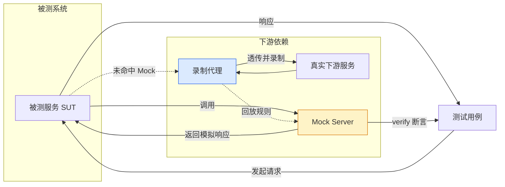
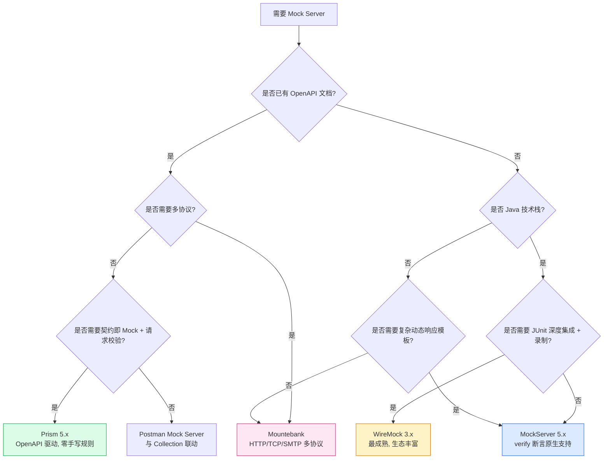

# Mock Server 必杀技

在后端接口未就绪、第三方依赖收费限流、下游服务不稳定或联调环境稀缺的场景下，测试执行往往被"等接口"卡住。Mock Server 通过在网络层"伪装"被依赖服务的契约与行为，让前端联调、接口自动化、契约测试、性能压测能够独立、并行、可重复地推进。本文聚焦 Mock Server 主流工具的工程实战，覆盖 WireMock 3.x、MockServer 5.x、Mountebank、Prism 5.x 与 Postman Mock Server 的核心用法，并补充 2024–2026 年在 Schema 驱动 Mock、契约协同、AI 辅助生成与服务虚拟化方向上的新趋势。需要说明的是，本文聚焦 Mock Server 工具实战，**契约测试的体系化方法论与微服务架构层面的虚拟化治理**分别在《04-API 测试》与《06-服务虚拟化》中展开。

## 一、核心概念

### 1.1 Mock Server 是什么

Mock Server 是一个"按预定规则拦截请求并返回模拟响应"的网络服务。它通常具备四类核心能力：

- **请求匹配**：基于 URL、Method、Header、Body、Query 等多维条件精确或模糊匹配入站请求；
- **响应构造**：返回固定 JSON、模板化响应、动态生成响应、延迟、错误码、流式响应；
- **行为模拟**：状态机（同一接口不同状态返回不同结果）、代理透传（未命中规则时转发到真实服务）、录制回放；
- **可观测性**：请求日志、命中率统计、断言验证（验证是否被按预期调用）。

### 1.2 Stub vs Mock vs Virtual Service

三者经常被混用，但工程含义不同：

| 概念 | 关注点 | 是否验证交互 | 典型代表 |
|------|--------|--------------|----------|
| **Stub（打桩）** | 提供"预设返回值"，让被测系统能跑下去 | 否 | axios-mock-adapter、Sinon stub |
| **Mock（模拟）** | 既提供返回值，又验证"是否被按契约调用" | 是 | MockServer verify、WireMock serveEvents |
| **Virtual Service（虚拟服务）** | 模拟复杂行为（状态机、协议、性能特征），企业级 | 可选 | Mountebank、WireMock 录制、商用 SV 工具 |

简言之：Stub 解决"能不能跑"，Mock 解决"对不对"，Virtual Service 解决"像不像"。Mock Server 工具通常同时覆盖三者，区别在于使用方式。

### 1.3 适用场景

- **前端联调**：后端接口未完成时，前端基于 Mock 数据开发并走通页面逻辑；
- **接口自动化**：被测服务依赖外部付费 API（如短信、风控、征信），用 Mock 替换以降低成本与不稳定；
- **契约测试**：消费方基于 Mock 验证其对提供方契约的理解，提供方据此回归；
- **性能压测**：被压服务下游处理能力受限，用 Mock 模拟下游以隔离性能瓶颈；
- **异常演练**：模拟超时、5xx、网络抖动、脏数据等异常路径，验证容错逻辑。

### 1.4 Mock 在测试链路中的位置



上图展示了 Mock Server 在测试链路中的三种角色：直接 Mock、代理透传、录制回放。生产环境中，同一个 Mock Server 通常同时承载这三种模式，由 mapping 规则的优先级决定。

## 二、WireMock 3.x 实战

WireMock 是 Java 生态最成熟的 Mock Server，3.x 版本基于 Jetty 11，支持 JAR 独立部署、Docker 部署与 JUnit 集成。其核心模型是 **mappings（映射规则）** 与 **响应模板（Handlebars）**。

### 2.1 独立部署

```bash
# 下载 WireMock 3.x 独立 JAR 并启动
# --port 指定 HTTP 端口，--https-port 指定 HTTPS 端口
# --root-dir 指定 mapping 与 recording 文件目录
java -jar wiremock-standalone-3.9.1.jar \
  --port 8080 \
  --https-port 8443 \
  --root-dir ./wiremock \
  --verbose
```

启动后访问 `http://localhost:8080/__admin/` 可查看管理界面，`/__admin/mappings` 列出所有规则。

### 2.2 mapping JSON 规则

每条规则是一个 JSON 文件，放在 `mappings/` 目录下，定义"请求匹配 + 响应构造"：

```json
{
  "name": "查询用户信息",
  "request": {
    "method": "GET",
    "urlPath": "/api/users/1",
    "headers": {
      "Accept": {
        "contains": "application/json"
      }
    }
  },
  "response": {
    "status": 200,
    "headers": {
      "Content-Type": "application/json"
    },
    "jsonBody": {
      "id": 1,
      "name": "张三",
      "email": "zhangsan@example.com"
    },
    "fixedDelayMs": 100
  },
  "priority": 5
}
```

`priority` 数值越小优先级越高，用于解决多条规则同时命中的冲突。

### 2.3 响应模板（Handlebars）

WireMock 3.x 默认启用 Handlebars 模板引擎，可基于请求字段动态生成响应：

```json
{
  "request": {
    "method": "GET",
    "urlPath": "/api/users",
    "queryParameters": {
      "id": {
        "matches": "\\d+"
      }
    }
  },
  "response": {
    "status": 200,
    "body": "{\"id\": {{request.query.id}}, \"name\": \"用户{{request.query.id}}\", \"source\": \"mock\"}",
    "transformers": ["response-template"],
    "headers": {
      "Content-Type": "application/json"
    }
  }
}
```

进阶用法包括 `{{now 'yyyy-MM-dd'}}` 生成当前日期、`{{randomValue length=8 type='ALPHANUMERIC'}}` 生成随机串、`{{jsonPath request.body '$.user.name'}}` 解析请求体。

### 2.4 录制代理

WireMock 支持把真实流量录制为 mapping 规则，是消除"Mock 数据漂移"的关键能力：

```bash
# 启动录制：将目标真实服务地址作为代理
curl -X POST http://localhost:8080/__admin/recordings/start \
  -H 'Content-Type: application/json' \
  -d '{"targetBaseUrl": "https://real-api.example.com"}'

# 执行业务请求后停止录制
curl -X POST http://localhost:8080/__admin/recordings/stop
```

录制产物自动落入 `mappings/`，可在此基础上做人工裁剪与参数化。**录制是手段而非终点**：直接把录制结果当 Mock 规则会引入大量硬编码与隐私数据，必须配合脱敏与模板化二次加工。

### 2.5 JUnit 5 集成

```java
// 使用 @WireMockTest 注解启动嵌入式 WireMock
@WireMockTest(httpPort = 8089)
class UserServiceTest {

    @Autowired WireMock wireMock;

    @Test
    void shouldReturnMockedUser() {
        // 注册桩：当 GET /api/users/1 时返回 200 + JSON
        wireMock.register(WireMock.get(WireMock.urlEqualTo("/api/users/1"))
                .willReturn(WireMock.aResponse()
                        .withStatus(200)
                        .withHeader("Content-Type", "application/json")
                        .withBody("{\"id\":1,\"name\":\"张三\"}")));

        // 调用被测服务（其下游指向 8089）
        User user = userService.getUser(1);
        assertEquals("张三", user.getName());

        // 验证 Mock 是否被按预期调用（Mock 而非 Stub 的关键）
        wireMock.verifyThat(WireMock.getRequestedFor(WireMock.urlEqualTo("/api/users/1"))
                .withHeader("Authorization", WireMock.matching("Bearer .*")));
    }
}
```

## 三、MockServer 5.x 实战

MockServer 5.x 与 WireMock 定位接近，但 API 风格更"流式"，且 JavaScript 模板引擎（基于 Nashorn/GraalJS）更灵活，适合复杂动态响应。

### 3.1 期望（Expectation）模型

```java
// MockServer 5.x 客户端 API：注册一条 expectation
new MockServerClient("localhost", 1080)
    .when(
        // 请求匹配：POST /api/orders，body 中 userId 为数字
        request()
            .withMethod("POST")
            .withPath("/api/orders")
            .withBody(json("{\"userId\":\"\\d+\",\"amount\":100}", MatchType.ONLY_MATCHING_FIELDS))
    )
    .respond(
        // 响应构造：201 + 模板化 body
        response()
            .withStatusCode(201)
            .withContentType(MediaType.APPLICATION_JSON)
            .withBody("{\"orderId\":\"ORD-{{randomValue}}\",\"status\":\"CREATED\"}")
            .withDelay(TimeUnit.MILLISECONDS, 50)
    );
```

### 3.2 模板引擎动态响应（以 Velocity 为例）

```java
// 使用模板动态生成响应，可读取请求字段并执行计算
new MockServerClient("localhost", 1080)
    .when(request().withPath("/api/pricing"))
    .respond(response()
        .withStatusCode(200)
        .withBody(new VelocityTemplateEngine(
            // MockServer 5.x 支持 Velocity / Handlebars / JavaScript 模板，此处以 Velocity 为例
            "{\"price\": #set($p = ${request.body.amount} * 1.2)${p}, \"currency\": \"CNY\"}"
        )));

// 验证：检查 5 秒内该接口被调用至少 2 次
new MockServerClient("localhost", 1080)
    .verify(
        request().withPath("/api/pricing"),
        VerificationTimes.atLeast(2)
    );
```

MockServer 的 `verify` 机制是其与 WireMock 的核心差异点之一：原生支持次数、时序、请求体匹配的断言，更贴近"Mock 而非 Stub"语义。

## 四、Mountebank 实战

Mountebank 是 Node.js 生态的多协议 Mock Server，**最大特色是支持 HTTP/HTTPS/TCP/SMTP 多协议**，适合需要 Mock 邮件、消息队列、自定义二进制协议的场景。

### 4.1 imposter 与 stubs 模型

Mountebank 的核心概念是 **imposter（冒名顶替者）**：一个监听特定端口的"假服务"。每个 imposter 可挂载多个 stub，按顺序匹配。

```json
{
  "port": 4545,
  "protocol": "http",
  "name": "用户服务 Mock",
  "stubs": [
    {
      "predicates": [
        {
          "equals": {
            "method": "GET",
            "path": "/api/users/1"
          }
        }
      ],
      "responses": [
        {
          "is": {
            "statusCode": 200,
            "headers": { "Content-Type": "application/json" },
            "body": { "id": 1, "name": "张三" }
          }
        }
      ]
    },
    {
      "responses": [
        {
          "is": { "statusCode": 404 }
        }
      ]
    }
  ]
}
```

通过 `POST http://localhost:2525/imposters` 创建 imposter，2525 是 Mountebank 默认管理端口。

### 4.2 多协议：SMTP Mock

```json
{
  "port": 5025,
  "protocol": "smtp",
  "name": "邮件服务 Mock",
  "stubs": [
    {
      "responses": [
        {
          "is": {
            "response": "250 OK"
          }
        }
      ]
    }
  ]
}
```

测试用例可连接 5025 端口发送邮件，Mountebank 会记录所有邮件交互，便于断言"是否触发了告警邮件"。

### 4.3 行为注入（Behavior Injection）

Mountebank 支持通过 `inject` 字段执行 JavaScript 逻辑，实现状态机：

```json
{
  "predicates": [{ "equals": { "path": "/api/counter" } }],
  "responses": [
    {
      "inject": "function(request, state) { state.count = (state.count || 0) + 1; return { statusCode: 200, body: '{\"count\":' + state.count + '}', headers: { 'Content-Type': 'application/json' } }; }"
    }
  ]
}
```

`state` 对象在 imposter 生命周期内持久化，可模拟"第三次调用返回降级数据"等场景。

## 五、Prism 5.x 实战

Prism 是 Stoplight 出品的 OpenAPI 驱动 Mock Server，**最大价值是无需手写 mapping**——直接读取 OpenAPI/Swagger 文档自动生成 Mock 响应。

### 5.1 一行命令启动

```bash
# 基于 openapi.yaml 启动 Mock Server，监听 4010 端口
# --dynamic 表示根据 schema 动态生成符合类型的随机值
prism mock openapi.yaml --port 4010 --dynamic

# 启动后访问 http://localhost:4010 即可获取 Mock 响应
# 例如 GET /users 会根据 schema 返回示例或动态生成数据
```

### 5.2 响应生成优先级

Prism 生成响应遵循以下优先级：

1. **OpenAPI `examples`**：文档中显式声明的示例值，最高优先级；
2. **`x-examples` 扩展字段**：Stoplight 扩展，可声明多个命名示例；
3. **动态生成**：当 `--dynamic` 启用时，根据 schema 类型生成随机值（string→随机串、integer→随机数、enum→随机枚举值）。

### 5.3 请求验证（Validation Mock）

Prism 5.x 支持 `--errors` 参数开启请求校验：当客户端请求不符合 OpenAPI schema 时，返回 422 + 详细错误，而非 Mock 响应。这一特性使其天然适合做"**契约即 Mock**"——Mock 阶段就能发现客户端请求格式错误。

```bash
# 启用请求校验的 Mock Server
prism mock openapi.yaml --port 4010 --dynamic --errors
```

### 5.4 与 Postman Mock Server 对比

Postman Mock Server 是 Postman 内置能力，基于 Collection 中的 example 生成 Mock 响应，**优势是与 Postman 测试集合无缝联动**，劣势是不支持 OpenAPI 原生（需导入转换）、不支持动态生成、规则灵活度低。适合快速原型与轻量场景；生产级 Mock 治理建议以 Prism 或 WireMock 为主。

### 5.5 工具选型决策树



## 六、Mock 与契约测试/OpenAPI 结合

### 6.1 Schema 驱动 Mock

传统 Mock 的痛点是"Mock 数据与真实契约漂移"：接口字段变更后，Mock 规则不会自动更新。Schema 驱动 Mock 的核心思路是**以 OpenAPI/JSON Schema 作为唯一事实来源**，Mock 响应从 Schema 自动生成：

- 字段类型、枚举值、必填项从 Schema 推导；
- 示例值优先取 `example` 字段，避免随机数据破坏业务逻辑；
- Schema 变更后 Mock 自动跟随，无需人工维护 mapping。

Prism 是这一模式的代表；WireMock 也可通过 `openapi-extensions` 或第三方插件实现类似能力。

### 6.2 Pact + Mock 协同

Pact 是消费方驱动的契约测试（CDC）工具，其工作流天然依赖 Mock：

1. **消费方**：基于 Pact Mock Provider 编写测试，Pact 记录消费方对提供方的"期望交互"；
2. **生成契约**：测试通过后，Pact 输出 JSON 契约文件，描述"消费方期望提供方如何响应"；
3. **提供方验证**：提供方拉取契约，重放其中的请求到自己真实接口，验证响应是否符合契约。

```javascript
// 消费方测试：用 Pact Mock Provider 替代真实下游
const provider = new Pact({
  consumer: '订单服务',
  provider: '用户服务',
  port: 4001,
});

await provider.setup();
// 桩：当 GET /users/1 时返回 200 + 用户信息
await provider.addInteraction({
  uponReceiving: '查询用户',
  withRequest: { method: 'GET', path: '/users/1' },
  willRespondWith: { status: 200, body: { id: 1, name: '张三' } },
});
// 执行被测代码（指向 4001 端口的 Mock）
const user = await orderService.fetchUser(1);
expect(user.name).toBe('张三');
// 验证交互是否符合契约
await provider.verify();
await provider.finalize(); // 输出 pact 契约文件
```

Pact 与通用 Mock Server 的区别：Pact 的 Mock 是"**契约的具象化**"，目的是产出可验证的契约文件；WireMock 等 Mock Server 的目的是"运行时替身"。两者互补——Pact 保证契约正确，Mock Server 保证运行时可用。

## 七、2024–2026 新趋势

### 7.1 AI 辅助 Mock

LLM 的引入让 Mock 数据生成从"手工拼 JSON"演进为"自然语言生成"：

- **基于接口文档生成**：把 OpenAPI 文档喂给 LLM，生成符合业务语义的示例数据（如"生成 5 个北京地区的电商用户，含订单历史"）；
- **基于场景描述生成**：测试同学描述"模拟双十一大促场景下的限流响应"，LLM 生成 WireMock mapping JSON 与多状态响应；
- **基于历史流量生成**：把真实请求日志脱敏后交给 LLM，让其归纳出"高频接口 + 异常模式"，自动生成 Mock 规则集。

工程实践中需注意：**LLM 生成的 Mock 必须经过 Schema 校验**，否则可能产出看似合理但字段类型错误的响应。推荐流程为"LLM 生成 → Prism/OpenAPI 校验 → 入库"。

### 7.2 Service Virtualization（服务虚拟化）

服务虚拟化是企业级 Mock 的演进形态，强调"**复杂依赖的全局虚拟化**"而非单接口打桩：

- **多依赖统一编排**：一个 SV 平台同时虚拟化数十个下游服务，按测试场景动态切换；
- **状态感知**：虚拟服务维护业务状态（如订单生命周期），不同测试用例看到一致的状态视图；
- **性能特征模拟**：模拟下游服务的响应延迟、吞吐上限、错误率，用于性能与韧性测试；
- **数据脱敏与合规**：录制真实流量时自动脱敏 PII 字段，符合 GDPR/个人信息保护法要求。

WireMock 3.x + 录制 + 状态机已能覆盖中小团队 80% 的 SV 需求；大型企业可考虑商用方案（如 Parasoft Virtualize、Broadcom Service Virtualization）。

### 7.3 容器化与 K8s 部署

2024 年后，Mock Server 与测试环境一体化部署成为常态。典型模式是每个测试命名空间挂载一份 Mock Server，规则通过 GitOps 同步，避免"Mock 规则散落在某台机器上"的治理黑洞。

## 八、常见陷阱与最佳实践

### 8.1 常见陷阱

- **Mock 数据漂移**：接口已改但 Mock 未更新，导致联调通过、上线即炸。**对策**：Mock 规则与 OpenAPI 文档同源，CI 中校验 Mock 响应是否符合最新 Schema。
- **过度 Mock**：把所有下游都 Mock 掉，集成测试变成"测 Mock 自己"。**对策**：分层策略——单测全 Mock、集成测试只 Mock 外部不可控依赖、端到端测试尽量少 Mock。
- **硬编码敏感数据**：录制流量时把真实手机号、身份证号写进 mapping。**对策**：录制后强制脱敏流水线，禁止未脱敏 mapping 入库。
- **Mock 状态泄漏**：状态机 Mock 在用例间未重置，导致用例间隐式依赖。**对策**：每个测试用例后调用 `__admin/reset` 或重建 imposter。
- **延迟模拟缺失**：Mock 响应瞬时返回，掩盖了真实下游的延迟问题。**对策**：关键路径 Mock 必须配置 realistic delay，性能测试单独走真实服务。

### 8.2 最佳实践

1. **单一事实来源**：OpenAPI 文档作为契约源，Mock 规则、Pact 契约、自动化用例均从其派生；
2. **规则版本化**：Mock mapping 纳入 Git，与被测代码同 PR 评审，避免"测试同学私改 Mock 绕过问题"；
3. **录制 + 模板化**：录制真实流量作为基线，再人工模板化与参数化，平衡真实度与可维护性；
4. **分层 Mock 策略**：单测用 Stub（轻量）、集成测试用 Mock Server（带 verify）、端到端用真实服务 + 少量 Mock（隔离不可控依赖）；
5. **可观测性优先**：开启 Mock Server 的请求日志与命中率统计，定期审计"哪些 Mock 规则从未命中"以清理冗余；
6. **环境隔离**：不同测试环境（DEV/STG/UAT）使用独立 Mock Server 实例，规则通过环境变量差异化配置，避免共用一份 mapping 导致冲突。

## 结语

Mock Server 不是"前端联调的临时工具"，而是测试工程的基础设施。从 WireMock 的成熟生态到 Prism 的 OpenAPI 驱动，从 Mountebank 的多协议到 AI 辅助的智能生成，工具选型应回到业务场景：**协议复杂度、契约成熟度、团队技术栈、治理成本**四者共同决定方案。把 Mock Server 与 OpenAPI、契约测试、服务虚拟化串成一条链路，才能真正实现"测试不等待、依赖可控制、契约不漂移"。
