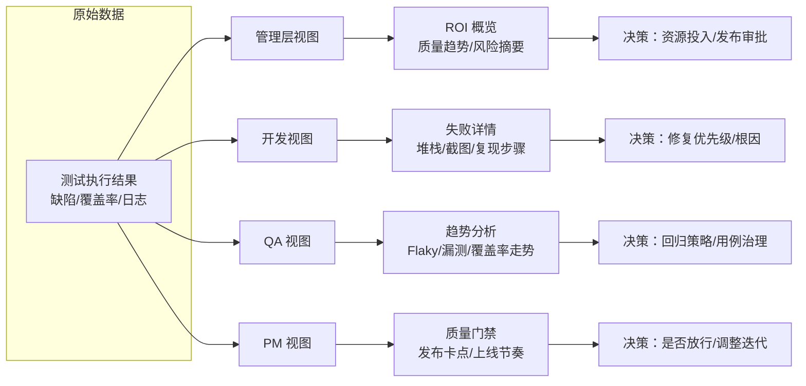
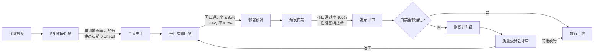

# 测试报告与团队影响力

测试报告是测试团队对外输出的最重要产物之一，但很多团队的报告仍停留在"通过 N 条、失败 M 条"的列表阶段，既无法支撑管理层的资源决策，也无法驱动开发快速定位缺陷，更难以证明测试团队自身的价值。2024-2026 年间，随着 ReportPortal、Allure TestOps、Grafana 测试看板的普及，以及 AI 报告分析、实时大屏、质量门禁的兴起，测试报告已经从"事后归档"演化为"实时驱动质量改进的核心数据资产"。本文系统讲解测试报告的受众差异化、核心指标体系、工具链选型、实时大屏、AI 分析与团队影响力构建路径，并给出可直接落地的模板与最佳实践。

## 一、核心概念

### 1.1 测试报告的真正价值

测试报告的价值不在"记录发生了什么"，而在"驱动下一步动作"。一份合格的测试报告应当同时回答四个问题：

- **质量是否可发布**：当前版本的健康度是否满足发布门禁？
- **风险在哪里**：哪些模块、哪些接口、哪些场景是当前最薄弱的环节？
- **趋势是变好还是变差**：相比上周/上月/上个迭代，质量是改善还是劣化？
- **投入产出比如何**：测试团队这一阶段的执行量、自动化率、缺陷拦截率是否对得起资源消耗？

如果一份报告只回答了第一个问题，它本质上只是"红绿灯"；只有同时回答后三个问题，测试报告才能真正成为团队影响力杠杆。

### 1.2 为什么需要受众差异化

测试报告的受众天然分裂：管理层关注 ROI 与风险概览，开发关注失败详情与定位线索，QA 关注趋势与漏测，PM 关注质量门禁与上线节奏。把同一份全量报告塞给所有人，结果是：管理层看不懂、开发嫌冗长、QA 觉得不够深、PM 觉得不够 actionable。受众差异化不是"美化排版"，而是基于角色关注点重新组织信息密度与决策路径，让每个角色在 30 秒内拿到能决策的信息。

## 二、测试报告核心指标体系

### 2.1 五类核心指标

| 指标类别 | 关键指标 | 含义与用途 |
|---------|---------|-----------|
| 覆盖率 | 代码覆盖率 / 需求覆盖率 / 接口覆盖率 | 衡量测试广度，识别未覆盖风险点 |
| 通过率 | 通过率 / 失败率 / 阻塞率 | 反映当前版本健康度 |
| 稳定性 | Flaky 率 / 重跑成功率 | 衡量用例可信度，Flaky 率 > 5% 必须治理 |
| 缺陷质量 | 缺陷密度 / 逃逸率 / 重新打开率 | 反映测试有效性与开发质量 |
| 效率 | 执行时长 / 并行度 / MTTR | 衡量测试效率与缺陷修复响应速度 |

### 2.2 指标定义口径

- **缺陷密度** = 缺陷数 / 千行代码（KLOC），用于跨模块横向对比，密度高于均值 2 倍的模块需重点评审。
- **缺陷逃逸率** = 线上缺陷数 / (线上缺陷数 + 测试阶段缺陷数)，是衡量测试有效性的金标准，行业标杆 < 5%。
- **MTTR（Mean Time To Repair）** = 缺陷从创建到关闭的平均时长，反映开发修复响应速度与回归效率。
- **Flaky 率** = 同一用例在相同代码版本下多次执行结果不一致的比例，是自动化可信度的核心信号。

### 2.3 指标分层与告警阈值

指标应当分层管理，每层设定明确告警阈值，触发后自动通知对应角色：

```yaml
# 指标告警阈值配置示例
metrics_alert:
  coverage:
    code_coverage: { warn: 70%, block: 60% }   # 代码覆盖率：警告 70%，阻断 60%
    api_coverage: { warn: 85%, block: 75% }     # 接口覆盖率
  stability:
    pass_rate: { warn: 95%, block: 90% }        # 通过率
    flaky_rate: { warn: 3%, block: 5% }         # Flaky 率
  defect:
    escape_rate: { warn: 5%, block: 8% }        # 逃逸率
    reopen_rate: { warn: 10%, block: 15% }      # 重新打开率
  efficiency:
    mttr_hours: { warn: 24, block: 48 }         # MTTR（小时）
    parallelism: { warn: 4, block: 2 }          # 并行度
```

## 三、受众差异化报告

### 3.1 受众差异化模型

测试报告的受众差异化核心在于"信息密度 × 决策路径"的重新组合。下图展示四种角色的关注点与报告形态映射：



### 3.2 四种角色视图设计

**管理层视图（ROI 概览）**

- 一页纸：质量健康度评分（0-100）、关键趋势图（通过率/逃逸率/MTTR）、Top3 风险模块；
- 突出投入产出比：本迭代自动化执行次数节省的人力、拦截的缺陷数；
- 避免技术细节，所有指标必须翻译为"业务影响"。

**开发视图（失败详情）**

- 失败用例的完整堆栈、断言差异、请求/响应、截图、视频；
- 与代码提交关联：失败用例 → 触发 commit → 责任人；
- 一键复现：提供容器化复现命令或 IDE 调试配置。

**QA 视图（趋势分析）**

- 多版本趋势曲线：覆盖率、Flaky 率、缺陷密度、逃逸率；
- 漏测分析：线上缺陷回溯到测试用例缺失点；
- 用例健康度：长期未执行的用例、长期失败的用例、冗余用例识别。

**PM 视图（质量门禁）**

- 发布卡点清单：门禁指标达成情况、未达成项的处理方案；
- 上线节奏可视化：历次发布的质量趋势，识别"赶版本"导致的质量滑坡；
- 风险摘要：本版本未关闭的高优先级缺陷列表与影响范围。

## 四、报告工具链

### 4.1 主流工具对比

| 工具 | 定位 | 优势 | 劣势 |
|------|------|------|------|
| Allure Report | 单次执行报告 | 美观、生态成熟、多语言 SDK | 不擅长长期趋势分析 |
| Allure TestOps | 测试管理 + 报告 | 趋势、用例管理、CI 集成 | 商业付费 |
| ReportPortal | 实时报告 + AI 分析 | 实时收集、AI 分类、缺陷聚合 | 部署较重，学习成本中等 |
| Grafana | 通用看板 | 灵活、可与 Prometheus/ES 联动 | 需自行接入数据源 |
| 自研平台 | 全链路定制 | 深度贴合业务、可植入业务指标 | 研发成本高、易沦为"玩具" |

### 4.2 Allure 注解示例

Allure 通过注解为报告注入元数据，是受众差异化的基础。开发视图依赖这些元数据快速定位：

```java
// Allure 注解示例（Java + JUnit5）
@Epic("订单交易")                     // 一级业务模块
@Feature("下单流程")                   // 二级功能
@Story("优惠券抵扣")                   // 三级故事
@Severity(SeverityLevel.CRITICAL)      // 严重级别：CRITICAL
@Issue("TRADE-2024")                  // 关联缺陷号
@TmsLink("CASE-1024")                 // 关联用例管理 ID
@Owner("张三")                         // 责任人
@Tags(@Tag("regression"))             // 回归标签
@Test
void testCouponDeduct() {
    Allure.step("构造订单：金额 100 元，优惠券 20 元", () -> {
        Order order = OrderBuilder.amount(100).coupon(20).build();
        assertThat(order.getPayable()).isEqualTo(80);
    });
    Allure.attachment("请求体", "application/json", requestBody);  // 附加请求体
    Allure.attachment("响应截图", new FileInputStream(new File("screenshots/resp.png")));  // 附加截图
}
```

### 4.3 工具链组合建议

- **小团队 / 单项目**：Allure Report + Jenkins 插件即可，零运维成本；
- **多业务线 / 中型团队**：ReportPortal 作为统一收集层 + Grafana 趋势看板；
- **大型组织**：自研平台 + ReportPortal AI 分析 + Grafana 大屏，三者解耦，各司其职。

## 五、实时报告与大屏

### 5.1 ReportPortal 实时收集

ReportPortal 的核心价值是"用例执行过程中实时上报"，无需等待整轮执行结束。其 gRPC/REST 上报接口可在用例级别推送：

```python
# ReportPortal 实时上报示例（Python + pytest-reportportal）
def test_login(api_client, rp_logger):
    # 用例开始时自动上报（由插件完成）
    response = api_client.login(user="test", password="123456")
    assert response.status_code == 200
    # 主动附加诊断信息，开发视图立即可见
    with open("har/login.har", "rb") as f:
        rp_logger.attach(file=f, name="登录请求 HAR", mime="application/json")
```

实时性带来的最大改变是：开发可以在测试尚未结束时就开始定位失败用例，MTTR 平均缩短 30%-50%。

### 5.2 Grafana 测试看板

Grafana 适合做长期趋势与跨团队对比看板。测试结果通过 Prometheus 或 ClickHouse 接入，Dashboard JSON 可版本化管理：

```json
{
  "title": "测试质量大屏",
  "panels": [
    {
      "title": "通过率趋势（30 天）",
      "type": "timeseries",
      "datasource": "Prometheus",
      "targets": [
        {
          "expr": "test_pass_rate{team=\"$team\"}",
          "legend": "{{team}} 通过率"
        }
      ],
      "fieldConfig": {
        "defaults": {
          "thresholds": {
            "steps": [
              { "value": 0, "color": "red" },
              { "value": 0.9, "color": "yellow" },
              { "value": 0.95, "color": "green" }
            ]
          }
        }
      }
    },
    {
      "title": "缺陷逃逸率（按团队）",
      "type": "bargauge",
      "targets": [
        { "expr": "defect_escape_rate{team=\"$team\"}" }
      ]
    }
  ],
  "templating": {
    "list": [
      {
        "name": "team",
        "type": "query",
        "datasource": "Prometheus",
        "query": "label_values(test_pass_rate, team)"
      }
    ]
  }
}
```

### 5.3 团队可视化大屏

大屏不是"炫技"，而是"凝聚共识"。建议在研发区悬挂一块 4K 屏，轮播三类内容：

1. **当日实时看板**：当前正在执行的测试轮次、实时通过率、失败用例 Top5；
2. **周趋势看板**：覆盖率、Flaky 率、逃逸率、MTTR 四条曲线；
3. **质量红黑榜**：模块质量排名、缺陷修复响应排名（注意：红榜为主，黑榜慎用，避免对立）。

大屏的隐性价值是让"质量"成为团队默认的对话背景，而非季度回顾时才被想起的话题。

## 六、AI 报告分析

### 6.1 失败原因 AI 分类

传统报告里，失败用例需要 QA 人工分类为"产品缺陷 / 脚本缺陷 / 环境问题 / 数据问题 / Flaky"。ReportPortal 内置的 Auto-Analysis 利用历史失败特征（堆栈指纹、错误模式、用例标签）做自动分类，准确率在成熟团队可达 80%+。自研平台可基于 LLM 做更深的语义分析：

```python
# 基于 LLM 的失败原因分类示例（伪代码）
def classify_failure_with_llm(test_case, failure_log):
    prompt = f"""
    你是测试失败分析专家。请根据以下信息分类失败原因，
    类别仅限：product_defect / script_defect / env_issue / data_issue / flaky。
    
    用例：{test_case.name}
    模块：{test_case.module}
    错误堆栈：{failure_log.stacktrace[-2000:]}
    断言差异：{failure_log.assertion_diff}
    
    输出 JSON：{{"category": "...", "confidence": 0.0-1.0, "reason": "..."}}
    """
    result = llm.complete(prompt)
    return parse_json(result)
```

### 6.2 趋势预测

基于历史 6-12 个月的指标数据，可构建简单时序模型预测下一迭代的逃逸率、Flaky 率趋势，提前预警。预测的精度不需要太高，重点是"方向性"——只要能告诉团队"按当前趋势，下个迭代 Flaky 率将突破 5% 红线"，就足以触发治理动作。

### 6.3 智能推荐

AI 分析的最终形态是 actionable recommendation，而非仅仅是分类：

- 检测到某模块连续 3 个迭代缺陷密度上升 → 推荐进行架构评审；
- 检测到某用例 Flaky 率 > 20% → 推荐隔离或下线，并附上历史 Flaky 时段；
- 检测到覆盖率下降且对应模块新增代码量上升 → 推荐补充用例并指派责任人。

## 七、测试报告与团队影响力

### 7.1 数据驱动质量改进

测试报告的影响力起点是"用数据说话"。每月/每季基于报告数据发起一次质量改进专项，例如：Flaky 率从 8% 治理到 2%、API 覆盖率从 70% 提升到 90%、MTTR 从 48 小时压缩到 12 小时。每一个专项都要有"基线 → 目标 → 行动 → 复盘"四段式记录，并在下一次报告中呈现改进曲线。这种"看得见的改进"是测试团队最有力的影响力证据。

### 7.2 质量月报与季报

质量月报是测试团队对外的"产品发布"。建议固定模板：

```markdown
# 2026 年 7 月质量月报

## 一、关键指标摘要
| 指标 | 本月 | 上月 | 趋势 |
|------|------|------|------|
| 通过率 | 96.8% | 95.2% | ↑ |
| Flaky 率 | 2.1% | 3.4% | ↓ |
| 缺陷逃逸率 | 3.2% | 4.1% | ↓ |
| MTTR（小时） | 14 | 22 | ↓ |

## 二、本月质量亮点
- 订单模块缺陷密度下降 40%，得益于架构重构后单测覆盖提升
- API 自动化用例新增 320 条，覆盖率达 92%

## 三、风险预警
- 支付模块 Flaky 率上升至 6.5%，已立项治理
- 三方依赖服务响应时间增长 30%，可能影响压测结论

## 四、下月改进计划
- 完成 Flaky 治理专项：目标 Flaky 率 < 3%
- 启动代码覆盖率门禁：新代码覆盖率 ≥ 80%

## 五、投入产出
- 自动化执行 12,480 次，节省回归人力约 320 人天
- 测试阶段拦截缺陷 186 个，避免线上事故约 9 起
```

### 7.3 质量门禁与发布卡点

质量门禁是测试报告从"建议"变为"约束"的关键机制。下图展示质量门禁在发布流程中的卡点位置：



门禁的核心原则：

- **可量化**：每个卡点必须有明确的数值阈值，禁止"感觉不行"；
- **可阻断**：门禁失败必须真正阻断发布，否则形同虚设；
- **可升级**：特批放行需走质量委员会评审，留痕且定期复盘；
- **可演化**：阈值随团队成熟度提升而逐步收紧，避免一开始设过高导致集体抵触。

### 7.4 与 OKR/KPI 结合

测试报告的指标应当直接对接团队 OKR，避免"报告归报告、考核归考核"的两张皮现象。典型 OKR 映射：

- **O1：提升测试有效性**
  - KR1：缺陷逃逸率从 6% 降至 3%
  - KR2：高优先级缺陷 MTTR 从 24h 降至 8h
- **O2：提升测试效率**
  - KR1：自动化回归执行时长从 4h 压缩至 1h
  - KR2：Flaky 率从 8% 治理至 2%
- **O3：提升质量透明度**
  - KR1：月报关键指标完整度 100%
  - KR2：管理层质量评审会议月度覆盖率 100%

OKR 的进度数据直接从测试报告系统取数，避免人工填报，确保客观性。

## 八、常见陷阱与最佳实践

### 8.1 常见陷阱

- **报告大而全**：把所有指标塞进一份报告，导致没人看。应坚持受众差异化，每份报告只服务一类角色。
- **指标口径不一致**：不同团队对"通过率""Flaky 率"定义不同，跨团队对比失真。应在组织层面统一指标字典。
- **门禁形同虚设**：门禁失败仍可"一键放行"，长期下去门禁失去公信力。放行必须留痕并定期复盘。
- **只看绝对值不看趋势**：通过率 95% 单看是不错的，但如果上个月是 99%，就是劣化信号。趋势比绝对值更重要。
- **大屏沦为摆设**：大屏长期不更新或指标无人关注，反而成为"质量形式主义"的反面教材。
- **AI 分析盲目信任**：LLM 分类有幻觉风险，必须保留人工复核通道，且定期抽样校准准确率。

### 8.2 最佳实践

- **统一指标字典**：在组织级文档中明确每个指标的定义、口径、采集方式、责任人，作为唯一事实来源。
- **报告版本化**：Dashboard JSON、月报模板、告警阈值都纳入 Git 管理，变更可追溯。
- **报告 SLA 化**：月报在每月 3 号前发布，周报在每周一上午 10 点前发布，培养团队预期。
- **失败用例闭环**：每条失败用例必须有"分类 → 责任人 → 修复 → 验证 → 关闭"闭环，杜绝"失败用例无人认领"。
- **数据驱动复盘**：每个迭代复盘基于报告数据，而非"我觉得"——让数据成为质量对话的通用语言。
- **渐进式推广**：质量门禁从单团队试点，验证有效性后再推广到全组织，避免"一刀切"引发的抵触。

## 结语

测试报告的本质是"把测试过程数据化为团队可决策的信息资产"。当报告能精准服务四类受众、指标体系自洽且与 OKR 对齐、实时大屏让质量可见、AI 分析让定位更准、质量门禁让数据有约束力时，测试团队就不再是"找 Bug 的成本中心"，而是"用数据驱动质量决策的影响力中心"。2024-2026 年的工具链（ReportPortal、Grafana、Allure TestOps、LLM 分析）已经把基础设施铺好，剩下的差距在于团队是否愿意把"做报告"从例行公事升级为战略动作。
