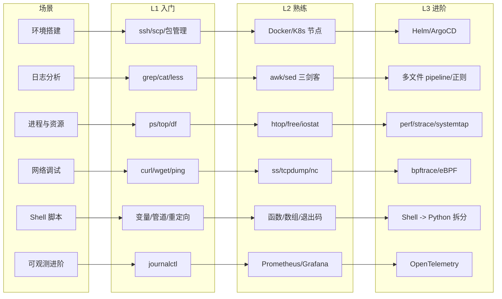
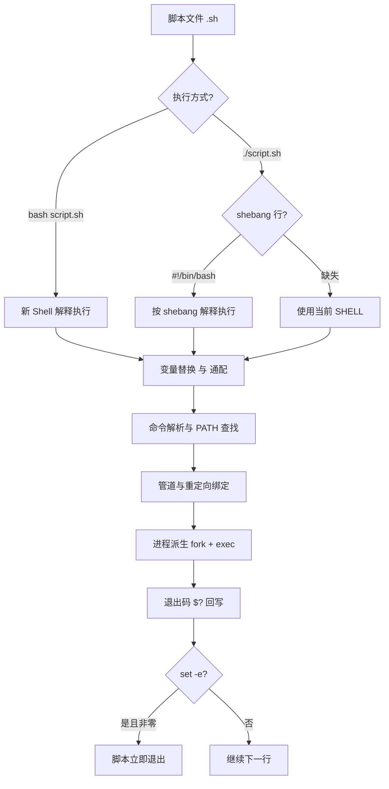

# Linux 与 Shell 测试开发必备

测试开发工程师的日常几乎绕不开 Linux：环境部署、日志排查、性能定位、CI 脚本、容器调试、网络抓包，每一步都需要在 Shell 中完成。本文不再讲"Linux 入门"，而是从测试开发的真实场景出发，系统梳理 2024-2026 主流工具链下的 Linux/Shell 技能矩阵、实战命令与脚本范式，并给出 Shell 与 Python 的协作边界。

## 一、核心概念

### 1.1 测试开发为什么必须掌握 Linux/Shell

GUI 自动化适合测试 GUI 本身，而真正用于环境治理、流水线编排、数据准备、缺陷定位的工作，绝大多数落在 Shell 上。原因有四：

- **服务器侧能力**：被测系统通常部署在 Linux 节点（裸机、VM、容器、K8s Pod），日志、进程、网络、磁盘等观测点都在 Linux 内；
- **CI/CD 原生语言**：Jenkins Pipeline、GitHub Actions、GitLab CI、Argo Workflows 的步骤本质都是 Shell 片段；
- **可编程黏合剂**：Shell 把 `curl`、`jq`、`ps`、`grep` 等原子命令组合成数据分析流水线，是数据处理最快原型工具；
- **远程与无头场景**：压测、混沌实验、性能采样通常在无 GUI 的远程节点执行，Shell 是唯一交互通道。

### 1.2 测试开发 Linux 技能矩阵

下图按"场景 × 工具深度"给出测试开发所需的 Linux/Shell 技能矩阵，可作为自评与团队培训的参考：



## 二、环境搭建

### 2.1 SSH 与基础配置

测试节点通常通过 SSH 访问，推荐使用密钥登录并关闭密码登录。批量管理多节点时使用 `~/.ssh/config` 别名，避免记忆长串 IP。

```bash
# 生成 ed25519 密钥（比 RSA 更短更安全）
ssh-keygen -t ed25519 -C "qa@company.com" -f ~/.ssh/id_ed25519_qa

# ~/.ssh/config 配置节点别名
# Host prod-node-01
#     HostName 10.0.1.21
#     User qa
#     IdentityFile ~/.ssh/id_ed25519_qa
#     ServerAliveInterval 60

# 一键分发公钥到目标节点
ssh-copy-id -i ~/.ssh/id_ed25519_qa.pub qa@10.0.1.21

# 免密登录
ssh prod-node-01
```

### 2.2 包管理、时区与防火墙

测试节点初始化时需统一时区（否则日志时间错位）、配置 NTP、关闭冲突防火墙：

```bash
# Ubuntu/Debian
apt update && apt install -y vim curl wget jq ca-certificates tzdata
# CentOS/RHEL
yum install -y vim curl wget jq tzdata

# 统一时区为上海
timedatectl set-timezone Asia/Shanghai
timedatectl set-ntp true

# 防火墙放行测试所需端口（firewalld 示例）
firewall-cmd --permanent --add-port=8080/tcp   # 测试平台 API
firewall-cmd --permanent --add-port=9090/tcp   # Prometheus
firewall-cmd --reload
```

### 2.3 Docker 与 K8s 节点最小化配置

测试执行器普遍容器化，节点需预装 containerd + Docker CLI + kubectl + helm：

```bash
# 安装 containerd（K8s 1.24+ 默认运行时）
apt install -y containerd
containerd config default > /etc/containerd/config.toml
# 修改 config.toml：SystemdCgroup = true，与 K8s 一致
systemctl restart containerd && systemctl enable containerd

# 安装 Docker（用于本地镜像构建）
curl -fsSL https://get.docker.com | bash
systemctl enable --now docker

# 安装 kubectl 与 helm
curl -LO "https://dl.k8s.io/release/$(curl -sL https://dl.k8s.io/release/stable.txt)/bin/linux/amd64/kubectl"
install -o root -g root -m 0755 kubectl /usr/local/bin/kubectl
curl https://raw.githubusercontent.com/helm/helm/main/scripts/get-helm-3 | bash

# 验证
kubectl version --client && helm version
```

## 三、日志分析三剑客

### 3.1 grep：定位

`grep` 负责正则匹配与过滤，是日志排查的入口。常用参数：`-i` 忽略大小写、`-v` 反向、`-n` 显示行号、`-E` 扩展正则、`-A/-B/-C` 上下文。

```bash
# 在 11-Nginx基础概述 日志中查找 5xx 错误，并显示后 3 行上下文
grep -E " 5[0-9]{2} " /var/log/11-Nginx基础概述/access.log -A 3

# 排除健康检查流量后统计错误数
grep -v "/healthcheck" /var/log/11-Nginx基础概述/access.log | grep -cE " 5[0-9]{2} "

# 同时匹配多个关键词
grep -E "ERROR|FATAL|panic" app.log
```

### 3.2 awk：切片与统计

`awk` 是一门迷你语言，内置 `NR`（行号）、`NF`（字段数）、`$1`（第一列）等变量，擅长做字段提取与聚合统计。

```bash
# 提取 11-Nginx基础概述 日志中第 9 列（HTTP 状态码），统计每个状态码出现次数
awk '{print $9}' /var/log/11-Nginx基础概述/access.log | sort | uniq -c | sort -rn

# 收集每个接口的耗时样本（假设 $7 是路径、最后一列是耗时）
awk '{path=$7; t=$NF; arr[path]=arr[path] t ","} END {for (p in arr) print p, arr[p]}' access.log

# 计算 access.log 中第 10 列（body_bytes_sent）总和
awk '{sum+=$10} END {print "总流量:", sum, "字节"}' access.log
```

### 3.3 sed：流式编辑

`sed` 用于行级查找替换，`-i` 直接修改源文件，`s/old/new/g` 是最常用模式。

```bash
# 批量把配置文件中的 dev 环境改为 staging
sed -i 's/env=dev/env=staging/g' /etc/app/config.ini

# 删除配置文件中的空行与注释行
sed -i '/^$/d; /^#/d' /etc/app/app.conf

# 在第 5 行后插入一行
sed -i '5a \export JAVA_HOME=/opt/jdk-21' /etc/profile
```

### 3.4 实战：定位一条失败用例

三剑客常与管道组合，形成"过滤 → 切片 → 改写"流水线。下面是定位一条接口测试用例失败的典型命令链：

```bash
# 1. 在 app.log 中过滤出 trace_id=abc123 的所有日志
# 2. 只保留时间与消息两列
# 3. 把 ERROR 标记替换为 [失败]
grep "trace_id=abc123" /var/log/app/app.log \
  | awk '{print $1, $2, $NF}' \
  | sed 's/ERROR/[失败]/g'
```

### 3.5 less 与 tail -f：实时与回溯

`less` 适合回溯大文件，支持 `/` 搜索、`F` 进入 follow 模式；`tail -f` 适合实时盯日志，配合 `grep` 过滤关键事件。

```bash
# 实时跟踪日志，仅显示 ERROR 与 WARN
tail -f /var/log/app/app.log | grep --line-buffered -E "ERROR|WARN"

# less 中常用快捷键：
#   /pattern  向下搜索
#   ?pattern  向上搜索
#   F         进入 follow 模式（等同 tail -f）
#   G         跳到末尾
#   g         跳到开头
```

## 四、进程与资源管理

### 4.1 ps 与 systemctl：进程与服务

```bash
# 查看某服务的所有进程
ps -ef | grep -E "java|pytest" | grep -v grep

# 按内存排序的前 10 个进程
ps aux --sort=-%mem | head -n 10

# systemd 服务管理（测试平台常用）
systemctl status test-platform-api
systemctl restart test-platform-api
systemctl enable test-platform-api      # 开机自启
journalctl -u test-platform-api -f      # 实时查看服务日志
```

### 4.2 top / htop / free / iostat：资源画像

```bash
# top 交互式查看，按 M 按内存排序、按 P 按 CPU 排序、按 1 显示每核
top -c

# htop 更友好，支持鼠标与颜色
htop

# 内存：关注 available 而非 free（buffer/cache 可回收）
free -h

# 磁盘 I/O：await 高说明磁盘瓶颈
iostat -xz 1

# 磁盘空间
df -hT | grep -v tmpfs
du -sh /var/log/* | sort -rh | head      # 找出最占空间的日志目录
```

### 4.3 kill 与信号

```bash
kill -TERM <pid>      # 优雅退出（SIGTERM）
kill -9 <pid>         # 强制杀死（SIGKILL，慎用，可能丢数据）
pkill -f "pytest"     # 按命令名批量杀
killall -9 java       # 杀掉所有 java 进程（生产慎用）
```

## 五、网络调试

### 5.1 curl：API 测试主力

```bash
# 发送 GET 并打印状态码与耗时
curl -s -o /dev/null -w "状态码: %{http_code}\n耗时: %{time_total}s\n" \
     https://api.example.com/users

# 带 JSON 的 POST，附带鉴权头
curl -X POST https://api.example.com/users \
     -H "Authorization: Bearer $TOKEN" \
     -H "Content-Type: application/json" \
     -d '{"name":"qa","role":"tester"}'

# 仅打印响应头，用于调试 301/302
curl -I https://example.com

# 跟随重定向并打印最终 URL
curl -Lso /dev/null -w "%{url_effective}\n" https://t.co/abc
```

### 5.2 netstat / ss：端口与连接

`ss` 是 `netstat` 的现代替代，速度更快、信息更全。

```bash
# 查看所有监听端口及对应进程
ss -tlnp

# 查看某端口的已建立连接数（压测时常用）
ss -tn state established '( sport = :8080 )' | wc -l

# TIME_WAIT 堆积排查
ss -tn state time-wait | wc -l
```

### 5.3 tcpdump 与 nc：抓包与端口探测

```bash
# 抓取 8080 端口的 HTTP 请求，前 100 个包，写入文件供 Wireshark 分析
tcpdump -i any -nn -A -s 0 'tcp port 8080' -c 100 -w /tmp/api.pcap

# 实时打印 HTTP 请求行与响应行
tcpdump -i any -nn -A -s 0 'tcp port 8080 and (tcp[((tcp[12:1] & 0xf0) >> 2):4] = 0x47455420 \
  or tcp[((tcp[12:1] & 0xf0) >> 2):4] = 0x504f5354)' 2>/dev/null

# nc 探测端口连通性（比 telnet 更轻量）
nc -zv 10.0.1.21 8080

# nc 模拟简易 TCP 服务，用于 Mock
nc -lk 9090
```

## 六、Shell 脚本实战

### 6.1 脚本执行流程

Shell 脚本本质是一串被解释执行的命令，理解其执行流程有助于规避常见陷阱：



### 6.2 自动化部署脚本

```bash
#!/bin/bash
# deploy.sh：拉取镜像、滚动重启、健康检查
set -euo pipefail

IMAGE="${1:?用法: deploy.sh <image:tag>}"
SVC="test-platform-api"
HEALTH_URL="http://localhost:8080/healthcheck"

echo ">>> 拉取镜像 $IMAGE"
docker pull "$IMAGE"

echo ">>> 滚动重启 $SVC"
kubectl set image deployment/"$SVC" app="$IMAGE" -n qa
kubectl rollout status deployment/"$SVC" -n qa --timeout=180s

echo ">>> 健康检查"
for i in {1..30}; do
  code=$(curl -s -o /dev/null -w "%{http_code}" "$HEALTH_URL" || echo "000")
  if [[ "$code" == "200" ]]; then
    echo "部署成功"; exit 0
  fi
  sleep 2
done
echo "健康检查失败" >&2; exit 1
```

### 6.3 数据处理脚本

```bash
#!/bin/bash
# analyze.sh：统计压测结果中各接口 P95 耗时
set -euo pipefail

RESULT_FILE="${1:?用法: analyze.sh <result.csv>}"

# 表头：timestamp,api,latency_ms
awk -F, '
NR > 1 {
    lat[$2] = lat[$2] " " $3          # 收集每个接口的耗时
}
END {
    for (api in lat) {
        n = split(lat[api], arr, " ")
        # 简易冒泡排序求 P95
        for (i = 1; i <= n; i++)
            for (j = i + 1; j <= n; j++)
                if (arr[i] > arr[j]) { t = arr[i]; arr[i] = arr[j]; arr[j] = t }
        idx = int(n * 0.95)
        if (idx < 1) idx = 1
        printf "%-30s P95=%sms 样本=%d\n", api, arr[idx], n
    }
}' "$RESULT_FILE"
```

### 6.4 CI 脚本片段

```bash
#!/bin/bash
# ci-test.sh：GitLab CI / Jenkins shell 步骤通用模板
set -euo pipefail

echo ">>> 安装依赖"
pip install -r requirements.txt -q

echo ">>> 静态检查"
ruff check . || exit 1

echo ">>> 单元测试 + 覆盖率"
pytest --junitxml=report.xml --cov=app --cov-report=xml || exit 1

echo ">>> 上传覆盖率"
# codecov bash 上传器已下线，使用官方 uploader 二进制
curl -Os https://uploader.codecov.io/latest/linux/codecov
chmod +x codecov
./codecov -f coverage.xml || true
```

### 6.5 Shell 与 Python 的边界

| 判断维度 | 用 Shell | 用 Python |
|----------|----------|-----------|
| 命令编排 | 调用 `curl/kubectl/docker` 组合 | 需要复杂逻辑、循环嵌套 |
| 数据规模 | 文本管道、行级处理 | 大数据、需结构化数据结构 |
| 字符串处理 | 简单 `awk/sed/grep` | 正则复杂、需 Unicode、JSON 解析 |
| 错误处理 | `set -e` + 退出码 | try/except + 自定义异常 |
| 跨平台 | 依赖 coreutils | 一致性更好 |
| 维护周期 | 一次性脚本、CI 片段 | 长期维护的工程化工具 |

**经验法则**：脚本超过 100 行、出现嵌套循环、需要解析 JSON/CSV 多次，就应迁移到 Python。Shell 适合做"胶水"，Python 适合做"业务"。

## 七、2024-2026 新趋势

### 7.1 eBPF：内核级可观测

eBPF 让用户在不修改内核、不重启进程的前提下，在内核态运行探针，对测试开发的价值在于：无需埋点即可观测全链路 HTTP 调用、慢查询、文件 IO。

```bash
# 安装 bcc 工具集
apt install -y bpftrace bcc-tools

# 列出所有建立 TCP 连接的进程（替代 netstat 的实时版）
bpftrace -e 'tracepoint:syscalls:sys_enter_connect { printf("%s -> %s\n", comm, ntop(args->uservaddr)); }'

# bcc 自带工具：追踪 TCP 连接生命周期与传输耗时（无需修改业务代码）
/usr/share/bcc/tools/tcplife -p "$(pidof java)"
```

### 7.2 Containerd 与 K8s 常用命令

```bash
# containerd 原生命令 ctr / nerdctl
ctr -n k8s.io images list | grep test-platform
nerdctl --namespace k8s.io ps -a

# K8s 排查：Pod 状态、日志、临时调试容器
kubectl get pods -n qa -o wide
kubectl logs -f deployment/test-platform-api -n qa --tail=200
kubectl exec -it pod/app-xxx -- /bin/sh
kubectl debug -it pod/app-xxx --image=busybox --target=app   # 1.25+ 临时容器

# 描述节点资源
kubectl describe node node-01 | grep -A 5 "Allocated"
kubectl top pod -n qa --sort-by=cpu
```

### 7.3 AI 辅助 Shell

2024-2026 的趋势是用 AI 解释与生成 Shell：把一段 `awk`/`tcpdump` 命令贴给 AI 解释，或用自然语言生成复杂管道。但需注意：

- AI 生成的命令必须人工校验，尤其 `rm`、`kubectl delete`、`docker rm` 等破坏性命令；
- 复杂 `awk`/`sed` 在不同 GNU/BSD 版本间行为有差异，AI 不一定考虑跨平台；
- 推荐 `tldr`、`cheat`、`fig`（Amazon Q CLI 前身）等工具作为速查补充，而非替代理解。

## 八、常见陷阱与最佳实践

### 陷阱

1. **`kill -9` 滥用**：跳过优雅退出，导致服务来不及清理资源、日志截断、端口残留 TIME_WAIT。
2. **`set -e` 与管道组合**：`set -e` 不会捕获管道中间命令的失败，需配 `set -o pipefail` 才有效。
3. **`rm -rf $VAR/*`**：变量为空时变成 `rm -rf /*`，必须加引号或前置校验。
4. **`shellcheck` 缺失**：脚本不经过静态检查直接上线，`SC2086`（未加引号变量）类缺陷频发。
5. **跨平台命令差异**：Mac 自带 BSD `sed`/`awk` 与 Linux GNU 版本参数不兼容，CI 在 Mac runner 上失败。
6. **日志权限**：用 root 跑测试程序，日志文件属主变成 root，后续普通用户无法读取。
7. **`tail -f` 不刷新**：管道后接 `grep` 未加 `--line-buffered`，导致日志不实时显示。

### 最佳实践

1. **脚本头部固定三件套**：`#!/bin/bash` + `set -euo pipefail` + 关键变量校验。
2. **静态检查纳入 CI**：`shellcheck` 与 `shfmt` 作为流水线必过门槛，强制统一风格。
3. **幂等设计**：部署、清理脚本必须可重复执行，用 `mkdir -p`、`rm -f`、`|| true` 等保证幂等。
4. **退出码语义化**：自定义退出码区间（如 sysexits.h 约定的 64-78），便于上游 CI 判断失败类型。
5. **日志分级与采集**：脚本日志输出到 stderr，结构化数据输出到 stdout，便于被 Loki/Fluentd 采集。
6. **密钥不入脚本**：使用 `kubectl secret`、Vault、云 KMS 注入，避免 `TOKEN=xxx` 硬编码被 Git 提交。
7. **跨平台兼容**：在 Mac 与 Linux 间复用的脚本，优先 `gawk`/`gsed`，或用 Python 重写关键逻辑。

## 结语

Linux/Shell 是测试开发的"地基"：技能矩阵中 L1 解决日常 80% 问题，L2 让你能在 CI 与容器化场景下高效工作，L3 的 eBPF 与 OpenTelemetry 则是面向复杂分布式系统的进阶武器。掌握 Shell 的关键不是背命令，而是理解"管道 + 重定向 + 退出码 + 进程派生"这套底层模型，并在合适的场景把脚本迁移到 Python，让两类工具各司其职。
