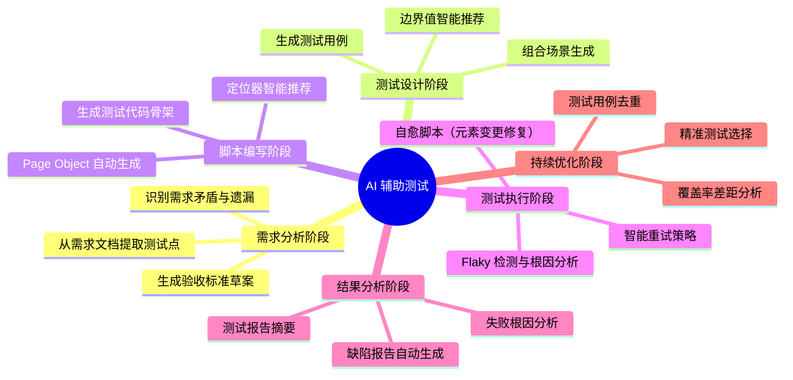
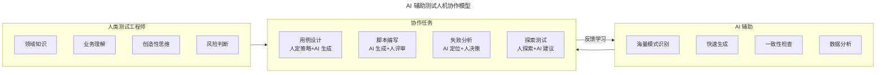
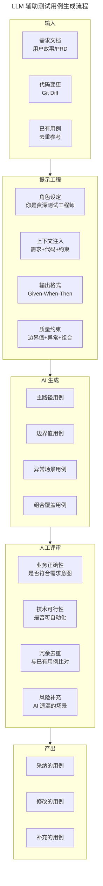
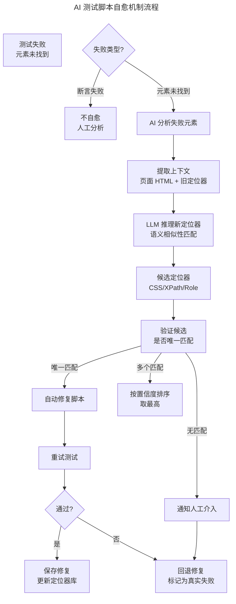
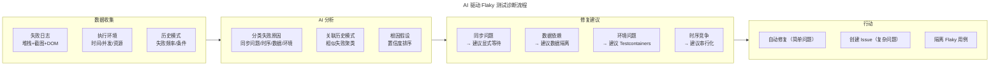

# AI 辅助测试（LLM 生成用例/Copilot for Tests）

## 一、模块介绍

**AI 辅助测试**是 2024-2026 年软件测试领域最显著的演进方向。以 **大语言模型**（Large Language Model，LLM）为核心的 AI 能力正在重塑测试活动的各个环节：从需求分析到用例生成、从脚本编写到缺陷定位、从 Flaky 治理到自愈脚本。

**Copilot for Tests** 是这一趋势的代表性概念——AI 作为测试工程师的"副驾驶"（Copilot），不替代人类决策，而是辅助人类完成重复性高、创造性低的工作，让测试工程师聚焦于策略设计与探索式测试。本文系统阐述 AI 辅助测试的能力地图、LLM 在各测试环节的应用实践、工具生态，以及当前局限与风险。

## 二、核心方法论

### 2.1 AI 辅助测试能力地图



### 2.2 LLM 在测试中的三种应用模式

| 模式 | 说明 | 典型场景 | 人工参与 |
| --- | --- | --- | --- |
| **生成式**（Generative） | AI 从零生成测试制品 | 生成用例、生成脚本 | 评审与修改 |
| **分析式**（Analytical） | AI 分析现有制品并给出洞察 | 失败分析、覆盖率分析 | 决策与执行 |
| **对话式**（Conversational） | AI 作为测试顾问回答问题 | 测试策略咨询、工具选择 | 提问与引导 |

### 2.3 人机协作模型



**核心原则**：AI 的输出是**草案**而非终稿，人类测试工程师始终保有最终决策权。

## 三、关键流程

### 3.1 LLM 生成测试用例流程



### 3.2 测试脚本自愈机制



### 3.3 Flaky 测试 AI 诊断



## 四、工具与实践

### 4.1 LLM 用例生成 Prompt 工程

```python
"""
使用 LLM 生成测试用例的 Prompt 工程实践
"""
import openai

SYSTEM_PROMPT = """你是一位资深测试工程师，擅长设计全面、专业的测试用例。

你的测试设计遵循以下原则：
1. 覆盖正常路径、边界值、异常场景
2. 遵循等价类划分与边界值分析方法
3. 考虑并发、时序、数据依赖等非功能场景
4. 输出格式为 Gherkin（Given-When-Then）

约束：
- 每个场景独立可执行，不依赖其他场景的前置状态
- 边界值需明确标注是上界还是下界
- 异常场景需标注预期错误类型
"""

USER_PROMPT_TEMPLATE = """
## 需求描述
{requirement}

## 验收标准
{acceptance_criteria}

## 已有用例（避免重复）
{existing_cases}

## 技术约束
{technical_constraints}

请生成以下类型的测试场景：
1. 主路径场景（Happy Path）2-3 个
2. 边界值场景 3-5 个
3. 异常场景 3-5 个
4. 组合场景 2-3 个

每个场景用 Gherkin 格式输出，并标注：
- 类型: [主路径/边界/异常/组合]
- 优先级: [P0/P1/P2]
- 自动化建议: [适合自动化/适合手工/仅探索]
"""

def generate_test_cases(requirement, acceptance_criteria,
                        existing_cases="", technical_constraints=""):
    response = openai.chat.completions.create(
        model="gpt-4o",
        messages=[
            {"role": "system", "content": SYSTEM_PROMPT},
            {"role": "user", "content": USER_PROMPT_TEMPLATE.format(
                requirement=requirement,
                acceptance_criteria=acceptance_criteria,
                existing_cases=existing_cases,
                technical_constraints=technical_constraints
            )}
        ],
        temperature=0.3,  # 低温度保证一致性
        max_tokens=4000
    )
    return response.choices[0].message.content

# 使用示例
cases = generate_test_cases(
    requirement="""
    用户在购物车中可以同时使用一张满减券和一张折扣券。
    满减券优先于折扣券计算。
    """,
    acceptance_criteria="""
    - 满减券门槛基于商品原价
    - 折扣券基于满减后金额
    - 两券不可同为满减或同为折扣
    """,
    technical_constraints="""
    - 金额单位：分
    - 最大折扣不超过商品原价
    """
)
print(cases)
```

### 4.2 GitHub Copilot 辅助测试编码

```java
// 示例：Copilot 辅助生成 Playwright 测试
// 注释描述意图，Copilot 生成代码

// Copilot 提示：编写测试，验证用户登录后能看到个性化推荐
@Test
@DisplayName("登录后首页应展示个性化推荐商品")
void shouldShowPersonalizedRecommendationsAfterLogin(Page page) {
    // Copilot 自动生成以下代码：
    // 1. 导航到登录页
    page.navigate("https://app.example.com/login");

    // 2. 输入凭据
    page.fill("[data-testid=email]", "test@example.com");
    page.fill("[data-testid=password]", "Test@1234");
    page.click("[data-testid=login-button]");

    // 3. 等待首页加载
    page.waitForURL("**/home");
    page.waitForSelector("[data-testid=recommendation-section]");

    // 4. 验证推荐商品
    List<ElementHandle> recommendations = page
        .querySelectorAll("[data-testid=recommendation-card]");
    assertThat(recommendations).isNotEmpty();
    assertThat(recommendations.size()).isBetween(3, 10);

    // 5. 验证推荐基于用户历史
    String firstRecTitle = recommendations.get(0)
        .querySelector("[data-testid=card-title]").innerText();
    assertThat(firstRecTitle).isNotEmpty();
}
```

### 4.3 AI 驱动的测试自愈实现

```python
"""
AI 测试脚本自愈引擎
当元素定位失败时，LLM 推理新定位器并自动修复
"""
from selenium import webdriver
from selenium.webdriver.common.by import By
import openai
import json

class SelfHealingDriver:
    def __init__(self, driver: webdriver.Remote):
        self.driver = driver
        self.heal_count = 0

    def find_element(self, locator_strategy, locator_value):
        """带自愈能力的元素查找"""
        try:
            return self.driver.find_element(locator_strategy, locator_value)
        except Exception:
            print(f"元素未找到: {locator_strategy}={locator_value}")
            return self._heal_and_retry(locator_strategy, locator_value)

    def _heal_and_retry(self, old_strategy, old_value):
        """AI 自愈：推理新定位器"""
        page_source = self.driver.page_source[:5000]  # 截取部分 HTML

        prompt = f"""
        测试脚本中使用的定位器失败，请推理新的定位器。

        旧定位器: {old_strategy} = "{old_value}"
        当前页面 HTML（部分）:
        {page_source}

        请分析：
        1. 旧定位器失败的可能原因（元素 ID 变化？重构？）
        2. 找到语义上等价的新元素
        3. 给出新的 CSS 选择器或 XPath

        返回 JSON:
        {{
            "new_strategy": "css selector / xpath / ...",
            "new_value": "新定位器值",
            "confidence": 0.0-1.0,
            "reasoning": "推理过程"
        }}
        """

        response = openai.chat.completions.create(
            model="gpt-4o",
            messages=[{"role": "user", "content": prompt}],
            temperature=0
        )

        result = json.loads(response.choices[0].message.content)

        if result["confidence"] > 0.8:
            strategy = By.CSS_SELECTOR if result["new_strategy"] == "css selector" \
                else By.XPATH
            new_element = self.driver.find_element(strategy, result["new_value"])

            # 记录自愈日志
            self.heal_count += 1
            print(f"自愈成功: {old_value} → {result['new_value']}")
            print(f"置信度: {result['confidence']}")
            print(f"推理: {result['reasoning']}")

            return new_element
        else:
            raise Exception(f"自愈置信度过低: {result['confidence']}")
```

### 4.4 主流 AI 测试工具生态

| 工具 | 类型 | 核心能力 |
| --- | --- | --- |
| **GitHub Copilot** | 通用编码助手 | 测试代码生成、补全 |
| **Qodo**（原 CodiumAI） | 测试专用 AI | 自动生成单元测试、边界分析 |
| **Diffblue Cover** | Java 测试生成 | 自动编写 JUnit 测试 |
| **Mabl** | SaaS 测试平台 | AI 自愈 + 智能定位 |
| **Testim** | SaaS E2E | AI 元素定位 + 自愈 |
| **ReportPortal** | 开源报告平台 | AI 失败根因分析 |
| **Functionize** | SaaS 测试 | AI 用例生成 + 自愈 |
| **Applitools** | 视觉测试 | AI 视觉差异分析 |

## 五、常见误区

### 5.1 "AI 将取代测试工程师"

**误区**：认为 LLM 能生成测试用例和脚本，测试工程师将失业。

**纠正**：AI 替代的是**重复性劳动**（编写样板代码、生成常规用例），而非**测试思维**（风险识别、策略设计、业务理解）。测试工程师的角色将从"执行者"升级为"AI 测试编排者"——设计 Prompt、评审 AI 输出、处理复杂场景。

### 5.2 盲目信任 AI 输出

**误区**：AI 生成的测试用例直接采纳，不做评审。

**纠正**：LLM 存在**幻觉**（Hallucination）——可能生成语法正确但业务逻辑错误的用例。AI 输出的所有测试制品必须经人工评审。评审重点：业务正确性 > 覆盖完整性 > 代码质量。

### 5.3 Prompt 工程不重要

**误区**：随便写一句"帮我生成测试用例"就期望高质量输出。

**纠正**：Prompt 质量直接决定输出质量。好的 Prompt 应包含：角色设定、上下文（需求+代码+约束）、输出格式、质量要求、避免重复。Prompt 工程是 AI 测试时代的核心技能。

### 5.4 忽视 AI 的安全与隐私

**误区**：将生产代码、敏感数据直接发给公共 LLM API。

**纠正**：发送给 LLM 的内容可能被用于模型训练。需脱敏处理（替换真实密钥、域名、用户数据），或使用私有部署的 LLM（如 Llama、Code Llama 本地部署）。

## 六、进阶扩展与参考

### 6.1 AI 测试的伦理与责任

AI 生成测试用例若遗漏关键场景导致线上事故，责任在谁？当前共识是：**AI 是工具，决策者在人**。团队应建立 AI 输出的评审流程与追溯机制，AI 生成的用例需标注来源，便于后续质量归因。

### 6.2 多模态 AI 测试

2025-2026 年趋势：多模态 LLM（如 GPT-4o）能"看"截图、"听"音频，实现视觉回归测试（比对 UI 截图差异）、语音交互测试（验证语音助手）。这拓展了 AI 测试的边界——从代码级到视觉级到交互级。

### 6.3 推荐参考

- 论文：《Automated Test Case Generation using Large Language Models》
- 工具：Qodo（qodo.ai，原 CodiumAI）
- 工具：Mabl（mabl.com）
- 工具：ReportPortal AI（reportportal.io）
- 实践：Microsoft Copilot for Testing 官方博客
