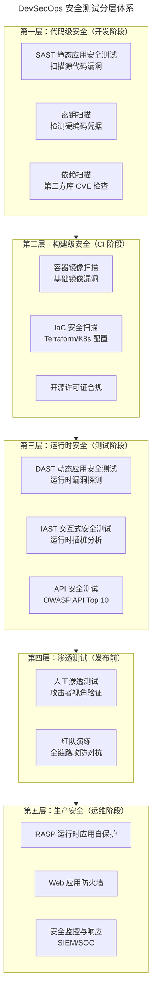
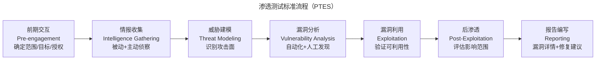
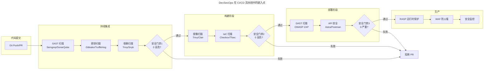
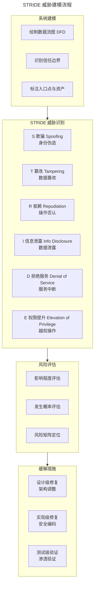

# 渗透测试与 DevSecOps

## 一、模块介绍

**渗透测试**（Penetration Testing，简称 Pentest）是一种模拟真实攻击者视角的安全测试方法——通过主动寻找并利用系统漏洞，评估系统的安全防御能力。**DevSecOps** 则是将安全实践融入 DevOps 全流程的理念——安全不再是上线前的"安检关卡"，而是贯穿开发、测试、部署、运维的持续活动。

在网络安全法规日益严格（如《数据安全法》《个人信息保护法》、欧盟 GDPR）的背景下，安全测试已从"可选加分项"变为"合规必需品"。本文系统阐述渗透测试方法论、DevSecOps 工具链集成、OWASP Top 10 防御实践，以及安全测试的自动化策略。

## 二、核心方法论

### 2.1 安全测试分层体系



### 2.2 渗透测试方法论

渗透测试遵循 **PTES**（Penetration Testing Execution Standard）标准流程：



### 2.3 OWASP Top 10（2025）与防御

| 排名 | 漏洞类型 | 说明 | 防御措施 |
| --- | --- | --- | --- |
| A01 | 访问控制失效 | 越权访问、权限绕过 | 最小权限原则 + 服务端鉴权 |
| A02 | 安全配置错误 | 默认密码、开放端口 | 配置基线 + CIS Benchmark |
| A03 | 软件供应链失效 | 依赖投毒、构建链污染 | 依赖扫描 + SBOM + 构建完整性校验 |
| A04 | 加密失败 | 明文传输、弱算法 | TLS 1.3 + AES-256 + 密钥轮换 |
| A05 | 注入 | SQL/NoSQL/命令注入 | 参数化查询 + 输入校验 |
| A06 | 不安全设计 | 缺乏威胁建模 | 设计阶段安全评审 |
| A07 | 认证失败 | 弱密码、会话固定 | MFA + 会话超时 + 速率限制 |
| A08 | 软件与数据完整性失败 | 未验证的反序列化与更新 | 签名验证 + 白名单反序列化 |
| A09 | 安全日志与告警失效 | 无法检测攻击 | 集中日志 + 异常告警 |
| A10 | 异常条件处理不当 | 异常未捕获、错误信息泄露 | 统一异常处理 + 错误信息脱敏 |

## 三、关键流程

### 3.1 DevSecOps CI/CD 集成



### 3.2 威胁建模流程

威胁建模是安全测试左移的核心实践，在架构设计阶段识别潜在威胁：



## 四、工具与实践

### 4.1 SAST 集成：Semgrep

```yaml
# .github/workflows/security-sast.yml
name: SAST Security Scan
on: [pull_request]

jobs:
  semgrep:
    runs-on: ubuntu-latest
    steps:
      - uses: actions/checkout@v4

      - name: Semgrep 扫描
        run: |
          pip install semgrep
          semgrep scan \
            --config p/owasp-top-ten \
            --config p/security-audit \
            --config p/sql-injection \
            --config p/xss \
            --config p/secrets \
            --json --output semgrep-results.json

      - name: SonarQube 分析
        uses: SonarSource/sonarqube-scan-action@v2
        env:
          SONAR_TOKEN: ${{ secrets.SONAR_TOKEN }}

      - name: 安全门禁判断
        run: |
          CRITICAL=$(jq '.results | map(select(.extra.severity == "ERROR")) | length' semgrep-results.json)
          if [ "$CRITICAL" -gt 0 ]; then
            echo "::error::发现 $CRITICAL 个高危安全漏洞"
            exit 1
          fi
```

### 4.2 DAST 集成：OWASP ZAP

```yaml
# GitLab CI DAST 扫描配置
dast:
  stage: security
  image: ghcr.io/zaproxy/zaproxy:stable
  variables:
    target_url: "https://staging.example.com"
  script:
    # zap-baseline.py 发现告警时会以非零码退出，先放行，再按 JSON 报告做门禁判断
    - zap-baseline.py -t $target_url -r zap-report.html -J zap-report.json || true
  artifacts:
    paths:
      - zap-report.html
      - zap-report.json
  rules:
    - if: $CI_COMMIT_BRANCH == "main"
  after_script:
    - |
      CRITICAL=$(jq '.site[0].alerts | map(select(.riskcode == "3")) | length' zap-report.json)
      if [ "$CRITICAL" -gt 0 ]; then
        echo "发现 $CRITICAL 个严重漏洞，阻止发布"
        exit 1
      fi
```

### 4.3 渗透测试实战：SQL 注入

```python
"""
渗透测试实战：SQL 注入自动化检测
使用 Python 模拟攻击者视角验证注入漏洞
"""
import requests
import urllib.parse
from dataclasses import dataclass

@dataclass
class InjectionResult:
    vulnerable: bool
    payload: str
    evidence: str

class SQLInjectionTester:
    def __init__(self, base_url: str):
        self.base_url = base_url
        self.session = requests.Session()
        # 常见 SQL 注入 Payload
        self.payloads = [
            "' OR '1'='1' --",
            "' OR '1'='1' /*",
            "1' AND SLEEP(5) --",  # 时间盲注
            "1 UNION SELECT NULL,NULL,NULL --",  # 联合查询
            "'; DROP TABLE users; --",  # 堆叠注入（仅测试，不执行）
        ]

    def test_endpoint(self, endpoint: str, param: str, method: str = "GET"):
        """测试端点的注入漏洞"""
        results = []

        for payload in self.payloads:
            if method == "GET":
                url = f"{self.base_url}{endpoint}?{param}={urllib.parse.quote(payload)}"
                resp = self.session.get(url, timeout=10)
            else:
                resp = self.session.post(
                    f"{self.base_url}{endpoint}",
                    data={param: payload},
                    timeout=10
                )

            # 检测注入特征
            if self._detect_injection(resp, payload):
                results.append(InjectionResult(
                    vulnerable=True,
                    payload=payload,
                    evidence=f"HTTP {resp.status_code}, 响应含 SQL 错误信息"
                ))

        return results

    def _detect_injection(self, response: requests.Response, payload: str) -> bool:
        """检测注入成功的特征"""
        error_patterns = [
            "SQL syntax",
            "mysql_fetch",
            "ORA-01756",  # Oracle
            "PG::SyntaxError",  # PostgreSQL
            "SQLITE_ERROR",
            "Microsoft SQL Server",
        ]

        body = response.text.lower()
        for pattern in error_patterns:
            if pattern.lower() in body:
                return True

        # 时间盲注检测：如果 SLEEP payload 导致延迟
        if "SLEEP" in payload and response.elapsed.total_seconds() > 4:
            return True

        return False

# 使用示例（仅授权测试环境）
tester = SQLInjectionTester("https://test.example.com")
results = tester.test_endpoint("/api/users", "id")
for r in results:
    if r.vulnerable:
        print(f"[!] 发现 SQL 注入: {r.payload}")
        print(f"    证据: {r.evidence}")
```

### 4.4 安全工具链全景

| 类别 | 工具 | 说明 |
| --- | --- | --- |
| **SAST** | Semgrep / SonarQube / CodeQL | 静态代码安全分析 |
| **DAST** | OWASP ZAP / Burp Suite / Nikto | 运行时漏洞探测 |
| **IAST** | Contrast Security / Seeker | 运行时插桩分析 |
| **密钥扫描** | Gitleaks / TruffleHog / Git-secrets | 检测硬编码密钥 |
| **依赖扫描** | Trivy / Snyk / Dependabot | 第三方库 CVE |
| **镜像扫描** | Trivy / Clair / Anchore | 容器镜像漏洞 |
| **IaC 扫描** | Checkov / Tfsec / KICS | 基础设施代码安全 |
| **API 安全** | Astra / Postman Security / Salt | API 专项安全 |
| **渗透测试** | Metasploit / Nmap / Burp Suite | 人工渗透工具 |
| **WAF** | ModSecurity / Cloudflare / AWS WAF | 运行时防护 |

## 五、常见误区

### 5.1 "安全测试是安全团队的事"

**误区**：开发与测试团队认为安全由安全团队负责，代码中不关注安全。

**纠正**：DevSecOps 的核心理念是 **"安全人人有责"**（Security is Everyone's Responsibility）。安全团队负责策略与审计，开发负责安全编码，测试负责安全验证。安全左移到开发阶段成本最低。

### 5.2 SAST/DAST 覆盖一切

**误区**：部署了 SAST 和 DAST 工具就认为安全测试已完成。

**纠正**：SAST 误报率高、DAST 覆盖率有限。两者结合仍需人工渗透测试补充——业务逻辑漏洞（如越权访问）、组合攻击链路、社会工程攻击等无法被自动化工具发现。

### 5.3 一次性渗透测试

**误区**：每年做一次渗透测试，通过后全年放心。

**纠正**：系统持续变更，每次重大功能上线都可能引入新漏洞。应将安全扫描纳入 CI/CD（自动化持续扫描），每季度或重大版本前做人工渗透测试。

### 5.4 忽视第三方依赖安全

**误区**：只关注自研代码安全，忽视引入的开源库漏洞。

**纠正**：Log4Shell（Log4j 漏洞）事件证明第三方库是最大攻击面之一。依赖扫描必须纳入 CI，高危 CVE 需在 24-48 小时内修复。

## 六、进阶扩展与参考

### 6.1 AI 在安全测试中的应用

2025-2026 年趋势：AI 驱动的安全测试正在兴起——LLM 能从代码模式推断安全漏洞、自动生成攻击 Payload、分析渗透测试报告摘要。AI 辅助的"红队即服务"（Red Teaming as a Service）开始出现，降低渗透测试的人才门槛。

### 6.2 零信任架构与测试

**零信任架构**（Zero Trust Architecture，ZTA）要求"永不信任，始终验证"。安全测试需验证：每次访问是否都经过身份验证、最小权限是否严格落实、网络分段是否有效。ZTA 的测试与传统边界安全测试有本质差异。

### 6.3 推荐参考

- 标准：OWASP Top 10（owasp.org/Top10）
- 标准：OWASP Testing Guide（WSTG）v4.2
- 标准：PTES（pentest-standard.org）
- 图书：《The Web Application Hacker's Handbook》Dafydd Stuttard
- 工具：OWASP ZAP（zaproxy.org）
- 认证：OSCP（Offensive Security Certified Professional）
