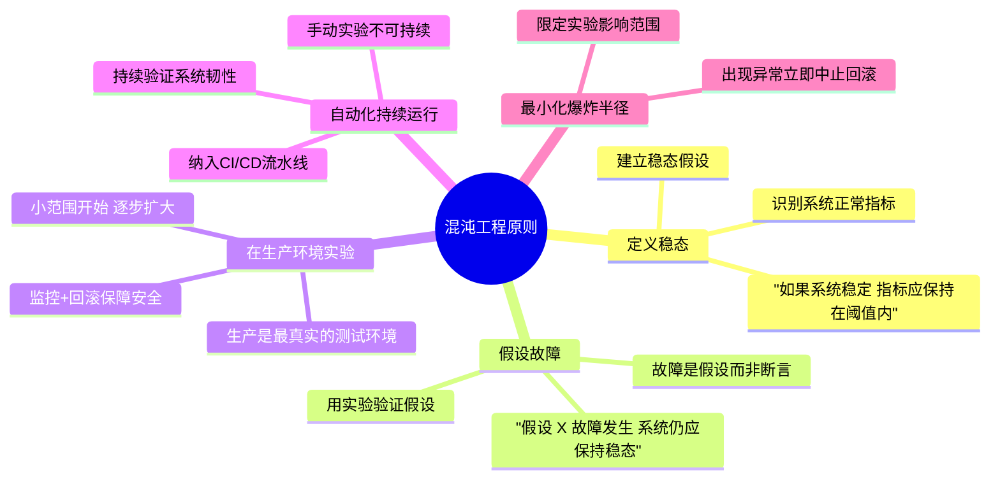
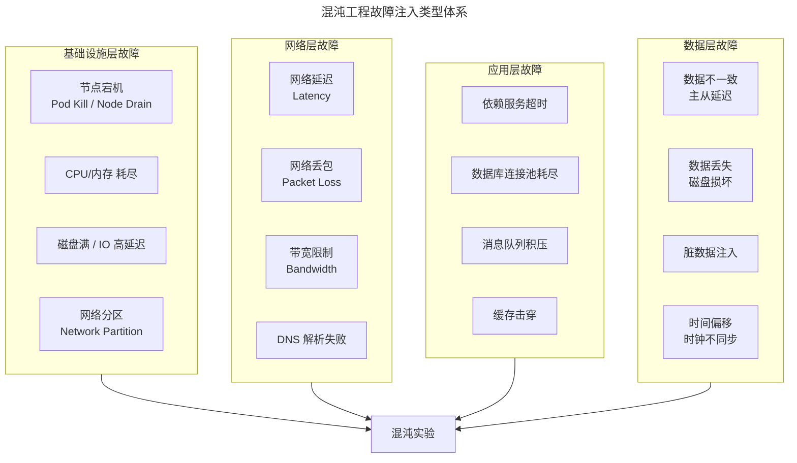
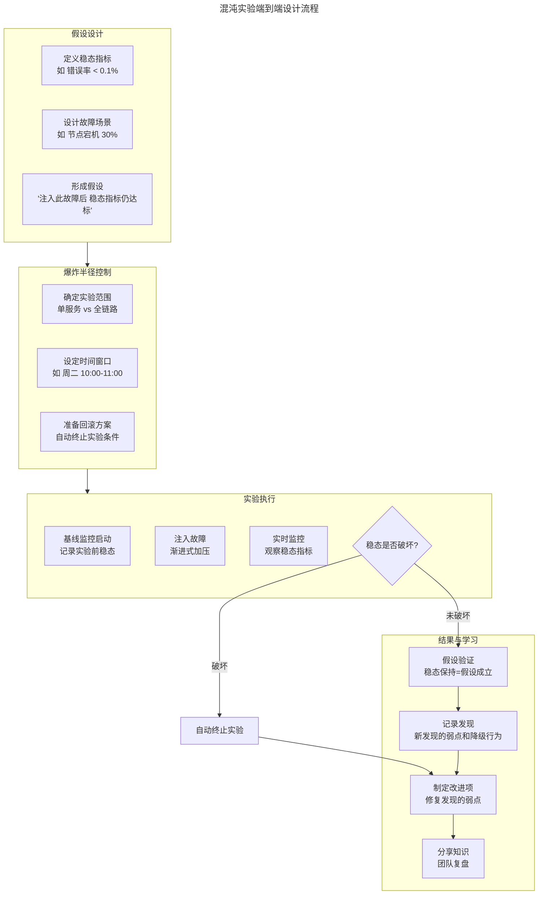
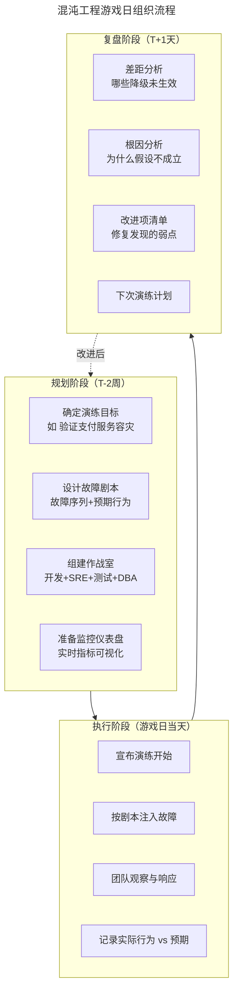
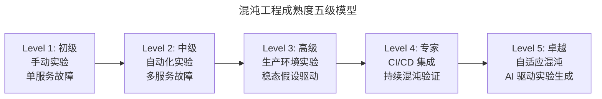

# 混沌工程与故障注入

## 一、模块介绍

**混沌工程**（Chaos Engineering）是对分布式系统进行**主动故障注入**的实验方法，旨在验证系统在不可预见的生产故障下的韧性（Resilience）。它由 Netflix 在 2010 年代初提出，从"猴子军团"（Chaos Monkey）演变为系统化的工程实践。

传统的可靠性测试回答"系统在正常条件下是否稳定"，混沌工程回答**"系统在异常条件下是否仍能存活"**——网络延迟、节点宕机、磁盘满、DNS 解析失败等真实生产故障被主动注入到运行系统中，验证降级策略、熔断机制、容灾切换是否如期生效。

本文系统阐述混沌工程的原理与实践、故障注入实验设计、Chaos Mesh 在 Kubernetes 中的应用，以及与测试的关系。

## 二、核心方法论

### 2.1 混沌工程五原则

混沌工程的核心原则由 Principles of Chaos 组织定义：



### 2.2 故障注入类型分类



### 2.3 混沌实验与测试的关系

| 维度 | 传统测试 | 混沌工程 |
| --- | --- | --- |
| 目标 | 验证功能正确性 | 验证系统韧性 |
| 方法 | 预定义输入与预期输出 | 注入故障观察系统行为 |
| 环境 | 测试环境 | **生产环境**（或准生产） |
| 结果判定 | 通过/失败 | 稳态是否被破坏 |
| 时机 | 开发阶段 | 运行阶段（持续） |
| 视角 | "系统应该做什么" | "系统在故障下能做什么" |

混沌工程不是替代传统测试，而是**在测试之上的更高层验证**——当所有功能测试都通过时，混沌工程验证系统在故障下的"生存能力"。

## 三、关键流程

### 3.1 混沌实验设计流程



### 3.2 稳态假设设计

稳态假设是混沌实验的核心——它定义了"系统正常"的可量化标准：

```yaml
# 稳态假设示例
steady_state_hypothesis:
  # 核心业务指标
  - metric: "订单创建成功率"
    query: 'success_rate{endpoint="/api/orders"}'
    threshold: "> 99.9%"
    source: "Prometheus"

  - metric: "支付 P99 延迟"
    query: 'histogram_quantile(0.99, rate(payment_duration_seconds_bucket[5m]))'
    threshold: "< 500ms"
    source: "Prometheus"

  # 基础设施指标
  - metric: "CPU 使用率"
    query: 'avg(cpu_usage{service="order-service"})'
    threshold: "< 80%"
    source: "Prometheus"

  # 自动终止条件（任一指标破坏则立即终止实验）
  abort_on_breach: true
  abort_conditions:
    - "订单创建成功率 < 99%"
    - "支付 P99 延迟 > 2000ms"
    - "错误率 > 1%"
```

### 3.3 渐进式实验策略

```mermaid
---
title: 混沌实验渐进式扩大策略
---
flowchart LR
    subgraph S1["阶段1: 单服务"]
        A1["范围: 单个 Pod"]
        A2["故障: 重启 1 个 Pod"]
        A3["预期: K8s 自动恢复"]
    end

    subgraph S2["阶段2: 单节点"]
        B1["范围: 单个节点"]
        B2["故障: 节点 Drain"]
        B3["预期: Pod 迁移到其他节点"]
    end

    subgraph S3["阶段3: 网络故障"]
        C1["范围: 服务间通信"]
        C2["故障: 500ms 网络延迟"]
        C3["预期: 熔断降级生效"]
    end

    subgraph S4["阶段4: 多服务"]
        D1["范围: 多服务联动"]
        D2["故障: 依赖服务宕机"]
        D3["预期: 降级策略生效"]
    end

    subgraph S5["阶段5: 全链路"]
        E1["范围: 整个集群"]
        E2["故障: 多故障组合"]
        E3["预期: 容灾切换生效"]
    end

    S1 --> S2 --> S3 --> S4 --> S5
```



## 四、工具与实践

### 4.1 Chaos Mesh 故障注入

Chaos Mesh 是 CNCF 毕业项目，Kubernetes 原生的混沌工程平台：

```yaml
# 实验 1: 网络延迟注入
apiVersion: chaos-mesh.org/v1alpha1
kind: NetworkChaos
metadata:
  name: order-service-network-delay
  namespace: chaos-testing
spec:
  action: delay
  mode: all
  selector:
    namespaces:
      - production
    labelSelectors:
      app: order-service
  delay:
    latency: "500ms"
    correlation: "0"
    jitter: "50ms"
  direction: to      # 出站延迟
  target:
    selector:
      namespaces:
        - production
      labelSelectors:
        app: payment-service  # 订单 → 支付的通信延迟
    mode: all
  duration: "5m"
  scheduler:
    cron: "@every 1h"  # 每小时执行一次
---
# 实验 2: Pod 故障注入
apiVersion: chaos-mesh.org/v1alpha1
kind: PodChaos
metadata:
  name: payment-service-pod-kill
  namespace: chaos-testing
spec:
  action: pod-kill   # 杀死 Pod
  mode: fixed-percent
  value: "30"         # 杀死 30% 的 Pod
  selector:
    namespaces:
      - production
    labelSelectors:
      app: payment-service
  duration: "0"       # 立即生效
  scheduler:
    cron: "0 10 * * 2"  # 每周二 10:00
---
# 实验 3: 磁盘 IO 压力
apiVersion: chaos-mesh.org/v1alpha1
kind: IOChaos
metadata:
  name: database-disk-io-latency
  namespace: chaos-testing
spec:
  action: latency
  mode: all
  selector:
    labelSelectors:
      app: postgres
  volumePath: "/var/lib/postgresql/data"
  path: "/var/lib/postgresql/data/**/*"
  delay: "100ms"      # 磁盘 IO 延迟 100ms
  percent: 50          # 50% 的 IO 操作被延迟
  duration: "10m"
```

### 4.2 Chaos Mesh 实验编排

```yaml
# 多故障组合实验：模拟"网络延迟 + 节点宕机"组合故障
apiVersion: chaos-mesh.org/v1alpha1
kind: Workflow
metadata:
  name: combined-failure-experiment
  namespace: chaos-testing
spec:
  entry: main
  templates:
    - name: main
      templateType: Serial
      children:
        - baseline-check
        - network-delay
        - node-drain
        - combined-failure
        - recovery-check

    # 步骤1: 基线检查
    - name: baseline-check
      templateType: Task
      task:
        container:
          image: stefanprodan/podinfo:latest
          command: ["sh", "-c"]
          args:
            - |
              # 检查基线指标
              CURRENT_RATE=$(curl -s prometheus:9090/api/v1/query \
                --data-urlencode 'query=success_rate{endpoint="/api/orders"}' | jq '.data.result[0].value[1]')
              echo "当前成功率: $CURRENT_RATE"
              if [ $(echo "$CURRENT_RATE < 0.999" | bc -l) -eq 1 ]; then
                echo "基线不达标，终止实验"
                exit 1
              fi

    # 步骤2: 网络延迟
    - name: network-delay
      templateType: NetworkChaos
      networkChaos:
        action: delay
        mode: all
        selector:
          labelSelectors:
            app: order-service
        delay:
          latency: "300ms"
        duration: "5m"

    # 步骤3: 节点宕机（与网络延迟串行）
    - name: node-drain
      templateType: PodChaos
      podChaos:
        action: pod-kill
        mode: fixed-percent
        value: "20"
        selector:
          labelSelectors:
            app: order-service
        duration: "0"

    # 步骤4: 组合故障（同时执行）
    - name: combined-failure
      templateType: Parallel
      children:
        - network-delay-2
        - pod-kill-2

    # 步骤4 子实验1: 网络延迟（组合场景）
    - name: network-delay-2
      templateType: NetworkChaos
      networkChaos:
        action: delay
        mode: all
        selector:
          labelSelectors:
            app: order-service
        delay:
          latency: "500ms"
        duration: "5m"

    # 步骤4 子实验2: Pod 故障（组合场景）
    - name: pod-kill-2
      templateType: PodChaos
      podChaos:
        action: pod-kill
        mode: fixed-percent
        value: "20"
        selector:
          labelSelectors:
            app: order-service
        duration: "0"

    # 步骤5: 恢复验证
    - name: recovery-check
      templateType: Task
      task:
        container:
          image: curlimages/curl
          command: ["sh", "-c"]
          args:
            - |
              # 等待 5 分钟让系统恢复
              sleep 300
              # 验证系统是否回到稳态
              curl -s prometheus:9090/api/v1/query \
                --data-urlencode 'query=success_rate{endpoint="/api/orders"}'
```

### 4.3 混沌工程游戏日

**游戏日**（Game Day）是组织级别的混沌工程演练活动：



### 4.4 主流混沌工程工具对比

| 工具 | 平台 | 特点 | 适用场景 |
| --- | --- | --- | --- |
| **Chaos Mesh** | Kubernetes | CNCF 项目，CRD 定义故障 | K8s 原生应用 |
| **Litmus Chaos** | Kubernetes | CNCF 项目，实验市场 | K8s + 多云 |
| **Chaos Monkey** | 通用 | Netflix 原始工具，随机终止实例 | 简单随机故障 |
| **Gremlin** | SaaS | 商业平台，友好 UI | 企业级 |
| **PowerfulSeal** | Kubernetes | 专注于 K8s 故障 | K8s 集群级 |
| **AWS FIS** | AWS | AWS 原生故障注入服务 | AWS 云上应用 |
| **Chaos Toolkit** | 通用 | Python 框架，可扩展 | 自定义实验 |

## 五、常见误区

### 5.1 "混沌工程就是搞破坏"

**误区**：认为混沌工程是在生产环境随意制造混乱。

**纠正**：混沌工程是**有假设、有控制、有回滚**的科学实验。它遵循"定义稳态→假设故障→控制爆炸半径→验证假设→记录学习"的严谨流程。无目的的破坏不是混沌工程，是生产事故。

### 5.2 直接在生产全量实验

**误区**：首次混沌实验就在生产环境对全量用户注入故障。

**纠正**：必须遵循**渐进式扩大**原则——从单 Pod 实验（非生产）开始，逐步扩大到单服务（预发布），再到全链路（生产小范围）。首次生产实验应选择低峰时段、小流量范围。

### 5.3 无稳态假设

**误区**：注入故障后"看看会发生什么"，没有明确的成功/失败标准。

**纠正**：稳态假设是混沌实验的**灵魂**。没有稳态假设的实验只是"观察"而非"验证"。必须预先定义可量化的稳态指标与自动终止条件。

### 5.4 混沌工程替代测试

**误区**：引入混沌工程后减少传统测试投入。

**纠正**：混沌工程验证**韧性**，传统测试验证**正确性**。功能都不正确的系统谈不上韧性。混沌工程是测试金字塔**之上**的补充层，不替代任何下层测试。

## 六、进阶扩展与参考

### 6.1 混沌工程成熟度模型



### 6.2 AI 驱动的混沌工程

2025-2026 年趋势：AI 能基于系统架构自动推荐故障实验场景、分析实验结果识别潜在弱点、预测故障组合的风险概率。AI 驱动的"自适应混沌"能根据系统变更动态调整实验策略——新服务上线自动触发相关混沌实验。

### 6.3 推荐参考

- 图书：《Chaos Engineering: System Resiliency in Practice》Casey Rosenthal & Nora Jones
- 原则：principlesofchaos.org
- 工具：Chaos Mesh（chaos-mesh.org）
- 工具：Litmus Chaos（litmuschaos.io）
- 实践：Netflix Chaos Engineering 官方博客
