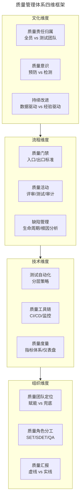
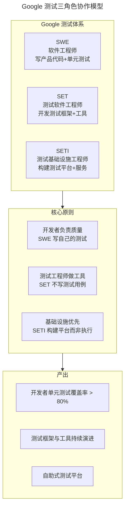
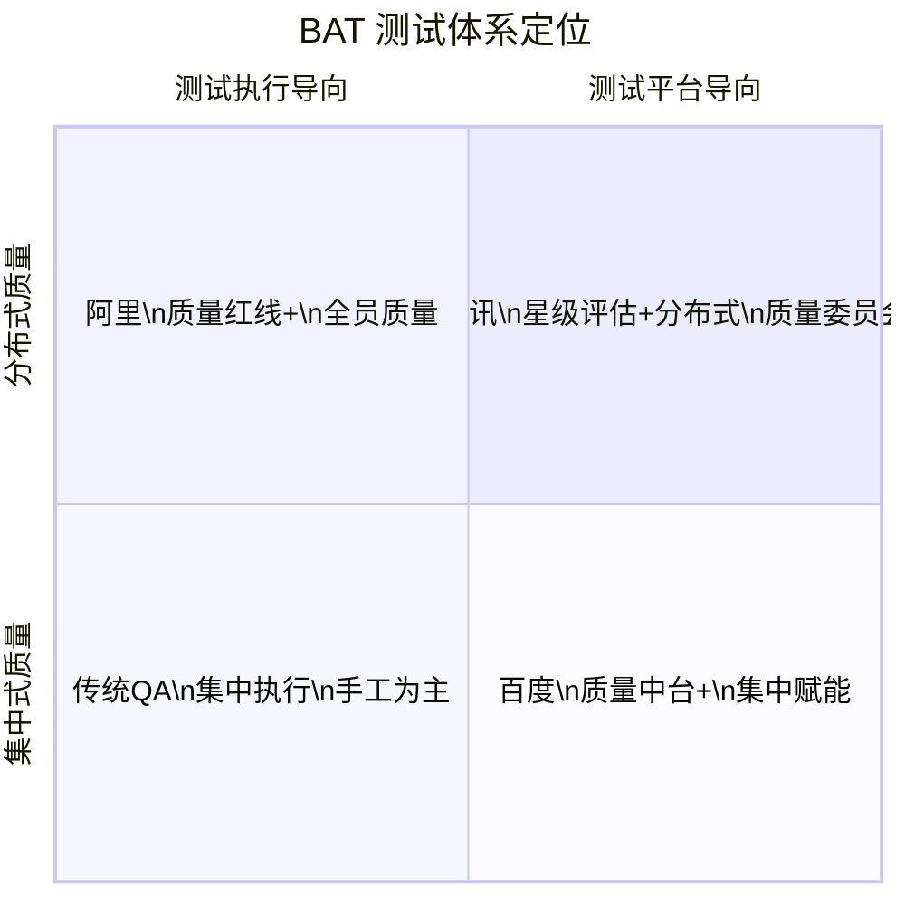
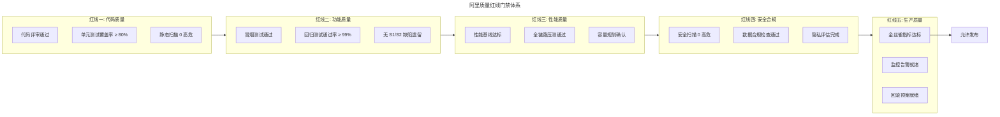
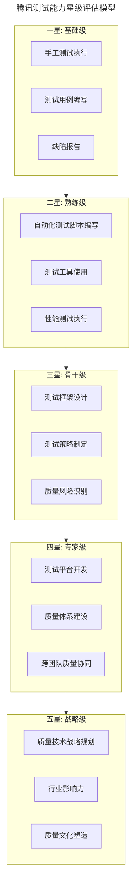
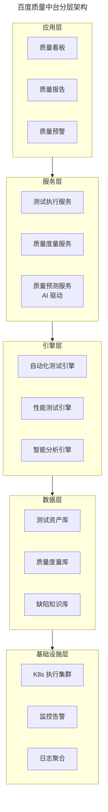
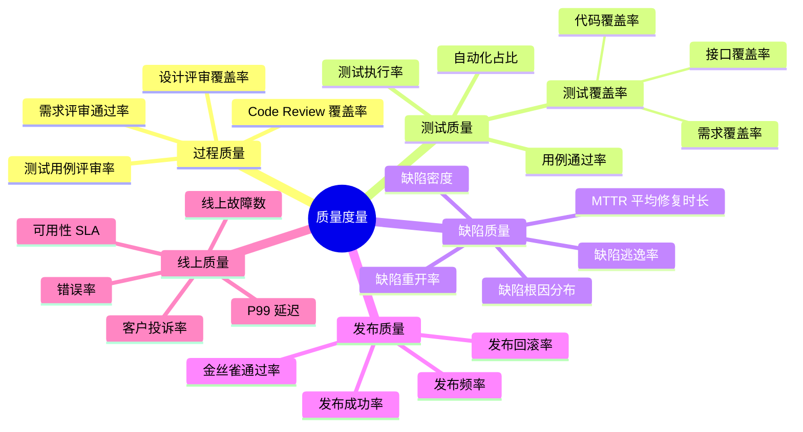

# 质量管理体系（Google/BAT 对比）

## 一、模块介绍

**质量管理体系**（Quality Management System，QMS）是一个组织为确保产品质量而建立的管理框架——涵盖质量方针、组织架构、流程规范、度量体系与文化塑造。技术工具和测试方法决定"能测多好"，质量管理体系决定"测对方向、持续改进"。

Google 与 BAT（百度、阿里、腾讯）作为中国及全球顶级互联网企业，其质量管理体系经历了从"测试团队兜底"到"全员质量责任"的演进，各有特色：Google 的 SETI（Software Engineer, Tools and Infrastructure）模式、阿里的"质量红线"体系、腾讯的"星级测试"评估、百度的"质量中台"战略。本文对比分析这些体系的设计理念与实践差异。

## 二、核心方法论

### 2.1 质量管理体系四维模型



### 2.2 Google 测试体系：SETI 模式

Google 的测试体系以 **SETI**（Software Engineer, Tools and Infrastructure）模式著称，核心理念是"测试基础设施优先于测试执行"：



Google 模式的核心特征：
- **开发者写测试**：SWE 负责产品代码和单元测试，测试不是"别人"的事
- **测试工程师做工具**：SET/SETI 开发测试框架、平台、工具，赋能开发者自测
- **极少手工测试**：Google 没有传统 QA 角色，测试高度自动化
- **质量是设计出来的**：强调代码可测试性设计，而非事后验证

### 2.3 BAT 测试体系对比



| 维度 | 阿里 | 腾讯 | 百度 |
| --- | --- | --- | --- |
| **核心理念** | 质量红线 + 全员质量 | 星级评估 + 技术委员会 | 质量中台 + 数据驱动 |
| **测试角色** | 测试开发（测开一体化） | 测试工程师（T 级序列） | 测试工程师 + 质量架构师 |
| **自动化重点** | 全链路压测平台 | 专项测试工具链 | 智能测试平台 |
| **质量度量** | 红线指标 + 质量分 | 星级评定 + 缺陷率 | 质量看板 + 预测模型 |
| **特色实践** | 影子库表全链路压测 | 代码质量平台 + CodeDoge | APM + 智能故障预测 |
| **组织架构** | 质量中台 + 业务线 QA | 质量委员会 + 各 BG 测试 | 质量平台部 + 业务 QA |

## 三、关键流程

### 3.1 阿里"质量红线"体系



### 3.2 腾讯星级测试评估



### 3.3 百度质量中台架构



## 四、工具与实践

### 4.1 质量度量指标体系

综合 Google/BAT 的实践，一套完整的质量度量指标体系：



### 4.2 质量分模型

阿里"质量分"是量化团队质量水平的综合模型：

```python
"""
质量分计算模型
综合多维度指标，输出 0-100 的质量分
"""
from dataclasses import dataclass

@dataclass
class QualityScore:
    total: float          # 总分 0-100
    process_score: float  # 过程质量分
    test_score: float     # 测试质量分
    defect_score: float   # 缺陷质量分
    production_score: float  # 生产质量分
    level: str            # A/B/C/D 等级

def calculate_quality_score(metrics: dict) -> QualityScore:
    # 过程质量（权重 20%）
    process = (
        metrics["code_review_coverage"] * 0.3 +
        metrics["test_case_review_rate"] * 0.3 +
        metrics["design_review_coverage"] * 0.4
    ) * 100

    # 测试质量（权重 25%）
    test = (
        metrics["code_coverage"] * 0.3 +
        metrics["requirement_coverage"] * 0.3 +
        metrics["automation_rate"] * 0.2 +
        metrics["case_pass_rate"] * 0.2
    ) * 100

    # 缺陷质量（权重 25%）
    # 逃逸率越低分越高
    defect = (
        (1 - metrics["defect_escape_rate"]) * 0.4 +
        (1 - metrics["defect_reopen_rate"]) * 0.2 +
        min(metrics["mttr_score"], 1.0) * 0.4
    ) * 100

    # 生产质量（权重 30%）
    production = (
        (1 - metrics["rollback_rate"]) * 0.3 +
        metrics["sla_availability"] * 0.4 +
        (1 - metrics["error_rate"]) * 0.3
    ) * 100

    total = process * 0.2 + test * 0.25 + defect * 0.25 + production * 0.30

    if total >= 90:
        level = "A"
    elif total >= 80:
        level = "B"
    elif total >= 70:
        level = "C"
    else:
        level = "D"

    return QualityScore(
        total=round(total, 1),
        process_score=round(process, 1),
        test_score=round(test, 1),
        defect_score=round(defect, 1),
        production_score=round(production, 1),
        level=level
    )
```

### 4.3 质量文化落地实践

| 实践 | Google | 阿里 | 腾讯 |
| --- | --- | --- | --- |
| **质量责任** | 开发者为主，测试做工具 | 全员质量，测试做平台 | 测试主导，开发协同 |
| **质量激励** | 代码质量影响晋升 | 质量红线影响绩效 | 星级评定影响职级 |
| **质量培训** | 测试基础设施文档 | 质量大学 + 认证体系 | 测试技术大会 + 分享 |
| **质量审计** | 自动化数据驱动 | 红线检查 + 质量审计 | 星级评估 + 技术委员会 |
| **质量复盘** | Postmortem 文化 | 质量复盘会 + 改进项 | 故障复盘 + 改进跟踪 |

## 五、常见误区

### 5.1 照搬大厂体系

**误区**：中小团队直接复制 Google 或 BAT 的质量管理体系。

**纠正**：大厂体系建立在百人级测试团队、亿级用户、高复杂度系统的基础上。中小团队应**因地制宜**——先建立基础质量门禁（代码评审+单元测试+CI），再逐步引入度量与平台。盲目照搬只会增加流程负担。

### 5.2 质量管理等同于测试管理

**误区**：将质量管理局限于测试团队的内部管理，忽视开发与运维的质量责任。

**纠正**：质量管理是**组织级**课题，涵盖需求质量、设计质量、编码质量、测试质量、运维质量。测试只是其中一环。质量管理体系应横跨全生命周期。

### 5.3 度量驱动异化

**误区**：将质量指标作为 KPI 考核工具，导致团队为指标而工作（如刷覆盖率、隐藏缺陷）。

**纠正**：质量度量应用于**发现改进点**而非**考核惩罚**。古德哈特定律警示：当指标成为目标，它就不再是好指标。度量应配合复盘文化，而非惩罚文化。

### 5.4 忽视质量文化

**误区**：只建设流程与工具，不投入质量文化塑造。

**纠正**：质量管理的终极竞争力是**文化**。工具可以被复制，流程可以被模仿，但"全员质量责任"的文化需要长期塑造。Google 的"开发者写测试"不是流程规定，而是文化共识。

## 六、进阶扩展与参考

### 6.1 质量工程的未来趋势

2025-2026 年质量工程呈现三大趋势：
1. **AI 赋能**：LLM 辅助测试设计、智能缺陷分析、预测性质量评估
2. **平台化**：质量能力从"服务"演变为"平台"，开发者自助获取
3. **左移+右移**：质量左移到设计阶段（可测试性设计），右移到运维阶段（生产质量监控）

### 6.2 开源质量体系建设参考

除了 Google/BAT，开源社区的质量实践同样值得学习：
- **Mozilla**：开源项目的分布式质量协作模式
- **Apache**：社区驱动的质量门禁与发布投票机制
- **CNCF**：云原生项目的可观测性与混沌工程实践

### 6.3 推荐参考

- 图书：《How Google Tests Software》James Whittaker
- 图书：《Software Engineering at Google》Titus Winters 等（含测试与质量章节）
- 案例：阿里技术博客质量体系系列文章
- 案例：腾讯 DevOps 与质量工程实践分享
- 标准：ISO 9001 质量管理体系标准
