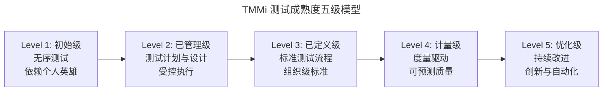
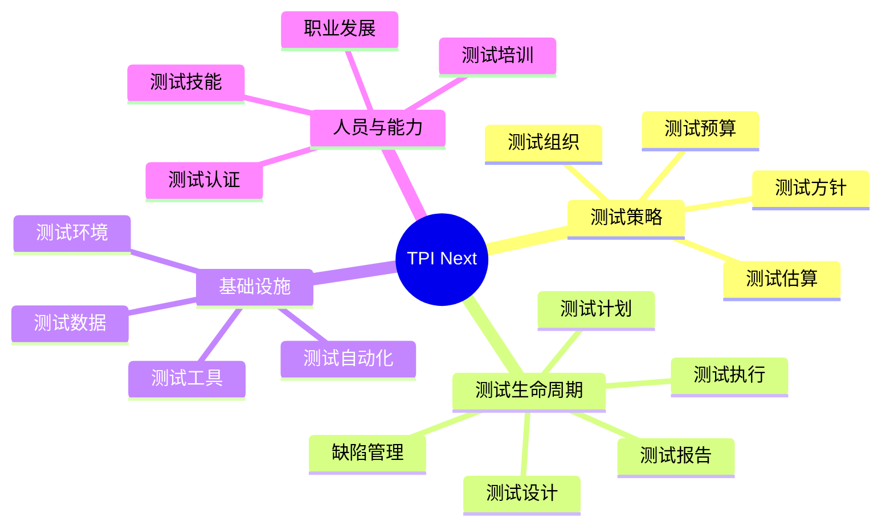
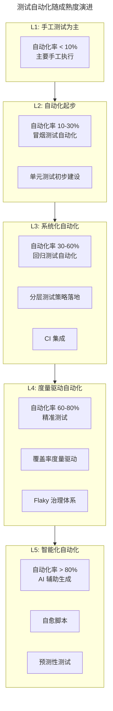
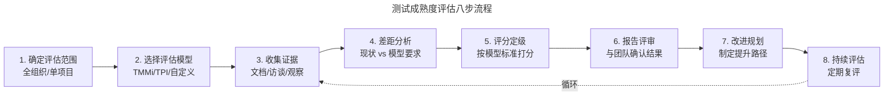
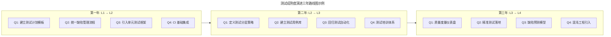

# 测试成熟度模型与演进

## 一、模块介绍

**测试成熟度模型**（Test Maturity Model）是评估组织测试能力水平的系统化框架。它定义了从"初始混沌"到"持续优化"的演进路径，帮助组织定位当前水平、识别差距、规划改进方向。

正如 CMMI 评估软件开发能力，测试成熟度模型评估**测试作为一项工程能力的成熟度**——不仅是"测试做没做"，更是"测试做得有多好、多系统、多可持续"。主流模型包括 TMMi（Test Maturity Model integration）、TPI（Test Process Improvement）、以及 Gartner 的 QA Maturity Model。本文系统阐述这些模型的核心内容、评估方法，以及组织如何规划成熟度演进路径。

## 二、核心方法论

### 2.1 TMMi 五级成熟度模型

TMMi 是目前最权威的测试成熟度评估框架，由 TMMi 基金会维护，与 CMMI 兼容：



### 2.2 各级别详细特征

| 级别 | 关键特征 | 典型表现 | 过程区域 |
| --- | --- | --- | --- |
| **L1 初始级** | 测试无序、不可重复 | "能测的都测了" | 无标准化过程 |
| **L2 已管理级** | 测试有计划、有文档 | 测试计划 + 用例文档 | 测试方针与策略、测试计划、测试监控与控制、测试设计与执行、测试环境管理 |
| **L3 已定义级** | 组织级标准流程 | 统一测试流程 + 模板 | 测试组织、测试培训、测试生命周期与集成、非功能测试、同行评审 |
| **L4 计量级** | 度量驱动决策 | 质量看板 + 预测模型 | 测试计量、软件质量评价 |
| **L5 优化级** | 持续改进与创新 | 自适应流程 + AI 辅助 | 缺陷预防、质量控制、测试过程优化 |

### 2.3 TPI Next 维度模型

TPI Next（Test Process Improvement Next）从 4 个关键领域、16 个检查点（Checkpoint）评估测试能力：



### 2.4 成熟度与测试自动化关系



## 三、关键流程

### 3.1 成熟度评估流程



### 3.2 成熟度演进路径规划



### 3.3 自评检查表

以下是一个简化的 TMMi L2 自评检查表：

| 检查项 | 是/否/部分 | 证据 |
| --- | --- | --- |
| 是否有组织级测试方针文档？ | □是 □否 □部分 | _____ |
| 每个项目是否编写测试计划？ | □是 □否 □部分 | _____ |
| 测试计划是否包含范围/资源/进度？ | □是 □否 □部分 | _____ |
| 测试用例是否有评审记录？ | □是 □否 □部分 | _____ |
| 缺陷是否有生命周期管理？ | □是 □否 □部分 | _____ |
| 测试执行是否有进度监控？ | □是 □否 □部分 | _____ |
| 测试是否有入口/出口准则？ | □是 □否 □部分 | _____ |
| 测试报告是否标准化？ | □是 □否 □部分 | _____ |

## 四、工具与实践

### 4.1 成熟度评估雷达图

```python
"""
测试成熟度雷达图生成器
从 6 个维度评估测试能力，输出可视化雷达图
"""
import matplotlib.pyplot as plt
import numpy as np
from dataclasses import dataclass

@dataclass
class MaturityAssessment:
    dimensions: dict  # 维度名: 得分(1-5)

    def generate_radar(self, title="测试成熟度评估"):
        categories = list(self.dimensions.keys())
        values = list(self.dimensions.values())

        # 闭合雷达图
        angles = np.linspace(0, 2 * np.pi, len(categories), endpoint=False).tolist()
        values_closed = values + values[:1]
        angles_closed = angles + angles[:1]

        fig, ax = plt.subplots(figsize=(8, 8), subplot_kw=dict(polar=True))
        ax.fill(angles_closed, values_closed, alpha=0.25, color='blue')
        ax.plot(angles_closed, values_closed, 'o-', linewidth=2)

        ax.set_xticks(angles)
        ax.set_xticklabels(categories, fontsize=12)
        ax.set_ylim(0, 5)
        ax.set_yticks([1, 2, 3, 4, 5])
        ax.set_yticklabels(['L1', 'L2', 'L3', 'L4', 'L5'], fontsize=10)
        ax.set_title(title, fontsize=16, pad=20)

        # 标注各维度得分
        for angle, value, cat in zip(angles, values, categories):
            ax.annotate(f'{value}', xy=(angle, value), fontsize=12,
                       fontweight='bold', ha='center', va='bottom')

        plt.savefig('maturity_radar.png', dpi=150, bbox_inches='tight')
        plt.show()

# 示例评估
assessment = MaturityAssessment({
    "测试策略": 3,      # L3 已定义级
    "测试自动化": 2,    # L2 已管理级
    "测试度量": 2,      # L2 已管理级
    "测试组织": 3,      # L3 已定义级
    "测试工具链": 4,    # L4 量化管理级
    "质量文化": 2,      # L2 已管理级
})
# assessment.generate_radar()
```

### 4.2 成熟度改进 Backlog

```yaml
# 测试成熟度改进 Backlog 示例
improvements:
  - id: IMP-001
    area: "测试自动化"
    current_level: 2
    target_level: 3
    action: "建立分层测试策略，定义单元/集成/E2E 比例"
    priority: P1
    owner: "测试架构师"
    quarter: "2026Q3"
    status: "进行中"

  - id: IMP-002
    area: "测试度量"
    current_level: 2
    target_level: 3
    action: "构建 Grafana 质量仪表盘，覆盖 10 个核心指标"
    priority: P1
    owner: "QA Lead"
    quarter: "2026Q3"
    status: "待启动"

  - id: IMP-003
    area: "质量文化"
    current_level: 2
    target_level: 3
    action: "推行开发者写单元测试，将覆盖率纳入 PR 门禁"
    priority: P2
    owner: "工程效能团队"
    quarter: "2026Q4"
    status: "待启动"

  - id: IMP-004
    area: "测试工具链"
    current_level: 4
    target_level: 5
    action: "引入 AI 辅助测试用例生成，试点 Copilot for Tests"
    priority: P3
    owner: "测试平台团队"
    quarter: "2027Q1"
    status: "调研中"
```

### 4.3 主流成熟度模型对比

| 模型 | 制定方 | 核心维度 | 适用场景 |
| --- | --- | --- | --- |
| **TMMi** | TMMi Foundation | 5 级 × 15 过程区域 | 正式评估认证 |
| **TPI Next** | Sogeti | 4 领域 × 16 检查点 | 改进导向评估 |
| **CMMI V&V** | CMMI Institute | 验证与确认过程区域 | 与 CMMI 集成 |
| **Gartner QA Maturity** | Gartner | 5 级敏捷 QA 模型 | 企业级对标 |
| **Agile Testing Maturity** | 社区 | 敏捷测试实践评估 | 敏捷团队自评 |
| **Self-Assessment** | 自定义 | 按需定义维度 | 内部改进 |

## 五、常见误区

### 5.1 为认证而认证

**误区**：将 TMMi 认证作为目标，投入大量资源"应试"以获取证书。

**纠正**：成熟度模型是**改进工具**而非**荣誉勋章**。认证的价值在于评估过程中的发现与改进，而非证书本身。为认证而认证会导致"纸面成熟度"——文档齐全但实际能力未提升。

### 5.2 跳级跃进

**误区**：从 L1 直接规划到 L4，跳过 L2/L3 的基础建设。

**纠正**：成熟度是**阶梯式演进**的——L4 的度量驱动依赖 L3 的标准流程，L3 的标准流程依赖 L2 的计划管理。跳级会导致"空中楼阁"，度量数据不可信、标准流程不落地。

### 5.3 重评估轻改进

**误区**：投入大量精力做评估报告，但评估后无实际行动。

**纠正**：评估是**起点**而非**终点**。评估的价值在于触发改进。每次评估后应产出明确的改进 Backlog，并跟踪执行。

### 5.4 忽视组织文化

**误区**：只关注过程与工具维度的成熟度，忽视人员与文化维度。

**纠正**：测试成熟度的最高级别（L5 优化级）依赖**持续改进文化**——团队自发地发现问题、实验新方法、分享知识。没有文化支撑，L4 无法跃升到 L5。

## 六、进阶扩展与参考

### 6.1 敏捷时代的成熟度评估

传统 TMMi 偏重文档化与过程规范性，在敏捷/DevOps 语境下需要适配。敏捷测试成熟度更关注：
- 测试自动化水平（而非测试文档完整度）
- 反馈速度（而非过程合规性）
- 全员质量责任（而非测试团队独立验证）
- 持续实验文化（而非标准流程遵循）

### 6.2 AI 时代的成熟度新维度

2025-2026 年，测试成熟度模型正在引入 AI 维度：
- AI 辅助测试设计能力
- AI 驱动的缺陷预测与预防
- 自愈测试基础设施
- 智能测试编排与优化

这些能力将成为 L5"优化级"的新标志。

### 6.3 推荐参考

- 标准：TMMi Assessment Framework（tmmi.org）
- 标准：TPI Next（sogeti.com/tpi）
- 图书：《Improving the Test Process》Tim Koomen
- 模型：Gartner QA Maturity Model
- 实践：ISTQB Test Management 认证大纲
