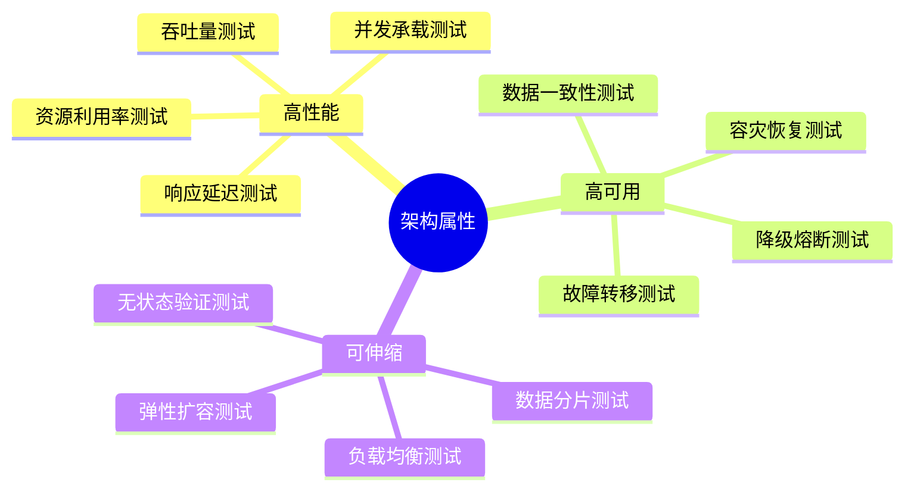
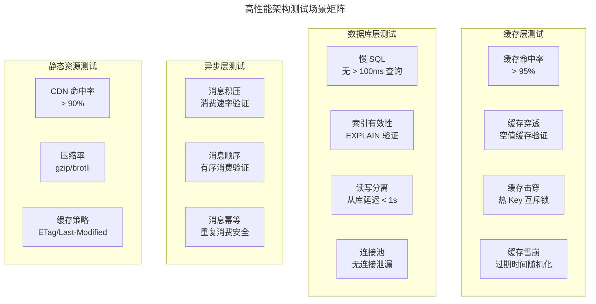
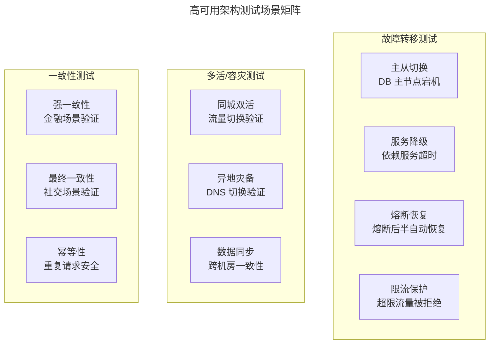
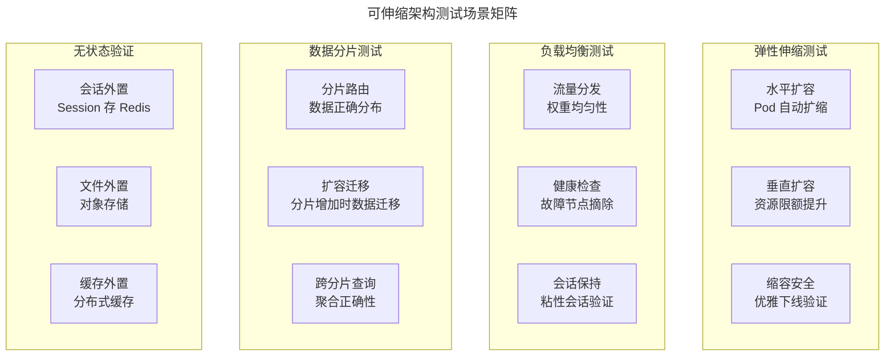
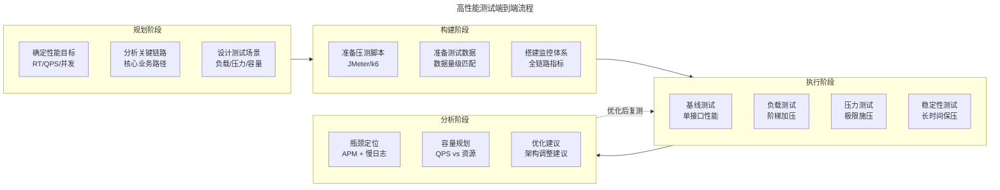
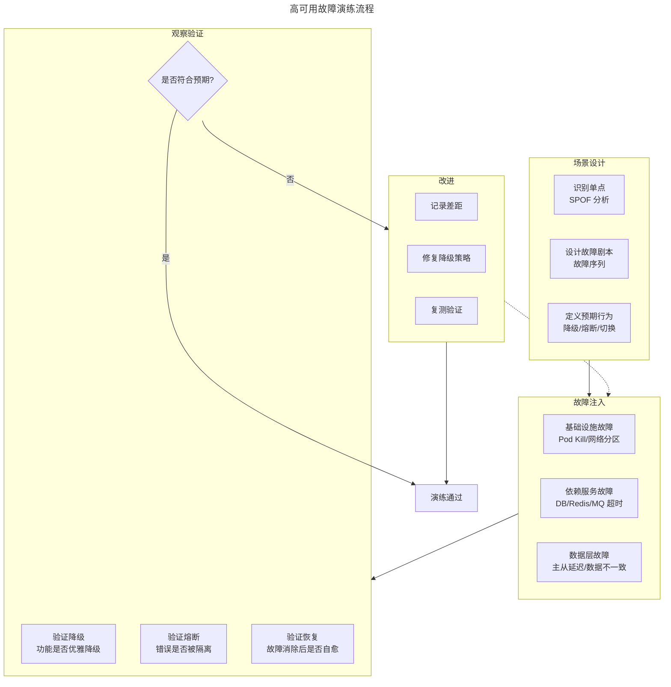
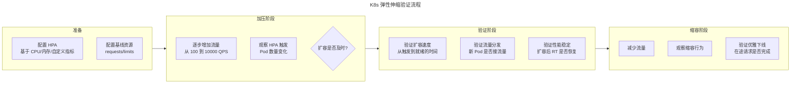

# 网站架构与测试设计（高性能/高可用/可伸缩）

## 一、模块介绍

大型网站架构的三大核心目标是 **高性能**（High Performance）、**高可用**（High Availability）与 **可伸缩**（Scalability）。这三个目标不仅是架构师的设计追求，也是测试工程师的验证重点——**架构决定了测试需要覆盖哪些场景，测试验证架构是否达到了设计目标**。

本文从"架构驱动测试设计"的视角，系统阐述高性能、高可用、可伸缩三种架构模式下的测试策略与场景设计。不讨论架构实现细节，而是聚焦于"如何测试验证这些架构属性"。

## 二、核心方法论

### 2.1 架构属性与测试维度映射



### 2.2 高性能架构测试要点

高性能架构的核心指标：

| 指标 | 定义 | 典型目标 |
| --- | --- | --- |
| **RT**（Response Time） | 响应时间 | P99 < 200ms |
| **QPS**（Queries Per Second） | 每秒请求数 | 10,000+ |
| **TPS**（Transactions Per Second） | 每秒事务数 | 5,000+ |
| **并发数** | 同时在线用户数 | 100,000+ |
| **资源利用率** | CPU/内存/IO/网络 | < 80% |

高性能测试需验证的架构能力：



### 2.3 高可用架构测试要点

高可用架构的核心指标：

| 指标 | 定义 | 典型目标 |
| --- | --- | --- |
| **SLA**（Service Level Agreement） | 服务可用性 | 99.99%（年宕机 < 53 分钟） |
| **RTO**（Recovery Time Objective） | 恢复时间目标 | < 5 分钟 |
| **RPO**（Recovery Point Objective） | 恢复数据点目标 | < 1 分钟 |
| **MTBF**（Mean Time Between Failures） | 平均无故障时间 | 越长越好 |
| **MTTR**（Mean Time To Repair） | 平均修复时间 | < 30 分钟 |



### 2.4 可伸缩架构测试要点



## 三、关键流程

### 3.1 高性能测试全流程



### 3.2 高可用故障演练流程



### 3.3 弹性伸缩验证流程



## 四、工具与实践

### 4.1 k6 性能测试脚本

```javascript
// k6 高性能测试脚本：多阶段负载模型
import http from 'k6/http';
import { check, sleep } from 'k6';
import { Trend, Rate } from 'k6/metrics';

// 自定义指标
const orderLatency = new Trend('order_latency');
const successRate = new Rate('success_rate');

export const options = {
  stages: [
    // 阶段1: 预热（2分钟，100 VU）
    { duration: '2m', target: 100 },

    // 阶段2: 正常负载（5分钟，500 VU）
    { duration: '5m', target: 500 },

    // 阶段3: 峰值负载（3分钟，2000 VU）
    { duration: '3m', target: 2000 },

    // 阶段4: 持续峰值（10分钟稳定性测试）
    { duration: '10m', target: 2000 },

    // 阶段5: 降温（2分钟，回到 100 VU）
    { duration: '2m', target: 100 },
  ],
  thresholds: {
    // 质量门禁
    'http_req_duration': ['p(99)<500'],           // P99 < 500ms
    'http_req_failed': ['rate<0.01'],              // 错误率 < 1%
    'success_rate': ['rate>0.99'],                 // 业务成功率 > 99%
    'order_latency': ['p(95)<300', 'p(99)<800'],  // 订单 P95 < 300ms
  },
};

export default function () {
  // 模拟用户行为：浏览 → 下单 → 支付
  const baseUrl = 'https://test.example.com';

  // 1. 浏览商品
  const skuResp = http.get(`${baseUrl}/api/skus/random`);
  check(skuResp, {
    '商品详情 200': (r) => r.status === 200,
  });

  // 2. 创建订单
  const orderResp = http.post(`${baseUrl}/api/orders`,
    JSON.stringify({ skuId: 'sku-test-001', qty: 1 }),
    { headers: { 'Content-Type': 'application/json' } }
  );

  orderLatency.add(orderResp.timings.duration);

  const orderSuccess = check(orderResp, {
    '订单创建 201': (r) => r.status === 201,
  });
  successRate.add(orderSuccess);

  // 3. 支付（仅部分用户）
  if (orderSuccess && Math.random() > 0.3) {
    const orderId = orderResp.json('id');
    const payResp = http.post(`${baseUrl}/api/orders/${orderId}/pay`);
    check(payResp, {
      '支付 200': (r) => r.status === 200,
    });
  }

  sleep(Math.random() * 2 + 1);  // 1-3 秒思考时间
}
```

### 4.2 全链路性能监控

```yaml
# Prometheus 全链路性能监控告警规则
groups:
  - name: performance_alerts
    rules:
      # P99 延迟告警
      - alert: HighP99Latency
        expr: |
          histogram_quantile(0.99,
            sum(rate(http_request_duration_seconds_bucket[5m])) by (le, service)
          ) > 0.5
        for: 5m
        labels:
          severity: warning
        annotations:
          summary: "{{ $labels.service }} P99 延迟超过 500ms"
          description: "当前 P99: {{ $value }}s"

      # 错误率告警
      - alert: HighErrorRate
        expr: |
          sum(rate(http_requests_total{status=~"5.."}[5m])) by (service)
          / sum(rate(http_requests_total[5m])) by (service) > 0.01
        for: 2m
        labels:
          severity: critical
        annotations:
          summary: "{{ $labels.service }} 错误率超过 1%"

      # 缓存命中率告警
      - alert: LowCacheHitRate
        expr: |
          redis_keyspace_hits_total / (redis_keyspace_hits_total + redis_keyspace_misses_total) < 0.9
        for: 10m
        labels:
          severity: warning
        annotations:
          summary: "Redis 缓存命中率低于 90%"

      # 数据库连接池告警
      - alert: DBConnectionPoolExhausted
        expr: |
          hikaricp_connections_active / hikaricp_connections_max > 0.8
        for: 5m
        labels:
          severity: critical
        annotations:
          summary: "{{ $labels.pool }} 连接池使用率超过 80%"
```

### 4.3 高可用故障注入实验

```yaml
# Chaos Mesh: 高可用故障演练实验组合
apiVersion: chaos-mesh.org/v1alpha1
kind: Workflow
metadata:
  name: ha-drill-experiment
spec:
  entry: ha-drill
  templates:
    # 实验1: 数据库主节点故障
    - name: db-master-failover
      templateType: PodChaos
      podChaos:
        action: pod-kill
        mode: fixed
        value: "1"
        selector:
          labelSelectors:
            app: postgres
            role: master
        duration: "0"

    # 实验2: 网络分区（模拟机房隔离）
    - name: network-partition
      templateType: NetworkChaos
      networkChaos:
        action: partition
        mode: all
        selector:
          labelSelectors:
            app: order-service
        direction: both
        target:
          selector:
            labelSelectors:
              app: payment-service
          mode: all
        duration: "3m"

    # 实验3: 依赖服务延迟（模拟慢依赖）
    - name: slow-dependency
      templateType: NetworkChaos
      networkChaos:
        action: delay
        mode: all
        selector:
          labelSelectors:
            app: order-service
        delay:
          latency: "2000ms"  # 2秒延迟
        direction: to
        target:
          selector:
            labelSelectors:
              app: inventory-service
          mode: all
        duration: "5m"

    # 串行编排
    - name: ha-drill
      templateType: Serial
      children:
        - db-master-failover
        - network-partition
        - slow-dependency
```

## 五、常见误区

### 5.1 性能测试只看平均响应时间

**误区**：性能测试报告只关注平均响应时间（如"平均 50ms"）。

**纠正**：平均响应时间掩盖了长尾问题。必须关注 **P95/P99/P999 分位数**——用户体验取决于尾部延迟，而非平均值。一个平均 50ms 但 P99 为 5s 的系统，用户体验远差于平均 100ms 但 P99 为 200ms 的系统。

### 5.2 高可用测试只做故障注入

**误区**：认为注入故障后系统没崩就是高可用测试通过。

**纠正**：高可用测试需验证**完整的故障恢复闭环**：故障检测→自动切换→降级服务→故障消除→自动恢复→数据一致。仅验证"没崩"是不够的——降级是否优雅？数据是否一致？恢复是否自动？

### 5.3 伸缩性测试只测扩容

**误区**：只验证扩容能力，忽视缩容安全。

**纠正**：缩容同样重要——缩容时在途请求是否完成？Session 是否迁移？缓存是否预热？不当缩容会导致请求失败与数据丢失。

### 5.4 测试环境与生产架构脱节

**误区**：测试环境单机部署，生产环境多机房多活，性能/可用性测试在测试环境执行。

**纠正**：高性能/高可用/可伸缩的架构属性**必须在接近生产的架构中测试**。至少预发布环境应与生产架构一致（多节点、多可用区、真实依赖）。

## 六、进阶扩展与参考

### 6.1 架构可测试性设计

架构设计时应考虑**可测试性**（Testability）：
- 限流熔断参数可动态配置（便于测试时调整阈值）
- 故障注入点预埋（便于注入故障而不破坏代码）
- 监控指标完整暴露（便于测试时观察内部状态）
- 数据隔离机制设计（便于影子库表压测）

### 6.2 容量规划与性能预测

成熟的性能测试不仅回答"当前能支撑多少"，更预测"未来需要多少"。基于历史增长趋势与业务预估，建立容量预测模型，提前规划扩容。AI 驱动的容量预测能自动识别增长模式，在大促前自动触发预扩容。

### 6.3 推荐参考

- 图书：《Designing Data-Intensive Applications》Martin Kleppmann
- 图书：《Site Reliability Engineering》Google SRE 团队
- 图书：《Release It!》Michael Nygard（高可用模式）
- 工具：k6（k6.io）
- 工具：Chaos Mesh（chaos-mesh.org）
- 实践：Google SRE Book 容量规划章节
