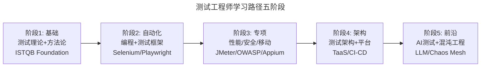
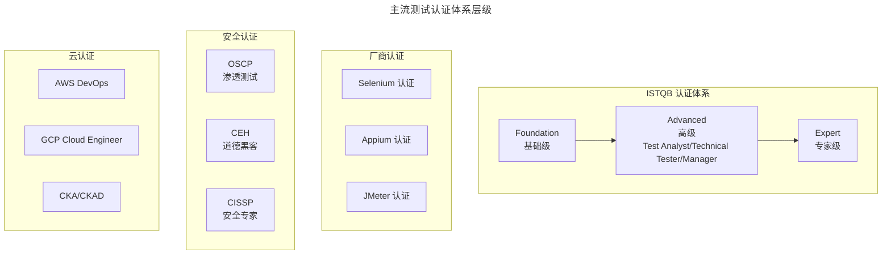

# 测试经典书目与学习资料

## 一、模块介绍

本文汇总软件测试领域的经典书目、在线课程、认证体系、技术社区与开源工具，为测试工程师的持续学习提供系统化的资源地图。资源按"基础→进阶→专项→前沿"分层组织，适配不同阶段的学习需求。

## 二、核心方法论：学习路径规划

## 三、关键流程：资源分类索引

### 3.1 测试基础与理论

| 书目 | 作者 | 核心价值 | 推荐阶段 |
| --- | --- | --- | --- |
| 《Software Testing》 | Ron Patton | 测试思维入门经典 | 初级 |
| 《The Art of Software Testing》 | Glenford Myers | 测试方法论奠基之作 | 初级 |
| 《Lessons Learned in Software Testing》 | Cem Kaner 等 | 测试经验教训 293 条 | 中级 |
| 《Agile Testing》 | Lisa Crispin | 敏捷测试实践指南 | 中级 |
| 《Specification by Example》 | Gojko Adzic | 实例化需求方法论 | 中级 |

### 3.2 测试自动化与工程

| 书目 | 作者 | 核心价值 | 推荐阶段 |
| --- | --- | --- | --- |
| 《Test-Driven Development》 | Kent Beck | TDD 圣经 | 中级 |
| 《Growing Object-Oriented Software》 | Steve Freeman | TDD + Mock 驱动设计 | 高级 |
| 《Unit Testing Principles》 | Vladimir Khorikov | 单元测试最佳实践 | 中级 |
| 《Selenium WebDriver Practical Guide》 | Unmesh Gundecha | Selenium 4 实战 | 中级 |
| 《Web Testing with Playwright》 | 社区 | Playwright 实战 | 中级 |

### 3.3 性能与可靠性

| 书目 | 作者 | 核心价值 | 推荐阶段 |
| --- | --- | --- | --- |
| 《Performance Testing Guidance》 | Microsoft Patterns | 性能测试方法论 | 中级 |
| 《Site Reliability Engineering》 | Google SRE | SRE 与可靠性工程 | 高级 |
| 《Chaos Engineering》 | Casey Rosenthal | 混沌工程实践 | 高级 |
| 《Release It!》 | Michael Nygard | 高可用架构模式 | 高级 |

### 3.4 安全测试

| 书目 | 作者 | 核心价值 | 推荐阶段 |
| --- | --- | --- | --- |
| 《The Web Application Hacker's Handbook》 | Dafydd Stuttard | Web 安全测试圣经 | 中级 |
| 《Hacking: The Art of Exploitation》 | Jon Erickson | 底层安全原理 | 高级 |
| 《The Tangled Web》 | Michał Zalewski | Web 安全深度剖析 | 高级 |

### 3.5 架构与设计

| 书目 | 作者 | 核心价值 | 推荐阶段 |
| --- | --- | --- | --- |
| 《Designing Data-Intensive Applications》 | Martin Kleppmann | 数据密集型系统架构 | 高级 |
| 《Building Microservices》 | Sam Newman | 微服务架构设计 | 高级 |
| 《Observability Engineering》 | Charity Majors | 可观测性工程 | 高级 |

## 四、工具与实践：在线学习资源

### 4.1 认证体系

### 4.2 在线课程与平台

| 平台 | 资源类型 | 推荐内容 |
| --- | --- | --- |
| **Coursera** | 大学课程 | Software Testing（密歇根大学） |
| **Udemy** | 实战课程 | Selenium 4 / Playwright / JMeter |
| **Pluralsight** | 技术课程 | Software Testing Path |
| **极客时间** | 中文专栏 | 软件测试 52 讲、性能测试实战 |
| **Test Automation University** | 免费课程 | 测试自动化专项（testautomationu.applitools.com） |

### 4.3 技术社区与博客

| 社区 | 特色 | 链接 |
| --- | --- | --- |
| **Ministry of Testing** | 全球测试社区 | ministryoftesting.com |
| **Software Testing Weekly** | 测试周报 | softwaretestingweekly.com |
| **Testing Peers** | 测试播客 | testingpeers.com |
| **Sticky Minds** | 测试文章 | stickyMinds.com |
| **TesterHome** | 中文测试社区 | testerhome.com |

### 4.4 开源测试工具速查

| 类别 | 工具 | 语言 | 说明 |
| --- | --- | --- | --- |
| 单元测试 | JUnit 5 / pytest 9 / Jest | Java/Python/JS | 主流单元测试框架 |
| API 测试 | REST Assured / Postman / Karate | Java/JS | API 测试工具 |
| GUI 自动化 | Selenium 4 / Playwright 1.61 / Cypress 15 | 多语言 | 浏览器自动化 |
| 移动测试 | Appium 3 / Espresso / XCUITest | 多语言 | 移动自动化 |
| 性能测试 | JMeter 5.6.3 / k6 / Locust | Java/Go/Python | 性能压测 |
| 安全测试 | OWASP ZAP / Burp Suite / Semgrep | 多语言 | 安全扫描 |
| BDD | Cucumber / Behave / SpecFlow | 多语言 | 行为驱动 |
| 混沌工程 | Chaos Mesh / Litmus / Gremlin | K8s/通用 | 故障注入 |
| 测试报告 | Allure / ReportPortal / Serenity | 多语言 | 测试报告 |
| CI/CD | Jenkins / GitHub Actions / GitLab CI | 通用 | 持续集成 |

## 五、常见误区

### 5.1 只读书不实践

**误区**：阅读大量测试书籍但不编写测试代码。

**纠正**：测试是工程实践，书中的方法论需要通过编码内化。每读一本书应配套至少一个实践项目。

### 5.2 追求认证忽视能力

**误区**：热衷考取多个认证但实际测试能力不匹配。

**纠正**：认证是学习的副产品而非目标。以 ISTQB Foundation 为例，通过认证只代表掌握基础理论，真正的能力需要项目实践积累。

### 5.3 只关注测试领域

**误区**：只读测试书籍，不关注开发、架构、DevOps 领域。

**纠正**：现代测试工程师需要 T 型能力——测试深度 + 技术广度。开发实践、架构设计、DevOps 运维知识缺一不可。

## 六、进阶扩展与参考

### 6.1 持续学习策略

- **每日 30 分钟**：阅读测试博客或社区文章
- **每周 2 小时**：实践新工具或框架
- **每月 1 本书**：系统性学习某一主题
- **每季度 1 次分享**：将学习成果输出为团队分享
- **每年 1 次评估**：复盘技能矩阵，调整学习方向

### 6.2 知识管理

建议使用 Obsidian / Notion 构建个人测试知识库，将学习笔记、实践记录、踩坑经验结构化管理。知识库应支持双向链接，形成知识网络而非知识孤岛。

### 6.3 推荐参考

- 书目：《Software Testing: A Craftsman's Approach》Paul C. Jorgensen
- 社区：Test Automation University（免费高质量课程）
- 播客：Testing Peers / AB Testing（测试思维讨论）
- 时事：Software Testing Weekly（每周测试行业动态）
