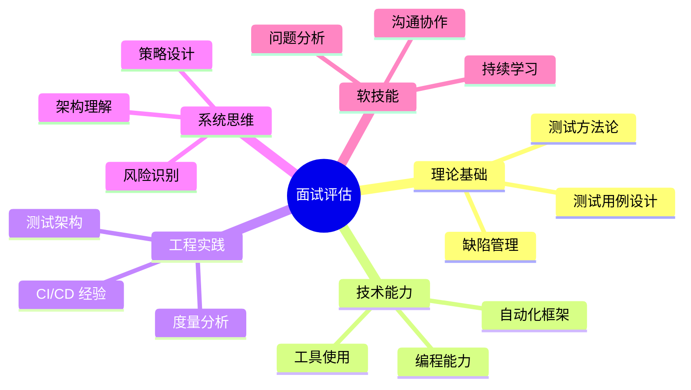
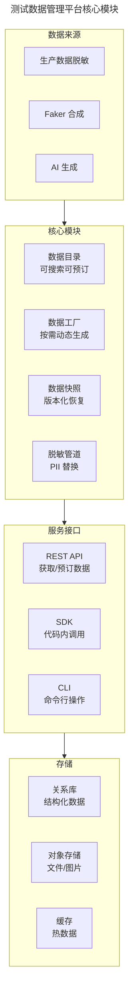

# 测试工程师面试题库

## 一、模块介绍

本文整理测试工程师面试中的高频题目，覆盖测试基础、自动化测试、性能测试、测试开发、架构思维五大领域。每道题附带答题要点与考察意图，既是面试者的备考资料，也是面试官的出题参考。

## 二、核心方法论：面试评估维度

## 三、关键流程：分领域题库

### 3.1 测试基础

**Q1: 等价类划分与边界值分析的区别与联系？**

答题要点：
- 等价类划分关注"输入域的有效/无效分组"，将无限输入归约为有限代表性数据
- 边界值分析关注"等价类边界处的取值"，因为缺陷往往聚集在边界
- 两者互补使用：先用等价类划分确定范围，再用边界值补充边界用例
- 联系：边界值是等价类的补充，而非替代

考察意图：验证测试用例设计方法论的掌握程度。

---

**Q2: 一个登录页面，你会如何设计测试用例？**

答题要点：
- **功能测试**：正确账号密码登录、错误密码、不存在账号、空字段
- **边界值**：密码最大/最小长度、用户名格式边界
- **安全测试**：SQL 注入、XSS、暴力破解限制、密码加密传输
- **兼容性**：不同浏览器、不同设备、不同分辨率
- **性能**：并发登录、登录接口响应时间
- **可用性**：Tab 键导航、回车提交、错误提示友好性
- **异常**：网络中断、服务超时、验证码过期

考察意图：验证测试思维的系统性与全面性——优秀测试工程师能从多维度展开，而非只测"登录成功"。

---

**Q3: 缺陷的 Severity 和 Priority 有什么区别？举例说明不一致的情况。**

答题要点：
- Severity（严重度）是客观影响程度，Priority（优先级）是主观修复紧急度
- 不一致示例：首页品牌 Logo 显示为旧 Logo（Severity 低，但 Priority 高——影响品牌形象需立即修复）
- 不一致示例：深层模块的内存泄漏（Severity 高，但 Priority 低——仅极少数用户触发，可下版本修复）

考察意图：验证缺陷管理理论与实践经验。

### 3.2 自动化测试

**Q4: 测试金字塔的每层应该分配多少比例？你的项目实际比例如何？**

答题要点：
- 经典金字塔：单元 70% / 集成 20% / E2E 10%
- 测试奖杯（前端）：静态检查 + 单元 + 集成 + E2E，集成占比更高
- 实际比例取决于项目特点：后端服务单元测试占比高，前端项目集成测试占比高
- 关键不是比例数字，而是**每层测什么**——单元测内部逻辑、集成测模块交互、E2E 测用户旅程

考察意图：验证测试分层策略的理解与实际项目经验。

---

**Q5: 如何处理 Flaky 测试（偶发失败）？**

答题要点：
- **识别**：同一用例多次运行，通过率 < 95% 判定为 Flaky
- **根因分析**：
  - 同步问题→改用显式等待替代隐式等待
  - 测试数据依赖→用 Testcontainers 或数据工厂隔离
  - 执行顺序依赖→确保用例独立，不依赖执行顺序
  - 环境问题→容器化测试环境
- **治理**：
  - 隔离 Flaky 用例到独立套件，不阻塞 CI
  - 限期修复（如 3 个工作日），超时移除
  - 建立 Flaky 率监控告警

考察意图：验证自动化测试运维经验与问题解决能力。

---

**Q6: Page Object 模式的核心原则是什么？有什么局限性？**

答题要点：
- **核心原则**：页面元素定位与测试逻辑分离——Page 类封装元素与操作，测试类只调用操作
- **优势**：UI 变更时只改 Page 类不改测试脚本；元素定位复用
- **局限性**：
  - 页面复杂时 Page 类膨胀，维护成本高
  - 不适合高度动态的 SPA 应用（元素动态加载）
  - 过度抽象导致"为模式而模式"
- **演进**：Screenplay 模式将"角色-能力-任务"分离，更适合复杂场景

考察意图：验证自动化设计模式的深度理解。

### 3.3 性能测试

**Q7: 负载测试、压力测试、稳定性测试的区别？**

答题要点：
| 测试类型 | 目标 | 施加负载 | 关注指标 |
| --- | --- | --- | --- |
| 负载测试 | 验证预期负载下性能 | 逐步加压到预期 QPS | RT、QPS、资源利用率 |
| 压力测试 | 找到系统容量上限 | 持续加压直到崩溃 | 极限 QPS、崩溃点 |
| 稳定性测试 | 验证长时间运行稳定性 | 预期负载 80% 持续 24h+ | 内存泄漏、连接泄漏 |

考察意图：验证性能测试方法论的系统掌握。

---

**Q8: 性能测试发现 P99 延迟过高，如何定位瓶颈？**

答题要点：
1. **APM 追踪**：用 SkyWalking/Jaeger 查看全链路调用，定位最慢的服务节点
2. **数据库层**：检查慢 SQL 日志、索引使用情况（EXPLAIN）、连接池状态
3. **缓存层**：检查缓存命中率、是否有缓存穿透/雪崩
4. **资源层**：检查 CPU、内存、IO、网络是否达到瓶颈
5. **JVM 层**：用 Arthas/JFR 分析 GC 日志、线程阻塞
6. **外部依赖**：检查第三方 API 调用耗时
7. **代码层**：定位耗时方法（是否有 N+1 查询、锁竞争等）

考察意图：验证性能瓶颈定位的实战能力与工具使用经验。

### 3.4 测试开发

**Q9: 设计一个测试数据管理平台，核心模块有哪些？**

答题要点：

考察意图：验证系统设计能力与测试平台经验。

---

**Q10: 如何设计一个支持多语言的自动化测试框架？**

答题要点：
- **核心抽象**：测试用例 → 测试步骤 → 页面/接口操作 → 底层驱动
- **驱动层**：Selenium/Playwright/Appium 等驱动抽象为统一接口
- **数据层**：测试数据与代码分离（YAML/JSON/Excel）
- **报告层**：统一报告格式（Allure 适配多语言）
- **CI 集成**：框架通过 CLI 触发，支持 CI 流水线调用
- **配置驱动**：环境/浏览器/设备等通过配置文件切换
- **关键设计原则**：关注点分离、开闭原则、依赖注入

考察意图：验证框架设计能力与架构思维。

### 3.5 架构与综合

**Q11: 微服务架构下，API 测试与契约测试的关系是什么？**

答题要点：
- **API 测试**：验证单个服务的 API 行为是否符合规格（黑盒）
- **契约测试**：验证消费者与服务者之间的接口约定是否一致（灰盒）
- **关系**：
  - 契约测试是 API 测试在微服务场景下的补充
  - API 测试验证"服务自己的行为"，契约测试验证"服务间协作的一致性"
  - 契约测试由消费者驱动——消费者定义期望，提供者验证满足
- **工具**：Pact / Spring Cloud Contract
- **价值**：减少集成测试的"全链路联调"成本，在 CI 中早期发现接口不兼容

考察意图：验证微服务测试策略的理解深度。

---

**Q12: 如果让你从零搭建一个团队的测试体系，你会如何规划？**

答题要点：
1. **评估现状**：团队规模、技术栈、现有测试覆盖、CI 成熟度
2. **制定策略**：测试分层、自动化比例、质量门禁
3. **优先建设**：
   - 第一步：CI 流水线 + 单元测试门禁
   - 第二步：API 自动化 + 集成测试
   - 第三步：E2E 关键路径 + 性能基线
   - 第四步：测试平台 + 度量体系
4. **渐进推进**：不追求一步到位，按 Sprint 迭代改进
5. **文化建设**：推行"全员质量"理念，开发者写单元测试
6. **度量驱动**：建立质量指标看板，持续监控改进

考察意图：验证系统性思维、优先级判断与落地执行能力。

## 四、工具与实践：行为面试题

### 4.1 情境题

**Q13: 描述一个你发现的关键缺陷，以及发现过程。**

答题要点框架（STAR 法）：
- **Situation**：项目背景与测试场景
- **Task**：你的测试目标
- **Action**：你用了什么方法发现缺陷（探索式测试？边界值？直觉？）
- **Result**：缺陷的影响、修复过程、后续改进

考察意图：验证实际测试经验与问题发现能力。

---

**Q14: 开发认为你报的 Bug 不是 Bug，你怎么处理？**

答题要点：
1. **确认理解**：先确认双方对需求的理解是否一致（引用需求文档）
2. **重现演示**：提供清晰的复现步骤与环境，当面演示
3. **影响分析**：说明该问题对用户/业务的影响
4. **升级机制**：如无法达成一致，提交产品经理或缺陷会诊裁决
5. **记录归档**：无论结果如何，记录讨论过程与决策依据
6. **心态**：对事不对人，目标是产品质量而非"证明谁对"

考察意图：验证沟通协作与冲突处理能力。

## 五、常见误区

### 5.1 面试只背概念

**误区**：面试前背诵测试概念定义，期望"标准答案"得分。

**纠正**：面试官更关注**理解深度**与**实战经验**。概念只是起点，面试会追问"你在项目中是怎么做的""遇到什么问题""如何解决"。

### 5.2 忽视编码能力

**误区**：认为测试工程师不需要编程能力，面试不准备编码题。

**纠正**：现代测试工程师必须具备编程能力——自动化测试、测试平台开发、性能脚本编写都依赖编码。面试中编码题是标配。

### 5.3 不了解业务

**误区**：面试只准备技术，不研究目标公司的业务领域。

**纠正**：测试策略依赖业务上下文。面试中"如何测试 XX 功能"是常见题，不了解业务只能给出通用答案，无法展现针对性思考。

## 六、进阶扩展与参考

### 6.1 面试反问环节

面试结束时的"你有什么问题想问我们？"是评估候选人的重要环节。优秀反问示例：
- "团队目前的测试自动化覆盖率是多少？最大的测试挑战是什么？"
- "测试工程师在这个团队的职业发展路径是怎样的？"
- "团队的 CI/CD 成熟度如何？测试在流水线中的角色是什么？"
- "团队如何衡量测试工程师的绩效？"

### 6.2 不同级别面试重点

| 级别 | 面试重点 |
| --- | --- |
| 初级测试 | 测试基础理论、用例设计思维、学习态度 |
| 中级测试 | 自动化实战、工具使用、问题分析 |
| 高级测试 | 测试架构、策略设计、团队协作 |
| 测试专家 | 质量体系、技术战略、行业视野 |

### 6.3 推荐参考

- 书目：《Cracking the Coding Interview》（编码面试通用）
- 社区：TesterHome 面试板块
- 实践：LeetCode（编码能力）
- 实践：Test Automation University（自动化实战）
