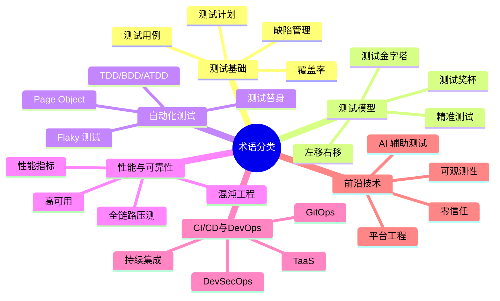

# 术语表

## 一、模块介绍

本文收录测试领域文档中出现的专业术语，提供中英文对照与简要释义。术语按字母顺序排列，便于查阅。每个术语首次出现于正文时标注英文原文，本表作为集中索引与补充说明。

## 二、核心方法论：术语分类索引

## 三、关键流程：术语详解

### A

| 术语 | 英文 | 释义 |
| --- | --- | --- |
| **ATDD** | Acceptance Test-Driven Development | 验收测试驱动开发，在编码前将需求转化为可执行的验收测试 |
| **APM** | Application Performance Monitoring | 应用性能监控，实时监控系统性能指标 |
| **Allure** | Allure Framework | 开源测试报告框架，支持多语言多框架 |
| **Appium** | Appium | 跨平台移动应用自动化测试框架 |
| **Arthas** | Arthas | 阿里开源的 Java 诊断工具，4.3.2 版本含 MCP/AI Agent |

### B

| 术语 | 英文 | 释义 |
| --- | --- | --- |
| **BDD** | Behavior-Driven Development | 行为驱动开发，用 Given-When-Then 语法描述行为并自动验证 |
| **BVT** | Build Verification Test | 构建验证测试，验证构建的基本可用性 |
| **BrowserStack** | BrowserStack | 云真机与浏览器测试 SaaS 平台 |

### C

| 术语 | 英文 | 释义 |
| --- | --- | --- |
| **CI/CD** | Continuous Integration / Continuous Delivery | 持续集成/持续交付 |
| **Checkov** | Checkov | IaC 安全扫描工具，支持 Terraform/K8s/CloudFormation |
| **Chaos Engineering** | Chaos Engineering | 混沌工程，主动注入故障验证系统韧性 |
| **Chaos Mesh** | Chaos Mesh | CNCF 毕业项目，K8s 原生混沌工程平台 |
| **Contract Testing** | Contract Testing | 契约测试，验证微服务间接口约定一致性 |
| **Cucumber** | Cucumber | BDD 工具，支持 Gherkin 语法 |
| **Cypress** | Cypress | 现代前端 E2E 测试框架 |
| **Code Coverage** | Code Coverage | 代码覆盖率，衡量测试覆盖代码的比例 |
| **Cyclomatic Complexity** | Cyclomatic Complexity | 圈复杂度，衡量代码逻辑复杂度 |

### D

| 术语 | 英文 | 释义 |
| --- | --- | --- |
| **DAST** | Dynamic Application Security Testing | 动态应用安全测试，运行时探测漏洞 |
| **DDT** | Data-Driven Testing | 数据驱动测试，用数据表驱动测试执行 |
| **DoD** | Definition of Done | 完成定义，用户故事标记为"完成"的统一标准 |
| **DoR** | Definition of Ready | 就绪定义，用户故事进入 Sprint 前的条件 |
| **DevSecOps** | Development Security Operations | 将安全融入 DevOps 全流程的理念 |
| **Docker** | Docker | 容器化平台，实现环境即代码 |

### E

| 术语 | 英文 | 释义 |
| --- | --- | --- |
| **E2E Testing** | End-to-End Testing | 端到端测试，从用户视角验证完整业务流程 |
| **ET** | Exploratory Testing | 探索式测试，测试设计与执行融为一体的方法 |
| **eBPF** | extended Berkeley Packet Filter | 内核级无侵入观测技术 |

### F

| 术语 | 英文 | 释义 |
| --- | --- | --- |
| **Flaky Test** | Flaky Test | 偶发失败测试，相同输入下时而通过时而失败 |
| **Faker** | Faker | 测试数据合成库，生成随机但合理的测试数据 |
| **FastAPI** | FastAPI | Python 现代 Web 框架，常用于测试平台开发 |

### G

| 术语 | 英文 | 释义 |
| --- | --- | --- |
| **Gherkin** | Gherkin | BDD 的结构化语法，Given-When-Then 三段式 |
| **GitOps** | GitOps | 以 Git 仓库为单一可信源的持续部署模式 |

### H

| 术语 | 英文 | 释义 |
| --- | --- | --- |
| **HTSM** | Heuristic Test Strategy Model | 启发式测试策略模型，Cem Kaner 提出 |
| **Helm** | Helm | K8s 包管理工具 |

### I

| 术语 | 英文 | 释义 |
| --- | --- | --- |
| **IAST** | Interactive Application Security Testing | 交互式安全测试，运行时插桩分析 |
| **IDP** | Internal Developer Platform | 内部开发者平台 |
| **ISTQB** | International Software Testing Qualifications Board | 国际软件测试认证委员会 |
| **INVEST** | Independent Negotiable Valuable Estimable Small Testable | 用户故事质量原则 |

### J

| 术语 | 英文 | 释义 |
| --- | --- | --- |
| **JaCoCo** | Java Code Coverage | Java 代码覆盖率工具 |
| **Jaeger** | Jaeger | 分布式链路追踪系统 |
| **Jenkins** | Jenkins | 开源 CI/CD 服务器 |
| **JMeter** | Apache JMeter | 开源性能测试工具，5.6.3 为当前稳定版 |
| **JUnit 5** | JUnit 5 | Java 主流单元测试框架，Jupiter 为核心 |

### K

| 术语 | 英文 | 释义 |
| --- | --- | --- |
| **k6** | k6 | Grafana 出品的云原生压测工具，Go 编写 |
| **Kubernetes** | Kubernetes (K8s) | 容器编排平台 |

### L

| 术语 | 英文 | 释义 |
| --- | --- | --- |
| **LLM** | Large Language Model | 大语言模型 |
| **Locust** | Locust | Python 编写的分布式压测工具 |
| **Living Documentation** | Living Documentation | 活文档，永远与代码同步的需求文档 |

### M

| 术语 | 英文 | 释义 |
| --- | --- | --- |
| **MBT** | Model-Based Testing | 基于模型的测试，从系统行为模型自动生成用例 |
| **Mock** | Mock Object | 模拟对象，测试替身的一种 |
| **MTTR** | Mean Time To Repair | 平均修复时间 |
| **MTBF** | Mean Time Between Failures | 平均无故障时间 |
| **MFA** | Multi-Factor Authentication | 多因素认证 |

### N

| 术语 | 英文 | 释义 |
| --- | --- | --- |
| **Newman** | Newman | Postman 集合的命令行运行器 |

### O

| 术语 | 英文 | 释义 |
| --- | --- | --- |
| **ODC** | Orthogonal Defect Classification | 正交缺陷分类，IBM 提出的缺陷分析方法 |
| **OWASP** | Open Web Application Security Project | 开放 Web 应用安全项目 |
| **Observability** | Observability | 可观测性，日志+指标+追踪三支柱 |

### P

| 术语 | 英文 | 释义 |
| --- | --- | --- |
| **POM** | Page Object Model | 页面对象模型，GUI 自动化设计模式 |
| **Pact** | Pact | 消费者驱动的契约测试框架 |
| **Playwright** | Playwright | Microsoft 出品的现代 E2E 测试框架 |
| **Postman** | Postman | API 开发与测试平台 |
| **Pentest** | Penetration Testing | 渗透测试 |
| **Prometheus** | Prometheus | 开源监控与告警系统 |
| **pytest** | pytest | Python 主流测试框架，9.1.1 为当前版本 |

### Q

| 术语 | 英文 | 释义 |
| --- | --- | --- |
| **QPS** | Queries Per Second | 每秒查询数 |
| **Quality Gate** | Quality Gate | 质量门禁 |

### R

| 术语 | 英文 | 释义 |
| --- | --- | --- |
| **RASP** | Runtime Application Self-Protection | 运行时应用自保护 |
| **REST Assured** | REST Assured | Java API 测试框架 |
| **RTO** | Recovery Time Objective | 恢复时间目标 |
| **RPO** | Recovery Point Objective | 恢复数据点目标 |
| **RBT** | Risk-Based Testing | 风险驱动测试 |

### S

| 术语 | 英文 | 释义 |
| --- | --- | --- |
| **SAST** | Static Application Security Testing | 静态应用安全测试 |
| **SBTM** | Session-Based Test Management | 基于会话的测试管理 |
| **SBE** | Specification by Example | 实例化需求 |
| **Screenplay Pattern** | Screenplay Pattern | 角色-能力-任务的自动化设计模式 |
| **Selenium** | Selenium | 浏览器自动化框架，4.42.0 为当前版本 |
| **Selenium Grid** | Selenium Grid | 分布式浏览器执行环境 |
| **SETI** | Software Engineer, Tools and Infrastructure | Google 测试基础设施工程师 |
| **SLO/SLA** | Service Level Objective / Agreement | 服务级别目标/协议 |
| **SonarQube** | SonarQube | 代码质量与安全扫描平台 |
| **SkyWalking** | Apache SkyWalking | APM 与分布式追踪，10.4.0 为当前版本 |
| **Specflow** | Specflow | .NET BDD 框架 |
| **STRIDE** | Spoofing Tampering Repudiation Info Disclosure DoS Elevation | 威胁建模分类法 |
| **SDET** | Software Development Engineer in Test | 测试开发工程师 |

### T

| 术语 | 英文 | 释义 |
| --- | --- | --- |
| **TDD** | Test-Driven Development | 测试驱动开发，红-绿-重构循环 |
| **TaaS** | Testing as a Service | 测试即服务 |
| **Testcontainers** | Testcontainers | 测试中临时创建 Docker 容器的工具库 |
| **Test Trophy** | Test Trophy | 测试奖杯模型，前端测试分层策略 |
| **TMMi** | Test Maturity Model integration | 测试成熟度模型集成 |
| **TPI** | Test Process Improvement | 测试过程改进模型 |
| **Toxiproxy** | Toxiproxy | 网络故障模拟工具 |
| **Trivy** | Trivy | 容器镜像与依赖安全扫描工具 |

### U

| 术语 | 英文 | 释义 |
| --- | --- | --- |
| **UAT** | User Acceptance Testing | 用户验收测试 |

### V

| 术语 | 英文 | 释义 |
| --- | --- | --- |
| **V-Model** | V-Model | V 模型，开发与测试对应的瀑布变体 |

### W

| 术语 | 英文 | 释义 |
| --- | --- | --- |
| **WAF** | Web Application Firewall | Web 应用防火墙 |
| **Whole Team** | Whole Team Approach | 全功能团队方法 |
| **WireMock** | WireMock | Java HTTP Mock Server |

### X

| 术语 | 英文 | 释义 |
| --- | --- | --- |
| **XCUITest** | XCUITest | iOS UI 自动化测试框架 |
| **XPath** | XML Path Language | XML/HTML 元素定位语言 |

### Z

| 术语 | 英文 | 释义 |
| --- | --- | --- |
| **Zero Trust** | Zero Trust Architecture | 零信任架构，永不信任始终验证 |

### 数字与符号

| 术语 | 英文 | 释义 |
| --- | --- | --- |
| **3 Amigos** | Three Amigos | 产品+开发+测试的三方协作会议 |
| **5 Whys** | 5 Whys | 连续追问 5 个"为什么"的根因分析方法 |

## 四、工具与实践：缩写速查

### 4.1 测试角色缩写

| 缩写 | 全称 | 说明 |
| --- | --- | --- |
| QA | Quality Assurance | 质量保证 |
| QC | Quality Control | 质量控制 |
| SDET | Software Development Engineer in Test | 测试开发工程师 |
| SET | Software Engineer in Test | 测试软件工程师 |
| SETI | Software Engineer, Tools and Infrastructure | 测试基础设施工程师 |
| QA Lead | Quality Assurance Lead | 质量保证负责人 |

### 4.2 测试指标缩写

| 缩写 | 全称 | 说明 |
| --- | --- | --- |
| RT | Response Time | 响应时间 |
| QPS | Queries Per Second | 每秒查询数 |
| TPS | Transactions Per Second | 每秒事务数 |
| P99 | 99th Percentile | 99 分位数 |
| SLA | Service Level Agreement | 服务级别协议 |
| SLO | Service Level Objective | 服务级别目标 |
| MTTR | Mean Time To Repair | 平均修复时间 |
| MTBF | Mean Time Between Failures | 平均无故障时间 |
| RTO | Recovery Time Objective | 恢复时间目标 |
| RPO | Recovery Point Objective | 恢复数据点目标 |

## 五、常见误区

### 5.1 概念混淆

**常见混淆**：将 Severity（严重度）与 Priority（优先级）混用、将 SLA 与 SLO 混用、将 Mock 与 Stub 混用。

**纠正**：本文术语表已明确区分。Severity 是客观影响，Priority 是主观紧急度；SLA 是对外承诺，SLO 是内部目标；Mock 验证交互行为，Stub 仅提供预设返回值。

### 5.2 缩写不求甚解

**误区**：知道缩写含义但不理解其背后的方法论。

**纠正**：每个缩写背后是一套方法论或工具体系。如 TDD 不仅是"先写测试"，更是"红-绿-重构"的工程循环与设计反馈机制。

## 六、进阶扩展与参考

### 6.1 术语演变追踪

测试领域的术语随技术演进不断更新。建议关注以下术语演变趋势：
- **测试左移/右移** → **全生命周期质量**
- **测试自动化** → **智能测试（AI 辅助）**
- **QA** → **Quality Engineering（QE）**
- **测试环境** → **弹性测试基础设施**

### 6.2 术语标准化参考

- 标准：ISTQB Glossary（glossary.istqb.org）
- 标准：IEEE Standard Glossary of Software Engineering Terminology
- 标准：ISO/IEC 25000 系列质量模型术语

### 6.3 推荐参考

- 在线术语表：ISTQB Glossary（持续更新）
- 社区：Ministry of Testing 术语库
- 书目：《Software Testing Dictionary》
