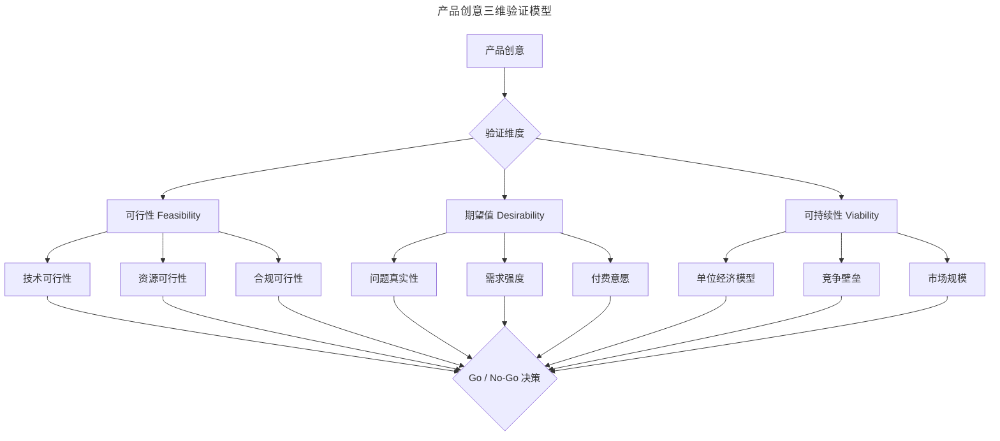
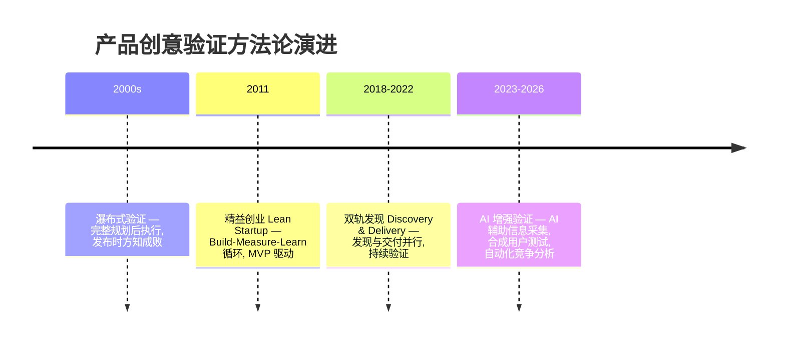
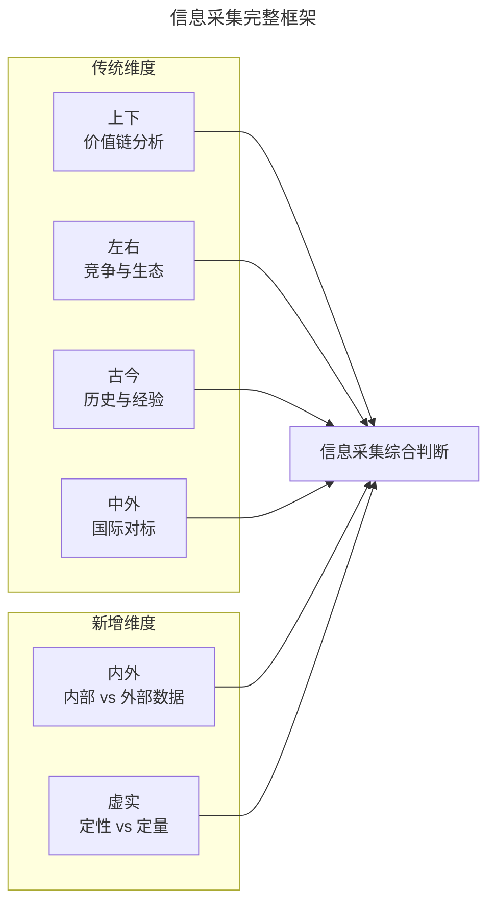
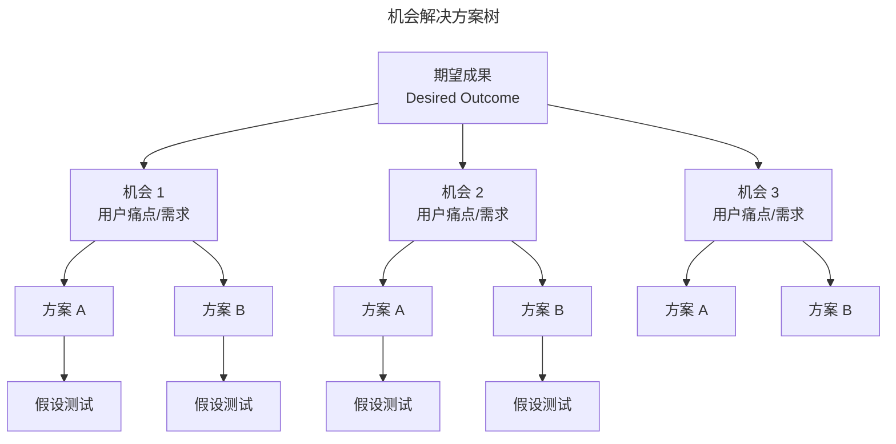

# 01 | 产品创意的系统化验证方法

> **适用范围**：产品经理、创业者、需要验证产品创意的团队负责人。适用于产品启动阶段的信息采集、创意验证、Go/No-Go 决策、AI 辅助验证等场景。
>
> **更新摘要（v2 · 2026-08 更新）**：
> - 结构化升级为 6 节骨架（导言 / 核心方法论 / 关键流程 / 工具与实战 / 常见误区 / 进阶延展）
> - 保留可行性/期望值/可持续性三维验证模型与"上下左右古今中外"分析框架，扩展"内外""虚实"新维度
> - 保留全部 Mermaid 图并补充 `--- title: ... ---` frontmatter，每张图后追加文字解读
> - 参考资料融入进阶延展

---

## 1. 导言

产品创意验证是产品启动阶段的核心环节，指在投入大量研发资源之前，通过系统化的信息采集与假设检验，评估产品创意的可行性（Feasibility）、期望值（Desirability）与可持续性（Viability）的过程。

本文基于 Lean Startup 与 Discovery & Delivery 双轨框架，系统阐述从信息采集到创意验证的完整方法论，涵盖"上下左右、古今中外"信息分析模型的现代化重构，并结合 2024–2026 年 AI 辅助创意验证的最新实践，提出可操作的验证流程与决策标准。

### 1.1 核心定义

**产品创意验证（Idea Validation）** 是指在产品开发投入之前，通过结构化的信息收集与假设检验，对创意的可行性、市场期望值与商业可持续性进行系统性评估的流程（Blank, 2020; Cagan, 2020）。其核心目标是将不确定性转化为可量化的风险，从而为资源分配决策提供依据。

### 1.2 三个核心维度

| 维度 | 英文 | 核心问题 | 验证目标 |
|------|------|----------|----------|
| 可行性 | Feasibility | 我们能否构建这个产品？ | 技术能力、资源约束、合规边界 |
| 期望值 | Desirability | 用户是否真正需要这个产品？ | 问题真实性、需求强度、付费意愿 |
| 可持续性 | Viability | 这个产品能否持续创造商业价值？ | 单位经济模型、竞争壁垒、市场规模 |

> **图解**：产品创意验证从三个维度展开——可行性（技术、资源、合规）、期望值（问题真实性、需求强度、付费意愿）、可持续性（单位经济模型、竞争壁垒、市场规模），三个维度的子项综合评估后做出 Go/No-Go 决策。

### 1.3 与相关概念辨析

| 概念 | 英文 | 定义 | 与创意验证的关系 |
|------|------|------|-----------------|
| 创意验证 | Idea Validation | 评估创意是否值得投入资源 | 本主题 |
| 概念验证 | Proof of Concept, PoC | 验证技术方案的可行性 | 创意验证的子集，聚焦技术维度 |
| MVP 验证 | Minimum Viable Product | 用最小可用产品验证核心假设 | 创意验证的后续执行阶段 |
| 产品市场匹配 | Product-Market Fit, PMF | 产品满足市场需求的程度 | 创意验证的终极目标 |
| 假设检验 | Assumption Testing | 针对特定假设设计实验并验证 | 创意验证的核心方法论 |

### 1.4 验证方法论的演进

> **图解**：产品创意验证方法论从 2000 年代的瀑布式验证（发布时才知成败），演进到 2011 年精益创业的 Build-Measure-Learn 循环、2018-2022 年双轨发现（发现与交付并行），再到 2023-2026 年的 AI 增强验证（AI 辅助信息采集、合成用户测试、自动化竞争分析），验证周期从数周缩短至数天。

**Lean Startup（Eric Ries, 2011）** 提出 Build-Measure-Learn 循环，将验证从"发布后检验"转变为"迭代中验证"。**双轨发现（Dual-Track Discovery & Delivery）** 由 Marty Cagan 和 Jeff Patton 推广，将产品发现（学习该做什么）与产品交付（构建产品）并行推进。

---

## 2. 核心方法论：信息采集框架

产品创意不会孤立存在，而是嵌入于特定的行业定位与价值链之中。在创意之初，首要任务是系统化地采集信息。"上下左右、古今中外"提供了一个经实践检验的信息分析框架。

### 2.1 "上下"：价值链分析

**上游（Upstream）** 关注核心资源的供给端，**下游（Downstream）** 关注需求端与消费端：

| 分析维度 | 上游关键问题 | 下游关键问题 |
|----------|-------------|-------------|
| 供给结构 | 核心资源从何而来？供给集中度如何？ | 用户群体画像？消费频率与能力？ |
| 痛点分布 | 供给端是否存在未被满足的需求？ | 消费端的核心痛点是什么？ |
| 话语权 | 是否存在掌握绝对话语权的供应商？ | 买方议价能力如何？ |
| 替代性 | 上游资源是否有替代渠道？ | 下游是否有替代解决方案？ |
| 边际成本 | 供给边际成本是递增还是递减？ | 获客边际成本趋势如何？ |

**现代化工具**：Crunchbase / PitchBook AI 用于供应链结构分析；LinkedIn Sales Navigator 用于关键角色映射；Perplexity AI 用于快速行业研究。

### 2.2 "左右"：竞争格局与行业环境

**广义竞品（Broad Competitive Landscape）** 的分析不应局限于直接竞品：

| 竞争层次 | 示例 | 分析重点 |
|----------|------|----------|
| 直接竞品 | 网络文学产品之间的竞争 | 功能、定价、用户体验对比 |
| 间接竞品 | 短视频 vs 即时通讯（用户时长竞争） | 用户注意力分配与场景替代 |
| 跨行业竞品 | 柯达 vs 诺基亚（技术范式迁移） | 技术颠覆风险与行业边界变化 |
| 潜在进入者 | AI 生成内容对创作者生态的影响 | 进入壁垒变化与新玩家威胁 |

**行业环境**涵盖政策法规、舆论环境与行业潜规则。例如，美食共享平台需在启动前完成食品安全合规评估；数据驱动型产品需满足 GDPR/CCPA/《个人信息保护法》等隐私法规要求。

**现代化工具**：Klue / Crayon 提供 AI 驱动的竞争情报自动追踪；Brandwatch AI 实现社交聆听与舆情监控。

### 2.3 "古今"：历史脉络与经验借鉴

大部分产品问题并非首次出现。理解行业与竞品的发展历程，有助于识别已被验证的路径和已被证伪的假设：

| 分析维度 | 关键问题 | 方法 |
|----------|---------|------|
| 问题成因 | 当前痛点产生的历史原因是什么？ | 行业史研究、专家访谈 |
| 前人尝试 | 是否有人试图解决过？为何未成气候？ | 失败案例分析、专利检索 |
| 技术周期 | 当前处于技术成熟度曲线的哪个阶段？ | Gartner Hype Cycle 对照 |
| 周期规律 | 行业是否存在周期性波动？ | 时间序列数据分析 |

**经验法则**：iPad 并非首部掌上电脑，iPhone 4 亦非首部高分辨率手机，Google 亦非首个搜索引擎。先行者的经验教训应当成为后继者的决策输入，而非被重复踩坑。

### 2.4 "中外"：国际对标与出海机遇

| 分析方向 | 核心思路 | 注意事项 |
|----------|---------|---------|
| 洋为中用 | 欧美先进经验的对标与本土化改造 | 需充分理解中外市场环境差异 |
| 逆向出海 | 中国成熟模式的海外复制 | 东南亚、中东、非洲市场的本地化适配 |
| 跨市场验证 | 同一创意在不同市场的差异化表现 | 避免简单复制，需验证市场假设 |

### 2.5 新增维度："内外"与"虚实"

在传统六维度基础上，2024–2026 年的实践表明，以下两个维度同样不可或缺：

| 新增维度 | 定义 | 工具支撑 |
|----------|------|---------|
| **内外** | 内部数据（产品分析、用户反馈、工单）vs 外部数据（市场趋势、社交舆情、竞品动态） | Amplitude / Mixpanel（内部）；G2 / Capterra（外部） |
| **虚实** | 定性洞察（访谈、调研）vs 定量行为数据（A/B 测试、埋点分析） | Dovetail（定性）；PostHog / Heap（定量） |

### 2.6 信息采集完整框架

> **图解**：信息采集完整框架由传统四维度（上下价值链、左右竞争生态、古今历史经验、中外国际对标）与新增两维度（内外、虚实）综合构成，六维度汇入信息采集综合判断。

---

## 3. 关键流程

### 3.1 信息采集渠道与方法

**渠道对比矩阵**：

| 渠道 | 信息深度 | 时效性 | 系统性 | 获取成本 | 适用场景 |
|------|---------|--------|--------|---------|---------|
| 体系化课程 | ★★★★★ | ★★☆☆☆ | ★★★★★ | 高（时间投入大） | 建立行业认知框架 |
| 行业专家访谈 | ★★★★☆ | ★★★★☆ | ★★★☆☆ | 中（需社交资本） | 获取第一手洞察 |
| 专业书籍 | ★★★★☆ | ★★☆☆☆ | ★★★★☆ | 低 | 构建系统性知识体系 |
| 财报与分析报告 | ★★★☆☆ | ★★★★★ | ★★★★☆ | 中 | 获取市场规模与竞争数据 |
| 行业资讯与论坛 | ★★☆☆☆ | ★★★★★ | ★★☆☆☆ | 低 | 追踪热点与舆情 |
| AI 辅助研究工具 | ★★★☆☆ | ★★★★★ | ★★★☆☆ | 低 | 快速信息采集与综合 |

### 3.2 AI 增强信息采集（2024–2026 年实践）

**研究综合类**：Perplexity AI（实时网络搜索与综合，快速行业研究）；Elicit（学术论文综合，获取同行评审的市场研究）；Consensus（基于研究证据的回答，验证行业假设）。

**竞争情报类**：Klue（AI 驱动竞争情报平台，自动追踪竞品动态并生成 Battle Card）；Crayon（自动化竞品网站、定价与定位变更监控）。

**市场数据类**：Crunchbase AI（融资、并购与供应链结构分析）；Statista AI（全球市场统计数据查询）。

> **注意事项**：AI 生成内容可能存在幻觉（Hallucination）问题。建议采用**三角验证法（Triangulation）**——至少结合三种独立来源交叉验证关键信息，方可作为决策依据。

### 3.3 创意验证的实践方法论

**Opportunity Solution Tree（机会解决方案树）**——由 Teresa Torres 在 *Continuous Discovery Habits*（2021）中提出：

> **图解**：机会解决方案树将验证过程结构化为三层——期望成果（Desired Outcome）分解为多个机会（用户痛点/需求），每个机会生成多个方案，每个方案对应假设测试。核心原则：聚焦成果而非产出、每个机会至少两个方案避免过早收敛、对关键假设优先测试。

**Assumption Mapping（假设映射）**——通过重要性 × 证据量矩阵进行优先级排序：

| | 证据充分（高确定性） | 证据不足（低确定性） |
|---|---|---|
| **高重要性** | 已验证基础：持续监控 | **信念之跃（Leap of Faith）**：优先测试 |
| **低重要性** | 辅助信息：无需额外投入 | 干扰项：忽略 |

**假设类型分类**：期望值假设（Desirability，用户是否需要/付费/切换）、可行性假设（Feasibility，团队技术能否支撑）、可持续性假设（Viability，单位经济模型、获客成本）。

**Design Sprint（设计冲刺）**——Google Ventures 提出的 5 天快速验证方法：

| 天数 | 活动 | 产出 |
|------|------|------|
| Day 1 | Map（理解问题） | 问题地图与目标聚焦 |
| Day 2 | Sketch（生成方案） | 独立方案草图 |
| Day 3 | Decide（方案选择） | 选定验证方案 |
| Day 4 | Prototype（构建原型） | 可交互原型 |
| Day 5 | Test（用户测试） | 5 位用户的测试反馈 |

**2024–2026 年演进**：Design Sprint 2.0 压缩为 4 天；远程设计冲刺协议已成熟；AI 原型工具（v0.dev、Galileo AI）将原型构建时间从 1 天缩短至数小时。

---

## 4. 工具与实战

### 4.1 AI 辅助验证（2024–2026 年前沿实践）

| 验证阶段 | AI 工具/方法 | 说明 |
|----------|-------------|------|
| 假设识别 | AI 辅助假设挖掘 | 基于创意描述自动生成假设清单 |
| 早期筛选 | 合成用户测试（Synthetic Users） | 用 AI 模拟目标用户进行概念测试，注意仅作早期筛选用途 |
| 用户研究 | Dovetail AI / Notably AI | 自动转录、标签提取、情感分析、主题聚类 |
| 原型测试 | Maze AI / v0.dev | AI 驱动的可用性测试与快速原型生成 |
| 竞争分析 | Klue / Crayon | 自动追踪竞品动态、生成竞争定位文档 |

> **关键警示**：AI 合成用户测试不能替代真实用户验证。其价值在于快速排除明显不可行的方案，而非做出最终决策。

### 4.2 Go/No-Go 决策框架

**问题-方案匹配度指标**：

| 指标 | 通过阈值 | 测量方法 |
|------|---------|---------|
| 问题验证率 | >60% 的用户确认问题存在 | 用户访谈、调研 |
| 付费意愿 | >40% 表达付费意愿 | 预购、定金、调研 |
| 问题频率 | 每周或更高频次 | 日记研究、调研 |
| 问题严重度 | "非常困扰"及以上评级 | 量表评分 |

**产品市场匹配度指标**：

| 指标 | 通过阈值 | 测量方法 |
|------|---------|---------|
| Sean Ellis PMF 测试 | >40% 用户表示"非常失望" | 标准化问卷 |
| 留存曲线 | 趋于平稳（不归零） | 队列分析 |
| 净收入留存率（NRR） | >100%（B2B SaaS） | 收入分析 |
| 有机增长占比 | >30% 新用户来自口碑/推荐 | 归因追踪 |

**决策矩阵**：

| 场景 | 使用率 | 留存率 | 判断 | 行动 |
|------|--------|--------|------|------|
| 伪需求 | 低 | 低 | **Kill** | 停止投入，重新审视问题假设 |
| 体验问题 | 高 | 低 | **Investigate** | 排查是功能不足还是体验缺陷 |
| 小众机会 | 低 | 高 | **Niche** | 收窄目标用户，聚焦核心场景 |
| 验证通过 | 高 | 高 | **Proceed** | 扩大投入，进入下一阶段 |

---

## 5. 常见误区

### 5.1 信息采集误区

| 误区 | 表现 | 正确做法 |
|------|------|---------|
| **局限于直接竞品** | 只分析直接竞品，忽视间接/跨行业竞争 | 用"左右"框架扩展到用户时长、技术范式迁移 |
| **重复踩坑** | 忽视行业历史，重复前人的失败 | 用"古今"框架研究前人的尝试与经验教训 |
| **简单复制海外** | 直接套用欧美模式到中国市场 | 用"中外"框架充分理解市场环境差异 |
| **盲信 AI 信息** | 直接采用 AI 生成的研究结论 | 用三角验证法交叉验证关键信息 |

### 5.2 验证方法误区

| 误区 | 表现 | 正确做法 |
|------|------|---------|
| **过早收敛** | 每个机会只考虑一个方案 | 每个机会至少生成两个方案 |
| **忽视信念之跃** | 对高重要性但证据不足的假设不测试 | 优先测试"信念之跃"假设 |
| **合成用户替代真实** | 用 AI 合成用户测试做最终决策 | 合成用户仅作早期筛选，最终需真实用户验证 |
| **项目制一次性验证** | 每季度才做一次大规模调研 | 采用持续发现，每周 2-3 次用户访谈 |

---

## 6. 进阶延展

### 6.1 AI 重塑创意验证流程

大语言模型（LLM）的普及正在从三个层面重塑创意验证：
1. **信息采集加速**：AI 可在数分钟内完成过去需数天的行业研究，但需警惕幻觉问题。
2. **假设测试前置**：合成用户测试允许在接触真实用户前进行快速筛选，将验证成本降低一个数量级。
3. **决策辅助增强**：AI 可辅助进行多维度数据综合，但最终决策仍需人类判断。

### 6.2 从项目制到持续发现

传统"项目制"研究（每季度一次大规模调研）正在被**持续发现（Continuous Discovery）** 取代。Teresa Torres 建议产品团队每周至少进行 2–3 次用户访谈，将验证嵌入日常工作流程，而非作为独立项目执行。

### 6.3 隐私计算对数据采集的影响

GDPR、CCPA 与中国《个人信息保护法》的实施，使得用户行为数据的采集面临更严格的合规要求。2024–2026 年的趋势是：第一方数据（First-party Data）价值显著上升；隐私计算技术（Federated Learning、Differential Privacy）在用户研究中的应用；Session Replay 工具需提供更精细的数据脱敏与同意管理功能。

### 6.4 参考文献

1. Blank, S. (2020). *The Startup Owner's Manual*. Wiley.
2. Cagan, M. (2020). *Empowered: Ordinary People, Extraordinary Products*. Wiley.
3. Ries, E. (2011). *The Lean Startup*. Crown Business.
4. Torres, T. (2021). *Continuous Discovery Habits*. Product Talk LLC.
5. Gothelf, J. & Seiden, J. (2017). *Sense and Respond*. Harvard Business Review Press.
6. Knapp, J. (2016). *Sprint*. Simon & Schuster.
7. CB Insights. (2026). *Top Reasons Startups Fail*.
8. Klein, G. (2007). Performing a Project Premortem. *Harvard Business Review*, 85(9), 18-19.
